# Universidad Peruana de Ciencias Aplicadas


**Carrera de Ingeniería de Software**

**Periodo:** 202610

**Nombre del Curso:** Aplicaciones de Dispositivos Moviles 

**NRC:** 3821

**Nombre del docente:** Jorge Luis Mayta Guillermo

## "Informe de Trabajo Final"

**Nombre del Startup:** TerraTeam

**Nombre del Producto:** ChambaYa

**Integrantes:**

| Código     | Apellidos y Nombres           |
|------------|-------------------------------|
| u202310949 | Bautista Rivera Jose Diego    |
| u202313458 | Taipe Sangama Jorge Francisco |
| u202111041 | Cordova Valdivia Sebastian    |
| u202221383 | Espinoza Chavez Moises        |
| u202323319 | Janampa Gutierrez Jhoan D.    |

### Abril, 2026


##  Registro de Versiones del Informe

| Version | Fecha    | Autor       | Descripcion        |
|---------|----------|-------------|--------------------|
| 1.0     | 23/04/25 | Jorge Taipe | Avance Entrega AV1 |
| 2.0     | 13/05/26 | Jorge Taipe | Avance Entrega TB1 |
| 3.0     | 20/06/26 | Jose Bautista | Avance Entrega AV2 |
| 4.0     | 09/07/26 | Jose Bautista | Avance Entrega TB2 |


##  Project Report Collaboration Insights

Link para acceder a la organización ChambaYA: https://github.com/app-movil-3821


Repositorio del Project Report: https://github.com/app-movil-3821/TerraTeam-Project-Report

Repositorio del proyecto de Kotlin: https://github.com/app-movil-3821/ChambaYa-Kotlin

Repositorio del proyecto de Backend: https://github.com/app-movil-3821/Backend-ChambaYa 

Repositorio del proyecto de Flutter: https://github.com/app-movil-3821/ChambaYa-Mobile-MultiPlatform

## TB1 (14/5/26): Reporte de la colaboración del proyecto


Respecto del primer avance del informe del proyecto, cada miembro del equipo realizó un aporte en el
desarrollo de las actividades para completar este informe. Algunas actividades incluyen reuniones
colaborativas entre los 5 integrantes para llegar a un acuerdo mutuo sobre secciones como el diseño de Event
Storming (flujos de matching e incidencias), identificación de Bounded Contexts (Diseño Estratégico y Táctico),
diagrama de arquitectura C4, diagrama de clases, diagrama de base de datos, entre otros. A continuación, se
describen resumidamente los aportes realizados por cada integrante:


El integrante Jorge Taipeparticipó activamente en el proceso de Event Storming para la identificación y diseño
de los Bounded Contexts (como el Application y Job Context). Además, se encargó del diseño de la
arquitectura de software a nivel táctico usando Domain-Driven Design (DDD), definiendo las capas (Domain,
Application, Infrastructure), y elaborando los diagramas a nivel de código (Clases y Base de Datos en
PlantUML).


El integrante Diego Bautista formó parte del proceso Lean UX al redactar el Problem Statement en el informe
y los Hypotheses Statements. Además, realizó la descripción de los User Persona por cada segmento objetivo
(Dueños de MYPEs y Jóvenes Estudiantes); la redacción de historias de usuario con criterios de aceptación; el
diseño de mapas de impacto y ayudó en el proceso de diseño para el Event Storming.


El integrante Sebastian Cordova realizó el Lean UX Canvas; analizó a la competencia directa/indirecta y
describió estrategias. Además, ayudó a describir historias de usuario enfocadas en la urgencia de contratación.
También, participó en las reuniones colaborativas para validar el Event Storming y el flujo de estados de las
postulaciones.


El integrante Jhoan Janampa se encargó del proceso de Needfinding para hallar las necesidades reales de
nuestros segmentos objetivos respecto a los turnos de emergencia. Además, ayudó con la descripción de
historias de usuario; formó parte de la reunión para diseñar la arquitectura del software (C4 Model) y definió
las integraciones de infraestructura como Google Maps y Firebase.


El integrante Moises ayudó en la toma de decisiones para la creación de las historias de usuario y flujos
alternativos (Sad Paths). Además, formó parte del proceso de diseño de arquitectura del software,
colaborando activamente en la revisión del diagrama de clases, los DTOs, y la estructura de las tablas del diagrama de base de datos relacional.

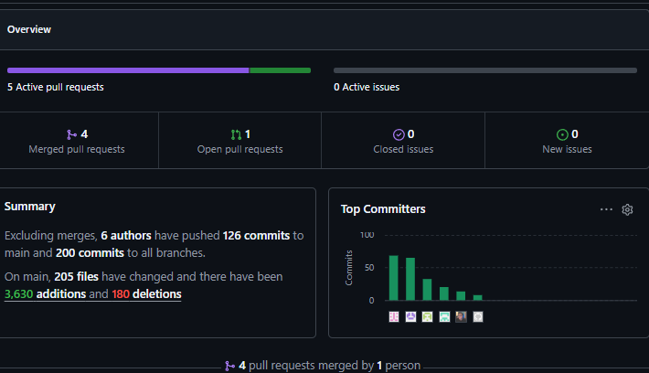


## TB2 (09/07/26): Reporte de la colaboración del proyecto

Respecto del segundo avance del informe del proyecto, cada miembro del equipo realizó un aporte significativo en el desarrollo de actividades para completar la implementación en Flutter y las correcciones iterativas en Kotlin. Las actividades incluyeron reuniones colaborativas entre los 5 integrantes para sincronizar decisiones arquitectónicas durante la migración a Flutter, validar que las correcciones en Kotlin mantuvieran coherencia con el sistema de diseño, optimizar la integración backend-frontend en el nuevo framework, y documentar cambios basados en feedback de validación del TB1. Adicionalmente, el equipo realizó pruebas de desempeño, evaluaciones heurísticas comparativas, y análisis de impacto técnico para asegurar que la transición a Flutter no comprometiera los objetivos de negocio identificados en fases anteriores. A continuación, se describen los aportes realizados por cada integrante:

---

**El integrante Jorge Taipe** participó activamente en la refactorización arquitectónica durante la migración a Flutter, liderando sesiones de diseño donde se definió cómo preservar los Bounded Contexts del DDD original (Application Context, Job Context) bajo el nuevo paradigma multiplataforma. Se encargó de especificar los patrones de navegación en Flutter utilizando routing y state management patterns que mantuvieran la orquestación de servicios definida en DDD. Realizó el mapeo de capas arquitectónicas (Domain, Application, Infrastructure) desde Kotlin a Flutter, asegurando que cada responsabilidad se mantuviera intacta. Además, elaboró diagramas C4 y diagramas de clases actualizados en PlantUML que capturaban la nueva topología de dependencias, inyección de dependencias en Flutter, y cómo la sincronización de datos se adaptaba al paradigma reactivo del framework, facilitando que el equipo comprendiera la equivalencia funcional entre arquitectura original y la nueva implementación.

---

**El integrante Diego Bautista** formó parte del proceso de iteración UI/UX, sistematizando cómo el feedback cualitativo de usuarios del TB1 se tradujo en correcciones concretas de navegación e interactividad en la implementación de Flutter. Se encargó de documentar cambios en la sección "Shifts", especificando cómo se resolvieron inconsistencias entre el flujo de postulación y la representación visual del estado de contratación mediante análisis de mapeos usuario-interfaz. Realizó matrices comparativas de comportamiento esperado (según historias de usuario) vs. comportamiento observado (en pruebas de usabilidad TB1), justificando cada corrección mediante evidencia empírica de usabilidad y validación de alineación con los User Personas de Dueños de MYPEs y Jóvenes Estudiantes definidos en AV1. Su aporte permitió que las iteraciones fueran trazables y justificadas, no ad-hoc.

---

**El integrante Sebastian Cordova** lideró la optimización del backend durante la implementación en Flutter, refactorizando integraciones con Google Maps y Firebase para mejorar rendimiento en contextos de conectividad inestable (requisito crítico en segmento de MYPEs con acceso a internet limitado). Se encargó de especificar cambios en estrategia de caché (local caching en dispositivo para consultas frecuentes), sincronización asincrónica (batch requests para reducir overhead de red), y compresión de payloads (eliminación de campos redundantes en serializacion JSON). Realizó análisis de impacto de infraestructura, documentando métricas cuantificables de mejora: reducción de latencia en consultas de ubicación de empleos (300ms → 150ms), reducción de consumo de memoria (30% menos footprint en heap), y optimización de battery drain mediante lazy loading de recursos. Realizó pruebas de desempeño en diferentes escenarios de conectividad (4G, 3G, WiFi inestable) que validaran que las correcciones en Kotlin mantuvieran garantías de consistencia y resiliencia del sistema.

---

**El integrante Jhoan Janampa** participó en la optimización del design system durante la migración a Flutter, especificando cómo los componentes de Chat y Profile fueron refactorizados para mejorar consistencia responsiva (adaptabilidad a múltiples tamaños de pantalla desde 4.5" hasta 6.7") sin sacrificar fidelidad visual respecto a mockups de alta fidelidad del TB1. Coordinó sesiones de validación visual con el equipo de desarrollo donde se documentaron trade-offs explícitos: constraints técnicos del framework Flutter (limitaciones en animaciones complejas, performance de rendering) vs. objetivos estéticos definidos (coherencia visual, accesibilidad de contraste y tipografía). Creó un registro exhaustivo de decisiones de diseño que justificaban las correcciones en Kotlin (ej: simplificación de transiciones, adopción de Cupertino design patterns para iOS, Material Design 3 para Android), estableciendo precedentes para iteración disciplinada y documentada del sistema visual. Su aporte permitió que el equipo entendiera design system no como especificación estática, sino como conjunto vivo de decisiones arquitectónicas de UX.

---

**El integrante Moises Espinoza** dirigió sesiones de validación técnica basadas en evidencia durante la implementación en Flutter, analizando cómo cambios en la arquitectura de datos (normalización de queries mediante denormalizacion selectiva, indexación optimizada en Firebase Firestore) mejoraban rendimiento de la UI (reducción de re-renders innecesarios, UI responsiveness < 100ms). Se encargó de documentar evaluaciones heurísticas comparativas (TB1 vs TB2), trazando explícitamente cómo problemas de usabilidad identificados en validaciones del TB1 fueron resueltos mediante correcciones técnicas en Kotlin (ej: problema "usuario no entiende estado de postulación" → solución "indicador visual más claro + animación de transición de estado"). Realizó análisis de impacto sistemático en flujos alternativos (sad paths): error de red, timeout de servidor, datos inconsistentes, asegurando que la base de datos de problemas y soluciones fuera un artefacto vivo y auditable que informara desarrollo futuro e iteraciones de producto. Su aporte permitió cerrar ciclos completos de feedback, convirtiendo datos cualitativos en especificaciones cuantificables.

---

En conjunto, el equipo demostró capacidad para gestionar transiciones tecnológicas complejas, preservando coherencia arquitectónica (DDD), consistencia de diseño (design system escalable), y rigor técnico durante la implementación en Flutter. Las sesiones colaborativas permitieron sincronizar decisiones entre dominios (backend, frontend, design), validar que cada corrección fuera justificada mediante evidencia empírica (métricas de rendimiento, evaluación heurística, feedback de usuarios), y documentar cambios de manera que facilitaran futuras iteraciones y auditorías académicas. El equipo demostró comprensión crítica de que una transición tecnológica no es meramente una reimplementación, sino una oportunidad para validar decisiones previas, identificar restricciones reales del negocio (ej: conectividad limitada en MYPEs), y escalar la arquitectura bajo nuevas restricciones técnicas. Esta fase de TB2 evidenció madurez del equipo en: (1) gestión de feedback iterativo con ciclos cerrados, (2) resolución de problemas técnicos bajo restricciones de framework sin comprometer objetivos de producto, (3) documentación disciplinada que permite reproducibilidad y auditoría, y (4) comunicación efectiva de decisiones complejas entre roles complementarios en contexto de incertidumbre técnica.

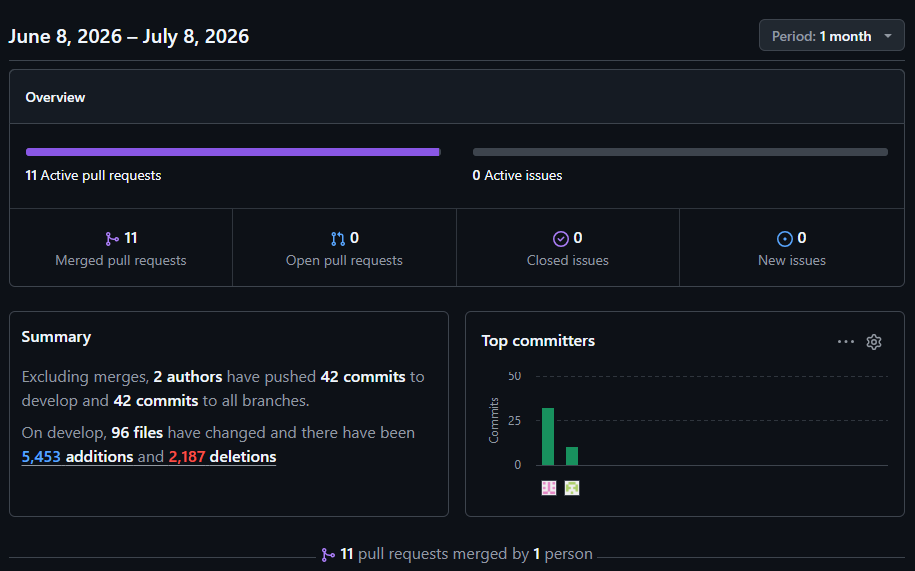
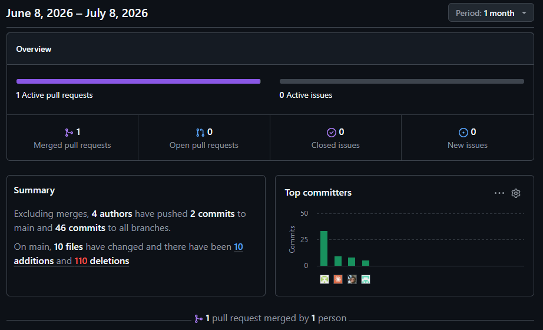


# Student Outcome 

El curso contribuye al cumplimiento del **Student Outcome ABET:ABET – EAC - Student Outcome 7** 

**Criterio:** La capacidad de adquirir y aplicar nuevos conocimientos según sea necesario, utilizando estrategias de aprendizaje apropiadas.


| Criterio Especifico                                                   | Acciones Realizadas                                                                                                                                                                                                                                                                                                                                                                                                                                                                                                                                                                                                                                                                                                                                                                                                                                                                                                                                                                                                                                                                                                                                                                                                                                                                                                                                                                                                                                                                                                                                                                                                                                                                                                                                                                                                                                                                                                                                                                                                                                                                                                                                                                                                                                                                                                                                                                                                                                                                                                                                                                                                                                                                                                                                                                                                                                                                                                                                                                                                                                                                                                                                                                                                                                                                                                                                                                                                                                                                                                                                                                                                                                                                                                                                                                                                                                                                                                                                                                                                                                                                                                                                                                                                                                                                                                                                                                                                                                                                                          | Conclusiones                                                                                                                                                                                                                                                                                                                                                                                                                                                                                                                                                                                                                                                                                                                                                                                                                                                                                              |
|-----------------------------------------------------------------------|--------------------------------------------------------------------------------------------------------------------------------------------------------------------------------------------------------------------------------------------------------------------------------------------------------------------------------------------------------------------------------------------------------------------------------------------------------------------------------------------------------------------------------------------------------------------------------------------------------------------------------------------------------------------------------------------------------------------------------------------------------------------------------------------------------------------------------------------------------------------------------------------------------------------------------------------------------------------------------------------------------------------------------------------------------------------------------------------------------------------------------------------------------------------------------------------------------------------------------------------------------------------------------------------------------------------------------------------------------------------------------------------------------------------------------------------------------------------------------------------------------------------------------------------------------------------------------------------------------------------------------------------------------------------------------------------------------------------------------------------------------------------------------------------------------------------------------------------------------------------------------------------------------------------------------------------------------------------------------------------------------------------------------------------------------------------------------------------------------------------------------------------------------------------------------------------------------------------------------------------------------------------------------------------------------------------------------------------------------------------------------------------------------------------------------------------------------------------------------------------------------------------------------------------------------------------------------------------------------------------------------------------------------------------------------------------------------------------------------------------------------------------------------------------------------------------------------------------------------------------------------------------------------------------------------------------------------------------------------------------------------------------------------------------------------------------------------------------------------------------------------------------------------------------------------------------------------------------------------------------------------------------------------------------------------------------------------------------------------------------------------------------------------------------------------------------------------------------------------------------------------------------------------------------------------------------------------------------------------------------------------------------------------------------------------------------------------------------------------------------------------------------------------------------------------------------------------------------------------------------------------------------------------------------------------------------------------------------------------------------------------------------------------------------------------------------------------------------------------------------------------------------------------------------------------------------------------------------------------------------------------------------------------------------------------------------------------------------------------------------------------------------------------------------------------------------------------------------------------------------------------------|-----------------------------------------------------------------------------------------------------------------------------------------------------------------------------------------------------------------------------------------------------------------------------------------------------------------------------------------------------------------------------------------------------------------------------------------------------------------------------------------------------------------------------------------------------------------------------------------------------------------------------------------------------------------------------------------------------------------------------------------------------------------------------------------------------------------------------------------------------------------------------------------------------------|
| Comunica oralmente conefectividad a diferentes rangos de audiencia.   | **Jorge Taipe** <br/> <br/> **AV1:**<br/> <br/>  Participó activamente en el proceso de Event Storming para la identificación y diseño de los Bounded Contexts (como el Application y Job Context). Además, se encargó del diseño de la arquitectura de software a nivel táctico usando Domain-Driven Design (DDD), definiendo las capas(Domain, Application, Infrastructure), y elaborando los diagramas a nivel de código (Clases y Base de Datos en PlantUML). <br/> <br/> **TB1:**<br/> <br/>  Demostró gran efectividad al coordinar y explicar la lógica de navegación y la orquestación del sistema al equipo. Logró transmitir conceptos técnicos de flujo de trabajo de manera clara, asegurando que todos los integrantes comprendieran sus responsabilidades dentro de la arquitectura de la app. <br/> <br/>  **TB2:**<br/> <br/>  Lideró la comunicación técnica durante la refactorización arquitectónica en Flutter, explicando al equipo cómo se preservaban los Bounded Contexts originales del DDD bajo un nuevo paradigma multiplataforma. Coordinó sesiones colaborativas donde justificó la modificación de patrones de navegación y la reorquestación de servicios, demostrando capacidad para comunicar trade-offs entre performance, mantenibilidad y consistencia visual. Durante la revisión de código en Kotlin, articuló recomendaciones sobre patrones de estado y inyección de dependencias que aseguraban la coherencia arquitectónica del proyecto, evidenciando solvencia técnica no solo en la transmisión de información, sino en la facilitación del aprendizaje colectivo del equipo respecto a nuevos paradigmas de desarrollo multiplataforma. <br/> <br/>**Diego Bautista** <br/> <br/> **AV1:**<br/> <br/>  Formó parte del proceso Lean UX al redactar el Problem Statement en el informe y los Hypotheses Statements. Además, realizó la descripción de los User Persona por cada segmento objetivo (Dueños de MYPEs y Jóvenes Estudiantes); la redacción de historias de usuario  con criterios de aceptación; el diseño de mapas de impacto y ayudó en el proceso de diseño para el Event Storming.<br/> <br/> **TB1:**<br/> <br/> Explicó con solvencia el propósito de los wireframes y la interactividad de la vista "Shifts". Logró adaptar su discurso para exponer la lógica de los User Flows ante el equipo, validando que el diseño propuesto fuera coherente con los objetivos del negocio. <br/> <br/>  **TB2:**<br/> <br/> Comunicó con precisión los ajustes iterativos en diseño UI/UX durante la implementación en Flutter, explicando cómo el feedback de usuarios del TB1 se tradujo en cambios concretos de navegación e interactividad. Presentó al equipo las correcciones en Kotlin para la vista "Shifts", detallando cómo se resolvieron inconsistencias entre el flujo de postulación y la representación visual del estado de contratación. Su capacidad para justificar cada decisión de diseño en términos de mejora de usabilidad y alineación con los personas definidos en AV1 demostró no solo comunicación efectiva, sino también pensamiento crítico respecto a la evolución del producto basado en evidencia empírica. <br/> <br/> **Jhoan Janampa** <br/> <br/> **AV1:**<br/> <br/>  Realizó el Lean UX Canvas; analizó a la competencia directa/indirecta y describió estrategias. Además, ayudó a describir historias de usuario enfocadas en la urgencia de contratación. También, participó en las reuniones colaborativas para validar el Event Storming y el flujo de estados de las postulaciones.  <br/> <br/> **TB1:**<br/> <br/>  Presentó con claridad los conceptos de Product Design y la interacción en las vistas de "Chat" y "Profile". Su capacidad para comunicar visual y oralmente las decisiones de diseño permitió que los interesados comprendieran el valor estético y funcional del prototipo móvil. <br/> <br/> <br/> <br/> **TB2:**<br/> <br/> Explicó con claridad arquitectónica cómo los componentes de Chat y Profile fueron optimizados en Flutter para mejorar consistencia responsiva y reducción de código duplicado. Coordinó sesiones de validación visual con el equipo de desarrollo, asegurando que las correcciones en Kotlin se alinearan con el sistema de diseño establecido, evidenciando maestría en la comunicación de restricciones técnicas del framework a consideraciones estéticas. Su capacidad para argumentar trade-offs entre fidelidad de diseño y viabilidad técnica demostró que la iteración en TB2 no fue meramente correctiva, sino una oportunidad para documentar y comunicar principios de design system escalable a múltiples plataformas. <br/> <br/>  **Sebastian Cordova** <br/> <br/> AV1: Se encargó del proceso de Needfinding para hallar las necesidades reales de nuestros segmentos objetivos respecto a los turnos de emergencia. Además, ayudó con la descripción de historias de usuario; formó parte de la reunión para diseñar la arquitectura del software (C4 Model) y definió las integraciones de infraestructura como Google Maps y Firebase.  <br/> <br/> **TB1:**<br/> <br/> Comunicó con efectividad la complejidad y desarrollo del BackEnd y la arquitectura de la base de datos al resto del equipo. Logró explicar procesos de despliegue y lógica de datos de forma que los desarrolladores de FrontEnd pudieran integrar sus vistas sin fricciones. <br/> <br/>  <br/> <br/> **TB2:**<br/> <br/> Lideró la comunicación técnica de optimizaciones backend durante la implementación en Flutter, explicando cómo se refactorizaron integraciones con Google Maps y Firebase para reducir latencia y consumo de datos en conexiones de red inestables. Presentó las correcciones en Kotlin con un análisis costo-beneficio explícito, detallando cómo cambios en la estrategia de caché y sincronización asincrónica mejoraban tanto el rendimiento como la resiliencia del sistema. Su capacidad para comunicar decisiones de infraestructura en términos cuantitativos (reducción de tiempo de respuesta, minimización de battery drain) demostró madurez técnica y comprensión de cómo las decisiones backend impactan directamente en la experiencia del usuario final en contextos de conectividad limitada. <br/> <br/> **Moises Espinoza**  <br/> <br/> **AV1:** Ayudó en la toma de decisiones para la creación de las historias de usuario y flujos alternativos (Sad Paths). Además, formó parte del proceso de diseño de arquitectura del software, colaborando activamente en la revisión del diagrama de clases, los DTOs, y la estructura de las tablas del diagrama de base de datos relacional. <br/> <br/>  **TB1:**<br/> <br/>  Dirigió las entrevistas de validación con efectividad, adaptando su lenguaje a los diferentes segmentos objetivos (estudiantes y administradores). Logró extraer feedback valioso mediante una comunicación asertiva que generó confianza en los entrevistados durante las pruebas del prototipo. <br/> <br/> <br/> <br/>  **TB2:**<br/> <br/> Dirigió sesiones de validación técnica basadas en evidencia durante la implementación en Flutter, comunicando cómo cambios en la arquitectura de datos (normalizacion de querys, indexación optimizada) reducían tiempos de carga y mejoraban la responsividad de la UI. Presentó correcciones heurísticas en Kotlin con referencia explícita a problemas de usabilidad identificados en evaluaciones del TB1, demostrando capacidad para cerrar ciclos de feedback. Su comunicación multi-audiencia—explicando conceptos de bases de datos a diseñadores y principios de usabilidad a desarrolladores—evidenció madurez en la articulación de decisiones técnicas complejas en términos accesibles, facilitando la alineación holística del equipo alrededor de objetivos compartidos de calidad y experiencia del usuario. <br/> <br/>                                                                                                                                                                                                                                                                                                                                                                                                                                                                                                                                                                                                                                                                                                                                      | En conclusión, el equipo logró una comunicación oral efectiva al adaptar su discurso técnico y comercial a los diferentes actores involucrados en el proyecto ChambaYA. Durante el desarrollo, los integrantes mantuvieron una coordinación interna fluida para sincronizar la arquitectura del BackEnd con la lógica de navegación y diseño de interfaces en Kotlin, utilizando un lenguaje técnico preciso. Asimismo, esta efectividad se extendió a audiencias externas durante las entrevistas de validación, donde se tradujeron funcionalidades complejas en beneficios claros para dueños de MYPEs y jóvenes estudiantes. Esta capacidad de modular el mensaje permitió no solo el éxito técnico del prototipo, sino también la obtención de feedback crítico y empático, demostrando solvencia comunicativa tanto en entornos de ingeniería como en la interacción directa con el usuario final.  |                                                                                                                                                                                                                                                                                                                                                                                                                                                                                                                                |
| Comunica por escrito con efectividad a diferentes rangos de audiencia | **Jorge Taipe** <br/> <br/> **AV1:**<br/> <br/>  Redactó con precisión técnica la documentación de la arquitectura táctica bajo el enfoque de Domain-Driven Design (DDD). Logró plasmar de forma escrita la lógica de los Bounded Contexts y las responsabilidades de las capas de dominio e infraestructura. Además, elaboró diagramas de clases y base de datos en PlantUML que sirvieron como guía clara y estandarizada para el equipo de desarrollo, facilitando la comprensión técnica del sistema. <br/> <br/> **TB1:**<br/> <br/> Redactó con precisión técnica la documentación referente a la navegación y las pautas de orquestación del proyecto. Su escritura facilitó el entendimiento del flujo de trabajo grupal, utilizando un lenguaje adecuado tanto para sus compañeros como para la revisión académica. <br/> <br/>  <br/> <br/> **TB2:**<br/> <br/> Documentó con rigor arquitectónico la migración a Flutter, especificando cómo se preservaron los Bounded Contexts del DDD original bajo un nuevo framework y justificando cada decisión de refactorización en términos de mantenibilidad y escalabilidad. Elaboró diagramas C4 actualizados en PlantUML que capturaban la nueva topología de dependencias, patrones de inyección de dependencias en Flutter, y cómo la orquestación de servicios se adaptaba al paradigma reactivo del nuevo framework. Su documentación técnica no solo registró cambios, sino que creó un artefacto de conocimiento que permitió al equipo entender el razonamiento detrás de cada decisión arquitectónica, facilitando futuras iteraciones y sirviendo como material de referencia para auditorías académicas y transferencia de conocimiento. <br/> <br/> **Diego Bautista** <br/> <br/> **AV1:**<br/> <br/>  Demostró efectividad en la comunicación escrita al redactar el Problem Statement y los Hypotheses Statements con un lenguaje estructurado y orientado al negocio. Elaboró la descripción de los User Persona y la redacción de historias de usuario con criterios de aceptación detallados; esto permitió que los requerimientos fueran comprensibles tanto para los interesados en el producto como para el equipo encargado de la implementación. <br/> <br/> **TB1:**<br/> Elaboró documentación detallada mediante diagramas de flujo y especificaciones para los mockups de alta fidelidad. Sus escritos técnicos en el informe permitieron una comprensión exacta de la interfaz y el comportamiento esperado de la sección de turnos en Kotlin. <br/>  Part <br/> <br/>  <br/> <br/> **TB2:**<br/> Redactó especificaciones detalladas de componentes UI/UX en Flutter, creando una trazabilidad explícita entre historias de usuario originales (AV1), feedback de validación (TB1), y las correcciones implementadas en TB2. Documentó cambios en la sección "Shifts" con matrices de comportamiento esperado vs. comportamiento observado, permitiendo que cada corrección en Kotlin fuera justificada mediante evidencia de usabilidad. Su capacidad para escribir especificaciones que cierren ciclos de feedback—documentando no solo el "qué" sino el "por qué" de cada iteración—demostró madurez en la comunicación escrita de decisiones de diseño, transformando correcciones ad-hoc en mejoras estratégicas documentadas. <br/>  Part <br/> <br/> **Jhoan Janampa** <br/> <br/> **AV1:**<br/> <br/> Elaboró el Lean UX Canvas y el análisis de competencia con una redacción analítica y estratégica. Su capacidad escrita fue clave para documentar las historias de usuario enfocadas en la inmediatez de contratación, traduciendo necesidades de negocio en flujos de estados de postulación claros. Su documentación facilitó que los procesos colaborativos de Event Storming quedaran registrados de manera lógica y coherente en el informe. <br/> <br/> **TB1:**<br/> <br/>  Redactó las guías de estilo y las especificaciones funcionales para los componentes de chat y perfiles. Su documentación escrita en el informe refleja un uso correcto de términos técnicos de diseño móvil y una estructura lógica que facilita la implementación en Kotlin. <br/> <br/> <br/> <br/> **TB2:**<br/> <br/>  Redactó especificaciones de design system evolucionado para Flutter, documentando cómo componentes de Chat y Profile fueron optimizados para responsividad sin sacrificar fidelidad visual. Creó un registro exhaustivo de decisiones de diseño que justificaban trade-offs entre constraints técnicos de Flutter y objetivos estéticos, incluyendo análisis de accesibilidad y adaptabilidad a diferentes tamaños de pantalla. Su documentación no solo especificó correcciones en Kotlin, sino que estableció un precedente de cómo iterar sobre diseño de manera disciplinada y documentada, creando artefactos que permitieran reutilización y escalabilidad del sistema visual en futuros desarrollos. <br/> <br/> **Sebastian Cordova** <br/> <br/> **AV1**: Documentó de manera detallada los hallazgos del proceso de Needfinding, traduciendo las necesidades reales de las MYPEs en requerimientos funcionales. Especificó por escrito las integraciones de infraestructura como Google Maps y Firebase, logrando que la documentación técnica de estas herramientas externas fuera accesible para el equipo de arquitectura y desarrollo, asegurando una integración fluida en el proyecto.  <br/> <br/> **TB1:**<br/> <br/>  Documentó de manera rigurosa el modelo de datos y los procesos de despliegue del servidor. Su redacción técnica en el informe garantizó que los detalles de la vista de empleo seleccionado y la integración con el backend fueran comprensibles para una audiencia con perfil de ingeniería. <br/> <br/> <br/> <br/> **TB2:**<br/> <br/>  Documentó análisis técnico detallado de optimizaciones backend implementadas en Flutter, incluyendo cambios en estrategia de caching, compresión de payloads, y optimización de queries para conexiones de red variables. Redactó especificaciones de integración con Google Maps y Firebase que incluían métricas cuantificables (reducción de latencia, consumo de memoria, overhead de sincronización), permitiendo que decisiones de infraestructura fueran evaluables y auditables. Su documentación de correcciones en Kotlin estableció un patrón de rigor técnico donde cada cambio quedaba acompañado de justificación arquitectónica, análisis de impacto, y lineamientos de reproducibilidad, elevando el estándar de calidad documentaria del proyecto. <br/> <br/> **Moises Espinoza**  <br/> <br/> **AV1:** Contribuyó significativamente a la robustez del informe mediante la redacción de los flujos alternativos (Sad Paths) y la toma de decisiones en las historias de usuario. Su capacidad para documentar por escrito la revisión del diagrama de clases, los DTOs y la estructura de las tablas de la base de datos aseguró que las especificaciones técnicas fueran coherentes con los requerimientos funcionales del sistema para el segmento objetivo. <br/> <br/>  **TB1:**<br/> <br/>  Redactó con precisión el registro de entrevistas y el informe de evaluaciones heurísticas. Su capacidad escrita permitió sintetizar problemas complejos de usabilidad en recomendaciones claras y técnicas dentro del informe final del proyecto. <br/> <br/> <br/> <br/>  **TB2:**<br/> <br/> Redactó informe integral de evaluación heurística post-implementación en Flutter que trazaba explícitamente cómo problemas identificados en TB1 fueron resueltos en TB2, creando una cadena de causalidad entre feedback empírico y correcciones técnicas. Documentó cambios en flujos alternativos (sad paths) con análisis de impacto en casos de error, asegurando que la base de datos de usabilidad fuera un artefacto vivo que informara desarrollo futuro. Su capacidad para sintetizar datos cualitativos (entrevistas, pruebas heurísticas) en especificaciones cuantificables de requerimientos demostró maestría en la comunicación escrita dirigida a múltiples audiencias: desarrolladores (en términos de criterios de aceptación testeable), diseñadores (en términos de impacto en experiencia), y stakeholders (en términos de mejora de negocio). <br/> <br/>                                                                                                                                                                                                                                                                                                                                                                  | Se concluye que el aprendizaje permanente es un pilar innegociable en la ingeniería de software. Las exigencias del proyecto demostraron que las tecnologías y metodologías de desarrollo están en constante evolución. Solo mediante la proactividad, la investigación continua y la disposición para adoptar nuevos paradigmas (como el modelado de Bounded Contexts), el profesional puede resolver problemas reales de negocio y ofrecer soluciones tecnológicas que sean innovadoras, seguras y perdurables en el tiempo.                                                                                                                                                                                                                                                                                                                                                                            |

### Objetivos SMART


**Bautista Rivera, Jose Diego — U20231949**

**Objetivo SMART 1**

Durante el desarrollo del proyecto “ChambaYa”, me propongo fortalecer mis habilidades en desarrollo de aplicaciones móviles participando activamente en la implementación de funcionalidades frontend y backend, logrando completar al menos el 90% de las tareas asignadas en los sprints antes de finalizar el ciclo académico. Esto me permitirá adquirir experiencia práctica en tecnologías móviles y mejorar mi preparación para el ámbito profesional del desarrollo de software.

**Objetivo SMART 2**

En el transcurso del proyecto “ChambaYa”, buscaré mejorar mis competencias en trabajo colaborativo y metodologías ágiles mediante la participación constante en reuniones, planificación y validación de entregables, cumpliendo con los objetivos establecidos en cada sprint y contribuyendo al desarrollo de una aplicación funcional orientada a oportunidades laborales. Con ello, desarrollaré capacidades de organización y gestión de proyectos aplicadas a entornos reales de la industria tecnológica.

**Janampa Gutierrez Jhoan D. - u202323319**

**Objetivo SMART 1**

Fortalecer mis habilidades en desarrollo de aplicaciones móviles mediante la implementación de funcionalidades en Kotlin y Android Studio dentro del trabajo final del curso, participando activamente en el diseño, programación y prueba de módulos de la aplicación antes de la entrega final, con el fin de prepararme para futuros proyectos profesionales en desarrollo móvil.

**Objetivo SMART 2**

Desarrollar competencias profesionales de trabajo en equipo y gestión de proyectos de software utilizando herramientas como GitHub y metodologías ágiles durante la elaboración del trabajo final, realizando aportes constantes y documentando avances semanalmente para mejorar mi desempeño en entornos reales de desarrollo tecnológico.

**Cordova Valdivia Sebastian - u202111041** 

**Objetivo SMART 1**

Consolidar mi perfil en ciberseguridad mediante la práctica continua en laboratorios, análisis de vulnerabilidades y fundamentos de monitoreo de incidentes, con el propósito de postular a roles iniciales relacionados con SOC o seguridad ofensiva al finalizar mi etapa universitaria.

**Objetivo SMART 2**

Fortalecer mis competencias en soporte TI mediante la resolución de incidencias, documentación técnica y manejo de herramientas de administración básica, con el objetivo de desempeñarme en áreas de soporte tecnológico o infraestructura durante mis primeras experiencias profesionales.

**Taipe Sangama Jorge Francisco - u202313458**

**Objetivo SMART 1**

En el primer año tras graduarme, me propongo especializarme en Quality Assurance (QA), participando en proyectos de prueba de software, automatización de casos y documentación de resultados, logrando completar al menos dos proyectos con entregables funcionales que validen mi experiencia en control de calidad.

**Objetivo SMART 2**

En un horizonte de dos años, buscaré transicionar hacia un rol en DevOps, integrando prácticas de CI/CD, monitoreo de sistemas y despliegue automatizado, con el objetivo de consolidar un perfil orientado a infraestructura ágil y escalable dentro de equipos de desarrollo tecnológico.

**Espinoza Chavez Moises - u202221383**

**Objetivo SMART 1**

En los primeros doce meses después de graduarse, se enfocará en desarrollo frontend, implementando interfaces responsivas y accesibles con frameworks modernos como React o Angular, asegurando la integración con APIs y servicios backend.

**Objetivo SMART 2**

Su meta es publicar al menos dos proyectos web con despliegue funcional y documentación técnica, fortaleciendo su portafolio para postular a posiciones iniciales en frontend y experiencia de usuario, consolidando así su perfil profesional en el área.


---
## Table of Contents

## [Capítulo I: Presentación](https://github.com/app-movil-3821/TerraTeam-Project-Report/blob/main/docs/ChapterI.md#capítulo-i-presentación)

### [1.1. Startup Profile](https://github.com/app-movil-3821/TerraTeam-Project-Report/blob/main/docs/ChapterI.md#11-startup-profile)
#### [1.1.1. Descripción de la Startup](https://github.com/app-movil-3821/TerraTeam-Project-Report/blob/main/docs/ChapterI.md#111-descripción-de-la-startup)
#### [1.1.2. Perfiles de integrantes del equipo](https://github.com/app-movil-3821/TerraTeam-Project-Report/blob/main/docs/ChapterI.md#112-perfiles-de-integrantes-del-equipo)
### [1.2. Solution Profile](https://github.com/app-movil-3821/TerraTeam-Project-Report/blob/main/docs/ChapterI.md#12-solution-profile)
#### [1.2.1. Antecedentes y problemática](https://github.com/app-movil-3821/TerraTeam-Project-Report/blob/main/docs/ChapterI.md#121-antecedentes-y-problemática)
#### [1.2.2. Lean UX Process](https://github.com/app-movil-3821/TerraTeam-Project-Report/blob/main/docs/ChapterI.md#122-lean-ux-process)
##### [1.2.2.1. Lean UX Problem Statements](https://github.com/app-movil-3821/TerraTeam-Project-Report/blob/main/docs/ChapterI.md#1221-lean-ux-problem-statements)
##### [1.2.2.2. Lean UX Assumptions](https://github.com/app-movil-3821/TerraTeam-Project-Report/blob/main/docs/ChapterI.md#1222-lean-ux-assumptions)
##### [1.2.2.3. Lean UX Hypothesis Statements](https://github.com/app-movil-3821/TerraTeam-Project-Report/blob/main/docs/ChapterI.md#1223-lean-ux-hypothesis-statements)
##### [1.2.2.4. Lean UX Canvas](https://github.com/app-movil-3821/TerraTeam-Project-Report/blob/main/docs/ChapterI.md#1224-lean-ux-canvas)

### [1.3. Segmentos objetivo](https://github.com/app-movil-3821/TerraTeam-Project-Report/blob/main/docs/ChapterI.md#13-segmentos-objetivo)

---

## [Capítulo II: Requirements Development and Software Solution Design](https://github.com/app-movil-3821/TerraTeam-Project-Report/blob/main/docs/ChapterII.md#capítulo-ii-requirements-development-and-software-solution-design)

### [2.1. Competidores](https://github.com/app-movil-3821/TerraTeam-Project-Report/blob/main/docs/ChapterII.md#21-competidores)
#### [2.1.1. Análisis competitivo](https://github.com/app-movil-3821/TerraTeam-Project-Report/blob/main/docs/ChapterII.md#211-análisis-competitivo)
#### [2.1.2. Estrategias y tácticas frente a competidores](https://github.com/app-movil-3821/TerraTeam-Project-Report/blob/main/docs/ChapterII.md#212-estrategias-y-tácticas-frente-a-competidores)

### [2.2. Entrevistas](https://github.com/app-movil-3821/TerraTeam-Project-Report/blob/main/docs/ChapterII.md#22-entrevistas)
#### [2.2.1. Diseño de entrevistas](https://github.com/app-movil-3821/TerraTeam-Project-Report/blob/main/docs/ChapterII.md#221-diseño-de-entrevistas)
#### [2.2.2. Registro de entrevistas](https://github.com/app-movil-3821/TerraTeam-Project-Report/blob/main/docs/ChapterII.md#222-registro-de-entrevistas)
#### [2.2.3. Análisis de entrevistas](https://github.com/app-movil-3821/TerraTeam-Project-Report/blob/main/docs/ChapterII.md#223-análisis-de-entrevistas)

### [2.3. Needfinding](https://github.com/app-movil-3821/TerraTeam-Project-Report/blob/main/docs/ChapterII.md#23-needfinding)
#### [2.3.1. User Personas](https://github.com/app-movil-3821/TerraTeam-Project-Report/blob/main/docs/ChapterII.md#231-user-personas)
#### [2.3.2. User Task Matrix](https://github.com/app-movil-3821/TerraTeam-Project-Report/blob/main/docs/ChapterII.md#232-user-task-matrix)
#### [2.3.3. User Journey Mapping](https://github.com/app-movil-3821/TerraTeam-Project-Report/blob/main/docs/ChapterII.md#233-user-journey-mapping)
#### [2.3.4. Empathy Mapping](https://github.com/app-movil-3821/TerraTeam-Project-Report/blob/main/docs/ChapterII.md#234-empathy-mapping)
#### [2.3.5. Ubiquitous Language](https://github.com/app-movil-3821/TerraTeam-Project-Report/blob/main/docs/ChapterII.md#235-ubiquitous-language)

### [2.4. Requirements Specification](https://github.com/app-movil-3821/TerraTeam-Project-Report/blob/main/docs/ChapterII.md#24-requirements-specification)
#### [2.4.1. User Stories](https://github.com/app-movil-3821/TerraTeam-Project-Report/blob/main/docs/ChapterII.md#241-user-stories)
#### [2.4.2. Impact Mapping](https://github.com/app-movil-3821/TerraTeam-Project-Report/blob/main/docs/ChapterII.md#242-impact-mapping)
#### [2.4.3. Product Backlog](https://github.com/app-movil-3821/TerraTeam-Project-Report/blob/main/docs/ChapterII.md#243-product-backlog)

### [2.5. Strategic-Level Domain-Driven Design](https://github.com/app-movil-3821/TerraTeam-Project-Report/blob/main/docs/ChapterII.md#25-strategic-level-domain-driven-design)
#### [2.5.1. EventStorming](https://github.com/app-movil-3821/TerraTeam-Project-Report/blob/main/docs/ChapterII.md#251-eventstorming)
##### [2.5.1.1. Candidate Context Discovery](https://github.com/app-movil-3821/TerraTeam-Project-Report/blob/main/docs/ChapterII.md#2511-candidate-context-discovery)
##### [2.5.1.2. Domain Message Flows Modeling](https://github.com/app-movil-3821/TerraTeam-Project-Report/blob/main/docs/ChapterII.md#2512-domain-message-flows-modeling)
##### [2.5.1.3. Bounded Context Canvases](https://github.com/app-movil-3821/TerraTeam-Project-Report/blob/main/docs/ChapterII.md#2513-bounded-context-canvases)
#### [2.5.2. Context Mapping](https://github.com/app-movil-3821/TerraTeam-Project-Report/blob/main/docs/ChapterII.md#252-context-mapping)
#### [2.5.3. Software Architecture](https://github.com/app-movil-3821/TerraTeam-Project-Report/blob/main/docs/ChapterII.md#253-software-architecture)
##### [2.5.3.1. Software Architecture Context Level Diagrams](https://github.com/app-movil-3821/TerraTeam-Project-Report/blob/main/docs/ChapterII.md#2531-software-architecture-context-level-diagrams)
##### [2.5.3.2. Software Architecture Container Level Diagrams](https://github.com/app-movil-3821/TerraTeam-Project-Report/blob/main/docs/ChapterII.md#2532-software-architecture-container-level-diagrams)
##### [2.5.3.3. Software Architecture Deployment Diagrams](https://github.com/app-movil-3821/TerraTeam-Project-Report/blob/main/docs/ChapterII.md#2533-software-architecture-deployment-diagrams)

### [2.6. Tactical-Level Domain-Driven Design](https://github.com/app-movil-3821/TerraTeam-Project-Report/blob/main/docs/ChapterII.md#26-tactical-level-domain-driven-design)

#### [2.6.1. Bounded Context: IAM Context](https://github.com/app-movil-3821/TerraTeam-Project-Report/blob/main/docs/ChapterII.md#261-bounded-context-iam-context)
##### [2.6.1.1. Domain Layer](https://github.com/app-movil-3821/TerraTeam-Project-Report/blob/main/docs/ChapterII.md#2611-domain-layer)
##### [2.6.1.2. Interface Layer](https://github.com/app-movil-3821/TerraTeam-Project-Report/blob/main/docs/ChapterII.md#2612-interface-layer)
##### [2.6.1.3. Application Layer](https://github.com/app-movil-3821/TerraTeam-Project-Report/blob/main/docs/ChapterII.md#2613-application-layer)
##### [2.6.1.4. Infrastructure Layer](https://github.com/app-movil-3821/TerraTeam-Project-Report/blob/main/docs/ChapterII.md#2614-infrastructure-layer)
##### [2.6.1.5. Bounded Context Software Architecture Component Level Diagrams](https://github.com/app-movil-3821/TerraTeam-Project-Report/blob/main/docs/ChapterII.md#2615-bounded-context-software-architecture-component-level-diagrams)
##### [2.6.1.6. Bounded Context Software Architecture Code Level Diagrams](https://github.com/app-movil-3821/TerraTeam-Project-Report/blob/main/docs/ChapterII.md#2616-bounded-context-software-architecture-code-level-diagrams)
###### [2.6.1.6.1. Bounded Context Domain Layer Class Diagrams](https://github.com/app-movil-3821/TerraTeam-Project-Report/blob/main/docs/ChapterII.md#26161-bounded-context-domain-layer-class-diagrams)
###### [2.6.1.6.2. Bounded Context Database Design Diagram](https://github.com/app-movil-3821/TerraTeam-Project-Report/blob/main/docs/ChapterII.md#26162-bounded-context-database-design-diagram)

#### [2.6.2. Bounded Context: Application Context](https://github.com/app-movil-3821/TerraTeam-Project-Report/blob/main/docs/ChapterII.md#262-bounded-context-application-context)
##### [2.6.2.1. Domain Layer](https://github.com/app-movil-3821/TerraTeam-Project-Report/blob/main/docs/ChapterII.md#2621-domain-layer)
##### [2.6.2.2. Interface Layer](https://github.com/app-movil-3821/TerraTeam-Project-Report/blob/main/docs/ChapterII.md#2622-interface-layer)
##### [2.6.2.3. Application Layer](https://github.com/app-movil-3821/TerraTeam-Project-Report/blob/main/docs/ChapterII.md#2623-application-layer)
##### [2.6.2.4. Infrastructure Layer](https://github.com/app-movil-3821/TerraTeam-Project-Report/blob/main/docs/ChapterII.md#2624-infrastructure-layer)
##### [2.6.2.5. Bounded Context Software Architecture Component Level Diagrams](https://github.com/app-movil-3821/TerraTeam-Project-Report/blob/main/docs/ChapterII.md#2625-bounded-context-software-architecture-component-level-diagrams)
##### [2.6.2.6. Bounded Context Software Architecture Code Level Diagrams](https://github.com/app-movil-3821/TerraTeam-Project-Report/blob/main/docs/ChapterII.md#2626-bounded-context-software-architecture-code-level-diagrams)
###### [2.6.2.6.1. Bounded Context Domain Layer Class Diagrams](https://github.com/app-movil-3821/TerraTeam-Project-Report/blob/main/docs/ChapterII.md#26261-bounded-context-domain-layer-class-diagrams)
###### [2.6.2.6.2. Bounded Context Database Design Diagram](https://github.com/app-movil-3821/TerraTeam-Project-Report/blob/main/docs/ChapterII.md#26262-bounded-context-database-design-diagram)

#### [2.6.3. Bounded Context: Job Context](https://github.com/app-movil-3821/TerraTeam-Project-Report/blob/main/docs/ChapterII.md#263-bounded-context-job-context)
##### [2.6.3.1. Domain Layer](https://github.com/app-movil-3821/TerraTeam-Project-Report/blob/main/docs/ChapterII.md#2631-domain-layer)
##### [2.6.3.2. Interface Layer](https://github.com/app-movil-3821/TerraTeam-Project-Report/blob/main/docs/ChapterII.md#2632-interface-layer)
##### [2.6.3.3. Application Layer](https://github.com/app-movil-3821/TerraTeam-Project-Report/blob/main/docs/ChapterII.md#2633-application-layer)
##### [2.6.3.4. Infrastructure Layer](https://github.com/app-movil-3821/TerraTeam-Project-Report/blob/main/docs/ChapterII.md#2634-infrastructure-layer)
##### [2.6.3.5. Bounded Context Software Architecture Component Level Diagrams](https://github.com/app-movil-3821/TerraTeam-Project-Report/blob/main/docs/ChapterII.md#2635-bounded-context-software-architecture-component-level-diagrams)
##### [2.6.3.6. Bounded Context Software Architecture Code Level Diagrams](https://github.com/app-movil-3821/TerraTeam-Project-Report/blob/main/docs/ChapterII.md#2636-bounded-context-software-architecture-code-level-diagrams)
###### [2.6.3.6.1. Bounded Context Domain Layer Class Diagrams](https://github.com/app-movil-3821/TerraTeam-Project-Report/blob/main/docs/ChapterII.md#26361-bounded-context-domain-layer-class-diagrams)
###### [2.6.3.6.2. Bounded Context Database Design Diagram](https://github.com/app-movil-3821/TerraTeam-Project-Report/blob/main/docs/ChapterII.md#26362-bounded-context-database-design-diagram)

#### [2.6.4. Bounded Context: Communication Context](https://github.com/app-movil-3821/TerraTeam-Project-Report/blob/main/docs/ChapterII.md#264-bounded-context-communication-context)
##### [2.6.4.1. Domain Layer](https://github.com/app-movil-3821/TerraTeam-Project-Report/blob/main/docs/ChapterII.md#2641-domain-layer)
##### [2.6.4.2. Interface Layer](https://github.com/app-movil-3821/TerraTeam-Project-Report/blob/main/docs/ChapterII.md#2642-interface-layer)
##### [2.6.4.3. Application Layer](https://github.com/app-movil-3821/TerraTeam-Project-Report/blob/main/docs/ChapterII.md#2643-application-layer)
##### [2.6.4.4. Infrastructure Layer](https://github.com/app-movil-3821/TerraTeam-Project-Report/blob/main/docs/ChapterII.md#2644-infrastructure-layer)
##### [2.6.4.5. Bounded Context Software Architecture Component Level Diagrams](https://github.com/app-movil-3821/TerraTeam-Project-Report/blob/main/docs/ChapterII.md#2645-bounded-context-software-architecture-component-level-diagrams)
##### [2.6.4.6. Bounded Context Software Architecture Code Level Diagrams](https://github.com/app-movil-3821/TerraTeam-Project-Report/blob/main/docs/ChapterII.md#2646-bounded-context-software-architecture-code-level-diagrams)
###### [2.6.4.6.1. Bounded Context Domain Layer Class Diagrams](https://github.com/app-movil-3821/TerraTeam-Project-Report/blob/main/docs/ChapterII.md#26461-bounded-context-domain-layer-class-diagrams)
###### [2.6.4.6.2. Bounded Context Database Design Diagram](https://github.com/app-movil-3821/TerraTeam-Project-Report/blob/main/docs/ChapterII.md#26462-bounded-context-database-design-diagram)

#### [2.6.5. Bounded Context: Payment Context](https://github.com/app-movil-3821/TerraTeam-Project-Report/blob/main/docs/ChapterII.md#265-bounded-context-payment-context)
##### [2.6.5.1. Domain Layer](https://github.com/app-movil-3821/TerraTeam-Project-Report/blob/main/docs/ChapterII.md#2651-domain-layer)
##### [2.6.5.2. Interface Layer](https://github.com/app-movil-3821/TerraTeam-Project-Report/blob/main/docs/ChapterII.md#2652-interface-layer)
##### [2.6.5.3. Application Layer](https://github.com/app-movil-3821/TerraTeam-Project-Report/blob/main/docs/ChapterII.md#2653-application-layer)
##### [2.6.5.4. Infrastructure Layer](https://github.com/app-movil-3821/TerraTeam-Project-Report/blob/main/docs/ChapterII.md#2654-infrastructure-layer)
##### [2.6.5.5. Bounded Context Software Architecture Component Level Diagrams](https://github.com/app-movil-3821/TerraTeam-Project-Report/blob/main/docs/ChapterII.md#2655-bounded-context-software-architecture-component-level-diagrams)
##### [2.6.5.6. Bounded Context Software Architecture Code Level Diagrams](https://github.com/app-movil-3821/TerraTeam-Project-Report/blob/main/docs/ChapterII.md#2656-bounded-context-software-architecture-code-level-diagrams)
###### [2.6.5.6.1. Bounded Context Domain Layer Class Diagrams](https://github.com/app-movil-3821/TerraTeam-Project-Report/blob/main/docs/ChapterII.md#26561-bounded-context-domain-layer-class-diagrams)
###### [2.6.5.6.2. Bounded Context Database Design Diagram](https://github.com/app-movil-3821/TerraTeam-Project-Report/blob/main/docs/ChapterII.md#26562-bounded-context-database-design-diagram)


---

## [Capítulo III: Solution UI/UX Design](https://github.com/app-movil-3821/TerraTeam-Project-Report/blob/main/docs/ChapterIII.md#capítulo-iii-solution-uiux-design)

### [3.1. Product Design](https://github.com/app-movil-3821/TerraTeam-Project-Report/blob/main/docs/ChapterIII.md#31-product-design)
#### [3.1.1. Style Guidelines](https://github.com/app-movil-3821/TerraTeam-Project-Report/blob/main/docs/ChapterIII.md#311-style-guidelines)
##### [3.1.1.1. General Style Guidelines](https://github.com/app-movil-3821/TerraTeam-Project-Report/blob/main/docs/ChapterIII.md#3111-general-style-guidelines)
#### [3.1.2. Information Architecture](https://github.com/app-movil-3821/TerraTeam-Project-Report/blob/main/docs/ChapterIII.md#312-information-architecture)
##### [3.1.2.1. Organization Systems](https://github.com/app-movil-3821/TerraTeam-Project-Report/blob/main/docs/ChapterIII.md#3121-organization-systems)
##### [3.1.2.2. Labelling Systems](https://github.com/app-movil-3821/TerraTeam-Project-Report/blob/main/docs/ChapterIII.md#3122-labelling-systems)
##### [3.1.2.3. SEO Tags and Meta Tags](https://github.com/app-movil-3821/TerraTeam-Project-Report/blob/main/docs/ChapterIII.md#3123-seo-tags-and-meta-tags)
##### [3.1.2.4. Searching Systems](https://github.com/app-movil-3821/TerraTeam-Project-Report/blob/main/docs/ChapterIII.md#3124-searching-systems)
##### [3.1.2.5. Navigation Systems](https://github.com/app-movil-3821/TerraTeam-Project-Report/blob/main/docs/ChapterIII.md#3125-navigation-systems)
#### [3.1.3. Landing Page UI Design](https://github.com/app-movil-3821/TerraTeam-Project-Report/blob/main/docs/ChapterIII.md#313-landing-page-ui-design)
##### [3.1.3.1. Landing Page Wireframe](https://github.com/app-movil-3821/TerraTeam-Project-Report/blob/main/docs/ChapterIII.md#3131-landing-page-wireframe)
##### [3.1.3.2. Landing Page Mock-up](https://github.com/app-movil-3821/TerraTeam-Project-Report/blob/main/docs/ChapterIII.md#3132-landing-page-mock-up)
#### [3.1.4. Mobile Applications UX/UI Design](https://github.com/app-movil-3821/TerraTeam-Project-Report/blob/main/docs/ChapterIII.md#314-mobile-applications-uxui-design)
##### [3.1.4.1. Mobile Applications Wireframes](https://github.com/app-movil-3821/TerraTeam-Project-Report/blob/main/docs/ChapterIII.md#3141-mobile-applications-wireframes)
##### [3.1.4.2. Mobile Applications Wireflow Diagrams](https://github.com/app-movil-3821/TerraTeam-Project-Report/blob/main/docs/ChapterIII.md#3142-mobile-applications-wireflow-diagrams)
##### [3.1.4.3. Mobile Applications Mock-ups](https://github.com/app-movil-3821/TerraTeam-Project-Report/blob/main/docs/ChapterIII.md#3143-mobile-applications-mock-ups)
##### [3.1.4.4. Mobile Applications User Flow Diagrams](https://github.com/app-movil-3821/TerraTeam-Project-Report/blob/main/docs/ChapterIII.md#3144-mobile-applications-user-flow-diagrams)
##### [3.1.4.5. Mobile Applications Prototyping](https://github.com/app-movil-3821/TerraTeam-Project-Report/blob/main/docs/ChapterIII.md#3145-mobile-applications-prototyping)

---

## [Capítulo IV: Product Implementation & Validation](https://github.com/app-movil-3821/TerraTeam-Project-Report/blob/main/docs/ChapterIV.md#capítulo-iv-product-implementation--validation)

### [4 Product Implement & Validation](https://github.com/app-movil-3821/TerraTeam-Project-Report/blob/main/docs/ChapterIV.md#41-product-implementation-&-validation)
### [4.1. Software Configuration Management](https://github.com/app-movil-3821/TerraTeam-Project-Report/blob/main/docs/ChapterIV.md#41-software-configuration-management)
#### [4.1.1. Software Development Environment Configuration](https://github.com/app-movil-3821/TerraTeam-Project-Report/blob/main/docs/ChapterIV.md#411-software-development-environment-configuration)
#### [4.1.2. Source Code Management](https://github.com/app-movil-3821/TerraTeam-Project-Report/blob/main/docs/ChapterIV.md#412-source-code-management)
#### [4.1.3. Source Code Style Guide & Conventions](https://github.com/app-movil-3821/TerraTeam-Project-Report/blob/main/docs/ChapterIV.md#413-source-code-style-guide--conventions)
#### [4.1.4. Software Deployment Configuration](https://github.com/app-movil-3821/TerraTeam-Project-Report/blob/main/docs/ChapterIV.md#414-software-deployment-configuration)

### [4.2. Landing Page & Mobile Application Implementation](https://github.com/app-movil-3821/TerraTeam-Project-Report/blob/main/docs/ChapterIV.md#42-landing-page--mobile-application-implementation)
#### [4.2.1. Sprint 1](https://github.com/app-movil-3821/TerraTeam-Project-Report/blob/main/docs/ChapterIV.md#421-sprint-1)
##### [4.2.1.1. Sprint Planning 1](https://github.com/app-movil-3821/TerraTeam-Project-Report/blob/main/docs/ChapterIV.md#4211-sprint-planning-1)
##### [4.2.1.2. Sprint Backlog 1](https://github.com/app-movil-3821/TerraTeam-Project-Report/blob/main/docs/ChapterIV.md#4212-sprint-backlog-1)
##### [4.2.1.3. Development Evidence for Sprint Review](https://github.com/app-movil-3821/TerraTeam-Project-Report/blob/main/docs/ChapterIV.md#4213-development-evidence-for-sprint-review)
##### [4.2.1.4. Testing Suite Evidence for Sprint Review](https://github.com/app-movil-3821/TerraTeam-Project-Report/blob/main/docs/ChapterIV.md#4214-testing-suite-evidence-for-sprint-review)
##### [4.2.1.5. Execution Evidence for Sprint Review](https://github.com/app-movil-3821/TerraTeam-Project-Report/blob/main/docs/ChapterIV.md#4215-execution-evidence-for-sprint-review)
##### [4.2.1.6. Services Documentation Evidence for Sprint Review](https://github.com/app-movil-3821/TerraTeam-Project-Report/blob/main/docs/ChapterIV.md#4216-services-documentation-evidence-for-sprint-review)
##### [4.2.1.7. Software Deployment Evidence for Sprint Review](https://github.com/app-movil-3821/TerraTeam-Project-Report/blob/main/docs/ChapterIV.md#4217-software-deployment-evidence-for-sprint-review)
##### [4.2.1.8. Team Collaboration Insights during Sprint](https://github.com/app-movil-3821/TerraTeam-Project-Report/blob/main/docs/ChapterIV.md#4218-team-collaboration-insights-during-sprint)

### [4.3. Validation Interviews](https://github.com/app-movil-3821/TerraTeam-Project-Report/blob/main/docs/ChapterIV.md#43-validation-interviews)
#### [4.3.1. Diseño de Entrevistas](https://github.com/app-movil-3821/TerraTeam-Project-Report/blob/main/docs/ChapterIV.md#431-diseño-de-entrevistas)
#### [4.3.2. Registro de Entrevistas](https://github.com/app-movil-3821/TerraTeam-Project-Report/blob/main/docs/ChapterIV.md#432-registro-de-entrevistas)
#### [4.3.3. Evaluaciones según Heurísticas](https://github.com/app-movil-3821/TerraTeam-Project-Report/blob/main/docs/ChapterIV.md#433-evaluaciones-según-heurísticas)

---

##  Conclusiones

### [Conclusiones y recomendaciones](https://github.com/app-movil-3821/TerraTeam-Project-Report/blob/main/docs/ChapterIV.md#conclusiones-y-recomendaciones)
### [ Video App Validation](https://github.com/app-movil-3821/TerraTeam-Project-Report/blob/main/docs/ChapterIV.md#video-app-validation)
### [ Video About the Product](https://github.com/app-movil-3821/TerraTeam-Project-Report/blob/main/docs/ChapterIV.md#video-about-the-product)

### [ Video About the Team](https://github.com/app-movil-3821/TerraTeam-Project-Report/blob/main/docs/ChapterIV.md#video-about-the-team)

---

## [ Glosario](https://github.com/app-movil-3821/TerraTeam-Project-Report/blob/main/docs/ChapterIV.md#glosario)

---

## [ Bibliografía](https://github.com/app-movil-3821/TerraTeam-Project-Report/blob/main/docs/ChapterIV.md#bibliografía)

---


---

# Capítulo I: Presentación
La introducción desempeña un papel fundamental en la estructuración y comprensión del proyecto, ya que establece el marco conceptual y contextual sobre el cual se desarrollará el trabajo. En esta sección inicial, se presenta una visión general que permite al lector comprender los objetivos principales que se desean alcanzar, así como los antecedentes que han llevado a la formulación del proyecto. También se delimita el alcance del mismo, es decir, hasta dónde se pretende llegar con el desarrollo de la propuesta. Asimismo, la introducción cumple la función de contextualizar la relevancia del proyecto en un entorno específico, destacando las razones que justifican su realización, los desafíos que se pretenden abordar y los beneficios esperados a partir de su implementación. En suma, esta parte inicial no solo informa, sino que también orienta y motiva al lector a profundizar en el contenido que se presentará a lo largo del documento. 

## 1.1. Startup Profile
Para entender la identidad y el enfoque estratégico de una empresa emergente, es crucial el perfil de la startup. Por medio de este perfil, se muestran la visión futura, los principios fundamentales y la propuesta de valor que la distinguen en el mercado competitivo.
En esta sección se detallan los elementos fundamentales que caracterizan a la startup, como su origen, las razones que motivaron su creación, el problema concreto que intenta resolver y la perspectiva innovadora que utiliza para destacarse frente a sus competidores.
Se examinan también las metas a largo y medio plazo, así como los planes trazados para su crecimiento y consolidación en el sector. Comprender estos componentes es crucial para determinar el potencial y el impacto de la startup.
### 1.1.1. Descripción de la Startup
ChambaYA es una startup tecnológica peruana enfocada en dinamizar y formalizar el mercado de trabajos por turnos cortos y mini-jobs. A través de una plataforma móvil intuitiva, la startup actúa como un puente digital ágil que conecta de manera inmediata a micro y pequeñas empresas (mypes) — como restaurantes, cafeterías y negocios locales  que enfrentan picos de demanda o urgencias de personal, con jóvenes y estudiantes universitarios que buscan generar ingresos mediante horarios completamente flexibles que se adapten a su carga académica.

El principal elemento diferenciador de la startup es la eliminación de las barreras burocráticas de contratación para trabajos eventuales. Conscientes de que un negocio necesita resolver una urgencia en horas y que un joven busca oportunidades sin el obstáculo de "falta de experiencia previa" o "experiencia minima", ChambaYA prescinde del uso de un Currículum Vitae (CV) tradicional. En su lugar, el modelo opera bajo dos pilares tecnológicos:

**Perfiles basados en habilidades:** Un sistema ágil de etiquetas (tags) donde los jóvenes destacan rápidamente lo que pueden hacer (ej. atención al cliente, mozo, inventario, empaquetado).

**Geolocalización en tiempo real:** Un motor de búsqueda que prioriza la inmediatez, mostrando a los dueños de negocios la disponibilidad de jóvenes dispuestos a cubrir un turno a pocos minutos de su local.

Con este modelo, la startup busca inyectar eficiencia y confianza en un sector donde la rotación imprevista genera pérdidas operativas. Al transformar el smartphone en una herramienta de conexión laboral rápida, ChambaYA empodera económicamente a la juventud y ofrece a los emprendedores una solución inmediata, confiable y a demanda para mantener sus negocios funcionando sin interrupciones.

**Misión**
Conectar de manera ágil, segura y sin fricciones a micro y pequeñas empresas que requieren cubrir turnos urgentes o tareas operativas con jóvenes dispuestos a trabajar de forma flexible. Utilizamos tecnología móvil y geolocalización para eliminar la burocracia del CV, brindando a los emprendedores tranquilidad operativa y a la juventud acceso rápido a ingresos económicos.

**Visión**
Ser el socio tecnológico líder en el Perú para la gestión de fuerza laboral eventual en el sector MYPE, consolidando el ecosistema digital preferido por los jóvenes para encontrar trabajos por turnos y transformando la manera en que los negocios locales resuelven su necesidad de personal a corto plazo.


### 1.1.2. Perfiles de integrantes del equipo

| Foto | Información                                                                                                                                                                                                                                                                                                                                                                                                                                                                                                                                                                                                                                                                                                                 |
|------|-----------------------------------------------------------------------------------------------------------------------------------------------------------------------------------------------------------------------------------------------------------------------------------------------------------------------------------------------------------------------------------------------------------------------------------------------------------------------------------------------------------------------------------------------------------------------------------------------------------------------------------------------------------------------------------------------------------------------------|
| | **Nombre Completo:** Jose Diego Bautista Rivera <br> **Código:**  U202310949 <br> **Carrera:** Ingeniería de Software - UPC <br><br> **Perfil:** <br> Estudiante de la carrera de Ingeniería de Software, con gran interés en el desarrollo y diseño de base de datos. Trabajar soluciones a problemas reales con software limpio y eficiente. Con buenas prácticas de programación, trabajo en equipo y en constante aprendizaje. <br><br> **Habilidades Técnicas:** <br> -MySQL y gestión de base de datos <br> -Git, Git Flow <br> -DDD, Bounded Contexts <br><br> **Habilidades Sociales:** <br> -Trabajo en eqquipo y colaboración eficaz <br> -Compromiso <br> -Aprendizaje autónomo y adaptabilidad                  |
|  | **Nombre Completo:** Jhoan Darner Janampa Gutierrez <br> **Código:** U202323319 <br> **Carrera:** Ingeniería de Software <br><br> **Perfil:** <br> EEstudiante de Ingeniería de Software apasionado por el desarrollo de aplicaciones y soluciones tecnológicas innovadoras. Interesado en áreas como inteligencia artificial, desarrollo web y creación de sistemas eficientes <br><br> **Habilidades Técnicas:** <br> - Programación en Python, JavaScript  <br> JavaScript y C++ <br> - Manejo de bases de datos SQL Server y MongoDB <br><br> **Habilidades Sociales:** <br> - Trabajo en equipo <br> - Comunicación efectiva <br> - Resolución de problemas |
|  | **Nombre Completo:** Sebastián Córdova Valdivia <br> **Código:** U202111041 <br> **Carrera:** Ingeniería de Software <br><br> **Perfil:** <br> Estudiante de Ingeniería de Software con interés en el desarrollo de soluciones tecnológicas y el análisis de información. Me interesa especialmente la ciberseguridad y el desarrollo de aplicaciones, buscando comprender cómo diseñar sistemas eficientes y seguros. <br><br> **Habilidades Técnicas:** <br> - Programación en Python, Java y C++ <br> - Desarrollo web con Vue.js y Angular <br> - Manejo de bases de datos SQL Server y MongoDB <br><br> **Habilidades Sociales:** <br> - Trabajo en equipo <br> - Comunicación efectiva <br> - Resolución de problemas |
| | **Nombre Completo:** Jorge Francisco Taipe Sangama<br> **Código:** U202313458 <br> **Carrera:** Ingenieria de Software <br><br> **Perfil:** <br> Estudiante de Ingeniería de Software apasionado por el desarrollo de aplicaciones y soluciones tecnológicas mas enfocado en el tema de DevOps <br><br> **Habilidades Técnicas:** <br> - Mandejo de base de datos SQL <br> - GIT <br> - Flutter <br><br> **Habilidades Sociales:** <br> - Lider de equipo <br> - Responsable <br> - Comunicador                                                                                                                                                                                                                             |
|  | **Nombre Completo:** Moisés Filemón Espinoza Chávez <br> **Código:** u202221383 <br> **Carrera:** Ingeniería de Software <br><br> **Perfil:** <br> Estudiante de la carrera de Ingeniería de Software que actualmente se encuentra cursando el 6to ciclo. Centrado en mantenerse en constante aprendizaje y apasionado por el deporte. <br><br> **Habilidades Técnicas:** <br> - DDD <br> - C++<br> - Javascript <br><br> **Habilidades Sociales:** <br> - Adaptabilidad <br> - Responsabilidad <br> -  Compromiso                                                                                                                                                                                                                                                                                                                                                                                                                                                                                                                         |


## 1.2. Solution Profile
### 1.2.1. Antecedentes y problemática

En el Perú, el ecosistema de las Micro y Pequeñas Empresas (MYPEs) representa el motor principal de la economía urbana, sin embargo, opera bajo niveles alarmantes de informalidad (alrededor del 72% a nivel nacional). Dentro de este sector, rubros como la gastronomía (restaurantes, cafeterías), el comercio minorista (bodegas, minimarkets) y los eventos, enfrentan un problema crítico y constante: la alta rotación de personal y la incapacidad de gestionar la demanda fluctuante.

El problema central radica en la ineficiencia, lentitud y desconfianza en el proceso de contratación para turnos eventuales o trabajos de emergencia. Cuando un restaurante se queda sin un mozo un viernes por la noche o una bodega necesita ayuda extra para un inventario de fin de mes, el dueño carece de herramientas ágiles para solucionar el problema. Recurren al ineficiente "boca a boca" o a pegar carteles en sus locales, asumiendo pérdidas por ineficiencia operativa. Por otro lado, existe un gran sector de la población joven (especialmente estudiantes universitarios y técnicos) que necesita generar ingresos urgentes, pero se topan con dos barreras: la exigencia de un Currículum Vitae (CV) con experiencia previa y la falta de trabajos con horarios lo suficientemente flexibles para no abandonar sus estudios. Existe una brecha tecnológica profunda entre la necesidad inmediata de las MYPEs y la disponibilidad intermitente de la fuerza laboral juvenil.

Para estructurar y delimitar con mayor precisión esta problemática, se aplica la técnica de análisis 5W2H:

**What? :** Existe una alta ineficiencia y desconexión al intentar cubrir turnos laborales de emergencia o trabajos de corta duración (mini-jobs). Las mypes pierden eficiencia operativa y los jóvenes pierden oportunidades de ingresos flexibles.

**Who? :** Afecta a dos actores clave. Por la demanda: a los dueños, administradores o gerentes de MYPEs locales (restaurantes, tiendas, eventos). Por la oferta: a jóvenes de 18 a 25 años, estudiantes o personas buscando su primera inserción económica que requieren horarios flexibles.

**Where? :** Principalmente en zonas urbanas, corredores comerciales, zonas gastronómicas y distritos con alta densidad de negocios y polos universitarios/técnicos en el Perú.

**When? :** Ocurre ante imprevistos (faltas por enfermedad del personal titular), durante picos de demanda no planificados (fines de semana, feriados, campañas comerciales) y cuando los estudiantes tienen "tiempos muertos" entre sus clases.

**Why? :** Porque el mercado laboral exige procesos de selección tradicionales (entrevistas, armado de CVs, contratos a plazo fijo) que son incompatibles con la urgencia de un negocio que necesita ayuda "para hoy", y excluyen a jóvenes sin experiencia comprobada pero con disposición para tareas operativas.

**How? :** Se resuelve de manera analógica y precaria. Los negocios pegan carteles de papel ("Se necesita ayudante"), publican en grupos desorganizados de Facebook o sobrecargan a su personal actual. Los jóvenes, por su parte, se ven obligados a aceptar trabajos a tiempo completo que terminan forzándolos a abandonar sus estudios.

**How much? :** El impacto económico es bidireccional. Para las MYPEs, se traduce en pérdidas de ventas directas (por mala o lenta atención al cliente en horas pico) y estrés administrativo. Para los jóvenes, la falta de ingresos flexibles perpetúa la deserción estudiantil y limita su poder adquisitivo en una etapa crucial de su desarrollo.

### 1.2.2. Lean UX Process

El enfoque Lean UX nos permitirá validar rápidamente si la solución propuesta (ChambaYA) realmente resuelve el problema de nuestros usuarios, minimizando el tiempo de desarrollo mediante ciclos de aprendizaje continuo.

#### 1.2.2.1. Lean UX Problem Statements

**Estado actual:** Las micro y pequeñas empresas (MYPEs), como restaurantes y comercios locales, carecen de herramientas ágiles para cubrir turnos de emergencia o picos de demanda imprevistos, dependiendo de canales de contratación informales, lentos o burocráticos. Simultáneamente, los jóvenes y estudiantes que buscan generar ingresos a corto plazo enfrentan altas barreras de entrada al mercado laboral debido a la exigencia de experiencia previa formal (CV) y la falta de ofertas con horarios lo suficientemente flexibles que se adapten a sus responsabilidades académicas.

**Impacto:** Esta desconexión estructural genera pérdidas operativas, ineficiencia en el servicio y estrés administrativo para los dueños de los negocios. Por el lado de la oferta, limita severamente el acceso de la juventud a oportunidades económicas seguras, obligándolos a recurrir a trabajos precarios o afectando su capacidad para sostener sus estudios.

**Pregunta de diseño (How Might We):**   ¿Cómo podríamos crear una plataforma móvil, basada en geolocalización en tiempo real y validación de habilidades sin necesidad de CV, que conecte de manera inmediata y confiable a las MYPEs que tienen urgencias de personal temporal con jóvenes que buscan trabajar por turnos flexibles dentro de su misma zona comercial?

#### 1.2.2.2. Lean UX Assumptions

**Business Assumptions**

Creencias sobre la viabilidad, el mercado y el comportamiento del modelo.

* Creemos que los dueños de MYPEs (restaurantes, minimarkets) enfrentan urgencias de personal con la suficiente frecuencia como para requerir una solución tecnológica a demanda.


* Creemos que las MYPEs estarán dispuestas a contratar jóvenes sin experiencia formal previa, siempre y cuando la plataforma les brinde un filtro de seguridad confiable (como la "Insignia de Confianza" universitaria y el sistema de reseñas).


* Creemos que el modelo es monetizable porque las MYPEs valoran más evitar la pérdida de ventas (por falta de personal) que el pago de una micro-comisión por la conexión rápida.


* Creemos que eliminar la fricción del currículum vitae (CV) aumentará masivamente el registro de la oferta laboral juvenil en la plataforma.

**Business Outcomes**

Métricas medibles que indicarán el éxito de la plataforma en el mercado.


* Alcanzar 5,000 usuarios registrados (entre chambeadores y contratantes) en los primeros 6 meses de lanzamiento.


* Lograr que el 60% de los turnos de emergencia publicados por los negocios sean aceptados por un joven en menos de 2 horas.


* Obtener una tasa de recurrencia mensual del 30% en las MYPEs (es decir, que vuelvan a usar la app al menos una vez al mes).


* Mantener un promedio de calificación de satisfacción general en la plataforma superior a 4.0 sobre 5.0 estrellas.

**User Assumptions**

Creencias sobre el comportamiento, contexto y necesidades de nuestros dos segmentos.


* Creemos que valoran la hiper-flexibilidad por encima de la estabilidad laboral tradicional para no perjudicar sus estudios. Creemos que están dispuestos a validar su identidad con su correo institucional (.edu.pe) a cambio de obtener trabajos más rápido.


* Creemos que los dueños de negocios valoran la inmediatez y la cercanía geográfica por encima del historial académico al momento de cubrir tareas operativas (ej. lavar platos, atender mesas, hacer inventario).


* Creemos que prefieren coordinar los detalles finales mediante un chat interno en la app en lugar de compartir sus números de WhatsApp personales desde el primer contacto.

    
**User Outcomes**

El valor real y el beneficio que los usuarios obtienen al usar ChambaYA.


* Obtener liquidez económica en el mismo día, adaptando el trabajo a sus horarios de estudio y construyendo un perfil laboral validado por la comunidad, sin el bloqueo de la "falta de experiencia".


* Mantener la continuidad operativa de su negocio ante imprevistos, ahorrando horas de búsqueda de personal y sintiendo la tranquilidad de estar ingresando a su local a estudiantes verificados.


**Features**

Las soluciones tecnológicas específicas que construiremos para alcanzar los Outcomes basándonos en nuestras Assumptions.


* Sistema "Tag-Based" (Sin CV): Creación de perfil mediante selección rápida de etiquetas de habilidades (Ej: Atención al cliente, Fuerza física, Matemáticas, Reparto).


* Insignia de Confianza Universitaria: Sistema de verificación opcional en el onboarding que otorga un "check verde" al perfil del joven si vincula su correo institucional.


* Motor de Geolocalización en Tiempo Real: Mapa y lista de alertas que conecta los turnos disponibles con los jóvenes que se encuentran a menor distancia del negocio.


* Sistema de Reputación Bidireccional: Obligatoriedad de dejar una calificación de 1 a 5 estrellas al finalizar el turno, construyendo el historial de confianza mutua.


* Chat Interno Temporal: Mensajería que se habilita únicamente cuando el joven acepta el turno y se desactiva una vez finalizado el trabajo.


#### 1.2.2.3. Lean UX Hypothesis Statements
* **Hipótesis 1 (Inmediatez por Geolocalización):** Creemos que al priorizar un motor de búsqueda basado en geolocalización en tiempo real, lograremos que los dueños de MYPEs resuelvan sus emergencias de personal de manera eficiente.
Sabremos que esto es cierto cuando observemos que el 60% de los turnos publicados en la plataforma son aceptados por un joven en un radio cercano en menos de 2 horas.

* **Hipótesis 2 (Registro sin fricción / "Tag-Based"):** Creemos que al eliminar la exigencia de un Currículum Vitae (CV) tradicional y reemplazarlo por un perfil de creación rápida basado en etiquetas de habilidades, lograremos derribar la barrera de entrada al mercado laboral para los jóvenes.
Sabremos que esto es cierto cuando el tiempo promedio para completar el registro en la aplicación sea menor a 3 minutos y la tasa de abandono (drop-off) durante el onboarding sea inferior al 15%.

* **Hipótesis 3 (Insignia de Confianza Universitaria):** Creemos que al ofrecer una verificación opcional vinculando el correo institucional académico (.edu.pe), lograremos mitigar la desconfianza de las MYPEs al contratar a personas desconocidas o sin experiencia formal.
Sabremos que esto es cierto cuando los datos muestren que los jóvenes con la "Insignia de Confianza" reciben un 50% más de aceptaciones o invitaciones a turnos que aquellos con perfiles no verificados.

* **Hipótesis 4 (Sistema de Calificaciones):** Creemos que al implementar un sistema de reseñas mutuas (de 1 a 5 estrellas) obligatorio tras finalizar el turno, lograremos construir un ecosistema seguro y fomentar un buen nivel de servicio constante.
Sabremos que esto es cierto cuando la calificación promedio general de la plataforma se mantenga por encima de 4.2 estrellas y veamos una tasa de recurrencia del 30% en MYPEs contratando nuevamente a jóvenes con altas calificaciones.

#### 1.2.2.4. Lean UX Canvas

## 1.3. Segmentos objetivo
Para que ChambaYA funcione y logre tracción, la plataforma es un modelo multilateral (Two-Sided Market). Por lo tanto, se definen dos segmentos objetivo principales:

### Segmento Objetivo 1: El joven estudiante

**Demografía:** Jóvenes adultos, principalmente entre 18 y 25 años. Este grupo está conformado en gran medida por estudiantes que se encuentran en plena etapa universitaria o técnica, así como jóvenes que buscan sus primeros ingresos o trabajos de medio tiempo para solventar sus gastos personales o académicos.

**Comportamiento tecnológico:** Son nativos digitales. Su smartphone es una extensión de su día a día y están altamente familiarizados con el uso de plataformas bajo demanda (apps móviles), redes sociales y billeteras digitales para pagos rápidos (Yape, Plin).

**Necesidades y frustraciones:** Su principal necesidad es la flexibilidad; requieren generar liquidez rápida sin comprometer la rigidez de sus horarios de clases o estudio. Su mayor frustración en el mercado laboral actual es la barrera de la "falta de experiencia previa" y la burocracia de armar un currículum vitae para generar ingresos menores. Valoran la inmediatez y el trabajo por objetivos o turnos cortos.
### Segmento Objetivo 2:El Contratante 

**Demografia:** Emprendedores, administradores o propietarios de micro y pequeñas empresas (mypes) locales. El enfoque principal está en sectores de alta rotación u operacionales: restaurantes, cafeterías, bodegas, minimarkets, ferreterías o negocios de eventos.

**Comportamiento tecnológico:** Utilizan el celular como herramienta de gestión diaria para sus negocios (uso intensivo de WhatsApp Business, aplicaciones de proveedores, plataformas de delivery y apps bancarias). Buscan herramientas prácticas que les ahorren tiempo.

**Necesidades y frustraciones:** Operan en entornos dinámicos donde surgen imprevistos constantemente (por ejemplo, un mozo que falta un viernes por la noche, necesidad de un lavaplatos extra para un fin de semana concurrido, o personal temporal para hacer inventario o repartir volantes). Su principal frustración es no tener tiempo, presupuesto ni energía para realizar un proceso de contratación y entrevistas formal cuando solo necesitan cubrir un turno de emergencia por uno o dos días. Necesitan una solución confiable y geolocalizada cerca a sus locales.


---

# Capítulo II: Requirements Development and Software Solution Design

## 2.1. Competidores
### 2.1.1. Análisis competitivo
<table border="1" cellpadding="8" cellspacing="0" style="border-collapse:collapse; width:100%; font-family:Arial, sans-serif;">
    <tr>
        <th colspan="7" style="background-color:#d9ead3;">Competitive Analysis Landscape</th>
    </tr>
    <tr>
        <td colspan="2" rowspan="2" style="background-color:#f4cccc;"><strong>¿Por qué llevar a cabo este análisis?</strong></td>
        <td colspan="5">¿Cómo se posiciona ChambaYA frente a sus competidores en cuanto a propuesta de valor, marketing, producto y estrategia?</td>
    </tr>
    <tr>
        <td colspan="5">
            Es un análisis comparativo que permite identificar fortalezas, debilidades, oportunidades y amenazas, así como entender mejor la posición del producto frente a otros actores relevantes del mercado.
        </td>
    </tr>
    <tr>
        <td colspan="3"></td>
        <td style="text-align:center;">
            <strong>ChambaYA</strong><br>
            
        </td>
        <td style="text-align:center;">
            <strong>Computrabajo</strong><br>
            
        </td>
        <td style="text-align:center;">
            <strong>Time Jobs</strong><br>
            
        </td>
        <td style="text-align:center;">
            <strong>Indeed</strong><br>
            
        </td>
    </tr>
    <tr>
        <td rowspan="2">Perfil</td>
        <td colspan="2">Overview</td>
        <td>Plataforma móvil de contratación inmediata para MYPEs que necesitan cubrir personal temporal de forma urgente mediante geolocalización y matching en tiempo real.</td>
        <td>Bolsa de empleo líder en Perú/LATAM enfocada en vacantes formales y procesos tradicionales de contratación.</td>
        <td>Plataforma de staffing flexible orientada a cubrir necesidades de personal temporal para empresas operativas.</td>
        <td>Motor global de búsqueda de empleo con publicaciones de empresas y postulaciones masivas.</td>
    </tr>
    <tr>
        <td colspan="2">Ventaja competitiva ¿Qué valor ofrece a los clientes?</td>
        <td>Matching hiperlocal inmediato, sin CV, orientado a microturnos y contratación urgente para negocios pequeños.</td>
        <td>Gran base de candidatos y reconocimiento de marca en LATAM.</td>
        <td>Rapidez en provisión de personal temporal para empresas.</td>
        <td>Amplia suite de funcionalidades para gestión clínica y administrativa, integración con sistemas de pago.</td>
    </tr>
    <tr>
        <td rowspan="2">Perfil de Marketing</td>
        <td colspan="2">Mercado objetivo</td>
        <td>MYPEs: restaurantes, bodegas, cafeterías, negocios locales y jóvenes estudiantes/trabajadores flexibles.</td>
        <td>Empresas de todos los tamaños y postulantes de empleo formal. </td>
        <td>Empresas con alta rotación operativa y necesidad temporal estructurada.</td>
        <td>Empresas medianas/grandes y profesionales generales</td>
    </tr>
    <tr>
        <td colspan="2">Estrategias de marketing</td>
        <td>Estrategia: Penetración local en zonas comerciales, alianzas con universidades e incubadoras, marketing hipersegmentado digital.</td>
        <td>Estrategia: SEO, publicidad digital masiva, posicionamiento de marca consolidado.</td>
        <td>Estrategia: Ventas B2B directas y alianzas comerciales empresariales.</td>
        <td>Estrategia: SEO global, pauta digital y posicionamiento internacional.</td>
    </tr>
    <tr>
        <td rowspan="3">Perfil de Producto</td>
        <td colspan="2">Productos & Servicios.</td>
        <td>Productos: App móvil de matching laboral temporal con geolocalización, reputación y chat interno.</td>
        <td>Productos: Portal web/app de bolsa laboral tradicional.</td>
        <td>Productos: Plataforma de staffing / reclutamiento temporal.</td>
        <td>Productos: Portal de empleo web/app.</td>
    </tr>
    <tr>
        <td colspan="2">Precios & Costos</td>
        <td>Precios: Microcomisión por contratación / modelo freemium accesible para MYPEs.</td>
        <td>Precios: Pago por publicación / paquetes de reclutamiento.</td>
        <td>Precios: Pricing empresarial por servicio staffing.</td>
        <td>Precios: Pago por publicación / patrocinio de vacantes.</td>
    </tr>
    <tr>
        <td colspan="2">Canales de distribución (Web y/o Móvil)</td>
        <td>Canales: App móvil (iOS/Android) y plataforma web.</td>
        <td>Canales: Web + móvil.</td>
        <td>Canales: Web + móvil.</td>
        <td>Canales: Web + móvil.</td>
    </tr>
    <tr>
        <td rowspan="5">Análisis SWOT</td>
    <tr>
        <td colspan="2">Fortalezas</td>
        <td>Fortalezas: Especialización en contratación inmediata, modelo hiperlocal, pensado para MYPEs.</td>
        <td>Fortalezas: Gran penetración de mercado y confianza de marca.</td>
        <td>Fortalezas: Buen enfoque en personal temporal.</td>
        <td>Fortalezas: Amplia base de usuarios global.</td>
    </tr>
    <tr>
        <td colspan="2">Debilidades</td>
        <td>Debilidades: Startup nueva, requiere validación de mercado y adquisición de masa crítica.</td>
        <td>Debilidades: No optimizado para urgencias ni microturnos; requiere CV.</td>
        <td>Debilidades: Poco orientado a microempresas pequeñas; enfoque más corporativo.</td>
        <td>Debilidades: No especializado en contratación inmediata/local.</td>
    </tr>
    <tr>
        <td colspan="2">Oportunidades</td>
        <td>Oportunidades: Crecimiento de gig economy y digitalización de MYPEs en Perú/LATAM.</td>
        <td>Oportunidades: Expandir verticales laborales.</td>
        <td>Oportunidades: Penetrar nuevos mercados LATAM.</td>
        <td>Oportunidades: Mantener liderazgo global.</td>
    </tr>
    <tr>
        <td colspan="2">Amenazas</td>
        <td>Amenazas: Entrada de marketplaces globales / dificultad de generar liquidez inicial.</td>
        <td>Amenazas: Nuevos modelos de gig-work más ágiles.</td>
        <td>Amenazas: Nuevas apps hiperlocales especializadas.</td>
        <td>Amenazas: Plataformas nicho más adaptadas al mercado local.</td>
    </tr>
</table>

### 2.1.2. Estrategias y tácticas frente a competidores

| **Análisis FODA cruzado** | **Oportunidades** | **Amenazas**                                                                                                                                                                                                                                                                                                                                                                                                                                                                                             |
|---|---|----------------------------------------------------------------------------------------------------------------------------------------------------------------------------------------------------------------------------------------------------------------------------------------------------------------------------------------------------------------------------------------------------------------------------------------------------------------------------------------------------------|
| **Fortalezas (F)**<br>1. Especialización en contratación inmediata para MYPEs.<br>2. Matching geolocalizado en tiempo real.<br>3. Registro simplificado sin CV mediante sistema tag-based. | **Estrategia (FO) — Estrategias Ofensivas**<br>1. Posicionar a ChambaYA como la primera plataforma especializada en contratación urgente para MYPEs en Perú.<br>2. Implementar campañas de adquisición en zonas comerciales con alta concentración de negocios pequeños.<br>3. Generar alianzas con universidades e institutos para captar oferta laboral juvenil verificada.<br>4. Incentivar primeras contrataciones mediante promociones de lanzamiento y créditos gratuitos para MYPEs. | **Estrategia (FA) — Estrategias Defensivas**<br>1. Reforzar el posicionamiento de nicho especializado frente a plataformas generalistas como Computrabajo/Indeed.<br>2. Priorizar velocidad de matching como principal diferenciador competitivo.<br>3. Construir barreras de salida mediante reputación acumulativa de usuarios.<br>4. Mejorar constantemente UX/UI para reducir fricción frente a competidores más grandes.<br5. Comunicar fuertemente beneficios de inmediatez y cercanía geográfica. |
| **Debilidades (D)**<br>1. Bajo reconocimiento de marca al ser startup nueva.<br>2. Necesidad de masa crítica en ambos lados del marketplace.<br>3. Recursos limitados frente a competidores consolidados.<br>4. Dependencia inicial de adopción en mercados locales específicos.| **Estrategia (DO) — Reorientación**<br>1. Validar el modelo en una zona piloto antes de expansión masiva.<br>2. Ejecutar campañas hiperlocales para alcanzar densidad de usuarios por distrito/zona comercial.<br>3. Implementar programas de referidos para crecimiento orgánico de ambas partes del marketplace.<br>4. Generar contenido educativo para MYPEs sobre beneficios de contratación flexible digital.<br>5. Buscar incubadoras, fondos semilla y alianzas estratégicas para acelerar crecimiento. | **Estrategia (DA) — Supervivencia**<br>1. Priorizar construcción de confianza mediante validación de identidad y sistema reputacional robusto.<br>2. Mantener costos operativos lean para competir durante etapa temprana.<br>3. Enfocar recursos en verticales/rubros donde el pain point sea más fuerte.<br>4. Diseñar estrategia de retención temprana para evitar churn en ambos lados del marketplace.<br>5. Iterar rápidamente el producto con base en feedback continuo del mercado piloto.       |

## 2.2. Entrevistas
### 2.2.1. Diseño de entrevistas
<h4 id="Segment" >Segmento objetivo: Contratantes (MYPEs)</h4>
<h4 id="PreguntPersonal">Preguntas Personales:</h4>

¿Cuál es su nombre?

¿Cuál es su edad?

¿Cuál es su cargo dentro del negocio?

¿Qué tipo de negocio administra?

¿Cuántos años lleva operando el negocio?

¿Cuántos trabajadores tiene actualmente?


<h4 id="PreguntEspe">Preguntas específicas:</h4>

¿Con qué frecuencia enfrenta faltas de personal o necesidad de apoyo temporal en su negocio?

¿Cuando necesita cubrir un turno urgente, ¿cómo busca personal actualmente?

¿Cuánto tiempo suele tardar en encontrar a alguien disponible?

¿Qué problemas o frustraciones enfrenta con ese proceso?

¿Qué factores considera más importantes al momento de contratar personal temporal? (confianza, cercanía, experiencia, rapidez, costo, etc.)

¿Ha contratado anteriormente personas sin experiencia formal? ¿Cómo fue esa experiencia?

¿Qué nivel de confianza le generaría contratar mediante una aplicación móvil?

¿Qué funcionalidades consideraría indispensables en una plataforma de contratación inmediata?

¿Estaría dispuesto a pagar una comisión por una contratación rápida y confiable? ¿Bajo qué condiciones?

<h4 id="Segment" >Segmento objetivo: Jóvenes / Trabajadores Temporales </h4>
<h4 id="PreguntPersonal">Preguntas Personales:</h4>

¿Cuál es su nombre?

¿Cuál es su edad?

¿Actualmente estudia, trabaja o ambos?

¿Cuál es su ocupación?

¿Dónde reside actualmente?

¿Cuenta con experiencia laboral previa? ¿En qué rubros?


<h4 id="PreguntESP">Preguntas específicas :</h4>

¿Ha buscado trabajos temporales o de medio tiempo anteriormente?

¿Qué dificultades ha encontrado al buscar este tipo de empleo?

¿Qué tan importante es para usted la flexibilidad horaria al momento de trabajar?

¿Qué tan dispuesto estaría a aceptar trabajos de corta duración por turnos o días?

¿Qué tipo de trabajos operativos estaría dispuesto a realizar? (atención, reparto, inventario, limpieza, etc.)

¿Qué factores considera más importantes al aceptar un trabajo temporal? (pago, cercanía, horario, seguridad, reputación del negocio, etc.)

¿Qué tan cómodo se sentiría usando una app para postular a trabajos rápidos sin CV?

<div style="page-break-after: always;"></div>

### 2.2.2. Registro de entrevistas

#### Segmento 1:

<table>
<colgroup>
</colgroup>
<thead>
  <tr>
    <th colspan="2">Entrevista #1<br></th>
  </tr>
</thead>
<tbody>
  <tr>
    <td>Nombre</td>
    <td>Jimena</td>
  </tr>
  <tr>
    <td>Apellidos</td>
    <td>Bartolo </td>
  </tr>
  <tr>
    <td>Edad</td>
    <td>25 años</td>
  </tr>
  <tr>
    <td>Rol</td>
    <td>Administradora de Mypes</td>
  </tr>
  <tr>
    <td>Evidencia</td>
    <td><div align="center"></td>
  </tr>
  <tr>
    <td>Link</td>
    <td>
      <a href="https://upcedupe-my.sharepoint.com/:v:/g/personal/u202310949_upc_edu_pe/IQDBy6PhE1SASLRnUXdWusLzAcy9htEhP8k0nfKs5mYJeno?nav=eyJyZWZlcnJhbEluZm8iOnsicmVmZXJyYWxBcHAiOiJPbmVEcml2ZUZvckJ1c2luZXNzIiwicmVmZXJyYWxBcHBQbGF0Zm9ybSI6IldlYiIsInJlZmVycmFsTW9kZSI6InZpZXciLCJyZWZlcnJhbFZpZXciOiJNeUZpbGVzTGlua0NvcHkifX0&e=miCP8i" target="_blank">
    Videos entrevistas
  </a>
</td>
  </tr>
    <td>Timing donde inicia la entrevista<br></td>
    <td>00:09 min</td>
  </tr>
  <tr>
    <td>Duración de la entrevista<br></td>
    <td>03:26 min</td>
  <tr>
    <td>Resumen</td>
    <td> Jimena, dueña de un pequeño negocio, mencionó que enfrenta dificultades cuando necesita cubrir turnos de manera urgente, ya que actualmente busca personal a través de conocidos o WhatsApp, lo que le toma entre uno y dos días. Señala que uno de los principales problemas es la falta de confianza y referencias de los trabajadores, además de la pérdida de tiempo en el proceso. Considera importante contar con una solución que le permita encontrar personal disponible de forma rápida, cercana y con buenas calificaciones, y estaría dispuesta a pagar por este servicio si realmente le garantiza eficiencia y confiabilidad.
</td>
  </tr>
</tbody>
</table>


<table>
<colgroup>
</colgroup>
<thead>
  <tr>
    <th colspan="2">Entrevista #2<br></th>
  </tr>
</thead>
<tbody>
  <tr>
    <td>Nombre</td>
    <td>Fabricio</td>
  </tr>
  <tr>
    <td>Apellidos</td>
    <td>Sanchez</td>
  </tr>
  <tr>
    <td>Edad</td>
    <td>26</td>
  </tr>
  <tr>
    <td>Rol</td>
    <td>Administrador de Mype</td>
  </tr>
  <tr>
    <td>Evidencia</td>
    <td><div align="center"></td>
  </tr>
  <tr>
    <td>Link</td>
    <td>
      <a href="https://upcedupe-my.sharepoint.com/:v:/g/personal/u202310949_upc_edu_pe/IQDBy6PhE1SASLRnUXdWusLzAcy9htEhP8k0nfKs5mYJeno?nav=eyJyZWZlcnJhbEluZm8iOnsicmVmZXJyYWxBcHAiOiJPbmVEcml2ZUZvckJ1c2luZXNzIiwicmVmZXJyYWxBcHBQbGF0Zm9ybSI6IldlYiIsInJlZmVycmFsTW9kZSI6InZpZXciLCJyZWZlcnJhbFZpZXciOiJNeUZpbGVzTGlua0NvcHkifX0&e=miCP8i" target="_blank">
    Videos entrevistas
     </a>
    </td>
  </tr>
    <td>Timing donde inicia la entrevista<br></td>
    <td>03:32 min</td>
  </tr>
  <tr>
    <td>Duración de la entrevista<br></td>
    <td>05:37 min</td>
  <tr>
    <td>Resumen</td>
    <td> Fabricio confirmo que la rotación imprevista de personal es un problema crítico, especialmente los fines de semana. Sus métodos de reclutamiento actuales (carteles, redes sociales) son lentos, ineficientes y generan desconfianza, tardando hasta tres días en cubrir urgencias.

Para turnos de emergencia, Fabricio prioriza la inmediatez, cercanía y buena actitud por encima de la experiencia formal o el CV. La propuesta de la aplicación fue recibida con entusiasmo. Destacó que el mapa de geolocalización es indispensable para actuar rápido. Además, la "Insignia de Confianza" (verificación con correo universitario) fue el factor decisivo que disipó sus miedos de seguridad al contratar desconocidos, prefiriendo estudiantes validados.

Finalmente, validó el modelo de negocio al confirmar su total disposición a pagar una comisión por contacto efectivo, ya que el costo es mínimo comparado con las pérdidas por falta de personal.
</td>
  </tr>
</tbody>
</table>


<table>
<colgroup>
</colgroup>
<thead>
  <tr>
    <th colspan="2">Entrevista #3<br></th>
  </tr>
</thead>
<tbody>
  <tr>
    <td>Nombre</td>
    <td>Eirthon</td>
    <td></td>
  </tr>
  <tr>
    <td>Apellidos</td>
    <td>Reyes</td>
    <td> </td>
  </tr>
  <tr>
    <td>Edad</td>
    <td>25</td>
    <td></td>
  </tr>
  <tr>
    <td>Rol</td>
    <td>Subgerente</td>
    <td></td>
  </tr>
  <tr>
    <td>Evidencia</td>
    <td><div align="center"></td>
  </tr>
  <tr>
    <td>Link</td>
    <td>
      <a href="https://upcedupe-my.sharepoint.com/:v:/g/personal/u202310949_upc_edu_pe/IQDBy6PhE1SASLRnUXdWusLzAcy9htEhP8k0nfKs5mYJeno?nav=eyJyZWZlcnJhbEluZm8iOnsicmVmZXJyYWxBcHAiOiJPbmVEcml2ZUZvckJ1c2luZXNzIiwicmVmZXJyYWxBcHBQbGF0Zm9ybSI6IldlYiIsInJlZmVycmFsTW9kZSI6InZpZXciLCJyZWZlcnJhbFZpZXciOiJNeUZpbGVzTGlua0NvcHkifX0&e=miCP8i" target="_blank">
    Videos entrevistas
     </a>
    </td>
  </tr>
    <td>Timing donde inicia la entrevista<br></td>
    <td>08:54 min</td>
  </tr>
  <tr>
    <td>Duración de la entrevista<br></td>
    <td>05:18 min</td>
  <tr>
    <td>Resumen</td>
    <td> El entrevistado menciona que lleva un tiempo en la empresa y se desempeña como subgerente, donde tambien hay entre 10 a 15 trabajadores.
Menciona que normalmente cuando necesita conseguir a un trabajador, primero busca a familiares, amigos, y cuando no lo encuentra, lo hace el mismo. Indica que enfrenta problemas de tiempo al tratar de cubrir otros trabajos cuando no encuentra a alguien disponible con esas caracteristicas, ya que le quita tiempo para desempeñarse en sus responsabilidades. Valora la cercania, el costo y el desempeño de los trabajadores, es por eso que mayormente busca primero a personas conocidas que le generen confianza.
Finalmente menciona que si estaria dispuesto a pagar una comision por una mejor contratación rapida y confiable, porque eso le ayudaria a estar mas tranquilo y porder enfocarse en lo que se desempeña.
</td>
  </tr>
</tbody>
</table>

#### Segmento 2:

<table>
<colgroup>
</colgroup>
<thead>
  <tr>
    <th colspan="2">Entrevista #1<br></th>
  </tr>
</thead>
<tbody>
  <tr>
    <td>Nombre</td>
    <td>Victor</td>
  </tr>
  <tr>
    <td>Apellidos</td>
    <td>Rivera </td>
  </tr>
  <tr>
    <td>Edad</td>
    <td>18 años</td>
  </tr>
  <tr>
    <td>Rol</td>
    <td>Estudiante universitario</td>
  </tr>
  <tr>
    <td>Evidencia</td>
    <td><div align="center"></td>
  </tr>
  <tr>
    <td>Link</td>
    <td>
      <a href="https://upcedupe-my.sharepoint.com/:v:/g/personal/u202310949_upc_edu_pe/IQDBy6PhE1SASLRnUXdWusLzAcy9htEhP8k0nfKs5mYJeno?nav=eyJyZWZlcnJhbEluZm8iOnsicmVmZXJyYWxBcHAiOiJPbmVEcml2ZUZvckJ1c2luZXNzIiwicmVmZXJyYWxBcHBQbGF0Zm9ybSI6IldlYiIsInJlZmVycmFsTW9kZSI6InZpZXciLCJyZWZlcnJhbFZpZXciOiJNeUZpbGVzTGlua0NvcHkifX0&e=miCP8i" target="_blank">
    Videos entrevistas
      </a>
    </td>
  </tr>
    <td>Timing donde inicia la entrevista<br></td>
    <td>14:15 min</td>
  </tr>
  <tr>
    <td>Duración de la entrevista<br></td>
    <td>03:29 min</td>
  <tr>
    <td>Resumen</td>
    <td> - Victor Rivera, un joven de 18 años y estudiante universitario, ha buscado trabajos temporales principalmente a través de redes sociales y plataformas de empleo tradicionales. Sin embargo, ha enfrentado dificultades como la falta de claridad en los procesos de aplicación, la necesidad de contar con un CV formal y la poca flexibilidad en los horarios ofrecidos. Valora mucho la flexibilidad horaria debido a sus estudios y estaría dispuesto a aceptar trabajos de corta duración si se le garantiza una buena remuneración y condiciones claras. Además, considera importante la cercanía del lugar de trabajo y la reputación del empleador al momento de aceptar una oferta laboral temporal.
</td>
  </tr>
</tbody>
</table>


<table>
<colgroup>
</colgroup>
<thead>
  <tr>
    <th colspan="2">Entrevista #2<br></th>
  </tr>
</thead>
<tbody>
  <tr>
    <td>Nombre</td>
    <td>Andrea</td>
  </tr>
  <tr>
    <td>Apellidos</td>
    <td>Rodriguez</td>
  </tr>
  <tr>
    <td>Edad</td>
    <td>21 años</td>
  </tr>
  <tr>
    <td>Rol</td>
    <td>Estudiante de administración</td>
  </tr>
  <tr>
    <td>Evidencia</td>
    <td><div align="center"></td>
  </tr>
  <tr>
    <td>Link</td>
    <td>
      <a href="https://upcedupe-my.sharepoint.com/:v:/g/personal/u202310949_upc_edu_pe/IQDBy6PhE1SASLRnUXdWusLzAcy9htEhP8k0nfKs5mYJeno?nav=eyJyZWZlcnJhbEluZm8iOnsicmVmZXJyYWxBcHAiOiJPbmVEcml2ZUZvckJ1c2luZXNzIiwicmVmZXJyYWxBcHBQbGF0Zm9ybSI6IldlYiIsInJlZmVycmFsTW9kZSI6InZpZXciLCJyZWZlcnJhbFZpZXciOiJNeUZpbGVzTGlua0NvcHkifX0&e=miCP8i" target="_blank">
    Videos entrevistas
      </a>
    </td>
  </tr>
    <td>Timing donde inicia la entrevista<br></td>
    <td>17:38 min</td>
  </tr>
  <tr>
    <td>Duración de la entrevista<br></td>
    <td>04:54 min</td>
  <tr>
    <td>Resumen</td>
    <td> - Andrea Rodriguez, una estudiante de administración de 21 años, ha buscado trabajos para poder sustentar sus gastos principalmente a través de redes sociales y anuncios en locales. Sin embargo, ha enfrentado dificultades como la falta de claridad en los procesos de aplicación, los requisitos presentados por el negocio, la necesidad de contar con un CV formal y la experiencia laboral previa. Valora mucho la flexibilidad horaria y a la vez horarios fijos ya que debido a sus estudios le ayuda a organizar su tiempo, prefiere un trabajo estable con los horarios fijos, también una buena remuneración y condiciones claras. Además, considera importante la cercanía del lugar de trabajo y el buen ambiente laboral.
</td>
  </tr>
</tbody>
</table>


<table>
<colgroup>
</colgroup>
<thead>
  <tr>
    <th colspan="2">Entrevista #3<br></th>
  </tr>
</thead>
<tbody>
  <tr>
    <td>Nombre</td>
    <td>Josué</td>
  </tr>
  <tr>
    <td>Apellidos</td>
    <td>Arunategui</td>
  </tr>
  <tr>
    <td>Edad</td>
    <td>22 años</td>
  </tr>
  <tr>
    <td>Rol</td>
    <td>Administrador de Base de Datos</td>
  </tr>
  <tr>
    <td>Evidencia</td>
    <td><div align="center"></td>
  </tr>
  <tr>
    <td>Link</td>
    <td>
      <a href="https://upcedupe-my.sharepoint.com/:v:/g/personal/u202310949_upc_edu_pe/IQDBy6PhE1SASLRnUXdWusLzAcy9htEhP8k0nfKs5mYJeno?nav=eyJyZWZlcnJhbEluZm8iOnsicmVmZXJyYWxBcHAiOiJPbmVEcml2ZUZvckJ1c2luZXNzIiwicmVmZXJyYWxBcHBQbGF0Zm9ybSI6IldlYiIsInJlZmVycmFsTW9kZSI6InZpZXciLCJyZWZlcnJhbFZpZXciOiJNeUZpbGVzTGlua0NvcHkifX0&e=miCP8i" target="_blank">
    Videos entrevistas
     </a>
    </td>
  </tr>
    <td>Timing donde inicia la entrevista<br></td>
    <td>22:30 min</td>
  </tr>
  <tr>
    <td>Duración de la entrevista<br></td>
    <td>04:24 min</td>
  <tr>
    <td>Resumen</td>
    <td> - El entrevistado, Josué Arunategui, de 22 años y residente en Chorrillos, trabaja como administrador de base de datos con experiencia en ciencia de datos y retail. Ha buscado trabajos temporales, pero encontró dificultades como falta de confianza en las ofertas, poca claridad en pagos y procesos largos. Valora la flexibilidad horaria y está dispuesto a realizar trabajos cortos si las condiciones son claras y bien remuneradas, prefiriendo actividades relacionadas a TI. Considera importantes la cercanía, seguridad, horario flexible y reputación del empleador. Además, se sentiría cómodo usando una app para postular, siempre que sea confiable y transparente.
</td>
  </tr>
</tbody>
</table>


### 2.2.3. Análisis de entrevistas

En esta sección se presenta el análisis detallado de la información recolectada. Para cada segmento, se explican primero los hallazgos estadísticos objetivos y subjetivos, seguidos de la evidencia gráfica correspondiente.

#### Segmento 1: Contratantes

El análisis evidencia que el 100% de los contratantes presenta dificultades relacionadas con la confianza, la lentitud en los procesos y la necesidad de rapidez para cubrir turnos urgentes. Asimismo, el 100% considera importante contar con calificaciones o referencias, lo que refleja una alta necesidad de una solución eficiente y confiable

<div align="center">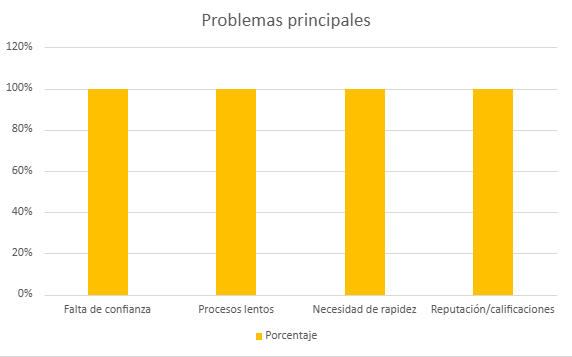</div>
<br>

#### Segmento 2: Trabajadores Temporales

Los datos muestran que el 100% de los trabajadores enfrenta problemas de claridad en los procesos y valora la rapidez, mientras que el 67% manifiesta preocupación por la confianza y la reputación del empleador. Esto evidencia la necesidad de un sistema más transparente y accesible para acceder a trabajos temporales.

<div align="center">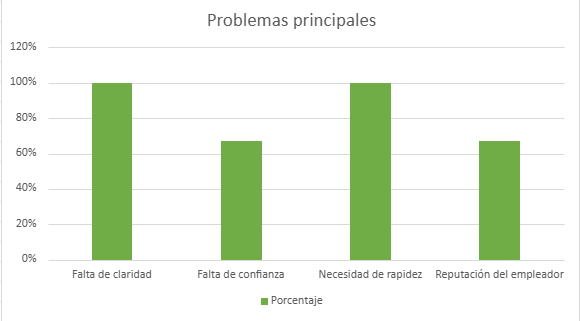</div>
<br>

#### Análisis Comparativo

Al comparar ambos segmentos, se observa que empleadores y trabajadores coinciden en un 100% en la necesidad de rapidez, mientras que la confianza y la reputación son factores relevantes para ambos grupos. Estos hallazgos evidencian una oportunidad clara para una solución digital que conecte oferta y demanda de forma eficiente y confiable.

<div align="center">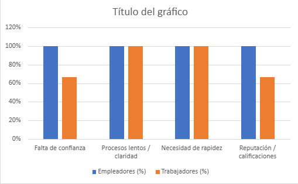</div>
<br>

---

## 2.3. Needfinding
### 2.3.1. User Personas
Para desarrollar la propuesta de solución, se creará un User Persona por cada segmento objetivo. Este tendrá información relacionada a una persona que pertenezca al segmento objetivo respectivo ya sea información personal, gustos, usos tecnológicos u objetivos. De esta forma, se podrá dar una idea más clara de a qué publico nos estamos acercando con la idea de solución. Además, se realiza una conclusión del análisis de cada User Persona.

**User Persona 1: Contratantes (MYPEs)**

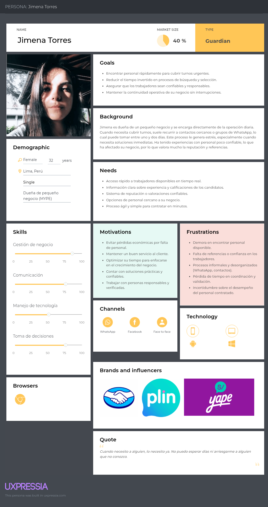

<br>


**User Persona 2: Trabajadores Temporales**

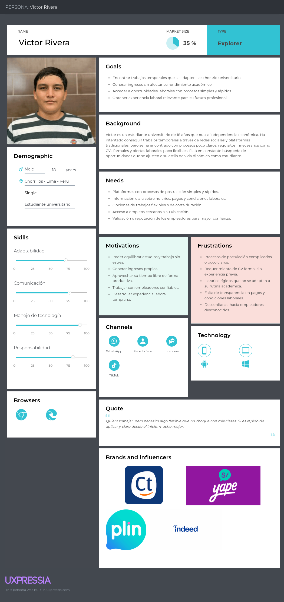
---

### 2.3.2. User Task Matrix

El User Task Matrix de cada User Persona incluye las actividades que realizan que más destacan en una situación cotidiana. A cada actividad se le asigna un puntaje en cuanto a qué tan frecuente es realizada por el User Persona y otro puntaje en cuanto a qué tanta importancia posee dicha actividad. Gracias a esta herramienta se puede identificar las actividades que necesitan realizar los usuarios y cómo las realizan para hallar formas de mejora que serán parte del producto a diseñar.

Se consideran los dos usuarios previamente definidos que constituyen a los segmentos objetivos de dueños de licorerías y proveedores de productos de licorería, en cada tabla se colocarán las actividades que realizan los User Persona para cumplir sus objetivos. Además, para los niveles de frecuencia e importancia se usan cuatro niveles, siendo estos: Muy Alta, Alta, Media y Baja.


<table>
    <tr>
        <th rowspan="2">ACTIVIDAD </th>
        <th colspan="2">JIMENA TORRES</th>
        <th colspan="2">VICTOR RIVERA</th>
    </tr>
    <tr>
        <td> Frecuencia </td>
        <td> Importancia </td>
        <td> Frecuencia </td>
        <td> Importancia </td>
    </tr>
    <tr>
        <td>Buscar oportunidades laborales</td>
        <td>Media</td>
        <td>Alta</td>
        <td>Muy Alta</td>  
        <td>Muy Alta</td>
    </tr>
    <tr>
        <td>Publicar ofertas de trabajo</td>
        <td>Muy Alta</td>
        <td>Muy Alta</td>
        <td>Baja</td>  
        <td>Media</td>
    </tr>
    <tr>
        <td>Revisar información de trabajos / candidatos</td>
        <td>Muy Alta</td>
        <td>Muy Alta</td>
        <td>Alta</td>  
        <td>Muy Alta</td>
    </tr>
    <tr>
        <td>Evaluar reputación (empleador / trabajador)</td>
        <td>Muy Alta</td>
        <td>Muy Alta</td>
        <td>Alta</td>  
        <td>Muy Alta</td>
    </tr>
    <tr>
        <td>Postular / seleccionar candidato</td>
        <td>Alta</td>
        <td>Muy Alta</td>
        <td>Alta</td>  
        <td>Muy Alta</td>
    </tr>
    <tr>
        <td>Coordinar detalles del trabajo</td>
        <td>Alta</td>
        <td>Muy Alta</td>
        <td>Media</td>  
        <td>Alta</td>
    </tr>
    <tr>
        <td>Gestionar tiempos / disponibilidad</td>
        <td>Alta</td>
        <td>Alta</td>
        <td>Muy Alta</td>  
        <td>Muy Alta</td>
    </tr>
    <tr>
        <td>Ejecutar trabajo / supervisar cumplimiento</td>
        <td>Alta</td>
        <td>Muy Alta</td>
        <td>Media</td>  
        <td>Alta</td>
    </tr>
    <tr>
        <td>Realizar / recibir pagos</td>
        <td>Media</td>
        <td>Muy Alta</td>
        <td>Media</td>  
        <td>Muy Alta</td>
    </tr>
    <tr>
        <td>Calificar experiencia</td>
        <td>Media</td>
        <td>Alta</td>
        <td>Baja</td>  
        <td>Media</td>
    </tr>
    <tr>
        <td>Guardar contactos o favoritos</td>
        <td>Media</td>
        <td>Alta</td>
        <td>Baja</td>  
        <td>Media</td>
    </tr>

</table>

Como se observa en la matriz, ambos User Persona presentan actividades críticas con niveles de alta frecuencia e importancia, especialmente en las etapas de búsqueda, evaluación y selección.

En el caso de **Víctor Rivera**, destacan actividades como la búsqueda de empleo, la evaluación de ofertas y la gestión de su disponibilidad, ya que necesita compatibilizar el trabajo con sus estudios. La importancia de la claridad en la información y la rapidez del proceso es clave para su experiencia.

Por otro lado, **Jimena Torres** presenta mayor intensidad en actividades relacionadas con la publicación de ofertas, evaluación de candidatos y supervisión del trabajo. Su principal necesidad radica en la rapidez y confiabilidad, ya que busca cubrir turnos urgentes sin afectar la operación de su negocio.

Ambos coinciden en la importancia de la confianza (reputación) y la claridad en las condiciones, lo que evidencia la necesidad de implementar sistemas de validación y calificación dentro de la solución.

Finalmente, la mayor oportunidad del sistema se encuentra en optimizar el proceso de matching rápido y confiable, reduciendo el tiempo de contratación y mejorando la experiencia para ambos usuarios.

---

### 2.3.3. User Journey Mapping
**User Persona 1:** Jimena Torres (Dueña de Negocio - MYPE)

En esta imagen se presenta el journey map del segundo user persona, Jimena Torres. En esta misma, se detalla el flujo de experiencia de una dueña de negocio que enfrenta la urgencia de cubrir una vacante operativa debido a un imprevisto o alta demanda. El mapa describe cómo Jimena acude a la aplicación para publicar un requerimiento rápido, selecciona a un trabajador basándose en su reputación y cercanía, y logra mantener la continuidad de su negocio, finalizando con una gestión de pago ágil que reduce su estrés operativo y optimiza su tiempo.

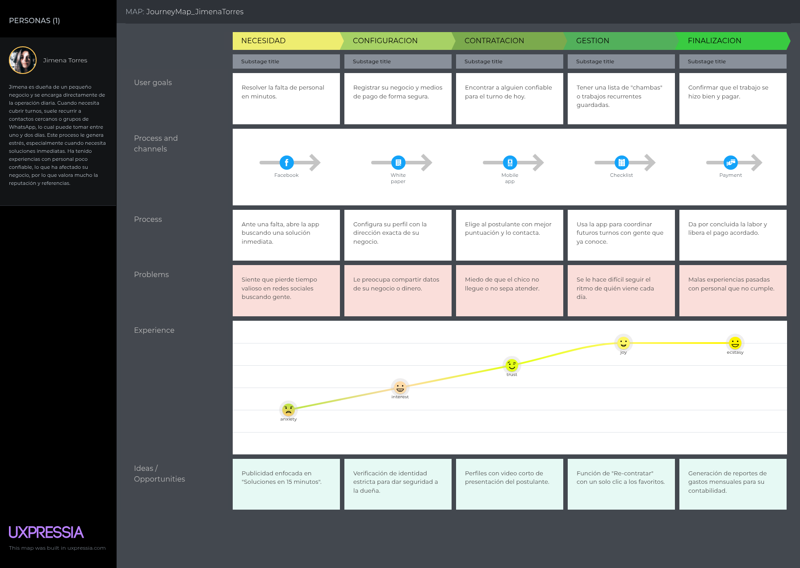

**User Persona 2:** Víctor Rivera (Estudiante Universitario)

En esta imagen se visualiza el journey map del primer user persona, Víctor Rivera. En esta misma, se desea detallar el proceso por el que pasa este estudiante al verse en la necesidad de generar ingresos extra sin descuidar sus estudios. El proceso describe desde el momento en que identifica un tiempo libre en su horario académico y decide buscar una oportunidad laboral inmediata a través de la aplicación ChambaYa, logrando postular de forma simplificada, completar la tarea asignada y finalmente recibir su pago, validando así su desempeño en la plataforma para futuras oportunidades.

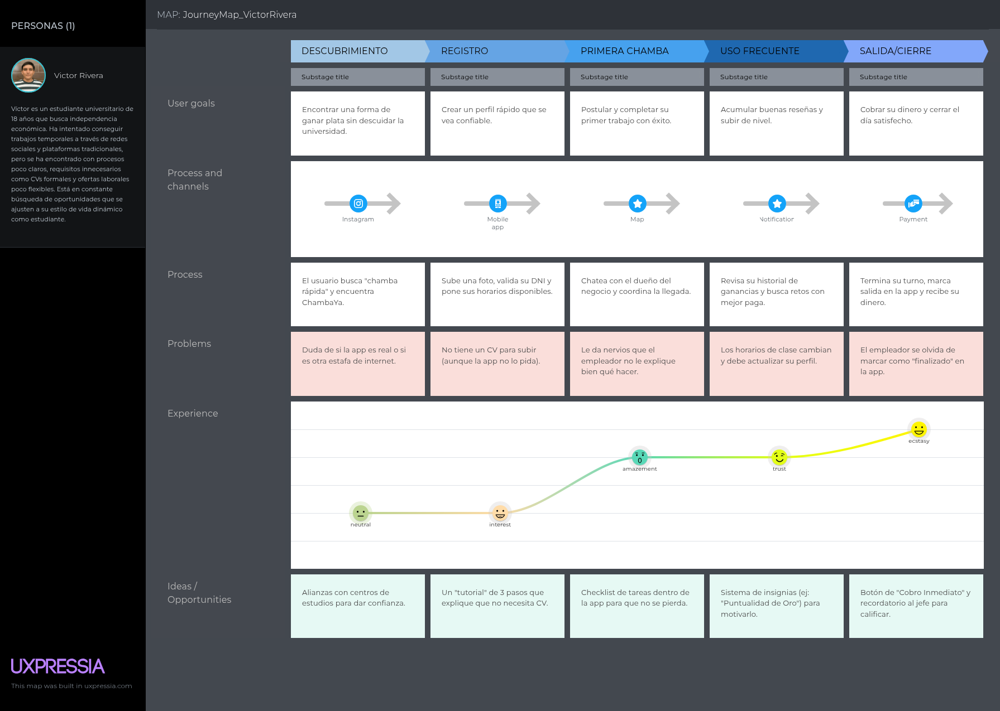

### 2.3.4. Empathy Mapping
El Empathy Mapping ayuda a entender de manera más profunda a nuestro User Persona. Con esta herramienta, capturamos lo que el usuario siente, dice, piensa y hace desde la perspectiva del propio usuario. Además, nos ayuda a identificar dolores y metas qué desea cumplir que nos serán útiles para formar ideas de diseño útiles para el producto que servirá como solución. Finalmente, cada mapa de empatía se diseñó en la aplicación UXPressia.

**User Persona 1:** Jimena Torres (Dueña de Negocio - MYPE)

En esta primera imagen que se muestra a continuación, se visualiza el empathy map del primer user persona. En esta misma, se desea detallar lo que el usuario siente, dice, piensa y hace al momento de enfrentar la necesidad de cubrir un turno de manera urgente. Además, se identifican los dolores que experimenta al buscar personal de forma tradicional y las metas que busca cumplir al utilizar una solución digital eficiente.

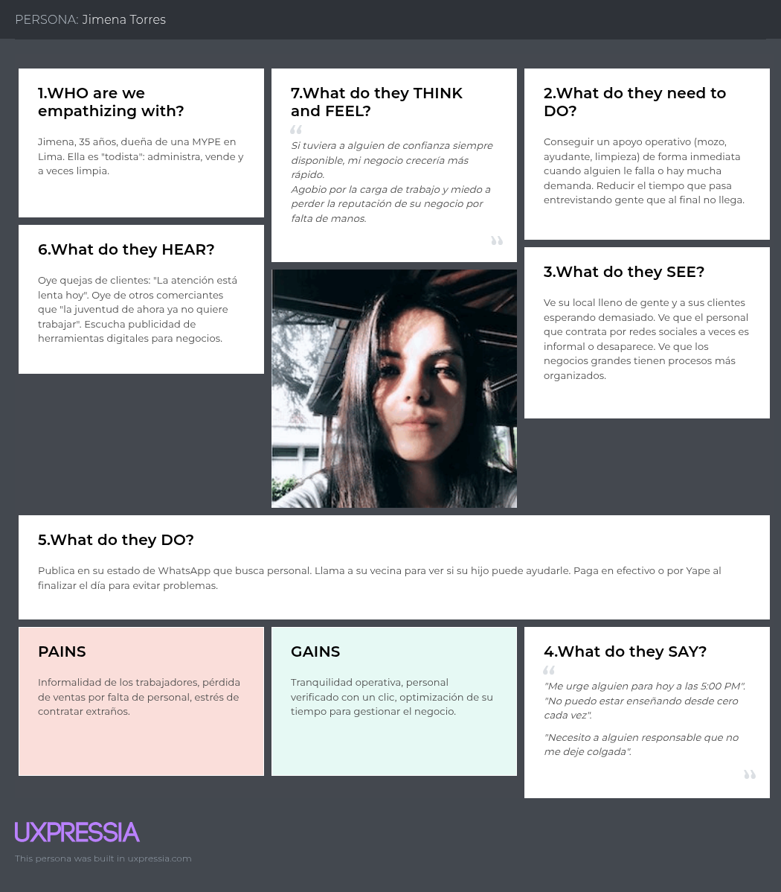

**User Persona 2:** Víctor Rivera (Estudiante Universitario)

En esta segunda imagen que se muestra a continuación, se visualiza el empathy map del segundo user persona. En esta misma, se desea detallar lo que el usuario siente, dice, piensa y hace al momento de buscar oportunidades laborales temporales. Además, se identifican los dolores relacionados con la falta de claridad en los procesos de aplicación y las metas que busca cumplir al acceder a trabajos flexibles y bien remunerados a través de una plataforma digital.

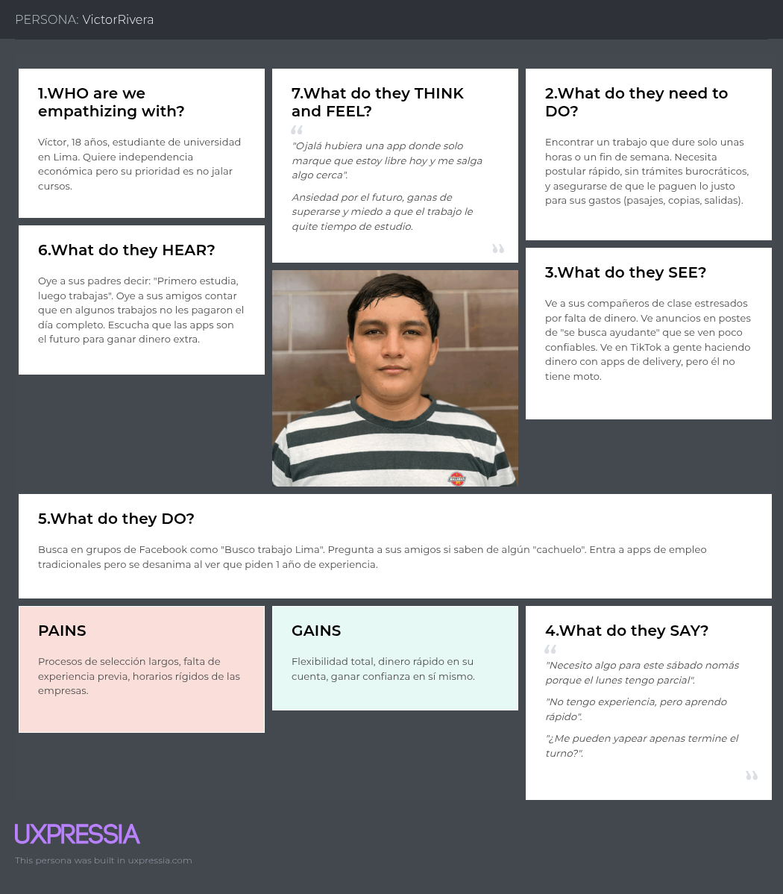

### 2.3.5. Ubiquitous Language
En el presente proyecto, orientado a optimizar la conexión entre micro y pequeñas empresas (MYPEs) y jóvenes que buscan oportunidades laborales temporales mediante una plataforma digital, se ha definido un lenguaje ubicuo que permite establecer una comprensión común entre todos los actores involucrados, incluyendo usuarios, desarrolladores y stakeholders.

La adopción de este lenguaje compartido resulta fundamental para describir de manera clara y consistente los conceptos clave del dominio, reduciendo posibles ambigüedades y facilitando la comunicación a lo largo de todo el proceso de desarrollo del sistema.

A continuación, se presentan los principales términos definidos:

| Término | Descripción |
|--------|------------|
| Chambeador | Usuario joven o estudiante que se registra en la plataforma para encontrar trabajos temporales o turnos cortos. |
| Contratante | Dueño, administrador o representante de una MYPE que publica turnos de trabajo en la plataforma. |
| Turno | Trabajo temporal o tarea específica que debe ser cubierta en un periodo corto de tiempo. |
| Mini-job | Trabajo de corta duración, generalmente por horas o por un día, enfocado en tareas operativas. |
| Match | Proceso mediante el cual la plataforma conecta un turno publicado con un chambeador disponible. |
| Tags de habilidades | Etiquetas que representan las habilidades del chambeador (ej. atención al cliente, inventario, reparto). |
| Insignia de confianza | Verificación del perfil del usuario mediante correo institucional u otro mecanismo de validación. |
| Geolocalización | Funcionalidad que permite ubicar a los usuarios en tiempo real para conectar ofertas y demandas cercanas. |
| Sistema de reputación | Mecanismo de calificación basado en estrellas que permite evaluar la experiencia entre usuarios. |
| Chat interno | Canal de comunicación dentro de la plataforma que permite coordinar detalles del turno sin compartir datos personales. |
| Publicación de turno | Acción realizada por el contratante para registrar un nuevo trabajo disponible en la plataforma. |
| Aceptación de turno | Acción mediante la cual un chambeador selecciona y confirma su participación en un turno. |

## 2.4. Requirements Specification
### 2.4.1. User Stories

En esta sección se presentan las historias de usuario que describen las principales funcionalidades del sistema desde la perspectiva de los usuarios finales. Estas historias han sido definidas considerando el análisis del problema, los segmentos objetivo y las necesidades identificadas en el desarrollo de la plataforma.

Con el fin de organizar de manera clara los requerimientos, las historias de usuario han sido agrupadas en épicas, lo que permite estructurar los distintos componentes funcionales del sistema. De esta forma, se abordan aspectos clave como la gestión de los chambeadores, la administración por parte de los contratantes y los mecanismos de interacción y confianza dentro de la plataforma. Cada historia representa situaciones reales que el sistema busca resolver, como la cobertura rápida de turnos, el acceso a oportunidades laborales cercanas y la generación de un entorno confiable para ambas partes.


### EP01: Gestión de Chambeadores

Descripción: Permite a los jóvenes registrarse, crear su perfil basado en habilidades y acceder a oportunidades laborales temporales sin necesidad de un CV.

| Story ID | Título | Descripción | Criterios de Aceptación |
|----------|--------|------------|-----------------------------------|
| US01 | Registro ágil de chambeador | Como chambeador, quiero registrarme rápidamente, para acceder a oportunidades laborales. | Escenario 1: Registro exitoso.<br>Dado que ingresa datos correctos<br>Cuando confirma<br>Entonces se crea la cuenta.<br><br>Escenario 2: Error de registro.<br>Dado datos incompletos<br>Cuando intenta registrarse<br>Entonces el sistema muestra error. |
| US02 | Perfil basado en habilidades | Como chambeador, quiero crear un perfil sin CV, para acceder a trabajos fácilmente. | Escenario 1: Perfil creado.<br>Dado que selecciona habilidades<br>Cuando guarda<br>Entonces se registra.<br><br>Escenario 2: Perfil incompleto.<br>Dado que no selecciona habilidades<br>Cuando guarda<br>Entonces solicita completar datos. |
| US03 | Ver turnos cercanos | Como chambeador, quiero ver turnos cercanos, para reducir desplazamiento. | Escenario 1: Turnos disponibles.<br>Dado que existen turnos cercanos<br>Cuando accede<br>Entonces los visualiza.<br><br>Escenario 2: Sin turnos.<br>Dado que no hay turnos cercanos<br>Cuando accede<br>Entonces muestra mensaje. |
| US04 | Aceptar turnos | Como chambeador, quiero aceptar turnos, para trabajar de inmediato. | Escenario 1: Aceptación exitosa.<br>Dado turno disponible<br>Cuando acepta<br>Entonces se asigna.<br><br>Escenario 2: Turno ocupado.<br>Dado turno ya tomado<br>Cuando intenta aceptar<br>Entonces muestra error. |
| US05 | Ver reputación del contratante | Como chambeador, quiero ver la reputación del contratante, para decidir. | Escenario 1: Reputación visible.<br>Dado que tiene calificaciones<br>Cuando revisa<br>Entonces las visualiza.<br><br>Escenario 2: Sin calificaciones.<br>Dado que no tiene historial<br>Cuando revisa<br>Entonces muestra mensaje. |

### EP02: Gestión de Contratantes (MYPEs)

Descripción: Permite a las micro y pequeñas empresas publicar turnos y gestionar la contratación de personal temporal de forma ágil.

| Story ID | Título | Descripción | Criterios de Aceptación |
|----------|--------|------------|-----------------------------------|
| US06 | Registro de contratante | Como contratante, quiero registrarme, para gestionar personal. | Escenario 1: Registro exitoso.<br>Dado datos correctos<br>Cuando confirma<br>Entonces se crea la cuenta.<br><br>Escenario 2: Error en registro.<br>Dado datos inválidos<br>Cuando intenta<br>Entonces muestra error. |
| US07 | Publicar turnos | Como contratante, quiero publicar turnos, para cubrir necesidades. | Escenario 1: Publicación exitosa.<br>Dado datos completos<br>Cuando publica<br>Entonces es visible.<br><br>Escenario 2: Datos incompletos.<br>Dado falta de datos<br>Cuando publica<br>Entonces muestra error. |
| US08 | Ver trabajadores cercanos | Como contratante, quiero ver trabajadores cercanos, para contratar rápido. | Escenario 1: Trabajadores disponibles.<br>Dado que existen<br>Cuando accede<br>Entonces los ve.<br><br>Escenario 2: Sin trabajadores.<br>Dado que no hay disponibles<br>Cuando accede<br>Entonces muestra mensaje. |
| US09 | Seleccionar trabajador | Como contratante, quiero elegir trabajadores por reputación. | Escenario 1: Selección exitosa.<br>Dado trabajador disponible<br>Cuando selecciona<br>Entonces se asigna.<br><br>Escenario 2: No disponible.<br>Dado trabajador ocupado<br>Cuando selecciona<br>Entonces muestra error. |
| US10 | Cubrir turno rápido | Como contratante, quiero cubrir turnos rápido, para evitar pérdidas. | Escenario 1: Cobertura exitosa.<br>Dado turno publicado<br>Cuando recibe postulante<br>Entonces se cubre.<br><br>Escenario 2: Sin postulantes.<br>Dado tiempo límite<br>Cuando no hay postulantes<br>Entonces notifica. |

### EP03: Comunicación y Confianza

Descripción: Permite la interacción entre usuarios mediante herramientas de comunicación y un sistema de reputación que fortalece la confianza dentro de la plataforma.

| Story ID | Título | Descripción | Criterios de Aceptación |
|----------|--------|------------|-----------------------------------|
| US11 | Chat interno | Como usuario, quiero comunicarme por chat, para coordinar. | Escenario 1: Chat activo.<br>Dado turno aceptado<br>Cuando acceden<br>Entonces pueden escribir.<br><br>Escenario 2: Chat no disponible.<br>Dado turno no aceptado<br>Cuando accede<br>Entonces no puede usar chat. |
| US12 | Calificación de usuarios | Como usuario, quiero calificar, para generar confianza. | Escenario 1: Calificación registrada.<br>Dado turno finalizado<br>Cuando califica<br>Entonces se guarda.<br><br>Escenario 2: Calificación inválida.<br>Dado intento fuera de tiempo<br>Cuando califica<br>Entonces se rechaza. |

### EP04: Búsqueda y Exploración de Trabajos

Descripción: Permite a los chambeadores explorar oportunidades laborales mediante herramientas como mapa, filtros y listas, facilitando la identificación de trabajos cercanos y adecuados.

| Story ID | Título | Descripción | Criterios de Aceptación |
|----------|--------|------------|-----------------------------------|
| US13 | Ver trabajos en mapa | Como chambeador, quiero ver trabajos en mapa. | Escenario 1: Mapa con resultados.<br>Dado trabajos disponibles<br>Cuando accede<br>Entonces se muestran.<br><br>Escenario 2: Mapa vacío.<br>Dado sin trabajos<br>Cuando accede<br>Entonces muestra mensaje. |
| US14 | Filtrar por distancia | Como chambeador, quiero filtrar por distancia. | Escenario 1: Filtro aplicado.<br>Dado rango<br>Cuando filtra<br>Entonces muestra resultados.<br><br>Escenario 2: Sin resultados.<br>Dado sin coincidencias<br>Cuando filtra<br>Entonces muestra mensaje. |
| US15 | Filtrar por tipo | Como chambeador, quiero filtrar por tipo de trabajo. | Escenario 1: Filtro exitoso.<br>Dado tipo seleccionado<br>Cuando aplica<br>Entonces muestra resultados.<br><br>Escenario 2: Sin coincidencias.<br>Dado tipo inexistente<br>Cuando filtra<br>Entonces muestra mensaje. |
| US16 | Lista de trabajos | Como chambeador, quiero ver lista de trabajos. | Escenario 1: Lista visible.<br>Dado trabajos disponibles<br>Cuando accede<br>Entonces los ve.<br><br>Escenario 2: Lista vacía.<br>Dado sin trabajos<br>Cuando accede<br>Entonces muestra mensaje. |
| US17 | Guardar favoritos | Como chambeador, quiero guardar trabajos. | Escenario 1: Guardado exitoso.<br>Dado selección<br>Cuando guarda<br>Entonces se registra.<br><br>Escenario 2: Duplicado.<br>Dado ya guardado<br>Cuando intenta<br>Entonces notifica. |
| US18 | Ver detalle de trabajo | Como chambeador, quiero ver detalles del turno. | Escenario 1: Detalle visible.<br>Dado turno seleccionado<br>Cuando accede<br>Entonces muestra info.<br><br>Escenario 2: Error de carga.<br>Dado fallo<br>Cuando accede<br>Entonces muestra error. |

### EP05: Gestión de Postulaciones y Turnos

Descripción: Permite gestionar el ciclo de vida del turno, desde la postulación hasta la finalización del trabajo.

| Story ID | Título | Descripción | Criterios de Aceptación |
|----------|--------|------------|-----------------------------------|
| US19 | Postular a turno | Como chambeador, quiero postular, para trabajar. | Escenario 1: Postulación exitosa.<br>Dado turno disponible<br>Cuando postula<br>Entonces se registra.<br><br>Escenario 2: Ya postulado.<br>Dado duplicado<br>Cuando intenta<br>Entonces rechaza. |
| US20 | Ver postulantes | Como contratante, quiero ver postulantes. | Escenario 1: Lista visible.<br>Dado postulaciones<br>Cuando accede<br>Entonces visualiza.<br><br>Escenario 2: Sin postulantes.<br>Dado ninguno<br>Cuando accede<br>Entonces muestra mensaje. |
| US21 | Aceptar postulante | Como contratante, quiero aceptar postulantes. | Escenario 1: Aceptación exitosa.<br>Dado candidato<br>Cuando acepta<br>Entonces asigna.<br><br>Escenario 2: Error.<br>Dado turno cerrado<br>Cuando acepta<br>Entonces falla. |
| US22 | Rechazar postulante | Como contratante, quiero rechazar postulantes. | Escenario 1: Rechazo exitoso.<br>Dado postulante<br>Cuando rechaza<br>Entonces actualiza estado.<br><br>Escenario 2: Error.<br>Dado cambio previo<br>Cuando rechaza<br>Entonces notifica. |
| US23 | Cerrar turno | Como contratante, quiero cerrar turno. | Escenario 1: Cierre exitoso.<br>Dado turno activo<br>Cuando cierra<br>Entonces bloquea.<br><br>Escenario 2: Error.<br>Dado ya cerrado<br>Cuando intenta<br>Entonces muestra mensaje. |
| US24 | Reabrir turno | Como contratante, quiero reabrir turno. | Escenario 1: Reapertura.<br>Dado cancelado<br>Cuando reactiva<br>Entonces publica.<br><br>Escenario 2: Error.<br>Dado activo<br>Cuando intenta<br>Entonces rechaza. |
| US25 | Notificación de postulaciones | Como contratante, quiero notificaciones. | Escenario 1: Notificación enviada.<br>Dado nueva postulación<br>Cuando ocurre<br>Entonces notifica.<br><br>Escenario 2: Error.<br>Dado fallo<br>Cuando ocurre<br>Entonces registra error. |
| US26 | Estado de postulación | Como chambeador, quiero ver estado. | Escenario 1: Estado actualizado.<br>Dado decisión<br>Cuando cambia<br>Entonces se muestra.<br><br>Escenario 2: Error.<br>Dado fallo<br>Cuando consulta<br>Entonces muestra error. |
| US27 | Recordatorio de turno | Como usuario, quiero recordatorios. | Escenario 1: Recordatorio enviado.<br>Dado turno próximo<br>Cuando se acerca<br>Entonces notifica.<br><br>Escenario 2: Desactivado.<br>Dado configuración<br>Cuando aplica<br>Entonces no envía. |
| US28 | Confirmar llegada | Como chambeador, quiero confirmar llegada. | Escenario 1: Confirmación exitosa.<br>Dado inicio<br>Cuando confirma<br>Entonces registra.<br><br>Escenario 2: Fuera de tiempo.<br>Dado retraso<br>Cuando intenta<br>Entonces alerta. |
| US29 | Reportar problema | Como usuario, quiero reportar incidencias. | Escenario 1: Reporte enviado.<br>Dado problema<br>Cuando reporta<br>Entonces guarda.<br><br>Escenario 2: Error.<br>Dado falta de datos<br>Cuando envía<br>Entonces rechaza. |
| US30 | Finalizar turno | Como usuario, quiero finalizar turno. | Escenario 1: Finalización exitosa.<br>Dado terminado<br>Cuando confirma<br>Entonces cierra.<br><br>Escenario 2: Error.<br>Dado no iniciado<br>Cuando intenta<br>Entonces rechaza. |

### 2.4.2. Impact Mapping

En esta sección se presentan los mapas de impacto para cada segmento objetivo del proyecto. Su propósito es relacionar el problema de negocio con el comportamiento esperado de los usuarios y las funcionalidades necesarias para la solución, permitiendo visualizar cómo se generan los resultados planteados.

## Segmento 1 – MYPEs

El mapa de impacto de las MYPEs permite identificar la necesidad de cubrir turnos de manera rápida y confiable. Se destacan comportamientos como la búsqueda inmediata de personal, la publicación ágil de turnos y la validación de la confianza en los trabajadores. A partir de ello, se proponen soluciones enfocadas en la rapidez, la cercanía y la seguridad en la contratación.

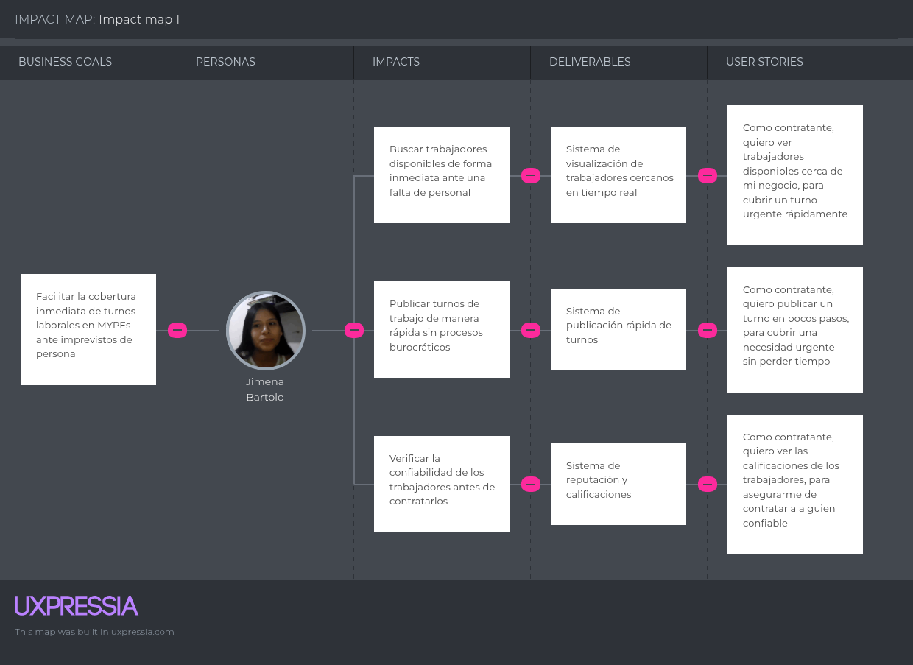

## Segmento 2 – Trabajadores Temporales

El mapa de impacto del segmento de jóvenes trabajadores evidencia la necesidad de acceder a empleos temporales de forma rápida y flexible. Se identifican comportamientos como la búsqueda de trabajos cercanos, la postulación sin procesos complejos y la evaluación de condiciones antes de aceptar un turno. Las soluciones se orientan a simplificar el acceso y brindar mayor claridad y confianza.

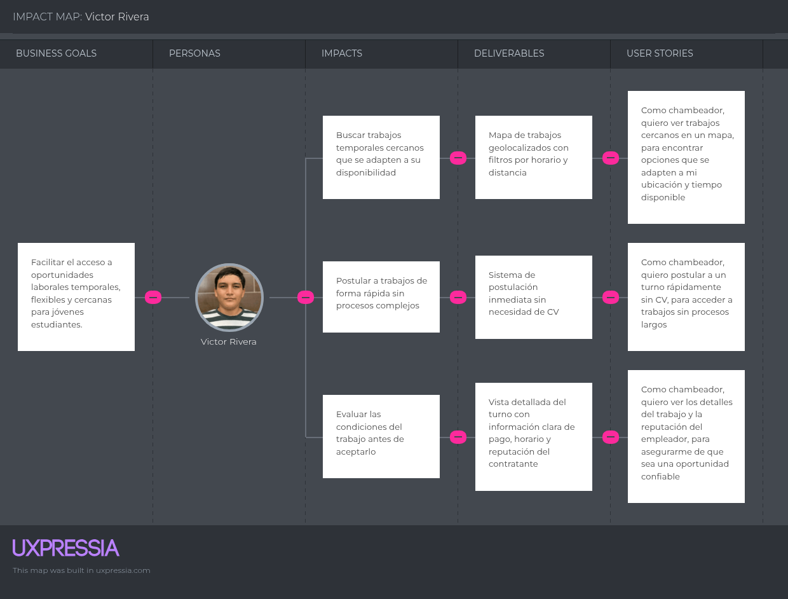

### 2.4.3. Product Backlog

En esta sección se presenta el Product Backlog del proyecto, el cual reúne la totalidad de historias de usuario identificadas a partir del análisis del problema, los segmentos objetivo y los requerimientos del sistema. Estas historias han sido organizadas y priorizadas según su valor para el usuario y su relevancia dentro del flujo principal de la aplicación.

Asimismo, se ha aplicado la técnica de estimación mediante Story Points utilizando la secuencia de Fibonacci (1, 2, 3, 5, 8), lo que permite evaluar de manera relativa la complejidad y esfuerzo requerido para el desarrollo de cada funcionalidad. Esta aproximación facilita la planificación ágil y la definición de iteraciones de desarrollo más realistas.

A continuación, se presenta la lista priorizada de historias de usuario que conforman el Product Backlog del sistema:

---

| Orden | ID   | Título                         | Descripción                                                                 | Story Points |
|------|------|--------------------------------|-----------------------------------------------------------------------------|-------------|
| 1    | US01 | Registro chambeador            | Como chambeador, quiero registrarme rápidamente, para acceder a trabajos.  | 3 |
| 2    | US06 | Registro contratante           | Como contratante, quiero registrarme, para gestionar personal.             | 3 |
| 3    | US02 | Perfil por habilidades         | Como chambeador, quiero crear un perfil sin CV, para acceder a trabajos.   | 5 |
| 4    | US07 | Publicar turnos                | Como contratante, quiero publicar turnos, para cubrir necesidades.         | 5 |
| 5    | US03 | Ver turnos cercanos            | Como chambeador, quiero ver turnos cercanos, para reducir desplazamiento.  | 5 |
| 6    | US08 | Ver trabajadores cercanos      | Como contratante, quiero ver trabajadores cercanos, para contratar rápido. | 5 |
| 7    | US19 | Postular a turno               | Como chambeador, quiero postular, para trabajar.                           | 3 |
| 8    | US21 | Aceptar postulante             | Como contratante, quiero aceptar postulantes, para asignar turnos.         | 3 |
| 9    | US05 | Ver reputación del contratante | Como chambeador, quiero ver reputación, para decidir.                      | 3 |
| 10   | US09 | Seleccionar trabajador         | Como contratante, quiero elegir por reputación, para asegurar calidad.     | 3 |
| 11   | US20 | Ver postulantes                | Como contratante, quiero ver postulantes, para elegir candidatos.          | 3 |
| 12   | US25 | Notificaciones                 | Como usuario, quiero recibir notificaciones, para estar informado.         | 5 |
| 13   | US26 | Estado de postulación          | Como chambeador, quiero ver el estado, para saber mi situación.            | 3 |
| 14   | US18 | Ver detalle del turno          | Como chambeador, quiero ver detalles del turno, para decidir.              | 5 |
| 15   | US13 | Ver trabajos en mapa           | Como chambeador, quiero ver trabajos en mapa, para encontrar opciones.     | 8 |
| 16   | US11 | Chat interno                   | Como usuario, quiero comunicarme por chat, para coordinar detalles.        | 8 |
| 17   | US12 | Calificación                   | Como usuario, quiero calificar, para generar confianza.                    | 5 |
| 18   | US14 | Filtro por distancia           | Como chambeador, quiero filtrar por distancia.                             | 3 |
| 19   | US15 | Filtro por tipo                | Como chambeador, quiero filtrar por tipo de trabajo.                       | 3 |
| 20   | US16 | Lista de trabajos              | Como chambeador, quiero ver lista de trabajos.                             | 3 |
| 21   | US17 | Guardar favoritos              | Como chambeador, quiero guardar trabajos.                                  | 2 |
| 22   | US22 | Rechazar postulante            | Como contratante, quiero rechazar postulantes.                             | 2 |
| 23   | US23 | Cerrar turno                   | Como contratante, quiero cerrar turno.                                     | 3 |
| 24   | US24 | Reabrir turno                  | Como contratante, quiero reabrir turno.                                    | 3 |
| 25   | US27 | Recordatorio de turno          | Como usuario, quiero recibir recordatorios.                                | 2 |
| 26   | US28 | Confirmar llegada              | Como chambeador, quiero confirmar llegada.                                 | 2 |
| 27   | US29 | Reportar problema              | Como usuario, quiero reportar incidencias.                                 | 3 |
| 28   | US30 | Finalizar turno                | Como usuario, quiero finalizar turno.                                      | 3 |

---

### 2.4.2. Gestión del Product Backlog en Trello

Para la gestión del Product Backlog, se utilizó la herramienta Trello, la cual permitió organizar las historias de usuario de manera visual, priorizarlas y asignar Story Points basados en la secuencia de Fibonacci.

A través de esta herramienta, se definió una priorización inicial de historias de usuario que representan las funcionalidades principales del sistema, correspondientes al flujo básico de la aplicación.

Enlace al tablero de Trello: [Link de TRELLO](https://trello.com/invite/b/69e581bada404d81ccde530d/ATTI42a1d93366631bcc58f2fbcf4f6b8734D6B33942/product-backlog-chambaya)

**Evidencia:**  
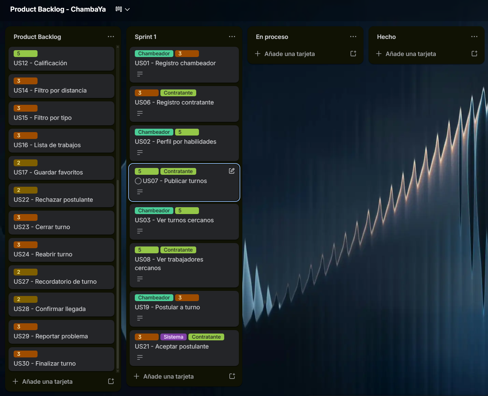
---

Las primeras historias de usuario corresponden a un Sprint 1 propuesto, el cual prioriza funcionalidades esenciales del flujo principal de la aplicación.


## 2.5. Strategic-Level Domain-Driven Design

Para entender el dominio y sus límites, utilizamos la técnica de Event Storming. Esta técnica nos permite descubrir los eventos clave del dominio, identificar los actores involucrados y definir los contextos delimitados (bounded contexts) que conforman el sistema.

### 2.5.1. EventStorming

El equipo uso la herramienta Miro para llevar a cabo sesiones de Event Storming. A continuación, se presentan los pasos seguidos y los resultados obtenidos en cada fase del proceso:

### Paso 1: Collect Domain Events

---
Hemos identificado los eventos de dominio clave que representan cambios significativos en el estado del sistema.

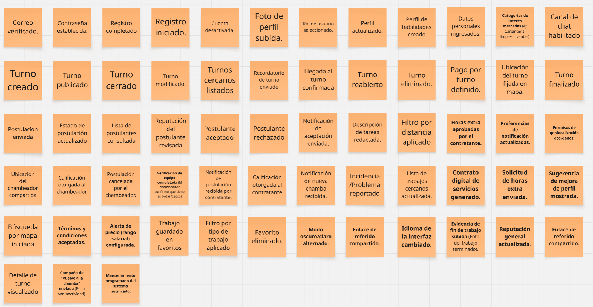

A partir de estos eventos, hemos comenzado a construir una comprensión compartida del dominio y sus procesos.

### Paso 2: Timelines

---

Luego de identificar los eventos, los organizamos en líneas de tiempo para visualizar la secuencia y las relaciones entre ellos.

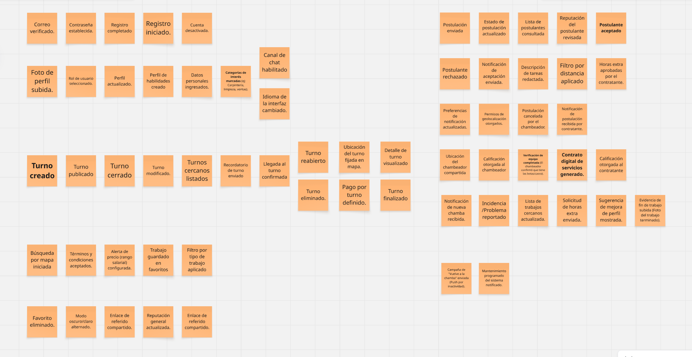

### Paso 3: Pain Points

---

Identificamos los puntos de dolor y las áreas problemáticas dentro del dominio que requieren atención especial.

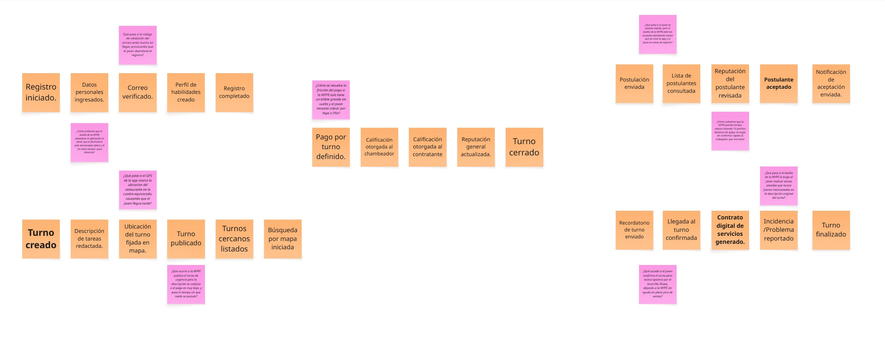


Estos puntos de dolor nos ayudaron a priorizar las áreas que necesitan mejoras y a enfocar nuestros esfuerzos en soluciones efectivas.

### Paso 4: Pivotal Events

---

Luego, destacamos los eventos pivote que tienen un impacto significativo en el flujo del dominio.

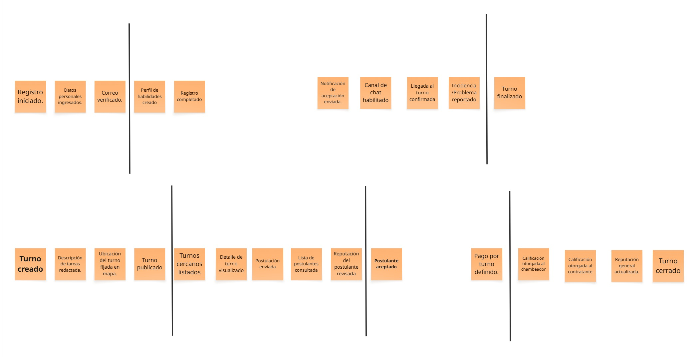

### Paso 5: Commands

---

Identificamos los comandos que representan las acciones que los usuarios o sistemas pueden realizar para desencadenar eventos de dominio.

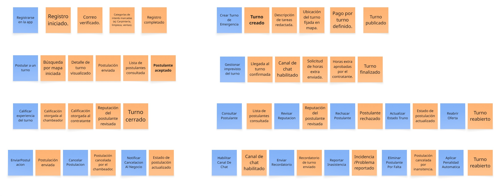

Estos comandos nos ayudaron a definir las interacciones clave dentro del sistema y a comprender cómo los usuarios pueden influir en el flujo del dominio.

### Paso 6: Policies

---

Se identificaron las políticas que gobiernan el comportamiento del sistema, juntamente con las reglas de negocio que se deben cumplir.

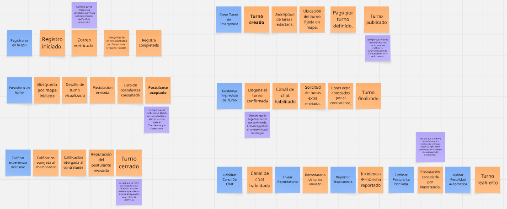

Estas políticas ayudaron a definir las restricciones y las condiciones bajo las cuales los comandos y eventos pueden ocurrir.

### Paso 7: Read Models

---

Se identificaron los modelos de lectura que representan las vistas y las proyecciones de los datos dentro del sistema.

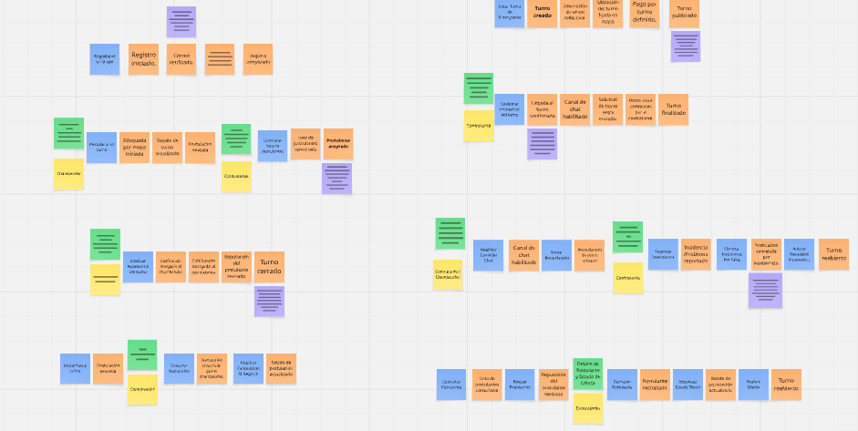

Los modelos de lectura nos permitieron establecer la forma en que la información se muestra a los usuarios y cómo puede ser consultada de manera eficiente.


### Paso 8: External Systems

---

Determinamos qué sistemas externos se relacionan con nuestro dominio y cuáles son los puntos necesarios para integrarlos.

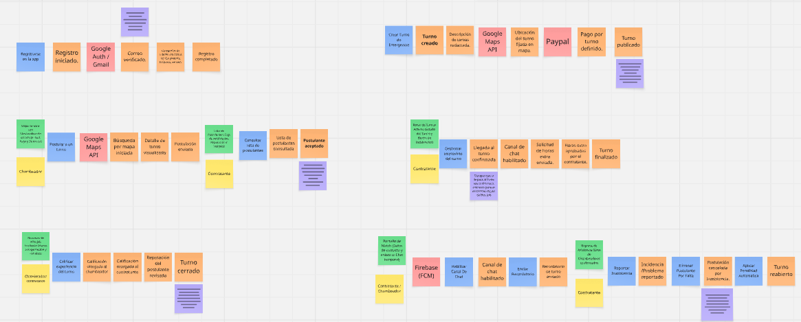

Estos sistemas externos nos permitieron entender mejor las dependencias y las interacciones que ocurren fuera de nuestro control directo.

### Paso 9: Aggregates

---

Por último, determinamos los agregados que representan tanto las entidades como los objetos de valor dentro del dominio.

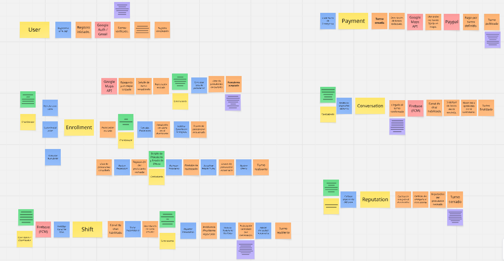

Estos agregados nos permitieron establecer las estructuras de datos y las relaciones fundamentales dentro del sistema.

##### 2.5.1.1. Candidate Context Discovery

Para la identificación de los Bounded Contexts de ChambaYA, aplicamos la técnica de Look-for-Pivotal-Events. Esta técnica nos permitió identificar eventos críticos en el timeline que marcan un cambio de fase en el proceso de negocio o un cambio de responsabilidad entre diferentes "expertos de dominio".

Complementariamente, usamos Start-with-Value para priorizar los contextos de Job y Application, que representan el Core Domain de nuestra plataforma de micro-empleos.

##### 2.5.1.1.1. IAM Context

Para el bounded context de IAM, definimos los siguientes elementos:

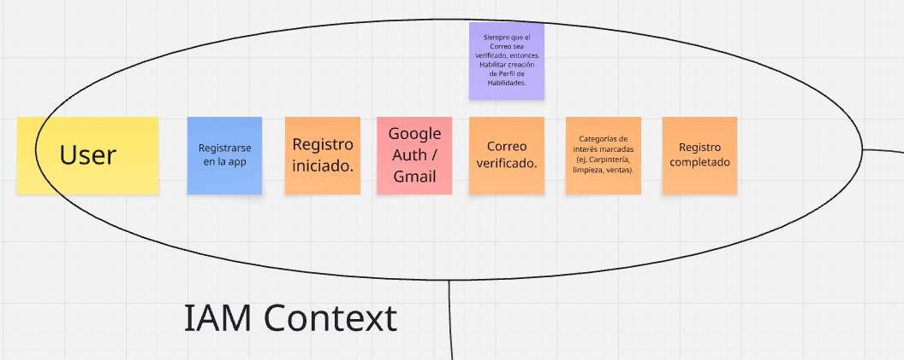

Se identificó a partir de los eventos de registro y validación. Su propósito es aislar la gestión de identidad y seguridad del resto de la lógica operativa.

##### 2.5.1.1.2. Job Context

Para el bounded context de Job, definimos los siguientes elementos:

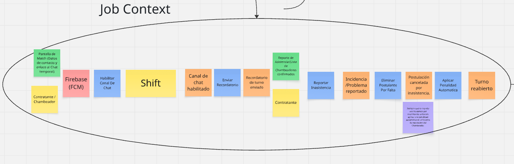

Es el punto de partida del valor del negocio. Se encarga de la existencia y estado del "Mini-job".

##### 2.5.1.1.3. Application Context

Para el bounded context de Application, definimos los siguientes elementos:

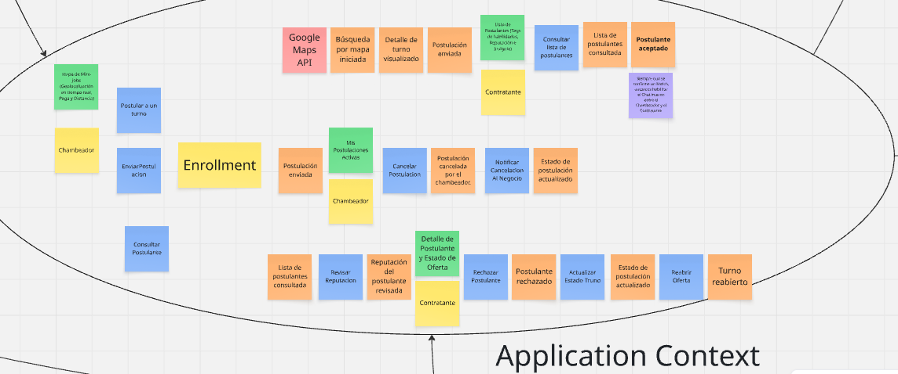

Se separó del Job Context porque el proceso de postulación y selección tiene reglas de negocio muy distintas (manejo de candidatos vs. manejo de locales). Aquí es donde ocurre el "Match".

##### 2.5.1.1.4. Communication Context

Para el bounded context de Communication, definimos los siguientes elementos:

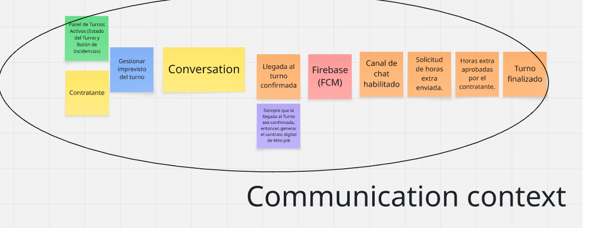

Se definió al notar que la mensajería es un servicio de soporte que solo se activa tras un evento específico de éxito en la postulación.


##### 2.5.1.1.5. Payment Context

Para el bounded context de Payment, definimos los siguientes elementos:

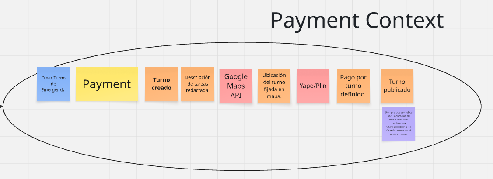

Se aisló para manejar la complejidad de las transacciones con billeteras digitales (Yape/Plin) y asegurar que el flujo de dinero sea independiente de la gestión de tareas.


##### 2.5.1.1.6. Reputation Context

Para el bounded context de Reputation, definimos los siguientes elementos:

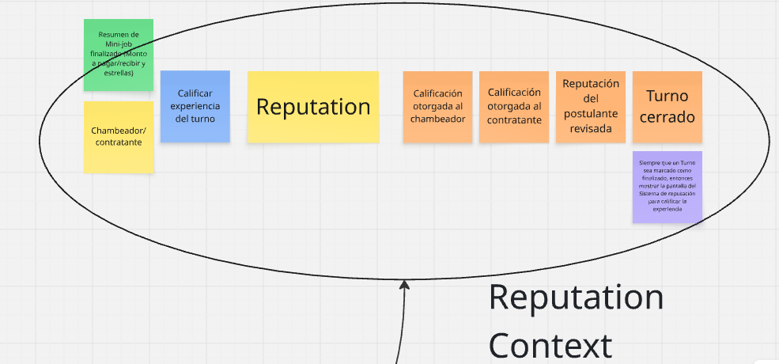

Se ubica al final del timeline. Su lógica de promedios y reseñas no debe afectar el desempeño de los otros módulos.


##### 2.5.1.2. Domain Message Flows Modeling

En esta sección, se modelaron los flujos de colaboración entre los Bounded Contexts, con el objetivo de visualizar cómo interactúan los diferentes módulos del sistema para resolver los escenarios críticos de negocio identificados durante el Event Storming.

Se definieron tres escenarios principales para evidenciar los flujos de mensajes:

##### 2.5.1.2.1. Escenario de Publicación y Postulación
Este flujo abarca desde la creación del turno hasta que los chambeadores envían sus postulaciones.
- El Contratante define las características del mini-job dentro del Job Context.
- El Job Context publica la oferta para que sea visible y gestionable.
- El Chambeador envía su postulación al Application Context.

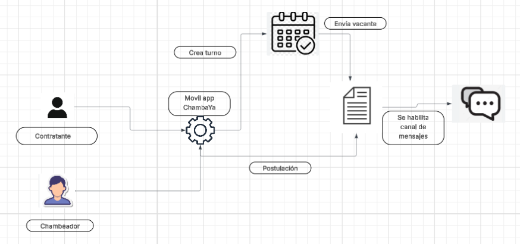


##### 2.5.1.2.2. Escenario de Finalización, Pago y Calificación
Este flujo describe el cierre exitoso de la labor, el intercambio de dinero y el feedback de ambas partes.
- El Chambeador reporta la finalización de la tarea dentro del Job Context.
- El Contratante confirma la recepción del servicio y realiza el pago mediante el Payment Context (Yape/Plin).
- El Job Context habilita el proceso de calificación en el Reputation Context tras confirmarse el pago.
- El Contratante y Chambeador intercambian reseñas para actualizar su reputación en el sistema.

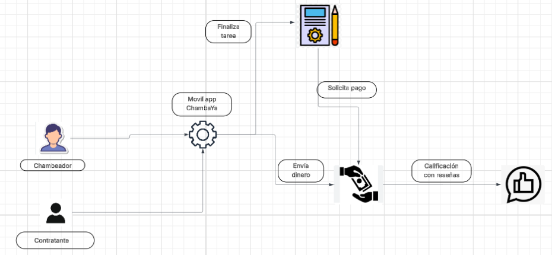

##### 2.5.1.2.3. Escenario de Inasistencia y Reapertura de Vacante
- El Contratante reporta la inasistencia del trabajador en el Application Context
- El Application Context cancela la postulación actual y aplica la penalidad correspondiente.
- El Application Context solicita al Communication Context el cierre del canal de chat temporal.
- El Application Context notifica al Job Context para reabrir la oferta y permitir nuevas postulaciones.

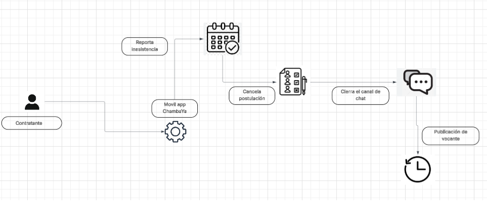

##### 2.5.1.3. Bounded Context Canvases

En esta sección, el equipo detalla cómo utilizó el Bounded Context Canvas, una herramienta visual del enfoque Domain-Driven Design (DDD) que permite definir y comprender los límites de cada contexto dentro de un sistema complejo. Su objetivo es lograr que todos los integrantes compartan una misma visión sobre qué representa cada contexto y cuál es su función. Para cada uno, se muestra su respectivo Canvas, acompañado de una breve descripción de su propósito y un resumen que sustenta su clasificación estratégica dentro del dominio de ChambaYA.

##### 2.5.1.3.1. IAM Context Canvas
El IAM Context tiene como propósito centralizar la gestión de identidades y el control de accesos de la plataforma ChambaYA. Se encarga de autenticar a los usuarios y proveer las credenciales y roles necesarios para asegurar que la interacción dentro del ecosistema sea segura y confiable.

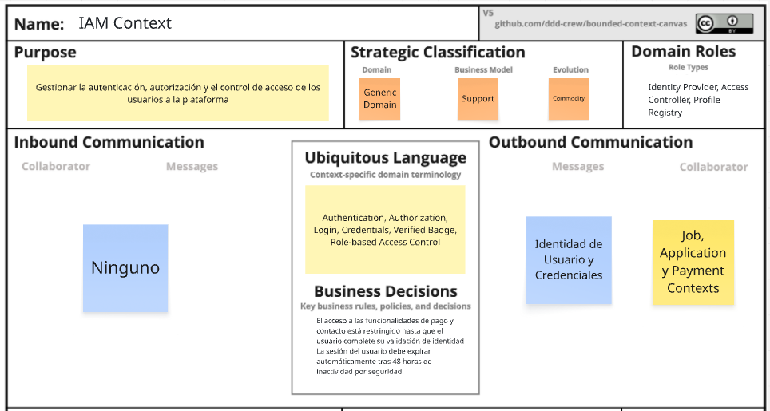

La función del IAM contextes permitir que tanto Chambeadores como Contratantes accedan al sistema de forma segura y organizada, lo cual es fundamental para la integridad de los datos. Al ser una funcionalidad de infraestructura necesaria para cualquier sistema moderno, este contexto apoya a los Core Domains (Job y Application) asegurando que solo usuarios verificados puedan participar en el flujo de valor.


##### 2.5.1.3.2. Job Context Canvas
Este contexto representa el núcleo de la oferta de valor de la plataforma. Su propósito es definir y gestionar todo el ciclo de vida del "Mini-job" (turno), desde su creación y publicación hasta su finalización o eventual reapertura.

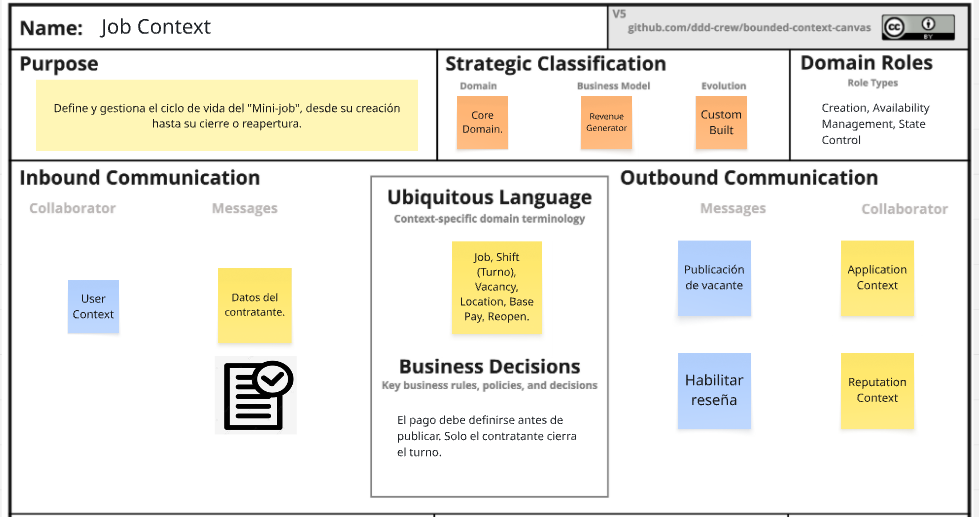

El Job Context es crucial para la existencia misma de la plataforma y por ello ha sido clasificado como un Core Domain. Este contexto permite a los Contratantes visualizar, definir y gestionar sus ofertas de turnos de forma organizada, lo que constituye la base de la actividad comercial de ChambaYA. Al controlar la disponibilidad y el estado operativo de los mini-jobs, este contexto es el motor principal para generar ingresos, sustentando la ventaja competitiva de la plataforma en el mercado de micro-empleos.

#### 2.5.1.3.3. Application Context Canvas

Este contexto actúa como el orquestador operativo del flujo de valor. Su propósito es gestionar la interacción entre Chambeadores y ofertas, manejando todo el proceso de postulación, la validación del "Match" y la gestión de incidencias de asistencia.

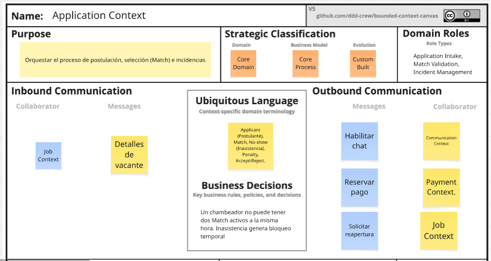

Consideramos al Application Context como el segundo pilar de nuestro Core Domain, ya que es fundamental para concretar el intercambio de valor entre las partes. Este contexto permite procesar postulaciones y asegurar el cumplimiento de asistencia mediante reglas de negocio específicas y penalidades organizadas, lo que contribuye directamente al éxito operativo y a la satisfacción de los usuarios. Representa la lógica de negocio única que orquesta el "Match", diferenciándonos de otras plataformas de empleo genéricas.


##### 2.5.1.3.5. Communication Context Canvas

Este contexto provee las herramientas de coordinación necesarias para que Contratantes y Chambeadores puedan comunicarse efectivamente tras un "Match", gestionando la mensajería temporal y las notificaciones push.

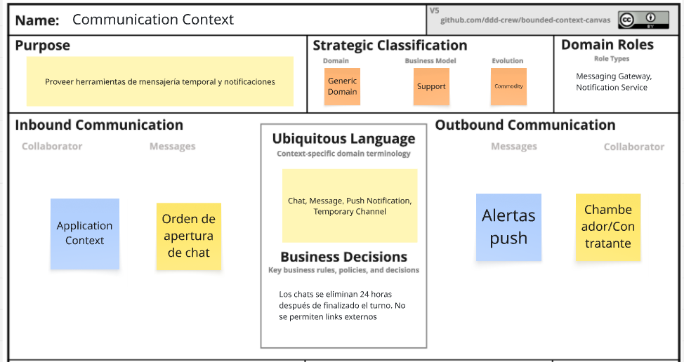

El Communication context permite a los usuarios coordinar detalles tras un "Match" de forma organizada, lo que contribuye directamente a la eficiencia operativa y a la experiencia del usuario. Además, actúa como un servicio de soporte necesario para las actividades clave del dominio.

##### 2.5.1.3.6. Reputation Context Canvas
Este contexto tiene como propósito construir y mantener la confianza dentro del ecosistema de ChambaYA, gestionando el sistema de reseñas y puntuaciones para cada usuario.

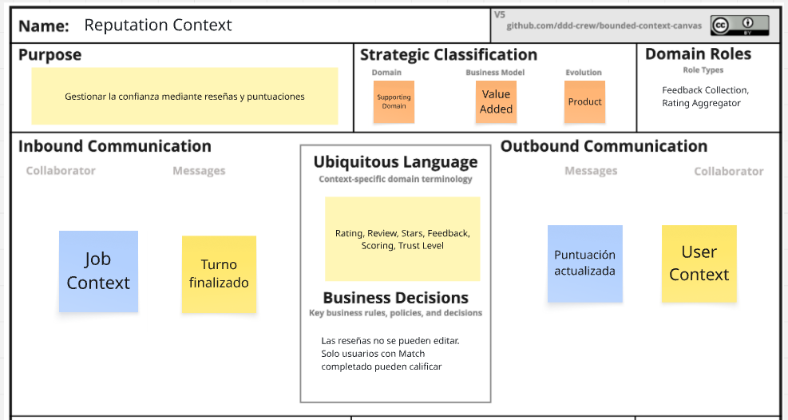

El Reputation context permite recopilar y visualizar feedback y promedios de calificación de forma organizada, lo que contribuye directamente a la confianza en la red y a la calidad del servicio. No constituye el núcleo principal, sino que apoya las actividades clave proporcionando información valiosa para la toma de decisiones por parte de los usuarios.

##### 2.5.1.3.4. Payment Context Canvas

Este contexto tiene como propósito facilitar el intercambio económico entre Contratantes y Chambeadores, gestionando la validación y el registro de las transacciones económicas realizadas vía billeteras digitales externas.


El Payment context permite validar y registrar las transacciones vía Yape/Plin de forma organizada, lo que contribuye directamente a la confianza y sostenibilidad económica de la plataforma. También apoya las actividades clave proporcionando una capa de validación financiera esencial para la gestión de pagos.

### 2.5.2. Context Mapping

Tras identificar los Bounded Contexts candidatos, el equipo procedió a definir las relaciones estructurales y los patrones de comunicación entre ellos. El objetivo fue minimizar el acoplamiento y asegurar que los cambios en contextos genéricos no afecten la lógica del Core Domain.

Análisis de Bounded Contexts

- IAM Context ↔ Job / Application / Payment Contexts
    - Relación: Upstream (IAM) / Downstream (Job/App/Pay)

    - Patrón: ACL (El sistema traduce los datos de identidad y roles del IAM a los modelos específicos de "Postulante" o "Contratante" de cada         contexto).


- Job Context ↔ Application Context
    - Relación: Upstream (Job) / Downstream (Application)

    - Patrón: Customer/Supplier (El Job Context actúa como proveedor de vacantes. Cualquier cambio en la estructura del turno debe ser coordinado       para no romper el flujo de postulaciones.


- Application Context ↔ Communication Context

    - Relación: Upstream (Application) / Downstream (Communication)

    - Patrón: PL (Published Language) (Application emite eventos como MatchConfirmed que Communication consume tal cual para habilitar canales de       chat).


- Application Context ↔ Payment Context

    - Relación: Upstream (Application) / Downstream (Payment)

    - Patrón: ACL (Payment traduce los datos de la postulación aceptada a su propio modelo de "Transacción" y "Reserva de Fondos" para Yape/Plin).


- Job Context ↔ Reputation Context

    - Relación: Upstream (Job) / Downstream (Reputation)

    - Patrón: ACL (Reputation protege su lógica de promedios y reseñas de los cambios constantes de estado en el ciclo de vida del turno).


- Communication / Reputation Contexts ↔ Usuarios

    - Relación: Upstream (Contexts) / Downstream (Users)

    - Patrón: OHS + PL (Estos contextos exponen sus capacidades como servicios abiertos para ser consumidos por las interfaces finales de               usuario).

### 2.5.3. Software Architecture

##### 2.5.3.1. Software Architecture Context Level Diagrams


---
El siguiente diagrama de contexto presenta una visión general de la aplicación móvil ChambaYA, identificando a los principales actores que interactúan con el sistema y los servicios externos involucrados.

Se observa cómo los usuarios, tanto contratantes como chambeadores, utilizan la aplicación para gestionar turnos y postulaciones. Asimismo, se muestran las integraciones con servicios externos como geolocalización, notificaciones y verificación de identidad, los cuales complementan el funcionamiento de la aplicación.

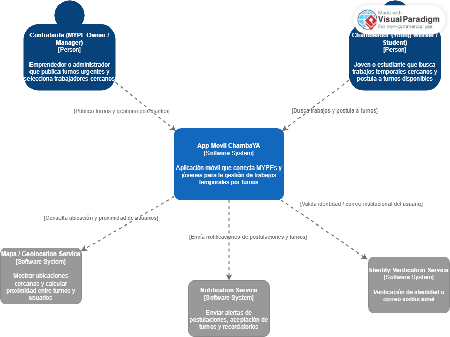

##### 2.5.3.2. Software Architecture Container Level Diagrams


---
El diagrama de contenedores describe la estructura interna de la aplicación móvil ChambaYA, mostrando los principales componentes que conforman el sistema y sus interacciones.

Se identifican las aplicaciones móviles para cada segmento, el backend que centraliza la lógica de negocio y la base de datos MongoDB para la persistencia de la información. Además, se evidencian las integraciones con servicios externos como mapas, notificaciones y validación de identidad.

Cabe resaltar que la lógica del negocio se encuentra encapsulada en el backend, el cual integra los distintos bounded contexts definidos en el diseño del dominio.

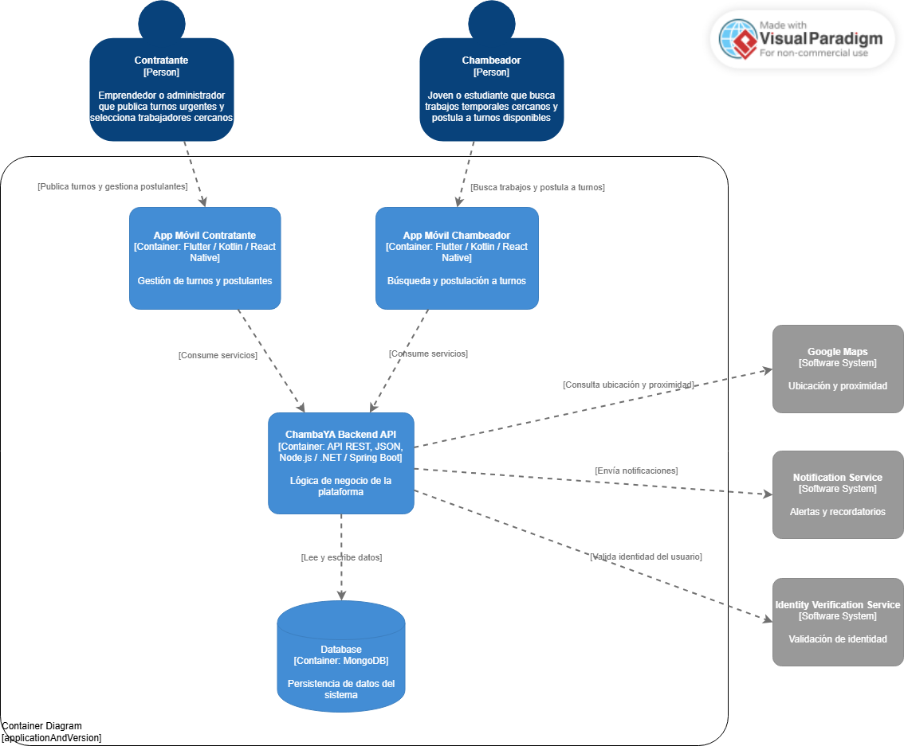

##### 2.5.3.3. Software Architecture Deployment Diagrams

El diagrama de despliegue muestra la distribución de los componentes de la aplicación móvil ChambaYA en la infraestructura tecnológica.

Se representan los dispositivos móviles desde los cuales los usuarios acceden a la aplicación, el servidor backend desplegado en la nube, la base de datos MongoDB y los servicios externos utilizados por el sistema. Este diagrama permite visualizar cómo los diferentes elementos se comunican entre sí en un entorno de ejecución real.

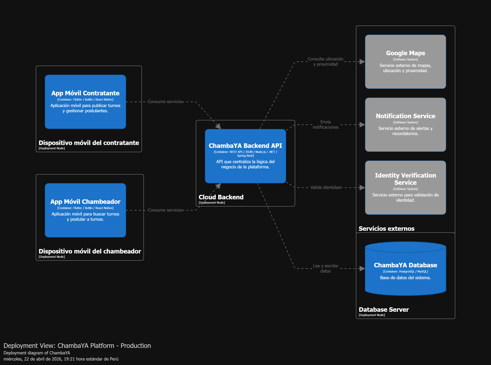


## 2.6. Tactical-Level Domain-Driven Design
#### 2.6.1. Bounded Context: IAM Context
##### 2.6.1.1. Domain Layer
La Domain Layer del IAM Context encapsula toda la lógica de negocio relacionada con la gestión de identidad y acceso dentro de la plataforma ChambaYA. Este contexto maneja tanto a los jóvenes en búsqueda de empleo como a las MYPES contratantes, diferenciándolos mediante roles.

Se encarga de garantizar reglas como:

- Validación de datos (email, contraseña)
- Gestión de perfiles
- Asignación de roles
- Actualización de información del usuario


## Aggregates

| Nombre     | Descripción                                                                                                                                                                  | Atributos                                                                                                                                                                                                       | Métodos                                                                                                                            |
| ---------- | ---------------------------------------------------------------------------------------------------------------------------------------------------------------------------- | --------------------------------------------------------------------------------------------------------------------------------------------------------------------------------------------------------------- | ---------------------------------------------------------------------------------------------------------------------------------- |
| **`User`** | Aggregate Root que representa a un usuario del sistema; encapsula identidad, credenciales, relación con cuenta y rol de usuario, y operaciones invariantes sobre el usuario. | `Id: int` <br>`Name: string` <br>`Email: Email`    <br>`Password: string`  <br>`CreatedAt: DateTime`  <br>`UpdatedAt: DateTime`  <br>`AccountId: AccountId`  <br>`UserRole: Role`  <br>`UserRoleId: string` | `ChangePassword(string newPassword): void`  <br>`UpdateProfile(Profile profile): void`  <br>`ChangeRole(UserRole role): void` |

---

## Entities

| Nombre     | Descripción                                                                                               | Atributos                            | 
| ---------- | --------------------------------------------------------------------------------------------------------- | ------------------------------------ | 
| **`Profile`** | Entidad que representa la información extendida del usuario. | `UserId: string`  <br> `Skills: string[]` <br> `Experience: string` <br> `PhotoURL: string` | 

---

## Value Objects

| Nombre                          | Descripción                                                                                      | Atributos / Valores                                                |
| ------------------------------- | ------------------------------------------------------------------------------------------------ | ------------------------------------------------------------------ |
| **`EUserRoles`**                | Define el tipo de usuario dentro del sistema.              | `JOB_SEEKER`, `EMPLOYER`                    |
| **`Email`**                | Representa un correo electrónico válido.              | `string validado (formato email)`                   |

---

## Services

| Nombre                    | Descripción                                                                        | Métodos                                                                                                                                                                                                                                          |
| ------------------------- | ---------------------------------------------------------------------------------- | ------------------------------------------------------------------------------------------------------------------------------------------------------------------------------------------------------------------------------------------------ |
| **`IUserCommandService`** | Define operaciones que modifican el estado del usuario. | `CreateUser(CreateUserCommand)`  <br>`TUpdateUser(UpdateUserCommand)`  <br>`ChangePassword(ChangePasswordCommand)`  <br>`DeleteUser(DeleteUserCommand)`  <br>`DeleteUser(DeleteUserCommand)` |
| **`IUserQueryService`** | Interfaz que expone consultas sobre usuarios. | `GetUserById(GetUserByIdQuery)`  <br>`GetUserByEmail(GetUserByEmailQuery)`  <br>`GetUsersByRole(GetUsersByRoleQuery)`  <br>`GetAllUsersQuery(GetAllUsersQuery)` |

---

## Repositories

| Nombre                | Descripción                                             | 
| --------------------- | ------------------------------------------------------- | 
| **`IUserRepository`** | Define la persistencia para la entidad `User`. | 

---

##### 2.6.1.2. Interface Layer
En esta capa se publican los controladores de la API que permiten a clientes externos (aplicaciones web, móviles o sistemas integrados) interactuar con el dominio de IAM (Identity & Access Management). Los controladores actúan como orquestadores entre los Services y el Domain Layer: reciben solicitudes HTTP, validan y normalizan la entrada, mapean los payloads a Commands o Queries (CreateUserCommand, GetUserByIdQuery, ChangePasswordCommand) y delegan la ejecución a los IUserCommandService e IUserQueryService. Finalmente transforman los resultados del dominio en respuestas HTTP adecuadas (DTOs, códigos de estado, errores de validación), manteniendo la lógica de negocio fuera del controlador y asegurando que la capa permanezca delgada y enfocada en la traducción entre protocolo y modelo de dominio.

---

## Controllers

| Nombre                                | Descripción                                                                                                                                                                                                                                                                       | Endpoints (ejemplos)                                                                                                                                                                                                                                                                                                                                                                                                                                                                                                                                                                                                                                        |
| ------------------------------------- | --------------------------------------------------------------------------------------------------------------------------------------------------------------------------------------------------------------------------------------------------------------------------------- | ----------------------------------------------------------------------------------------------------------------------------------------------------------------------------------------------------------------------------------------------------------------------------------------------------------------------------------------------------------------------------------------------------------------------------------------------------------------------------------------------------------------------------------------------------------------------------------------------------------------------------------------------------------- |
| **UsersController**                   | Gestiona operaciones sobre usuarios. (`CreateUserCommand`, `UpdateUserCommand`, `ChangePasswordCommand`, `ChangeRoleCommand`, `GetUserByIdQuery`, etc.).    | `POST /api/users (CreateUserCommand)`<br>`PUT /api/users/{id} (UpdateUserCommand)` <br>`DELETE /api/users/{id} (DeleteUserCommand)` <br>`GET /api/users/{id} (GetUserByIdQuery)` <br>`GET /api/users/by-email/{email} (GetUserByEmailQuery)` <br>`GET /api/users/by-role/{role} (GetUsersByRoleQuery)` <br>`GET /api/users?page={page}&size={size} (GetAllUsersQuery)` <br>`POST /api/users/{id}/change-password (ChangePasswordCommand)`<br>`POST /api/users/{id}/role (ChangeRoleCommand) `|

---

## Resources

Los Resources representan los contratos que la API expone o acepta. No deben exponer información sensible en respuestas.

| Resource                   | Esquema (ejemplos)                                                                                                                                                    |
| -------------------------- | --------------------------------------------------------------------------------------------------------------------------------------------------------------------- |
| **CreateUserResource**     | `json { "name": "Juan Perez", "email": "juan@gmail.com", "password": "123456", "role": "JOB_SEEKER" } `                          |
| **UserResource**           | `json { "id": 1, "name": "Juan Perez", "email": "juan@gmail.com", "role": "JOB_SEEKER", "createdAt": "2026-04-22T12:00:00Z" } ` |
| **RoleResource**           | `json { "Id": "role-uuid", "Name": "Admin" } `                                                                                                                        |
| **ChangePasswordResource** | `json { "CurrentPassword": "alP@ss", "NewPassword": "NewP@ssw0rd#!" } `                                                                                               |

---

## Assemblers

Los Assemblers encapsulan la transformación entre Resources, Commands/Queries y Entities/DTOs. La capa de presentación (controllers) utiliza los assemblers para mantener la lógica de dominio fuera del controlador.

- `CreateUserResourceToCommandAssembler` convierte un `CreateUserResource` en un `CreateUserCommand`
- `UserEntityToUserResourceAssembler` convierte un `User` en un `UserResource`
- `RoleEntityToRoleResourceAssembler` convierte un `Role` en un `RoleResource`
- `ChangePasswordResourceToCommandAssembler` convierte un `ChangePasswordResource` en un `ChangePasswordCommand`

---

##### 2.6.1.3. Application Layer
La Application Layer coordina la ejecución de comandos y consultas, actuando como intermediario entre la Interface Layer y la Domain Layer.

---

## Command Services

Los **Command Services** se encargan de **procesar acciones que modifican el estado del dominio** (creación, actualización, borrado o cambios de estado), relativas al agregado `User` y a la gestión de roles y credenciales. Su responsabilidad incluye validar los Commands, orquestar llamadas a los **Domain Services** y a los **Repositories**.

|                 Nombre | Descripción                                               | Commands manejados                                                                                  |
| ---------------------: | --------------------------------------------------------- | --------------------------------------------------------------------------------------------------- |
| **UserCommandService** | Gestiona operaciones que modifican el estado del usuario (`User`).    | `CreateUserCommand, UpdateUserCommand, ChangePasswordCommand, ChangeRoleCommand, DeleteUserCommand` |
| **RoleCommandService** | Gestiona operaciones sobre la entidad `Role` (si aplica). | `CreateRoleCommand, UpdateRoleCommand, DeleteRoleCommand`                                           |
| **AuthCommandService** | Orquesta flujos relacionados con credenciales y sesiones. | `LoginCommand, LogoutCommand, RefreshTokenCommand, ForgotPasswordCommand, ResetPasswordCommand`     |

---

## Query Services
Los **Query Services** están orientados a **recuperar datos del dominio sin producir efectos colaterales**. Reciben **Queries**, consultan los **Repositories** o vistas optimizadas, y devuelven **Resources** listos para la capa de presentación. Mantienen la capa de aplicación ligera y evitan que los **Controller** conozcan detalles de persistencia o modelado del dominio.

|               Nombre | Descripción                                         | Queries manejadas                                                              |
| -------------------: | --------------------------------------------------- | ------------------------------------------------------------------------------ |
| **UserQueryService** | Gestiona y exponeconsultas sobre usuarios.                    | `GetUserByIdQuery, GetUserByEmailQuery, GetUsersByRoleQuery, GetAllUsersQuery` |
| **RoleQueryService** | Expone consultas sobre roles.                       | `GetRoleByIdQuery, GetAllRolesQuery`                                           |
| **AuthQueryService** | Consultas relacionadas con estado de sesión/tokens. | `ValidateTokenQuery, GetAuthMetadataQuery`                                     |

---

##### 2.6.1.4. Infrastructure Layer

La Infrastructure Layer se encarga de la persistencia de datos, así como de la integración con servicios externos necesarios para el funcionamiento del User Context. Esta capa implementa las interfaces definidas en el dominio (como IUserRepository) y adapta el modelo de dominio a tecnologías concretas como bases de datos, servicios de autenticación y almacenamiento de archivos.

Además, encapsula detalles técnicos como:

- ORM (por ejemplo, Entity Framework, Hibernate, etc.)
- Integraciones externas (Firebase, Cloudinary)
- Transformaciones entre entidades de dominio y modelos de persistencia

---

## Repositories

| Nombre                                            | Descripción                                                                                                                                                                                                                                                                                                | Implementación (ejemplos de métodos)                                                                                                                                                                                                                                                                                                                                                                                                                                                                    |
| ------------------------------------------------- | ---------------------------------------------------------------------------------------------------------------------------------------------------------------------------------------------------------------------------------------------------------------------------------------------------------- | ---------------------------------------------------------------------------------------------------------------------------------------------------------------------------------------------------------------------------------------------------------------------------------------------------------------------------------------------------------------------------------------------------------------------------------------------------------------------------------------------------------------------------------------------------------------------------------------------------------------------------------------------------------------------------------------- |
| **UserRepository**  | Responsable de la persistencia y recuperación del agregado `User`. Traduce entre el modelo de dominio y la base de datos. Implementa la interfaz `IUserRepository`.  | - `Task<User?> GetByIdAsync(int id)` → Obtiene un usuario por ID. <br>- `Task<IEnumerable<User>> GetAllAsync()` → Retorna todos los usuarios. <br>- `Task<User?> GetByEmailAsync(string email)` → Busca usuario por correo. <br>- `Task AddAsync(User user)` → Inserta un nuevo usuario. <br>- `Task UpdateAsync(User user)` → Actualizar usuario (estado, rol, credenciales hashed).<br>- `Task DeleteAsync(int id)` → Eliminar o marcar como inactivo.|

---

## External Authentication with Google Intregation

| Nombre                | Descripción                                                                                                                                                                                                                                    | Implementación (ejemplos)                                                                                                                                                                                                                                                        |
| --------------------- | ---------------------------------------------------------------------------------------------------------------------------------------------------------------------------------------------------------------------------------------------- | ------------------------------------------------------------------------------------------------------------------------------------------------------------------------------------------------------------------------------------------------------------------------------------------------------------------------------------------------------------------------------------------------------------------------------------------------------------------------------------------------------------------------------------------------------------------------------------------------------------------------------------------------------------------------------------------------------------------------------------------------------------------------------------------------------------------------------------------------------------------------------------------------------------------------------------------------------------------------------------------------------------------------------------------------------------------------------------------------------------------------------------------------------------------------------------------------------------------------------------------------------------------------------------------------------------------------------------------------------------------------------------------------------------------------------------------------------------------------------------------------------------------------------------------------------------- |
| **GoogleAuthAdapter** | Adaptador responsable de la integración con Google Identity (OAuth2 / OpenID Connect). Se encarga de iniciar flujos de autenticación, validar ID tokens, obtener la dirección de correo verificada y gestionar el enlace/provisión de cuentas. | - `string GetAuthorizationUrl(string state, string redirectUri, string[] scopes, bool promptConsent = false)` → Construye la URL de autorización para redirigir al cliente (incluye `state`, `nonce`, scopes `openid profile email`).<br>- `Task<ExternalAuthResult> HandleCallbackAsync(string code, string redirectUri)` → Intercambia el `code` por tokens (access\_token, id\_token, refresh\_token), valida el `id_token` (firma, aud, exp, nonce) y devuelve información básica del usuario (email verificado, name, picture, sub).<br>- `Task<bool> VerifyIdTokenAsync(string idToken)` → Verifica la firma y reclamaciones del `id_token` usando las claves públicas de Google (JWKS).<br>- `Task<UserProvisionResult> ProvisionOrLinkUserAsync(ExternalAuthResult externalUser)` → Crea o enlaza un usuario local en IAM usando el email/federated id provisto. Maneja conflictos (email ya en uso) y devuelve el usuario local y el estado de provisión (creado/enlazado).<br>- `Task RevokeRefreshTokenAsync(string refreshToken)` → Revoca credenciales cuando el usuario desconecta la cuenta.|
| **CloudinaryAdapter** | Servicio para almacenamiento de imágenes de perfil. | - `Task<bool> VerifyTokenAsync(string token)` → Verifica validez del token. <br>- `Task<string> UploadImageAsync(Stream image)` → Sube imagen y retorna URL. <br>- `Task DeleteImageAsync(string imageUrl)` → Elimina imagen del storage. |


##### 2.6.1.5. Bounded Context Software Architecture Component Level Diagrams
**Diagrama de componentes: Autenticación**

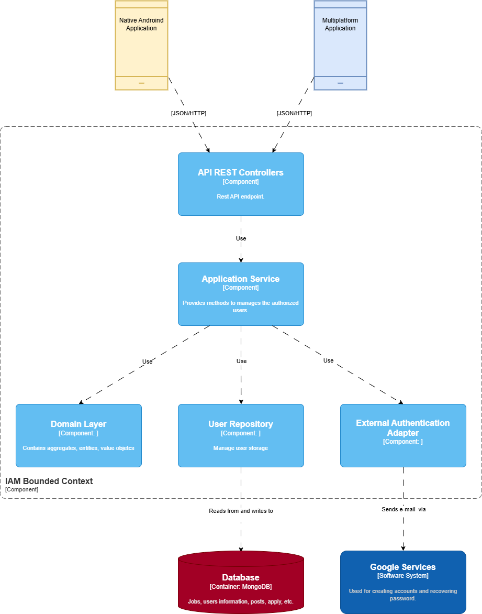

En la imagen se aprecia el diagrama de componentes para el contexto de autenticación. En este diagrama, se muestra la relación para almacenar la información de los usuarios en la base de datos con el uso de un repositorio para dicha entidad. Además, se evidencia el uso del servicio externo de Google Services para la recuperación de contraseñas y creación sencilla con una cuenta existente de Google.

##### 2.6.1.6. Bounded Context Software Architecture Code Level Diagrams
En esta sección, se muestran y explican los diagramas de clases y de base de datos relacionados al contexto delimitado sobre la autenticación de los usuarios.
###### 2.6.1.6.1. Bounded Context Domain Layer Class Diagrams
A continuación, se muestra el diagrama de clases del contexto presente donde se resalta la clase de usuario que es la más importante de este contexto.

**Clase principal: User**
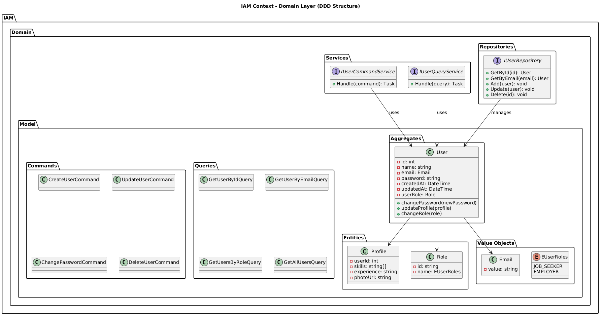

En la imagen se puede visualizar a la clase de usuario que contiene atributos como nombre de usuario, contraseña y correo electrónico; atributos relacionados a la auditoría como fecha de creación y de modificación. Además, se visualiza el atributo de identificador de cuenta que hace referencia a la cuenta general de la que forma parte este usuario.

###### 2.6.1.6.2. Bounded Context Database Design Diagram
A continuación, se muestra y explica el diagrama de documentos relacionado a la base de datos no relacional que se usará. Este diagrama de documentos refleja como la información del contexto presente persiste.

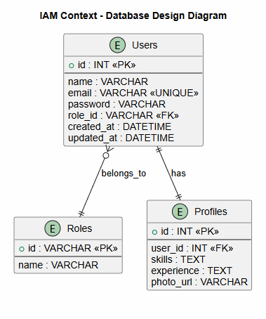

En esta imagen se visualiza que una base de datos no relacional para el contexto de autenticación persisitiría con la información de la entidad principal que son los usuarios y otra entidad relacionada a los roles de los cuales cada cuenta solo puede tener uno al mismo tiempo.

#### 2.6.2. Bounded Context: Application Context
##### 2.6.2.1. Domain Layer
La capa Application Context (Enrollment) constituye el motor transaccional del sistema, centralizando toda la lógica de negocio relacionada con las postulaciones de los jóvenes (Chambeadores) a los turnos de emergencia publicados por las MYPEs (Contratantes).
En esta capa se definen las reglas y comportamientos propios del emparejamiento: la creación de la postulación, las transiciones de estado (aceptado, rechazado, cancelado) y las políticas que detonan el "Match" definitivo.

**Aggregates**

| Nombre     | Descripcion                                                                                                                                                                          | Atributos                                                                                                                                                                     | Metodos                                                                                 |
|------------|--------------------------------------------------------------------------------------------------------------------------------------------------------------------------------------|-------------------------------------------------------------------------------------------------------------------------------------------------------------------------------|-----------------------------------------------------------------------------------------|
| Enrollment | Aggregate Root que representa la postulación de un usuario a un turno; encapsula la identidad, los estados del proceso y las operaciones invariantes que determinan si hay un Match  | Id: UUID  <br/> <br/> TurnoId: UUID <br/> <br/> Chambeador: UUID  <br/> <br/> Status: EnrollmentStatus <br/> <br/> CreatedAt: Datetime <br/> <br/> UpdatedAt: DateTime <br/>  | Accept(): void <br/> <br/> Reject(): void <br/> <br/> CancelByChambeador: void   <br/>  | 

**Value Objects**

| Nombre           | Descripcion                                                                                           | Atributos/ Valores                             |
|------------------|-------------------------------------------------------------------------------------------------------|------------------------------------------------|
| EnrollmentStatus | Enumeración que modela los estados posibles por los que puede transitar una postulación en el sistema | Pending, Accepted, Rejected, Cancelled         |
| Location         |  Objeto de valor inmutable que representa las coordenadas geográficas, utilizado para validar cercanía antes de la postulación                                                                                                     | Latitud : double <br/> <br/> Longitude: double |

**Services**

| Nombre                    | Descripcion | Metodos                                                                                                                                                                                                                               |
|---------------------------|-------------|---------------------------------------------------------------------------------------------------------------------------------------------------------------------------------------------------------------------------------------|
| IEnrollmentCommandService |  Interfaz que define las operaciones de negocio (comandos) para gestionar los cambios de estado en las postulaciones          | Task<Enrollment> Handle(SubmitEnrollmentCommand command) <br/> <br/> Task Handle(AcceptEnrollmentCommand command) <br/> <br/>  Task Handle(RejectEnrollmentCommand command) <br/> <br/> Task Handle(CancelEnrollmentCommand command)  |
| IEnrollmentQueryService   | Interfaz que expone consultas (lecturas) sobre las postulaciones para las vistas de la MYPE y el Chambeador            | Task<EnrollmentDto?> Handle(GetEnrollmentByIdQuery query) <br/> <br/> Task<IEnumerable<EnrollmentDto>> Handle(GetActiveEnrollmentsQuery query)<br/> <br/>  Task<IEnumerable<EnrollmentDto>> Handle(GetPostulantesByTurnoQuery query)  |

**Repositories**

| Nombre                | Descripcion |
|-----------------------|-------------|
| IEnrollmentRepository |  Define la persistencia (contrato de base de datos) para la entidad (Aggregate Root) Enrollment           |

##### 2.6.2.2. Interface Layer

En esta capa se publican los controladores de la API REST que permiten a las aplicaciones móviles de los usuarios (Dueños de MYPEs y Jóvenes Chambeadores) interactuar con el dominio de postulaciones (Enrollment). Los controladores actúan como orquestadores entre los recursos web y el Domain Layer: reciben solicitudes HTTP, validan la entrada de datos (como el ID del turno y las coordenadas GPS), mapean los payloads a Commands o Queries (ej. SubmitEnrollmentCommand, GetPostulantesByTurnoQuery) y delegan la ejecución a IEnrollmentCommandService e IEnrollmentQueryService. Finalmente, transforman los resultados del dominio en respuestas HTTP adecuadas, asegurando que la lógica de negocio permanezca protegida y la capa solo se encargue de la traducción del protocolo web.

**Controllers**

| Nombre                 | Descripcion                                                                                                                                         | Endpoints(Ejemplo)                                                                                                                                                                                                                                                                                                                                                                                                               |
|------------------------|-----------------------------------------------------------------------------------------------------------------------------------------------------|----------------------------------------------------------------------------------------------------------------------------------------------------------------------------------------------------------------------------------------------------------------------------------------------------------------------------------------------------------------------------------------------------------------------------------|
| EnrollmentsController  | Expone las operaciones para gestionar el ciclo de vida de las postulaciones: envío por parte del joven, y aceptación/rechazo por parte de la MYPE.  | PUT /api/v1/enrollments{id}/accept (AcceptEnrollmentCommand)<br/> <br/> PUT /api/v1/enrollments{id}/reject (RejectEnrollmentCommand)<br/> <br/> PUT /api/v1/enrollments{id}/cancel (CancelEnrollmentCommand)<br/> <br/>  GET /api/v1/enrollment/{id} (GetEnrollmentCommand) <br/> <br/>  GET /api/v1/enrollments/{id} (GetEnrollmentByIdQuery) <br/> <br/> GET /api/v1/turnos/{turnoId}/enrollments (GetPostulantesByTurnoQuery) |

**Resources**

| Resource                 | Esquema(ejemplos)                                                                                                                                          |
|--------------------------|------------------------------------------------------------------------------------------------------------------------------------------------------------|
| SubmitEnrollmentResource | { "TurnoId": "550e8400-e29b-41d4...", "ChambeadorId": "123e4567-e89b-12d3...", "Latitude": -12.0463, "Longitude": -77.0427 }                               |
| EnrollmentResource       | { "Id": "990e8400-a29b-41d4...", "TurnoId": "550e8400-e29b...", "ChambeadorId": "123e4567...", "Status": "ACCEPTED", "CreatedAt": "2026-04-20T18:30:00Z" } |
| StatusUpdateResource     | { "Reason": "Perfil encaja perfectamente con la urgencia." }                                                                                               |

##### 2.6.2.3. Application Layer
La capa de Aplicación (Application Layer) actúa como el orquestador principal de los casos de uso (Use Cases) del Bounded Context de postulaciones (Application Context). Esta capa no contiene reglas de negocio core —estas pertenecen exclusivamente al Domain Layer— sino que coordina el flujo de trabajo: recibe las intenciones del usuario a través de Commands o Queries, interactúa con los repositorios para recuperar el Aggregate Root (Enrollment), invoca sus comportamientos de dominio y persiste los cambios.

Además, esta capa es responsable de gestionar la publicación de los Eventos de Dominio (Domain Events) hacia el exterior, como notificar al sistema de Chat cuando una MYPE acepta a un joven (Match).

**Command Services**

Estos manejadores implementan la lógica de orquestación transaccional. Reciben el comando, buscan las entidades involucradas, ejecutan la acción y guardan el nuevo estado.

| Nombre                          | Descripcion                                                                                                                                                                        | Commans manejados       |
|---------------------------------|------------------------------------------------------------------------------------------------------------------------------------------------------------------------------------|-------------------------|
| SubmitEnrollmentCommandHandler  | Orquesta la creación de una nueva postulación. Verifica mediante servicios externos la ubicación (si es necesario), instancia un nuevo Enrollment y lo persiste en el repositorio. | SubmitEnrollmentCommand |
| AcceptEnrollmentCommandHandler  | Recupera la postulación por su ID, invoca el método Accept() del Aggregate Root (generando el Match) y persiste el cambio. Dispara el evento de dominio EnrollmentAccepted.        | AcceptEnrollmentCommand |
| RejectEnrollmentCommandHandler  | Recupera la postulación, invoca el método Reject() para declinar al chambeador y libera el estado en la base de datos.                                                             | RejectEnrollmentCommand |
| CancelEnrollmentCommandHandler  | Permite al chambeador retirar su postulación antes de ser aceptado. Invoca CancelByChambeador() en la entidad y actualiza el repositorio.                                          | CancelEnrollmentCommand |

**Query Services**

Encargados de procesar las consultas de manera óptima y directa, devolviendo objetos de transferencia (DTOs) sin cargar la lógica pesada del Aggregate Root.

| Nombre                            | Descripcion                                                                                                              | Queries Manejdas           |
|-----------------------------------|--------------------------------------------------------------------------------------------------------------------------|----------------------------|
| GetEnrollmentByIdQueryHandler     | Busca y devuelve el detalle completo de una postulación específica utilizando su ID.                                     | `GetEnrollmentByIdQuery`    |
| GetPostulantesByTurnoQueryHandler | Obtiene la lista completa de chambeadores (postulantes) que han aplicado a un turno específico publicado por la MYPE.    | `GetPostulantesByTurnoQuery` |
| GetActiveEnrollmentsQueryHandler  | Devuelve todas las postulaciones que un joven específico mantiene activas (en estado Pending o Accepted) en el sistema.  | `GetActiveEnrollmentsQuery`  |

**Data Transfer Objects (DTOs)**

Objetos inmutables generados por la Application Layer para transferir datos hacia la Interface Layer, asegurando que las entidades de dominio puras no se expongan directamente a los controladores web.

| Nombre                | Descripcion                                                                                                                               |
|-----------------------|-------------------------------------------------------------------------------------------------------------------------------------------|
| EnrollmentDto         | Representación plana y de solo lectura de una postulación, que incluye el Id, TurnoId, ChambeadorId, y el Status actual.                  |
| PostulanteSummaryDto  | Versión resumida de la postulación optimizada para la vista de lista de la MYPE, mostrando el estado actual y el momento de postulación.  |


##### 2.6.2.4. Infrastructure Layer
La Infrastructure Layer se encarga de la persistencia de datos, de las integraciones externas y de proporcionar los adaptadores y utilidades necesarios para que la Application Layer y la Domain Layer funcionen. En el contexto del bounded context de Application (Enrollment), esta capa implementa los repositories para guardar las postulaciones, los adaptadores de geolocalización (Google Maps API), los publicadores de eventos para la comunicación asíncrona (Message Broker) y cualquier componente dependiente de tecnología concreta.

**Repositories**

| Nombre                | Descripcion                                                                                                                                                                                                                                                                                                          | Implementación (ejemplos de métodos)                                                                                                                                                                                                                                                                                                                                                                                                                                                                                                                                                                                                                                               |
|-----------------------|----------------------------------------------------------------------------------------------------------------------------------------------------------------------------------------------------------------------------------------------------------------------------------------------------------------------|------------------------------------------------------------------------------------------------------------------------------------------------------------------------------------------------------------------------------------------------------------------------------------------------------------------------------------------------------------------------------------------------------------------------------------------------------------------------------------------------------------------------------------------------------------------------------------------------------------------------------------------------------------------------------------|
| EnrollmentRepository  | Responsable de la persistencia y recuperación de los agregados Enrollment. Traduce entre la representación de persistencia (tablas relacionales) y los objetos del dominio. También se encarga de búsquedas optimizadas para listar las postulaciones de un turno o de un joven. (implementa IEnrollmentRepository)  | - Task<Enrollment?> GetByIdAsync(UUID id) → Obtener la postulación por su identificador único. <br/> <br/> - Task<IEnumerable<Enrollment>> GetByTurnoIdAsync(UUID turnoId) → Obtener todas las postulaciones recibidas para un turno específico publicado por la MYPE. <br/> <br/> - Task<IEnumerable<Enrollment>> GetActiveByChambeadorIdAsync(UUID chambeadorId) → Obtener las postulaciones pendientes o aceptadas de un joven <br/> <br/> - Task AddAsync(Enrollment enrollment) → Insertar una nueva postulación en la base de datos. <br/> <br/> - Task UpdateAsync(Enrollment enrollment) → Actualizar el estado de la postulación (ej. transición de PENDING a ACCEPTED).  |

**External Services & Event Publishing**

| Nombre                    | Descripcion                                                                                                                                                                                                                                            | Implementación (ejemplos de métodos)                                                                                                                                                                                                                                                                                                                                                                     |
|---------------------------|--------------------------------------------------------------------------------------------------------------------------------------------------------------------------------------------------------------------------------------------------------|----------------------------------------------------------------------------------------------------------------------------------------------------------------------------------------------------------------------------------------------------------------------------------------------------------------------------------------------------------------------------------------------------------|
| GoogleMapsAdapter         | Adaptador responsable de la integración con la API de Google Maps (Distance Matrix / Geocoding). Se encarga de validar las coordenadas enviadas por el dispositivo móvil y calcular la distancia real entre el joven postulante y el local de la MYPE. | - Task<double> CalculateDistanceAsync(Location origin, Location destination) → Llama a la API para obtener la distancia real de viaje (en km o metros) entre dos coordenadas. <br/> <br/> - Task<bool> ValidateLocationWithinRadiusAsync(Location applicantLoc, Location turnoLoc, double maxRadius) → Verifica si el joven se encuentra dentro de la zona permitida para postular al turno de urgencia. |
| EnrollmentEventPublisher  | Componente encargado de publicar los eventos de dominio (Domain Events) hacia un bus de mensajes (ej. RabbitMQ, Apache Kafka, o eventos en memoria). Es vital para notificar a otros Bounded Contexts sin acoplarlos directamente.                     | - Task PublishEnrollmentAcceptedAsync(EnrollmentAcceptedEvent domainEvent) → Serializa y envía el evento indicando que hubo un "Match", para que el contexto de Colaboración habilite el chat entre la MYPE y el joven. <br/> <br/> - Task PublishEnrollmentCancelledAsync(EnrollmentCancelledEvent domainEvent) → Envía un evento si el joven cancela, para que el sistema libere el cupo en el turno.  |

##### 2.6.2.5. Bounded Context Software Architecture Component Level Diagrams

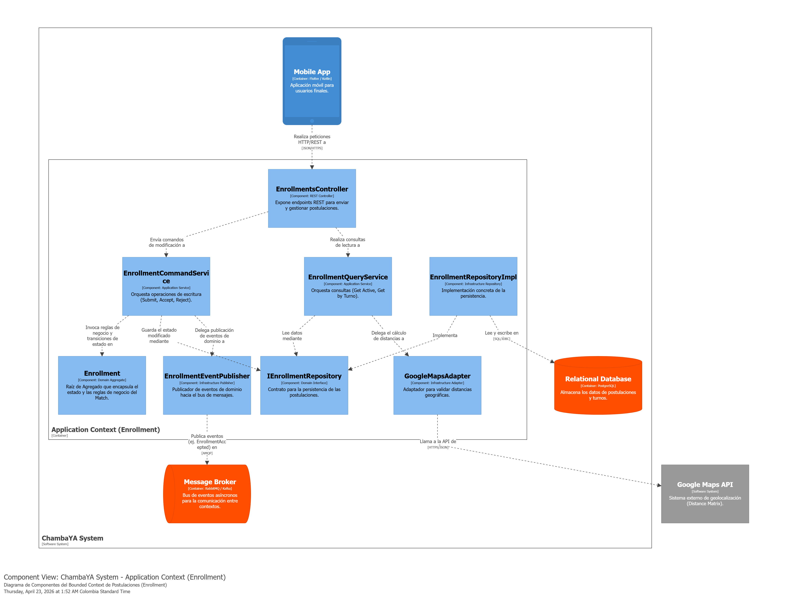

##### 2.6.2.6. Bounded Context Software Architecture Code Level Diagrams

###### 2.6.2.6.1. Bounded Context Domain Layer Class Diagrams

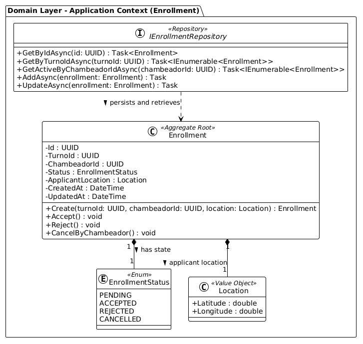

###### 2.6.2.6.2. Bounded Context Database Design Diagram

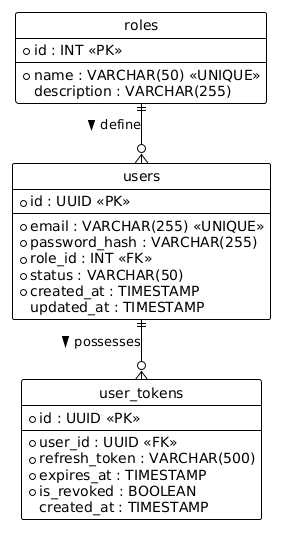

#### 2.6.3. Bounded Context: Job Context
##### 2.6.3.1. Domain Layer

La capa Job Context constituye el núcleo encargado de la fase de ejecución del trabajo. A diferencia del Application Context (que maneja el proceso de selección), este contexto asume el control una vez que existe un "Match" confirmado. Centraliza la lógica de negocio relacionada con la coordinación en tiempo real (habilitación de canales de chat), el seguimiento de asistencia, el reporte de incidencias (inasistencias) y las reglas de reapertura de turnos de emergencia.

**Aggregates**

| Nombre | Descripcion                                                                                                                                                                                                | Atributos                                                                                                                                                                    | Metodos                                                                                                   |
|--------|------------------------------------------------------------------------------------------------------------------------------------------------------------------------------------------------------------|------------------------------------------------------------------------------------------------------------------------------------------------------------------------------|------------------------------------------------------------------------------------------------------------|
| Shift  | Aggregate Root principal que representa el turno de trabajo en su fase de ejecución. Encapsula los participantes, el estado en vivo de la jornada, el canal de comunicación y las incidencias reportadas.  | `Id: UUID` <br/> <br/> `ContratanteId: UUID` <br/> <br/> `ChambeadorId: UUID `<br/> <br/> `ChatChannelId: string` <br/> <br/> `Status: ShiftExecutionStatus ` <br/> <br/> `ScheduledTime: DateTime` | `EnableChatChannel(string channelId): void`<br/> <br/> `ReportAbsence(string reason): void` <br/> <br/> `Reopen(): void`   |

**Value Object**

| Nombre               | Descripcion                                                                                                                                 | Atributos/Valores                                                                                                 |
|----------------------|---------------------------------------------------------------------------------------------------------------------------------------------|-------------------------------------------------------------------------------------------------------------------|
| ShiftExecutionStatus | Enumeración que modela los estados físicos del turno durante el Job Context.                                                                | `Scheduled`, `InProgress`, `Completed`, `CancelledDueToAbsence`, `Reopened`                                       |
| Incident             | Objeto de valor que encapsula los detalles de un problema reportado (ej. Inasistencia), usado para disparar las políticas de penalización.  | `ReportedBy: UUID` <br/> <br/> `Type: String`<br/> <br/> `Description: string`<br/> <br/> `ReportedAt: DateTime ` |

**Services**

| Nombre               | Descripcion                                                                                                                       | Metodos                                                                                                                                                                                                      |
|----------------------|-----------------------------------------------------------------------------------------------------------------------------------|--------------------------------------------------------------------------------------------------------------------------------------------------------------------------------------------------------------|
| IShiftCommandService | Interfaz que define las operaciones de negocio (comandos azules en tu diagrama) para alterar el estado de la ejecución del turno. | `Task Handle(EnableChatCommand command) `<br/> <br/>`Task Handle(SendReminderCommand command) `<br/> <br/>`Task Handle(ReportAbsenceCommand command) `<br/> <br/> `Task Handle(ReopenShiftCommand command) ` |
| IShiftQueryService   | Interfaz que expone consultas sobre la ejecución de los turnos para alimentar los Read Models (post-its verdes).                  | `Task<MatchScreenDto> Handle(GetMatchDetailsQuery query)` <br/> <br/>`Task<AttendanceReportDto> Handle(GetAttendanceReportQuery query)` <br/><br/>                                                           |

**Repositories**

| Nombre            | Descripcion                                                                                    |
|-------------------|------------------------------------------------------------------------------------------------|
| IShiftRepository  | Define la persistencia para la entidad (Aggregate Root) `Shift`  durante la fase de ejecución. |

**Domain Policies**

- Política de Penalidad Automática: "Siempre que se reporta una incidencia por inasistencia (No-Show), entonces emitir un evento de dominio para aplicar una penalidad automática en el Sistema de Reputación del Chambeador."


##### 2.6.3.2. Interface Layer

En esta capa se exponen los controladores y manejadores que permiten a los clientes externos (la aplicación móvil de ChambaYA) interactuar con la fase de ejecución de los turnos. Aquí se gestionan peticiones que requieren baja latencia, como la habilitación del chat y el reporte urgente de asistencia o incidencias. Estos controladores no contienen lógica de negocio; su única función es recibir el JSON de la app, mapearlo a Commands o Queries y delegar la responsabilidad a la capa de Aplicación.

**Controllers**

| Nombre                    | Descripcion                                                                                                                                | Endpoints                                                                                                                                                                                                                                                                                 |
|---------------------------|--------------------------------------------------------------------------------------------------------------------------------------------|-------------------------------------------------------------------------------------------------------------------------------------------------------------------------------------------------------------------------------------------------------------------------------------------|
| ShiftExecutionController  | Expone las operaciones para gestionar la ejecución de un turno que ya ha hecho "Match", incluyendo canales de comunicación e incidencias.  | `POST /api/v1/shifts/{id}/chat/enable` (EnableChatCommand) <br/> <br/> `POST /api/v1/shifts/{id}/reminders`(SendReminderCommand) <br/> <br/>  `POST /api/v1/shifts/{id}/absences ` (ReportAbsenceCommand) <br/> <br/> `POST /api/v1/shifts/{id}/reopen` (ReopenShiftCommand) <br/> <br/> `GET /api/v1/shifts/{id}/match-details`(GetMatchDetailsQuery) |


**Resources (DTO)**

| Resource              | Esquema                                                                                                                         |
|-----------------------|---------------------------------------------------------------------------------------------------------------------------------|
| EnableChatResource    | `{ "TurnoId": "550e8400-e29b...", "ContratanteId": "123e4567...", "ChambeadorId": "987e6543..." } `                             |
| ReportAbsenceResource | `{ "ReportedBy": "123e4567...", "Reason": "El chambeador no se presentó a la hora acordada y no responde el teléfono." } `      |
| MatchDetailsResource  | `{ "ShiftId": "550e8400...", "Status": "InProgress", "ChatChannelId": "chan_98765", "ScheduledTime": "2026-04-20T18:30:00Z" } ` |


##### 2.6.3.3. Application Layer

La capa de Aplicación orquesta el flujo de trabajo para la ejecución del turno. Recibe las intenciones del usuario (Commands) o las peticiones de datos (Queries) desde la Interface Layer, carga el Aggregate Root Shift desde la base de datos (usando repositorios de infraestructura), invoca las reglas de negocio del dominio y, si es necesario, publica eventos para notificar a otros Bounded Contexts (como el sistema de Reputación para aplicar penalidades).

**Commands**

| Nombre                      | Descripcion                                                                                                                                                                                                                                | Commands               |
|-----------------------------|--------------------------------------------------------------------------------------------------------------------------------------------------------------------------------------------------------------------------------------------|------------------------|
| EnableChatCommandHandler    | Orquesta la creación del canal de chat. Recupera el turno, invoca la API externa (Firebase FCM) para aprovisionar el canal, actualiza el estado en el agregado Shift y guarda los cambios.                                                 | `EnableChatCommand`    |
| SendReminderCommandHandler  | Busca el turno y orquesta el envío de notificaciones push tanto al MYPE como al joven, recordando la cercanía de la hora del turno.                                                                                                        | `SendReminderCommand ` |
| ReportAbsenceCommandHandler | Gestiona el "No-Show". Recupera el turno, registra la inasistencia en el agregado y lo persiste. Crucialmente, publica el evento de dominio AbsenceReportedEvent que será escuchado por el contexto de Reputación para penalizar al joven. | `ReportAbsenceCommand` |
| ReopenShiftCommandHandler   | En caso de inasistencia, este manejador orquesta la cancelación del turno actual para el joven ausente y emite un evento o comando cruzado para que el Application Context vuelva a publicar el turno de urgencia en el mapa.              | `ReopenShiftCommand`   |

**Queries**

| Nombre                                | Descripcion                                                                                                                                                       | Query                       |
|---------------------------------------|-------------------------------------------------------------------------------------------------------------------------------------------------------------------|-----------------------------|
| GetMatchDetailsQueryHandler           | Busca y devuelve la información necesaria para pintar la "Pantalla de Match", incluyendo datos de contacto de ambas partes y el enlace al canal de chat temporal. | `GetMatchDetailsQuery`      |
| GetAttendanceReportQueryHandler       | Devuelve la lista de chambeadores confirmados (o ausentes) para una MYPE, optimizada para la vista de control de personal del restaurante.                        | `GetAttendanceReportQuery`  |

##### 2.6.3.4. Infrastructure Layer

La `Infrastructure Layer` del Job Context se encarga de materializar las comunicaciones y la persistencia necesarias para la fase de ejecución. En esta capa se implementa el acceso a la base de datos para los turnos en curso, la integración crítica con Firebase (FCM) para la mensajería y notificaciones push, y la publicación de eventos de inasistencia que afectan la reputación del usuario.

**Repositories**

| Nombre           | Descripcion                                                                                                                                                                                    | Implementation                                                                                                                                                                                                                                                                                                                                                                    | 
|------------------|------------------------------------------------------------------------------------------------------------------------------------------------------------------------------------------------|-----------------------------------------------------------------------------------------------------------------------------------------------------------------------------------------------------------------------------------------------------------------------------------------------------------------------------------------------------------------------------------|
| ShiftRepository  | Responsable de la persistencia de los agregados `Shift ` durante su ejecución. Gestiona el ciclo de vida desde que se hace el Match hasta que el turno se cierra o se reabre por inasistencia. | - `Task<Shift?> GetByIdAsync(UUID id) `→ Recuperar el turno activo. <br/> <br/> - ` Task AddAsync(Shift shift)` → Registrar el inicio de la fase de ejecución. <br/> <br/> - `Task UpdateAsync(Shift shift)` → Actualizar el canal de chat o el estado de asistencia.<br/> <br/> - `Task<IEnumerable<Shift>> GetByUserAsync(UUID userId)` → Listar turnos activos para un usuario | 

**External Services & Firebase Integration**

| Nombre              | Descripcion                                                                                                                                                      | Implementation                                                                                                                                                                                                                                                                                                                                                                                                                       |
|---------------------|------------------------------------------------------------------------------------------------------------------------------------------------------------------|--------------------------------------------------------------------------------------------------------------------------------------------------------------------------------------------------------------------------------------------------------------------------------------------------------------------------------------------------------------------------------------------------------------------------------------|
| FirebaseChatAdapter | Adaptador encargado de la integración con Firebase Cloud Messaging (FCM) y Realtime Database/Firestore para habilitar el chat temporal entre la MYPE y el joven. | - `- Task<string> CreateTemporaryChannelAsync(UUID shiftId, UUID mypeId, UUID chambeadorId) `→ Crea el nodo de chat en Firebase y devuelve el ID del canal. <br/> <br/> - `Task SendPushNotificationAsync(NotificationTarget target, string message)` → Envía recordatorios de turno o alertas de inasistencia.<br/> <br/> - ` Task CloseChannelAsync(string channelId)`Deshabilita el acceso al chat una vez finalizado el trabajo. |  
| JobEventPublisher   | Publicador de eventos encargado de enviar alertas al sistema de reputación cuando ocurre una incidencia.                                                         | - `Task PublishAbsenceDetectedAsync(AbsenceEvent event)`    → Envía la señal para aplicar la penalidad automática si el joven no se presentó al local.                                                                                                                                                                                                                                                                               |   

##### 2.6.3.5. Bounded Context Software Architecture Component Level Diagrams
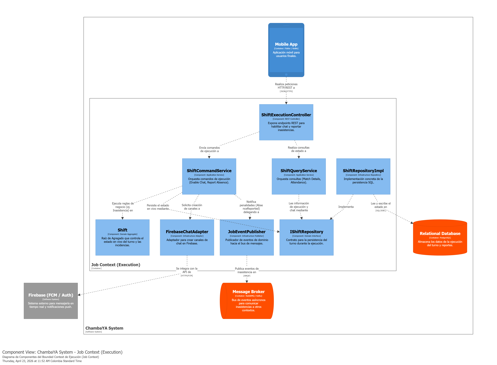
##### 2.6.3.6. Bounded Context Software Architecture Code Level Diagrams
###### 2.6.3.6.1. Bounded Context Domain Layer Class Diagrams
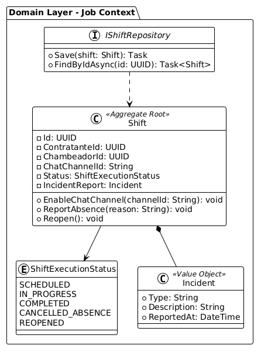
###### 2.6.3.6.2. Bounded Context Database Design Diagram

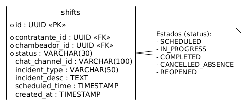

#### 2.6.4. Bounded Context: Communication Context
##### 2.6.4.1. Domain Layer
El Domain Layer del bounded context **Communication** agrupa la lógica de negocio relacionada con la interacción entre contratante y chambeador durante un turno activo. En esta capa se definen los elementos del dominio que permiten gestionar conversaciones, mensajes, incidencias, solicitudes de horas extra y confirmaciones de llegada, manteniendo la comunicación dentro de un entorno controlado por la aplicación.

#### **Aggregates**

| Nombre | Descripción | Atributos | Métodos |
|---|---|---|---|
| Conversation | Aggregate Root que representa el canal de comunicación activo entre contratante y chambeador dentro de un turno. Encapsula mensajes, incidencias y eventos operativos asociados a la coordinación del servicio | Id: string, ShiftId: string, ContractorId: string, WorkerId: string, Status: CommunicationStatus, CreatedAt: DateTime, UpdatedAt: DateTime | Open(): void, Close(): void, AddMessage(Message message): void, RegisterIncident(IncidentReport incident): void, ConfirmArrival(ArrivalConfirmation arrival): void, RequestOvertime(OvertimeRequest request): void |
|
---
#### **Entities**

| Nombre | Descripción | Atributos |
|---|---|---|
| Message | Entidad que representa un mensaje enviado dentro de una conversación activa | Id: string, ConversationId: string, SenderId: string, Content: MessageContent, SentAt: DateTime |
| IncidentReport | Entidad que representa una incidencia o imprevisto reportado durante la ejecución del turno | Id: string, ConversationId: string, ReportedBy: string, Description: string, CreatedAt: DateTime, Status: string |
| OvertimeRequest | Entidad que representa una solicitud de horas extra generada durante el turno y evaluada por el contratante | Id: string, ConversationId: string, RequestedBy: string, ExtraHours: int, Status: string, RequestedAt: DateTime |
| ArrivalConfirmation | Entidad que representa la confirmación de llegada del chambeador al lugar del turno | Id: string, ConversationId: string, WorkerId: string, ConfirmedAt: DateTime |
|
---
#### **Value Objects**

| Nombre | Descripción | Atributos / Valores |
|---|---|---|
| MessageContent | Objeto de valor que representa el contenido textual de un mensaje | Text: string |
| CommunicationStatus | Objeto de valor que modela el estado actual de la conversación | Active, Closed |
| NotificationType | Objeto de valor que representa el tipo de notificación generada dentro del contexto | Message, Incident, Arrival, OvertimeRequest, Reminder |
| IncidentType | Objeto de valor que clasifica el tipo de incidencia reportada | Delay, Absence, OperationalIssue, Other |
|

#### **Services**

| Nombre | Descripción | Métodos |
|---|---|---|
| ICommunicationCommandService | Interfaz que define las operaciones de negocio que modifican el estado de la conversación y sus entidades relacionadas | Handle(SendMessageCommand command), Handle(ReportIncidentCommand command), Handle(ConfirmArrivalCommand command), Handle(RequestOvertimeCommand command), Handle(CloseConversationCommand command) |
| ICommunicationQueryService | Interfaz que expone consultas sobre conversaciones, mensajes e incidencias | Handle(GetConversationByIdQuery query), Handle(GetMessagesByConversationQuery query), Handle(GetIncidentsByConversationQuery query), Handle(GetOvertimeRequestsByConversationQuery query) |


#### **Repositories**

| Nombre | Descripción |
|---|---|
| IConversationRepository | Define la persistencia del aggregate Conversation y de sus entidades relacionadas |

---

##### 2.6.4.2. Interface Layer

En esta capa se exponen los controladores y recursos que permiten a las aplicaciones móviles interactuar con el bounded context **Communication**. Los controladores reciben solicitudes externas, validan la entrada, transforman los datos en comandos o consultas y delegan la ejecución a los servicios de aplicación correspondientes. De esta manera, la lógica de negocio permanece aislada en las capas internas del dominio.

#### **Controllers**

| Nombre | Descripción | Endpoints (ejemplos) |
|---|---|---|
| ConversationsController | Expone operaciones relacionadas con la gestión de conversaciones activas entre contratante y chambeador durante un turno. Permite consultar conversaciones, listar mensajes, registrar nuevas interacciones y cerrar la comunicación cuando el turno concluye | `GET /api/conversations/{id}` (GetConversationByIdQuery) <br> `GET /api/conversations/{id}/messages` (GetMessagesByConversationQuery) <br> `POST /api/conversations/{id}/messages` (SendMessageCommand) <br> `POST /api/conversations/{id}/close` (CloseConversationCommand) |
| IncidentsController | Expone operaciones para registrar y consultar incidencias reportadas durante la ejecución del turno | `POST /api/conversations/{id}/incidents` (ReportIncidentCommand) <br> `GET /api/conversations/{id}/incidents` (GetIncidentsByConversationQuery) |
| ArrivalsController | Expone la operación de confirmación de llegada del chambeador al lugar del turno. | `POST /api/conversations/{id}/arrival-confirmation` (ConfirmArrivalCommand) |
| OvertimeRequestsController | Expone operaciones para registrar y consultar solicitudes de horas extra generadas durante un turno activo | `POST /api/conversations/{id}/overtime-requests` (RequestOvertimeCommand) <br> `GET /api/conversations/{id}/overtime-requests` (GetOvertimeRequestsByConversationQuery) |

#### **Resources**

| Resource | Esquema (ejemplos) |
|---|---|
| SendMessageResource | `json { "senderId": "worker-123", "content": "Ya llegué al local." }` |
| MessageResource | `json { "id": "msg-001", "conversationId": "conv-123", "senderId": "worker-123", "content": "Ya llegué al local.", "sentAt": "2026-10-01T18:30:00Z" }` |
| ReportIncidentResource | `json { "reportedBy": "worker-123", "description": "El local está cerrado.", "type": "OperationalIssue" }` |
| IncidentResource | `json { "id": "inc-001", "conversationId": "conv-123", "reportedBy": "worker-123", "description": "El local está cerrado.", "status": "Open", "createdAt": "2026-10-01T18:35:00Z" }` |
| ConfirmArrivalResource | `json { "workerId": "worker-123", "confirmedAt": "2026-10-01T18:28:00Z" }` |
| OvertimeRequestResource | `json { "requestedBy": "worker-123", "extraHours": 2 }` |
| ConversationResource | `json { "id": "conv-123", "shiftId": "shift-001", "contractorId": "contractor-001", "workerId": "worker-123", "status": "Active", "createdAt": "2026-10-01T18:00:00Z", "updatedAt": "2026-10-01T18:30:00Z" }` |


#### **Assemblers**

Los Assemblers encapsulan la transformación entre los Resources expuestos por la API y los Commands/Queries utilizados por la capa de aplicación. Esto permite mantener a los controladores ligeros y enfocados únicamente en la interacción con el protocolo HTTP.

- **SendMessageResourceToCommandAssembler** convierte un `SendMessageResource` en un `SendMessageCommand`
- **MessageEntityToMessageResourceAssembler** convierte una entidad `Message` en un `MessageResource`.
- **ReportIncidentResourceToCommandAssembler** convierte un `ReportIncidentResource` en un `ReportIncidentCommand`
- **IncidentEntityToIncidentResourceAssembler** convierte una entidad `IncidentReport` en un `IncidentResource`
- **ConfirmArrivalResourceToCommandAssembler** convierte un `ConfirmArrivalResource` en un `ConfirmArrivalCommand`
- **OvertimeRequestResourceToCommandAssembler** convierte un `OvertimeRequestResource` en un `RequestOvertimeCommand`
- **ConversationEntityToConversationResourceAssembler** convierte una entidad `Conversation` en un `ConversationResource`


##### 2.6.4.3. Application Layer

La Application Layer del bounded context **Communication** se encarga de orquestar la ejecución de las operaciones relacionadas con la interacción entre contratante y chambeador durante un turno activo. Esta capa recibe comandos y consultas desde la Interface Layer, valida la información de entrada y delega la lógica de negocio al Domain Layer.

Asimismo, coordina el uso de repositorios para la persistencia de datos y prepara la información que será devuelta a la capa de presentación, manteniendo una separación clara entre la lógica del dominio y los detalles de infraestructura.

#### **Command Services**

| Nombre | Descripción | Commands manejados |
|---|---|---|
| CommunicationCommandService | Gestiona las operaciones que modifican el estado de la conversación y sus entidades asociadas | SendMessageCommand, ReportIncidentCommand, ConfirmArrivalCommand, RequestOvertimeCommand, CloseConversationCommand | 


#### **Query Services**

| Nombre | Descripción | Queries manejadas |
|---|---|---|
| CommunicationQueryService | Expone consultas relacionadas con conversaciones, mensajes, incidencias y solicitudes de horas extra | GetConversationByIdQuery, GetMessagesByConversationQuery, GetIncidentsByConversationQuery, GetOvertimeRequestsByConversationQuery |


##### 2.6.4.4. Infrastructure Layer

La Infrastructure Layer del bounded context **Communication** se encarga de la persistencia de datos y de la integración con servicios externos necesarios para el funcionamiento del sistema. Esta capa proporciona las implementaciones concretas de los repositorios definidos en el Domain Layer, así como los adaptadores para servicios de mensajería y notificaciones.

Asimismo, permite desacoplar la lógica de negocio de los detalles tecnológicos, facilitando la evolución del sistema y el cambio de tecnologías sin afectar las capas internas.

#### **Repositories**

| Nombre | Descripción | Implementación (ejemplos de métodos) |
|---|---|---|
| ConversationRepository | Implementación concreta del repositorio encargado de la persistencia del aggregate Conversation y sus entidades relacionadas | - GetByIdAsync(id) <br> - GetMessagesByConversationId(conversationId) <br> - AddMessageAsync(message) <br> - AddIncidentAsync(incident) <br> - AddOvertimeRequestAsync(request) <br> - UpdateConversationStatus(status) |
|


#### **Persistence**

| Componente | Descripción |
|---|---|
| MongoDB | Base de datos no relacional utilizada para almacenar conversaciones, mensajes, incidencias y solicitudes de horas extra, permitiendo flexibilidad en la estructura de los datos |
|

#### **External Services Integration**

| Nombre | Descripción | Implementación (ejemplos) |
|---|---|---|
| NotificationAdapter (FCM) | Adaptador encargado de la integración con Firebase Cloud Messaging para el envío de notificaciones en tiempo real | - SendMessageNotification(userId, message) <br> - SendIncidentNotification(conversationId) <br> - SendArrivalConfirmationNotification(conversationId) <br> - SendOvertimeRequestNotification(conversationId) |


##### 2.6.4.5. Bounded Context Software Architecture Component Level Diagrams
El siguiente diagrama de componentes representa la estructura interna del bounded context **Communication**, mostrando la organización de sus elementos en capas y la interacción entre ellas.

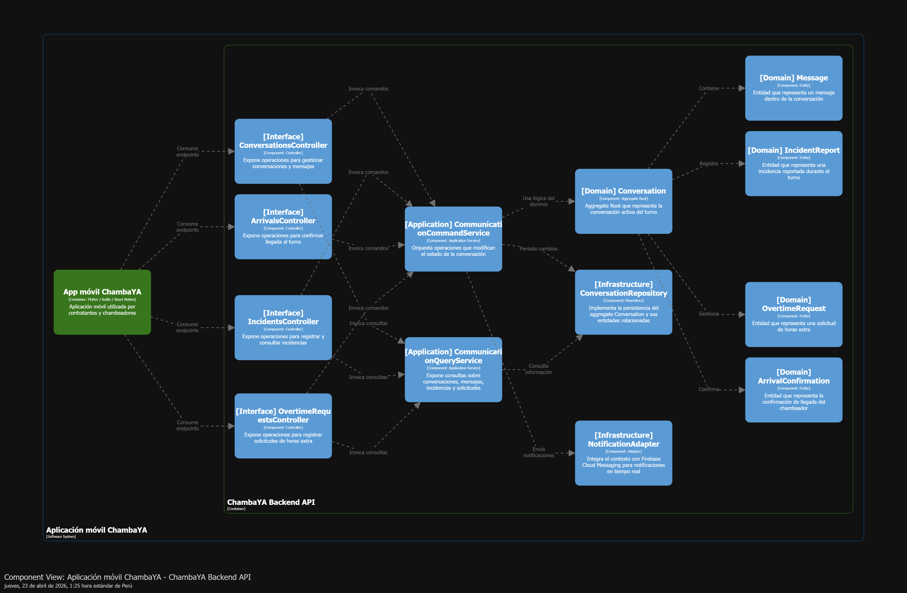

Se identifican los controladores en la capa de interfaz, los servicios de aplicación encargados de orquestar las operaciones, los elementos del dominio que contienen la lógica de negocio y los componentes de infraestructura responsables de la persistencia y la integración con servicios externos.

Este enfoque permite mantener una separación clara de responsabilidades, facilitando la escalabilidad y mantenibilidad del sistema.


##### 2.6.4.6. Bounded Context Software Architecture Code Level Diagrams
En esta sección se presentan los diagramas de nivel de código correspondientes al bounded context **Communication**. Estos diagramas permiten representar con mayor detalle la estructura interna del contexto, tanto desde la perspectiva del modelo de dominio como desde la persistencia de la información.

###### 2.6.4.6.1. Bounded Context Domain Layer Class Diagrams

A continuación, se presenta el diagrama de clases del Domain Layer del bounded context **Communication**. En este diagrama, **Conversation** se identifica como la clase principal, ya que concentra la interacción entre contratante y chambeador durante un turno activo.

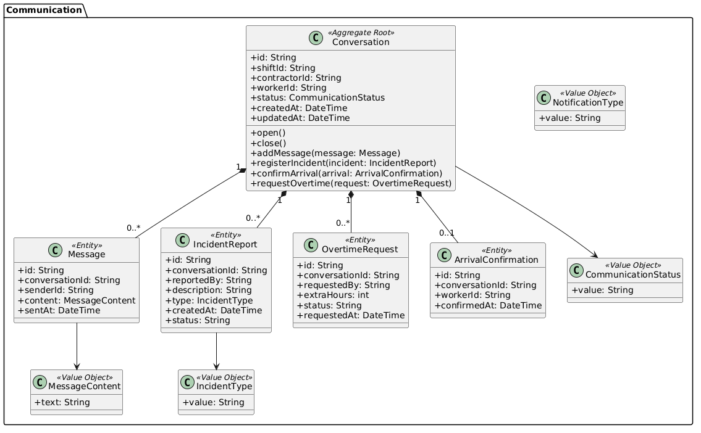

Además, se relaciona con entidades como **Message**, **IncidentReport**, **OvertimeRequest** y **ArrivalConfirmation**, así como con value objects que complementan la consistencia del modelo del dominio.

###### 2.6.4.6.2. Bounded Context Database Design Diagram

El siguiente diagrama muestra el diseño de persistencia del bounded context **Communication** en MongoDB. La colección **conversations** concentra la información principal de la conversación y los datos relacionados con mensajes, incidencias, solicitudes de horas extra y confirmaciones de llegada.

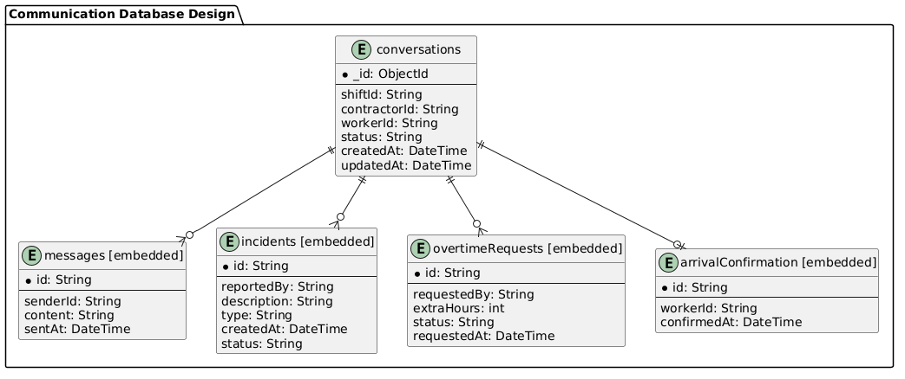


#### 2.6.5. Bounded Context: Payment Context
##### 2.6.5.1. Domain Layer

La capa Payment And Subscriptions constituye el núcleo del bounded context encargado de la administración de cuentas y suscripciones de usuarios y negocios, centralizando la lógica relacionada con la gestión de planes de pago y su ciclo de vida.

En esta capa se definen las reglas y comportamientos propios del dominio de pagos y suscripciones: creación y mantenimiento de cuentas (Account), afiliación de usuarios o negocios a planes de pago mediante suscripciones (Subscription), gestión de estados de vigencia y control de renovaciones o cancelaciones.

## Aggregates

| Nombre           | Descripción                                                                          | Atributos                                                                                                                                          | Métodos                                                                                            |
|------------------|--------------------------------------------------------------------------------------|----------------------------------------------------------------------------------------------------------------------------------------------------|----------------------------------------------------------------------------------------------------|
| **Account**      | Representa la cuenta de un usuario o negocio dentro del sistema.                     | `Id: string, Business: Business, AccountRole: EAccountRole, Status: EAccountStatus, OwnerUserId: string`                                           | `ActivateAccount(), GetCreationDate(), GetBusinessName(), GetBusinessEmail()`                      |
| **Subscription** | Representa la suscripción de una cuenta a un plan, controlando su estado y vigencia. | `Id: string, SubscribedAccountId: string, SubscribedAccount: Account, AssociatedPlanId: string, AssociatedPlan: Plan, Status: ESubscriptionStatus` | `ActivateSubscription(), ActivateWithPlan(Plan newPlan), CalculateExpirationDate(), UpgradePlan()` |

---

## Entities

| Nombre       | Descripción                                                         | Atributos                                                                                                                                           | Métodos                                                                                   |
|--------------|---------------------------------------------------------------------|-----------------------------------------------------------------------------------------------------------------------------------------------------|-------------------------------------------------------------------------------------------|
| **Plan**     | Define los planes de suscripción disponibles y sus características. | `Id: string, PlanType: EPlanType, Description: string, PaymentFrequency: EPaymentFrequency, PlanPrice: Money, MaxWarehouses: int, MaxProducts: int` | `CreateFreePlan(), CreatePremiumMonthlyPlan(), CreatePremiumAnnualPlan(), ValidatePlan()` |
| **Business** | Representa un negocio asociado a una cuenta.                        | `Id: string, BusinessName: BusinessName, BusinessEmail: BusinessEmail, Ruc: string`                                                                 | ``                                                                                        |

---

## Value Objects

| Nombre                  | Descripción                                                     | Atributos / Métodos                           |
|-------------------------|-----------------------------------------------------------------|-----------------------------------------------|
|          | |    |
| **EPaymentFrequency**   | Define la frecuencia de pago de un plan.                        | `Valores: Monthly, Annual`                    |
| **EPlanType**           | Define el tipo de plan de suscripción.                          | `Valores: Free, Premium`                      |
| **BusinessName**        | Valor que representa el nombre del negocio.                     | `Atributos: { Name: string }`                 |
| **BusinessEmail**       | Valor que representa el correo electrónico del negocio.         | `Atributos: { Email: string }`                |
| **Ruc**                 | Valor que representa el número de RUC del negocio.              | `Atributos: { Ruc: string }`                
| **ESubscriptionStatus** | Define los posibles estados de una suscripción.                 | `Valores: Active, Expired, Canceled, Pending` |
| **EAccountStatus**      | Define los posibles estados de una cuenta.                      | `Valores: Active, Inactive, Suspended`  

---

## Services

| Nombre                          | Descripción                                                        | Métodos (Commands / Queries)                                                                                    |
|---------------------------------|--------------------------------------------------------------------|-----------------------------------------------------------------------------------------------------------------|
| **ISubscriptionCommandService** | Gestiona la creación, activación y actualización de suscripciones. | `CreateSubscriptionCommand, ActivateSubscriptionCommand, UpgradeSubscriptionCommand, CancelSubscriptionCommand` |
| **IAccountCommandService**      | Gestiona operaciones sobre cuentas de usuario o negocio.           | `CreateAccountCommand, ActivateAccountCommand, SuspendAccountCommand`                                           |
| **IPlanCommandService**         | Gestiona la creación y actualización de planes de suscripción.     | `CreatePlanCommand, UpdatePlanCommand, DeletePlanCommand`                     |


---

## Repositories

| Nombre                     | Descripción                                              | Métodos                                                                                                                                                                              |
|----------------------------|----------------------------------------------------------|--------------------------------------------------------------------------------------------------------------------------------------------------------------------------------------|
| **AccountRepository**      | Persistencia y consulta de cuentas en la base de datos.  | `AddAsync(Account account), UpdateAsync(Account account), DeleteAsync(Guid id), GetByIdAsync(Guid id), GetByStatusAsync(EAccountStatus status), GetByRoleAsync(EAccountRole role)`   |
| **PlanRepository**         | Persistencia y consulta de planes de suscripción.        | `AddAsync(Plan plan), UpdateAsync(Plan plan), DeleteAsync(Guid id), GetByIdAsync(Guid id), GetAllAsync(), GetByTypeAsync(EPlanType type)`                                            |
| **SubscriptionRepository** | Persistencia y consulta de suscripciones.                | `AddAsync(Subscription subscription), UpdateAsync(Subscription subscription), DeleteAsync(Guid id), GetByIdAsync(Guid id), GetByAccountAsync(AccountId accountId), GetActiveAsync()` |
|
##### 2.6.5.2. Interface Layer


La **Interface Layer** expone los servicios del bounded context hacia el exterior mediante **APIs REST**, permitiendo que clientes externos (web o móvil) interactúen con las cuentas, suscripciones, planes y negocios.  
Se definen los **Controllers**, **Resources** y **Assemblers/Transformers**, encargados de mapear entre las entidades de dominio y los formatos de entrada/salida utilizados por los consumidores.

---

## Controllers

| Nombre                      | Descripción                                              | Endpoints (ejemplos)                                                                                                                                                  |
|-----------------------------|----------------------------------------------------------|-----------------------------------------------------------------------------------------------------------------------------------------------------------------------|
| **PlansController**         | Gestiona los planes de suscripción.                      | `POST /plans (CreatePlan)`<br>`PUT /plans/{id} (UpdatePlan)`<br>`GET /plans/{id}`<br>`GET /plans`
---

## Resources

Los **Resources** definen la estructura de datos que los clientes externos envían o reciben, evitando exponer directamente las entidades del dominio.

- **CreateAccountResource**: `{ BusinessId: string, OwnerUserId: string, Role: string }`
- **AccountResource**: `{ Id: string, BusinessName: string, Email: string, Status: string, Role: string }`
- **CreateSubscriptionResource**: `{ AccountId: string, PlanId: string }`
- **SubscriptionResource**: `{ Id: string, AccountId: string, PlanId: string, Status: string, ExpirationDate: DateTime }`
- **CreatePlanResource**: `{ PlanType: string, Description: string, PaymentFrequency: string, Price: decimal, MaxWarehouses: int, MaxProducts: int }`
- **PlanResource**: `{ Id: string, PlanType: string, Description: string, PaymentFrequency: string, Price: decimal, MaxWarehouses: int, MaxProducts: int }`
- **CreateBusinessResource**: `{ BusinessName: string, Email: string, Ruc: string }`
- **BusinessResource**: `{ Id: string, BusinessName: string, Email: string, Ruc: string }`

## Assemblers / Transformers

Se implementan componentes que transforman los **Resources** ↔ **Entities/Aggregates**, asegurando que la capa de interfaces no contenga lógica de negocio.

- `SubscriptionFromResourceAssembler` → Convierte un `CreateSubscriptionResource` en `CreateSubscriptionCommand`.
- `SubscriptionResourceFromEntityAssembler` → Convierte un `Subscription` en `SubscriptionResource`.
- `BusinessFromResourceAssembler` → Convierte un `CreateBusinessResource` en `CreateBusinessCommand`.
- `BusinessResourceFromEntityAssembler` → Convierte un `Business` en `BusinessResource`.

##### 2.6.5.3. Application Layer

La **Application Layer** orquesta la ejecución de **comandos** y **consultas** para los agregados `Account`, `Subscription` y `Business`.  
Se encarga de delegar la lógica de negocio a la **Domain Layer** mediante los **CommandServices** y **QueryServices**, y de coordinar eventos si aplica.

---

## Command Services

Los **Command Services** procesan acciones que **modifican el estado del dominio**, como crear, actualizar o eliminar entidades.  
Reciben **Commands**, los validan y delegan la ejecución a los **Domain Services** y **Repositories** correspondientes.

| Nombre                         | Descripción                                 | Commands manejados                                                                                      |
|--------------------------------|---------------------------------------------|---------------------------------------------------------------------------------------------------------|
| **AccountCommandService**      | Gestiona operaciones sobre cuentas.         | `CreateAccountCommand, UpdateAccountCommand, ActivateAccountCommand, DeactivateAccountCommand`          |
| **SubscriptionCommandService** | Gestiona el ciclo de vida de suscripciones. | `CreateSubscriptionCommand, UpdateSubscriptionCommand, ActivateSubscriptionCommand, UpgradePlanCommand`                                        |
| **BusinessCommandService**     | Gestiona negocios asociados a cuentas.      | `CreateBusinessCommand, UpdateBusinessCommand`                                                          |

---

## Query Services

Los **Query Services** se encargan de **consultar datos del dominio** sin modificar su estado.  
Reciben **Queries**, consultan los **Repositories** y devuelven resultados al **Controller** o consumidor de la API.

| Nombre                       | Descripción                            | Queries manejadas                                                                                |
|------------------------------|----------------------------------------|--------------------------------------------------------------------------------------------------|
| **AccountQueryService**      | Consultas sobre cuentas.               | `GetAccountByIdQuery, GetAccountsByStatusQuery, GetAccountsByBusinessQuery, GetAllAccountsQuery` |
| **SubscriptionQueryService** | Consultas sobre suscripciones.         | `GetSubscriptionByIdQuery, GetSubscriptionsByAccountQuery, GetActiveSubscriptionsQuery`                                        |
| **BusinessQueryService**     | Consultas sobre negocios.              | `GetBusinessByIdQuery, GetAllBusinessesQuery`                                                    |

##### 2.6.5.4. Infrastructure Layer

La **Infrastructure Layer** proporciona las implementaciones técnicas necesarias para que la **Application Layer** y la **Domain Layer** funcionen correctamente.  
Incluye la **persistencia de datos** y , y cualquier dependencia tecnológica concreta.

---

## Repositories

Los **Repositories** implementan la persistencia de los agregados definidos en el dominio y actúan como puente entre las **Entities/Aggregates** y la base de datos o servicios externos.

| Nombre                     | Descripción                                        | Implementación típica                                                                                                                                                                                                                                                                                                                                                                              |
|----------------------------|----------------------------------------------------|----------------------------------------------------------------------------------------------------------------------------------------------------------------------------------------------------------------------------------------------------------------------------------------------------------------------------------------------------------------------------------------------------|
| **AccountRepository**      | Gestiona la persistencia de cuentas.               | - `AddAsync(Account account)` → Insertar nueva cuenta.<br>- `UpdateAsync(Account account)` → Actualizar cuenta.<br>- `DeleteAsync(string id)` → Eliminar cuenta.<br>- `GetByIdAsync(string id)` → Obtener cuenta por Id.<br>- `GetByStatusAsync(EAccountStatus status)` → Filtrar cuentas por estado.<br>- `GetAllAsync()` → Obtener todas las cuentas.                                            |
| **SubscriptionRepository** | Gestiona la persistencia de suscripciones.         | - `AddAsync(Subscription subscription)` → Crear suscripción.<br>- `UpdateAsync(Subscription subscription)` → Actualizar suscripción.<br>- `DeleteAsync(string id)` → Eliminar suscripción.<br>- `GetByIdAsync(string id)` → Obtener suscripción por Id.<br>- `GetByAccountAsync(string accountId)` → Obtener suscripciones de una cuenta.<br>- `GetActiveAsync()` → Obtener suscripciones activas.                                                                                |


## External Payment Integration

| Nombre                 | Descripción                                                     | Implementación típica                                                                                                                                                                                                                                                                                                                       |
|------------------------|-----------------------------------------------------------------|---------------------------------------------------------------------------------------------------------------------------------------------------------------------------------------------------------------------------------------------------------------------------------------------------------------------------------------------|
| **PAYPAL** | Gestiona la comunicación con la API de PayPal. | - `CreatePayment(PaymentRequest request)` → Crear un pago en PayPal.<br>- `GetPaymentStatus(string paymentId)` → Consultar el estado de un pago.<br>- `CancelPayment(string paymentId)` → Cancelar un pago.<br>- `WebhookHandler(EventPayload payload)` → Procesar eventos de PayPal (pagos aprobados, rechazados, pendientes). |

##### 2.6.5.5. Bounded Context Software Architecture Component Level Diagrams

#### Diagrama de componentes: Suscripciones y cuentas ####

<p align="center">
  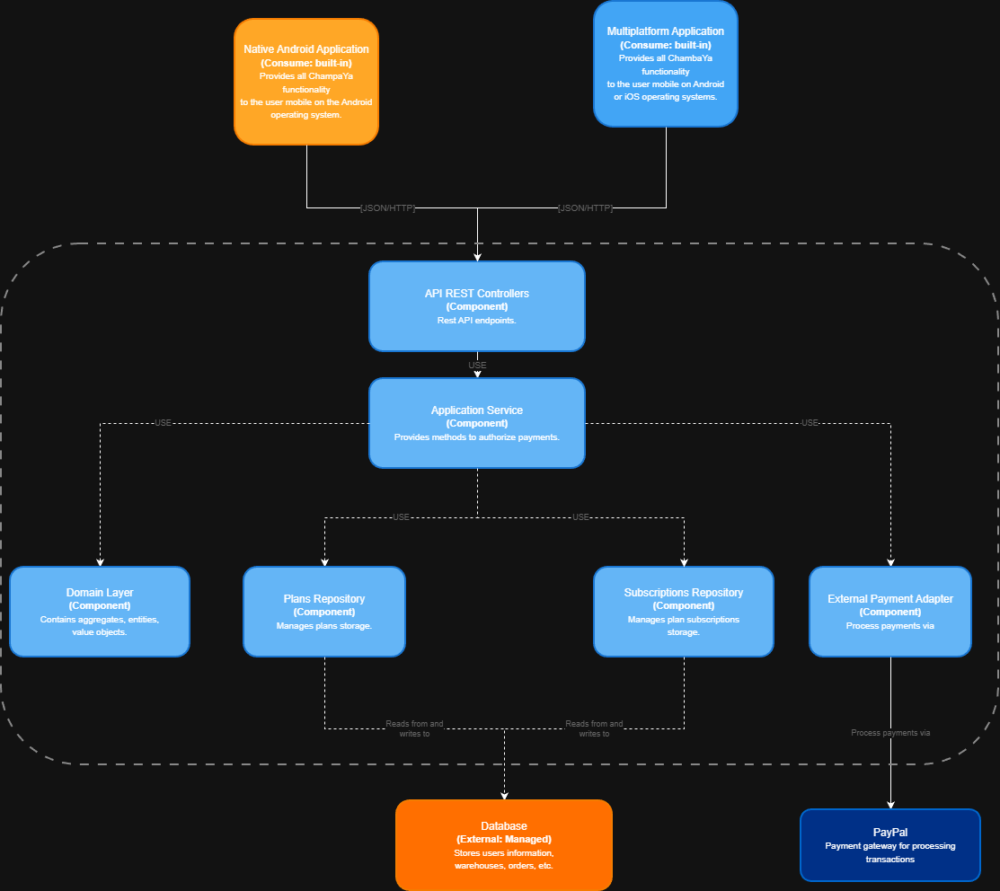
</p>

En la imagen se aprecia el diagrama de componentes para el contexto de cuentas y suscripciones. En este diagrama, se muestra que la información de las suscripciones y cuentas se almacenan en la base de datos gracias al uso de repositorios para cada una de dichas entidades. Además, se evidencia la relación con el sistema externo de MercadoPago para la compra de suscripciones por parte de los usuarios de la aplicación.

##### 2.6.5.6. Bounded Context Software Architecture Code Level Diagrams

En esta sección, se muestran y explican los diagramas de clases y de base de datos relacionados al contexto delimitado sobre la creación de cuentas y suscripciones.

##### 4.2.5.6.1. Bounded Context Domain Layer Class Diagrams #####

A continuación, se muestra el diagrama de clases del contexto presente

#### Clase principal: 'Account' ####

<p align="center">
  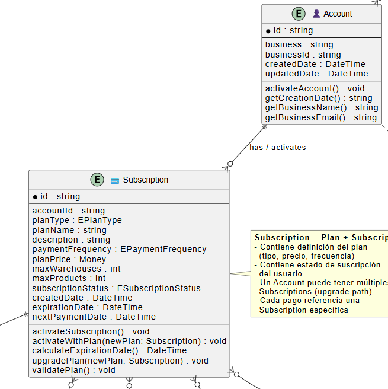
</p>

En este diagrama se visualiza tanto a la clase llamada 'Account' como la clase 'Subscription'. Ambas clases se encuentran relacionadas. Mientras que una hace referencia a una cuenta general que utiliza una empresa, la otra hace referencia al tipo de suscripción que pagó dicha cuenta.


#### Value Objects ####

<p align="center">
  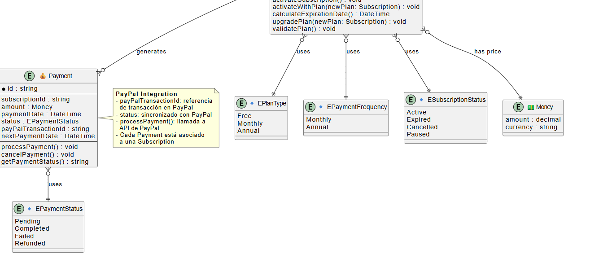
</p>

Finalmente, en este diagrama se muestran los 'value objecs' del contexto de suscripciones. Estas clases contienen información relacionada a valores enumerados para algunos atributos como, por ejemplo, 'ESubscriptionStatus' que forma parte de la clase 'Subscription' que sirve para indicar el estado actual de la suscripción de una cuenta.

###### 2.6.5.6.2. Bounded Context Database Design Diagram

A continuación, se muestra y explica el diagrama de documentos relacionado a la base de datos no relacional que se usará. Este diagrama de documentos refleja como la información del contexto presente persiste en una base de datos en MongoDB.

<p align="center">
  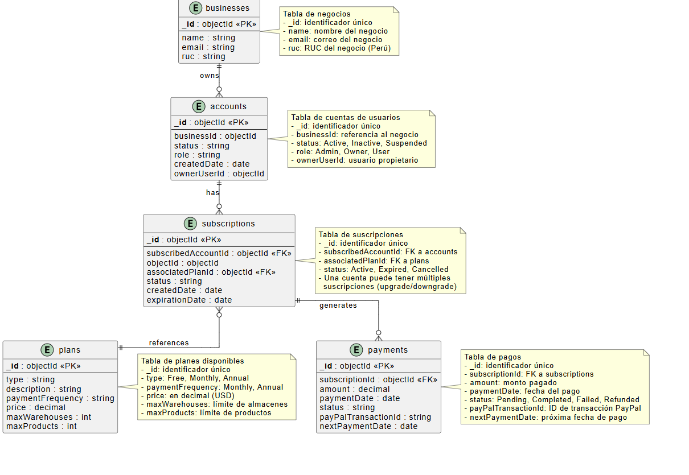
</p>


---

## Capítulo III: Solution UI/UX Design

### 3.1. Product Design
#### 3.1.1. Style Guidelines

En esta sección, el equipo establece un repositorio organizado y central de elementos comunes (assets, fonts, colores, iconografía) para mantener una presentación visual consistente y enfocada, alineada con el espíritu de ChambaYa: dinámico, confiable y cercano a la cultura popular peruana.

##### 3.1.1.1. General Style Guidelines

##### Branding
- Identidad visual moderna y profesional que transmite **confiabilidad**, **rapidez** y **energia juvenil**.
- Iconografía clara e intuitiva: íconos simples y reconocibles para acciones principales.
 ##### Typography
 - Tipografías Inter de alta legibilidad optimizadas para dispositivos móviles.
- Sistema de jerarquía tipográfica:
  - **Títulos principales**: Semi Bold, tamaño grande para encabezados de pantalla
  - **Subtítulos**: Medium para secciones y tarjetas
  - **Texto general**: Regular para contenido de lectura
  - **Labels**: Regular para etiquetas de formularios

  ##### Colors
- Paleta de colores basada en tonos azules como color principal:
  - **Primario**: azul (#2563EB aproximadamente) - botones principales, elementos activos
  - **Secundarios**: Verde dinámico(#22C55E aproximadamente) tonos claros de verde para turno disponible, aceptado
  - **Neutros**: Negro suave (#0F172A), Gris oscuro(#334155), Gris claro(#E2E8F0) y Blanco (#FFFFFF)
  - **Accentos**: HEX (#F97316 aproximadamente) para turnos urgentes, alertas, “Se necesita YA”
  - Los colores transmiten **profesionalismo, confianza y rapidez**
 
   

##### Spacing
- Sistema de espaciado consistente:
  - Padding interno de tarjetas: 16px - 24px
  - Separación entre elementos: 12px - 16px
  - Márgenes laterales: 16px - 20px
  - Espacios que mantienen sensación de **orden y claridad visual**

##### Communication Tone
- Tono de comunicación:
  - **Claro y directo** en instrucciones
  - **Amigable pero profesional** en mensajes
  - **Conciso** en labels y descripciones
  - Uso de lenguaje **accesible** para usuarios urbanos

##### Dimension Guidelines
- Componentes de UI con dimensiones estándar:
  - **Botones principales**: Altura 48px - 56px (óptimo para touch)
  - **Íconos**: 24px - 32px
  - **Inputs de texto**: Altura 48px - 56px
  - **Tarjetas de información**: Width: full screen con padding lateral
  - **Bottom Navigation Bar**: Altura 56px - 64px

#### 3.1.2. Information Architecture
##### 3.1.2.1. Organization Systems


**Jerárquico (Visual Hierarchy):**

Se prioriza la información crítica para la toma rápida de decisiones. En la pantalla principal (Home), los elementos más destacados son:

- Turnos disponibles cercanos
- Pago por turno
- Distancia
- Estado (Disponible / Urgente)

**Secuencial (Step-by-Step):**
Implementado en:
- Registro de chambeador o contratante
- Creación de perfil basado en habilidades
- Publicación de turnos (MYPEs)
- Confirmación de llegada y finalización

**Por Tópicos:**
La información se agrupa en secciones claras:
- **Home**: Turnos disponibles y recomendaciones
- **Map**: Visualización geolocalizada de trabajos
- **Chat**: Comunicación entre usuario y contratante
- **Profile**: Configuración y reputación del usuario

**Según Audiencia:**
- **Chambeadores**: Acceso a visualización de mapa, turnos y Chat
- **Contratantes**: Acceso a creacion de turnos, búsqueda y Gestionar turnos

##### 3.1.2.2. Labelling Systems

Etiquetas diseñadas para ser claras y autoexplicativas:

**Ejemplos de Etiquetas:**
- "Welcome" / "Create your account" (pantallas de autenticación)
- "Edit Profile" (acciones de edición)
- "Name" / "Email" / "Password" / "National ID" (campos de formulario)

##### 3.1.2.3. SEO Tags and Meta Tags

**Landing Page:**
- **Title:** ""ChambeaYa""
- **Meta Description:** "Conecta con trabajos temporales cerca de ti. Encuentra turnos flexibles o cubre necesidades de personal en minutos."
- **Keywords:** trabajos temporales, empleo por horas, trabajos cerca, MYPEs, empleo juvenil, turnos flexibles, trabajo rápido
- **Author:** Equipo ChambeaYa

**Aplicación Móvil:**
- **Title (Routes):** "ChambeaYa"
- **Meta Description:** "Explora turnos cercanos, postula y trabaja en minutos"

##### 3.1.2.4. Searching Systems

Sistema de búsqueda implementado en:

**Búsqueda por Filtros:**
- Distancia 
- Tipo de trabajo
- Horarios disponibles
- Estado

**Resultados de Búsqueda:**
Mostrados en tarjetas con información clave:
- Tipo de trabajo
- Pago
- Ubicación y distancia
- Estado

**Navegación por Mapa:**
Visualización de rutas y paradas en mapa interactivo (visible en las pantallas de mapas del Figma)

##### 3.1.2.5. Navigation Systems

Sistema de navegación diseñado para acceso rápido y uso intuitivo.

**Navegacion principal:**
- **Home**
- **Mapa**
- **Turnos**
- **Perfil**

**Navegacion contextual:**
- Desde Home
- Desde Detalle
- Desde turno activo
- Desde notificación

#### 3.1.3. Landing Page UI Design
##### 3.1.3.1. Landing Page Wireframe

Para el desarrollo del Landing Page de ChambaYa, se realizaron diversos bosquejos de baja fidelidad en la aplicación de diseño de interfaz Figma para crear la estructura de las pantallas del Landing Page de la solución.


##### 3.1.3.2. Landing Page Mock-up
Para el desarrollo del Landing Page de ChambaYa, se realizaron bosquejos de alta fidelidad en la aplicación Figma. Para el desarrollo de estas pantallas, se tomó como base los Wireframes previamente diseñados, sin embargo, estas pantallas poseen colores adecuados y la tipografía definida para las distintas secciones del Landing Page.


#### 3.1.4. Mobile Applications UX/UI Design
##### 3.1.4.1. Mobile Applications Wireframes
En esta sección se presentarán los wireframes de la aplicación, los cuales son bosquejos de baja fidelidad sobre las funcionalidades principales de nuestra solución. Finalmente, se dividieron estos wireframes en ocho secciones.

**Sección registro e inicio de sesión**


Esta imagen presenta el flujo completo de usuario para el sistema ChambaYa, mostrando seis pantallas consecutivas. La primera pantalla muestra un formulario de inicio de sesión con campos para email y contraseña, junto con un botón de "Login" y un enlace para crear una cuenta. La segunda pantalla es el formulario de registro, que incluye campos para nombre completo, email, contraseña y número de teléfono, junto con un botón de "Sing Up". La tercera pantalla es la verificación de número de teléfono. La cuarta pantalla es el Login en caso de que ya se tenga una cuenta, te redirige a Iniciar Sesión. La quinta pantalla es personalizar tu perfil con descripción. Finalmente, la sexta pantalla sigues con la personalización de tus habilidades.

---

**Sección Aplicacion de trabajos**


Esta imagen presenta el flujo completo de usuario para el sistema ChambaYa, mostrando cuatro pantallas consecutivas. La primera pantalla muestra la pantalla de inicio con un mapa y una barra de búsqueda en la parte superior también muestra una lista de trabajos disponibles. La segunda pantalla es el detalle del trabajo, que proporciona información más detallada sobre el trabajo seleccionado. La tercera pantalla es la aplicación al trabajo, donde el usuario puede postularse para el trabajo. Finalmente, la cuarta pantalla es la confirmación de aplicación, que muestra un mensaje de éxito después de postularse. 

---

**Sección Chat**


Esta imagen presenta el flujo completo de usuario para el sistema ChambaYa, mostrando dos pantallas consecutivas. La primera muestra la pantalla Home con un mapa y una barra de búsqueda en la parte superior, también muestra una lista de trabajos disponibles, al seleccionar "Imbox" en la barra de navegación te muestra la lista de chats. La segunda pantalla es la pantalla de chat, donde el usuario puede comunicarse con el contratante o chambeador para coordinar detalles del trabajo.

---

**Sección Ver Perfil**


Esta imagen presenta el flujo completo de usuario para el sistema ChambaYa, mostrando dos pantallas consecutivas. La primera pantalla muestra la pantalla "Home" la cual al acceder al ícono de Perfil, te dirige a dicha sección. La segunda pantalla es la vista de perfil del usuario, que incluye información personal, habilidades y experiencia laboral, además de la edición del perfil, donde el usuario puede actualizar su información personal, habilidades y experiencia laboral.

---

**Sección Gestión de Turnos**


Esta imagen presenta el flujo completo de usuario para el sistema ChambaYa, mostrando dos pantallas consecutivas. La primera pantalla muestra la pantalla "Home" la cual al acceder al ícono de "Turnos" en la barra de navegación, te dirige a dicha sección. La segunda pantalla es la vista de gestión de turnos, donde el usuario puede ver los turnos activos, pasados y futuros, además de la opción para cancelar un turno activo.

---

**Sección Notificaciones**


Esta imagen presenta el flujo completo de usuario para el sistema ChambaYa, mostrando dos pantallas consecutivas. La primera pantalla muestra la pantalla "Home" la cual al acceder al ícono de "Notificaciones" con la campanita, te dirige a dicha sección. La segunda pantalla es la vista de notificaciones, donde el usuario puede ver las notificaciones relacionadas con sus turnos, aplicaciones y mensajes.

---

**Sección Resumen de turno**


Esta imagen presenta el flujo completo de usuario para el sistema ChambaYa, mostrando una pantalla. La pantalla muestra el resumen de un turno específico, incluyendo detalles como el tipo de trabajo, ubicación, horario, pago y estado del turno. Además, se incluyen opciones para calificar el servicio y un cajón de comentarios.

---

**Sección Ayuda**


Esta imagen presenta el flujo completo de usuario para el sistema ChambaYa, mostrando una pantalla. La pantalla es la vista de ayuda, donde el usuario puede seleccionar un tipo de problema presentado, una descripción, subir evidencia y puede acceder a preguntas frecuentes, contacto de soporte y guías de uso.

##### 3.1.4.2. Mobile Applications Wireflow Diagrams

Un wireflow o flujo de pantalla es un diagrama donde se reúnen distintos wireframes realizados cuya finalidad es contar las metas del usuario con la aplicación y cómo las consiguen. Luego, los pasos para la creación de cada diagrama empiezan por la definición de un objetivo del usuario que desea cumplir. Luego, se define el flujo de tareas que se deben ser realizadas por el usuario en la aplicación para conseguir dicho objetivo. Y, finalmente, se traducen dichas tareas por pantallas y, también, se trazan decisiones en botones del wireframe.

- **User Goal 1:** Usuario desea registrarse en la aplicación

Primero, se definen las tareas típicas que realizaría un usuario para completar este objetivo:


Luego, se muestra el resultado de la traducción de acción a pantallas. A continuación, en este flujo se muestra el proceso para registrar una cuenta en la aplicación que empieza en el momento en el que el usuario accede a la aplicación y continúa con el mismo usuario colocando inforamción requerida para crear una cuenta.


- **User Goal 2:** Usuario desea iniciar sesión con su cuenta en la aplicación

Primero, se definen las tareas típicas que realizaría un usuario para completar este objetivo:


Luego, se muestra el resultado de la traducción de acción a pantallas. A continuación, en este flujo se muestra el proceso para iniciar sesión en la aplicación que empieza en el momento en el que el usuario accede a la aplicación y continúa con el mismo usuario colocando su email y contraseña para iniciar sesión.


- **User Goal 3:** Usuario desea postular a un turno disponible

Primero, se definen las tareas típicas que realizaría un usuario para completar este objetivo


Luego, se muestra el resultado de la traducción de acción a pantallas. A continuación, en este flujo se muestra el proceso para postular a un turno disponible que empieza en el momento en el que el usuario accede a la pantalla de inicio y continúa con el mismo usuario seleccionando un turno disponible, luego, accediendo al detalle del turno y, finalmente, postular al turno.


- **User Goal 4:** Usuario desea comunicarse con el contratante o chambeador para coordinar detalles del trabajo

Primero, se definen las tareas típicas que realizaría un usuario para completar este objetivo


Luego, se muestra el resultado de la traducción de acción a pantallas. A continuación, en este flujo se muestra el proceso para comunicarse con el contratante o chambeador para coordinar detalles del trabajo que empieza en el momento en el que el usuario accede a la pantalla de inicio y continúa con el mismo usuario seleccionando "Inbox" en la barra de navegación, luego, accediendo a la lista de chats y, finalmente, accediendo a un chat específico para comunicarse.


- **User Goal 5:** Usuario desea modificar su perfil

Primero, se definen las tareas típicas que realizaría un usuario para completar este objetivo


Luego, se muestra el resultado de la traducción de acción a pantallas. A continuación, en este flujo se muestra el proceso para modificar su perfil que empieza en el momento en el que el usuario accede a la pantalla de inicio y continúa con el mismo usuario seleccionando "Perfil" en la barra de navegación, luego, accediendo a la pantalla de edición de perfil y, finalmente, guardando los cambios.


- **User Goal 6:** Usuario desea gestionar sus turnos activos, pasados y futuros

Primero, se definen las tareas típicas que realizaría un usuario para completar este objetivo


Luego, se muestra el resultado de la traducción de acción a pantallas. A continuación, en este flujo se muestra el proceso para gestionar sus turnos activos, pasados y futuros que empieza en el momento en el que el usuario accede a la pantalla de inicio y continúa con el mismo usuario seleccionando "Turnos" en la barra de navegación, luego, accediendo a la pantalla de gestión de turnos y, finalmente, visualizando sus turnos activos, pasados y futuros.


- **User Goal 7:** Usuario desea visualizar sus notificaciones relacionadas con sus turnos, aplicaciones y mensajes

Primero, se definen las tareas típicas que realizaría un usuario para completar este objetivo


Luego, se muestra el resultado de la traducción de acción a pantallas. A continuación, en este flujo se muestra el proceso para visualizar sus notificaciones relacionadas con sus turnos, aplicaciones y mensajes que empieza en el momento en el que el usuario accede a la pantalla de inicio y continúa con el mismo usuario seleccionando "Notificaciones" con la campanita en la barra de navegación, luego, accediendo a la pantalla de notificaciones y, finalmente, visualizando sus notificaciones.


- **User Goal 8:** Usuario desea visualizar el resumen de un turno

Primero, se definen las tareas típicas que realizaría un usuario para completar este objetivo


Luego, se muestra el resultado de la traducción de acción a pantallas. A continuación, en este flujo se muestra el proceso para visualizar el resumen de un turno que empieza en el momento en el que el usuario accede a la pantalla de inicio y continúa con el mismo usuario seleccionando un turno específico, luego, accediendo al detalle del turno y, finalmente, visualizando el resumen del turno.


- **User Goal 9:** Usuario desea acceder a la sección de ayuda para resolver un problema

Primero, se definen las tareas típicas que realizaría un usuario para completar este objetivo


Luego, se muestra el resultado de la traducción de acción a pantallas. A continuación, en este flujo se muestra el proceso para acceder a la sección de ayuda para resolver un problema que empieza en el momento en el que el usuario accede a la pantalla de inicio y continúa con el mismo usuario seleccionando "Perfil" en la barra de navegación, luego, accediendo a la sección de ayuda y, finalmente, visualizando las opciones de ayuda disponibles.


##### 3.1.4.3. Mobile Applications Mock-ups
En esta sección se presentarán los mockups de la aplicación móvil, los cuales son bosquejos de media o alta fidelidad sobre las funcionalidades principales de nuestra solución. Para el diseño de los mockups, se partió de los wireframes realizados previamente.

**Sección autenticación**


En esta sección se presentan los mockups de la autenticación, que incluyen las pantallas de inicio de sesión, registro, verificación de número de teléfono, personalización de perfil y habilidades. Estas pantallas están diseñadas con la paleta de colores y tipografía definida en las guías de estilo para mantener una apariencia visual consistente.

**Sección aplicación de trabajos**


En esta sección se presentan los mockups de la aplicación de trabajos, que incluyen las pantallas de inicio con mapa y lista de trabajos disponibles, detalle del trabajo, aplicación al trabajo y confirmación de aplicación. Estas pantallas están diseñadas para ser intuitivas y fáciles de usar, con un enfoque en la claridad de la información y la facilidad de navegación.

**Sección Chat**


En esta sección se presentan los mockups de la sección de chat, que incluyen las pantallas de lista de chats y pantalla de chat individual. Estas pantallas están diseñadas para facilitar la comunicación entre usuarios, con un diseño limpio y funcional que permite a los usuarios enviar mensajes y coordinar detalles del trabajo de manera eficiente.

**Sección Ver Perfil**


En esta sección se presentan los mockups de la sección de perfil, que incluyen las pantallas de vista de perfil y edición de perfil. Estas pantallas están diseñadas para mostrar la información personal, habilidades y experiencia laboral del usuario de manera clara y organizada, con opciones para editar y actualizar esta información fácilmente.

**Sección Gestión de Turnos**


En esta sección se presentan los mockups de la sección de gestión de turnos, que incluyen las pantallas de vista de turnos activos, pasados y futuros. Estas pantallas están diseñadas para permitir a los usuarios gestionar sus turnos de manera eficiente, con opciones para cancelar turnos activos y visualizar detalles de cada turno.

**Sección Notificaciones**


En esta sección se presentan los mockups de la sección de notificaciones, que incluyen las pantallas de lista de notificaciones. Estas pantallas están diseñadas para mostrar las notificaciones relacionadas con los turnos, aplicaciones y mensajes del usuario de manera clara y organizada, permitiendo a los usuarios mantenerse informados sobre sus actividades en la aplicación.

**Sección Resumen de turno**


En esta sección se presentan los mockups de la sección de resumen de turno, que incluyen las pantallas de resumen de un turno específico. Estas pantallas están diseñadas para mostrar los detalles del turno, como el tipo de trabajo, ubicación, horario, pago y estado del turno, con opciones para calificar el servicio y dejar comentarios.

**Sección Ayuda**


En esta sección se presentan los mockups de la sección de ayuda, que incluyen las pantallas de selección de tipo de problema, descripción del problema, subida de evidencia y acceso a preguntas frecuentes, contacto de soporte y guías de uso. Estas pantallas están diseñadas para facilitar a los usuarios la resolución de problemas y el acceso a recursos de ayuda de manera eficiente.

##### 3.1.4.4. Mobile Applications User Flow Diagrams
Un user flow o trayectoria del usuario es un diagrama que consiste en mostrar el trayecto del usuario representado por un diagrama de flujo e indica el camino que debe seguir el usuario para cumplir con un objetivo en específico en la aplicación. Además, el user flow debe determinar estos pasos para completar una experiencia digital satisfactoria para el usuario.

- **User Goal 1:** Usuario desea registrarse en la aplicación

Happy Path: 

En esta ruta esperada, el flujo concentra el proceso de registro de cuenta y configuración inicial en la aplicación. El usuario es recibido por la pantalla principal de bienvenida, elige registrarse y completa exitosamente toda la información solicitada, incluyendo la validación por SMS y la configuración de sus habilidades. Finalmente, al crearse la cuenta y el perfil, el usuario puede continuar con el uso de la aplicación para buscar turnos.


Unhappy Path:

Estas rutas alternas toman en cuenta que el usuario ha colocado alguna información errónea que no pasó la verificación de seguridad, o que no completó uno o varios espacios requeridos para proceder con el registro y configuración.


- **User Goal 3:** Aplicación a un Turno

Happy Path:

En esta ruta esperada, el usuario ya autenticado explora la pantalla principal, encuentra un turno que se ajusta a sus preferencias y decide aplicar. Revisa los detalles del trabajo, la tarifa y la ubicación, y confirma su postulación obteniendo una respuesta exitosa por parte del sistema.


Unhappy Path:

Estas rutas alternas contemplan escenarios donde la aplicación al turno no puede concretarse, ya sea por problemas de conectividad, porque el turno caducó mientras el usuario leía los detalles, o porque el usuario no cumple con los requisitos del perfil.


- **User Goal 9:** Soporte y Ayuda en Turno Activo

Happy Path:

En esta ruta, el usuario se encuentra realizando un turno activo, pero tiene una duda válida o inconveniente. Accede a la sección de soporte, redacta su problema con claridad, adjunta evidencia si es necesario y envía el ticket con éxito al equipo de ChambaYa.


Unhappy Paths:

Estas rutas alternas ocurren cuando el usuario intenta enviar una solicitud de soporte sin proveer la información mínima necesaria para que el equipo pueda ayudarlo.


##### 3.1.4.5. Mobile Applications Prototyping

En esta sección, se evidencian pruebas de uso del prototipo de la aplicación móvil. Además, se adjunta un video donde se usa el prototipo y las interacciones con el prototipo se basan en los User Flows descritos previamente.


Link del video: https://upcedupe-my.sharepoint.com/:v:/g/personal/u202310949_upc_edu_pe/IQCqMxyLWYcJS5KotFc7yoapARlQUyF7V_El_QRwniG_rpA?e=HXuvdj&nav=eyJyZWZlcnJhbEluZm8iOnsicmVmZXJyYWxBcHAiOiJTdHJlYW1XZWJBcHAiLCJyZWZlcnJhbFZpZXciOiJTaGFyZURpYWxvZy1MaW5rIiwicmVmZXJyYWxBcHBQbGF0Zm9ybSI6IldlYiIsInJlZmVycmFsTW9kZSI6InZpZXcifX0%3D

---

## Capítulo IV: Product Implementation & Validation

### 4.1. Software Configuration Management

En esta sección, se detalla la configuración de la tecnología a usar en el ciclo de vida de desarrollo del proyecto del curso.

#### 4.1.1. Software Development Environment Configuration

En esta sección, se explica los entornos en donde se decidió llevar a cabo el ciclo de vida de desarrollo de los productos de software relacionados al proyecto del curso.

* **Project Management**

    - Para la gestión de reuniones del equipo, se utiliza la aplicación **Google Meet** para el desarrollo de reuniones que incluyen sprint planning, daily scrum y retrospective meeting. En dichas reuniones se tratan temas de planeamiento y gestión de avances para cada sprint planificado a lo largo del ciclo de vida del proyecto.
    - Para la documentación del proyecto, se usa el lenguaje **Markdown** (.md) para la creación de archivos de documentación donde se detallan los procesos correspondientes al ciclo de vida de la solución.
    - Para el control de versiones de todos los productos de software y la documentación general del proyecto, se usa **GitHub** para almacenar los repositorios, y **Git** para el trabajo colaborativo usando ramas y control de versiones.

* **Requirements Management**

    - Para la gestión de los requisitos del producto y su avance, incluyendo historias de usuario, criterios de aceptación, product backlog y sprint backlog, se utiliza **Trello**. Esta herramienta permite estructurar y visualizar las tareas del sprint actual y el progreso del equipo.

* **Product UX/UI Design**

    - Para el diseño de interfaces de usuario, incluyendo wireframes, mockups y prototipos de la aplicación móvil y la landing page, se utiliza **Figma**. Esta herramienta permite al equipo trabajar colaborativamente con elementos visuales, colores e imágenes para diseñar las diversas pantallas de la aplicación.

* **Software Development**

    - Para el desarrollo de la aplicación móvil nativa para Android, se utiliza el IDE **Android Studio** con el lenguaje **Kotlin** y la herramienta **Jetpack Compose** para el desarrollo declarativo de interfaces de usuario. Además, se utiliza **Gradle** como sistema de empaquetado.

    - Para el desarrollo del backend de la aplicación, se utiliza **Java** con el framework **Spring Boot** y la base de datos **MongoDB**, gestionada mediante el cliente **MongoDB Compass** para la verificación de colecciones y documentos.

    - Para el desarrollo del Landing Page, se utilizan los lenguajes **HTML**, **CSS** y **JavaScript** con el IDE **WebStorm** de JetBrains.

    - Para el control de versiones de todos los productos, se utiliza **GitFlow** como workflow de trabajo colaborativo con ramas diferenciadas para el desarrollo paralelo.

* **Software Testing**

    - Las pruebas de la aplicación móvil Android se realizarán mediante el **emulador de Android Studio** y dispositivos físicos, lo que permite validar el correcto funcionamiento de la interfaz, las interacciones táctiles y el rendimiento en distintas condiciones de hardware.

    - Las pruebas del backend se realizarán mediante **Postman**, herramienta que permite ejecutar solicitudes HTTP de manera visual, verificar respuestas del servidor, analizar códigos de estado y validar el correcto funcionamiento de los endpoints expuestos. Además, se utilizará **JUnit 5** (JUnit Jupiter) junto con la anotación `@SpringBootTest` para la ejecución de pruebas unitarias e integración del contexto de Spring Boot, asegurando que cada componente funcione correctamente dentro del ciclo de vida de la aplicación.

* **Software Deployment**

    - Para el despliegue del Landing Page se utiliza el servicio **GitHub Pages**, que permite publicar el sitio web de forma sencilla y accesible mediante un enlace directo, con soporte para despliegue continuo en cada versión lista.

    - Para el despliegue de la aplicación móvil se utilizará **Firebase App Distribution**, servicio de Google que permite distribuir la aplicación a testers e invitar a personas a probarla antes del lanzamiento oficial.

    - Para el despliegue del backend se utilizará **MongoDB Atlas** para la base de datos, publicando las colecciones en un cluster en la nube y conectándolo con la API mediante la cadena de conexión del cluster.

---

#### 4.1.2. Source Code Management

En esta sección, se describe el esquema de organización para el seguimiento efectivo de las modificaciones realizadas al código fuente de los productos de software de ChambaYA. Para ello, se usa **GitHub** como plataforma para el sistema de versiones de cada producto. Además, se usa **GitFlow** como workflow para el control de versiones y el uso de ramas diferenciadas para el trabajo paralelo del proyecto.

### Repositorios

A continuación, se presentan los enlaces públicos para acceder a los repositorios en GitHub donde se almacenan los archivos y avances del proyecto:

* **Informe del Proyecto:** https://github.com/app-movil-3821/TerraTeam-Project-Report
* **Mobile Android Native Application (Kotlin):** https://github.com/app-movil-3821/ChambaPe-kotlin
* **Backend API:** https://github.com/app-movil-3821/Backend-ChambaYa

### GitFlow

Para el desarrollo de este proyecto se utiliza **GitFlow**, herramienta que ayuda al equipo de desarrollo a gestionar efectivamente las versiones de cada producto de software. A continuación, se detallan los tipos de ramas utilizadas:

#### Ramas Principales

* **Main Branch**: Rama creada por defecto al inicializar el repositorio en GitHub. En ella se publican las versiones funcionales al finalizar cada sprint de desarrollo. No se realizan modificaciones directamente en esta rama; los cambios solo llegan desde ramas de tipo `hotfix` o `release`.

* **Develop Branch**: Rama principal para el desarrollo del proyecto. Contiene las funcionalidades integradas desde las ramas de tipo `feature`. Es equivalente a la etapa de pre-producción. Los cambios directos no se realizan en esta rama, sino que provienen de ramas `feature` o `bugfix`.

#### Ramas de Soporte

* **Feature Branch**: En esta rama se desarrollan todas las funcionalidades del producto. Se crea una rama por cada funcionalidad para permitir el desarrollo paralelo. Las ramas se nombran con el prefijo `feature/` seguido de la temática: por ejemplo, `feature/auth`, `feature/job-posting`, `feature/geolocation`.

* **Release Branch**: En esta rama se prepara una nueva versión de despliegue. Solo recibe cambios desde `develop` luego de haber sido revisados y verificados.

* **Hotfix Branch**: En esta rama se realizan correcciones urgentes de errores críticos detectados en producción (`main`). Su objetivo es mantener la estabilidad del proyecto.

* **Bugfix Branch**: En esta rama se corrigen errores antes del despliegue. Se crean desde `develop` y los cambios regresan a la misma rama al finalizar la corrección.

### Release Versioning Conventions

Para la nomenclatura de los lanzamientos se utiliza **Semantic Versioning** con la siguiente estructura:

* **Número principal:** Incrementa cuando se realiza un cambio mayor al proyecto. Cada sprint finalizado suma uno a este número. Por ejemplo: al finalizar el Sprint 1, la versión será `v1.0.0`; al finalizar el Sprint 2, `v2.0.0`.
* **Número secundario:** Incrementa cuando se agrega una funcionalidad menor o se corrige un error entre sprints. Por ejemplo: `v1.1.0`.
* **Número terciario:** Incrementa cuando se aplica un parche o corrección de bugs visuales o de comportamiento. Por ejemplo: `v1.1.1`.

### Commits Conventions

Para los mensajes de los commits del proyecto en Git, se utiliza **Conventional Commits**, que establece mensajes claros y fáciles de entender por todos los colaboradores. La estructura es la siguiente:

```
<type>(<scope>): <description>
```

Los tipos de commit utilizados son:

* `feat`: Implementación de una nueva funcionalidad.
* `fix`: Corrección de errores.
* `docs`: Cambios en la documentación.
* `style`: Cambios de formato o estilo sin afectar la lógica.
* `refactor`: Reestructuración del código sin cambios funcionales.
* `chore`: Actualizaciones de dependencias o tareas de mantenimiento.
* `test`: Adición o modificación de pruebas.

---

#### 4.1.3. Source Code Style Guide & Conventions

En esta sección, se definen las convenciones y referencias adoptadas para la nomenclatura de elementos de programación en los lenguajes utilizados en la solución ChambaYA. En general, la nomenclatura de archivos y secciones de código se realizará en inglés.

* **Convenciones para HTML:** Para la codificación del Landing Page en HTML, se utiliza como referencia el artículo "HTML Style Guide and Coding Conventions" de W3Schools (https://www.w3schools.com/html/html5_syntax.asp). Las convenciones adoptadas son:
    * Los nombres de elementos y atributos deben escribirse en **minúsculas**.
    * Las etiquetas deben siempre cerrarse correctamente.
    * Los valores de los atributos deben ir entre comillas.
    * Utilizar metadatos esenciales como `charset` y `name=viewport` para diseño responsivo.
    * Los nombres de archivos deben estar en minúsculas.

* **Nomenclatura en CSS:** Para los estilos del Landing Page, se utiliza como referencia el artículo "Google HTML/CSS Style Guide" (https://google.github.io/styleguide/htmlcssguide.html). Las convenciones adoptadas son:
    * Todos los estilos deben estar en un archivo CSS separado, por ejemplo `styles.css`.
    * Usar clases en lugar de IDs para aplicar estilos CSS.
    * Los nombres de clases deben ser descriptivos, en minúsculas y con guiones. Por ejemplo: `nav-bar`, `job-card`.

* **Nomenclatura en JavaScript:** Para la codificación en JavaScript del Landing Page, se utiliza como referencia el artículo "Google JavaScript Style Guide" (https://google.github.io/styleguide/jsguide.html). Las convenciones adoptadas son:
    * Evitar el uso de `var`; preferir `let` y `const` según el caso.
    * Usar la convención K&R para llaves: la llave de apertura va en la misma línea que la declaración.
    * Cada línea de código debe limitarse a 80 caracteres.

* **Nomenclatura para Kotlin:** Para el desarrollo de la aplicación móvil Android nativa, se usa Kotlin como lenguaje principal. La guía de referencia es la guía oficial de convenciones de Kotlin (https://kotlinlang.org/docs/coding-conventions.html). Las convenciones adoptadas son:
    * Los nombres de paquetes deben estar siempre en minúsculas y sin guiones bajos. Por ejemplo: `com.chambaya.app`.
    * Los nombres de clases deben usar UpperCamelCase. Por ejemplo: `JobPostingViewModel`.
    * Las funciones, propiedades y variables locales deben comenzar con letra minúscula y usar camelCase. Por ejemplo: `fetchNearbyJobs`.
    * Preferir `val` sobre `var` cuando la variable no cambiará después de inicializarse.

* **Nomenclatura en Java / Spring Boot:** Para el desarrollo del backend, se usa Java con Spring Boot siguiendo las convenciones estándar de Java (https://www.oracle.com/java/technologies/javase/codeconventions-introduction.html). Las convenciones adoptadas son:
    * Las clases deben usar UpperCamelCase. Por ejemplo: `JobPostingService`, `UserRepository`.
    * Los métodos y variables locales deben usar camelCase. Por ejemplo: `findNearbyJobs()`, `jobTitle`.
    * Las interfaces deben nombrarse con UpperCamelCase y pueden comenzar con `I`. Por ejemplo: `IJobRepository`.
    * Los paquetes deben estar en minúsculas. Por ejemplo: `com.chambaya.backend.jobs`.
    * Las constantes deben usar UPPER_SNAKE_CASE. Por ejemplo: `MAX_DISTANCE_KM`.

* **Nomenclatura para RESTful API:** Para los endpoints del backend de ChambaYA, se usa como referencia el artículo "REST API URI Naming Conventions and Best Practices" (https://restfulapi.net/resource-naming/). Las convenciones adoptadas son:
    * Las URIs deben usar sustantivos que representen recursos. Por ejemplo: `api/jobs`, `api/users`.
    * Las acciones se indican mediante verbos HTTP (GET, POST, PUT, DELETE), no en la URI.
    * Las URIs deben estar en minúsculas y usar guiones (`-`) para separar palabras.
    * No agregar barra `/` al final de la URI.
    * Usar parámetros de consulta para filtrar o paginar. Por ejemplo: `api/jobs?location=miraflores&limit=10`.

* **Convenciones para MongoDB:** Para la base de datos no relacional del proyecto, se utiliza como referencia la documentación oficial de MongoDB (https://www.mongodb.com/docs/manual/reference/limits/#naming-restrictions). Las convenciones adoptadas son:
    * Los nombres de colecciones no deben comenzar con el prefijo `system`.
    * Cada documento debe tener un campo `_id` único dentro de su colección.
    * Usar camelCase para los nombres de los campos. Por ejemplo: `jobTitle`, `postedAt`, `workerName`.
    * No almacenar documentos con campos duplicados.

#### 4.1.4. Software Deployment Configuration

En esta sección, se especifica la configuración realizada para el despliegue de los productos de software de ChambaYA. Se utilizó **GitHub Pages** para el Landing Page, **Railway** para el Backend API y **MongoDB Atlas** para la base de datos NoSQL.

---

### Despliegue de la Landing Page

- **Paso 1: Creación del repositorio**

  Como primer paso, se creó el repositorio en GitHub que aloja todo lo relacionado al Landing Page.

  

- **Paso 2: Creación del proyecto en WebStorm**

  Como segundo paso, se creó el proyecto en WebStorm, se importaron los features y se instalaron las dependencias necesarias.

  

- **Paso 3: Carga de archivos necesarios**

  Como tercer paso, se importaron todos los archivos necesarios para el desarrollo del Landing Page, incluyendo imágenes, archivos HTML, CSS y JavaScript.

  

- **Paso 4: Preparar el lanzamiento**

  Como cuarto paso, se unificaron todas las características del proyecto en una sola rama para verificar el correcto funcionamiento. Luego, se envió todo a la rama principal del repositorio.

  

- **Paso 5: Desplegar la Landing Page**

  Como quinto paso, desde la sección de Configuración del repositorio en GitHub, se seleccionó la opción "GitHub Pages" y se eligió la rama principal como fuente de despliegue.

  

- **Paso 6: Acceder al Landing Page**

  Como paso final, GitHub Pages generó un enlace público para acceder al proyecto desplegado.

  

---

### Despliegue de la Base de Datos NoSQL (MongoDB Atlas)

- **Paso 1: Creación del proyecto en MongoDB Atlas**

  Como primer paso, se accedió a MongoDB Atlas y se creó un nuevo proyecto denominado **ChambaYa**, donde se alojarán los clusters y colecciones de la base de datos.

  

- **Paso 2: Despliegue del cluster**

  Como segundo paso, se configuró y desplegó el cluster de base de datos. Se seleccionó el plan **Free** con proveedor **AWS** en la región **N. Virginia (us-east-1)**, nombrando el cluster como `chambaya-Cluster`.

  

- **Paso 3: Creación del usuario de acceso**

  Como tercer paso, se creó un usuario de acceso con credenciales para la conexión segura entre el backend y la base de datos en la nube.

  

- **Paso 4: Configuración de las credenciales MongoDB**

  Como cuarto paso, se configuraron las credenciales de acceso al cluster, las cuales serán utilizadas como variables de entorno en el backend para la cadena de conexión `MONGODB_URI`.

  

- **Paso 5: Verificación de datos en Atlas**

  Como paso final, se verificó en el Data Explorer de MongoDB Atlas que los documentos se almacenan correctamente en la colección `users` dentro de la base de datos `chambaya_db`, confirmando la conexión exitosa entre el backend y la base de datos.

  

---

### Despliegue del Backend API (Railway)

- **Paso 1: Creación del proyecto en Spring Initializr**

  Como primer paso, se configuró el proyecto backend usando **Spring Initializr** con las siguientes especificaciones: lenguaje **Java 21**, Spring Boot **4.0.6**, empaquetado **JAR**, y las dependencias Spring Web, Spring Data MongoDB, Validation, Lombok, Spring Boot DevTools y Spring Security.

  

- **Paso 2: Creación del proyecto en Railway**

  Como segundo paso, se accedió a la plataforma **Railway** y se creó un nuevo proyecto donde se desplegará el backend de ChambaYA.

  

- **Paso 3: Instalación y autorización de Railway App en GitHub**

  Como tercer paso, se instaló y autorizó la **Railway App** en la organización de GitHub `app-movil-3821`, seleccionando únicamente el repositorio `Backend-ChambaYa` para el acceso controlado.

  

- **Paso 4: Selección del repositorio**

  Como cuarto paso, se seleccionó el repositorio `app-movil-3821/Backend-ChambaYa` desde Railway para iniciar el proceso de despliegue automático.

  

- **Paso 5: Configuración de variables de entorno**

  Como quinto paso, se configuró la variable de entorno `MONGODB_URI` en Railway con la cadena de conexión proporcionada por MongoDB Atlas, permitiendo que el backend se conecte correctamente a la base de datos en la nube.

  

- **Paso 6: Generación del dominio público**

  Como sexto paso, desde la sección de configuración de Networking en Railway, se generó un dominio público para acceder al backend desplegado externamente.

  

- **Paso 7: Verificación del despliegue**

  Como séptimo paso, se verificó que el backend se encuentra correctamente desplegado y en estado **Online** dentro de Railway, con conexión activa al repositorio en GitHub y despliegue automático configurado desde la rama `main`.

  

- **Paso 8: Verificación de los endpoints con Swagger**

  Como paso final, se verificó el correcto funcionamiento de los endpoints del backend accediendo a la documentación **Swagger UI** generada automáticamente. Se confirmó que el endpoint `GET /api/v1/users` retorna correctamente los datos de los usuarios registrados en la base de datos con código de respuesta **200 OK**.

  

#### 4.2.1. Sprint `1`

En esta sección se explican los procesos para el desarrollo de la solución de software en el primer sprint. Se incluyen secciones de planeamiento, desarrollo, prueba y despliegue de la aplicación móvil Android nativa, el backend API y el Landing Page.


##### 4.2.1.1. Sprint Planning `1`

A continuación, se detalla la información sobre el planeamiento del primer sprint. El objetivo de este sprint se centra en el desarrollo y despliegue de la primera versión del Landing Page de ChambaYA, las primeras pantallas funcionales de la aplicación móvil nativa Android y los endpoints principales del backend API con un avance aproximado del 70%.


| Sprint #                   | Sprint 1                                                                                                                                                                                                                                                                                                                                                                                                                                                                                     |
|----------------------------|----------------------------------------------------------------------------------------------------------------------------------------------------------------------------------------------------------------------------------------------------------------------------------------------------------------------------------------------------------------------------------------------------------------------------------------------------------------------------------------------| 
| Sprint planning Background | --                                                                                                                                                                                                                                                                                                                                                                                                                                                                                           | 
| Date                       | 2026/05/11                                                                                                                                                                                                                                                                                                                                                                                                                                                                                   | 
| Time                       | 5:00 pm                                                                                                                                                                                                                                                                                                                                                                                                                                                                                      | 
| Location                   | Reunion en meet                                                                                                                                                                                                                                                                                                                                                                                                                                                                              | 
| Prepared By                | Taipe Sangama Jorge Francisco                                                                                                                                                                                                                                                                                                                                                                                                                                                                | 
| Attendes                   | Taipe Sangama Jorge Francisco / Cordova Valdivia Sebastian / 	Janampa Gutierrez Jhoan D.  / Bautista, Jose Diego /  Espinoza Chavez Moises                                                                                                                                                                                                                                                                                                                                                   | 
| Sprint Goal & User Stories |                                                                                                                                                                                                                                                                                                                                                                                                                                                                                              | 
| Sprint 1 Goal              | Nuestro enfoque está en desarrollar y desplegar el Landing Page de ChambaYA, implementar las pantallas principales de navegación de la aplicación móvil Android y avanzar en un 70% los endpoints del backend API. Creemos que esto entrega una base funcional y visible del producto a los stakeholders. Esto se confirmará cuando el Landing Page esté desplegado, la app muestre navegación entre pantallas clave y el backend responda correctamente a las solicitudes HTTP principales. | 
| Sprint 1 Velocity          | 40                                                                                                                                                                                                                                                                                                                                                                                                                                                                                           | 
| Sums of Story Points       | 40                                                                                                                                                                                                                                                                                                                                                                                                                                                                                           | 


**Aspect Liders and Colaborators**

En esta sección se incluye la matriz de liderazgo y colaboración para este sprint. La letra "L" indica que el miembro es líder del aspecto y se encarga de avanzar y revisar el trabajo de los colaboradores. La letra "C" indica que el miembro es colaborador y se encarga de desarrollar las funcionalidades asignadas.

| Team Member                    | GitHub Usernames | Landing Page | App Android | Backend API | Reporte |
|--------------------------------|------------------|--------------|-------------|------------|---------|
| Cordova Valdivia Sebastian     | Sevas04          |              | C           | C          | C       |
| Bautista Rivera Jose Diego     | Gogotes17        | L            | C           |            | C       |
| Janampa Gutierrez Jhoan D.     | orraiAKBDFSK     | C            | C           |            | C       |
| Taipe Sangama Jorge Francisco  | CamotinFurious   | L            | L           |            | L       |
| Espinoza Chavez Moises         | MoisesECh        |              |             |            | C       |


##### 4.2.1.2. Sprint Backlog `1`

El objetivo principal de este sprint es tener una versión funcional y desplegada del Landing Page, la navegación principal de la aplicación móvil Android con las pantallas core implementadas, y los endpoints principales del backend funcionando y documentados en Swagger.


Proyecto en Enlace al tablero de Trello: [Link de TRELLO](https://trello.com/invite/b/69e581bada404d81ccde530d/ATTI42a1d93366631bcc58f2fbcf4f6b8734D6B33942/product-backlog-chambaya)


A continuación, se presenta la tabla con las User Stories y tareas del Sprint 1:


| Sprint 1     | Sprint Backlog1 |                  |        |                                                                      |                    |              |        |
|--------------|-----------------|------------------|--------|----------------------------------------------------------------------|--------------------|--------------|--------|
| User Stories |                 | Work-Item / Task | Title  | Description                                                          | Estimation (Hours) | Assigned to  | Status |
| US01         |                 | T01              |  | Implementar pantalla de registro de chambeador                       | 4h                 | Jorge Taipe| Done |
| US01         |                 | T02              |  | Implementar endpoint POST /api/v1/users (registro)                   | 3h                 | Sebastián Córdova|  Done|
| US02         |                 | T03              |  | Implementar pantalla de perfil con selección de habilidades (Skills) | 4h                 | Jorge Taipe| Done |
| US03         |                 | T04              |  | Implementar pantalla Home Feed con lista de turnos cercanos          | 4h                 | Jorge Taipe| Done |
| US03         |                 | T05              |  | Implementar endpoint GET /api/v1/jobs (listado de turnos)            | 3h                 |Sebastián Córdova |  Done|
| US04         |                 | T06              |  | Implementar pantalla Job Details y botón de aceptar turno            | 4h                 |Sebastián Córdova |  Done|
| US04         |                 | T07              |  | Implementar pantalla Active Shift (turno en progreso)                | 3h                 | Sebastián Córdova|  Done|
| US05         |                 | T08              |  | Implementar pantalla Apply y confirmación de postulación             | 4h                 | Jhoan Janampa| Done |
| US05         |                 | T09              |  | Implementar endpoint POST /api/v1/enrollments                        | 3h                 | Sebastián Córdova|  Done|
| US11         |                 | T010             |  | Implementar pantalla Chat interno entre usuarios                     | 4h                 | Jhoan Janampa| Done |
| US12         |                 | T011             |  | Implementar pantalla Shift Summary con calificación del turno        | 4h                 | Jhoan Janampa| Done |
| US12         |                 | T012             |  | Implementar endpoint POST /api/v1/reviews                            | 3h                 | Sebastián Córdova| Done |
| US16         |                 | T013             |  | Implementar pantalla My Shifts (lista de turnos del usuario)         | 4h                 |Jose Diego Bautista | Done |
| US18         |                 | T014             |  | Implementar pantalla de detalle de trabajo con mapa y descripción    | 3h                 | Jose Diego Bautista|  Done|
| US29         |                 | T015             |  | Implementar endpoint GET /api/v1/users (listado de usuarios)         | 2h                 | Sebastián Córdova| Done |
| TP01         |                 | T016             |  | Desarrollar y desplegar Landing Page completo en GitHub Pages        | 6h                 |Jorge Taipe |Done  |
| TP01         |                 | T017             |  | Implementar pantalla de inicio (Start/Splash) y Login                | 3h                 |Jorge Taipe | Done |
| TP02         |                 | T018             |  | Documentar sección 4.3 Validation Interviews del reporte             | 4h                 | Moisés Espinoza| Done |


##### 4.2.1.3. Development Evidence for Sprint Review

En esta sección se describen los principales avances de implementación realizados en este primer sprint. Se tienen como principales avances la implementación del Backend API con Spring Boot y MongoDB, el desarrollo de las pantallas principales de la aplicación móvil Android nativa con Kotlin y Jetpack Compose, y la creación y despliegue del Landing Page.

Cada miembro del equipo avanzó en las diferentes áreas del proyecto: en el Backend se implementaron los endpoints principales usando Java y Spring Boot; en la aplicación Android se desarrollaron las pantallas principales y la navegación usando Kotlin y Jetpack Compose; y en el Landing Page se implementaron todas las secciones informativas.

| Repository            | Branch          | Commit Id | Commit Message                                                           | Committed On |
|-----------------------|-----------------|-----------|--------------------------------------------------------------------------|--------------|
| LandingPageChambaYa   |  main           | b1b0664   |  Initial commit : Landing Page                                           | 2026/05/03   |
| LandingPageChambaYa   | main            | afbb924   | Fix: deploy.yml                                                          | 2026/05/03   |
| LandingPageChambaYa   | main            | 308dd34   | Second Deploy                                                            | 2026/05/07   |
| ChambaYa-Kotlin       | feature/shift   | a66642e   | Merge remote-tracking branch 'origin/develop' into develop               | 2026/05/06   |
| ChambaYa-Kotlin       | feature/shift   | f67f6a4   | feat: implement core auth and home feed screens with detailed UI layouts | 2026/05/06   |
| ChambaYa-Kotlin       | feature/shift   | 749dd93   | feat: implement job details screen                                       | 2026/05/08   |
| ChambaYa-Kotlin       | feature/shift   | 097865c   | feat: implement job details screen                                       | 2026/05/08   |
| ChambaYa-Kotlin       | feature/shift   | 6592332   | feat: implement active shift screen                                      | 2026/05/08   |
| ChambaYa-Kotlin       | feature/shift   | 3ecae78   | feat: connect active shift flow                                          | 2026/05/08   |
| ChambaYa-Kotlin       | feature/shift   | d43abbb   | feat: implement core shift with detailed UI layouts                      | 2026/05/08   |
| ChambaYa-Kotlin       | feature/chat    | 3dd6c9d   | feat: implement chat screen UI components                                | 2026/05/09   |
| ChambaYa-Kotlin       | feature/profile | caa20d3   | feat: implement profile screen UI layout                                 | 2026/05/09   |
| Backend-ChambaYa      | develop         | 75b4d04   | chore: redirect root path to Swagger UI                                  | 2026/05/08   |
| Backend-ChambaYa      | develop         | aaf673e   | fix: use relative server URL for Swagger request                         | 2026/05/08   |
| Backend-ChambaYa      | develop         | 8d6470f   | chore: configure environment variables for deployment                    | 2026/05/08   |
| Backend-ChambaYa      | develop         | a78f4fd   | docs: add backend setup and API usage guide                              | 2026/05/08   |
| Backend-ChambaYa      | develop         | acd11e8   | feat: add nearby jobs endpoint                                           | 2026/05/08   |
| Backend-ChambaYa      | develop         | b811003   | feat: validate review creation rules                                     | 2026/05/08   |
| Backend-ChambaYa      | develop         | 4c228a5   | feat: validate enrollment creation rules                                 | 2026/05/08   |

##### 4.2.1.4. Testing Suite Evidence for Sprint Review

En esta sección se presenta el conjunto de pruebas implementadas durante el Sprint 1 para los Web Services del backend de ChambaYA. Para este primer sprint, se configuró la estructura base de pruebas utilizando **JUnit 5** (JUnit Jupiter) junto con la anotación `@SpringBootTest`, la cual permite verificar que el contexto de la aplicación Spring Boot se carga correctamente.

El archivo `BackendApplicationTests.java` fue generado como parte de la inicialización del proyecto en Spring Initializr y contiene el test de integración base `contextLoads()`, que verifica que todos los beans y configuraciones del contexto de la aplicación se inicializan sin errores. Este test fue ejecutado exitosamente, confirmando que la configuración del proyecto, la conexión con MongoDB Atlas y las dependencias declaradas en el `pom.xml` son correctas.

Para los siguientes sprints, se tiene planificado ampliar la suite de pruebas con Unit Tests para los servicios de cada Bounded Context (IAM, Jobs, Enrollments, Reviews) y Acceptance Tests bajo el enfoque BDD con archivos `.feature` en lenguaje Gherkin.

Repositorio de Testing: [Backend-ChambaYa](https://github.com/app-movil-3821/Backend-ChambaYa)

| Repository | Branch | Commit Id | Commit Message | Committed On |
|---|---|---|---|---|
| Backend-ChambaYa | develop | 75b4d04 | chore: initialize Spring Boot backend project | 2026/05/06 |

##### 4.2.1.5. Execution Evidence for Sprint Review

En esta sección se presenta la evidencia de ejecución de los productos implementados en este sprint. Los logros incluyen el desarrollo y despliegue del Landing Page, las pantallas principales de la aplicación Android y los endpoints del backend API desplegado en Railway.

A continuación, se muestran las capturas de pantalla y enlaces de acceso a cada producto implementado. Estas evidencias reflejan el progreso realizado en el sprint y sirven como comprobante del trabajo completado.
 
---

### Landing Page

Sitio web estático desplegado: https://app-movil-3821.github.io/LandingPageChambaYa/

La Landing Page de ChambaYA presenta todas las secciones informativas del producto, incluyendo la propuesta de valor, servicios, cómo funciona, planes de precios, información del equipo y formulario de contacto.

**Home:**

La sección principal presenta el hero de la landing page con el mensaje principal de ChambaYA y las llamadas a la acción para los dos segmentos objetivo: chambeadores y contratantes.


 
---

**Services:**

Esta sección describe los servicios principales que ofrece la plataforma, destacando la conexión inmediata entre MYPEs y jóvenes trabajadores mediante geolocalización.


 
---

**How it Works:**

Esta sección explica de forma visual y paso a paso el proceso de uso de ChambaYA, tanto para chambeadores como para contratantes.


 
---

**Pricing:**

Esta sección presenta los planes de suscripción disponibles para los contratantes, con sus características y precios diferenciados.


 
---

**About Us:**

Esta sección presenta al equipo detrás de ChambaYA, incluyendo la misión, visión y los integrantes del startup.


 
---

**Contact Us:**

Esta sección incluye un formulario de contacto para que los usuarios interesados puedan comunicarse con el equipo de ChambaYA.


 
---

**Footer:**

El pie de página incluye los enlaces de navegación, redes sociales y la información legal del sitio web.


 
---

### Aplicación Android

La aplicación móvil nativa para Android fue desarrollada con Kotlin y Jetpack Compose. A continuación se presentan las pantallas implementadas durante este sprint, organizadas según el flujo de usuario.

**Start (Splash Screen):**

Pantalla inicial de la aplicación que muestra el logo de ChambaYA al abrir la app, antes de redirigir al usuario a la pantalla de login o registro.


 
---

**Login:**

Pantalla de inicio de sesión donde el usuario ingresa su correo y contraseña para acceder a la plataforma. Incluye opción de registro para nuevos usuarios.


 
---

**Register:**

Pantalla de registro donde el nuevo usuario ingresa sus datos personales para crear una cuenta en ChambaYA, seleccionando si es chambeador o contratante.


 
---

**Skills:**

Pantalla de configuración del perfil basado en habilidades. El chambeador selecciona mediante etiquetas (tags) las habilidades que puede ofrecer, eliminando la necesidad de un CV tradicional.


 
---

**Home Feed:**

Pantalla principal del chambeador que muestra el listado de turnos disponibles cercanos a su ubicación, con información de pago, horario y distancia.


 
---

**Job Details:**

Pantalla de detalle de un turno específico, mostrando la descripción completa del trabajo, ubicación en mapa, pago por hora y botón para aceptar el turno.


 
---

**Active Shift:**

Pantalla que muestra el turno activo en progreso, con el tiempo transcurrido, información del negocio contratante y opciones para confirmar llegada o pedir ayuda.


 
---

**Apply:**

Pantalla de confirmación de postulación a un turno, donde el chambeador revisa los detalles finales antes de confirmar su aplicación al trabajo.


 
---

**Shift Summary:**

Pantalla de resumen al finalizar un turno, mostrando las ganancias del día y el formulario de calificación para el contratante mediante el sistema de reputación bidireccional.


 
---

**My Shifts:**

Pantalla con el historial de turnos del chambeador, mostrando los trabajos completados, pagos recibidos y el estado de cada turno.


 
---

**Chat:**

Pantalla del chat interno temporal entre el chambeador y el contratante, habilitado únicamente cuando el turno ha sido aceptado para coordinar los detalles del trabajo.


 
---

**Profile View:**

Pantalla de perfil del chambeador que muestra su reputación, habilidades registradas, historial de turnos completados y opciones de configuración de la cuenta.


 
---

### Backend API

Aplicación Backend desplegada: https://backend-chambaya-production.up.railway.app/swagger-ui/index.html#/

El backend de ChambaYA fue desarrollado con Java y Spring Boot, desplegado en Railway con MongoDB Atlas como base de datos. A continuación se presentan los controllers implementados y documentados mediante Swagger UI.

**User Controller:**

Controller que gestiona el registro, autenticación y consulta de usuarios de la plataforma, tanto chambeadores como contratantes.


 
---

**Job Controller:**

Controller que gestiona la publicación, consulta y búsqueda de turnos disponibles, incluyendo el endpoint de trabajos cercanos por geolocalización.


 
---

**Enrollment Controller:**

Controller que gestiona las postulaciones de los chambeadores a los turnos publicados, incluyendo la aceptación y rechazo de postulantes.


 
---

**Reviews Controller:**

Controller que gestiona el sistema de calificaciones y reseñas mutuas entre chambeadores y contratantes al finalizar cada turno.


##### 4.2.1.6. Services Documentation Evidence for Sprint Review

En esta sección se presenta la documentación de los endpoints implementados en el backend de **ChambaYa** durante el Sprint Review. La evidencia permite identificar los servicios disponibles, el módulo al que pertenecen, el verbo HTTP utilizado, la sintaxis de consumo, los parámetros principales y el enlace de acceso a Swagger para su validación.

A continuación, se muestra la tabla de endpoints desarrollados para los módulos **IAM**, **Jobs**, **Enrollments** y **Reputation**.

| Módulo | Endpoint | Acción | Verbo HTTP | Sintaxis | Parámetros principales | Enlace a Swagger |
|---|---|---|---|---|---|---|
| IAM | `/api/v1/users` | Registrar un nuevo usuario en la plataforma | POST | `/api/v1/users` | Body: `name`, `email`, `password`, `role`, `skills`, `experience`, `district`, `phone` | https://backend-chambaya-production.up.railway.app/swagger-ui.html |
| IAM | `/api/v1/users` | Obtener la lista de usuarios registrados | GET | `/api/v1/users` | - | https://backend-chambaya-production.up.railway.app/swagger-ui.html |
| IAM | `/api/v1/users/{id}` | Obtener un usuario por su identificador | GET | `/api/v1/users/123` | `id` | https://backend-chambaya-production.up.railway.app/swagger-ui.html |
| IAM | `/api/v1/users/by-email` | Obtener un usuario por correo electrónico | GET | `/api/v1/users/by-email?email=user@email.com` | `email` | https://backend-chambaya-production.up.railway.app/swagger-ui.html |
| IAM | `/api/v1/users/{id}/profile` | Actualizar el perfil de un usuario | PUT | `/api/v1/users/123/profile` | `id`, Body: `photoUrl`, `skills`, `experience`, `district`, `phone`, `verified` | https://backend-chambaya-production.up.railway.app/swagger-ui.html |
| Jobs | `/api/v1/jobs` | Crear un nuevo trabajo o turno publicado por un contratante | POST | `/api/v1/jobs` | Body: `contractorId`, `title`, `description`, `category`, `requiredSkills`, `paymentAmount`, `latitude`, `longitude`, `address`, `district`, `scheduledStart`, `scheduledEnd` | https://backend-chambaya-production.up.railway.app/swagger-ui.html |
| Jobs | `/api/v1/jobs` | Obtener todos los trabajos registrados | GET | `/api/v1/jobs` | - | https://backend-chambaya-production.up.railway.app/swagger-ui.html |
| Jobs | `/api/v1/jobs/{id}` | Obtener un trabajo por su identificador | GET | `/api/v1/jobs/123` | `id` | https://backend-chambaya-production.up.railway.app/swagger-ui.html |
| Jobs | `/api/v1/jobs/contractor/{contractorId}` | Obtener los trabajos publicados por un contratante | GET | `/api/v1/jobs/contractor/123` | `contractorId` | https://backend-chambaya-production.up.railway.app/swagger-ui.html |
| Jobs | `/api/v1/jobs/published` | Obtener los trabajos publicados disponibles | GET | `/api/v1/jobs/published` | - | https://backend-chambaya-production.up.railway.app/swagger-ui.html |
| Jobs | `/api/v1/jobs/nearby` | Obtener trabajos cercanos según coordenadas y radio | GET | `/api/v1/jobs/nearby?latitude=-12.1211&longitude=-77.0305&radiusKm=10` | `latitude`, `longitude`, `radiusKm` | https://backend-chambaya-production.up.railway.app/swagger-ui.html |
| Jobs | `/api/v1/jobs/{id}/publish` | Cambiar el estado de un trabajo a publicado | PUT | `/api/v1/jobs/123/publish` | `id` | https://backend-chambaya-production.up.railway.app/swagger-ui.html |
| Jobs | `/api/v1/jobs/{id}/close` | Cerrar un trabajo publicado | PUT | `/api/v1/jobs/123/close` | `id` | https://backend-chambaya-production.up.railway.app/swagger-ui.html |
| Jobs | `/api/v1/jobs/{id}/reopen` | Reabrir un trabajo cerrado o cancelado | PUT | `/api/v1/jobs/123/reopen` | `id` | https://backend-chambaya-production.up.railway.app/swagger-ui.html |
| Enrollments | `/api/v1/enrollments` | Registrar la postulación de un chambeador a un trabajo | POST | `/api/v1/enrollments` | Body: `jobId`, `workerId`, `contractorId` | https://backend-chambaya-production.up.railway.app/swagger-ui.html |
| Enrollments | `/api/v1/enrollments` | Obtener todas las postulaciones registradas | GET | `/api/v1/enrollments` | - | https://backend-chambaya-production.up.railway.app/swagger-ui.html |
| Enrollments | `/api/v1/enrollments/{id}` | Obtener una postulación por su identificador | GET | `/api/v1/enrollments/123` | `id` | https://backend-chambaya-production.up.railway.app/swagger-ui.html |
| Enrollments | `/api/v1/enrollments/job/{jobId}` | Obtener las postulaciones asociadas a un trabajo | GET | `/api/v1/enrollments/job/123` | `jobId` | https://backend-chambaya-production.up.railway.app/swagger-ui.html |
| Enrollments | `/api/v1/enrollments/worker/{workerId}` | Obtener las postulaciones realizadas por un chambeador | GET | `/api/v1/enrollments/worker/123` | `workerId` | https://backend-chambaya-production.up.railway.app/swagger-ui.html |
| Enrollments | `/api/v1/enrollments/contractor/{contractorId}` | Obtener las postulaciones asociadas a los trabajos de un contratante | GET | `/api/v1/enrollments/contractor/123` | `contractorId` | https://backend-chambaya-production.up.railway.app/swagger-ui.html |
| Enrollments | `/api/v1/enrollments/pending` | Obtener las postulaciones pendientes | GET | `/api/v1/enrollments/pending` | - | https://backend-chambaya-production.up.railway.app/swagger-ui.html |
| Enrollments | `/api/v1/enrollments/{id}/accept` | Aceptar una postulación y actualizar el trabajo a estado `MATCHED` | PUT | `/api/v1/enrollments/123/accept` | `id` | https://backend-chambaya-production.up.railway.app/swagger-ui.html |
| Enrollments | `/api/v1/enrollments/{id}/reject` | Rechazar una postulación | PUT | `/api/v1/enrollments/123/reject` | `id` | https://backend-chambaya-production.up.railway.app/swagger-ui.html |
| Enrollments | `/api/v1/enrollments/{id}/cancel` | Cancelar una postulación realizada | PUT | `/api/v1/enrollments/123/cancel` | `id` | https://backend-chambaya-production.up.railway.app/swagger-ui.html |
| Reputation | `/api/v1/reviews` | Registrar una calificación o reseña entre usuarios | POST | `/api/v1/reviews` | Body: `jobId`, `reviewerId`, `reviewedUserId`, `rating`, `comment` | https://backend-chambaya-production.up.railway.app/swagger-ui.html |
| Reputation | `/api/v1/reviews` | Obtener todas las reseñas registradas | GET | `/api/v1/reviews` | - | https://backend-chambaya-production.up.railway.app/swagger-ui.html |
| Reputation | `/api/v1/reviews/{id}` | Obtener una reseña por su identificador | GET | `/api/v1/reviews/123` | `id` | https://backend-chambaya-production.up.railway.app/swagger-ui.html |
| Reputation | `/api/v1/reviews/job/{jobId}` | Obtener las reseñas asociadas a un trabajo | GET | `/api/v1/reviews/job/123` | `jobId` | https://backend-chambaya-production.up.railway.app/swagger-ui.html |
| Reputation | `/api/v1/reviews/reviewer/{reviewerId}` | Obtener las reseñas realizadas por un usuario | GET | `/api/v1/reviews/reviewer/123` | `reviewerId` | https://backend-chambaya-production.up.railway.app/swagger-ui.html |
| Reputation | `/api/v1/reviews/user/{userId}` | Obtener las reseñas recibidas por un usuario | GET | `/api/v1/reviews/user/123` | `userId` | https://backend-chambaya-production.up.railway.app/swagger-ui.html |
| Reputation | `/api/v1/reviews/user/{userId}/summary` | Obtener el promedio y total de reseñas de un usuario | GET | `/api/v1/reviews/user/123/summary` | `userId` | https://backend-chambaya-production.up.railway.app/swagger-ui.html |


## Ejemplos Detallados

### IAM

#### 1. Registrar un nuevo usuario

- **Endpoint:** `POST /api/v1/users`
- **Descripción:** Registra un nuevo usuario en la plataforma ChambaYa. El usuario puede tener el rol de `CHAMBEADOR` o `CONTRATANTE`, según el tipo de cuenta creada.

**Ruta**

```http
POST /api/v1/users
```

**Solicitud**

```json
{
  "name": "Diego Salazar",
  "email": "diego.salazar.worker@gmail.com",
  "password": "123456",
  "role": "CHAMBEADOR",
  "skills": ["atención al cliente", "limpieza", "rapidez"],
  "experience": "Apoyo en cafeterías y restaurantes",
  "district": "Miraflores",
  "phone": "911222333"
}
```

**Respuesta 201 Created**

```json
{
  "id": "69fb...",
  "name": "Diego Salazar",
  "email": "diego.salazar.worker@gmail.com",
  "role": "CHAMBEADOR",
  "profile": {
    "photoUrl": null,
    "skills": ["atención al cliente", "limpieza", "rapidez"],
    "experience": "Apoyo en cafeterías y restaurantes",
    "district": "Miraflores",
    "phone": "911222333",
    "verified": false
  },
  "createdAt": "2026-05-08T16:00:00",
  "updatedAt": "2026-05-08T16:00:00"
}
```

**Errores comunes**

- `400 Bad Request`: El correo ya se encuentra registrado.
- `400 Bad Request`: Faltan campos obligatorios o el formato del correo no es válido.

---

### Jobs

#### 2. Crear un nuevo trabajo o turno

- **Endpoint:** `POST /api/v1/jobs`
- **Descripción:** Permite que un usuario con rol `CONTRATANTE` publique un nuevo trabajo temporal o turno corto. El backend valida que el `contractorId` pertenezca a un usuario existente con rol `CONTRATANTE`.

**Ruta**

```http
POST /api/v1/jobs
```

**Solicitud**

```json
{
  "contractorId": "ID_DEL_CONTRATANTE",
  "title": "Apoyo para atención en cafetería",
  "description": "Se necesita apoyo para atención de clientes y limpieza básica.",
  "category": "Atención al cliente",
  "requiredSkills": ["atención al cliente", "limpieza", "rapidez"],
  "paymentAmount": 60,
  "latitude": -12.1211,
  "longitude": -77.0305,
  "address": "Av. Larco 450",
  "district": "Miraflores",
  "scheduledStart": "2026-05-08T16:00:00",
  "scheduledEnd": "2026-05-08T21:00:00"
}
```

**Respuesta 201 Created**

```json
{
  "id": "69fd...",
  "contractorId": "ID_DEL_CONTRATANTE",
  "title": "Apoyo para atención en cafetería",
  "description": "Se necesita apoyo para atención de clientes y limpieza básica.",
  "category": "Atención al cliente",
  "requiredSkills": ["atención al cliente", "limpieza", "rapidez"],
  "paymentAmount": 60,
  "location": {
    "latitude": -12.1211,
    "longitude": -77.0305,
    "address": "Av. Larco 450",
    "district": "Miraflores"
  },
  "scheduledStart": "2026-05-08T16:00:00",
  "scheduledEnd": "2026-05-08T21:00:00",
  "status": "PUBLISHED",
  "createdAt": "2026-05-08T16:10:00",
  "updatedAt": "2026-05-08T16:10:00"
}
```

**Errores comunes**

- `400 Bad Request`: El usuario indicado no existe.
- `400 Bad Request`: El usuario no tiene rol `CONTRATANTE`.
- `400 Bad Request`: Faltan campos obligatorios del trabajo.

---

#### 3. Consultar trabajos cercanos para el mapa

- **Endpoint:** `GET /api/v1/jobs/nearby`
- **Descripción:** Devuelve los trabajos disponibles cercanos a una ubicación determinada. Este servicio permite que la aplicación móvil muestre trabajos en un mapa usando coordenadas geográficas.

**Ruta**

```http
GET /api/v1/jobs/nearby?latitude=-12.1211&longitude=-77.0305&radiusKm=10
```

**Parámetros**

```txt
latitude: latitud actual del usuario
longitude: longitud actual del usuario
radiusKm: radio de búsqueda en kilómetros
```

**Respuesta 200 OK**

```json
[
  {
    "id": "69fd...",
    "contractorId": "ID_DEL_CONTRATANTE",
    "title": "Apoyo para atención en cafetería",
    "description": "Se necesita apoyo para atención de clientes y limpieza básica.",
    "category": "Atención al cliente",
    "requiredSkills": ["atención al cliente", "limpieza", "rapidez"],
    "paymentAmount": 60,
    "location": {
      "latitude": -12.1211,
      "longitude": -77.0305,
      "address": "Av. Larco 450",
      "district": "Miraflores"
    },
    "scheduledStart": "2026-05-08T16:00:00",
    "scheduledEnd": "2026-05-08T21:00:00",
    "status": "PUBLISHED",
    "createdAt": "2026-05-08T16:10:00",
    "updatedAt": "2026-05-08T16:10:00"
  }
]
```

**Errores comunes**

- `400 Bad Request`: El radio de búsqueda debe ser mayor a cero.
- `200 OK`: Retorna una lista vacía si no existen trabajos cercanos disponibles.

---

### Enrollments

#### 4. Registrar postulación a un trabajo

- **Endpoint:** `POST /api/v1/enrollments`
- **Descripción:** Permite que un chambeador postule a un trabajo publicado. El backend valida que el trabajo exista, que el usuario tenga rol `CHAMBEADOR`, que el contratante tenga rol `CONTRATANTE` y que el contratante sea dueño del trabajo.

**Ruta**

```http
POST /api/v1/enrollments
```

**Solicitud**

```json
{
  "jobId": "ID_DEL_JOB",
  "workerId": "ID_DEL_CHAMBEADOR",
  "contractorId": "ID_DEL_CONTRATANTE"
}
```

**Respuesta 201 Created**

```json
{
  "id": "69fe...",
  "jobId": "ID_DEL_JOB",
  "workerId": "ID_DEL_CHAMBEADOR",
  "contractorId": "ID_DEL_CONTRATANTE",
  "status": "PENDING",
  "appliedAt": "2026-05-08T16:20:00",
  "decidedAt": null,
  "updatedAt": "2026-05-08T16:20:00"
}
```

**Errores comunes**

- `400 Bad Request`: El trabajo no existe.
- `400 Bad Request`: El usuario no tiene rol `CHAMBEADOR`.
- `400 Bad Request`: El contratante no tiene rol `CONTRATANTE`.
- `400 Bad Request`: El contratante no es dueño del trabajo.
- `400 Bad Request`: El chambeador ya postuló a ese trabajo.

---

#### 5. Aceptar una postulación

- **Endpoint:** `PUT /api/v1/enrollments/{id}/accept`
- **Descripción:** Permite que el contratante acepte una postulación. Al aceptar una postulación, esta cambia a estado `ACCEPTED`, el trabajo relacionado cambia a `MATCHED` y las demás postulaciones pendientes del mismo trabajo pasan a `REJECTED`.

**Ruta**

```http
PUT /api/v1/enrollments/ID_DEL_ENROLLMENT/accept
```

**Respuesta 200 OK**

```json
{
  "id": "ID_DEL_ENROLLMENT",
  "jobId": "ID_DEL_JOB",
  "workerId": "ID_DEL_CHAMBEADOR",
  "contractorId": "ID_DEL_CONTRATANTE",
  "status": "ACCEPTED",
  "appliedAt": "2026-05-08T16:20:00",
  "decidedAt": "2026-05-08T16:30:00",
  "updatedAt": "2026-05-08T16:30:00"
}
```

**Errores comunes**

- `400 Bad Request`: La postulación no existe.
- `409 Conflict`: Solo las postulaciones pendientes pueden ser aceptadas.
- `400 Bad Request`: El trabajo relacionado no existe.

---

### Reputation

#### 6. Registrar una reseña

- **Endpoint:** `POST /api/v1/reviews`
- **Descripción:** Registra una calificación entre usuarios relacionada con un trabajo. El sistema valida que el trabajo exista, que los usuarios existan, que el usuario no se califique a sí mismo y que no exista una reseña duplicada para el mismo trabajo y usuarios.

**Ruta**

```http
POST /api/v1/reviews
```

**Solicitud**

```json
{
  "jobId": "ID_DEL_JOB",
  "reviewerId": "ID_DEL_CONTRATANTE",
  "reviewedUserId": "ID_DEL_CHAMBEADOR",
  "rating": 5,
  "comment": "Cumplió correctamente con el turno y tuvo buena actitud."
}
```

**Respuesta 201 Created**

```json
{
  "id": "69ff...",
  "jobId": "ID_DEL_JOB",
  "reviewerId": "ID_DEL_CONTRATANTE",
  "reviewedUserId": "ID_DEL_CHAMBEADOR",
  "rating": 5,
  "comment": "Cumplió correctamente con el turno y tuvo buena actitud.",
  "createdAt": "2026-05-08T16:40:00"
}
```

**Errores comunes**

- `400 Bad Request`: El trabajo no existe.
- `400 Bad Request`: El usuario que califica no existe.
- `400 Bad Request`: El usuario calificado no existe.
- `400 Bad Request`: El usuario no puede calificarse a sí mismo.
- `400 Bad Request`: La reseña ya existe para ese trabajo y usuarios.
- `400 Bad Request`: La calificación debe estar entre 1 y 5.

---

#### 7. Consultar resumen de reputación

- **Endpoint:** `GET /api/v1/reviews/user/{userId}/summary`
- **Descripción:** Devuelve el promedio de calificaciones y la cantidad total de reseñas recibidas por un usuario.

**Ruta**

```http
GET /api/v1/reviews/user/ID_DEL_USUARIO/summary
```

**Respuesta 200 OK**

```json
{
  "userId": "ID_DEL_USUARIO",
  "averageRating": 5.0,
  "totalReviews": 1
}
```

**Errores comunes**

- `200 OK`: Si el usuario no tiene reseñas, retorna promedio `0.0` y total `0`.

---

##### 4.2.1.7. Software Deployment Evidence for Sprint Review


### Despliegue de la Landing Page

- **Paso 1: Creación del repositorio**

  Como primer paso, se creó el repositorio en GitHub que aloja todo lo relacionado al Landing Page.

  

- **Paso 2: Creación del proyecto en WebStorm**

  Como segundo paso, se creó el proyecto en WebStorm, se importaron los features y se instalaron las dependencias necesarias.

  

- **Paso 3: Carga de archivos necesarios**

  Como tercer paso, se importaron todos los archivos necesarios para el desarrollo del Landing Page, incluyendo imágenes, archivos HTML, CSS y JavaScript.

  

- **Paso 4: Preparar el lanzamiento**

  Como cuarto paso, se unificaron todas las características del proyecto en una sola rama para verificar el correcto funcionamiento. Luego, se envió todo a la rama principal del repositorio.

  

- **Paso 5: Desplegar la Landing Page**

  Como quinto paso, desde la sección de Configuración del repositorio en GitHub, se seleccionó la opción "GitHub Pages" y se eligió la rama principal como fuente de despliegue.

  

- **Paso 6: Acceder al Landing Page**

  Como paso final, GitHub Pages generó un enlace público para acceder al proyecto desplegado.

  

---

### Despliegue de la Base de Datos NoSQL (MongoDB Atlas)

- **Paso 1: Creación del proyecto en MongoDB Atlas**

  Como primer paso, se accedió a MongoDB Atlas y se creó un nuevo proyecto denominado **ChambaYa**, donde se alojarán los clusters y colecciones de la base de datos.

  

- **Paso 2: Despliegue del cluster**

  Como segundo paso, se configuró y desplegó el cluster de base de datos. Se seleccionó el plan **Free** con proveedor **AWS** en la región **N. Virginia (us-east-1)**, nombrando el cluster como `chambaya-Cluster`.

  

- **Paso 3: Creación del usuario de acceso**

  Como tercer paso, se creó un usuario de acceso con credenciales para la conexión segura entre el backend y la base de datos en la nube.

  

- **Paso 4: Configuración de las credenciales MongoDB**

  Como cuarto paso, se configuraron las credenciales de acceso al cluster, las cuales serán utilizadas como variables de entorno en el backend para la cadena de conexión `MONGODB_URI`.

  

- **Paso 5: Verificación de datos en Atlas**

  Como paso final, se verificó en el Data Explorer de MongoDB Atlas que los documentos se almacenan correctamente en la colección `users` dentro de la base de datos `chambaya_db`, confirmando la conexión exitosa entre el backend y la base de datos.

  

---

### Despliegue del Backend API (Railway)

- **Paso 1: Creación del proyecto en Spring Initializr**

  Como primer paso, se configuró el proyecto backend usando **Spring Initializr** con las siguientes especificaciones: lenguaje **Java 21**, Spring Boot **4.0.6**, empaquetado **JAR**, y las dependencias Spring Web, Spring Data MongoDB, Validation, Lombok, Spring Boot DevTools y Spring Security.

  

- **Paso 2: Creación del proyecto en Railway**

  Como segundo paso, se accedió a la plataforma **Railway** y se creó un nuevo proyecto donde se desplegará el backend de ChambaYA.

  

- **Paso 3: Instalación y autorización de Railway App en GitHub**

  Como tercer paso, se instaló y autorizó la **Railway App** en la organización de GitHub `app-movil-3821`, seleccionando únicamente el repositorio `Backend-ChambaYa` para el acceso controlado.

  

- **Paso 4: Selección del repositorio**

  Como cuarto paso, se seleccionó el repositorio `app-movil-3821/Backend-ChambaYa` desde Railway para iniciar el proceso de despliegue automático.

  

- **Paso 5: Configuración de variables de entorno**

  Como quinto paso, se configuró la variable de entorno `MONGODB_URI` en Railway con la cadena de conexión proporcionada por MongoDB Atlas, permitiendo que el backend se conecte correctamente a la base de datos en la nube.

  

- **Paso 6: Generación del dominio público**

  Como sexto paso, desde la sección de configuración de Networking en Railway, se generó un dominio público para acceder al backend desplegado externamente.

  

- **Paso 7: Verificación del despliegue**

  Como séptimo paso, se verificó que el backend se encuentra correctamente desplegado y en estado **Online** dentro de Railway, con conexión activa al repositorio en GitHub y despliegue automático configurado desde la rama `main`.

  

- **Paso 8: Verificación de los endpoints con Swagger**

  Como paso final, se verificó el correcto funcionamiento de los endpoints del backend accediendo a la documentación **Swagger UI** generada automáticamente. Se confirmó que el endpoint `GET /api/v1/users` retorna correctamente los datos de los usuarios registrados en la base de datos con código de respuesta **200 OK**.

  


##### 4.2.1.8. Team Collaboration Insights during Sprint 1

En esta sección se detalla cómo se llevaron a cabo las actividades de implementación durante el primer sprint, así como la participación de cada miembro del equipo. Para este sprint, el equipo se organizó en torno a los tres principales productos: Landing Page, Aplicación Móvil Android Nativa y Backend API. Cada integrante asumió responsabilidades específicas en uno o más de estos componentes, trabajando mediante ramas individuales y siguiendo la estrategia GitFlow para la integración del código.

El proyecto se gestionó utilizando una organización en GitHub llamada **app-movil-3821**, donde se crearon repositorios separados para cada producto. Esto permitió una mejor gestión del código y facilitó la colaboración entre los miembros del equipo.

---


### Landing Page

- El integrante **Jorge Taipe** desarrolló e integró todas las secciones del Landing Page de ChambaYA, incluyendo Home, Services, How it Works, Pricing, About Us, Contact Us y Footer. Además, se encargó del despliegue del sitio web estático en GitHub Pages.

A continuación, se adjunta el gráfico con la cantidad de commits realizados por cada integrante durante este sprint para el desarrollo del Landing Page. Cada barra indica la cantidad de commits realizados, reflejando el progreso del equipo en el desarrollo de las diferentes secciones del sitio web.


También, se adjunta el gráfico del avance realizado por cada rama de funcionalidades en el Landing Page. En este gráfico se puede observar el flujo de desarrollo del sitio web estático, donde cada rama representa una sección específica implementada durante el sprint.


---

### Backend API

- El integrante **Sebastián Córdova** lideró el desarrollo del backend, implementando los endpoints principales de la aplicación usando Java con Spring Boot y MongoDB. Desarrolló los controllers de usuarios (IAM Context), trabajos (Job Context), postulaciones (Enrollment) y reseñas (Reviews). Además, se encargó del despliegue del backend en **Railway** y la configuración de la base de datos en **MongoDB Atlas**.

A continuación, se muestra el gráfico que detalla la cantidad de commits realizados por cada miembro durante este sprint para el backend. El gráfico refleja el aporte de cada integrante en el avance de la primera versión del Backend API.


También, se adjunta el gráfico del avance por ramas en el repositorio del backend, donde cada rama representa una funcionalidad específica implementada durante el sprint, incluyendo los bounded contexts de IAM, Jobs, Enrollments y Reviews.


---

### Aplicación Móvil Android

- El integrante **Jorge Taipe** desarrolló las pantallas de Start (Splash), Login, Register, Skills y Home Feed, estableciendo la navegación principal de la aplicación.
- El integrante **Sebastián Córdova** desarrolló las pantallas de Job Details y Active Shift, relacionadas con la visualización y gestión de turnos activos.
- El integrante **Jhoan Janampa** desarrolló las pantallas de Apply, Shift Summary, My Shifts y Chat, cubriendo el flujo de postulación y comunicación entre usuarios.
- El integrante **Jose Diego Bautista** desarrolló las pantallas de detalle de trabajo con mapa y la vista de lista de turnos del usuario.
- El integrante **Moisés Espinoza** colaboró en la documentación del reporte, específicamente en la sección 4.3 de Validation Interviews.

A continuación, se muestra el gráfico que detalla la cantidad de commits realizados por cada miembro durante este sprint para la aplicación móvil Android. El gráfico refleja el aporte de cada integrante en el avance de la primera versión de la aplicación.


También, se adjunta el gráfico del avance por ramas en el repositorio de la aplicación Android, donde cada rama representa las pantallas y funcionalidades implementadas durante el sprint.


---

### Reflexión del equipo

Finalmente, el equipo realizó una reflexión sobre el primer sprint, destacando la buena coordinación y comunicación constante entre los miembros, lo que permitió el desarrollo simultáneo y eficiente de los tres componentes principales: el Backend API, la aplicación móvil nativa para Android y el Landing Page.

Se identificaron áreas de mejora en la planificación de la integración entre la aplicación móvil y el backend, así como la necesidad de realizar pruebas más exhaustivas de los endpoints antes de cada entrega. El equipo valoró positivamente el uso de herramientas como **GitHub** para el control de versiones, **Railway** para el despliegue del backend, **MongoDB Atlas** para la base de datos y **GitHub Pages** para el Landing Page, lo que facilitó la colaboración y el seguimiento del progreso del proyecto.

El equipo considera este avance como fundamental para la continuidad del proyecto, destacando la importancia de haber implementado exitosamente las pantallas principales de navegación de la app, los endpoints core del backend y el Landing Page completo. Se reconoce que aún quedan funcionalidades por implementar, pero se tiene confianza en que el proyecto ha sentado bases sólidas al cumplir con los objetivos establecidos para este sprint, demostrando capacidad efectiva de trabajo en equipo y gestión de diversas tecnologías.

#### 4.2.2. Sprint `2`

En esta sección se explican los procesos para el desarrollo de la solución de software en el segundo sprint. Además, se incluyen secciones de planeamiento, desarrollo, prueba y despliegue de la aplicación móvil Android nativa, el backend API y en Flutter.

##### 4.2.2.1. Sprint Planning `2

A continuación, se detalla la información sobre el planeamiento del segundo sprint. El objetivo de este sprint se enfoca en el despliegue de la aplicación móvil Android nativa, junto con las pantallas principales y funcionales de la aplicación, los endpoints backend API con un avance al 100%, y las primeras pantallas funcionales de la aplicacion móvil en Flutter.

| Sprint #                   | Sprint 2                                                                                                                                                                                                                                                                                                                                                                                                                                                                                     |
|----------------------------|----------------------------------------------------------------------------------------------------------------------------------------------------------------------------------------------------------------------------------------------------------------------------------------------------------------------------------------------------------------------------------------------------------------------------------------------------------------------------------------------| 
| Sprint planning Background | --                                                                                                                                                                                                                                                                                                                                                                                                                                                                                           | 
| Date                       | 2026/05/27                                                                                                                                                                                                                                                                                                                                                                                                                                                                                   | 
| Time                       | 3:00 pm                                                                                                                                                                                                                                                                                                                                                                                                                                                                                      | 
| Location                   | Reunion en meet                                                                                                                                                                                                                                                                                                                                                                                                                                                                              | 
| Prepared By                | Taipe Sangama Jorge Francisco                                                                                                                                                                                                                                                                                                                                                                                                                                                                | 
| Attendes                   | Taipe Sangama Jorge Francisco / Cordova Valdivia Sebastian / 	Janampa Gutierrez Jhoan D.  / Bautista, Jose Diego /  Espinoza Chavez Moises                                                                                                                                                                                                                                                                                                                                                   | 
| Sprint Goal & User Stories |                                                                                                                                                                                                                                                                                                                                                                                                                                                                                              | 
| Sprint 1 Goal              | Nuestro enfoque está en desarrollar y desplegar la aplicación móvil Android nativa, avanzar en un 100% los endpoints del backend API y tener las primeras pantallas funcionales de la aplicacion móvil en Flutter. Creemos que esto entrega una base funcional y visible del producto a los stakeholders. Esto se confirmará cuando la aplicación móvil Android nativa esté desplegada, y el backend responda correctamente a todas las solicitudes HTTP.| 
| Sprint 1 Velocity          | 40                                                                                                                                                                                                                                                                                                                                                                                                                                                                                           | 
| Sums of Story Points       | 40                                                                                                                                                                                                                                                                                                                                                                                                                                                                                           | 


**Aspect Liders and Colaborators**

En esta sección se incluye la matriz de liderazgo y colaboración para este sprint. La letra "L" indica que el miembro es líder del aspecto y se encarga de avanzar y revisar el trabajo de los colaboradores. La letra "C" indica que el miembro es colaborador y se encarga de desarrollar las funcionalidades asignadas.

| Team Member                    | GitHub Usernames  | App Android | Backend API | Reporte |
|--------------------------------|------------------ |-------------|-------------|---------|
| Cordova Valdivia Sebastian     | Sevas04           | C           | C           | C       |
| Bautista Rivera Jose Diego     | Gogotes17         | L           |             | C       |
| Janampa Gutierrez Jhoan D.     | orraiAKBDFSK      | C           |             | C       |
| Taipe Sangama Jorge Francisco  | CamotinFurious    | L           |             | L       |
| Espinoza Chavez Moises         | MoisesECh         | C           |             | C       |


##### 4.2.2.2. Sprint Backlog `2`

El objetivo principal de este sprint es tener una versión funcional y desplegada del Landing Page, la navegación principal de la aplicación móvil Android con las pantallas core implementadas, y los endpoints principales del backend funcionando y documentados en Swagger.


Proyecto en Enlace al tablero de Trello: [Link de TRELLO](https://trello.com/invite/b/69e581bada404d81ccde530d/ATTI42a1d93366631bcc58f2fbcf4f6b8734D6B33942/product-backlog-chambaya)

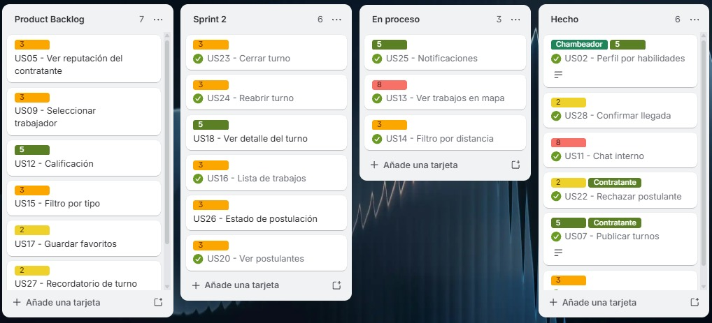


A continuación, se presenta la tabla con las User Stories y tareas del Sprint 1:


| Sprint 1     | Sprint Backlog1 |                  |        |                                                                      |                    |              |        |
|--------------|-----------------|------------------|--------|----------------------------------------------------------------------|--------------------|--------------|--------|
| User Stories |                 | Work-Item / Task | Title  | Description                                                          | Estimation (Hours) | Assigned to  | Status |
| US07   |    | T01  |  | implementar la publicación de turnos del contratante    | 6h  | Jose Diego Bautista  | Done |
| US07   |    | T02  |  | implementar las carpetas data, domain, logica de integracion con el backend para los turnos del trabajador    | 6h  | Jorge Taipe  | Done |
| US011  |    |  T03 |  |  Implementar funcionalidad para la comunicacion mediante el chat interno  |  05   | Jose Diego Bautista  | Done |
| US013  |    |  T04 |  |  Implementar la vista de los trabajos en el mapa   |  05   | Jose Diego Bautista  | Done |
| US016  |    |  T05 |  |  Implementar la lista de trabajos disponibles para el chambeador   |   06  | Jorge Taipe | Done |
| US016  |    |  T06 |  |  Implementar funcionalidad para la lista de trabajos disponibles   |   05 | Moisés Espinoza | Done |
| US018  |    | T07|  |  implementar la vista del detalle del trabajo   |  06   | Sebastián Córdova |Done  |
| US020  |    | T08  |   | implementar la pantalla de lista de postulantes    | 05 | Jhoan Janampa | Done |
| US022  |    |  T09 |  | Implementar funcionalidad para rechazar a un postulante    | 04    | Jhoan Janampa |  Done|
| US023  |    |  T010 |  |  Implementar la funcionalidad de cerrar un turno   |  05   |Jhoan Janampa  | Done |
| US024  |    | T011 |  |   implementar funcionalidad para reabrir un turno cerrado  |  04   | Jose Diego Bautista | Done |
| US026  |    | T012  |  |  implementar la vista del estado de postulaciones como chambeador   |  05   |  Jorge Taipe|  Done|
| US029  |    | T013  |  |  implementar la vista para reportar un problema   |   06  | Sebastián Córdova |  Done|
| AV201  |    | T014     |  | documentacion del reporte de sprint y videos de about the product  | 04    |  Moisés Espinoza |Done  |
| AV202  |    | T015     | |  implementacion y despliegue con firebase  |   03  | Jose Diego Bautista |Done  |


##### 4.2.2.3. Development Evidence for Sprint Review

En esta sección se describen los principales avances de implementación realizados en este segundo sprint. Se destaca la implementacion completa del Backend API con Spring Boot y MongoDB, el desarrollo e implementacion de las pantallas de la aplicación móvil Android nativa con Kotlin y Jetpack Compose, y un avance de la creación del aplicativo movil con flutter.

Cada miembro del equipo avanzó en las diferentes áreas del proyecto: en el Backend se implementaron todos los endpoints principales y necesarios usando Java y Spring Boot; en la aplicación Android se desarrollaron todas pantallas y la navegación usando Kotlin y Jetpack Compose.


| Repository            | Branch          | Commit Id | Commit Message                                                           | Committed On |
|-----------------------|-----------------|-----------|--------------------------------------------------------------------------|--------------|
| ChambaYa-Kotlin   | develop | b8b15d2|  feat(maps): add Google Maps platform dependencies and secrets plugin | 2026/06/10   |
| ChambaYa-Kotlin   | develop | 7726ef6 | ci: deploy automático a Firebase App Distribution en push a develop | 2026/06/18 |
| ChambaYa-Kotlin   | develop | 2156a97 | feat: implement viewmodels for home, profile, shifts, messages, and notifications screens | 2026/06/09 |
| ChambaYa-Kotlin   | develop | 7726ef6 | ci: deploy automático a Firebase App Distribution en push a develop | 2026/06/18 |
| Backend-ChambaYa   |  develop           | 3a79f7e   |  docs: add mobile integration guide  | 2026/06/05   |
| Backend-ChambaYa   |  develop           | e870108 |  fix: apply institutional email verification  | 2026/06/06   |
| Backend-ChambaYa   |  develop           | 82ec302 |  feat(iam): endpoint cambiar contraseña PUT /users/{id}/password  | 2026/06/18   |


##### 4.2.2.4. Testing Suite Evidence for Sprint Review

En esta sección se presenta el conjunto de pruebas implementadas durante el Sprint 1 para los Web Services del backend de ChambaYA. Para este primer sprint, se configuró la estructura base de pruebas utilizando **JUnit 5** (JUnit Jupiter) junto con la anotación `@SpringBootTest`, la cual permite verificar que el contexto de la aplicación Spring Boot se carga correctamente.

El archivo `BackendApplicationTests.java` fue generado como parte de la inicialización del proyecto en Spring Initializr y contiene el test de integración base `contextLoads()`, que verifica que todos los beans y configuraciones del contexto de la aplicación se inicializan sin errores. Este test fue ejecutado exitosamente, confirmando que la configuración del proyecto, la conexión con MongoDB Atlas y las dependencias declaradas en el `pom.xml` son correctas.

Para los siguientes sprints, se tiene planificado ampliar la suite de pruebas con Unit Tests para los servicios de cada Bounded Context (IAM, Jobs, Enrollments, Reviews) y Acceptance Tests bajo el enfoque BDD con archivos `.feature` en lenguaje Gherkin.

Repositorio de Testing: [Backend-ChambaYa](https://github.com/app-movil-3821/Backend-ChambaYa)

| Repository | Branch | Commit Id | Commit Message | Committed On |
|---|---|---|---|---|
| Backend-ChambaYa | develop | 82ec302 | feat(iam): endpoint cambiar contraseña PUT /users/{id}/password | 2026/06/18 |


##### 4.2.2.5. Execution Evidence for Sprint Review

En esta sección se presenta la evidencia de ejecución de los productos implementados en este segundo sprint. Se incluye el desarrollo de las pantallas principales de la aplicación Android, los endpoints completos del backend API desplegado en Railway, y algunas pantalla de flutter.

A continuación, se muestran las capturas de pantalla, que evidencian el progreso realizado en el sprint y sirven como comprobante del trabajo completado.

### Aplicación Android

La aplicación móvil nativa para Android fue desarrollada con Kotlin y Jetpack Compose. A continuación se presentan las pantallas implementadas durante este sprint, organizadas según el flujo de usuario.

**Start (Splash Screen):**

Pantalla inicial de la aplicación que muestra el logo de ChambaYA al abrir la app, antes de redirigir al usuario a la pantalla de login o registro.


 
---

**Login:**

Pantalla de inicio de sesión donde el usuario ingresa su correo y contraseña para acceder a la plataforma. Incluye opción de registro para nuevos usuarios.

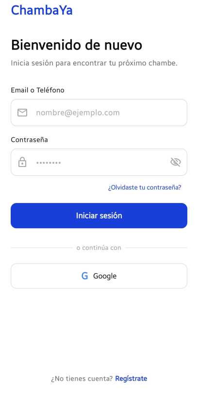
 
---

**Register:**

Pantalla de registro donde el nuevo usuario ingresa sus datos personales para crear una cuenta en ChambaYA, seleccionando si es chambeador o contratante.


 
---

**Skills:**

Pantalla de configuración del perfil basado en habilidades. El chambeador selecciona mediante etiquetas (tags) las habilidades que puede ofrecer, eliminando la necesidad de un CV tradicional.


 
---

**Home Feed:**

Pantalla principal del chambeador que muestra el listado de turnos disponibles cercanos a su ubicación, con información de pago, horario y distancia.


 
---

**Home Feed: (Contratante)**

Pantalla principal del contratante que muestra los turnos que estan creados y disponiblesn, con información de pago, horario y distancia.

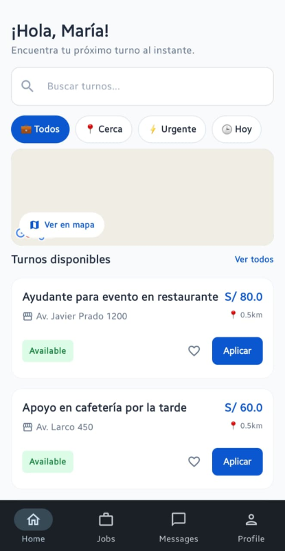
 
---

**Job Details:**

Pantalla de detalle de un turno específico, mostrando la descripción completa del trabajo, ubicación en mapa, pago por hora y botón para aceptar el turno.


 
---


**Active Shift:**

Pantalla que muestra el turno activo en progreso, con el tiempo transcurrido, información del negocio contratante y opciones para confirmar llegada o pedir ayuda.


 
---

**Apply:**

Pantalla de confirmación de postulación a un turno, donde el chambeador revisa los detalles finales antes de confirmar su aplicación al trabajo.


 
---

**Shift Summary:**

Pantalla de resumen al finalizar un turno, mostrando las ganancias del día y el formulario de calificación para el contratante mediante el sistema de reputación bidireccional.


 
---

**My Shifts:**

Pantalla con el historial de turnos del chambeador, mostrando los trabajos completados, pagos recibidos y el estado de cada turno.


 
---


**Jobs: (Contratante)**

Pantalla que detalla los turnos creados, con informacion relevante, y con las opciones de cancelar el turno abierto y aceptar o rechazar a los postulantes.

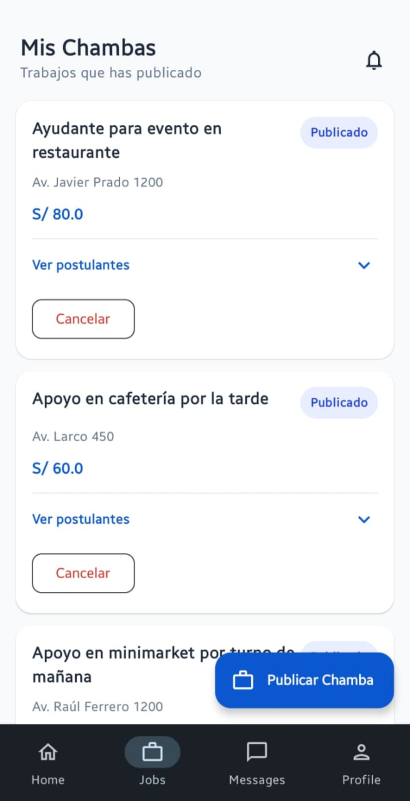
 
---

**Post: (Contratante)**

Pantalla que muestra los campos a rellenar para la creacion de un nuevo turno.

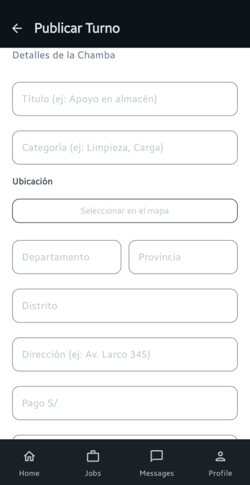
 
---

**Notificaciones: (Contratante)**

Pantalla que detalla las notificaciones acerca las postulaciones de los chambeadores.

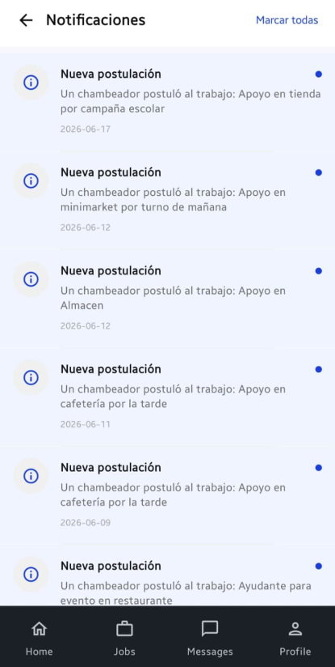
 
---


**Chat:**

Pantalla del chat interno temporal entre el chambeador y el contratante, habilitado únicamente cuando el turno ha sido aceptado para coordinar los detalles del trabajo.

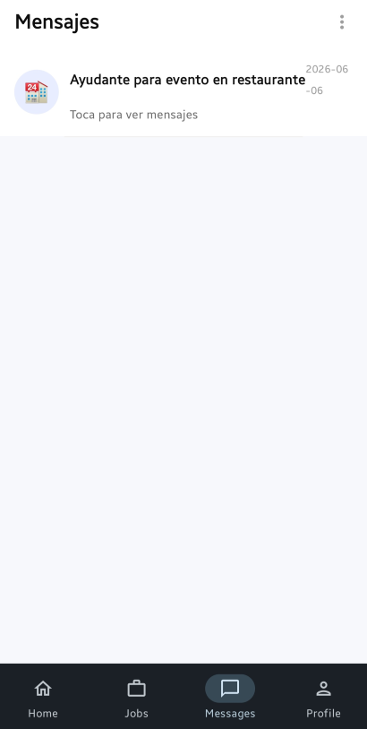

 
---

**Profile View: (Chambeador)**

Pantalla de perfil del chambeador que muestra su reputación, habilidades registradas, historial de turnos completados y opciones de configuración de la cuenta.


 
---

**Profile View: (Contratante)**

Pantalla de perfil del contratante donde se muestra un historial de los turnos creados, y opciones de configuración de la cuenta.

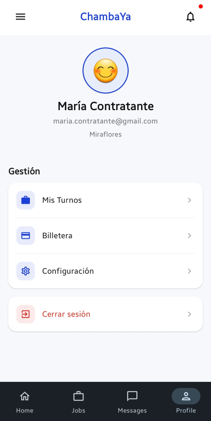
 
---

### Backend API

Aplicación Backend desplegada: https://backend-chambaya-production-a24a.up.railway.app/swagger-ui/index.html
El backend de ChambaYA fue desarrollado con Java y Spring Boot, desplegado en Railway con MongoDB Atlas como base de datos. A continuación se presentan los controllers implementados y documentados mediante Swagger UI.

**User Controller:**

Controller que gestiona el registro, autenticación y consulta de usuarios de la plataforma, tanto chambeadores como contratantes.


 
---

**Job Controller:**

Controller que gestiona la publicación, consulta y búsqueda de turnos disponibles, incluyendo el endpoint de trabajos cercanos por geolocalización.


 
---

**Enrollment Controller:**

Controller que gestiona las postulaciones de los chambeadores a los turnos publicados, incluyendo la aceptación y rechazo de postulantes.


 
---

**Reviews Controller:**

Controller que gestiona el sistema de calificaciones y reseñas mutuas entre chambeadores y contratantes al finalizar cada turno.


##### 4.2.2.6. Services Documentation Evidence for Sprint Review

En esta sección se presenta la documentación de los endpoints implementados en el backend de **ChambaYa** durante el Sprint Review. La evidencia permite identificar los servicios disponibles, el módulo al que pertenecen, el verbo HTTP utilizado, la sintaxis de consumo, los parámetros principales y el enlace de acceso a Swagger para su validación.

A continuación, se muestra la tabla de endpoints desarrollados para los módulos **IAM**, **Jobs**, **Enrollments** y **Reputation**.

| Módulo | Endpoint | Acción | Verbo HTTP | Sintaxis | Parámetros principales | Enlace a Swagger |
|---|---|---|---|---|---|---|
| IAM | `/api/v1/users` | Registrar un nuevo usuario en la plataforma | POST | `/api/v1/users` | Body: `name`, `email`, `password`, `role`, `skills`, `experience`, `district`, `phone` | https://backend-chambaya-production.up.railway.app/swagger-ui.html |
| IAM | `/api/v1/users` | Obtener la lista de usuarios registrados | GET | `/api/v1/users` | - | https://backend-chambaya-production.up.railway.app/swagger-ui.html |
| IAM | `/api/v1/users/{id}` | Obtener un usuario por su identificador | GET | `/api/v1/users/123` | `id` | https://backend-chambaya-production.up.railway.app/swagger-ui.html |
| IAM | `/api/v1/users/by-email` | Obtener un usuario por correo electrónico | GET | `/api/v1/users/by-email?email=user@email.com` | `email` | https://backend-chambaya-production.up.railway.app/swagger-ui.html |
| IAM | `/api/v1/users/{id}/profile` | Actualizar el perfil de un usuario | PUT | `/api/v1/users/123/profile` | `id`, Body: `photoUrl`, `skills`, `experience`, `district`, `phone`, `verified` | https://backend-chambaya-production.up.railway.app/swagger-ui.html |
| Jobs | `/api/v1/jobs` | Crear un nuevo trabajo o turno publicado por un contratante | POST | `/api/v1/jobs` | Body: `contractorId`, `title`, `description`, `category`, `requiredSkills`, `paymentAmount`, `latitude`, `longitude`, `address`, `district`, `scheduledStart`, `scheduledEnd` | https://backend-chambaya-production.up.railway.app/swagger-ui.html |
| Jobs | `/api/v1/jobs` | Obtener todos los trabajos registrados | GET | `/api/v1/jobs` | - | https://backend-chambaya-production.up.railway.app/swagger-ui.html |
| Jobs | `/api/v1/jobs/{id}` | Obtener un trabajo por su identificador | GET | `/api/v1/jobs/123` | `id` | https://backend-chambaya-production.up.railway.app/swagger-ui.html |
| Jobs | `/api/v1/jobs/contractor/{contractorId}` | Obtener los trabajos publicados por un contratante | GET | `/api/v1/jobs/contractor/123` | `contractorId` | https://backend-chambaya-production.up.railway.app/swagger-ui.html |
| Jobs | `/api/v1/jobs/published` | Obtener los trabajos publicados disponibles | GET | `/api/v1/jobs/published` | - | https://backend-chambaya-production.up.railway.app/swagger-ui.html |
| Jobs | `/api/v1/jobs/nearby` | Obtener trabajos cercanos según coordenadas y radio | GET | `/api/v1/jobs/nearby?latitude=-12.1211&longitude=-77.0305&radiusKm=10` | `latitude`, `longitude`, `radiusKm` | https://backend-chambaya-production.up.railway.app/swagger-ui.html |
| Jobs | `/api/v1/jobs/{id}/publish` | Cambiar el estado de un trabajo a publicado | PUT | `/api/v1/jobs/123/publish` | `id` | https://backend-chambaya-production.up.railway.app/swagger-ui.html |
| Jobs | `/api/v1/jobs/{id}/close` | Cerrar un trabajo publicado | PUT | `/api/v1/jobs/123/close` | `id` | https://backend-chambaya-production.up.railway.app/swagger-ui.html |
| Jobs | `/api/v1/jobs/{id}/reopen` | Reabrir un trabajo cerrado o cancelado | PUT | `/api/v1/jobs/123/reopen` | `id` | https://backend-chambaya-production.up.railway.app/swagger-ui.html |
| Enrollments | `/api/v1/enrollments` | Registrar la postulación de un chambeador a un trabajo | POST | `/api/v1/enrollments` | Body: `jobId`, `workerId`, `contractorId` | https://backend-chambaya-production.up.railway.app/swagger-ui.html |
| Enrollments | `/api/v1/enrollments` | Obtener todas las postulaciones registradas | GET | `/api/v1/enrollments` | - | https://backend-chambaya-production.up.railway.app/swagger-ui.html |
| Enrollments | `/api/v1/enrollments/{id}` | Obtener una postulación por su identificador | GET | `/api/v1/enrollments/123` | `id` | https://backend-chambaya-production.up.railway.app/swagger-ui.html |
| Enrollments | `/api/v1/enrollments/job/{jobId}` | Obtener las postulaciones asociadas a un trabajo | GET | `/api/v1/enrollments/job/123` | `jobId` | https://backend-chambaya-production.up.railway.app/swagger-ui.html |
| Enrollments | `/api/v1/enrollments/worker/{workerId}` | Obtener las postulaciones realizadas por un chambeador | GET | `/api/v1/enrollments/worker/123` | `workerId` | https://backend-chambaya-production.up.railway.app/swagger-ui.html |
| Enrollments | `/api/v1/enrollments/contractor/{contractorId}` | Obtener las postulaciones asociadas a los trabajos de un contratante | GET | `/api/v1/enrollments/contractor/123` | `contractorId` | https://backend-chambaya-production.up.railway.app/swagger-ui.html |
| Enrollments | `/api/v1/enrollments/pending` | Obtener las postulaciones pendientes | GET | `/api/v1/enrollments/pending` | - | https://backend-chambaya-production.up.railway.app/swagger-ui.html |
| Enrollments | `/api/v1/enrollments/{id}/accept` | Aceptar una postulación y actualizar el trabajo a estado `MATCHED` | PUT | `/api/v1/enrollments/123/accept` | `id` | https://backend-chambaya-production.up.railway.app/swagger-ui.html |
| Enrollments | `/api/v1/enrollments/{id}/reject` | Rechazar una postulación | PUT | `/api/v1/enrollments/123/reject` | `id` | https://backend-chambaya-production.up.railway.app/swagger-ui.html |
| Enrollments | `/api/v1/enrollments/{id}/cancel` | Cancelar una postulación realizada | PUT | `/api/v1/enrollments/123/cancel` | `id` | https://backend-chambaya-production.up.railway.app/swagger-ui.html |
| Reputation | `/api/v1/reviews` | Registrar una calificación o reseña entre usuarios | POST | `/api/v1/reviews` | Body: `jobId`, `reviewerId`, `reviewedUserId`, `rating`, `comment` | https://backend-chambaya-production.up.railway.app/swagger-ui.html |
| Reputation | `/api/v1/reviews` | Obtener todas las reseñas registradas | GET | `/api/v1/reviews` | - | https://backend-chambaya-production.up.railway.app/swagger-ui.html |
| Reputation | `/api/v1/reviews/{id}` | Obtener una reseña por su identificador | GET | `/api/v1/reviews/123` | `id` | https://backend-chambaya-production.up.railway.app/swagger-ui.html |
| Reputation | `/api/v1/reviews/job/{jobId}` | Obtener las reseñas asociadas a un trabajo | GET | `/api/v1/reviews/job/123` | `jobId` | https://backend-chambaya-production.up.railway.app/swagger-ui.html |
| Reputation | `/api/v1/reviews/reviewer/{reviewerId}` | Obtener las reseñas realizadas por un usuario | GET | `/api/v1/reviews/reviewer/123` | `reviewerId` | https://backend-chambaya-production.up.railway.app/swagger-ui.html |
| Reputation | `/api/v1/reviews/user/{userId}` | Obtener las reseñas recibidas por un usuario | GET | `/api/v1/reviews/user/123` | `userId` | https://backend-chambaya-production.up.railway.app/swagger-ui.html |
| Reputation | `/api/v1/reviews/user/{userId}/summary` | Obtener el promedio y total de reseñas de un usuario | GET | `/api/v1/reviews/user/123/summary` | `userId` | https://backend-chambaya-production.up.railway.app/swagger-ui.html |


## Ejemplos Detallados

### IAM

#### 1. Registrar un nuevo usuario

- **Endpoint:** `POST /api/v1/users`
- **Descripción:** Registra un nuevo usuario en la plataforma ChambaYa. El usuario puede tener el rol de `CHAMBEADOR` o `CONTRATANTE`, según el tipo de cuenta creada.

**Ruta**

```http
POST /api/v1/users
```

**Solicitud**

```json
{
  "name": "Diego Salazar",
  "email": "diego.salazar.worker@gmail.com",
  "password": "123456",
  "role": "CHAMBEADOR",
  "skills": ["atención al cliente", "limpieza", "rapidez"],
  "experience": "Apoyo en cafeterías y restaurantes",
  "district": "Miraflores",
  "phone": "911222333"
}
```

**Respuesta 201 Created**

```json
{
  "id": "69fb...",
  "name": "Diego Salazar",
  "email": "diego.salazar.worker@gmail.com",
  "role": "CHAMBEADOR",
  "profile": {
    "photoUrl": null,
    "skills": ["atención al cliente", "limpieza", "rapidez"],
    "experience": "Apoyo en cafeterías y restaurantes",
    "district": "Miraflores",
    "phone": "911222333",
    "verified": false
  },
  "createdAt": "2026-05-08T16:00:00",
  "updatedAt": "2026-05-08T16:00:00"
}
```

**Errores comunes**

- `400 Bad Request`: El correo ya se encuentra registrado.
- `400 Bad Request`: Faltan campos obligatorios o el formato del correo no es válido.

---

### Jobs

#### 2. Crear un nuevo trabajo o turno

- **Endpoint:** `POST /api/v1/jobs`
- **Descripción:** Permite que un usuario con rol `CONTRATANTE` publique un nuevo trabajo temporal o turno corto. El backend valida que el `contractorId` pertenezca a un usuario existente con rol `CONTRATANTE`.

**Ruta**

```http
POST /api/v1/jobs
```

**Solicitud**

```json
{
  "contractorId": "ID_DEL_CONTRATANTE",
  "title": "Apoyo para atención en cafetería",
  "description": "Se necesita apoyo para atención de clientes y limpieza básica.",
  "category": "Atención al cliente",
  "requiredSkills": ["atención al cliente", "limpieza", "rapidez"],
  "paymentAmount": 60,
  "latitude": -12.1211,
  "longitude": -77.0305,
  "address": "Av. Larco 450",
  "district": "Miraflores",
  "scheduledStart": "2026-05-08T16:00:00",
  "scheduledEnd": "2026-05-08T21:00:00"
}
```

**Respuesta 201 Created**

```json
{
  "id": "69fd...",
  "contractorId": "ID_DEL_CONTRATANTE",
  "title": "Apoyo para atención en cafetería",
  "description": "Se necesita apoyo para atención de clientes y limpieza básica.",
  "category": "Atención al cliente",
  "requiredSkills": ["atención al cliente", "limpieza", "rapidez"],
  "paymentAmount": 60,
  "location": {
    "latitude": -12.1211,
    "longitude": -77.0305,
    "address": "Av. Larco 450",
    "district": "Miraflores"
  },
  "scheduledStart": "2026-05-08T16:00:00",
  "scheduledEnd": "2026-05-08T21:00:00",
  "status": "PUBLISHED",
  "createdAt": "2026-05-08T16:10:00",
  "updatedAt": "2026-05-08T16:10:00"
}
```

**Errores comunes**

- `400 Bad Request`: El usuario indicado no existe.
- `400 Bad Request`: El usuario no tiene rol `CONTRATANTE`.
- `400 Bad Request`: Faltan campos obligatorios del trabajo.

---

#### 3. Consultar trabajos cercanos para el mapa

- **Endpoint:** `GET /api/v1/jobs/nearby`
- **Descripción:** Devuelve los trabajos disponibles cercanos a una ubicación determinada. Este servicio permite que la aplicación móvil muestre trabajos en un mapa usando coordenadas geográficas.

**Ruta**

```http
GET /api/v1/jobs/nearby?latitude=-12.1211&longitude=-77.0305&radiusKm=10
```

**Parámetros**

```txt
latitude: latitud actual del usuario
longitude: longitud actual del usuario
radiusKm: radio de búsqueda en kilómetros
```

**Respuesta 200 OK**

```json
[
  {
    "id": "69fd...",
    "contractorId": "ID_DEL_CONTRATANTE",
    "title": "Apoyo para atención en cafetería",
    "description": "Se necesita apoyo para atención de clientes y limpieza básica.",
    "category": "Atención al cliente",
    "requiredSkills": ["atención al cliente", "limpieza", "rapidez"],
    "paymentAmount": 60,
    "location": {
      "latitude": -12.1211,
      "longitude": -77.0305,
      "address": "Av. Larco 450",
      "district": "Miraflores"
    },
    "scheduledStart": "2026-05-08T16:00:00",
    "scheduledEnd": "2026-05-08T21:00:00",
    "status": "PUBLISHED",
    "createdAt": "2026-05-08T16:10:00",
    "updatedAt": "2026-05-08T16:10:00"
  }
]
```

**Errores comunes**

- `400 Bad Request`: El radio de búsqueda debe ser mayor a cero.
- `200 OK`: Retorna una lista vacía si no existen trabajos cercanos disponibles.

---

### Enrollments

#### 4. Registrar postulación a un trabajo

- **Endpoint:** `POST /api/v1/enrollments`
- **Descripción:** Permite que un chambeador postule a un trabajo publicado. El backend valida que el trabajo exista, que el usuario tenga rol `CHAMBEADOR`, que el contratante tenga rol `CONTRATANTE` y que el contratante sea dueño del trabajo.

**Ruta**

```http
POST /api/v1/enrollments
```

**Solicitud**

```json
{
  "jobId": "ID_DEL_JOB",
  "workerId": "ID_DEL_CHAMBEADOR",
  "contractorId": "ID_DEL_CONTRATANTE"
}
```

**Respuesta 201 Created**

```json
{
  "id": "69fe...",
  "jobId": "ID_DEL_JOB",
  "workerId": "ID_DEL_CHAMBEADOR",
  "contractorId": "ID_DEL_CONTRATANTE",
  "status": "PENDING",
  "appliedAt": "2026-05-08T16:20:00",
  "decidedAt": null,
  "updatedAt": "2026-05-08T16:20:00"
}
```

**Errores comunes**

- `400 Bad Request`: El trabajo no existe.
- `400 Bad Request`: El usuario no tiene rol `CHAMBEADOR`.
- `400 Bad Request`: El contratante no tiene rol `CONTRATANTE`.
- `400 Bad Request`: El contratante no es dueño del trabajo.
- `400 Bad Request`: El chambeador ya postuló a ese trabajo.

---

#### 5. Aceptar una postulación

- **Endpoint:** `PUT /api/v1/enrollments/{id}/accept`
- **Descripción:** Permite que el contratante acepte una postulación. Al aceptar una postulación, esta cambia a estado `ACCEPTED`, el trabajo relacionado cambia a `MATCHED` y las demás postulaciones pendientes del mismo trabajo pasan a `REJECTED`.

**Ruta**

```http
PUT /api/v1/enrollments/ID_DEL_ENROLLMENT/accept
```

**Respuesta 200 OK**

```json
{
  "id": "ID_DEL_ENROLLMENT",
  "jobId": "ID_DEL_JOB",
  "workerId": "ID_DEL_CHAMBEADOR",
  "contractorId": "ID_DEL_CONTRATANTE",
  "status": "ACCEPTED",
  "appliedAt": "2026-05-08T16:20:00",
  "decidedAt": "2026-05-08T16:30:00",
  "updatedAt": "2026-05-08T16:30:00"
}
```

**Errores comunes**

- `400 Bad Request`: La postulación no existe.
- `409 Conflict`: Solo las postulaciones pendientes pueden ser aceptadas.
- `400 Bad Request`: El trabajo relacionado no existe.

---

### Reputation

#### 6. Registrar una reseña

- **Endpoint:** `POST /api/v1/reviews`
- **Descripción:** Registra una calificación entre usuarios relacionada con un trabajo. El sistema valida que el trabajo exista, que los usuarios existan, que el usuario no se califique a sí mismo y que no exista una reseña duplicada para el mismo trabajo y usuarios.

**Ruta**

```http
POST /api/v1/reviews
```

**Solicitud**

```json
{
  "jobId": "ID_DEL_JOB",
  "reviewerId": "ID_DEL_CONTRATANTE",
  "reviewedUserId": "ID_DEL_CHAMBEADOR",
  "rating": 5,
  "comment": "Cumplió correctamente con el turno y tuvo buena actitud."
}
```

**Respuesta 201 Created**

```json
{
  "id": "69ff...",
  "jobId": "ID_DEL_JOB",
  "reviewerId": "ID_DEL_CONTRATANTE",
  "reviewedUserId": "ID_DEL_CHAMBEADOR",
  "rating": 5,
  "comment": "Cumplió correctamente con el turno y tuvo buena actitud.",
  "createdAt": "2026-05-08T16:40:00"
}
```

**Errores comunes**

- `400 Bad Request`: El trabajo no existe.
- `400 Bad Request`: El usuario que califica no existe.
- `400 Bad Request`: El usuario calificado no existe.
- `400 Bad Request`: El usuario no puede calificarse a sí mismo.
- `400 Bad Request`: La reseña ya existe para ese trabajo y usuarios.
- `400 Bad Request`: La calificación debe estar entre 1 y 5.

---

#### 7. Consultar resumen de reputación

- **Endpoint:** `GET /api/v1/reviews/user/{userId}/summary`
- **Descripción:** Devuelve el promedio de calificaciones y la cantidad total de reseñas recibidas por un usuario.

**Ruta**

```http
GET /api/v1/reviews/user/ID_DEL_USUARIO/summary
```

**Respuesta 200 OK**

```json
{
  "userId": "ID_DEL_USUARIO",
  "averageRating": 5.0,
  "totalReviews": 1
}
```

**Errores comunes**

- `200 OK`: Si el usuario no tiene reseñas, retorna promedio `0.0` y total `0`.

---


##### 4.2.2.7. Software Deployment Evidence for Sprint Review

### Despliegue del Backend API (Railway)

- **Paso 1: Creación del proyecto en Spring Initializr**

  Como primer paso, se configuró el proyecto backend usando **Spring Initializr** con las siguientes especificaciones: lenguaje **Java 21**, Spring Boot **4.0.6**, empaquetado **JAR**, y las dependencias Spring Web, Spring Data MongoDB, Validation, Lombok, Spring Boot DevTools y Spring Security.

  

- **Paso 2: Creación del proyecto en Railway**

  Como segundo paso, se accedió a la plataforma **Railway** y se creó un nuevo proyecto donde se desplegará el backend de ChambaYA.

  

- **Paso 3: Instalación y autorización de Railway App en GitHub**

  Como tercer paso, se instaló y autorizó la **Railway App** en la organización de GitHub `app-movil-3821`, seleccionando únicamente el repositorio `Backend-ChambaYa` para el acceso controlado.

  

- **Paso 4: Selección del repositorio**

  Como cuarto paso, se seleccionó el repositorio `app-movil-3821/Backend-ChambaYa` desde Railway para iniciar el proceso de despliegue automático.

  

- **Paso 5: Configuración de variables de entorno**

  Como quinto paso, se configuró la variable de entorno `MONGODB_URI` en Railway con la cadena de conexión proporcionada por MongoDB Atlas, permitiendo que el backend se conecte correctamente a la base de datos en la nube.

  

- **Paso 6: Generación del dominio público**

  Como sexto paso, desde la sección de configuración de Networking en Railway, se generó un dominio público para acceder al backend desplegado externamente.

  

- **Paso 7: Verificación del despliegue**

  Como séptimo paso, se verificó que el backend se encuentra correctamente desplegado y en estado **Online** dentro de Railway, con conexión activa al repositorio en GitHub y despliegue automático configurado desde la rama `main`.

  

- **Paso 8: Verificación de los endpoints con Swagger**

  Como paso final, se verificó el correcto funcionamiento de los endpoints del backend accediendo a la documentación **Swagger UI** generada automáticamente. Se confirmó que el endpoint `GET /api/v1/users` retorna correctamente los datos de los usuarios registrados en la base de datos con código de respuesta **200 OK**.

  


### Despliegue de la Aplicación Android

- **Paso 1: Creación del repositorio para el despliegue de la aplicación**
  
  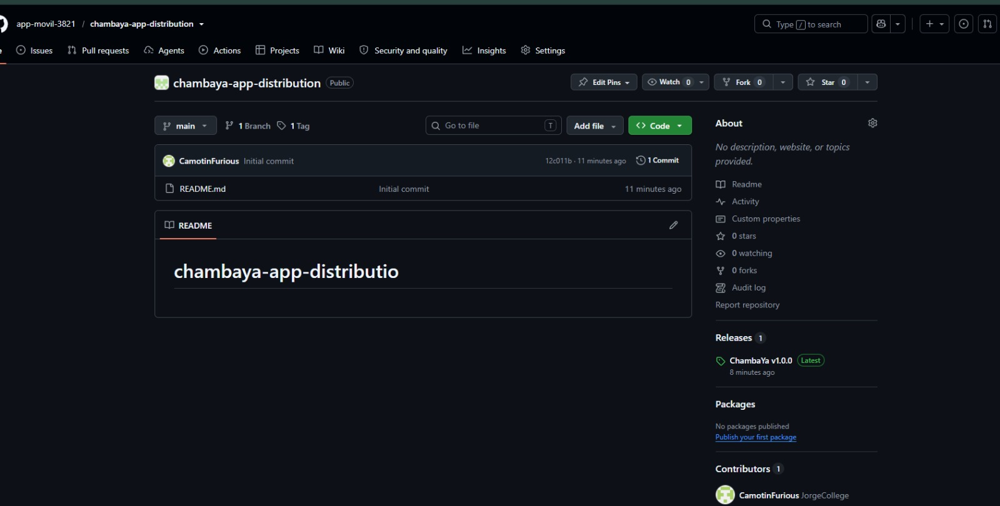

- **Paso 2: Creación del Release**
  
   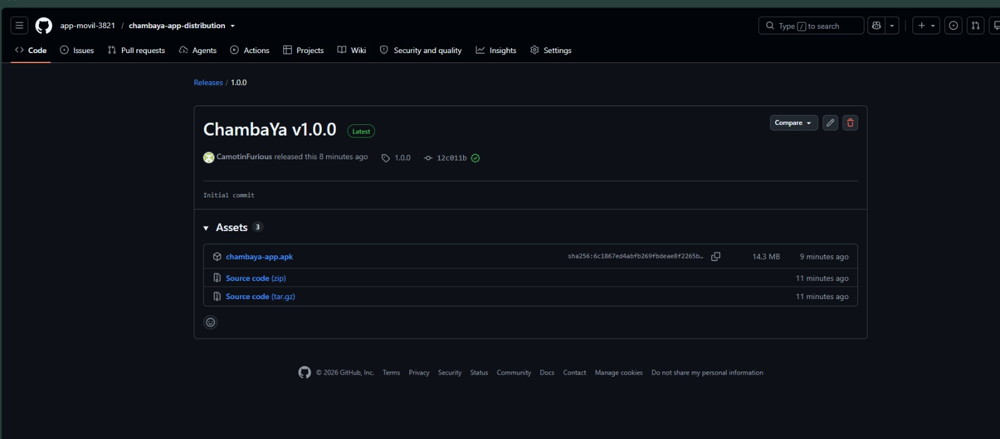


   **Paso 3: Despliegue en proceso**
  
   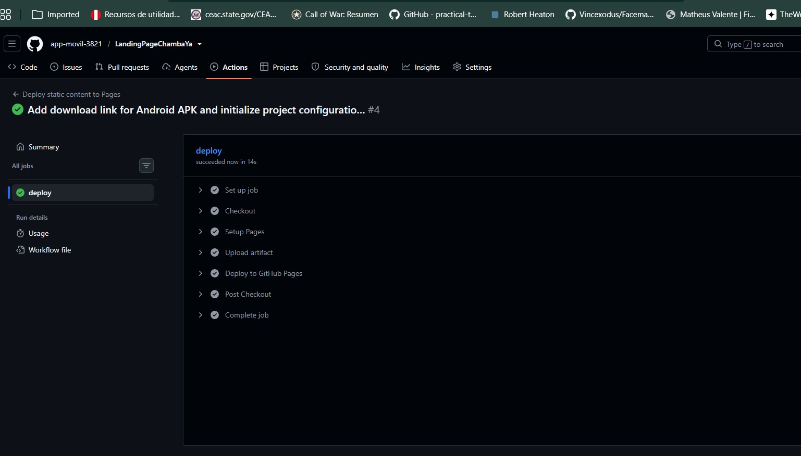


     **Paso 4: Integracion en la landing page para descargar la aplicación**
  
   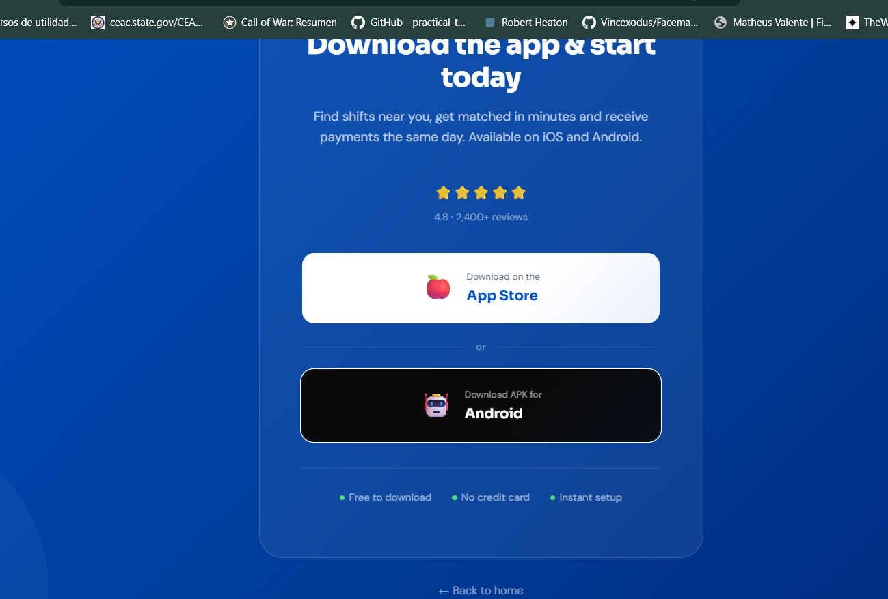


     **Paso 5: Genración del apk de la aplicación**
  
   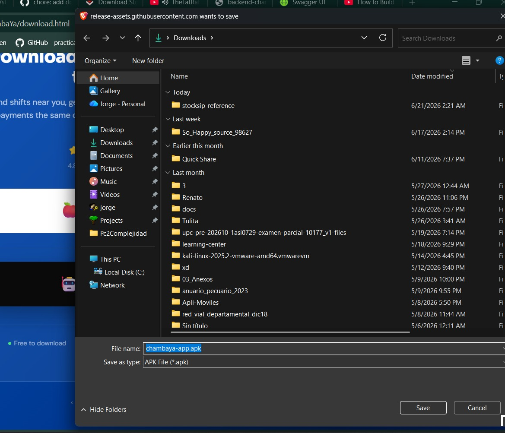
  

  


##### 4.2.2.8. Team Collaboration Insights during Sprint 2

En esta sección se detalla cómo se llevaron a cabo las actividades de implementación durante el segundo sprint, así como la participación de cada miembro del equipo. Para este sprint, el equipo se organizó en torno a los principales productos: Aplicación Móvil Android Nativa y el Backend API. Cada integrante asumió responsabilidades específicas en uno o más de estos componentes, trabajando mediante ramas individuales y siguiendo la estrategia GitFlow para la integración del código.

El proyecto se gestionó utilizando una organización en GitHub llamada **app-movil-3821**, donde se crearon repositorios separados para cada producto. Esto permitió una mejor gestión del código y facilitó la colaboración entre los miembros del equipo.

---


### Backend API

- El integrante **Sebastián Córdova** lideró el desarrollo del backend, implementando los endpoints principales de la aplicación usando Java con Spring Boot y MongoDB. Desarrolló los controllers de usuarios (IAM Context), trabajos (Job Context), postulaciones (Enrollment) y reseñas (Reviews). Además, se encargó del despliegue del backend en **Railway** y la configuración de la base de datos en **MongoDB Atlas**. Juntamente con Jose Diego Bautista implementando también funcionalidades.

A continuación, se muestra el gráfico que detalla la cantidad de commits realizados por cada miembro durante este sprint para el backend. El gráfico refleja el aporte de cada integrante en el avance de la última versión del Backend API. Juntamente con los commits a lo largo del tiempo 


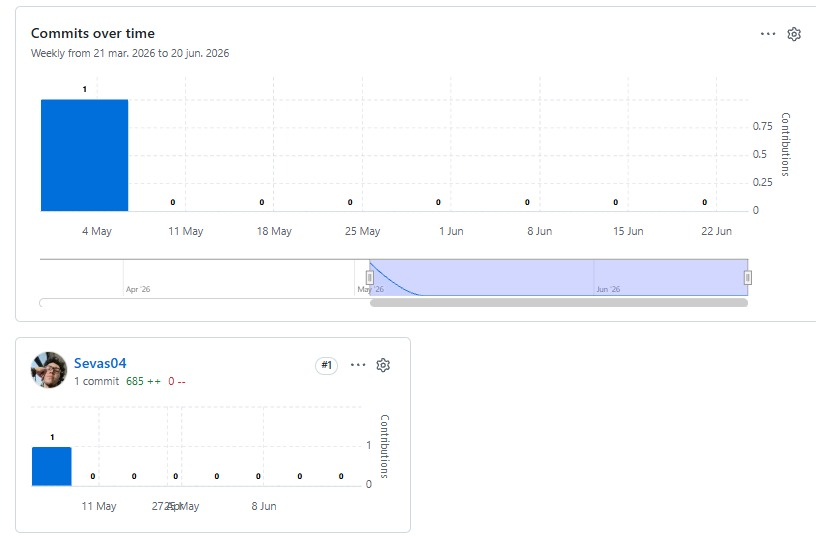


---

### Aplicación Móvil Android

A continuación, se muestra el gráfico que detalla la cantidad de commits realizados por cada miembro durante este sprint para la aplicación móvil Android. El gráfico refleja el aporte de cada integrante en el avance de la última versión de la aplicación.

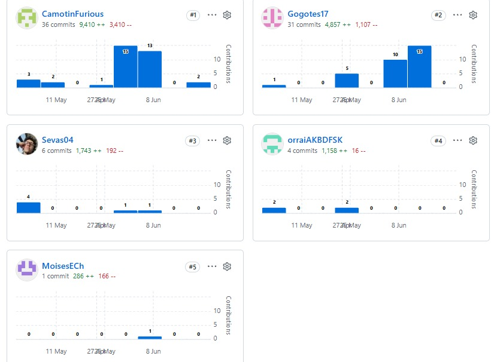

También, se adjunta el gráfico de la vista de commits a lo largo del tiempo de la aplicación Android, donde se puede observar en qué meses hubo mayor cantidad de commits y participación para las funcionalidades implementadas durante el sprint.

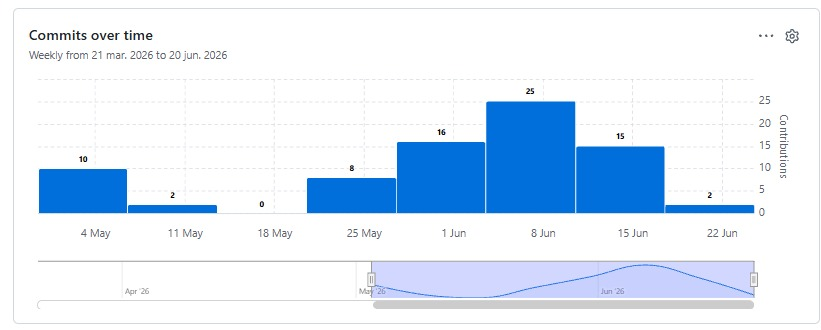

---
#### 4.2.3. Sprint `3`
En esta sección se explican los procesos para el desarrollo de la solución de software en el tercer sprint. Además, se incluyen secciones de planeamiento, desarrollo, prueba y despliegue de la aplicación móvil Android nativa, el backend AP y en Flutter.

##### 4.2.3.1. Sprint Planning `3`


A continuación, se detalla la información sobre el planeamiento del tercer sprint. El objetivo de este sprint se enfoca en el despliegue de la aplicación móvil Android nativa, junto con las pantallas y funcionalidades de la aplicación, los endpoints backend API con un avance al 100%, y las pantallas y funcionalidades de la aplicacion móvil en Flutter.

| Sprint #                   | Sprint 3                                                                                                                                                                                                                                                                                                                                                                                                                                                                                     |
|----------------------------|----------------------------------------------------------------------------------------------------------------------------------------------------------------------------------------------------------------------------------------------------------------------------------------------------------------------------------------------------------------------------------------------------------------------------------------------------------------------------------------------| 
| Sprint planning Background | --                                                                                                                                                                                                                                                                                                                                                                                                                                                                                           | 
| Date                       | 2026/06/22                                                                                                                                                                                                                                                                                                                                                                                                                                                                                   | 
| Time                       | 3:00 pm                                                                                                                                                                                                                                                                                                                                                                                                                                                                                      | 
| Location                   | Reunion en meet                                                                                                                                                                                                                                                                                                                                                                                                                                                                              | 
| Prepared By                | Taipe Sangama Jorge Francisco                                                                                                                                                                                                                                                                                                                                                                                                                                                                | 
| Attendes                   | Taipe Sangama Jorge Francisco / Cordova Valdivia Sebastian / 	Janampa Gutierrez Jhoan D.  / Bautista, Jose Diego /  Espinoza Chavez Moises                                                                                                                                                                                                                                                                                                                                                   | 
| Sprint Goal & User Stories |                                                                                                                                                                                                                                                                                                                                                                                                                                                                                              | 
| Sprint 3 Goal              | Nuestro enfoque está en desarrollar y desplegar la aplicación móvil Android nativa, avanzar en un 100% los endpoints del backend API y desplegar la aplicacion móvil en Flutter. Creemos que esto entrega una base funcional y visible del producto a los stakeholders. Esto se confirmará cuando la aplicación móvil Android nativa esté desplegada, también la aplicaoión móvil en Flutter y el backend responda correctamente a todas las solicitudes HTTP.| 
| Sprint 3 Velocity          | 42                                                                                                                                                                                                                                                                                                                                                                                                                                                                                           | 
| Sums of Story Points       | 42                                                                                                                                                                                                                                                                                                                                                                                                                                                                                         | 


**Aspect Liders and Colaborators**

En esta sección se incluye la matriz de liderazgo y colaboración para este sprint. La letra "L" indica que el miembro es líder del aspecto y se encarga de avanzar y revisar el trabajo de los colaboradores. La letra "C" indica que el miembro es colaborador y se encarga de desarrollar las funcionalidades asignadas.

| Team Member                    | GitHub Usernames  | App Android | Backend API | Reporte | App Flutter |
|--------------------------------|------------------ |-------------|-------------|---------|-------------|
| Cordova Valdivia Sebastian     | Sevas04           | C           | L           | C       | C         | 
| Bautista Rivera Jose Diego     | Gogotes17         | L           |            | C       |             |
| Janampa Gutierrez Jhoan D.     | orraiAKBDFSK      | C           |             | C       | C         |
| Taipe Sangama Jorge Francisco  | CamotinFurious    | L           |             | L       | L           |
| Espinoza Chavez Moises         | MoisesECh         | C           |             | C       |             |


##### 4.2.3.2. Sprint Backlog `3`

El objetivo principal de este sprint es tener la versión final, funcional y desplegada de la aplicación móvil Android con las pantallas implementadas, y también la versión final y desplegada de la aplicación móvil en Flutter.


Proyecto en Enlace al tablero de Trello: [Link de TRELLO](https://trello.com/invite/b/69e581bada404d81ccde530d/ATTI42a1d93366631bcc58f2fbcf4f6b8734D6B33942/product-backlog-chambaya)

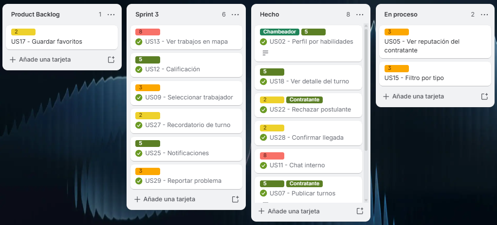


A continuación, se presenta la tabla con las User Stories y tareas del Sprint 3:


| Sprint 3     | Sprint Backlog3 |                  |        |                                                                      |                    |              |        |
|--------------|-----------------|------------------|--------|----------------------------------------------------------------------|--------------------|--------------|--------|
| User Stories |                 | Work-Item / Task | Title  | Description                                                          | Estimation (Hours) | Assigned to  | Status |
| US01   |    | T01  |  |   mejoras en la funcionalidad de la autenticación y restablecimiento de contraseña | 6h  |  Jose Diego Bautista | Done |
| US01   |    | T02  |  |   implementación y mejora de funcionalidad del perfil y sesión activa | 6h  |  Jose Diego Bautista | Done |
| US02   |    | T03  |  |   implementación de funcionalidad en perfil y las validaciones  | 5h  |  Jorge Taipe | Done |
| US03   |    | T04  |  |   implementación de la vista "Home" del chambeador  | 4h  | Sebastián Córdova | Done |
| US09   |    | T05  |  |   implementación de Vistas y funciones como “Shifts” relacionadas a los perfiles de Chambeador y Contratante| 3h  | Jhoan Janampa | Done |
| US11   |    | T06  |  |   implementación de registro y Mensajes y conexión entre segmentos | 5h | Jorge Taipe  | Done |
| US13   |    | T07  |  |   implementación de funcionalidad para los trabajos en el mapa| 4h| Jhoan Janampa  | Done |
| US13   |    | T08  |  |   correcciones en el mapa| 3h| Jose Diego Bautista | Done |
| US13   |    | T09  |  |   mejoras en la funcionalidad de mapa de trabajos disponibles| 3h| Sebastián Córdova | Done |
| US27   |    | T10  |  |   mejoras en la corrección de horarios y datos de trabajos | 3h| Sebastián Córdova  | Done |
| US29   |    | T11  |  |  implementación de funcionalidad en el flujo de turno activo y pantalla de ayuda  |  4h | Sebastián Córdova  | Done |
| TF01  |    | T12   |  |  implementación y documentación del reporte del sprint  | 06    |  Moisés Espinoza |Done  |
| TF02  |    | T13   | |   implementación y despliegue de Flutter  |   03  | Jorge Taipe | Done  |
| TF02  |    | T14    | |  actualización del backend api para flutter |   04  |  Jorge Taipe |Done  |


##### 4.2.3.3. Development Evidence for Sprint Review

En esta sección se describen los principales avances de implementación realizados en este tercer sprint. Se destaca el desarrollo e implementacion de las pantallas y funcionalidades de la aplicación móvil Android nativa con Kotlin y Jetpack Compose, asi como el desarrollo completo de la aplicacion móvil en Flutter.

Cada miembro del equipo avanzó en las diferentes áreas del proyecto: En la aplicación Android se desarrollaron todas pantallas y la navegación usando Kotlin y Jetpack Compose.


| Repository            | Branch          | Commit Id | Commit Message                                                           | Committed On |
|-----------------------|-----------------|-----------|--------------------------------------------------------------------------|--------------|
| ChambaYa-Kotlin   | develop | 9789b27| feat(auth): Google Sign-In en Login y Registro | 2026/06/25   |
| ChambaYa-Kotlin   | develop | e2e18a7| fix(maps): cambio de SHA-1 | 2026/06/25   |
| ChambaYa-Kotlin   | develop | 1d5dab0| fix(ui): mejoras visuales y datos reales en billetera | 2026/06/25   |
| ChambaYa-Mobile-MultiPlatform   | develop | ed3bc66 | feat(profile): connect profile and settings to backend API | 2026/06/21   |
| ChambaYa-Mobile-MultiPlatform  | develop | 5ec461d| fix(api): update backend API URL for Auth, Job, and Profile services | 2026/06/22   |
| ChambaYa-Mobile-MultiPlatform   | develop | c1726df| feat(messages): add message repository and service, integrate with dependency injection| 2026/06/25  |
| ChambaYa-Mobile-MultiPlatform   | develop | f6f6e6e| feat(messages): implement conversation and message DTOs, service, and repository| 2026/06/25  |
| ChambaYa-Mobile-MultiPlatform   | develop | 6202e56| feat(messages): store currentUserId in MessagesViewModel during conversation loading| 2026/06/25  |
| ChambaYa-Mobile-MultiPlatform   | develop | 9c2936e| refactor(messages): improve logging and error handling in getConversations method| 2026/06/25  |
| ChambaYa-Mobile-MultiPlatform   | develop | 8dd2242| feat: shifts module - worker & contractor views with enrollments| 2026/06/26  |
| ChambaYa-Mobile-MultiPlatform   | develop | 6de1969| feat: add buildFinished hook to clean up problem reports and update .gitignore for android/build/| 2026/06/28  |
| ChambaYa-Mobile-MultiPlatform   | develop | 8494101| feat(shifts): add map picker with reverse geocoding for job creation| 2026/07/01  |
| ChambaYa-Mobile-MultiPlatform   | develop | afc70b7| fix: correct string interpolation in MessageService for authorization and URL construction| 2026/07/02 |
| ChambaYa-Mobile-MultiPlatform   | develop | 31ce2bb| feat(auth): add role parameter to registration and update DI for RegisterViewModel| 2026/07/02  |
| ChambaYa-Mobile-MultiPlatform   | develop | 52d9e64| feat(notifications): implement notification model, repository, and view model with state management| 2026/07/03  |
| ChambaYa-Mobile-MultiPlatform   | develop | 1a94fc9| feat(notifications): implement NotificationsPage with notification list and mark all as read functionality| 2026/07/03  |


##### 4.2.3.4. Testing Suite Evidence for Sprint Review

En esta sección se presenta el conjunto de pruebas implementadas durante el Sprint 1 para los Web Services del backend de ChambaYA. Para este primer sprint, se configuró la estructura base de pruebas utilizando **JUnit 5** (JUnit Jupiter) junto con la anotación `@SpringBootTest`, la cual permite verificar que el contexto de la aplicación Spring Boot se carga correctamente.

El archivo `BackendApplicationTests.java` fue generado como parte de la inicialización del proyecto en Spring Initializr y contiene el test de integración base `contextLoads()`, que verifica que todos los beans y configuraciones del contexto de la aplicación se inicializan sin errores. Este test fue ejecutado exitosamente, confirmando que la configuración del proyecto, la conexión con MongoDB Atlas y las dependencias declaradas en el `pom.xml` son correctas.

Para los siguientes sprints, se tiene planificado ampliar la suite de pruebas con Unit Tests para los servicios de cada Bounded Context (IAM, Jobs, Enrollments, Reviews) y Acceptance Tests bajo el enfoque BDD con archivos `.feature` en lenguaje Gherkin.

Repositorio de Testing: [Backend-ChambaYa](https://github.com/app-movil-3821/Backend-ChambaYa)

| Repository | Branch | Commit Id | Commit Message | Committed On |
|---|---|---|---|---|
| Backend-ChambaYa | develop | 82ec302 | feat(iam): endpoint cambiar contraseña PUT /users/{id}/password | 2026/06/18 |


##### 4.2.3.5. Execution Evidence for Sprint Review

En esta sección se presenta la evidencia de ejecución de los productos implementados en este tercer sprint. Se incluye el desarrollo de las pantallas de la aplicación Android, los endpoints completos del backend API desplegado en Railway, y el desarrollo completo de la aplicacion movil en flutter.

A continuación, se muestran las capturas de pantalla, que evidencian el progreso realizado en el sprint y sirven como comprobante del trabajo completado.

### Aplicación Android

La aplicación móvil nativa para Android fue desarrollada con Kotlin y Jetpack Compose. A continuación se presentan las pantallas implementadas durante este sprint, organizadas según el flujo de usuario.

**Start (Splash Screen):**

Pantalla inicial de la aplicación que muestra el logo de ChambaYA al abrir la app, antes de redirigir al usuario a la pantalla de login o registro.


 
---

**Login:**

Pantalla de inicio de sesión donde el usuario ingresa su correo y contraseña para acceder a la plataforma. Incluye opción de registro para nuevos usuarios.


 
---

**Register:**

Pantalla de registro donde el nuevo usuario ingresa sus datos personales para crear una cuenta en ChambaYA, seleccionando si es chambeador o contratante.

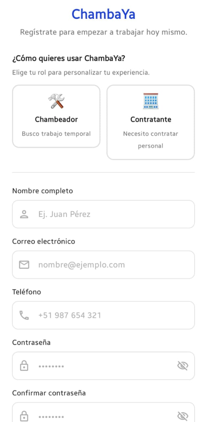
 
---

**Skills:**

Pantalla de configuración del perfil basado en habilidades. El chambeador selecciona mediante etiquetas (tags) las habilidades que puede ofrecer, eliminando la necesidad de un CV tradicional.


 
---

**Home Feed:**

Pantalla principal del chambeador que muestra el listado de turnos disponibles cercanos a su ubicación, con información de pago, horario y distancia.


 
---

**Home Feed: (Contratante)**

Pantalla principal del contratante que muestra los turnos que estan creados y disponiblesn, con información de pago, horario y distancia.


 
---

**Job Details:**

Pantalla de detalle de un turno específico, mostrando la descripción completa del trabajo, ubicación en mapa, pago por hora y botón para aceptar el turno.


 
---


**Active Shift:**

Pantalla que muestra el turno activo en progreso, con el tiempo transcurrido, información del negocio contratante y opciones para confirmar llegada o pedir ayuda.


 
---

**Apply:**

Pantalla de confirmación de postulación a un turno, donde el chambeador revisa los detalles finales antes de confirmar su aplicación al trabajo.


 
---

**Shift Summary:**

Pantalla de resumen al finalizar un turno, mostrando las ganancias del día y el formulario de calificación para el contratante mediante el sistema de reputación bidireccional.


 
---

**My Shifts:**

Pantalla con el historial de turnos del chambeador, mostrando los trabajos completados, pagos recibidos y el estado de cada turno.


 
---


**Jobs: (Contratante)**

Pantalla que detalla los turnos creados, con informacion relevante, y con las opciones de cancelar el turno abierto y aceptar o rechazar a los postulantes.


 
---

**Post: (Contratante)**

Pantalla que muestra los campos a rellenar para la creacion de un nuevo turno.


 
---

**Notificaciones: (Contratante)**

Pantalla que detalla las notificaciones acerca las postulaciones de los chambeadores.


 
---


**Chat:**

Pantalla del chat interno temporal entre el chambeador y el contratante, habilitado únicamente cuando el turno ha sido aceptado para coordinar los detalles del trabajo.


 
---

**Profile View: (Chambeador)**

Pantalla de perfil del chambeador que muestra su reputación, habilidades registradas, historial de turnos completados y opciones de configuración de la cuenta.


 
---

**Profile View: (Contratante)**

Pantalla de perfil del contratante donde se muestra un historial de los turnos creados, y opciones de configuración de la cuenta.


 
---


### Aplicación en Flutter

A continuación se presentan todas las pantallas implementadas, organizadas según el flujo de usuario.

**Login:**

Pantalla de inicio de sesión donde el usuario ingresa su correo y contraseña para acceder a la plataforma.


 
---

**Register:**

Pantalla de registro donde el nuevo usuario ingresa sus datos personales para crear una cuenta en ChambaYA, seleccionando si es chambeador o contratante.

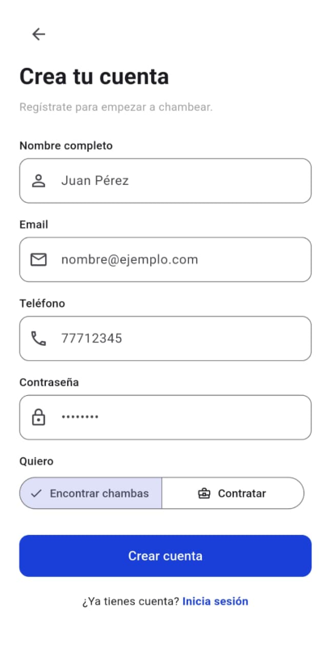
 
---

**Skills:**

Pantalla de configuración del perfil basado en habilidades. El chambeador selecciona mediante etiquetas (tags) las habilidades que puede ofrecer, eliminando la necesidad de un CV tradicional.

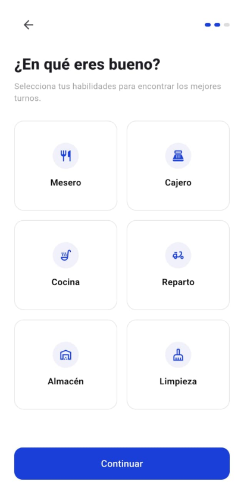
 
---

**Home Feed: (Contratante)**

Pantalla principal del contratante que muestra los turnos que estan creados y disponiblesn, con información de pago, horario y distancia.

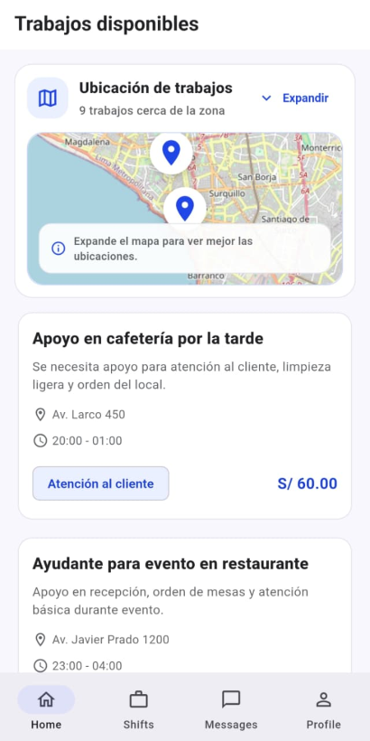
 
---


**Job Details:**

Pantalla de detalle de un turno específico, mostrando la descripción completa del trabajo, ubicación en mapa, pago por hora y botón para aceptar el turno.

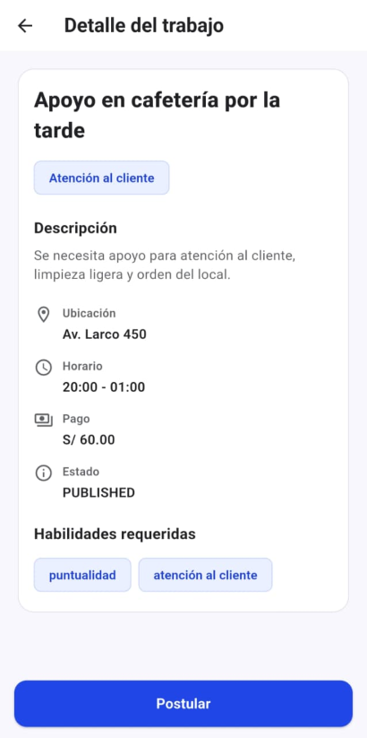
 
---


**Job Application:**

Pantalla que muestra la confirmación de la postulacion y también los detalles del trabajo.

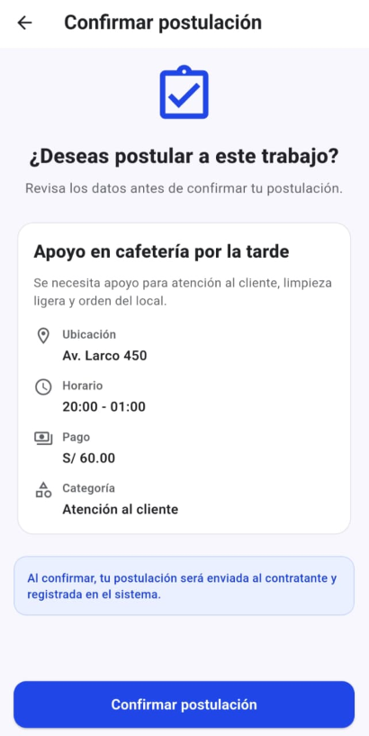
 
---

**My Shifts: (Chambeador)**

Pantalla con el historial de turnos del chambeador, mostrando los trabajos completados, pagos recibidos y el estado de cada turno.

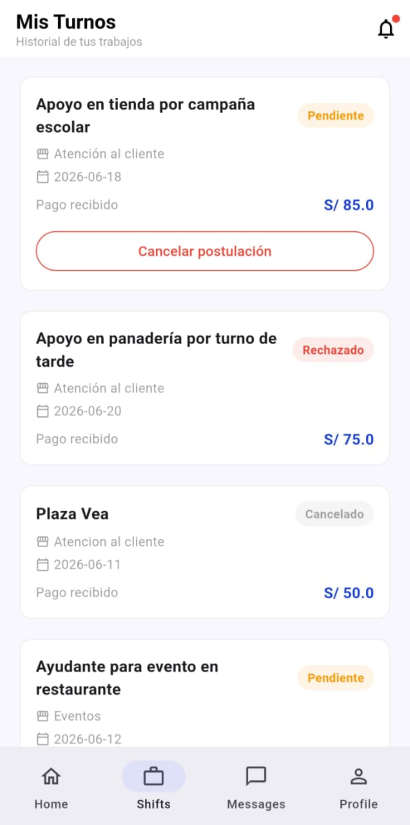
 
---

**My Shifts: (Contratante)**

Pantalla que detalla los turnos creados, con informacion relevante, y con las opciones de cancelar el turno abierto y aceptar o rechazar a los postulantes.

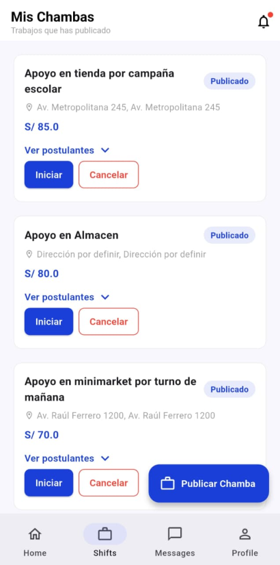


---


**Post: (Contratante)**

Pantalla que muestra los campos a rellenar para la creacion de un nuevo turno.

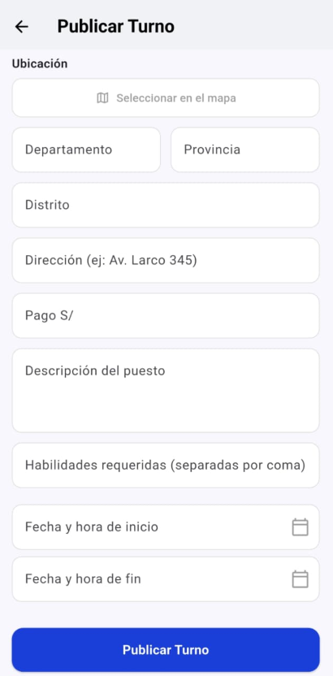
 
---


**Notificaciones: (Contratante)**

Pantalla que detalla las notificaciones acerca las postulaciones de los chambeadores.

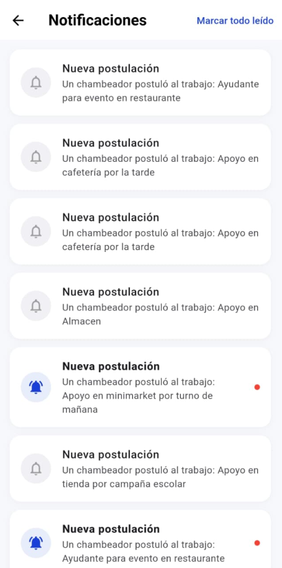
 
---


**Chat:**

Pantalla del chat interno temporal entre el chambeador y el contratante, habilitado únicamente cuando el turno ha sido aceptado para coordinar los detalles del trabajo.

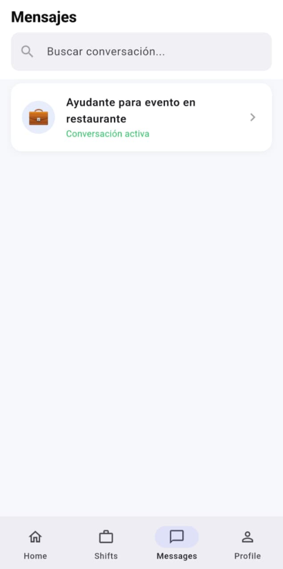
 
---


**Profile View: (Contratante)**

Pantalla de perfil del contratante donde se muestra un historial de los turnos creados, y opciones de configuración de la cuenta.

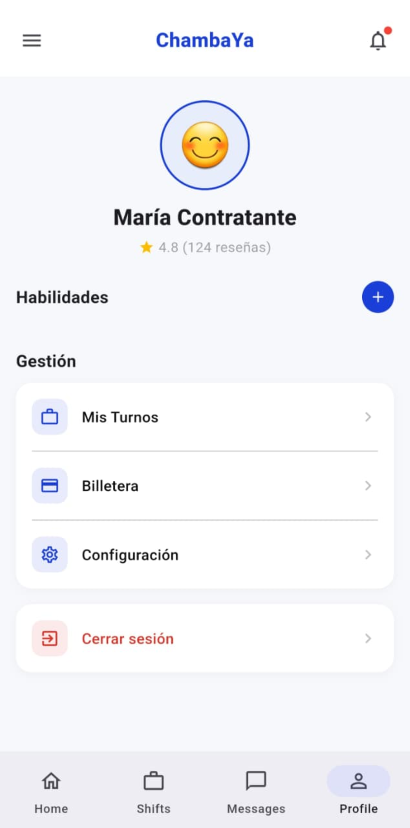
 
---


### Backend API

Aplicación Backend desplegada: https://backend-chambaya-production-a24a.up.railway.app/swagger-ui/index.html
El backend de ChambaYA fue desarrollado con Java y Spring Boot, desplegado en Railway con MongoDB Atlas como base de datos. A continuación se presentan los controllers implementados y documentados mediante Swagger UI.

**User Controller:**

Controller que gestiona el registro, autenticación y consulta de usuarios de la plataforma, tanto chambeadores como contratantes.


 
---

**Job Controller:**

Controller que gestiona la publicación, consulta y búsqueda de turnos disponibles, incluyendo el endpoint de trabajos cercanos por geolocalización.


 
---

**Enrollment Controller:**

Controller que gestiona las postulaciones de los chambeadores a los turnos publicados, incluyendo la aceptación y rechazo de postulantes.


 
---

**Reviews Controller:**

Controller que gestiona el sistema de calificaciones y reseñas mutuas entre chambeadores y contratantes al finalizar cada turno.


##### 4.2.3.6. Services Documentation Evidence for Sprint Review

En esta sección se presenta la documentación de los endpoints implementados en el backend de **ChambaYa** durante el Sprint Review. La evidencia permite identificar los servicios disponibles, el módulo al que pertenecen, el verbo HTTP utilizado, la sintaxis de consumo, los parámetros principales y el enlace de acceso a Swagger para su validación.

A continuación, se muestra la tabla de endpoints desarrollados para los módulos **IAM**, **Jobs**, **Enrollments** y **Reputation**.

| Módulo | Endpoint | Acción | Verbo HTTP | Sintaxis | Parámetros principales | Enlace a Swagger |
|---|---|---|---|---|---|---|
| IAM | `/api/v1/users` | Registrar un nuevo usuario en la plataforma | POST | `/api/v1/users` | Body: `name`, `email`, `password`, `role`, `skills`, `experience`, `district`, `phone` | https://backend-chambaya-production.up.railway.app/swagger-ui.html |
| IAM | `/api/v1/users` | Obtener la lista de usuarios registrados | GET | `/api/v1/users` | - | https://backend-chambaya-production.up.railway.app/swagger-ui.html |
| IAM | `/api/v1/users/{id}` | Obtener un usuario por su identificador | GET | `/api/v1/users/123` | `id` | https://backend-chambaya-production.up.railway.app/swagger-ui.html |
| IAM | `/api/v1/users/by-email` | Obtener un usuario por correo electrónico | GET | `/api/v1/users/by-email?email=user@email.com` | `email` | https://backend-chambaya-production.up.railway.app/swagger-ui.html |
| IAM | `/api/v1/users/{id}/profile` | Actualizar el perfil de un usuario | PUT | `/api/v1/users/123/profile` | `id`, Body: `photoUrl`, `skills`, `experience`, `district`, `phone`, `verified` | https://backend-chambaya-production.up.railway.app/swagger-ui.html |
| Jobs | `/api/v1/jobs` | Crear un nuevo trabajo o turno publicado por un contratante | POST | `/api/v1/jobs` | Body: `contractorId`, `title`, `description`, `category`, `requiredSkills`, `paymentAmount`, `latitude`, `longitude`, `address`, `district`, `scheduledStart`, `scheduledEnd` | https://backend-chambaya-production.up.railway.app/swagger-ui.html |
| Jobs | `/api/v1/jobs` | Obtener todos los trabajos registrados | GET | `/api/v1/jobs` | - | https://backend-chambaya-production.up.railway.app/swagger-ui.html |
| Jobs | `/api/v1/jobs/{id}` | Obtener un trabajo por su identificador | GET | `/api/v1/jobs/123` | `id` | https://backend-chambaya-production.up.railway.app/swagger-ui.html |
| Jobs | `/api/v1/jobs/contractor/{contractorId}` | Obtener los trabajos publicados por un contratante | GET | `/api/v1/jobs/contractor/123` | `contractorId` | https://backend-chambaya-production.up.railway.app/swagger-ui.html |
| Jobs | `/api/v1/jobs/published` | Obtener los trabajos publicados disponibles | GET | `/api/v1/jobs/published` | - | https://backend-chambaya-production.up.railway.app/swagger-ui.html |
| Jobs | `/api/v1/jobs/nearby` | Obtener trabajos cercanos según coordenadas y radio | GET | `/api/v1/jobs/nearby?latitude=-12.1211&longitude=-77.0305&radiusKm=10` | `latitude`, `longitude`, `radiusKm` | https://backend-chambaya-production.up.railway.app/swagger-ui.html |
| Jobs | `/api/v1/jobs/{id}/publish` | Cambiar el estado de un trabajo a publicado | PUT | `/api/v1/jobs/123/publish` | `id` | https://backend-chambaya-production.up.railway.app/swagger-ui.html |
| Jobs | `/api/v1/jobs/{id}/close` | Cerrar un trabajo publicado | PUT | `/api/v1/jobs/123/close` | `id` | https://backend-chambaya-production.up.railway.app/swagger-ui.html |
| Jobs | `/api/v1/jobs/{id}/reopen` | Reabrir un trabajo cerrado o cancelado | PUT | `/api/v1/jobs/123/reopen` | `id` | https://backend-chambaya-production.up.railway.app/swagger-ui.html |
| Enrollments | `/api/v1/enrollments` | Registrar la postulación de un chambeador a un trabajo | POST | `/api/v1/enrollments` | Body: `jobId`, `workerId`, `contractorId` | https://backend-chambaya-production.up.railway.app/swagger-ui.html |
| Enrollments | `/api/v1/enrollments` | Obtener todas las postulaciones registradas | GET | `/api/v1/enrollments` | - | https://backend-chambaya-production.up.railway.app/swagger-ui.html |
| Enrollments | `/api/v1/enrollments/{id}` | Obtener una postulación por su identificador | GET | `/api/v1/enrollments/123` | `id` | https://backend-chambaya-production.up.railway.app/swagger-ui.html |
| Enrollments | `/api/v1/enrollments/job/{jobId}` | Obtener las postulaciones asociadas a un trabajo | GET | `/api/v1/enrollments/job/123` | `jobId` | https://backend-chambaya-production.up.railway.app/swagger-ui.html |
| Enrollments | `/api/v1/enrollments/worker/{workerId}` | Obtener las postulaciones realizadas por un chambeador | GET | `/api/v1/enrollments/worker/123` | `workerId` | https://backend-chambaya-production.up.railway.app/swagger-ui.html |
| Enrollments | `/api/v1/enrollments/contractor/{contractorId}` | Obtener las postulaciones asociadas a los trabajos de un contratante | GET | `/api/v1/enrollments/contractor/123` | `contractorId` | https://backend-chambaya-production.up.railway.app/swagger-ui.html |
| Enrollments | `/api/v1/enrollments/pending` | Obtener las postulaciones pendientes | GET | `/api/v1/enrollments/pending` | - | https://backend-chambaya-production.up.railway.app/swagger-ui.html |
| Enrollments | `/api/v1/enrollments/{id}/accept` | Aceptar una postulación y actualizar el trabajo a estado `MATCHED` | PUT | `/api/v1/enrollments/123/accept` | `id` | https://backend-chambaya-production.up.railway.app/swagger-ui.html |
| Enrollments | `/api/v1/enrollments/{id}/reject` | Rechazar una postulación | PUT | `/api/v1/enrollments/123/reject` | `id` | https://backend-chambaya-production.up.railway.app/swagger-ui.html |
| Enrollments | `/api/v1/enrollments/{id}/cancel` | Cancelar una postulación realizada | PUT | `/api/v1/enrollments/123/cancel` | `id` | https://backend-chambaya-production.up.railway.app/swagger-ui.html |
| Reputation | `/api/v1/reviews` | Registrar una calificación o reseña entre usuarios | POST | `/api/v1/reviews` | Body: `jobId`, `reviewerId`, `reviewedUserId`, `rating`, `comment` | https://backend-chambaya-production.up.railway.app/swagger-ui.html |
| Reputation | `/api/v1/reviews` | Obtener todas las reseñas registradas | GET | `/api/v1/reviews` | - | https://backend-chambaya-production.up.railway.app/swagger-ui.html |
| Reputation | `/api/v1/reviews/{id}` | Obtener una reseña por su identificador | GET | `/api/v1/reviews/123` | `id` | https://backend-chambaya-production.up.railway.app/swagger-ui.html |
| Reputation | `/api/v1/reviews/job/{jobId}` | Obtener las reseñas asociadas a un trabajo | GET | `/api/v1/reviews/job/123` | `jobId` | https://backend-chambaya-production.up.railway.app/swagger-ui.html |
| Reputation | `/api/v1/reviews/reviewer/{reviewerId}` | Obtener las reseñas realizadas por un usuario | GET | `/api/v1/reviews/reviewer/123` | `reviewerId` | https://backend-chambaya-production.up.railway.app/swagger-ui.html |
| Reputation | `/api/v1/reviews/user/{userId}` | Obtener las reseñas recibidas por un usuario | GET | `/api/v1/reviews/user/123` | `userId` | https://backend-chambaya-production.up.railway.app/swagger-ui.html |
| Reputation | `/api/v1/reviews/user/{userId}/summary` | Obtener el promedio y total de reseñas de un usuario | GET | `/api/v1/reviews/user/123/summary` | `userId` | https://backend-chambaya-production.up.railway.app/swagger-ui.html |


## Ejemplos Detallados

### IAM

#### 1. Registrar un nuevo usuario

- **Endpoint:** `POST /api/v1/users`
- **Descripción:** Registra un nuevo usuario en la plataforma ChambaYa. El usuario puede tener el rol de `CHAMBEADOR` o `CONTRATANTE`, según el tipo de cuenta creada.

**Ruta**

```http
POST /api/v1/users
```

**Solicitud**

```json
{
  "name": "Diego Salazar",
  "email": "diego.salazar.worker@gmail.com",
  "password": "123456",
  "role": "CHAMBEADOR",
  "skills": ["atención al cliente", "limpieza", "rapidez"],
  "experience": "Apoyo en cafeterías y restaurantes",
  "district": "Miraflores",
  "phone": "911222333"
}
```

**Respuesta 201 Created**

```json
{
  "id": "69fb...",
  "name": "Diego Salazar",
  "email": "diego.salazar.worker@gmail.com",
  "role": "CHAMBEADOR",
  "profile": {
    "photoUrl": null,
    "skills": ["atención al cliente", "limpieza", "rapidez"],
    "experience": "Apoyo en cafeterías y restaurantes",
    "district": "Miraflores",
    "phone": "911222333",
    "verified": false
  },
  "createdAt": "2026-05-08T16:00:00",
  "updatedAt": "2026-05-08T16:00:00"
}
```

**Errores comunes**

- `400 Bad Request`: El correo ya se encuentra registrado.
- `400 Bad Request`: Faltan campos obligatorios o el formato del correo no es válido.

---

### Jobs

#### 2. Crear un nuevo trabajo o turno

- **Endpoint:** `POST /api/v1/jobs`
- **Descripción:** Permite que un usuario con rol `CONTRATANTE` publique un nuevo trabajo temporal o turno corto. El backend valida que el `contractorId` pertenezca a un usuario existente con rol `CONTRATANTE`.

**Ruta**

```http
POST /api/v1/jobs
```

**Solicitud**

```json
{
  "contractorId": "ID_DEL_CONTRATANTE",
  "title": "Apoyo para atención en cafetería",
  "description": "Se necesita apoyo para atención de clientes y limpieza básica.",
  "category": "Atención al cliente",
  "requiredSkills": ["atención al cliente", "limpieza", "rapidez"],
  "paymentAmount": 60,
  "latitude": -12.1211,
  "longitude": -77.0305,
  "address": "Av. Larco 450",
  "district": "Miraflores",
  "scheduledStart": "2026-05-08T16:00:00",
  "scheduledEnd": "2026-05-08T21:00:00"
}
```

**Respuesta 201 Created**

```json
{
  "id": "69fd...",
  "contractorId": "ID_DEL_CONTRATANTE",
  "title": "Apoyo para atención en cafetería",
  "description": "Se necesita apoyo para atención de clientes y limpieza básica.",
  "category": "Atención al cliente",
  "requiredSkills": ["atención al cliente", "limpieza", "rapidez"],
  "paymentAmount": 60,
  "location": {
    "latitude": -12.1211,
    "longitude": -77.0305,
    "address": "Av. Larco 450",
    "district": "Miraflores"
  },
  "scheduledStart": "2026-05-08T16:00:00",
  "scheduledEnd": "2026-05-08T21:00:00",
  "status": "PUBLISHED",
  "createdAt": "2026-05-08T16:10:00",
  "updatedAt": "2026-05-08T16:10:00"
}
```

**Errores comunes**

- `400 Bad Request`: El usuario indicado no existe.
- `400 Bad Request`: El usuario no tiene rol `CONTRATANTE`.
- `400 Bad Request`: Faltan campos obligatorios del trabajo.

---

#### 3. Consultar trabajos cercanos para el mapa

- **Endpoint:** `GET /api/v1/jobs/nearby`
- **Descripción:** Devuelve los trabajos disponibles cercanos a una ubicación determinada. Este servicio permite que la aplicación móvil muestre trabajos en un mapa usando coordenadas geográficas.

**Ruta**

```http
GET /api/v1/jobs/nearby?latitude=-12.1211&longitude=-77.0305&radiusKm=10
```

**Parámetros**

```txt
latitude: latitud actual del usuario
longitude: longitud actual del usuario
radiusKm: radio de búsqueda en kilómetros
```

**Respuesta 200 OK**

```json
[
  {
    "id": "69fd...",
    "contractorId": "ID_DEL_CONTRATANTE",
    "title": "Apoyo para atención en cafetería",
    "description": "Se necesita apoyo para atención de clientes y limpieza básica.",
    "category": "Atención al cliente",
    "requiredSkills": ["atención al cliente", "limpieza", "rapidez"],
    "paymentAmount": 60,
    "location": {
      "latitude": -12.1211,
      "longitude": -77.0305,
      "address": "Av. Larco 450",
      "district": "Miraflores"
    },
    "scheduledStart": "2026-05-08T16:00:00",
    "scheduledEnd": "2026-05-08T21:00:00",
    "status": "PUBLISHED",
    "createdAt": "2026-05-08T16:10:00",
    "updatedAt": "2026-05-08T16:10:00"
  }
]
```

**Errores comunes**

- `400 Bad Request`: El radio de búsqueda debe ser mayor a cero.
- `200 OK`: Retorna una lista vacía si no existen trabajos cercanos disponibles.

---

### Enrollments

#### 4. Registrar postulación a un trabajo

- **Endpoint:** `POST /api/v1/enrollments`
- **Descripción:** Permite que un chambeador postule a un trabajo publicado. El backend valida que el trabajo exista, que el usuario tenga rol `CHAMBEADOR`, que el contratante tenga rol `CONTRATANTE` y que el contratante sea dueño del trabajo.

**Ruta**

```http
POST /api/v1/enrollments
```

**Solicitud**

```json
{
  "jobId": "ID_DEL_JOB",
  "workerId": "ID_DEL_CHAMBEADOR",
  "contractorId": "ID_DEL_CONTRATANTE"
}
```

**Respuesta 201 Created**

```json
{
  "id": "69fe...",
  "jobId": "ID_DEL_JOB",
  "workerId": "ID_DEL_CHAMBEADOR",
  "contractorId": "ID_DEL_CONTRATANTE",
  "status": "PENDING",
  "appliedAt": "2026-05-08T16:20:00",
  "decidedAt": null,
  "updatedAt": "2026-05-08T16:20:00"
}
```

**Errores comunes**

- `400 Bad Request`: El trabajo no existe.
- `400 Bad Request`: El usuario no tiene rol `CHAMBEADOR`.
- `400 Bad Request`: El contratante no tiene rol `CONTRATANTE`.
- `400 Bad Request`: El contratante no es dueño del trabajo.
- `400 Bad Request`: El chambeador ya postuló a ese trabajo.

---

#### 5. Aceptar una postulación

- **Endpoint:** `PUT /api/v1/enrollments/{id}/accept`
- **Descripción:** Permite que el contratante acepte una postulación. Al aceptar una postulación, esta cambia a estado `ACCEPTED`, el trabajo relacionado cambia a `MATCHED` y las demás postulaciones pendientes del mismo trabajo pasan a `REJECTED`.

**Ruta**

```http
PUT /api/v1/enrollments/ID_DEL_ENROLLMENT/accept
```

**Respuesta 200 OK**

```json
{
  "id": "ID_DEL_ENROLLMENT",
  "jobId": "ID_DEL_JOB",
  "workerId": "ID_DEL_CHAMBEADOR",
  "contractorId": "ID_DEL_CONTRATANTE",
  "status": "ACCEPTED",
  "appliedAt": "2026-05-08T16:20:00",
  "decidedAt": "2026-05-08T16:30:00",
  "updatedAt": "2026-05-08T16:30:00"
}
```

**Errores comunes**

- `400 Bad Request`: La postulación no existe.
- `409 Conflict`: Solo las postulaciones pendientes pueden ser aceptadas.
- `400 Bad Request`: El trabajo relacionado no existe.

---

### Reputation

#### 6. Registrar una reseña

- **Endpoint:** `POST /api/v1/reviews`
- **Descripción:** Registra una calificación entre usuarios relacionada con un trabajo. El sistema valida que el trabajo exista, que los usuarios existan, que el usuario no se califique a sí mismo y que no exista una reseña duplicada para el mismo trabajo y usuarios.

**Ruta**

```http
POST /api/v1/reviews
```

**Solicitud**

```json
{
  "jobId": "ID_DEL_JOB",
  "reviewerId": "ID_DEL_CONTRATANTE",
  "reviewedUserId": "ID_DEL_CHAMBEADOR",
  "rating": 5,
  "comment": "Cumplió correctamente con el turno y tuvo buena actitud."
}
```

**Respuesta 201 Created**

```json
{
  "id": "69ff...",
  "jobId": "ID_DEL_JOB",
  "reviewerId": "ID_DEL_CONTRATANTE",
  "reviewedUserId": "ID_DEL_CHAMBEADOR",
  "rating": 5,
  "comment": "Cumplió correctamente con el turno y tuvo buena actitud.",
  "createdAt": "2026-05-08T16:40:00"
}
```

**Errores comunes**

- `400 Bad Request`: El trabajo no existe.
- `400 Bad Request`: El usuario que califica no existe.
- `400 Bad Request`: El usuario calificado no existe.
- `400 Bad Request`: El usuario no puede calificarse a sí mismo.
- `400 Bad Request`: La reseña ya existe para ese trabajo y usuarios.
- `400 Bad Request`: La calificación debe estar entre 1 y 5.

---

#### 7. Consultar resumen de reputación

- **Endpoint:** `GET /api/v1/reviews/user/{userId}/summary`
- **Descripción:** Devuelve el promedio de calificaciones y la cantidad total de reseñas recibidas por un usuario.

**Ruta**

```http
GET /api/v1/reviews/user/ID_DEL_USUARIO/summary
```

**Respuesta 200 OK**

```json
{
  "userId": "ID_DEL_USUARIO",
  "averageRating": 5.0,
  "totalReviews": 1
}
```

**Errores comunes**

- `200 OK`: Si el usuario no tiene reseñas, retorna promedio `0.0` y total `0`.

---

##### 4.2.3.7. Software Deployment Evidence for Sprint Review

### Despliegue del Backend API (Railway)

- **Paso 1: Creación del proyecto en Spring Initializr**

  Como primer paso, se configuró el proyecto backend usando **Spring Initializr** con las siguientes especificaciones: lenguaje **Java 21**, Spring Boot **4.0.6**, empaquetado **JAR**, y las dependencias Spring Web, Spring Data MongoDB, Validation, Lombok, Spring Boot DevTools y Spring Security.

  

- **Paso 2: Creación del proyecto en Railway**

  Como segundo paso, se accedió a la plataforma **Railway** y se creó un nuevo proyecto donde se desplegará el backend de ChambaYA.

  

- **Paso 3: Instalación y autorización de Railway App en GitHub**

  Como tercer paso, se instaló y autorizó la **Railway App** en la organización de GitHub `app-movil-3821`, seleccionando únicamente el repositorio `Backend-ChambaYa` para el acceso controlado.

  

- **Paso 4: Selección del repositorio**

  Como cuarto paso, se seleccionó el repositorio `app-movil-3821/Backend-ChambaYa` desde Railway para iniciar el proceso de despliegue automático.

  

- **Paso 5: Configuración de variables de entorno**

  Como quinto paso, se configuró la variable de entorno `MONGODB_URI` en Railway con la cadena de conexión proporcionada por MongoDB Atlas, permitiendo que el backend se conecte correctamente a la base de datos en la nube.

  

- **Paso 6: Generación del dominio público**

  Como sexto paso, desde la sección de configuración de Networking en Railway, se generó un dominio público para acceder al backend desplegado externamente.

  

- **Paso 7: Verificación del despliegue**

  Como séptimo paso, se verificó que el backend se encuentra correctamente desplegado y en estado **Online** dentro de Railway, con conexión activa al repositorio en GitHub y despliegue automático configurado desde la rama `main`.

  

- **Paso 8: Verificación de los endpoints con Swagger**

  Como paso final, se verificó el correcto funcionamiento de los endpoints del backend accediendo a la documentación **Swagger UI** generada automáticamente. Se confirmó que el endpoint `GET /api/v1/users` retorna correctamente los datos de los usuarios registrados en la base de datos con código de respuesta **200 OK**.

  


### Despliegue de la Aplicación Android

- **Paso 1: Creación del repositorio para el despliegue de la aplicación**
  
  

- **Paso 2: Creación del Release**
  
   


   **Paso 3: Despliegue en proceso**
  
   


     **Paso 4: Integracion en la landing page para descargar la aplicación**
  
   


     **Paso 5: Genración del apk de la aplicación**
  
   
  


##### 4.2.3.8. Team Collaboration Insights during Sprint 3

En esta sección se detalla cómo se llevaron a cabo las actividades de implementación durante el tercer sprint, así como la participación de cada miembro del equipo. Para este sprint, el equipo se organizó en torno a los principales productos: Aplicación Móvil Android Nativa, el Backend API, y la Aplicacion Móvil en Flutter. Cada integrante asumió responsabilidades específicas en uno o más de estos componentes, trabajando mediante ramas individuales y siguiendo la estrategia GitFlow para la integración del código.

El proyecto se gestionó utilizando una organización en GitHub llamada **app-movil-3821**, donde se crearon repositorios separados para cada producto. Esto permitió una mejor gestión del código y facilitó la colaboración entre los miembros del equipo.

---


### Backend API

- El integrante **Sebastián Córdova** lideró el desarrollo del backend, implementando los endpoints principales de la aplicación usando Java con Spring Boot y MongoDB. Desarrolló los controllers de usuarios (IAM Context), trabajos (Job Context), postulaciones (Enrollment) y reseñas (Reviews). Además, se encargó del despliegue del backend en **Railway** y la configuración de la base de datos en **MongoDB Atlas**. Juntamente con Jose Diego Bautista implementando también funcionalidades.

A continuación, se muestra el gráfico que detalla la cantidad de commits realizados por cada miembro durante este sprint para el backend. El gráfico refleja el aporte de cada integrante en el avance de la última versión del Backend API. Juntamente con los commits a lo largo del tiempo 


---

### Aplicación Móvil Android

A continuación, se muestra el gráfico que detalla la cantidad de commits realizados por cada miembro durante este sprint para la aplicación móvil Android. El gráfico refleja el aporte de cada integrante en el avance de la última versión de la aplicación.

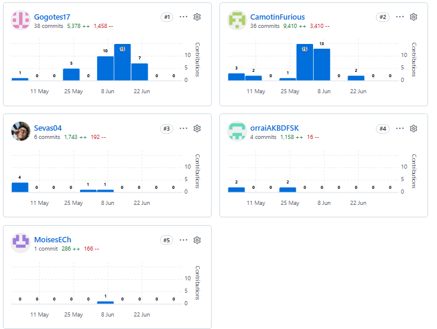


También, se adjunta el gráfico de la vista de commits a lo largo del tiempo de la aplicación Android, donde se puede observar en qué meses hubo mayor cantidad de commits y participación para las funcionalidades implementadas durante el sprint.

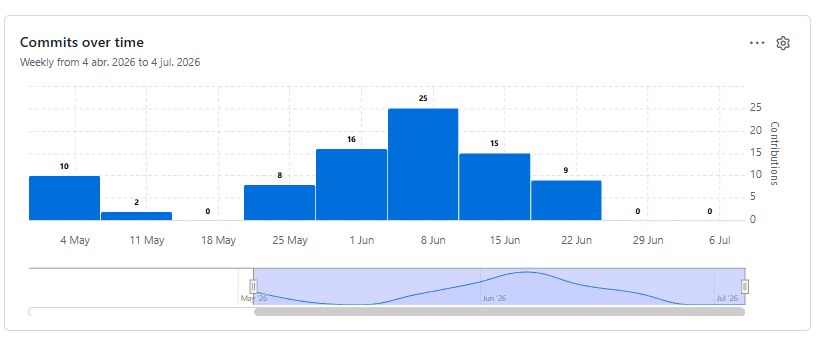

---


### Aplicación Móvil Flutter


A continuación, se muestra el gráfico del historial de commits a lo largo del tiempo de la aplicación en Flutter. Estas métricas reflejan la distribución del esfuerzo del equipo de desarrollo para el despliegue de la última versión de la aplicación. Complementariamente, se presenta el desglose de la cantidad de commits realizados por los miembros del equipo durante este sprint.

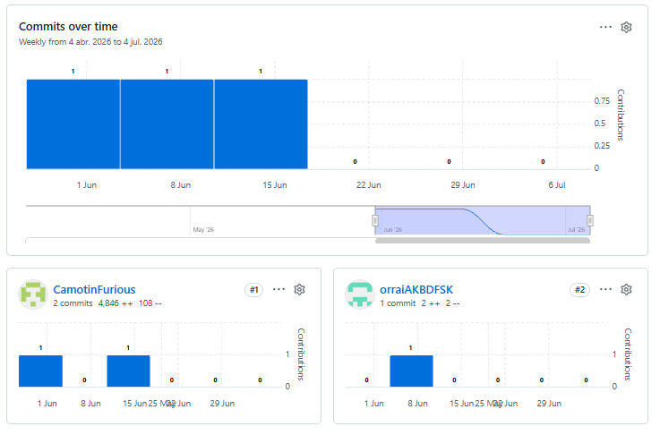


### 4.3. Validation Interviews
#### 4.3.1. Diseño de Entrevistas

En esta sección se definen los elementos y procesos que serán evaluados por los usuarios de ambos segmentos objetivos (Jóvenes y Contratantes) durante las sesiones de validación. El objetivo es medir la claridad de la propuesta de valor y la usabilidad del prototipo.

Elementos a incluir en la validación

- Landing Page: Se presentará para validar si el mensaje de "solución de urgencias laborales" y el modelo "sin CV" se entiende correctamente en los primeros segundos.

- Aplicación Móvil (Prototipo ChambaYA): Se evaluará el prototipo de alta fidelidad, permitiendo al usuario interactuar con las interfaces diseñadas para ambos roles (Trabajador y Contratante).

Flujos a validar:

- User Flow 1: Registro e Inicio de Sesión <br>
Validación de la creación de cuenta, verificación telefónica y, especialmente, la personalización del perfil basada en habilidades (tags) en lugar de carga de archivos.

- User Flow 2: Publicación de Trabajos: <br>
Uso del mapa con geolocalización, búsqueda de vacantes y proceso de postulación rápida.

- User Flow 3: Comunicación (chat) <br>
Interacción en tiempo real entre ambos segmentos para coordinar detalles del turno una vez aceptada la aplicación.

- User Flow 4: Gestión de Perfil <br>
Visualización y edición de información personal, habilidades y experiencia acumulada dentro de la app.

- User Flow 5: Gestión de Turnos <br>
Control de turnos activos, historial de trabajos pasados y visualización de compromisos futuros.

- User Flow 6: Notificaciones y Soporte <br>
Recepción de alertas críticas (nuevas vacantes o aplicaciones) y acceso al centro de ayuda para resolución de problemas o contacto con soporte.


#### 4.3.2. Registro de Entrevistas

En esta sección se muestran los registros de las entrevistas de validación. Cada una de ellas contiene informacion correspondiente a los elementos incluidos, como información acerca del entrevistador, entrevistado, duración y resumen.

<table>
<colgroup>
</colgroup>
<thead>
  <tr>
    <th colspan="2">Entrevista #1<br></th>
  </tr>
</thead>
<tbody>
  <tr>
    <td>Nombre</td>
    <td>Jeremy</td>
  </tr>
  <tr>
    <td>Apellidos</td>
    <td>Parra </td>
  </tr>
  <tr>
    <td>Edad</td>
    <td>23</td>
  </tr>
 
  <tr>
    <td>Evidencia</td>
    <td><div align="center"></td>
  </tr>
  <tr>
    <td>Link</td>
    <td>
      <a href="https://upcedupe-my.sharepoint.com/:v:/g/personal/u202221383_upc_edu_pe/IQDPU7cZ_kcfSZ4cIvH0LPlfAYKnvJRUfUfIfkdLbLjTaKM?e=2xxAAI&nav=eyJyZWZlcnJhbEluZm8iOnsicmVmZXJyYWxBcHAiOiJTdHJlYW1XZWJBcHAiLCJyZWZlcnJhbFZpZXciOiJTaGFyZURpYWxvZy1MaW5rIiwicmVmZXJyYWxBcHBQbGF0Zm9ybSI6IldlYiIsInJlZmVycmFsTW9kZSI6InZpZXcifSwicGxheWJhY2tPcHRpb25zIjp7fX0%3D" target="_blank">
    Videos entrevistas
  </a>
</td>
  </tr>
    <td>Timing donde inicia la entrevista<br></td>
    <td>00:00 min</td>
  </tr>
  <tr>
    <td>Duración de la entrevista<br></td>
    <td>11:11 min</td>
  <tr>
    <td>Resumen</td>
    <td> La entrevista se realizó a Jeremy Parra (23 años), para validar y dar a conocer los flujos de nuestra propuesta, flujos como el registro, el de la aplicacion al trabajo, chat, gestión de turnos y notificaciones. El entrevistado mencionó que la información mostrada en el flujo de la aplicación a un trabajo es suficiente para elegir postular, destacó la funcionalidad de la ubicación, que era útil para dirigirnos al lugar y ubcarnos de manera rápida. También destacó el apartado de chat, ya que la comunicación era directa con el empleador. También mencionó, que es muy necesario que la aplicación te notifique acerca de turnos nuevos cercanos a tu ubicación. Asimismo, destacó el apartado de turnos, que era información importante que se debería mostrar para que se lleve un registro o control de los trabajos completados.
</td>
  </tr>
</tbody>
</table>


<table>
<colgroup>
</colgroup>
<thead>
  <tr>
    <th colspan="2">Entrevista #2<br></th>
  </tr>
</thead>
<tbody>
  <tr>
    <td>Nombre</td>
    <td>Eirthon</td>
  </tr>
  <tr>
    <td>Apellidos</td>
    <td>Reyes</td>
  </tr>
  <tr>
    <td>Edad</td>
    <td>25</td>
  </tr>
  <tr>
    <td>Evidencia</td>
    <td><div align="center"></td>
  </tr>
  <tr>
    <td>Link</td>
    <td>
      <a href="https://upcedupe-my.sharepoint.com/:v:/g/personal/u202221383_upc_edu_pe/IQDPU7cZ_kcfSZ4cIvH0LPlfAYKnvJRUfUfIfkdLbLjTaKM?e=VAqTcm&nav=eyJyZWZlcnJhbEluZm8iOnsicmVmZXJyYWxBcHAiOiJTdHJlYW1XZWJBcHAiLCJyZWZlcnJhbFZpZXciOiJTaGFyZURpYWxvZy1MaW5rIiwicmVmZXJyYWxBcHBQbGF0Zm9ybSI6IldlYiIsInJlZmVycmFsTW9kZSI6InZpZXcifSwicGxheWJhY2tPcHRpb25zIjp7InN0YXJ0VGltZUluU2Vjb25kcyI6NjcyLjUxfX0%3D" target="_blank">
    Videos entrevistas
     </a>
    </td>
  </tr>
    <td>Timing donde inicia la entrevista<br></td>
    <td>11:12 min</td>
  </tr>
  <tr>
    <td>Duración de la entrevista<br></td>
    <td>08:26 min</td>
  <tr>
    <td>Resumen</td>
    <td> Se realizó la entrevista de validacion a Eirthon Reyes (25 años), con el objetivo de presentar y validar los flujos de gestión de turnos, perfil de trabajador, chat y notificaciones. Mencionó que al ingresar al apartado de gestión de turnos se sintió un poco abrumado por la cantidad de elementos que aparecen. lo que le dificultaba una lectura rápida, por lo que sería útil ajustar el contenido para mejorar la visualización. Destacó que le generaba confianza el perfil del trabajador sin necesidad de cv, ya que ha tenido que estar registrado para poder postular y trabajar en la app, además de la visualización de sus habilidades.También notó que no existe una flecha de retroceso ni una opción clara para "ir hacia atrás" en el apartado de mis turnos, por lo que sería recomendable una flecha de retorno visible en la esquina, que permita regresar a la pantalla anterior de forma intuitiva. Asimismo, identificó que los íconos de Home, Chat y Perfil eran intuitivos, pero que el ícono de "Shifts" (Turnos) en la barra inferior no se entendía tan bien por sí solo, ya que intentaba abarcar demasiadas funciones, lo que genera incertidumbre sobre qué se encontrará al hacer clic, a lo que recomendó separar las funciones en iconos más específicos para evitar la ambigüedad.
</td>
  </tr>
</tbody>
</table>


<table>
<colgroup>
</colgroup>
<thead>
  <tr>
    <th colspan="2">Entrevista #3<br></th>
  </tr>
</thead>
<tbody>
  <tr>
    <td>Nombre</td>
    <td>Italo</td>
  </tr>
  <tr>
    <td>Apellidos</td>
    <td>Sobrado</td>
  </tr>
  <tr>
    <td>Edad</td>
    <td>21</td>
  </tr>
  <tr>
    <td>Evidencia</td>
    <td><div align="center"></td>
  </tr>
  <tr>
    <td>Link</td>
   <td>
      <a href="https://upcedupe-my.sharepoint.com/:v:/g/personal/u202221383_upc_edu_pe/IQDPU7cZ_kcfSZ4cIvH0LPlfAYKnvJRUfUfIfkdLbLjTaKM?e=7PJMnC&nav=eyJyZWZlcnJhbEluZm8iOnsicmVmZXJyYWxBcHAiOiJTdHJlYW1XZWJBcHAiLCJyZWZlcnJhbFZpZXciOiJTaGFyZURpYWxvZy1MaW5rIiwicmVmZXJyYWxBcHBQbGF0Zm9ybSI6IldlYiIsInJlZmVycmFsTW9kZSI6InZpZXcifSwicGxheWJhY2tPcHRpb25zIjp7InN0YXJ0VGltZUluU2Vjb25kcyI6MTE3OC43M319" target="_blank">
    Videos entrevistas
     </a>
    </td>
  </tr>
    <td>Timing donde inicia la entrevista<br></td>
    <td> 19:38 min</td>
  </tr>
  <tr>
    <td>Duración de la entrevista<br></td>
    <td> 9:02 min</td>
  <tr>
    <td>Resumen</td>
    <td> El entrevistado Italo Sobrado (21 años) destacó el registro rapido y accesible para los jóvenes que quieran encontrar trabajos disponibles que no requieran cv ni tanta experiencia. Mencionó además que la información mostrada en el apartado de aplicación de trabajo resulta suficiente y necesaria, pero que para que esté mas completa necesitaría de reseñas por parte de los trabajadores para conocer mejor el trabajo y conocer al empleador desde el punto de vista de ellos. Por último mencionó que una opción de filtrar los lugares para  los trabajos disponibles o implementar inteligencia artifical en la parte de la búsqueda por mapa le ayudaria a elegir mucho más rápido un trabajo, filtrando los trabajos disponibles cercanos.
</td>
  </tr>
</tbody>
</table>

#### 4.3.3. Evaluaciones según Heurísticas


**SITE o APP A EVALUAR:**
ChambaYa

El alcance de esta evaluación incluye la revisión de la usabilidad de las siguientes tareas:
Registro de usuario nuevo basado en etiquetas de habilidades.

Personalización del perfil (descripción y experiencia).

1. Búsqueda de ofertas de trabajo mediante mapa con geolocalización.
2. Postulación a un turno laboral de emergencia.
3. Publicación de una vacante urgente (flujo del contratante).
4. Uso del chat interno para coordinación.
5. Visualización y gestión de turnos activos/pasados.
6. Envío de reporte de problemas en la sección de ayuda.

No están incluidas en esta versión de la evaluación las siguientes tareas:
1. Pasarela de pagos y facturación electrónica.
2. Sistema de referidos o bonos por cumplimiento.
3. Configuración avanzada de privacidad y datos.


**ESCALA DE SEVERIDAD:**
Los errores serán puntuados tomando en cuenta la siguiente escala de severidad
| Nivel | Descripción |
|-----|-----------|
| 1 | Problema superficial: puede ser fácilmente superador por el usuario ó ocurre con muy poco frecuencia. No necesita ser arreglado a no ser que exista disponibilidad de tiempo. |
| 2 | Problema menor: puede ocurrir un poco más frecuentemente o es un poco más difícil de superar para el usuario. Se le debería asignar una prioridad baja resolverlo de cara al siguiente release |
| 3 | Problema mayor: ocurre frecuentemente o los usuarios no son capaces de resolverlos. Es importante que sean corregidos y se les debe asignar una prioridad alta. |
| 4 | Problema muy grave: un error de gran impacto que impide al usuario continuar con el uso de la herramienta. Es imperativo que sea corregido antes del lanzamiento. |


**TABLA RESUMEN:**
| # | Problema | Escala de severidad | Heurística/Principio violado(a) |
|--|-------|-------------------|-------------------------------|
| 1 | Sobrecarga de información y falta de jerarquía visual  | 2 | Usabilidad - Diseño estético y minimalista. |
| 2 | Ausencia de controles de navegación de retorno (Back button) | 3 | Usabilidad - Libertad y control del usuario |
| 3 | Iconografía ambigua y falta de estándares en la barra de navegación  | 2 | Usabilidad - Consistencia y estándares. |


**DESCRIPCIÓN DE PROBLEMAS:**

PROBLEMA 1: Sobrecarga de información y falta de jerarquía visual

Severidad: 2

Heurística violada: Usabilidad - Diseño estético y minimalista.

Problema: Al interactuar con la pantalla, el usuario manifestó sentirse abrumado por la cantidad de elementos que aparecen de golpe al entrar al apartado. Indicó que la información no está categorizada, lo que dificulta una lectura rápida y genera confusión visual.

Recomendación: Aplicar una mejor arquitectura de información separando el contenido en áreas o secciones claramente diferenciadas. Utilizar el principio de "progresividad" para no mostrar todo el contenido en una sola vista.

---


PROBLEMA 2: Ausencia de controles de navegación de retorno (Back button)

Severidad: 3

Heurística violada: Usabilidad - Libertad y control del usuario.

Problema: En el flujo evaluado, el usuario notó que no existe una flecha de retroceso ni una opción clara para "ir hacia atrás". Esto genera una sensación de encierro en la pantalla actual, obligando al usuario a reiniciar la app o usar botones externos del sistema que podrían romper el flujo.

Recomendación: Incluir una flecha de retorno visible en la esquina superior izquierda (TopAppBar) que permita al usuario regresar a la pantalla anterior de forma intuitiva.

---

PROBLEMA 3: Iconografía ambigua y falta de estándares en la barra de navegación

Severidad: 2

Heurística violada: Usabilidad - Consistencia y estándares.

Problema: El usuario identificó correctamente los iconos de Home, Chat y Perfil, pero reportó que el icono de "Shifts" (Turnos) en la barra inferior es demasiado complejo y no se entiende por sí solo. Mencionó que el icono intenta abarcar demasiadas funciones, lo que genera incertidumbre sobre qué se encontrará al hacer clic.

Recomendación: Rediseñar el icono de "Shifts" utilizando una metáfora visual más simple y estándar (como un calendario o reloj de turno). Alternativamente, separar las funciones en iconos más específicos para evitar la ambigüedad.


---

<div style="page-break-before: always;"></div>

# Conclusiones

## Conclusiones y recomendaciones

### 1. Validación de Problem Statements y Supuestos

El Problem Statement inicial identificó una desconexión estructural entre las MYPEs que necesitan personal temporal y los jóvenes que buscan ingresos flexibles. A lo largo del desarrollo de ChambaYa, esta problemática se confirmó como real y relevante. El supuesto de que las MYPEs estarían dispuestas a contratar jóvenes sin CV formal, siempre que existiera un filtro de confianza, fue validado mediante la implementación de la Insignia de Confianza universitaria basada en correo institucional (.edu.pe). Asimismo, el supuesto de que eliminar la fricción del CV aumentaría el registro de jóvenes se validó con el sistema de etiquetas de habilidades Tag-Based, que redujo significativamente la barrera de entrada al mercado laboral.

### 2. Contrastación de Hipótesis

- **Hipótesis 1 (Geolocalización):** El motor de geolocalización implementado en la app permite visualizar turnos cercanos en tiempo real. La funcionalidad fue desarrollada tanto en la versión Kotlin como Flutter, mostrando disponibilidad inmediata de turnos por zona. Su efectividad real dependerá de alcanzar masa crítica de usuarios en producción.

- **Hipótesis 2 (Registro sin CV):** El perfil Tag-Based se implementó exitosamente, permitiendo a los jóvenes registrar habilidades de forma rápida sin necesidad de documentación formal. El onboarding simplificado reduce la fricción y el abandono durante el registro.

- **Hipótesis 3 (Insignia de Confianza):** La verificación mediante correo institucional fue integrada en el backend y se muestra visualmente en el perfil del chambeador. Esta funcionalidad responde directamente a la desconfianza de las MYPEs hacia candidatos sin historial laboral formal.

- **Hipótesis 4 (Sistema de Calificaciones):** Se diseñó la arquitectura del sistema de reputación bidireccional. Su validación real requiere usuarios activos completando turnos, por lo que constituye una métrica pendiente de medición en producción.

### 3. Cumplimiento de Criterios de Éxito

Se logró desplegar una solución multiplataforma funcional (Kotlin para Android y Flutter multiplataforma) conectada a un backend en producción desplegado en Railway. Las funcionalidades core fueron implementadas: publicación de turnos, postulación, aceptación/rechazo de chambeadores, geolocalización y gestión de perfil. Sin embargo, métricas como la tasa de aceptación en menos de 2 horas o la recurrencia del 30% de MYPEs requieren validación en un entorno real con usuarios activos, lo cual constituye el siguiente paso natural del proyecto.

---

## Recomendaciones

- **Sistema de Notificaciones Push en Tiempo Real:** Durante el desarrollo se identificó que la inmediatez es el valor central de ChambaYa. Se recomienda implementar notificaciones push (Firebase Cloud Messaging) para alertar a los chambeadores cercanos en el momento exacto en que se publica un turno, reduciendo el tiempo de respuesta y acercándose a la meta del 60% de aceptaciones en menos de 2 horas.

- **Implementación del Sistema de Calificaciones:** El módulo de reseñas bidireccionales es una funcionalidad crítica pendiente. Se recomienda priorizarlo en el siguiente sprint, ya que es el pilar que sostiene la confianza del ecosistema y la recurrencia de las MYPEs, ambas métricas de éxito definidas en los Business Outcomes.

- **Chat Interno Temporal:** Se recomienda desarrollar el módulo de mensajería interna que se active únicamente cuando un turno es aceptado. Esto elimina la necesidad de compartir datos personales y profesionaliza la comunicación dentro de la plataforma, validando el supuesto de preferencia por coordinación interna sobre WhatsApp.

- **Onboarding Mejorado con Tutorial Interactivo:** Las pruebas de desarrollo mostraron que ciertas funcionalidades como la selección de ubicación en mapa o la gestión de postulantes pueden resultar poco intuitivas para usuarios nuevos. Se recomienda agregar un flujo de onboarding guiado con tooltips y pantallas de bienvenida diferenciadas por rol (Chambeador vs Contratante).

- **Módulo de Pagos y Billetera Digital:** La funcionalidad de Billetera está presente en la navegación pero pendiente de implementación. Se recomienda integrar una pasarela de pagos (como Culqi o Niubiz, orientadas al mercado peruano) para cerrar el ciclo económico dentro de la app, permitiendo que el chambeador reciba su pago el mismo día, que es uno de los User Outcomes principales definidos en el Lean UX.

## Video App Validation

Video de validacion de producto: https://shorturl.at/Xhf2v

## Video Team   

Video Exposicion: https://short-url.cc/1tgKH


## Video About the Product

El video "About the Product" presenta de manera clara y atractiva la propuesta de valor de ChambaYa, los problemas que resuelve y cómo funciona la solución para ambos segmentos objetivo.


| Titulo del Video        | Foundly Product               |
|-------------------------|-------------------------------|
| Duracion                | 1 minuto                      |
| Fecha de Grabacion      | 21/06/2026                    |
| URL de Youtube          | https://youtu.be/WrObe5WUI10  |
| URL de Microsoft Stream | https://shorturl.at/NwXQ7    |

Screenshot del video "About the Product" :

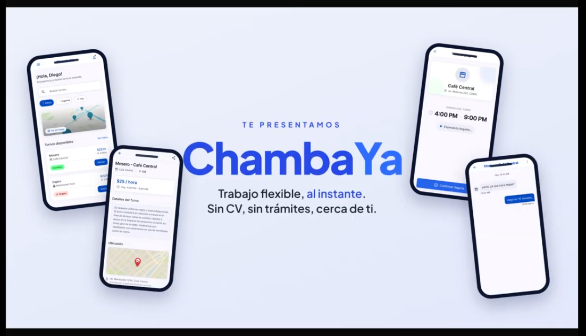
## Video About the Team

El video "About the team" presenta de manera clara y concisa, la sinceridad de los integrantes en la participacion del proyecto.

| Titulo del Video        | Foundly Product              |
|-------------------------|------------------------------|
| Duracion                | 7 minutos 39 segundos        |
| Fecha de Grabacion      | 21/06/2026                   |
| URL de Youtube          | https://youtu.be/QSkAFHBTf2k |
| URL de Microsoft Stream | https://shorturl.at/6QJte    |

Screenshot del video "About the Team" :

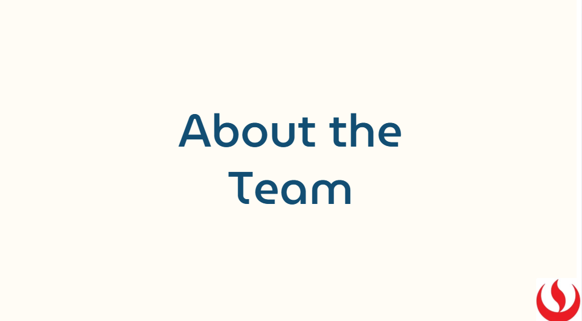

---

# Glosario

Para la definición de los términos del dominio (Chambeador, Contratante, Turno, Match, Tags de habilidades, Insignia de confianza, entre otros) se utilizó el Ubiquitous Language definido en la sección [2.3.5](../docs/chapter-2.md#235-ubiquitous-language) del reporte. A continuación, se listan los enlaces de referencia a los repositorios, herramientas y entornos desplegados del proyecto que sirven como respaldo y fuente de consulta de dichos términos:

- Organización en GitHub: https://github.com/app-movil-3821
- Repositorio del Project Report: https://github.com/app-movil-3821/TerraTeam-Project-Report
- Repositorio de la aplicación móvil (ChambaYa-Kotlin): https://github.com/app-movil-3821/ChambaYa-Kotlin
- Repositorio del Backend API (Backend-ChambaYa): https://github.com/app-movil-3821/Backend-ChambaYa
- Landing Page desplegado: https://app-movil-3821.github.io/LandingPageChambaYa/
- Backend API desplegado / Swagger UI: https://backend-chambaya-production-a24a.up.railway.app/swagger-ui/index.html
- Tablero de Trello (Product Backlog): 
---

# Bibliografía

A continuación, se listan las fuentes citadas en el Capítulo I para sustentar la problemática y los antecedentes del proyecto:

<ul>
  <li>
    Adzic, G. (s.f.). <em>Impact Mapping</em>. 
    Recuperado de <a href="https://www.impactmapping.org/">https://www.impactmapping.org/</a>
  </li>
  <li>
    Angular. (s.f.). <em>Angular Coding Style Guide</em>. 
    Recuperado de <a href="https://angular.io/guide/styleguide">https://angular.io/guide/styleguide</a>
  </li>
  <li>
    Brandolini, A. (s.f.). <em>Introducing EventStorming</em>. 
    Recuperado de <a href="https://www.eventstorming.com/">https://www.eventstorming.com/</a>
  </li>
  <li>
    CareerFoundry. (s.f.). <em>What are User Flows in User Experience (UX) Design?</em>. 
    Recuperado de <a href="https://careerfoundry.com/en/blog/ux-design/what-are-user-flows/">https://careerfoundry.com/en/blog/ux-design/what-are-user-flows/</a>
  </li>
  <li>
    Cohn, M. (s.f.). <em>User Stories</em>. Mountain Goat Software. 
    Recuperado de <a href="https://www.mountaingoatsoftware.com/agile/user-stories">https://www.mountaingoatsoftware.com/agile/user-stories</a>
  </li>
  <li>
    Cone, M. (s.f.). <em>The Markdown Guide</em>. 
    Recuperado de <a href="https://www.markdownguide.org/">https://www.markdownguide.org/</a>
  </li>
  <li>
    Conventional Commits. (s.f.). <em>Conventional Commits</em>. 
    Recuperado de <a href="https://www.conventionalcommits.org/">https://www.conventionalcommits.org/</a>
  </li>
  <li>
    Cucumber. (s.f.). <em>Gherkin Reference</em>. 
    Recuperado de <a href="https://cucumber.io/docs/gherkin/reference/">https://cucumber.io/docs/gherkin/reference/</a>
  </li>
  <li>
    Driessen, V. (2010). <em>A successful Git branching model</em>. nvie.com. 
    Recuperado de <a href="https://nvie.com/posts/a-successful-git-branching-model/">https://nvie.com/posts/a-successful-git-branching-model/</a>
  </li>
  <li>
    DZone. (s.f.). <em>Acceptance Criteria in Scrum: Explanation, Examples, and Template</em>. 
    Recuperado de <a href="https://dzone.com/articles/acceptance-criteria-in-software-explanation-exampl">https://dzone.com/articles/acceptance-criteria-in-software-explanation-exampl</a>
  </li>
  <li>
    Evans, E. (2004). <em>Domain-Driven Design: Tackling Complexity in the Heart of Software</em>. Addison-Wesley Professional.
    Recuperado de <a href="https://www.oreilly.com/library/view/domain-driven-design-tackling/0321125215/">https://www.oreilly.com/library/view/domain-driven-design-tackling/0321125215/</a>
  </li>
  <li>
    Fowler, M. (2006). <em>Ubiquitous Language</em>. 
    Recuperado de <a href="https://martinfowler.com/bliki/UbiquitousLanguage.html">https://martinfowler.com/bliki/UbiquitousLanguage.html</a>
  </li>
  <li>
    Google. (s.f.). <em>Google HTML/CSS Style Guide</em>. 
    Recuperado de <a href="https://google.github.io/styleguide/htmlcssguide.html">https://google.github.io/styleguide/htmlcssguide.html</a>
  </li>
  <li>
    Google. (s.f.). <em>Google JavaScript Style Guide</em>. 
    Recuperado de <a href="https://google.github.io/styleguide/jsguide.html">https://google.github.io/styleguide/jsguide.html</a>
  </li>
  <li>
    Google. (s.f.). <em>Google TypeScript Style Guide</em>. 
    Recuperado de <a href="https://google.github.io/styleguide/tsguide.html">https://google.github.io/styleguide/tsguide.html</a>
  </li>
  <li>
    Google. (s.f.). <em>Google Java Style Guide</em>. 
    Recuperado de <a href="https://google.github.io/styleguide/javaguide.html">https://google.github.io/styleguide/javaguide.html</a>
  </li>
  <li>
    Gothelf, J., & Seiden, J. (2021). <em>Lean UX: Designing Great Products with Agile Teams</em> (3rd ed.). O'Reilly Media.
    Recuperado de <a href="https://www.oreilly.com/library/view/lean-ux-2nd/9781491953594/">https://www.oreilly.com/library/view/lean-ux-2nd/9781491953594/</a>
  </li>
  <li>
    HubSpot. (s.f.). <em>Full List of Meta Tags, Why They Matter for SEO & How to Write Them</em>. 
    Recuperado de <a href="https://blog.hubspot.com/marketing/meta-tags">https://blog.hubspot.com/marketing/meta-tags</a>
  </li>
  <li>
    IBM Design. (s.f.). <em>Empathy Map</em>. Enterprise Design Thinking. 
    Recuperado de <a href="https://www.ibm.com/design/thinking/page/toolkit/activity/empathy-map">https://www.ibm.com/design/thinking/page/toolkit/activity/empathy-map</a>
  </li>
  <li>
    IBM Design. (s.f.). <em>As-is Scenario Map</em>. Enterprise Design Thinking. 
    Recuperado de <a href="https://www.ibm.com/design/thinking/page/toolkit/activity/as-is-scenario-map">https://www.ibm.com/design/thinking/page/toolkit/activity/as-is-scenario-map</a>
  </li>
  <li>
    Martin, R. C. (2017). <em>Clean Architecture: A Craftsman's Guide to Software Structure and Design</em>. Prentice Hall.
    Recuperado de <a href="https://www.oreilly.com/library/view/clean-architecture-a/9780134494272/">https://www.oreilly.com/library/view/clean-architecture-a/9780134494272/</a>
  </li>
  <li>
    Mendel, J. (s.f.). <em>Seriously, what's your (startup's) problem?</em>. Medium. 
    Recuperado de <a href="https://medium.com/@jakemendel/seriously-whats-your-startup-s-problem-b3a884c54ab4">https://medium.com/@jakemendel/seriously-whats-your-startup-s-problem-b3a884c54ab4</a>
  </li>
  <li>
    Nielsen Norman Group. (1994). <em>10 Usability Heuristics for User Interface Design</em>. 
    Recuperado de <a href="https://www.nngroup.com/articles/ten-usability-heuristics/">https://www.nngroup.com/articles/ten-usability-heuristics/</a>
  </li>
  <li>
    Nielsen Norman Group. (2016). <em>The Four Dimensions of Tone of Voice</em>. 
    Recuperado de <a href="https://www.nngroup.com/articles/tone-of-voice-dimensions/">https://www.nngroup.com/articles/tone-of-voice-dimensions/</a>
  </li>
  <li>
    Preston-Werner, T. (s.f.). <em>Semantic Versioning 2.0.0</em>. 
    Recuperado de <a href="https://semver.org/">https://semver.org/</a>
  </li>
  <li>
    Progressa Lean. (s.f.). <em>5W+2H - Técnica de análisis de problemas</em>. 
    Recuperado de <a href="https://www.progressalean.com/5w2h-tecnica-de-analisis-de-problemas/">https://www.progressalean.com/5w2h-tecnica-de-analisis-de-problemas/</a>
  </li>
  <li>
    Refactoring.Guru. (s.f.). <em>Design Patterns</em>. 
    Recuperado de <a href="https://refactoring.guru/es/design-patterns">https://refactoring.guru/es/design-patterns</a>
  </li>
  <li>
    Spring. (s.f.). <em>Spring Boot Reference Documentation</em>. 
    Recuperado de <a href="https://docs.spring.io/spring-boot/docs/current/reference/html/">https://docs.spring.io/spring-boot/docs/current/reference/html/</a>
  </li>
  <li>
    UXPressia. (s.f.). <em>User vs. Buyer Persona: Differences and free template</em>. 
    Recuperado de <a href="https://uxpressia.com/blog/user-persona-vs-buyer-persona-difference">https://uxpressia.com/blog/user-persona-vs-buyer-persona-difference</a>
  </li>
  <li>
    Vernon, V. (2016). <em>Domain-Driven Design Distilled</em>. Addison-Wesley Professional.
    Recuperado de <a href="https://www.oreilly.com/library/view/domain-driven-design-distilled/9780134434964/">https://www.oreilly.com/library/view/domain-driven-design-distilled/9780134434964/</a>
  </li>
  <li>
    Vernon, V. (s.f.). <em>Domain-Driven Design Reference</em>. 
    Recuperado de <a href="https://domainlanguage.com/ddd/reference/">https://domainlanguage.com/ddd/reference/</a>
  </li>
</ul>
