# Capítulo II: Requirements Development and Software Solution Design

## 2.1. Competidores
### 2.1.1. Análisis competitivo
<table border="1" cellpadding="8" cellspacing="0" style="border-collapse:collapse; width:100%; font-family:Arial, sans-serif;">
    <tr>
        <th colspan="7" style="background-color:#d9ead3;">Competitive Analysis Landscape</th>
    </tr>
    <tr>
        <td colspan="2" rowspan="2" style="background-color:#f4cccc;"><strong>¿Por qué llevar a cabo este análisis?</strong></td>
        <td colspan="5">¿Cómo se posiciona ChambaYA frente a sus competidores en cuanto a propuesta de valor, marketing, producto y estrategia?</td>
    </tr>
    <tr>
        <td colspan="5">
            Es un análisis comparativo que permite identificar fortalezas, debilidades, oportunidades y amenazas, así como entender mejor la posición del producto frente a otros actores relevantes del mercado.
        </td>
    </tr>
    <tr>
        <td colspan="3"></td>
        <td style="text-align:center;">
            <strong>ChambaYA</strong> 
            
        </td>
        <td style="text-align:center;">
            <strong>Computrabajo</strong> 
            
        </td>
        <td style="text-align:center;">
            <strong>Time Jobs</strong> 
            
        </td>
        <td style="text-align:center;">
            <strong>Indeed</strong> 
            
        </td>
    </tr>
    <tr>
        <td rowspan="2">Perfil</td>
        <td colspan="2">Overview</td>
        <td>Plataforma móvil de contratación inmediata para MYPEs que necesitan cubrir personal temporal de forma urgente mediante geolocalización y matching en tiempo real.</td>
        <td>Bolsa de empleo líder en Perú/LATAM enfocada en vacantes formales y procesos tradicionales de contratación.</td>
        <td>Plataforma de staffing flexible orientada a cubrir necesidades de personal temporal para empresas operativas.</td>
        <td>Motor global de búsqueda de empleo con publicaciones de empresas y postulaciones masivas.</td>
    </tr>
    <tr>
        <td colspan="2">Ventaja competitiva ¿Qué valor ofrece a los clientes?</td>
        <td>Matching hiperlocal inmediato, sin CV, orientado a microturnos y contratación urgente para negocios pequeños.</td>
        <td>Gran base de candidatos y reconocimiento de marca en LATAM.</td>
        <td>Rapidez en provisión de personal temporal para empresas.</td>
        <td>Amplia suite de funcionalidades para gestión clínica y administrativa, integración con sistemas de pago.</td>
    </tr>
    <tr>
        <td rowspan="2">Perfil de Marketing</td>
        <td colspan="2">Mercado objetivo</td>
        <td>MYPEs: restaurantes, bodegas, cafeterías, negocios locales y jóvenes estudiantes/trabajadores flexibles.</td>
        <td>Empresas de todos los tamaños y postulantes de empleo formal. </td>
        <td>Empresas con alta rotación operativa y necesidad temporal estructurada.</td>
        <td>Empresas medianas/grandes y profesionales generales</td>
    </tr>
    <tr>
        <td colspan="2">Estrategias de marketing</td>
        <td>Estrategia: Penetración local en zonas comerciales, alianzas con universidades e incubadoras, marketing hipersegmentado digital.</td>
        <td>Estrategia: SEO, publicidad digital masiva, posicionamiento de marca consolidado.</td>
        <td>Estrategia: Ventas B2B directas y alianzas comerciales empresariales.</td>
        <td>Estrategia: SEO global, pauta digital y posicionamiento internacional.</td>
    </tr>
    <tr>
        <td rowspan="3">Perfil de Producto</td>
        <td colspan="2">Productos & Servicios.</td>
        <td>Productos: App móvil de matching laboral temporal con geolocalización, reputación y chat interno.</td>
        <td>Productos: Portal web/app de bolsa laboral tradicional.</td>
        <td>Productos: Plataforma de staffing / reclutamiento temporal.</td>
        <td>Productos: Portal de empleo web/app.</td>
    </tr>
    <tr>
        <td colspan="2">Precios & Costos</td>
        <td>Precios: Microcomisión por contratación / modelo freemium accesible para MYPEs.</td>
        <td>Precios: Pago por publicación / paquetes de reclutamiento.</td>
        <td>Precios: Pricing empresarial por servicio staffing.</td>
        <td>Precios: Pago por publicación / patrocinio de vacantes.</td>
    </tr>
    <tr>
        <td colspan="2">Canales de distribución (Web y/o Móvil)</td>
        <td>Canales: App móvil (iOS/Android) y plataforma web.</td>
        <td>Canales: Web + móvil.</td>
        <td>Canales: Web + móvil.</td>
        <td>Canales: Web + móvil.</td>
    </tr>
    <tr>
        <td rowspan="5">Análisis SWOT</td>
    <tr>
        <td colspan="2">Fortalezas</td>
        <td>Fortalezas: Especialización en contratación inmediata, modelo hiperlocal, pensado para MYPEs.</td>
        <td>Fortalezas: Gran penetración de mercado y confianza de marca.</td>
        <td>Fortalezas: Buen enfoque en personal temporal.</td>
        <td>Fortalezas: Amplia base de usuarios global.</td>
    </tr>
    <tr>
        <td colspan="2">Debilidades</td>
        <td>Debilidades: Startup nueva, requiere validación de mercado y adquisición de masa crítica.</td>
        <td>Debilidades: No optimizado para urgencias ni microturnos; requiere CV.</td>
        <td>Debilidades: Poco orientado a microempresas pequeñas; enfoque más corporativo.</td>
        <td>Debilidades: No especializado en contratación inmediata/local.</td>
    </tr>
    <tr>
        <td colspan="2">Oportunidades</td>
        <td>Oportunidades: Crecimiento de gig economy y digitalización de MYPEs en Perú/LATAM.</td>
        <td>Oportunidades: Expandir verticales laborales.</td>
        <td>Oportunidades: Penetrar nuevos mercados LATAM.</td>
        <td>Oportunidades: Mantener liderazgo global.</td>
    </tr>
    <tr>
        <td colspan="2">Amenazas</td>
        <td>Amenazas: Entrada de marketplaces globales / dificultad de generar liquidez inicial.</td>
        <td>Amenazas: Nuevos modelos de gig-work más ágiles.</td>
        <td>Amenazas: Nuevas apps hiperlocales especializadas.</td>
        <td>Amenazas: Plataformas nicho más adaptadas al mercado local.</td>
    </tr>
</table>

### 2.1.2. Estrategias y tácticas frente a competidores

| **Análisis FODA cruzado** | **Oportunidades** | **Amenazas** |
|---|---|---|
| **Fortalezas (F)** 1. Especialización en contratación inmediata para MYPEs. 2. Matching geolocalizado en tiempo real. 3. Registro simplificado sin CV mediante sistema tag-based. | **Estrategia (FO) — Estrategias Ofensivas** 1. Posicionar a ChambaYA como la primera plataforma especializada en contratación urgente para MYPEs en Perú. 2. Implementar campañas de adquisición en zonas comerciales con alta concentración de negocios pequeños. 3. Generar alianzas con universidades e institutos para captar oferta laboral juvenil verificada. 4. Incentivar primeras contrataciones mediante promociones de lanzamiento y créditos gratuitos para MYPEs. | **Estrategia (FA) — Estrategias Defensivas** 1. Reforzar el posicionamiento de nicho especializado frente a plataformas generalistas como Computrabajo/Indeed. 2. Priorizar velocidad de matching como principal diferenciador competitivo. 3. Construir barreras de salida mediante reputación acumulativa de usuarios. 4. Mejorar constantemente UX/UI para reducir fricción frente a competidores más grandes.<br5. Comunicar fuertemente beneficios de inmediatez y cercanía geográfica. |
| **Debilidades (D)** 1. Bajo reconocimiento de marca al ser startup nueva. 2. Necesidad de masa crítica en ambos lados del marketplace. 3. Recursos limitados frente a competidores consolidados. 4. Dependencia inicial de adopción en mercados locales específicos.| **Estrategia (DO) — Reorientación** 1. Validar el modelo en una zona piloto antes de expansión masiva. 2. Ejecutar campañas hiperlocales para alcanzar densidad de usuarios por distrito/zona comercial. 3. Implementar programas de referidos para crecimiento orgánico de ambas partes del marketplace. 4. Generar contenido educativo para MYPEs sobre beneficios de contratación flexible digital. 5. Buscar incubadoras, fondos semilla y alianzas estratégicas para acelerar crecimiento. | **Estrategia (DA) — Supervivencia** 1. Priorizar construcción de confianza mediante validación de identidad y sistema reputacional robusto. 2. Mantener costos operativos lean para competir durante etapa temprana. 3. Enfocar recursos en verticales/rubros donde el pain point sea más fuerte. 4. Diseñar estrategia de retención temprana para evitar churn en ambos lados del marketplace. 5. Iterar rápidamente el producto con base en feedback continuo del mercado piloto. |

## 2.2. Entrevistas
### 2.2.1. Diseño de entrevistas
<h4 id="Segment" >Segmento objetivo: Contratantes (MYPEs)</h4> 
<h4 id="PreguntPersonal">Preguntas Personales:</h4> 

¿Cuál es su nombre?

¿Cuál es su edad?

¿Cuál es su cargo dentro del negocio?

¿Qué tipo de negocio administra?

¿Cuántos años lleva operando el negocio?

¿Cuántos trabajadores tiene actualmente?

<h4 id="PreguntEspe">Preguntas específicas:</h4> 

¿Con qué frecuencia enfrenta faltas de personal o necesidad de apoyo temporal en su negocio?

¿Cuando necesita cubrir un turno urgente, ¿cómo busca personal actualmente?

¿Cuánto tiempo suele tardar en encontrar a alguien disponible?

¿Qué problemas o frustraciones enfrenta con ese proceso?

¿Qué factores considera más importantes al momento de contratar personal temporal? (confianza, cercanía, experiencia, rapidez, costo, etc.)

¿Ha contratado anteriormente personas sin experiencia formal? ¿Cómo fue esa experiencia?

¿Qué nivel de confianza le generaría contratar mediante una aplicación móvil?

¿Qué funcionalidades consideraría indispensables en una plataforma de contratación inmediata?

¿Estaría dispuesto a pagar una comisión por una contratación rápida y confiable? ¿Bajo qué condiciones?

<h4 id="Segment" >Segmento objetivo: Jóvenes / Trabajadores Temporales </h4> 
<h4 id="PreguntPersonal">Preguntas Personales:</h4> 

¿Cuál es su nombre?

¿Cuál es su edad?

¿Actualmente estudia, trabaja o ambos?

¿Cuál es su ocupación?

¿Dónde reside actualmente?

¿Cuenta con experiencia laboral previa? ¿En qué rubros?

<h4 id="PreguntESP">Preguntas específicas :</h4> 

¿Ha buscado trabajos temporales o de medio tiempo anteriormente?

¿Qué dificultades ha encontrado al buscar este tipo de empleo?

¿Qué tan importante es para usted la flexibilidad horaria al momento de trabajar?

¿Qué tan dispuesto estaría a aceptar trabajos de corta duración por turnos o días?

¿Qué tipo de trabajos operativos estaría dispuesto a realizar? (atención, reparto, inventario, limpieza, etc.)

¿Qué factores considera más importantes al aceptar un trabajo temporal? (pago, cercanía, horario, seguridad, reputación del negocio, etc.)

¿Qué tan cómodo se sentiría usando una app para postular a trabajos rápidos sin CV?

### 2.2.2. Registro de entrevistas

#### Segmento 1: 

<table>
<colgroup>
</colgroup>
<thead>
  <tr>
    <th colspan="2">Entrevista #1 </th>
  </tr>
</thead>
<tbody>
  <tr>
    <td>Nombre</td>
    <td>Jimena</td>
  </tr>
  <tr>
    <td>Apellidos</td>
    <td>Bartolo </td>
  </tr>
  <tr>
    <td>Edad</td>
    <td>25 años</td>
  </tr>
  <tr>
    <td>Rol</td>
    <td>Administradora de Mypes</td>
  </tr>
  <tr>
    <td>Evidencia</td>
    <td>
</td>
  </tr>
  <tr>
    <td>Link</td>
    <td>
      <a href="https://upcedupe-my.sharepoint.com/:v:/g/personal/u202310949_upc_edu_pe/IQDBy6PhE1SASLRnUXdWusLzAcy9htEhP8k0nfKs5mYJeno?nav=eyJyZWZlcnJhbEluZm8iOnsicmVmZXJyYWxBcHAiOiJPbmVEcml2ZUZvckJ1c2luZXNzIiwicmVmZXJyYWxBcHBQbGF0Zm9ybSI6IldlYiIsInJlZmVycmFsTW9kZSI6InZpZXciLCJyZWZlcnJhbFZpZXciOiJNeUZpbGVzTGlua0NvcHkifX0&e=miCP8i" target="_blank">
    Videos entrevistas
  </a>
</td>
  </tr>
    <td>Timing donde inicia la entrevista </td>
    <td>00:09 min</td>
  </tr>
  <tr>
    <td>Duración de la entrevista </td>
    <td>03:26 min</td>
  <tr>
    <td>Resumen</td>
    <td> - Jimena, dueña de un pequeño negocio, mencionó que enfrenta dificultades cuando necesita cubrir turnos de manera urgente, ya que actualmente busca personal a través de conocidos o WhatsApp, lo que le toma entre uno y dos días. Señala que uno de los principales problemas es la falta de confianza y referencias de los trabajadores, además de la pérdida de tiempo en el proceso. Considera importante contar con una solución que le permita encontrar personal disponible de forma rápida, cercana y con buenas calificaciones, y estaría dispuesta a pagar por este servicio si realmente le garantiza eficiencia y confiabilidad.
</td>
  </tr>
</tbody>
</table>

<table>
<colgroup>
</colgroup>
<thead>
  <tr>
    <th colspan="2">Entrevista #2 </th>
  </tr>
</thead>
<tbody>
  <tr>
    <td>Nombre</td>
    <td>Fabricio</td>
  </tr>
  <tr>
    <td>Apellidos</td>
    <td>Sanchez</td>
  </tr>
  <tr>
    <td>Edad</td>
    <td>26</td>
  </tr>
  <tr>
    <td>Rol</td>
    <td>Administrador de Mype</td>
  </tr>
  <tr>
    <td>Evidencia</td>
    <td>
</td>
  </tr>
  <tr>
    <td>Link</td>
    <td>
      <a href="https://upcedupe-my.sharepoint.com/:v:/g/personal/u202310949_upc_edu_pe/IQDBy6PhE1SASLRnUXdWusLzAcy9htEhP8k0nfKs5mYJeno?nav=eyJyZWZlcnJhbEluZm8iOnsicmVmZXJyYWxBcHAiOiJPbmVEcml2ZUZvckJ1c2luZXNzIiwicmVmZXJyYWxBcHBQbGF0Zm9ybSI6IldlYiIsInJlZmVycmFsTW9kZSI6InZpZXciLCJyZWZlcnJhbFZpZXciOiJNeUZpbGVzTGlua0NvcHkifX0&e=miCP8i" target="_blank">
    Videos entrevistas
     </a>
    </td>
  </tr>
    <td>Timing donde inicia la entrevista </td>
    <td>03:32 min</td>
  </tr>
  <tr>
    <td>Duración de la entrevista </td>
    <td>05:37 min</td>
  <tr>
    <td>Resumen</td>
    <td> Fabricio confirmo que la rotación imprevista de personal es un problema crítico, especialmente los fines de semana. Sus métodos de reclutamiento actuales (carteles, redes sociales) son lentos, ineficientes y generan desconfianza, tardando hasta tres días en cubrir urgencias.

Para turnos de emergencia, Fabricio prioriza la inmediatez, cercanía y buena actitud por encima de la experiencia formal o el CV. La propuesta de la aplicación fue recibida con entusiasmo. Destacó que el mapa de geolocalización es indispensable para actuar rápido. Además, la "Insignia de Confianza" (verificación con correo universitario) fue el factor decisivo que disipó sus miedos de seguridad al contratar desconocidos, prefiriendo estudiantes validados.

Finalmente, validó el modelo de negocio al confirmar su total disposición a pagar una comisión por contacto efectivo, ya que el costo es mínimo comparado con las pérdidas por falta de personal.
</td>
  </tr>
</tbody>
</table>

<table>
<colgroup>
</colgroup>
<thead>
  <tr>
    <th colspan="2">Entrevista #3 </th>
  </tr>
</thead>
<tbody>
  <tr>
    <td>Nombre</td>
    <td></td>
  </tr>
  <tr>
    <td>Apellidos</td>
    <td> </td>
  </tr>
  <tr>
    <td>Edad</td>
    <td></td>
  </tr>
  <tr>
    <td>Rol</td>
    <td></td>
  </tr>
  <tr>
    <td>Evidencia</td>
    <td>
</td>
  </tr>
  <tr>
    <td>Link</td>
    <td>
      <a href="https://upcedupe-my.sharepoint.com/:v:/g/personal/u202310949_upc_edu_pe/IQDBy6PhE1SASLRnUXdWusLzAcy9htEhP8k0nfKs5mYJeno?nav=eyJyZWZlcnJhbEluZm8iOnsicmVmZXJyYWxBcHAiOiJPbmVEcml2ZUZvckJ1c2luZXNzIiwicmVmZXJyYWxBcHBQbGF0Zm9ybSI6IldlYiIsInJlZmVycmFsTW9kZSI6InZpZXciLCJyZWZlcnJhbFZpZXciOiJNeUZpbGVzTGlua0NvcHkifX0&e=miCP8i" target="_blank">
    Videos entrevistas
     </a>
    </td>
  </tr>
    <td>Timing donde inicia la entrevista </td>
    <td>08:54 min</td>
  </tr>
  <tr>
    <td>Duración de la entrevista </td>
    <td>05:18 min</td>
  <tr>
    <td>Resumen</td>
    <td> 
</td>
  </tr>
</tbody>
</table>

#### Segmento 2:

<table>
<colgroup>
</colgroup>
<thead>
  <tr>
    <th colspan="2">Entrevista #1 </th>
  </tr>
</thead>
<tbody>
  <tr>
    <td>Nombre</td>
    <td>Victor</td>
  </tr>
  <tr>
    <td>Apellidos</td>
    <td>Rivera </td>
  </tr>
  <tr>
    <td>Edad</td>
    <td>18 años</td>
  </tr>
  <tr>
    <td>Rol</td>
    <td>Estudiante universitario</td>
  </tr>
  <tr>
    <td>Evidencia</td>
    <td>
</td>
  </tr>
  <tr>
    <td>Link</td>
    <td>
      <a href="https://upcedupe-my.sharepoint.com/:v:/g/personal/u202310949_upc_edu_pe/IQDBy6PhE1SASLRnUXdWusLzAcy9htEhP8k0nfKs5mYJeno?nav=eyJyZWZlcnJhbEluZm8iOnsicmVmZXJyYWxBcHAiOiJPbmVEcml2ZUZvckJ1c2luZXNzIiwicmVmZXJyYWxBcHBQbGF0Zm9ybSI6IldlYiIsInJlZmVycmFsTW9kZSI6InZpZXciLCJyZWZlcnJhbFZpZXciOiJNeUZpbGVzTGlua0NvcHkifX0&e=miCP8i" target="_blank">
    Videos entrevistas
      </a>
    </td>
  </tr>
    <td>Timing donde inicia la entrevista </td>
    <td>14:15 min</td>
  </tr>
  <tr>
    <td>Duración de la entrevista </td>
    <td>03:29 min</td>
  <tr>
    <td>Resumen</td>
    <td> - Victor Rivera, un joven de 18 años y estudiante universitario, ha buscado trabajos temporales principalmente a través de redes sociales y plataformas de empleo tradicionales. Sin embargo, ha enfrentado dificultades como la falta de claridad en los procesos de aplicación, la necesidad de contar con un CV formal y la poca flexibilidad en los horarios ofrecidos. Valora mucho la flexibilidad horaria debido a sus estudios y estaría dispuesto a aceptar trabajos de corta duración si se le garantiza una buena remuneración y condiciones claras. Además, considera importante la cercanía del lugar de trabajo y la reputación del empleador al momento de aceptar una oferta laboral temporal.
</td>
  </tr>
</tbody>
</table>

<table>
<colgroup>
</colgroup>
<thead>
  <tr>
    <th colspan="2">Entrevista #2 </th>
  </tr>
</thead>
<tbody>
  <tr>
    <td>Nombre</td>
    <td>Andrea</td>
  </tr>
  <tr>
    <td>Apellidos</td>
    <td>Rodriguez</td>
  </tr>
  <tr>
    <td>Edad</td>
    <td>21 años</td>
  </tr>
  <tr>
    <td>Rol</td>
    <td>Estudiante de administración</td>
  </tr>
  <tr>
    <td>Evidencia</td>
    <td>
</td>
  </tr>
  <tr>
    <td>Link</td>
    <td>
      <a href="https://upcedupe-my.sharepoint.com/:v:/g/personal/u202310949_upc_edu_pe/IQDBy6PhE1SASLRnUXdWusLzAcy9htEhP8k0nfKs5mYJeno?nav=eyJyZWZlcnJhbEluZm8iOnsicmVmZXJyYWxBcHAiOiJPbmVEcml2ZUZvckJ1c2luZXNzIiwicmVmZXJyYWxBcHBQbGF0Zm9ybSI6IldlYiIsInJlZmVycmFsTW9kZSI6InZpZXciLCJyZWZlcnJhbFZpZXciOiJNeUZpbGVzTGlua0NvcHkifX0&e=miCP8i" target="_blank">
    Videos entrevistas
      </a>
    </td>
  </tr>
    <td>Timing donde inicia la entrevista </td>
    <td>17:38 min</td>
  </tr>
  <tr>
    <td>Duración de la entrevista </td>
    <td>04:54 min</td>
  <tr>
    <td>Resumen</td>
    <td> - Andrea Rodriguez, una estudiante de administración de 21 años, ha buscado trabajos para poder sustentar sus gastos principalmente a través de redes sociales y anuncios en locales. Sin embargo, ha enfrentado dificultades como la falta de claridad en los procesos de aplicación, los requisitos presentados por el negocio, la necesidad de contar con un CV formal y la experiencia laboral previa. Valora mucho la flexibilidad horaria y a la vez horarios fijos ya que debido a sus estudios le ayuda a organizar su tiempo, prefiere un trabajo estable con los horarios fijos, también una buena remuneración y condiciones claras. Además, considera importante la cercanía del lugar de trabajo y el buen ambiente laboral.
</td>
  </tr>
</tbody>
</table>

<table>
<colgroup>
</colgroup>
<thead>
  <tr>
    <th colspan="2">Entrevista #3 </th>
  </tr>
</thead>
<tbody>
  <tr>
    <td>Nombre</td>
    <td>Josué</td>
  </tr>
  <tr>
    <td>Apellidos</td>
    <td>Arunategui</td>
  </tr>
  <tr>
    <td>Edad</td>
    <td>22 años</td>
  </tr>
  <tr>
    <td>Rol</td>
    <td>Administrador de Base de Datos</td>
  </tr>
  <tr>
    <td>Evidencia</td>
    <td>
</td>
  </tr>
  <tr>
    <td>Link</td>
    <td>
      <a href="https://upcedupe-my.sharepoint.com/:v:/g/personal/u202310949_upc_edu_pe/IQDBy6PhE1SASLRnUXdWusLzAcy9htEhP8k0nfKs5mYJeno?nav=eyJyZWZlcnJhbEluZm8iOnsicmVmZXJyYWxBcHAiOiJPbmVEcml2ZUZvckJ1c2luZXNzIiwicmVmZXJyYWxBcHBQbGF0Zm9ybSI6IldlYiIsInJlZmVycmFsTW9kZSI6InZpZXciLCJyZWZlcnJhbFZpZXciOiJNeUZpbGVzTGlua0NvcHkifX0&e=miCP8i" target="_blank">
    Videos entrevistas
     </a>
    </td>
  </tr>
    <td>Timing donde inicia la entrevista </td>
    <td>22:30 min</td>
  </tr>
  <tr>
    <td>Duración de la entrevista </td>
    <td>04:24 min</td>
  <tr>
    <td>Resumen</td>
    <td> - El entrevistado, Josué Arunategui, de 22 años y residente en Chorrillos, trabaja como administrador de base de datos con experiencia en ciencia de datos y retail. Ha buscado trabajos temporales, pero encontró dificultades como falta de confianza en las ofertas, poca claridad en pagos y procesos largos. Valora la flexibilidad horaria y está dispuesto a realizar trabajos cortos si las condiciones son claras y bien remuneradas, prefiriendo actividades relacionadas a TI. Considera importantes la cercanía, seguridad, horario flexible y reputación del empleador. Además, se sentiría cómodo usando una app para postular, siempre que sea confiable y transparente.
</td>
  </tr>
</tbody>
</table>

### 2.2.3. Análisis de entrevistas

En esta sección se presenta el análisis detallado de la información recolectada. Para cada segmento, se explican primero los hallazgos estadísticos objetivos y subjetivos, seguidos de la evidencia gráfica correspondiente.

#### Segmento 1: Contratantes

El análisis evidencia que el 100% de los contratantes presenta dificultades relacionadas con la confianza, la lentitud en los procesos y la necesidad de rapidez para cubrir turnos urgentes. Asimismo, el 100% considera importante contar con calificaciones o referencias, lo que refleja una alta necesidad de una solución eficiente y confiable

 

#### Segmento 2: Trabajadores Temporales

Los datos muestran que el 100% de los trabajadores enfrenta problemas de claridad en los procesos y valora la rapidez, mientras que el 67% manifiesta preocupación por la confianza y la reputación del empleador. Esto evidencia la necesidad de un sistema más transparente y accesible para acceder a trabajos temporales.

 

#### Análisis Comparativo

Al comparar ambos segmentos, se observa que empleadores y trabajadores coinciden en un 100% en la necesidad de rapidez, mientras que la confianza y la reputación son factores relevantes para ambos grupos. Estos hallazgos evidencian una oportunidad clara para una solución digital que conecte oferta y demanda de forma eficiente y confiable.

 

---

## 2.3. Needfinding
### 2.3.1. User Personas
Para desarrollar la propuesta de solución, se creará un User Persona por cada segmento objetivo. Este tendrá información relacionada a una persona que pertenezca al segmento objetivo respectivo ya sea información personal, gustos, usos tecnológicos u objetivos. De esta forma, se podrá dar una idea más clara de a qué publico nos estamos acercando con la idea de solución. Además, se realiza una conclusión del análisis de cada User Persona.

**User Persona 1: Contratantes (MYPEs)**

 

**User Persona 2: Trabajadores Temporales**

---

### 2.3.2. User Task Matrix

El User Task Matrix de cada User Persona incluye las actividades que realizan que más destacan en una situación cotidiana. A cada actividad se le asigna un puntaje en cuanto a qué tan frecuente es realizada por el User Persona y otro puntaje en cuanto a qué tanta importancia posee dicha actividad. Gracias a esta herramienta se puede identificar las actividades que necesitan realizar los usuarios y cómo las realizan para hallar formas de mejora que serán parte del producto a diseñar.

Se consideran los dos usuarios previamente definidos que constituyen a los segmentos objetivos de dueños de licorerías y proveedores de productos de licorería, en cada tabla se colocarán las actividades que realizan los User Persona para cumplir sus objetivos. Además, para los niveles de frecuencia e importancia se usan cuatro niveles, siendo estos: Muy Alta, Alta, Media y Baja.

<table>
    <tr>
        <th rowspan="2">ACTIVIDAD </th>
        <th colspan="2">JIMENA TORRES</th>
        <th colspan="2">VICTOR RIVERA</th>
    </tr>
    <tr>
        <td> Frecuencia </td>
        <td> Importancia </td>
        <td> Frecuencia </td>
        <td> Importancia </td>
    </tr>
    <tr>
        <td>Buscar oportunidades laborales</td>
        <td>Media</td>
        <td>Alta</td>
        <td>Muy Alta</td>  
        <td>Muy Alta</td>
    </tr>
    <tr>
        <td>Publicar ofertas de trabajo</td>
        <td>Muy Alta</td>
        <td>Muy Alta</td>
        <td>Baja</td>  
        <td>Media</td>
    </tr>
    <tr>
        <td>Revisar información de trabajos / candidatos</td>
        <td>Muy Alta</td>
        <td>Muy Alta</td>
        <td>Alta</td>  
        <td>Muy Alta</td>
    </tr>
    <tr>
        <td>Evaluar reputación (empleador / trabajador)</td>
        <td>Muy Alta</td>
        <td>Muy Alta</td>
        <td>Alta</td>  
        <td>Muy Alta</td>
    </tr>
    <tr>
        <td>Postular / seleccionar candidato</td>
        <td>Alta</td>
        <td>Muy Alta</td>
        <td>Alta</td>  
        <td>Muy Alta</td>
    </tr>
    <tr>
        <td>Coordinar detalles del trabajo</td>
        <td>Alta</td>
        <td>Muy Alta</td>
        <td>Media</td>  
        <td>Alta</td>
    </tr>
    <tr>
        <td>Gestionar tiempos / disponibilidad</td>
        <td>Alta</td>
        <td>Alta</td>
        <td>Muy Alta</td>  
        <td>Muy Alta</td>
    </tr>
    <tr>
        <td>Ejecutar trabajo / supervisar cumplimiento</td>
        <td>Alta</td>
        <td>Muy Alta</td>
        <td>Media</td>  
        <td>Alta</td>
    </tr>
    <tr>
        <td>Realizar / recibir pagos</td>
        <td>Media</td>
        <td>Muy Alta</td>
        <td>Media</td>  
        <td>Muy Alta</td>
    </tr>
    <tr>
        <td>Calificar experiencia</td>
        <td>Media</td>
        <td>Alta</td>
        <td>Baja</td>  
        <td>Media</td>
    </tr>
    <tr>
        <td>Guardar contactos o favoritos</td>
        <td>Media</td>
        <td>Alta</td>
        <td>Baja</td>  
        <td>Media</td>
    </tr>
    
</table>

Como se observa en la matriz, ambos User Persona presentan actividades críticas con niveles de alta frecuencia e importancia, especialmente en las etapas de búsqueda, evaluación y selección.

En el caso de **Víctor Rivera**, destacan actividades como la búsqueda de empleo, la evaluación de ofertas y la gestión de su disponibilidad, ya que necesita compatibilizar el trabajo con sus estudios. La importancia de la claridad en la información y la rapidez del proceso es clave para su experiencia.

Por otro lado, **Jimena Torres** presenta mayor intensidad en actividades relacionadas con la publicación de ofertas, evaluación de candidatos y supervisión del trabajo. Su principal necesidad radica en la rapidez y confiabilidad, ya que busca cubrir turnos urgentes sin afectar la operación de su negocio.

Ambos coinciden en la importancia de la confianza (reputación) y la claridad en las condiciones, lo que evidencia la necesidad de implementar sistemas de validación y calificación dentro de la solución.

Finalmente, la mayor oportunidad del sistema se encuentra en optimizar el proceso de matching rápido y confiable, reduciendo el tiempo de contratación y mejorando la experiencia para ambos usuarios.

---

### 2.3.3. User Journey Mapping
**User Persona 1:** Jimena Torres (Dueña de Negocio - MYPE)

En esta imagen se presenta el journey map del segundo user persona, Jimena Torres. En esta misma, se detalla el flujo de experiencia de una dueña de negocio que enfrenta la urgencia de cubrir una vacante operativa debido a un imprevisto o alta demanda. El mapa describe cómo Jimena acude a la aplicación para publicar un requerimiento rápido, selecciona a un trabajador basándose en su reputación y cercanía, y logra mantener la continuidad de su negocio, finalizando con una gestión de pago ágil que reduce su estrés operativo y optimiza su tiempo.

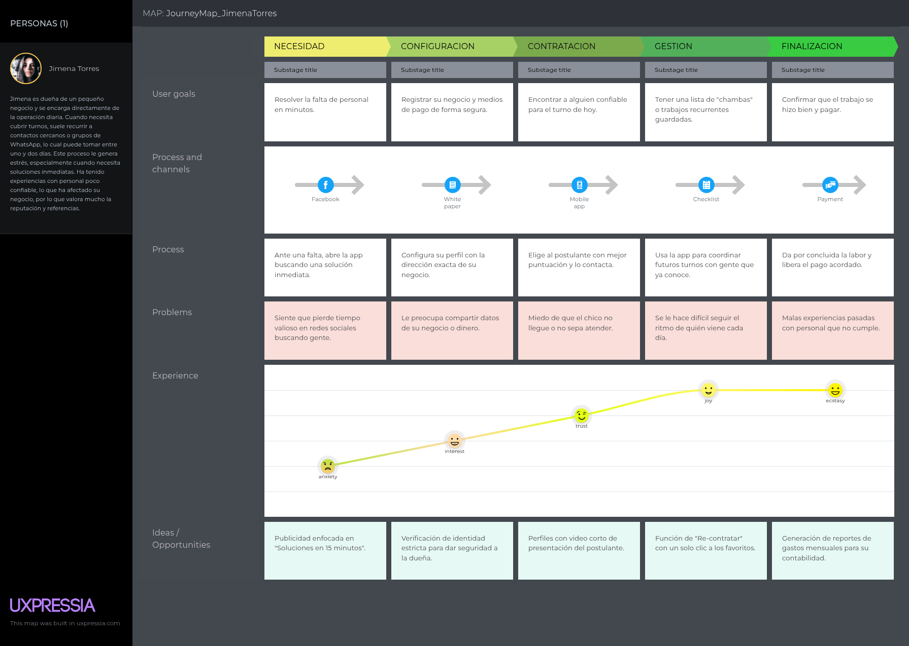

**User Persona 2:** Víctor Rivera (Estudiante Universitario)

En esta imagen se visualiza el journey map del primer user persona, Víctor Rivera. En esta misma, se desea detallar el proceso por el que pasa este estudiante al verse en la necesidad de generar ingresos extra sin descuidar sus estudios. El proceso describe desde el momento en que identifica un tiempo libre en su horario académico y decide buscar una oportunidad laboral inmediata a través de la aplicación ChambaYa, logrando postular de forma simplificada, completar la tarea asignada y finalmente recibir su pago, validando así su desempeño en la plataforma para futuras oportunidades.

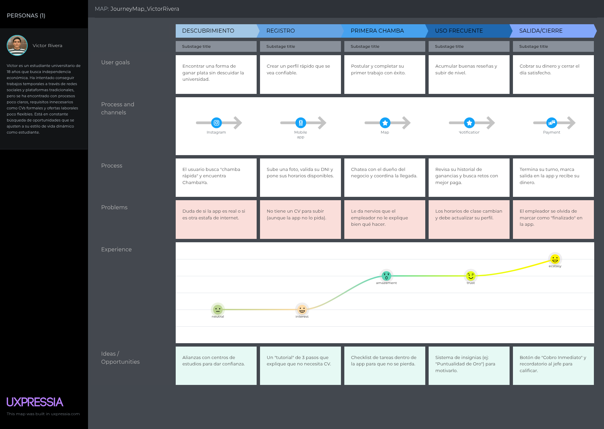

### 2.3.4. Empathy Mapping
El Empathy Mapping ayuda a entender de manera más profunda a nuestro User Persona. Con esta herramienta, capturamos lo que el usuario siente, dice, piensa y hace desde la perspectiva del propio usuario. Además, nos ayuda a identificar dolores y metas qué desea cumplir que nos serán útiles para formar ideas de diseño útiles para el producto que servirá como solución. Finalmente, cada mapa de empatía se diseñó en la aplicación UXPressia.

**User Persona 1:** Jimena Torres (Dueña de Negocio - MYPE)

En esta primera imagen que se muestra a continuación, se visualiza el empathy map del primer user persona. En esta misma, se desea detallar lo que el usuario siente, dice, piensa y hace al momento de enfrentar la necesidad de cubrir un turno de manera urgente. Además, se identifican los dolores que experimenta al buscar personal de forma tradicional y las metas que busca cumplir al utilizar una solución digital eficiente.

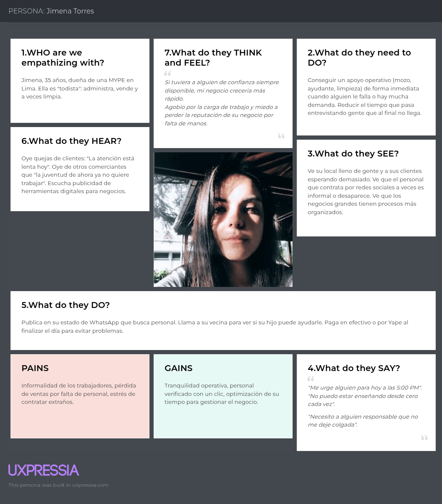

**User Persona 2:** Víctor Rivera (Estudiante Universitario)

En esta segunda imagen que se muestra a continuación, se visualiza el empathy map del segundo user persona. En esta misma, se desea detallar lo que el usuario siente, dice, piensa y hace al momento de buscar oportunidades laborales temporales. Además, se identifican los dolores relacionados con la falta de claridad en los procesos de aplicación y las metas que busca cumplir al acceder a trabajos flexibles y bien remunerados a través de una plataforma digital.

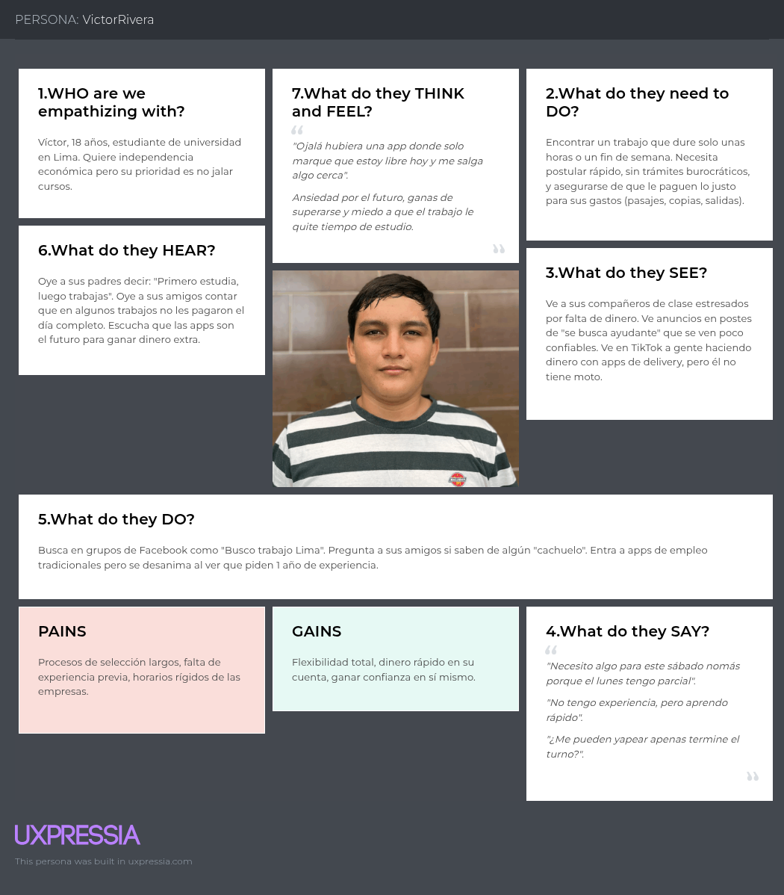

### 2.3.5. Ubiquitous Language
En el presente proyecto, orientado a optimizar la conexión entre micro y pequeñas empresas (MYPEs) y jóvenes que buscan oportunidades laborales temporales mediante una plataforma digital, se ha definido un lenguaje ubicuo que permite establecer una comprensión común entre todos los actores involucrados, incluyendo usuarios, desarrolladores y stakeholders.

La adopción de este lenguaje compartido resulta fundamental para describir de manera clara y consistente los conceptos clave del dominio, reduciendo posibles ambigüedades y facilitando la comunicación a lo largo de todo el proceso de desarrollo del sistema.

A continuación, se presentan los principales términos definidos:

| Término | Descripción |
|--------|------------|
| Chambeador | Usuario joven o estudiante que se registra en la plataforma para encontrar trabajos temporales o turnos cortos. |
| Contratante | Dueño, administrador o representante de una MYPE que publica turnos de trabajo en la plataforma. |
| Turno | Trabajo temporal o tarea específica que debe ser cubierta en un periodo corto de tiempo. |
| Mini-job | Trabajo de corta duración, generalmente por horas o por un día, enfocado en tareas operativas. |
| Match | Proceso mediante el cual la plataforma conecta un turno publicado con un chambeador disponible. |
| Tags de habilidades | Etiquetas que representan las habilidades del chambeador (ej. atención al cliente, inventario, reparto). |
| Insignia de confianza | Verificación del perfil del usuario mediante correo institucional u otro mecanismo de validación. |
| Geolocalización | Funcionalidad que permite ubicar a los usuarios en tiempo real para conectar ofertas y demandas cercanas. |
| Sistema de reputación | Mecanismo de calificación basado en estrellas que permite evaluar la experiencia entre usuarios. |
| Chat interno | Canal de comunicación dentro de la plataforma que permite coordinar detalles del turno sin compartir datos personales. |
| Publicación de turno | Acción realizada por el contratante para registrar un nuevo trabajo disponible en la plataforma. |
| Aceptación de turno | Acción mediante la cual un chambeador selecciona y confirma su participación en un turno. |

## 2.4. Requirements Specification
### 2.4.1. User Stories

En esta sección se presentan las historias de usuario que describen las principales funcionalidades del sistema desde la perspectiva de los usuarios finales. Estas historias han sido definidas considerando el análisis del problema, los segmentos objetivo y las necesidades identificadas en el desarrollo de la plataforma.

Con el fin de organizar de manera clara los requerimientos, las historias de usuario han sido agrupadas en épicas, lo que permite estructurar los distintos componentes funcionales del sistema. De esta forma, se abordan aspectos clave como la gestión de los chambeadores, la administración por parte de los contratantes y los mecanismos de interacción y confianza dentro de la plataforma. Cada historia representa situaciones reales que el sistema busca resolver, como la cobertura rápida de turnos, el acceso a oportunidades laborales cercanas y la generación de un entorno confiable para ambas partes.

### EP01: Gestión de Chambeadores

Descripción: Permite a los jóvenes registrarse, crear su perfil basado en habilidades y acceder a oportunidades laborales temporales sin necesidad de un CV.

| Story ID | Título | Descripción | Criterios de Aceptación |
|----------|--------|------------|-----------------------------------|
| US01 | Registro ágil de chambeador | Como chambeador, quiero registrarme rápidamente, para acceder a oportunidades laborales. | Escenario 1: Registro exitoso. Dado que ingresa datos correctos Cuando confirma Entonces se crea la cuenta.  Escenario 2: Error de registro. Dado datos incompletos Cuando intenta registrarse Entonces el sistema muestra error. |
| US02 | Perfil basado en habilidades | Como chambeador, quiero crear un perfil sin CV, para acceder a trabajos fácilmente. | Escenario 1: Perfil creado. Dado que selecciona habilidades Cuando guarda Entonces se registra.  Escenario 2: Perfil incompleto. Dado que no selecciona habilidades Cuando guarda Entonces solicita completar datos. |
| US03 | Ver turnos cercanos | Como chambeador, quiero ver turnos cercanos, para reducir desplazamiento. | Escenario 1: Turnos disponibles. Dado que existen turnos cercanos Cuando accede Entonces los visualiza.  Escenario 2: Sin turnos. Dado que no hay turnos cercanos Cuando accede Entonces muestra mensaje. |
| US04 | Aceptar turnos | Como chambeador, quiero aceptar turnos, para trabajar de inmediato. | Escenario 1: Aceptación exitosa. Dado turno disponible Cuando acepta Entonces se asigna.  Escenario 2: Turno ocupado. Dado turno ya tomado Cuando intenta aceptar Entonces muestra error. |
| US05 | Ver reputación del contratante | Como chambeador, quiero ver la reputación del contratante, para decidir. | Escenario 1: Reputación visible. Dado que tiene calificaciones Cuando revisa Entonces las visualiza.  Escenario 2: Sin calificaciones. Dado que no tiene historial Cuando revisa Entonces muestra mensaje. |

### EP02: Gestión de Contratantes (MYPEs)

Descripción: Permite a las micro y pequeñas empresas publicar turnos y gestionar la contratación de personal temporal de forma ágil.

| Story ID | Título | Descripción | Criterios de Aceptación |
|----------|--------|------------|-----------------------------------|
| US06 | Registro de contratante | Como contratante, quiero registrarme, para gestionar personal. | Escenario 1: Registro exitoso. Dado datos correctos Cuando confirma Entonces se crea la cuenta.  Escenario 2: Error en registro. Dado datos inválidos Cuando intenta Entonces muestra error. |
| US07 | Publicar turnos | Como contratante, quiero publicar turnos, para cubrir necesidades. | Escenario 1: Publicación exitosa. Dado datos completos Cuando publica Entonces es visible.  Escenario 2: Datos incompletos. Dado falta de datos Cuando publica Entonces muestra error. |
| US08 | Ver trabajadores cercanos | Como contratante, quiero ver trabajadores cercanos, para contratar rápido. | Escenario 1: Trabajadores disponibles. Dado que existen Cuando accede Entonces los ve.  Escenario 2: Sin trabajadores. Dado que no hay disponibles Cuando accede Entonces muestra mensaje. |
| US09 | Seleccionar trabajador | Como contratante, quiero elegir trabajadores por reputación. | Escenario 1: Selección exitosa. Dado trabajador disponible Cuando selecciona Entonces se asigna.  Escenario 2: No disponible. Dado trabajador ocupado Cuando selecciona Entonces muestra error. |
| US10 | Cubrir turno rápido | Como contratante, quiero cubrir turnos rápido, para evitar pérdidas. | Escenario 1: Cobertura exitosa. Dado turno publicado Cuando recibe postulante Entonces se cubre.  Escenario 2: Sin postulantes. Dado tiempo límite Cuando no hay postulantes Entonces notifica. |

### EP03: Comunicación y Confianza

Descripción: Permite la interacción entre usuarios mediante herramientas de comunicación y un sistema de reputación que fortalece la confianza dentro de la plataforma.

| Story ID | Título | Descripción | Criterios de Aceptación |
|----------|--------|------------|-----------------------------------|
| US11 | Chat interno | Como usuario, quiero comunicarme por chat, para coordinar. | Escenario 1: Chat activo. Dado turno aceptado Cuando acceden Entonces pueden escribir.  Escenario 2: Chat no disponible. Dado turno no aceptado Cuando accede Entonces no puede usar chat. |
| US12 | Calificación de usuarios | Como usuario, quiero calificar, para generar confianza. | Escenario 1: Calificación registrada. Dado turno finalizado Cuando califica Entonces se guarda.  Escenario 2: Calificación inválida. Dado intento fuera de tiempo Cuando califica Entonces se rechaza. |

### EP04: Búsqueda y Exploración de Trabajos

Descripción: Permite a los chambeadores explorar oportunidades laborales mediante herramientas como mapa, filtros y listas, facilitando la identificación de trabajos cercanos y adecuados.

| Story ID | Título | Descripción | Criterios de Aceptación |
|----------|--------|------------|-----------------------------------|
| US13 | Ver trabajos en mapa | Como chambeador, quiero ver trabajos en mapa. | Escenario 1: Mapa con resultados. Dado trabajos disponibles Cuando accede Entonces se muestran.  Escenario 2: Mapa vacío. Dado sin trabajos Cuando accede Entonces muestra mensaje. |
| US14 | Filtrar por distancia | Como chambeador, quiero filtrar por distancia. | Escenario 1: Filtro aplicado. Dado rango Cuando filtra Entonces muestra resultados.  Escenario 2: Sin resultados. Dado sin coincidencias Cuando filtra Entonces muestra mensaje. |
| US15 | Filtrar por tipo | Como chambeador, quiero filtrar por tipo de trabajo. | Escenario 1: Filtro exitoso. Dado tipo seleccionado Cuando aplica Entonces muestra resultados.  Escenario 2: Sin coincidencias. Dado tipo inexistente Cuando filtra Entonces muestra mensaje. |
| US16 | Lista de trabajos | Como chambeador, quiero ver lista de trabajos. | Escenario 1: Lista visible. Dado trabajos disponibles Cuando accede Entonces los ve.  Escenario 2: Lista vacía. Dado sin trabajos Cuando accede Entonces muestra mensaje. |
| US17 | Guardar favoritos | Como chambeador, quiero guardar trabajos. | Escenario 1: Guardado exitoso. Dado selección Cuando guarda Entonces se registra.  Escenario 2: Duplicado. Dado ya guardado Cuando intenta Entonces notifica. |
| US18 | Ver detalle de trabajo | Como chambeador, quiero ver detalles del turno. | Escenario 1: Detalle visible. Dado turno seleccionado Cuando accede Entonces muestra info.  Escenario 2: Error de carga. Dado fallo Cuando accede Entonces muestra error. |

### EP05: Gestión de Postulaciones y Turnos

Descripción: Permite gestionar el ciclo de vida del turno, desde la postulación hasta la finalización del trabajo.

| Story ID | Título | Descripción | Criterios de Aceptación |
|----------|--------|------------|-----------------------------------|
| US19 | Postular a turno | Como chambeador, quiero postular, para trabajar. | Escenario 1: Postulación exitosa. Dado turno disponible Cuando postula Entonces se registra.  Escenario 2: Ya postulado. Dado duplicado Cuando intenta Entonces rechaza. |
| US20 | Ver postulantes | Como contratante, quiero ver postulantes. | Escenario 1: Lista visible. Dado postulaciones Cuando accede Entonces visualiza.  Escenario 2: Sin postulantes. Dado ninguno Cuando accede Entonces muestra mensaje. |
| US21 | Aceptar postulante | Como contratante, quiero aceptar postulantes. | Escenario 1: Aceptación exitosa. Dado candidato Cuando acepta Entonces asigna.  Escenario 2: Error. Dado turno cerrado Cuando acepta Entonces falla. |
| US22 | Rechazar postulante | Como contratante, quiero rechazar postulantes. | Escenario 1: Rechazo exitoso. Dado postulante Cuando rechaza Entonces actualiza estado.  Escenario 2: Error. Dado cambio previo Cuando rechaza Entonces notifica. |
| US23 | Cerrar turno | Como contratante, quiero cerrar turno. | Escenario 1: Cierre exitoso. Dado turno activo Cuando cierra Entonces bloquea.  Escenario 2: Error. Dado ya cerrado Cuando intenta Entonces muestra mensaje. |
| US24 | Reabrir turno | Como contratante, quiero reabrir turno. | Escenario 1: Reapertura. Dado cancelado Cuando reactiva Entonces publica.  Escenario 2: Error. Dado activo Cuando intenta Entonces rechaza. |
| US25 | Notificación de postulaciones | Como contratante, quiero notificaciones. | Escenario 1: Notificación enviada. Dado nueva postulación Cuando ocurre Entonces notifica.  Escenario 2: Error. Dado fallo Cuando ocurre Entonces registra error. |
| US26 | Estado de postulación | Como chambeador, quiero ver estado. | Escenario 1: Estado actualizado. Dado decisión Cuando cambia Entonces se muestra.  Escenario 2: Error. Dado fallo Cuando consulta Entonces muestra error. |
| US27 | Recordatorio de turno | Como usuario, quiero recordatorios. | Escenario 1: Recordatorio enviado. Dado turno próximo Cuando se acerca Entonces notifica.  Escenario 2: Desactivado. Dado configuración Cuando aplica Entonces no envía. |
| US28 | Confirmar llegada | Como chambeador, quiero confirmar llegada. | Escenario 1: Confirmación exitosa. Dado inicio Cuando confirma Entonces registra.  Escenario 2: Fuera de tiempo. Dado retraso Cuando intenta Entonces alerta. |
| US29 | Reportar problema | Como usuario, quiero reportar incidencias. | Escenario 1: Reporte enviado. Dado problema Cuando reporta Entonces guarda.  Escenario 2: Error. Dado falta de datos Cuando envía Entonces rechaza. |
| US30 | Finalizar turno | Como usuario, quiero finalizar turno. | Escenario 1: Finalización exitosa. Dado terminado Cuando confirma Entonces cierra.  Escenario 2: Error. Dado no iniciado Cuando intenta Entonces rechaza. |

### 2.4.2. Impact Mapping

En esta sección se presentan los mapas de impacto para cada segmento objetivo del proyecto. Su propósito es relacionar el problema de negocio con el comportamiento esperado de los usuarios y las funcionalidades necesarias para la solución, permitiendo visualizar cómo se generan los resultados planteados.

## Segmento 1 – MYPEs

El mapa de impacto de las MYPEs permite identificar la necesidad de cubrir turnos de manera rápida y confiable. Se destacan comportamientos como la búsqueda inmediata de personal, la publicación ágil de turnos y la validación de la confianza en los trabajadores. A partir de ello, se proponen soluciones enfocadas en la rapidez, la cercanía y la seguridad en la contratación.

## Segmento 2 – Trabajadores Temporales

El mapa de impacto del segmento de jóvenes trabajadores evidencia la necesidad de acceder a empleos temporales de forma rápida y flexible. Se identifican comportamientos como la búsqueda de trabajos cercanos, la postulación sin procesos complejos y la evaluación de condiciones antes de aceptar un turno. Las soluciones se orientan a simplificar el acceso y brindar mayor claridad y confianza.

### 2.4.3. Product Backlog

En esta sección se presenta el Product Backlog del proyecto, el cual reúne la totalidad de historias de usuario identificadas a partir del análisis del problema, los segmentos objetivo y los requerimientos del sistema. Estas historias han sido organizadas y priorizadas según su valor para el usuario y su relevancia dentro del flujo principal de la aplicación.

Asimismo, se ha aplicado la técnica de estimación mediante Story Points utilizando la secuencia de Fibonacci (1, 2, 3, 5, 8), lo que permite evaluar de manera relativa la complejidad y esfuerzo requerido para el desarrollo de cada funcionalidad. Esta aproximación facilita la planificación ágil y la definición de iteraciones de desarrollo más realistas.

A continuación, se presenta la lista priorizada de historias de usuario que conforman el Product Backlog del sistema:

---

| Orden | ID   | Título                         | Descripción                                                                 | Story Points |
|------|------|--------------------------------|-----------------------------------------------------------------------------|-------------|
| 1    | US01 | Registro chambeador            | Como chambeador, quiero registrarme rápidamente, para acceder a trabajos.  | 3 |
| 2    | US06 | Registro contratante           | Como contratante, quiero registrarme, para gestionar personal.             | 3 |
| 3    | US02 | Perfil por habilidades         | Como chambeador, quiero crear un perfil sin CV, para acceder a trabajos.   | 5 |
| 4    | US07 | Publicar turnos                | Como contratante, quiero publicar turnos, para cubrir necesidades.         | 5 |
| 5    | US03 | Ver turnos cercanos            | Como chambeador, quiero ver turnos cercanos, para reducir desplazamiento.  | 5 |
| 6    | US08 | Ver trabajadores cercanos      | Como contratante, quiero ver trabajadores cercanos, para contratar rápido. | 5 |
| 7    | US19 | Postular a turno               | Como chambeador, quiero postular, para trabajar.                           | 3 |
| 8    | US21 | Aceptar postulante             | Como contratante, quiero aceptar postulantes, para asignar turnos.         | 3 |
| 9    | US05 | Ver reputación del contratante | Como chambeador, quiero ver reputación, para decidir.                      | 3 |
| 10   | US09 | Seleccionar trabajador         | Como contratante, quiero elegir por reputación, para asegurar calidad.     | 3 |
| 11   | US20 | Ver postulantes                | Como contratante, quiero ver postulantes, para elegir candidatos.          | 3 |
| 12   | US25 | Notificaciones                 | Como usuario, quiero recibir notificaciones, para estar informado.         | 5 |
| 13   | US26 | Estado de postulación          | Como chambeador, quiero ver el estado, para saber mi situación.            | 3 |
| 14   | US18 | Ver detalle del turno          | Como chambeador, quiero ver detalles del turno, para decidir.              | 5 |
| 15   | US13 | Ver trabajos en mapa           | Como chambeador, quiero ver trabajos en mapa, para encontrar opciones.     | 8 |
| 16   | US11 | Chat interno                   | Como usuario, quiero comunicarme por chat, para coordinar detalles.        | 8 |
| 17   | US12 | Calificación                   | Como usuario, quiero calificar, para generar confianza.                    | 5 |
| 18   | US14 | Filtro por distancia           | Como chambeador, quiero filtrar por distancia.                             | 3 |
| 19   | US15 | Filtro por tipo                | Como chambeador, quiero filtrar por tipo de trabajo.                       | 3 |
| 20   | US16 | Lista de trabajos              | Como chambeador, quiero ver lista de trabajos.                             | 3 |
| 21   | US17 | Guardar favoritos              | Como chambeador, quiero guardar trabajos.                                  | 2 |
| 22   | US22 | Rechazar postulante            | Como contratante, quiero rechazar postulantes.                             | 2 |
| 23   | US23 | Cerrar turno                   | Como contratante, quiero cerrar turno.                                     | 3 |
| 24   | US24 | Reabrir turno                  | Como contratante, quiero reabrir turno.                                    | 3 |
| 25   | US27 | Recordatorio de turno          | Como usuario, quiero recibir recordatorios.                                | 2 |
| 26   | US28 | Confirmar llegada              | Como chambeador, quiero confirmar llegada.                                 | 2 |
| 27   | US29 | Reportar problema              | Como usuario, quiero reportar incidencias.                                 | 3 |
| 28   | US30 | Finalizar turno                | Como usuario, quiero finalizar turno.                                      | 3 |

---

### 2.4.2. Gestión del Product Backlog en Trello

Para la gestión del Product Backlog, se utilizó la herramienta Trello, la cual permitió organizar las historias de usuario de manera visual, priorizarlas y asignar Story Points basados en la secuencia de Fibonacci.

A través de esta herramienta, se definió una priorización inicial de historias de usuario que representan las funcionalidades principales del sistema, correspondientes al flujo básico de la aplicación.

Enlace al tablero de Trello: [Link de TRELLO](https://trello.com/invite/b/69e581bada404d81ccde530d/ATTI42a1d93366631bcc58f2fbcf4f6b8734D6B33942/product-backlog-chambaya)

**Evidencia:**  
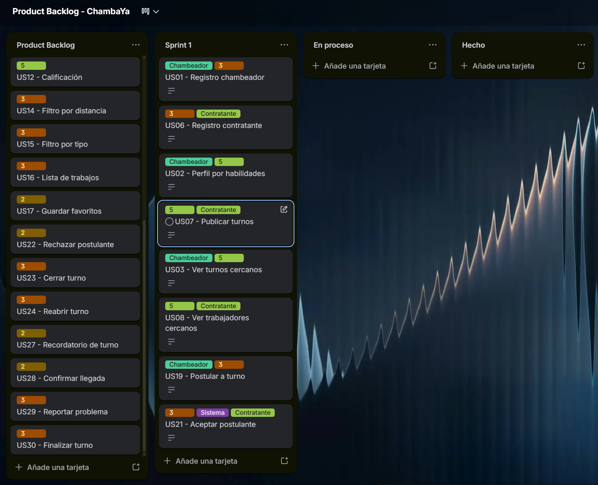
---

Las primeras historias de usuario corresponden a un Sprint 1 propuesto, el cual prioriza funcionalidades esenciales del flujo principal de la aplicación.

## 2.5. Strategic-Level Domain-Driven Design

Para entender el dominio y sus límites, utilizamos la técnica de Event Storming. Esta técnica nos permite descubrir los eventos clave del dominio, identificar los actores involucrados y definir los contextos delimitados (bounded contexts) que conforman el sistema.

### 2.5.1. EventStorming

El equipo uso la herramienta Miro para llevar a cabo sesiones de Event Storming. A continuación, se presentan los pasos seguidos y los resultados obtenidos en cada fase del proceso:

### Paso 1: Collect Domain Events

---
Hemos identificado los eventos de dominio clave que representan cambios significativos en el estado del sistema.

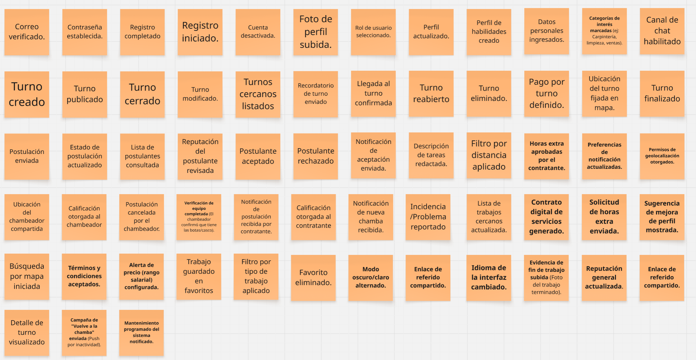

A partir de estos eventos, hemos comenzado a construir una comprensión compartida del dominio y sus procesos.

### Paso 2: Timelines

---

Luego de identificar los eventos, los organizamos en líneas de tiempo para visualizar la secuencia y las relaciones entre ellos.

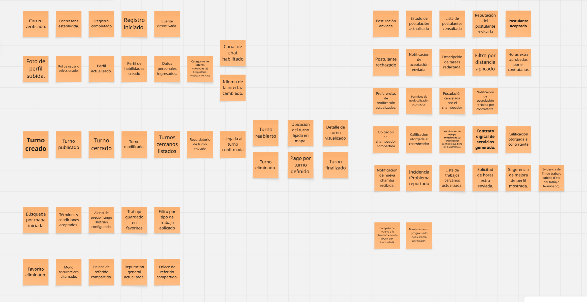

### Paso 3: Pain Points

---

Identificamos los puntos de dolor y las áreas problemáticas dentro del dominio que requieren atención especial.

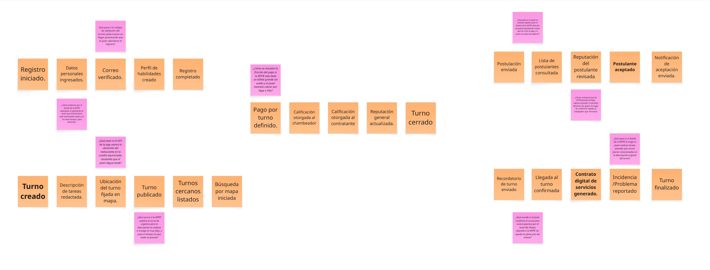

Estos puntos de dolor nos ayudaron a priorizar las áreas que necesitan mejoras y a enfocar nuestros esfuerzos en soluciones efectivas.

### Paso 4: Pivotal Events

---

Luego, destacamos los eventos pivote que tienen un impacto significativo en el flujo del dominio.

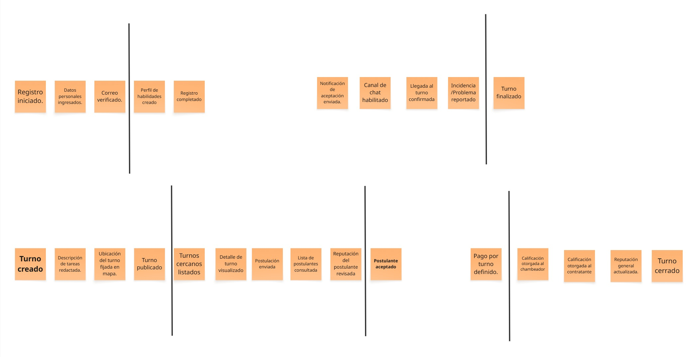

### Paso 5: Commands

---

Identificamos los comandos que representan las acciones que los usuarios o sistemas pueden realizar para desencadenar eventos de dominio.

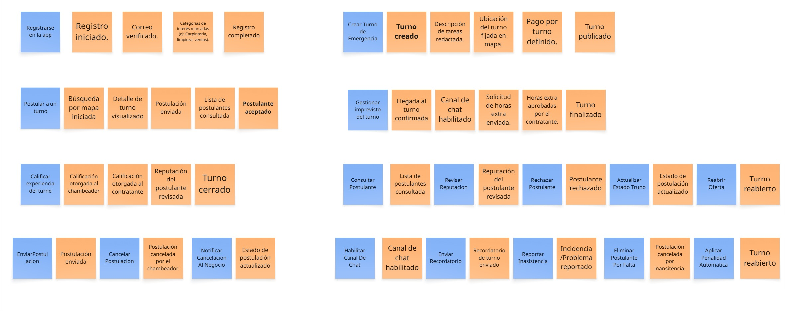

Estos comandos nos ayudaron a definir las interacciones clave dentro del sistema y a comprender cómo los usuarios pueden influir en el flujo del dominio.

### Paso 6: Policies

---

Se identificaron las políticas que gobiernan el comportamiento del sistema, juntamente con las reglas de negocio que se deben cumplir.

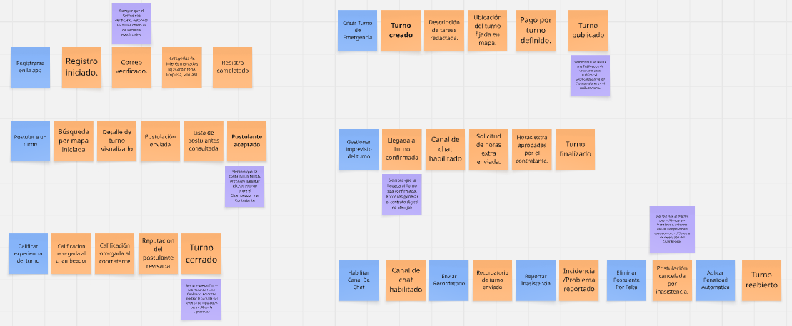

Estas políticas ayudaron a definir las restricciones y las condiciones bajo las cuales los comandos y eventos pueden ocurrir.

### Paso 7: Read Models

---

Se identificaron los modelos de lectura que representan las vistas y las proyecciones de los datos dentro del sistema.

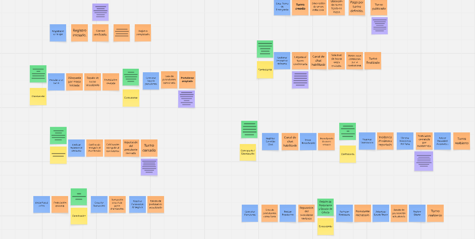

Los modelos de lectura nos permitieron establecer la forma en que la información se muestra a los usuarios y cómo puede ser consultada de manera eficiente.

### Paso 8: External Systems

---

Determinamos qué sistemas externos se relacionan con nuestro dominio y cuáles son los puntos necesarios para integrarlos.

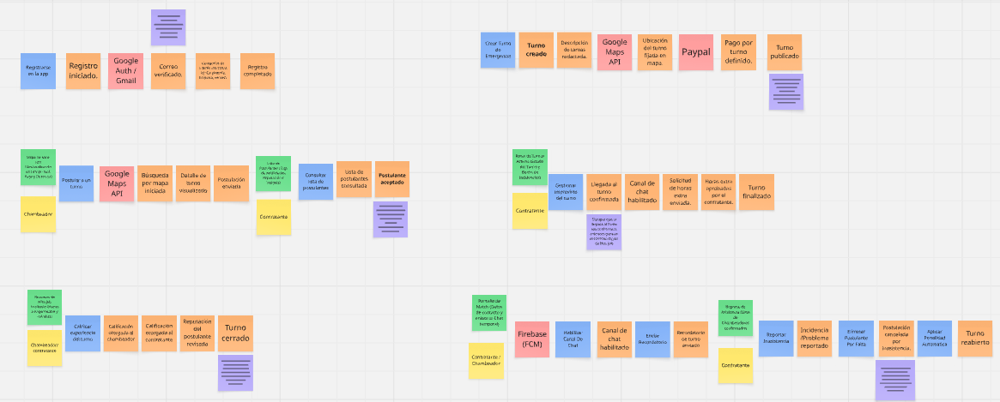

Estos sistemas externos nos permitieron entender mejor las dependencias y las interacciones que ocurren fuera de nuestro control directo.

### Paso 9: Aggregates

---

Por último, determinamos los agregados que representan tanto las entidades como los objetos de valor dentro del dominio.

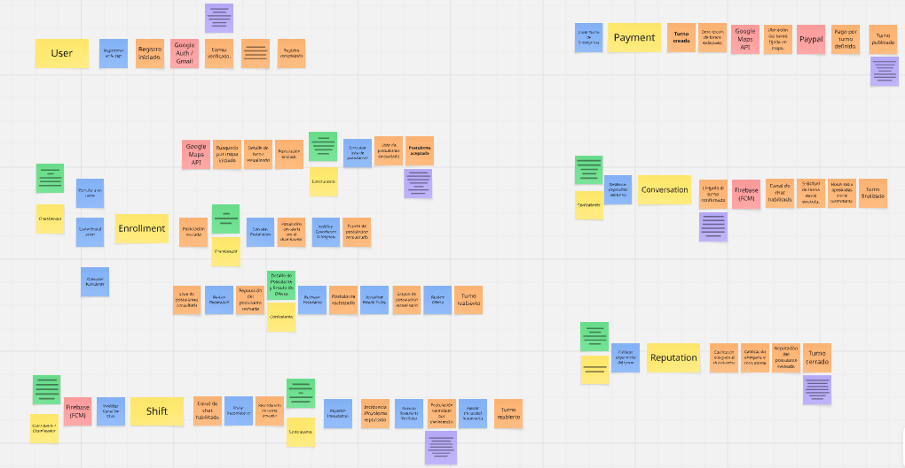

Estos agregados nos permitieron establecer las estructuras de datos y las relaciones fundamentales dentro del sistema.

##### 2.5.1.1. Candidate Context Discovery

Para la identificación de los Bounded Contexts de ChambaYA, aplicamos la técnica de Look-for-Pivotal-Events. Esta técnica nos permitió identificar eventos críticos en el timeline que marcan un cambio de fase en el proceso de negocio o un cambio de responsabilidad entre diferentes "expertos de dominio".

Complementariamente, usamos Start-with-Value para priorizar los contextos de Job y Application, que representan el Core Domain de nuestra plataforma de micro-empleos.

##### 2.5.1.1.1. IAM Context

Para el bounded context de IAM, definimos los siguientes elementos:

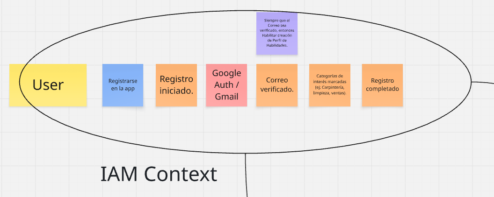

Se identificó a partir de los eventos de registro y validación. Su propósito es aislar la gestión de identidad y seguridad del resto de la lógica operativa.

##### 2.5.1.1.2. Job Context

Para el bounded context de Job, definimos los siguientes elementos:

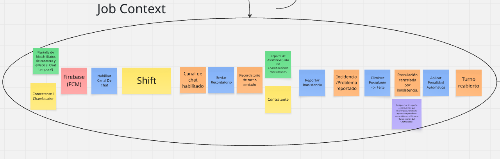

Es el punto de partida del valor del negocio. Se encarga de la existencia y estado del "Mini-job".

##### 2.5.1.1.3. Application Context

Para el bounded context de Application, definimos los siguientes elementos:

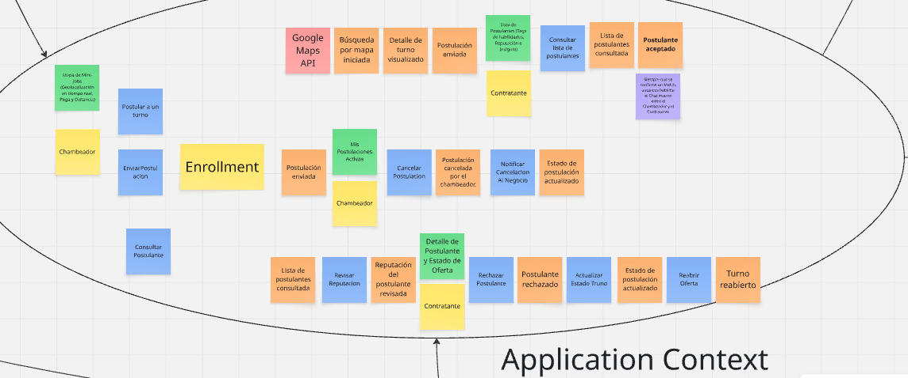

Se separó del Job Context porque el proceso de postulación y selección tiene reglas de negocio muy distintas (manejo de candidatos vs. manejo de locales). Aquí es donde ocurre el "Match".

##### 2.5.1.1.4. Communication Context

Para el bounded context de Communication, definimos los siguientes elementos:

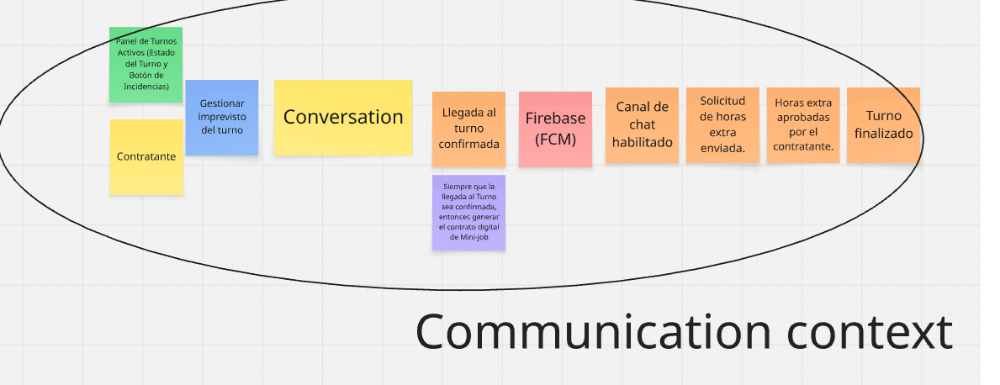

Se definió al notar que la mensajería es un servicio de soporte que solo se activa tras un evento específico de éxito en la postulación.

##### 2.5.1.1.5. Payment Context

Para el bounded context de Payment, definimos los siguientes elementos:

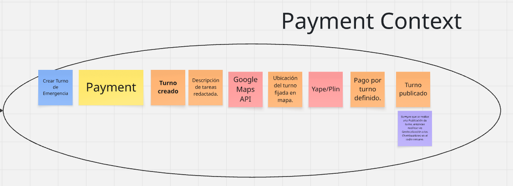

Se aisló para manejar la complejidad de las transacciones con billeteras digitales (Yape/Plin) y asegurar que el flujo de dinero sea independiente de la gestión de tareas.

##### 2.5.1.1.6. Reputation Context

Para el bounded context de Reputation, definimos los siguientes elementos:

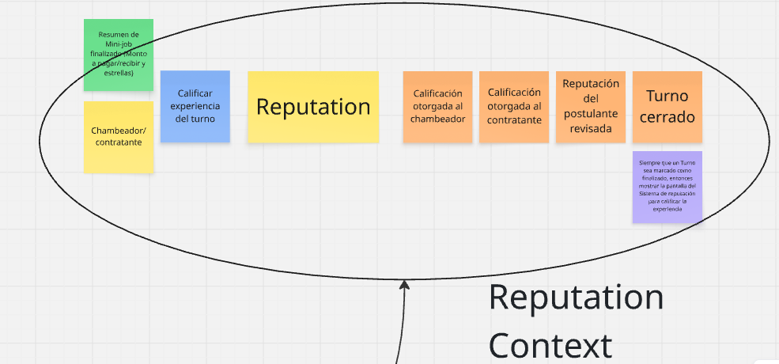

Se ubica al final del timeline. Su lógica de promedios y reseñas no debe afectar el desempeño de los otros módulos.

##### 2.5.1.2. Domain Message Flows Modeling

En esta sección, se modelaron los flujos de colaboración entre los Bounded Contexts, con el objetivo de visualizar cómo interactúan los diferentes módulos del sistema para resolver los escenarios críticos de negocio identificados durante el Event Storming.

Se definieron tres escenarios principales para evidenciar los flujos de mensajes:

##### 2.5.1.2.1. Escenario de Publicación y Postulación
Este flujo abarca desde la creación del turno hasta que los chambeadores envían sus postulaciones.
- El Contratante define las características del mini-job dentro del Job Context.
- El Job Context publica la oferta para que sea visible y gestionable.
- El Chambeador envía su postulación al Application Context.

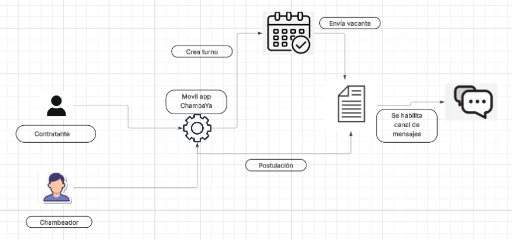

##### 2.5.1.2.2. Escenario de Finalización, Pago y Calificación
Este flujo describe el cierre exitoso de la labor, el intercambio de dinero y el feedback de ambas partes.
- El Chambeador reporta la finalización de la tarea dentro del Job Context.
- El Contratante confirma la recepción del servicio y realiza el pago mediante el Payment Context (Yape/Plin).
- El Job Context habilita el proceso de calificación en el Reputation Context tras confirmarse el pago.
- El Contratante y Chambeador intercambian reseñas para actualizar su reputación en el sistema.

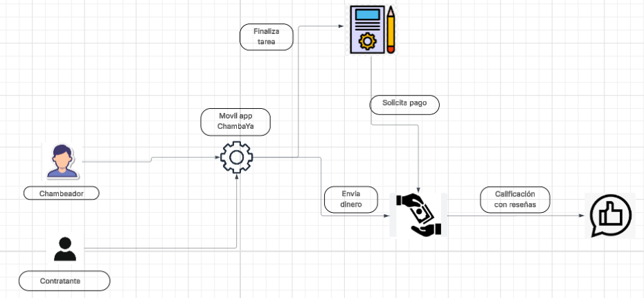

##### 2.5.1.2.3. Escenario de Inasistencia y Reapertura de Vacante
- El Contratante reporta la inasistencia del trabajador en el Application Context
- El Application Context cancela la postulación actual y aplica la penalidad correspondiente.
- El Application Context solicita al Communication Context el cierre del canal de chat temporal.
- El Application Context notifica al Job Context para reabrir la oferta y permitir nuevas postulaciones.

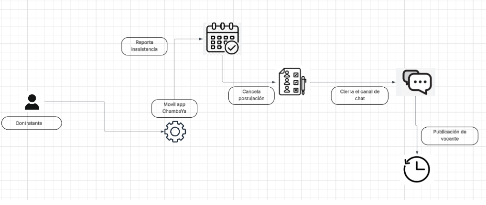

##### 2.5.1.3. Bounded Context Canvases

En esta sección, el equipo detalla cómo utilizó el Bounded Context Canvas, una herramienta visual del enfoque Domain-Driven Design (DDD) que permite definir y comprender los límites de cada contexto dentro de un sistema complejo. Su objetivo es lograr que todos los integrantes compartan una misma visión sobre qué representa cada contexto y cuál es su función. Para cada uno, se muestra su respectivo Canvas, acompañado de una breve descripción de su propósito y un resumen que sustenta su clasificación estratégica dentro del dominio de ChambaYA.

##### 2.5.1.3.1. IAM Context Canvas
El IAM Context tiene como propósito centralizar la gestión de identidades y el control de accesos de la plataforma ChambaYA. Se encarga de autenticar a los usuarios y proveer las credenciales y roles necesarios para asegurar que la interacción dentro del ecosistema sea segura y confiable.

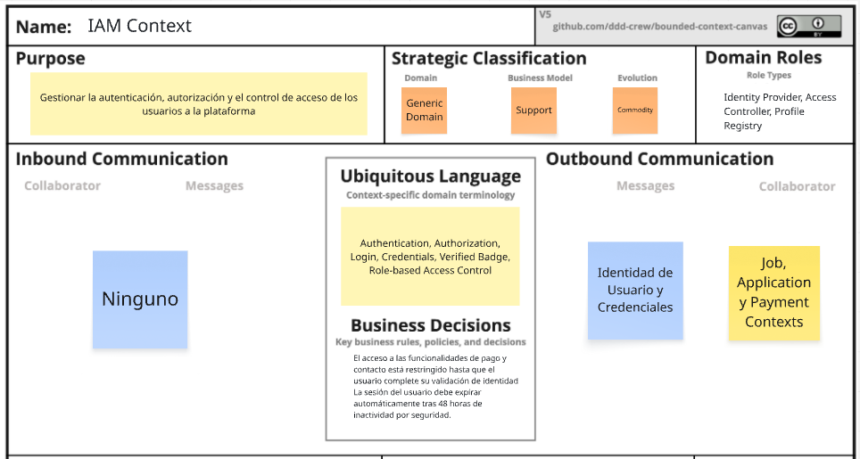

La función del IAM contextes permitir que tanto Chambeadores como Contratantes accedan al sistema de forma segura y organizada, lo cual es fundamental para la integridad de los datos. Al ser una funcionalidad de infraestructura necesaria para cualquier sistema moderno, este contexto apoya a los Core Domains (Job y Application) asegurando que solo usuarios verificados puedan participar en el flujo de valor.

##### 2.5.1.3.2. Job Context Canvas
Este contexto representa el núcleo de la oferta de valor de la plataforma. Su propósito es definir y gestionar todo el ciclo de vida del "Mini-job" (turno), desde su creación y publicación hasta su finalización o eventual reapertura.

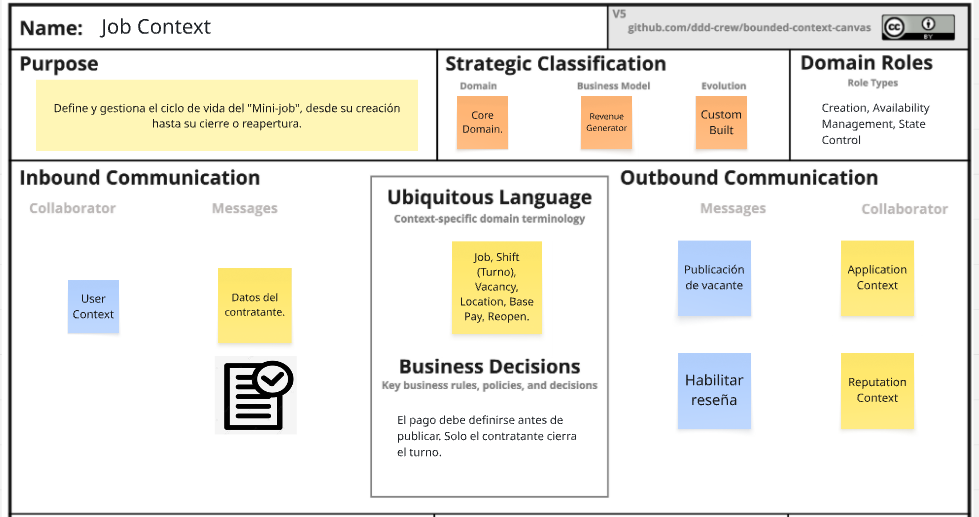

El Job Context es crucial para la existencia misma de la plataforma y por ello ha sido clasificado como un Core Domain. Este contexto permite a los Contratantes visualizar, definir y gestionar sus ofertas de turnos de forma organizada, lo que constituye la base de la actividad comercial de ChambaYA. Al controlar la disponibilidad y el estado operativo de los mini-jobs, este contexto es el motor principal para generar ingresos, sustentando la ventaja competitiva de la plataforma en el mercado de micro-empleos.

#### 2.5.1.3.3. Application Context Canvas

Este contexto actúa como el orquestador operativo del flujo de valor. Su propósito es gestionar la interacción entre Chambeadores y ofertas, manejando todo el proceso de postulación, la validación del "Match" y la gestión de incidencias de asistencia.

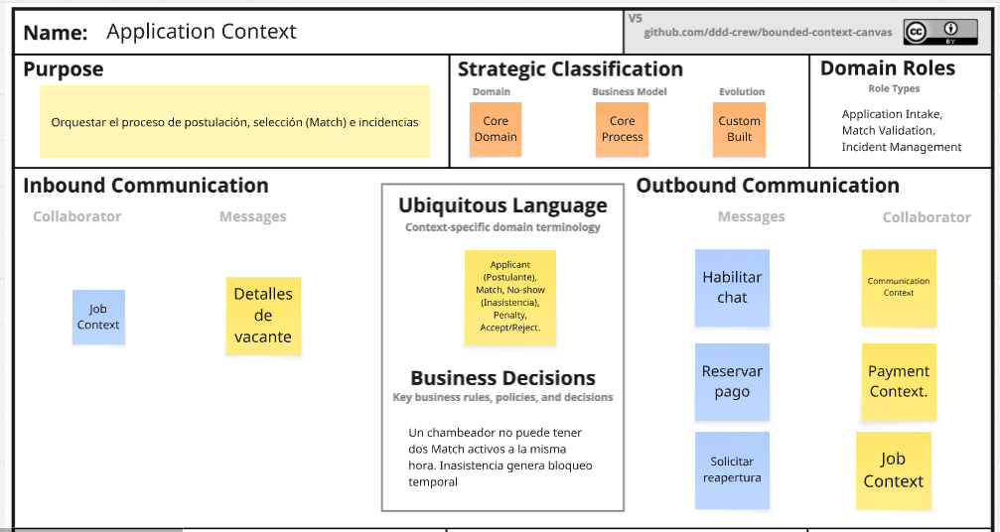

Consideramos al Application Context como el segundo pilar de nuestro Core Domain, ya que es fundamental para concretar el intercambio de valor entre las partes. Este contexto permite procesar postulaciones y asegurar el cumplimiento de asistencia mediante reglas de negocio específicas y penalidades organizadas, lo que contribuye directamente al éxito operativo y a la satisfacción de los usuarios. Representa la lógica de negocio única que orquesta el "Match", diferenciándonos de otras plataformas de empleo genéricas.

##### 2.5.1.3.5. Communication Context Canvas

Este contexto provee las herramientas de coordinación necesarias para que Contratantes y Chambeadores puedan comunicarse efectivamente tras un "Match", gestionando la mensajería temporal y las notificaciones push.

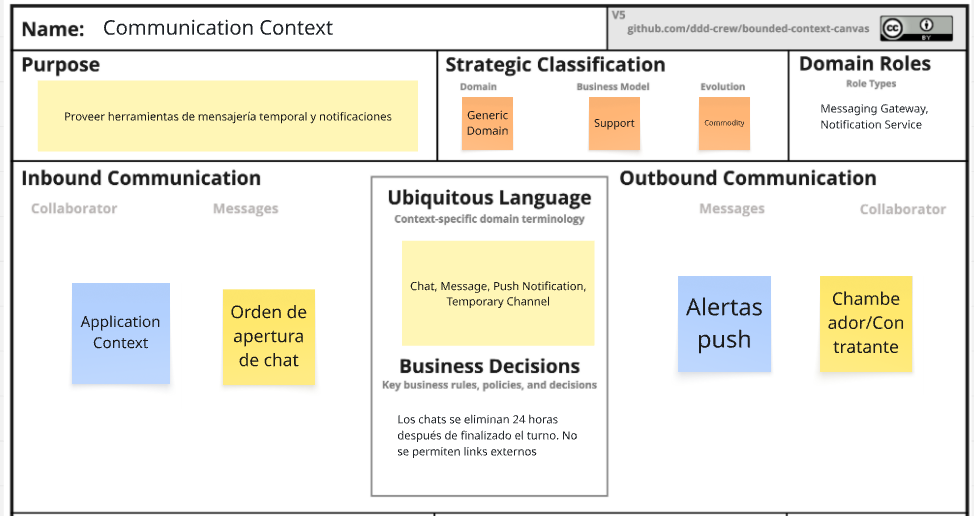

El Communication context permite a los usuarios coordinar detalles tras un "Match" de forma organizada, lo que contribuye directamente a la eficiencia operativa y a la experiencia del usuario. Además, actúa como un servicio de soporte necesario para las actividades clave del dominio.

##### 2.5.1.3.6. Reputation Context Canvas
Este contexto tiene como propósito construir y mantener la confianza dentro del ecosistema de ChambaYA, gestionando el sistema de reseñas y puntuaciones para cada usuario.

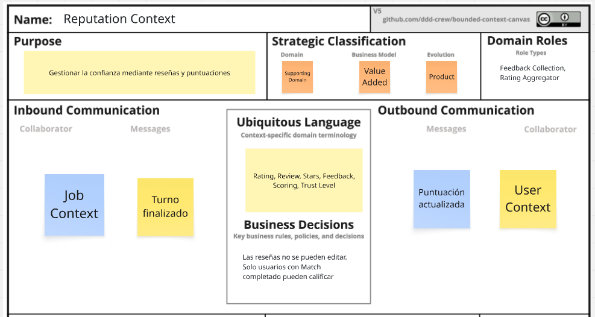

El Reputation context permite recopilar y visualizar feedback y promedios de calificación de forma organizada, lo que contribuye directamente a la confianza en la red y a la calidad del servicio. No constituye el núcleo principal, sino que apoya las actividades clave proporcionando información valiosa para la toma de decisiones por parte de los usuarios.

##### 2.5.1.3.4. Payment Context Canvas

Este contexto tiene como propósito facilitar el intercambio económico entre Contratantes y Chambeadores, gestionando la validación y el registro de las transacciones económicas realizadas vía billeteras digitales externas.

El Payment context permite validar y registrar las transacciones vía Yape/Plin de forma organizada, lo que contribuye directamente a la confianza y sostenibilidad económica de la plataforma. También apoya las actividades clave proporcionando una capa de validación financiera esencial para la gestión de pagos.

### 2.5.2. Context Mapping

Tras identificar los Bounded Contexts candidatos, el equipo procedió a definir las relaciones estructurales y los patrones de comunicación entre ellos. El objetivo fue minimizar el acoplamiento y asegurar que los cambios en contextos genéricos no afecten la lógica del Core Domain.

Análisis de Bounded Contexts

- IAM Context ↔ Job / Application / Payment Contexts
    - Relación: Upstream (IAM) / Downstream (Job/App/Pay)

    - Patrón: ACL (El sistema traduce los datos de identidad y roles del IAM a los modelos específicos de "Postulante" o "Contratante" de cada         contexto).

- Job Context ↔ Application Context
    - Relación: Upstream (Job) / Downstream (Application)

    - Patrón: Customer/Supplier (El Job Context actúa como proveedor de vacantes. Cualquier cambio en la estructura del turno debe ser coordinado       para no romper el flujo de postulaciones.
      
 
- Application Context ↔ Communication Context

    - Relación: Upstream (Application) / Downstream (Communication)

    - Patrón: PL (Published Language) (Application emite eventos como MatchConfirmed que Communication consume tal cual para habilitar canales de       chat).
 

- Application Context ↔ Payment Context

    - Relación: Upstream (Application) / Downstream (Payment)

    - Patrón: ACL (Payment traduce los datos de la postulación aceptada a su propio modelo de "Transacción" y "Reserva de Fondos" para Yape/Plin).
      

- Job Context ↔ Reputation Context

    - Relación: Upstream (Job) / Downstream (Reputation)

    - Patrón: ACL (Reputation protege su lógica de promedios y reseñas de los cambios constantes de estado en el ciclo de vida del turno).

- Communication / Reputation Contexts ↔ Usuarios

    - Relación: Upstream (Contexts) / Downstream (Users)

    - Patrón: OHS + PL (Estos contextos exponen sus capacidades como servicios abiertos para ser consumidos por las interfaces finales de               usuario).

### 2.5.3. Software Architecture

##### 2.5.3.1. Software Architecture Context Level Diagrams

---
El siguiente diagrama de contexto presenta una visión general de la aplicación móvil ChambaYA, identificando a los principales actores que interactúan con el sistema y los servicios externos involucrados.

Se observa cómo los usuarios, tanto contratantes como chambeadores, utilizan la aplicación para gestionar turnos y postulaciones. Asimismo, se muestran las integraciones con servicios externos como geolocalización, notificaciones y verificación de identidad, los cuales complementan el funcionamiento de la aplicación.

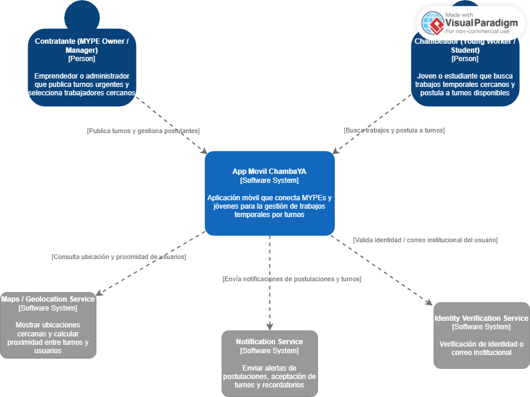

##### 2.5.3.2. Software Architecture Container Level Diagrams

---
El diagrama de contenedores describe la estructura interna de la aplicación móvil ChambaYA, mostrando los principales componentes que conforman el sistema y sus interacciones.

Se identifican las aplicaciones móviles para cada segmento, el backend que centraliza la lógica de negocio y la base de datos MongoDB para la persistencia de la información. Además, se evidencian las integraciones con servicios externos como mapas, notificaciones y validación de identidad.

Cabe resaltar que la lógica del negocio se encuentra encapsulada en el backend, el cual integra los distintos bounded contexts definidos en el diseño del dominio.

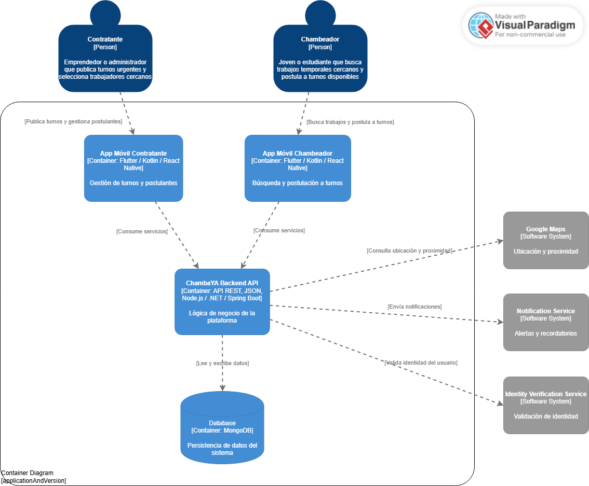

##### 2.5.3.3. Software Architecture Deployment Diagrams

El diagrama de despliegue muestra la distribución de los componentes de la aplicación móvil ChambaYA en la infraestructura tecnológica.

Se representan los dispositivos móviles desde los cuales los usuarios acceden a la aplicación, el servidor backend desplegado en la nube, la base de datos MongoDB y los servicios externos utilizados por el sistema. Este diagrama permite visualizar cómo los diferentes elementos se comunican entre sí en un entorno de ejecución real.

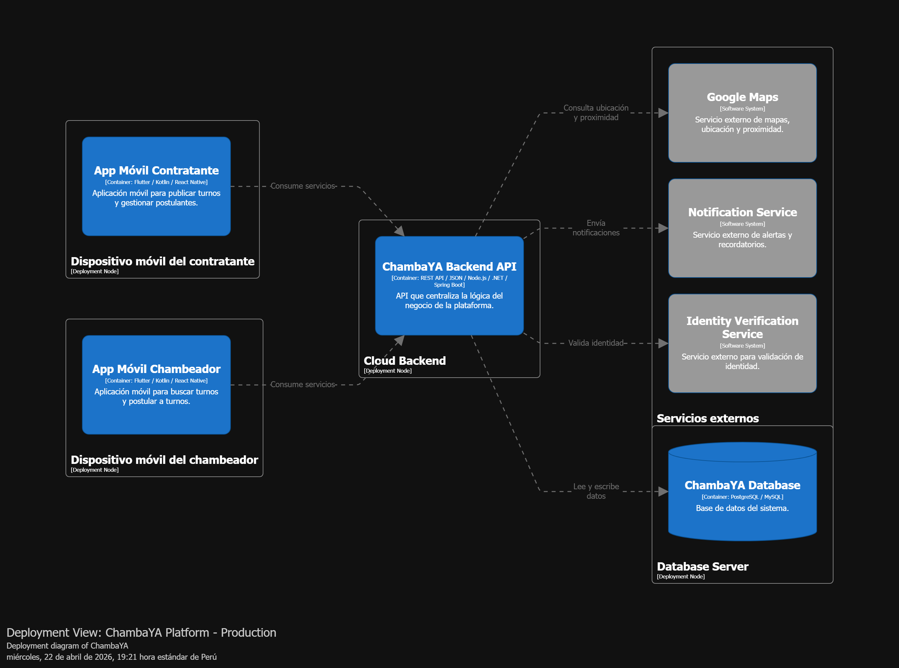

## 2.6. Tactical-Level Domain-Driven Design
### 2.6.1. Bounded Context: IAM Context
##### 2.6.1.1. Domain Layer
La Domain Layer del IAM Context encapsula toda la lógica de negocio relacionada con la gestión de identidad y acceso dentro de la plataforma ChambaYA. Este contexto maneja tanto a los jóvenes en búsqueda de empleo como a las MYPES contratantes, diferenciándolos mediante roles.

Se encarga de garantizar reglas como:

- Validación de datos (email, contraseña)
- Gestión de perfiles
- Asignación de roles
- Actualización de información del usuario

## Aggregates

| Nombre     | Descripción                                                                                                                                                                  | Atributos                                                                                                                                                                                                       | Métodos                                                                                                                            |
| ---------- | ---------------------------------------------------------------------------------------------------------------------------------------------------------------------------- | --------------------------------------------------------------------------------------------------------------------------------------------------------------------------------------------------------------- | ---------------------------------------------------------------------------------------------------------------------------------- |
| **`User`** | Aggregate Root que representa a un usuario del sistema; encapsula identidad, credenciales, relación con cuenta y rol de usuario, y operaciones invariantes sobre el usuario. | `Id: int`  `Name: string`  `Email: Email`     `Password: string`   `CreatedAt: DateTime`   `UpdatedAt: DateTime`   `AccountId: AccountId`   `UserRole: Role`   `UserRoleId: string` | `ChangePassword(string newPassword): void`   `UpdateProfile(Profile profile): void`   `ChangeRole(UserRole role): void` |

---

## Entities

| Nombre     | Descripción                                                                                               | Atributos                            | 
| ---------- | --------------------------------------------------------------------------------------------------------- | ------------------------------------ | 
| **`Profile`** | Entidad que representa la información extendida del usuario. | `UserId: string`    `Skills: string[]`   `Experience: string`   `PhotoURL: string` | 

---

## Value Objects

| Nombre                          | Descripción                                                                                      | Atributos / Valores                                                |
| ------------------------------- | ------------------------------------------------------------------------------------------------ | ------------------------------------------------------------------ |
| **`EUserRoles`**                | Define el tipo de usuario dentro del sistema.              | `JOB_SEEKER`, `EMPLOYER`                    |
| **`Email`**                | Representa un correo electrónico válido.              | `string validado (formato email)`                   |

---

## Services

| Nombre                    | Descripción                                                                        | Métodos                                                                                                                                                                                                                                          |
| ------------------------- | ---------------------------------------------------------------------------------- | ------------------------------------------------------------------------------------------------------------------------------------------------------------------------------------------------------------------------------------------------ |
| **`IUserCommandService`** | Define operaciones que modifican el estado del usuario. | `CreateUser(CreateUserCommand)`   `TUpdateUser(UpdateUserCommand)`   `ChangePassword(ChangePasswordCommand)`   `DeleteUser(DeleteUserCommand)`   `DeleteUser(DeleteUserCommand)` |
| **`IUserQueryService`** | Interfaz que expone consultas sobre usuarios. | `GetUserById(GetUserByIdQuery)`   `GetUserByEmail(GetUserByEmailQuery)`   `GetUsersByRole(GetUsersByRoleQuery)`   `GetAllUsersQuery(GetAllUsersQuery)` |

---

## Repositories

| Nombre                | Descripción                                             | 
| --------------------- | ------------------------------------------------------- | 
| **`IUserRepository`** | Define la persistencia para la entidad `User`. | 

---

##### 2.6.1.2. Interface Layer
En esta capa se publican los controladores de la API que permiten a clientes externos (aplicaciones web, móviles o sistemas integrados) interactuar con el dominio de IAM (Identity & Access Management). Los controladores actúan como orquestadores entre los Services y el Domain Layer: reciben solicitudes HTTP, validan y normalizan la entrada, mapean los payloads a Commands o Queries (CreateUserCommand, GetUserByIdQuery, ChangePasswordCommand) y delegan la ejecución a los IUserCommandService e IUserQueryService. Finalmente transforman los resultados del dominio en respuestas HTTP adecuadas (DTOs, códigos de estado, errores de validación), manteniendo la lógica de negocio fuera del controlador y asegurando que la capa permanezca delgada y enfocada en la traducción entre protocolo y modelo de dominio.

---

## Controllers

| Nombre                                | Descripción                                                                                                                                                                                                                                                                       | Endpoints (ejemplos)                                                                                                                                                                                                                                                                                                                                                                                                                                                                                                                                                                                                                                        |
| ------------------------------------- | --------------------------------------------------------------------------------------------------------------------------------------------------------------------------------------------------------------------------------------------------------------------------------- | ----------------------------------------------------------------------------------------------------------------------------------------------------------------------------------------------------------------------------------------------------------------------------------------------------------------------------------------------------------------------------------------------------------------------------------------------------------------------------------------------------------------------------------------------------------------------------------------------------------------------------------------------------------- |
| **UsersController**                   | Gestiona operaciones sobre usuarios. (`CreateUserCommand`, `UpdateUserCommand`, `ChangePasswordCommand`, `ChangeRoleCommand`, `GetUserByIdQuery`, etc.).    | `POST /api/users (CreateUserCommand)` `PUT /api/users/{id} (UpdateUserCommand)`  `DELETE /api/users/{id} (DeleteUserCommand)`  `GET /api/users/{id} (GetUserByIdQuery)`  `GET /api/users/by-email/{email} (GetUserByEmailQuery)`  `GET /api/users/by-role/{role} (GetUsersByRoleQuery)`  `GET /api/users?page={page}&size={size} (GetAllUsersQuery)`  `POST /api/users/{id}/change-password (ChangePasswordCommand)` `POST /api/users/{id}/role (ChangeRoleCommand) `|

---

## Resources

Los Resources representan los contratos que la API expone o acepta. No deben exponer información sensible en respuestas.

| Resource                   | Esquema (ejemplos)                                                                                                                                                    |
| -------------------------- | --------------------------------------------------------------------------------------------------------------------------------------------------------------------- |
| **CreateUserResource**     | `json { "name": "Juan Perez", "email": "juan@gmail.com", "password": "123456", "role": "JOB_SEEKER" } `                          |
| **UserResource**           | `json { "id": 1, "name": "Juan Perez", "email": "juan@gmail.com", "role": "JOB_SEEKER", "createdAt": "2026-04-22T12:00:00Z" } ` |
| **RoleResource**           | `json { "Id": "role-uuid", "Name": "Admin" } `                                                                                                                        |
| **ChangePasswordResource** | `json { "CurrentPassword": "alP@ss", "NewPassword": "NewP@ssw0rd#!" } `                                                                                               |

---

## Assemblers

Los Assemblers encapsulan la transformación entre Resources, Commands/Queries y Entities/DTOs. La capa de presentación (controllers) utiliza los assemblers para mantener la lógica de dominio fuera del controlador.

- `CreateUserResourceToCommandAssembler` convierte un `CreateUserResource` en un `CreateUserCommand`
- `UserEntityToUserResourceAssembler` convierte un `User` en un `UserResource`
- `RoleEntityToRoleResourceAssembler` convierte un `Role` en un `RoleResource`
- `ChangePasswordResourceToCommandAssembler` convierte un `ChangePasswordResource` en un `ChangePasswordCommand`

---

##### 2.6.1.3. Application Layer
La Application Layer coordina la ejecución de comandos y consultas, actuando como intermediario entre la Interface Layer y la Domain Layer. 

---

## Command Services

Los **Command Services** se encargan de **procesar acciones que modifican el estado del dominio** (creación, actualización, borrado o cambios de estado), relativas al agregado `User` y a la gestión de roles y credenciales. Su responsabilidad incluye validar los Commands, orquestar llamadas a los **Domain Services** y a los **Repositories**.

|                 Nombre | Descripción                                               | Commands manejados                                                                                  |
| ---------------------: | --------------------------------------------------------- | --------------------------------------------------------------------------------------------------- |
| **UserCommandService** | Gestiona operaciones que modifican el estado del usuario (`User`).    | `CreateUserCommand, UpdateUserCommand, ChangePasswordCommand, ChangeRoleCommand, DeleteUserCommand` |
| **RoleCommandService** | Gestiona operaciones sobre la entidad `Role` (si aplica). | `CreateRoleCommand, UpdateRoleCommand, DeleteRoleCommand`                                           |
| **AuthCommandService** | Orquesta flujos relacionados con credenciales y sesiones. | `LoginCommand, LogoutCommand, RefreshTokenCommand, ForgotPasswordCommand, ResetPasswordCommand`     |

---

## Query Services
Los **Query Services** están orientados a **recuperar datos del dominio sin producir efectos colaterales**. Reciben **Queries**, consultan los **Repositories** o vistas optimizadas, y devuelven **Resources** listos para la capa de presentación. Mantienen la capa de aplicación ligera y evitan que los **Controller** conozcan detalles de persistencia o modelado del dominio.

|               Nombre | Descripción                                         | Queries manejadas                                                              |
| -------------------: | --------------------------------------------------- | ------------------------------------------------------------------------------ |
| **UserQueryService** | Gestiona y exponeconsultas sobre usuarios.                    | `GetUserByIdQuery, GetUserByEmailQuery, GetUsersByRoleQuery, GetAllUsersQuery` |
| **RoleQueryService** | Expone consultas sobre roles.                       | `GetRoleByIdQuery, GetAllRolesQuery`                                           |
| **AuthQueryService** | Consultas relacionadas con estado de sesión/tokens. | `ValidateTokenQuery, GetAuthMetadataQuery`                                     |

---

##### 2.6.1.4. Infrastructure Layer

La Infrastructure Layer se encarga de la persistencia de datos, así como de la integración con servicios externos necesarios para el funcionamiento del User Context. Esta capa implementa las interfaces definidas en el dominio (como IUserRepository) y adapta el modelo de dominio a tecnologías concretas como bases de datos, servicios de autenticación y almacenamiento de archivos.

Además, encapsula detalles técnicos como:

- ORM (por ejemplo, Entity Framework, Hibernate, etc.)
- Integraciones externas (Firebase, Cloudinary)
- Transformaciones entre entidades de dominio y modelos de persistencia

---

## Repositories

| Nombre                                            | Descripción                                                                                                                                                                                                                                                                                                | Implementación (ejemplos de métodos)                                                                                                                                                                                                                                                                                                                                                                                                                                                                    |
| ------------------------------------------------- | ---------------------------------------------------------------------------------------------------------------------------------------------------------------------------------------------------------------------------------------------------------------------------------------------------------- | ---------------------------------------------------------------------------------------------------------------------------------------------------------------------------------------------------------------------------------------------------------------------------------------------------------------------------------------------------------------------------------------------------------------------------------------------------------------------------------------------------------------------------------------------------------------------------------------------------------------------------------------------------------------------------------------- |
| **UserRepository**  | Responsable de la persistencia y recuperación del agregado `User`. Traduce entre el modelo de dominio y la base de datos. Implementa la interfaz `IUserRepository`.  | - `Task<User?> GetByIdAsync(int id)` → Obtiene un usuario por ID.  - `Task<IEnumerable<User>> GetAllAsync()` → Retorna todos los usuarios.  - `Task<User?> GetByEmailAsync(string email)` → Busca usuario por correo.  - `Task AddAsync(User user)` → Inserta un nuevo usuario.  - `Task UpdateAsync(User user)` → Actualizar usuario (estado, rol, credenciales hashed). - `Task DeleteAsync(int id)` → Eliminar o marcar como inactivo.|

---

## External Authentication with Google Intregation

| Nombre                | Descripción                                                                                                                                                                                                                                    | Implementación (ejemplos)                                                                                                                                                                                                                                                        |
| --------------------- | ---------------------------------------------------------------------------------------------------------------------------------------------------------------------------------------------------------------------------------------------- | ------------------------------------------------------------------------------------------------------------------------------------------------------------------------------------------------------------------------------------------------------------------------------------------------------------------------------------------------------------------------------------------------------------------------------------------------------------------------------------------------------------------------------------------------------------------------------------------------------------------------------------------------------------------------------------------------------------------------------------------------------------------------------------------------------------------------------------------------------------------------------------------------------------------------------------------------------------------------------------------------------------------------------------------------------------------------------------------------------------------------------------------------------------------------------------------------------------------------------------------------------------------------------------------------------------------------------------------------------------------------------------------------------------------------------------------------------------------------------------------------------------------------------------------------------------- |
| **GoogleAuthAdapter** | Adaptador responsable de la integración con Google Identity (OAuth2 / OpenID Connect). Se encarga de iniciar flujos de autenticación, validar ID tokens, obtener la dirección de correo verificada y gestionar el enlace/provisión de cuentas. | - `string GetAuthorizationUrl(string state, string redirectUri, string[] scopes, bool promptConsent = false)` → Construye la URL de autorización para redirigir al cliente (incluye `state`, `nonce`, scopes `openid profile email`). - `Task<ExternalAuthResult> HandleCallbackAsync(string code, string redirectUri)` → Intercambia el `code` por tokens (access\_token, id\_token, refresh\_token), valida el `id_token` (firma, aud, exp, nonce) y devuelve información básica del usuario (email verificado, name, picture, sub). - `Task<bool> VerifyIdTokenAsync(string idToken)` → Verifica la firma y reclamaciones del `id_token` usando las claves públicas de Google (JWKS). - `Task<UserProvisionResult> ProvisionOrLinkUserAsync(ExternalAuthResult externalUser)` → Crea o enlaza un usuario local en IAM usando el email/federated id provisto. Maneja conflictos (email ya en uso) y devuelve el usuario local y el estado de provisión (creado/enlazado). - `Task RevokeRefreshTokenAsync(string refreshToken)` → Revoca credenciales cuando el usuario desconecta la cuenta.|
| **CloudinaryAdapter** | Servicio para almacenamiento de imágenes de perfil. | - `Task<bool> VerifyTokenAsync(string token)` → Verifica validez del token.  - `Task<string> UploadImageAsync(Stream image)` → Sube imagen y retorna URL.  - `Task DeleteImageAsync(string imageUrl)` → Elimina imagen del storage. |

##### 2.6.1.5. Bounded Context Software Architecture Component Level Diagrams
**Diagrama de componentes: Autenticación**

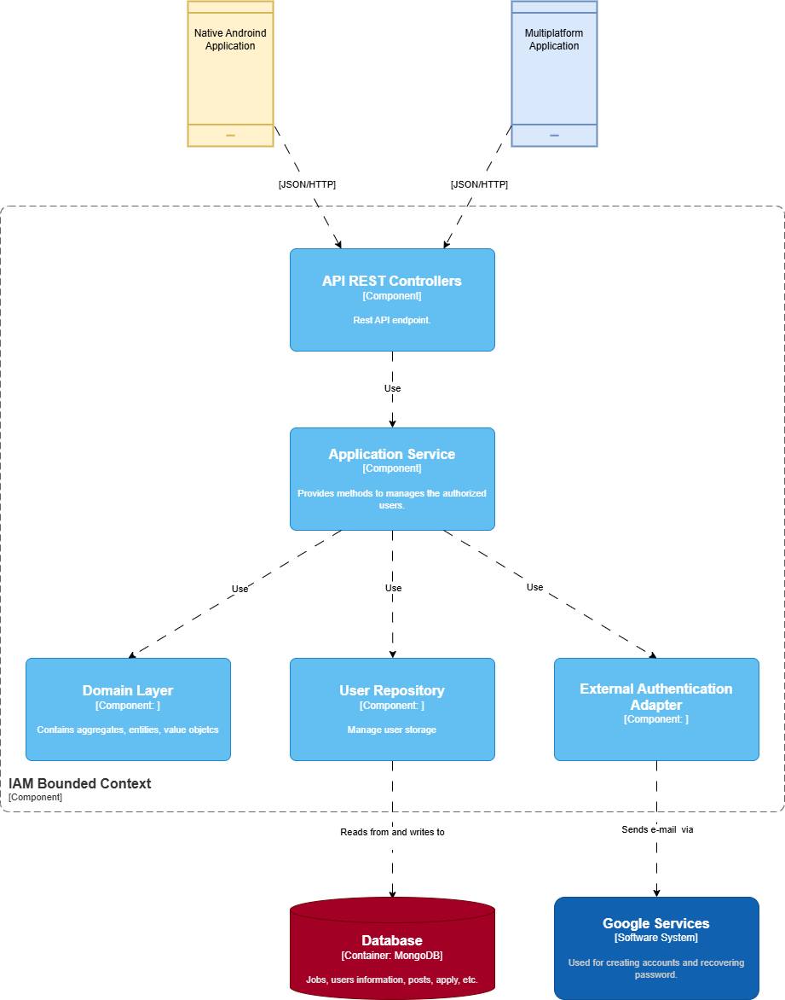

En la imagen se aprecia el diagrama de componentes para el contexto de autenticación. En este diagrama, se muestra la relación para almacenar la información de los usuarios en la base de datos con el uso de un repositorio para dicha entidad. Además, se evidencia el uso del servicio externo de Google Services para la recuperación de contraseñas y creación sencilla con una cuenta existente de Google.

##### 2.6.1.6. Bounded Context Software Architecture Code Level Diagrams
En esta sección, se muestran y explican los diagramas de clases y de base de datos relacionados al contexto delimitado sobre la autenticación de los usuarios.
###### 2.6.1.6.1. Bounded Context Domain Layer Class Diagrams
A continuación, se muestra el diagrama de clases del contexto presente donde se resalta la clase de usuario que es la más importante de este contexto.

**Clase principal: User**
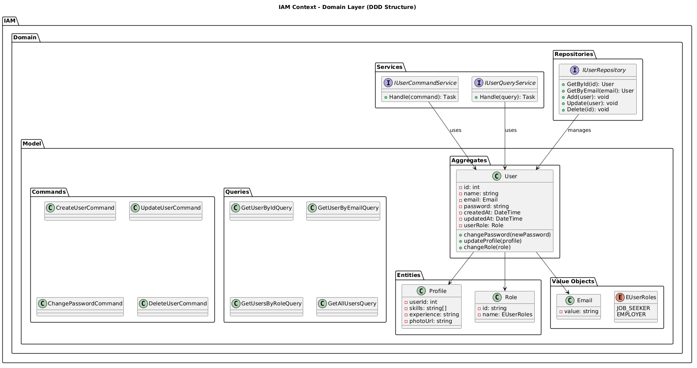

En la imagen se puede visualizar a la clase de usuario que contiene atributos como nombre de usuario, contraseña y correo electrónico; atributos relacionados a la auditoría como fecha de creación y de modificación. Además, se visualiza el atributo de identificador de cuenta que hace referencia a la cuenta general de la que forma parte este usuario.

###### 2.6.1.6.2. Bounded Context Database Design Diagram
A continuación, se muestra y explica el diagrama de documentos relacionado a la base de datos no relacional que se usará. Este diagrama de documentos refleja como la información del contexto presente persiste.

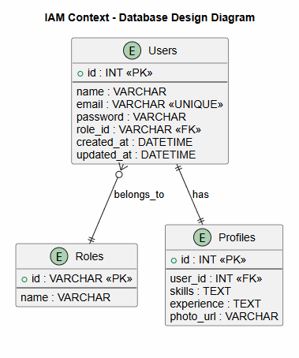

En esta imagen se visualiza que una base de datos no relacional para el contexto de autenticación persisitiría con la información de la entidad principal que son los usuarios y otra entidad relacionada a los roles de los cuales cada cuenta solo puede tener uno al mismo tiempo.

### 2.6.2. Bounded Context: Application Context
##### 2.6.2.1. Domain Layer
La capa Application Context (Enrollment) constituye el motor transaccional del sistema, centralizando toda la lógica de negocio relacionada con las postulaciones de los jóvenes (Chambeadores) a los turnos de emergencia publicados por las MYPEs (Contratantes).
En esta capa se definen las reglas y comportamientos propios del emparejamiento: la creación de la postulación, las transiciones de estado (aceptado, rechazado, cancelado) y las políticas que detonan el "Match" definitivo.

**Aggregates**

| Nombre     | Descripcion                                                                                                                                                                          | Atributos                                                                                                                                                                     | Metodos                                                                                 |
|------------|--------------------------------------------------------------------------------------------------------------------------------------------------------------------------------------|-------------------------------------------------------------------------------------------------------------------------------------------------------------------------------|-----------------------------------------------------------------------------------------|
| Enrollment | Aggregate Root que representa la postulación de un usuario a un turno; encapsula la identidad, los estados del proceso y las operaciones invariantes que determinan si hay un Match  | Id: UUID      TurnoId: UUID     Chambeador: UUID      Status: EnrollmentStatus     CreatedAt: Datetime     UpdatedAt: DateTime    | Accept(): void     Reject(): void     CancelByChambeador: void      | 

**Value Objects**

| Nombre           | Descripcion                                                                                           | Atributos/ Valores                             |
|------------------|-------------------------------------------------------------------------------------------------------|------------------------------------------------|
| EnrollmentStatus | Enumeración que modela los estados posibles por los que puede transitar una postulación en el sistema | Pending, Accepted, Rejected, Cancelled         |
| Location         |  Objeto de valor inmutable que representa las coordenadas geográficas, utilizado para validar cercanía antes de la postulación                                                                                                     | Latitud : double     Longitude: double |

**Services**

| Nombre                    | Descripcion | Metodos                                                                                                                                                                                                                               |
|---------------------------|-------------|---------------------------------------------------------------------------------------------------------------------------------------------------------------------------------------------------------------------------------------|
| IEnrollmentCommandService |  Interfaz que define las operaciones de negocio (comandos) para gestionar los cambios de estado en las postulaciones          | Task<Enrollment> Handle(SubmitEnrollmentCommand command)     Task Handle(AcceptEnrollmentCommand command)      Task Handle(RejectEnrollmentCommand command)     Task Handle(CancelEnrollmentCommand command)  |
| IEnrollmentQueryService   | Interfaz que expone consultas (lecturas) sobre las postulaciones para las vistas de la MYPE y el Chambeador            | Task<EnrollmentDto?> Handle(GetEnrollmentByIdQuery query)     Task<IEnumerable<EnrollmentDto>> Handle(GetActiveEnrollmentsQuery query)     Task<IEnumerable<EnrollmentDto>> Handle(GetPostulantesByTurnoQuery query)  |

**Repositories**

| Nombre                | Descripcion |
|-----------------------|-------------|
| IEnrollmentRepository |  Define la persistencia (contrato de base de datos) para la entidad (Aggregate Root) Enrollment           |

##### 2.6.2.2. Interface Layer

En esta capa se publican los controladores de la API REST que permiten a las aplicaciones móviles de los usuarios (Dueños de MYPEs y Jóvenes Chambeadores) interactuar con el dominio de postulaciones (Enrollment). Los controladores actúan como orquestadores entre los recursos web y el Domain Layer: reciben solicitudes HTTP, validan la entrada de datos (como el ID del turno y las coordenadas GPS), mapean los payloads a Commands o Queries (ej. SubmitEnrollmentCommand, GetPostulantesByTurnoQuery) y delegan la ejecución a IEnrollmentCommandService e IEnrollmentQueryService. Finalmente, transforman los resultados del dominio en respuestas HTTP adecuadas, asegurando que la lógica de negocio permanezca protegida y la capa solo se encargue de la traducción del protocolo web.

**Controllers**

| Nombre                 | Descripcion                                                                                                                                         | Endpoints(Ejemplo)                                                                                                                                                                                                                                                                                                                                                                                                               |
|------------------------|-----------------------------------------------------------------------------------------------------------------------------------------------------|----------------------------------------------------------------------------------------------------------------------------------------------------------------------------------------------------------------------------------------------------------------------------------------------------------------------------------------------------------------------------------------------------------------------------------|
| EnrollmentsController  | Expone las operaciones para gestionar el ciclo de vida de las postulaciones: envío por parte del joven, y aceptación/rechazo por parte de la MYPE.  | PUT /api/v1/enrollments{id}/accept (AcceptEnrollmentCommand)    PUT /api/v1/enrollments{id}/reject (RejectEnrollmentCommand)    PUT /api/v1/enrollments{id}/cancel (CancelEnrollmentCommand)     GET /api/v1/enrollment/{id} (GetEnrollmentCommand)      GET /api/v1/enrollments/{id} (GetEnrollmentByIdQuery)     GET /api/v1/turnos/{turnoId}/enrollments (GetPostulantesByTurnoQuery) |

**Resources**

| Resource                 | Esquema(ejemplos)                                                                                                                                          |
|--------------------------|------------------------------------------------------------------------------------------------------------------------------------------------------------|
| SubmitEnrollmentResource | { "TurnoId": "550e8400-e29b-41d4...", "ChambeadorId": "123e4567-e89b-12d3...", "Latitude": -12.0463, "Longitude": -77.0427 }                               |
| EnrollmentResource       | { "Id": "990e8400-a29b-41d4...", "TurnoId": "550e8400-e29b...", "ChambeadorId": "123e4567...", "Status": "ACCEPTED", "CreatedAt": "2026-04-20T18:30:00Z" } |
| StatusUpdateResource     | { "Reason": "Perfil encaja perfectamente con la urgencia." }                                                                                               |

##### 2.6.2.3. Application Layer
La capa de Aplicación (Application Layer) actúa como el orquestador principal de los casos de uso (Use Cases) del Bounded Context de postulaciones (Application Context). Esta capa no contiene reglas de negocio core —estas pertenecen exclusivamente al Domain Layer— sino que coordina el flujo de trabajo: recibe las intenciones del usuario a través de Commands o Queries, interactúa con los repositorios para recuperar el Aggregate Root (Enrollment), invoca sus comportamientos de dominio y persiste los cambios.

Además, esta capa es responsable de gestionar la publicación de los Eventos de Dominio (Domain Events) hacia el exterior, como notificar al sistema de Chat cuando una MYPE acepta a un joven (Match).

**Command Services**

Estos manejadores implementan la lógica de orquestación transaccional. Reciben el comando, buscan las entidades involucradas, ejecutan la acción y guardan el nuevo estado.

| Nombre                          | Descripcion                                                                                                                                                                        | Commans manejados       |
|---------------------------------|------------------------------------------------------------------------------------------------------------------------------------------------------------------------------------|-------------------------|
| SubmitEnrollmentCommandHandler  | Orquesta la creación de una nueva postulación. Verifica mediante servicios externos la ubicación (si es necesario), instancia un nuevo Enrollment y lo persiste en el repositorio. | SubmitEnrollmentCommand |
| AcceptEnrollmentCommandHandler  | Recupera la postulación por su ID, invoca el método Accept() del Aggregate Root (generando el Match) y persiste el cambio. Dispara el evento de dominio EnrollmentAccepted.        | AcceptEnrollmentCommand |
| RejectEnrollmentCommandHandler  | Recupera la postulación, invoca el método Reject() para declinar al chambeador y libera el estado en la base de datos.                                                             | RejectEnrollmentCommand |
| CancelEnrollmentCommandHandler  | Permite al chambeador retirar su postulación antes de ser aceptado. Invoca CancelByChambeador() en la entidad y actualiza el repositorio.                                          | CancelEnrollmentCommand |

**Query Services**

Encargados de procesar las consultas de manera óptima y directa, devolviendo objetos de transferencia (DTOs) sin cargar la lógica pesada del Aggregate Root.

| Nombre                            | Descripcion                                                                                                              | Queries Manejdas           |
|-----------------------------------|--------------------------------------------------------------------------------------------------------------------------|----------------------------|
| GetEnrollmentByIdQueryHandler     | Busca y devuelve el detalle completo de una postulación específica utilizando su ID.                                     | `GetEnrollmentByIdQuery`    |
| GetPostulantesByTurnoQueryHandler | Obtiene la lista completa de chambeadores (postulantes) que han aplicado a un turno específico publicado por la MYPE.    | `GetPostulantesByTurnoQuery` |
| GetActiveEnrollmentsQueryHandler  | Devuelve todas las postulaciones que un joven específico mantiene activas (en estado Pending o Accepted) en el sistema.  | `GetActiveEnrollmentsQuery`  |

**Data Transfer Objects (DTOs)**

Objetos inmutables generados por la Application Layer para transferir datos hacia la Interface Layer, asegurando que las entidades de dominio puras no se expongan directamente a los controladores web.

| Nombre                | Descripcion                                                                                                                               |
|-----------------------|-------------------------------------------------------------------------------------------------------------------------------------------|
| EnrollmentDto         | Representación plana y de solo lectura de una postulación, que incluye el Id, TurnoId, ChambeadorId, y el Status actual.                  |
| PostulanteSummaryDto  | Versión resumida de la postulación optimizada para la vista de lista de la MYPE, mostrando el estado actual y el momento de postulación.  |

##### 2.6.2.4. Infrastructure Layer
La Infrastructure Layer se encarga de la persistencia de datos, de las integraciones externas y de proporcionar los adaptadores y utilidades necesarios para que la Application Layer y la Domain Layer funcionen. En el contexto del bounded context de Application (Enrollment), esta capa implementa los repositories para guardar las postulaciones, los adaptadores de geolocalización (Google Maps API), los publicadores de eventos para la comunicación asíncrona (Message Broker) y cualquier componente dependiente de tecnología concreta.

**Repositories**

| Nombre                | Descripcion                                                                                                                                                                                                                                                                                                          | Implementación (ejemplos de métodos)                                                                                                                                                                                                                                                                                                                                                                                                                                                                                                                                                                                                                                               |
|-----------------------|----------------------------------------------------------------------------------------------------------------------------------------------------------------------------------------------------------------------------------------------------------------------------------------------------------------------|------------------------------------------------------------------------------------------------------------------------------------------------------------------------------------------------------------------------------------------------------------------------------------------------------------------------------------------------------------------------------------------------------------------------------------------------------------------------------------------------------------------------------------------------------------------------------------------------------------------------------------------------------------------------------------|
| EnrollmentRepository  | Responsable de la persistencia y recuperación de los agregados Enrollment. Traduce entre la representación de persistencia (tablas relacionales) y los objetos del dominio. También se encarga de búsquedas optimizadas para listar las postulaciones de un turno o de un joven. (implementa IEnrollmentRepository)  | - Task<Enrollment?> GetByIdAsync(UUID id) → Obtener la postulación por su identificador único.     - Task<IEnumerable<Enrollment>> GetByTurnoIdAsync(UUID turnoId) → Obtener todas las postulaciones recibidas para un turno específico publicado por la MYPE.     - Task<IEnumerable<Enrollment>> GetActiveByChambeadorIdAsync(UUID chambeadorId) → Obtener las postulaciones pendientes o aceptadas de un joven     - Task AddAsync(Enrollment enrollment) → Insertar una nueva postulación en la base de datos.     - Task UpdateAsync(Enrollment enrollment) → Actualizar el estado de la postulación (ej. transición de PENDING a ACCEPTED).  |

**External Services & Event Publishing**

| Nombre                    | Descripcion                                                                                                                                                                                                                                            | Implementación (ejemplos de métodos)                                                                                                                                                                                                                                                                                                                                                                     |
|---------------------------|--------------------------------------------------------------------------------------------------------------------------------------------------------------------------------------------------------------------------------------------------------|----------------------------------------------------------------------------------------------------------------------------------------------------------------------------------------------------------------------------------------------------------------------------------------------------------------------------------------------------------------------------------------------------------|
| GoogleMapsAdapter         | Adaptador responsable de la integración con la API de Google Maps (Distance Matrix / Geocoding). Se encarga de validar las coordenadas enviadas por el dispositivo móvil y calcular la distancia real entre el joven postulante y el local de la MYPE. | - Task<double> CalculateDistanceAsync(Location origin, Location destination) → Llama a la API para obtener la distancia real de viaje (en km o metros) entre dos coordenadas.     - Task<bool> ValidateLocationWithinRadiusAsync(Location applicantLoc, Location turnoLoc, double maxRadius) → Verifica si el joven se encuentra dentro de la zona permitida para postular al turno de urgencia. |
| EnrollmentEventPublisher  | Componente encargado de publicar los eventos de dominio (Domain Events) hacia un bus de mensajes (ej. RabbitMQ, Apache Kafka, o eventos en memoria). Es vital para notificar a otros Bounded Contexts sin acoplarlos directamente.                     | - Task PublishEnrollmentAcceptedAsync(EnrollmentAcceptedEvent domainEvent) → Serializa y envía el evento indicando que hubo un "Match", para que el contexto de Colaboración habilite el chat entre la MYPE y el joven.     - Task PublishEnrollmentCancelledAsync(EnrollmentCancelledEvent domainEvent) → Envía un evento si el joven cancela, para que el sistema libere el cupo en el turno.  |

##### 2.6.2.5. Bounded Context Software Architecture Component Level Diagrams

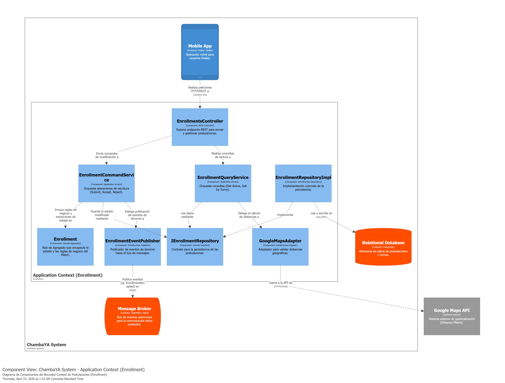

### 2.6.2.6. Bounded Context Software Architecture Code Level Diagrams

###### 2.6.2.6.1. Bounded Context Domain Layer Class Diagrams

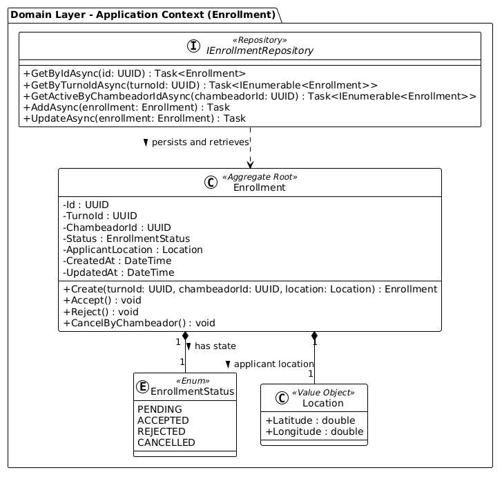

###### 2.6.2.6.2. Bounded Context Database Design Diagram

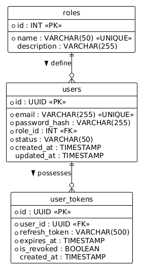

### 2.6.3. Bounded Context: Job Context
##### 2.6.3.1. Domain Layer

La capa Job Context constituye el núcleo encargado de la fase de ejecución del trabajo. A diferencia del Application Context (que maneja el proceso de selección), este contexto asume el control una vez que existe un "Match" confirmado. Centraliza la lógica de negocio relacionada con la coordinación en tiempo real (habilitación de canales de chat), el seguimiento de asistencia, el reporte de incidencias (inasistencias) y las reglas de reapertura de turnos de emergencia.

**Aggregates**
| Nombre | Descripcion                                                                                                                                                                                                | Atributos                                                                                                                                                                    | Metodos                                                                                                  |
|--------|------------------------------------------------------------------------------------------------------------------------------------------------------------------------------------------------------------|------------------------------------------------------------------------------------------------------------------------------------------------------------------------------|----------------------------------------------------------------------------------------------------------|
| Shift  | Aggregate Root principal que representa el turno de trabajo en su fase de ejecución. Encapsula los participantes, el estado en vivo de la jornada, el canal de comunicación y las incidencias reportadas.  | `Id: UUID`     `ContratanteId: UUID`     `ChambeadorId: UUID `    `ChatChannelId: string`     `Status: ShiftExecutionStatus `     `ScheduledTime: DateTime` | `EnableChatChannel(string channelId): void`    `ReportAbsence(string reason): void`     `Reopen(): void` |

**Value Object**

| Nombre               | Descripcion                                                                                                                                 | Atributos/Valores                                                                                                 |
|----------------------|---------------------------------------------------------------------------------------------------------------------------------------------|-------------------------------------------------------------------------------------------------------------------|
| ShiftExecutionStatus | Enumeración que modela los estados físicos del turno durante el Job Context.                                                                | `Scheduled`, `InProgress`, `Completed`, `CancelledDueToAbsence`, `Reopened`                                       |
| Incident             | Objeto de valor que encapsula los detalles de un problema reportado (ej. Inasistencia), usado para disparar las políticas de penalización.  | `ReportedBy: UUID`     `Type: String`    `Description: string`    `ReportedAt: DateTime ` |

**Services**

| Nombre               | Descripcion                                                                                                                       | Metodos                                                                                                                                                                                                      |
|----------------------|-----------------------------------------------------------------------------------------------------------------------------------|--------------------------------------------------------------------------------------------------------------------------------------------------------------------------------------------------------------|
| IShiftCommandService | Interfaz que define las operaciones de negocio (comandos azules en tu diagrama) para alterar el estado de la ejecución del turno. | `Task Handle(EnableChatCommand command) `   `Task Handle(SendReminderCommand command) `   `Task Handle(ReportAbsenceCommand command) `    `Task Handle(ReopenShiftCommand command) ` |
| IShiftQueryService   | Interfaz que expone consultas sobre la ejecución de los turnos para alimentar los Read Models (post-its verdes).                  | `Task<MatchScreenDto> Handle(GetMatchDetailsQuery query)`    `Task<AttendanceReportDto> Handle(GetAttendanceReportQuery query)`                                                              |

**Repositories**

| Nombre            | Descripcion                                                                                    |
|-------------------|------------------------------------------------------------------------------------------------|
| IShiftRepository  | Define la persistencia para la entidad (Aggregate Root) `Shift`  durante la fase de ejecución. |

**Domain Policies**

- Política de Penalidad Automática: "Siempre que se reporta una incidencia por inasistencia (No-Show), entonces emitir un evento de dominio para aplicar una penalidad automática en el Sistema de Reputación del Chambeador."

##### 2.6.3.2. Interface Layer

En esta capa se exponen los controladores y manejadores que permiten a los clientes externos (la aplicación móvil de ChambaYA) interactuar con la fase de ejecución de los turnos. Aquí se gestionan peticiones que requieren baja latencia, como la habilitación del chat y el reporte urgente de asistencia o incidencias. Estos controladores no contienen lógica de negocio; su única función es recibir el JSON de la app, mapearlo a Commands o Queries y delegar la responsabilidad a la capa de Aplicación.

**Controllers**

| Nombre                    | Descripcion                                                                                                                                | Endpoints                                                                                                                                                                                                                                                                                 |
|---------------------------|--------------------------------------------------------------------------------------------------------------------------------------------|-------------------------------------------------------------------------------------------------------------------------------------------------------------------------------------------------------------------------------------------------------------------------------------------|
| ShiftExecutionController  | Expone las operaciones para gestionar la ejecución de un turno que ya ha hecho "Match", incluyendo canales de comunicación e incidencias.  | `POST /api/v1/shifts/{id}/chat/enable` (EnableChatCommand)     `POST /api/v1/shifts/{id}/reminders`(SendReminderCommand)      `POST /api/v1/shifts/{id}/absences ` (ReportAbsenceCommand)     `POST /api/v1/shifts/{id}/reopen` (ReopenShiftCommand)     `GET /api/v1/shifts/{id}/match-details`(GetMatchDetailsQuery) |

**Resources (DTO)**

| Resource              | Esquema                                                                                                                         |
|-----------------------|---------------------------------------------------------------------------------------------------------------------------------|
| EnableChatResource    | `{ "TurnoId": "550e8400-e29b...", "ContratanteId": "123e4567...", "ChambeadorId": "987e6543..." } `                             |
| ReportAbsenceResource | `{ "ReportedBy": "123e4567...", "Reason": "El chambeador no se presentó a la hora acordada y no responde el teléfono." } `      |
| MatchDetailsResource  | `{ "ShiftId": "550e8400...", "Status": "InProgress", "ChatChannelId": "chan_98765", "ScheduledTime": "2026-04-20T18:30:00Z" } ` |

##### 2.6.3.3. Application Layer

La capa de Aplicación orquesta el flujo de trabajo para la ejecución del turno. Recibe las intenciones del usuario (Commands) o las peticiones de datos (Queries) desde la Interface Layer, carga el Aggregate Root Shift desde la base de datos (usando repositorios de infraestructura), invoca las reglas de negocio del dominio y, si es necesario, publica eventos para notificar a otros Bounded Contexts (como el sistema de Reputación para aplicar penalidades).

**Commands**

| Nombre                      | Descripcion                                                                                                                                                                                                                                | Commands               |
|-----------------------------|--------------------------------------------------------------------------------------------------------------------------------------------------------------------------------------------------------------------------------------------|------------------------|
| EnableChatCommandHandler    | Orquesta la creación del canal de chat. Recupera el turno, invoca la API externa (Firebase FCM) para aprovisionar el canal, actualiza el estado en el agregado Shift y guarda los cambios.                                                 | `EnableChatCommand`    |
| SendReminderCommandHandler  | Busca el turno y orquesta el envío de notificaciones push tanto al MYPE como al joven, recordando la cercanía de la hora del turno.                                                                                                        | `SendReminderCommand ` |
| ReportAbsenceCommandHandler | Gestiona el "No-Show". Recupera el turno, registra la inasistencia en el agregado y lo persiste. Crucialmente, publica el evento de dominio AbsenceReportedEvent que será escuchado por el contexto de Reputación para penalizar al joven. | `ReportAbsenceCommand` |
| ReopenShiftCommandHandler   | En caso de inasistencia, este manejador orquesta la cancelación del turno actual para el joven ausente y emite un evento o comando cruzado para que el Application Context vuelva a publicar el turno de urgencia en el mapa.              | `ReopenShiftCommand`   |

**Queries**

| Nombre                                | Descripcion                                                                                                                                                       | Query                       |
|---------------------------------------|-------------------------------------------------------------------------------------------------------------------------------------------------------------------|-----------------------------|
| GetMatchDetailsQueryHandler           | Busca y devuelve la información necesaria para pintar la "Pantalla de Match", incluyendo datos de contacto de ambas partes y el enlace al canal de chat temporal. | `GetMatchDetailsQuery`      |
| GetAttendanceReportQueryHandler       | Devuelve la lista de chambeadores confirmados (o ausentes) para una MYPE, optimizada para la vista de control de personal del restaurante.                        | `GetAttendanceReportQuery`  |

##### 2.6.3.4. Infrastructure Layer

La `Infrastructure Layer` del Job Context se encarga de materializar las comunicaciones y la persistencia necesarias para la fase de ejecución. En esta capa se implementa el acceso a la base de datos para los turnos en curso, la integración crítica con Firebase (FCM) para la mensajería y notificaciones push, y la publicación de eventos de inasistencia que afectan la reputación del usuario.

**Repositories**

| Nombre           | Descripcion                                                                                                                                                                                    | Implementation                                                                                                                                                                                                                                                                                                                                                                    | 
|------------------|------------------------------------------------------------------------------------------------------------------------------------------------------------------------------------------------|-----------------------------------------------------------------------------------------------------------------------------------------------------------------------------------------------------------------------------------------------------------------------------------------------------------------------------------------------------------------------------------|
| ShiftRepository  | Responsable de la persistencia de los agregados `Shift ` durante su ejecución. Gestiona el ciclo de vida desde que se hace el Match hasta que el turno se cierra o se reabre por inasistencia. | - `Task<Shift?> GetByIdAsync(UUID id) `→ Recuperar el turno activo.     - ` Task AddAsync(Shift shift)` → Registrar el inicio de la fase de ejecución.     - `Task UpdateAsync(Shift shift)` → Actualizar el canal de chat o el estado de asistencia.    - `Task<IEnumerable<Shift>> GetByUserAsync(UUID userId)` → Listar turnos activos para un usuario | 

**External Services & Firebase Integration**

| Nombre              | Descripcion                                                                                                                                                      | Implementation                                                                                                                                                                                                                                                                                                                                                                                                                       |
|---------------------|------------------------------------------------------------------------------------------------------------------------------------------------------------------|--------------------------------------------------------------------------------------------------------------------------------------------------------------------------------------------------------------------------------------------------------------------------------------------------------------------------------------------------------------------------------------------------------------------------------------|
| FirebaseChatAdapter | Adaptador encargado de la integración con Firebase Cloud Messaging (FCM) y Realtime Database/Firestore para habilitar el chat temporal entre la MYPE y el joven. | - `- Task<string> CreateTemporaryChannelAsync(UUID shiftId, UUID mypeId, UUID chambeadorId) `→ Crea el nodo de chat en Firebase y devuelve el ID del canal.     - `Task SendPushNotificationAsync(NotificationTarget target, string message)` → Envía recordatorios de turno o alertas de inasistencia.    - ` Task CloseChannelAsync(string channelId)`Deshabilita el acceso al chat una vez finalizado el trabajo. |  
| JobEventPublisher   | Publicador de eventos encargado de enviar alertas al sistema de reputación cuando ocurre una incidencia.                                                         | - `Task PublishAbsenceDetectedAsync(AbsenceEvent event)`    → Envía la señal para aplicar la penalidad automática si el joven no se presentó al local.                                                                                                                                                                                                                                                                               |   

##### 2.6.3.5. Bounded Context Software Architecture Component Level Diagrams
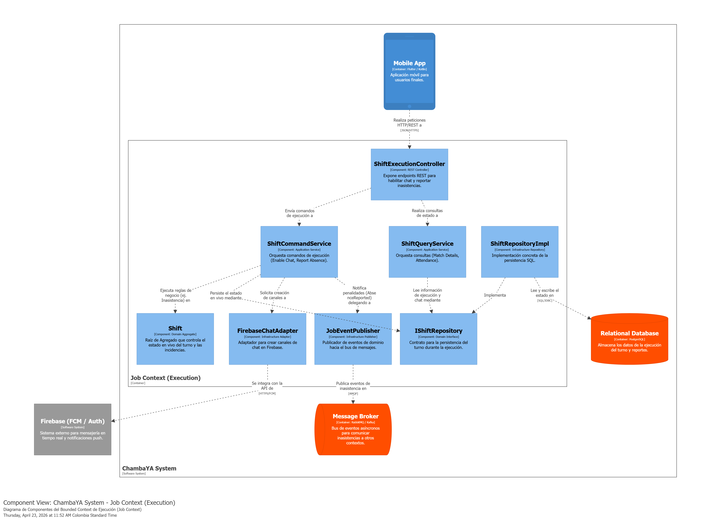
##### 2.6.3.6. Bounded Context Software Architecture Code Level Diagrams
###### 2.6.3.6.1. Bounded Context Domain Layer Class Diagrams
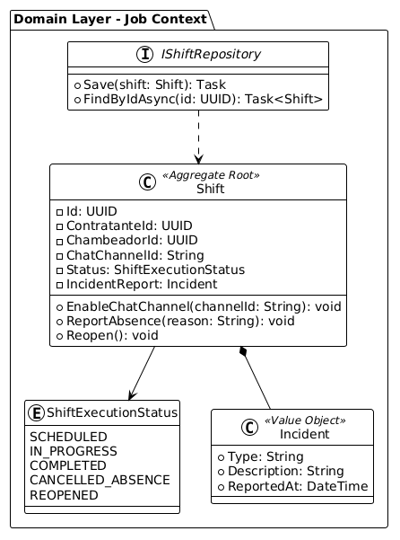
###### 2.6.3.6.2. Bounded Context Database Design Diagram

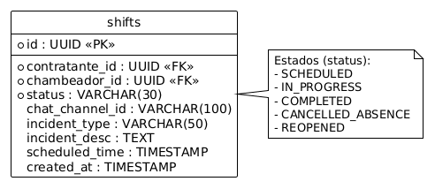

### 2.6.4. Bounded Context: Communication Context
##### 2.6.4.1. Domain Layer
El Domain Layer del bounded context **Communication** agrupa la lógica de negocio relacionada con la interacción entre contratante y chambeador durante un turno activo. En esta capa se definen los elementos del dominio que permiten gestionar conversaciones, mensajes, incidencias, solicitudes de horas extra y confirmaciones de llegada, manteniendo la comunicación dentro de un entorno controlado por la aplicación.

#### **Aggregates**

| Nombre | Descripción | Atributos | Métodos |
|---|---|---|---|
| Conversation | Aggregate Root que representa el canal de comunicación activo entre contratante y chambeador dentro de un turno. Encapsula mensajes, incidencias y eventos operativos asociados a la coordinación del servicio | Id: string, ShiftId: string, ContractorId: string, WorkerId: string, Status: CommunicationStatus, CreatedAt: DateTime, UpdatedAt: DateTime | Open(): void, Close(): void, AddMessage(Message message): void, RegisterIncident(IncidentReport incident): void, ConfirmArrival(ArrivalConfirmation arrival): void, RequestOvertime(OvertimeRequest request): void |
|
---
#### **Entities**

| Nombre | Descripción | Atributos |
|---|---|---|
| Message | Entidad que representa un mensaje enviado dentro de una conversación activa | Id: string, ConversationId: string, SenderId: string, Content: MessageContent, SentAt: DateTime |
| IncidentReport | Entidad que representa una incidencia o imprevisto reportado durante la ejecución del turno | Id: string, ConversationId: string, ReportedBy: string, Description: string, CreatedAt: DateTime, Status: string |
| OvertimeRequest | Entidad que representa una solicitud de horas extra generada durante el turno y evaluada por el contratante | Id: string, ConversationId: string, RequestedBy: string, ExtraHours: int, Status: string, RequestedAt: DateTime |
| ArrivalConfirmation | Entidad que representa la confirmación de llegada del chambeador al lugar del turno | Id: string, ConversationId: string, WorkerId: string, ConfirmedAt: DateTime |
|
---
#### **Value Objects**

| Nombre | Descripción | Atributos / Valores |
|---|---|---|
| MessageContent | Objeto de valor que representa el contenido textual de un mensaje | Text: string |
| CommunicationStatus | Objeto de valor que modela el estado actual de la conversación | Active, Closed |
| NotificationType | Objeto de valor que representa el tipo de notificación generada dentro del contexto | Message, Incident, Arrival, OvertimeRequest, Reminder |
| IncidentType | Objeto de valor que clasifica el tipo de incidencia reportada | Delay, Absence, OperationalIssue, Other |
|

#### **Services**

| Nombre | Descripción | Métodos |
|---|---|---|
| ICommunicationCommandService | Interfaz que define las operaciones de negocio que modifican el estado de la conversación y sus entidades relacionadas | Handle(SendMessageCommand command), Handle(ReportIncidentCommand command), Handle(ConfirmArrivalCommand command), Handle(RequestOvertimeCommand command), Handle(CloseConversationCommand command) |
| ICommunicationQueryService | Interfaz que expone consultas sobre conversaciones, mensajes e incidencias | Handle(GetConversationByIdQuery query), Handle(GetMessagesByConversationQuery query), Handle(GetIncidentsByConversationQuery query), Handle(GetOvertimeRequestsByConversationQuery query) |

#### **Repositories**

| Nombre | Descripción |
|---|---|
| IConversationRepository | Define la persistencia del aggregate Conversation y de sus entidades relacionadas |

---

##### 2.6.4.2. Interface Layer

En esta capa se exponen los controladores y recursos que permiten a las aplicaciones móviles interactuar con el bounded context **Communication**. Los controladores reciben solicitudes externas, validan la entrada, transforman los datos en comandos o consultas y delegan la ejecución a los servicios de aplicación correspondientes. De esta manera, la lógica de negocio permanece aislada en las capas internas del dominio.

#### **Controllers**

| Nombre | Descripción | Endpoints (ejemplos) |
|---|---|---|
| ConversationsController | Expone operaciones relacionadas con la gestión de conversaciones activas entre contratante y chambeador durante un turno. Permite consultar conversaciones, listar mensajes, registrar nuevas interacciones y cerrar la comunicación cuando el turno concluye | `GET /api/conversations/{id}` (GetConversationByIdQuery)   `GET /api/conversations/{id}/messages` (GetMessagesByConversationQuery)   `POST /api/conversations/{id}/messages` (SendMessageCommand)   `POST /api/conversations/{id}/close` (CloseConversationCommand) |
| IncidentsController | Expone operaciones para registrar y consultar incidencias reportadas durante la ejecución del turno | `POST /api/conversations/{id}/incidents` (ReportIncidentCommand)   `GET /api/conversations/{id}/incidents` (GetIncidentsByConversationQuery) |
| ArrivalsController | Expone la operación de confirmación de llegada del chambeador al lugar del turno. | `POST /api/conversations/{id}/arrival-confirmation` (ConfirmArrivalCommand) |
| OvertimeRequestsController | Expone operaciones para registrar y consultar solicitudes de horas extra generadas durante un turno activo | `POST /api/conversations/{id}/overtime-requests` (RequestOvertimeCommand)   `GET /api/conversations/{id}/overtime-requests` (GetOvertimeRequestsByConversationQuery) |

#### **Resources**

| Resource | Esquema (ejemplos) |
|---|---|
| SendMessageResource | `json { "senderId": "worker-123", "content": "Ya llegué al local." }` |
| MessageResource | `json { "id": "msg-001", "conversationId": "conv-123", "senderId": "worker-123", "content": "Ya llegué al local.", "sentAt": "2026-10-01T18:30:00Z" }` |
| ReportIncidentResource | `json { "reportedBy": "worker-123", "description": "El local está cerrado.", "type": "OperationalIssue" }` |
| IncidentResource | `json { "id": "inc-001", "conversationId": "conv-123", "reportedBy": "worker-123", "description": "El local está cerrado.", "status": "Open", "createdAt": "2026-10-01T18:35:00Z" }` |
| ConfirmArrivalResource | `json { "workerId": "worker-123", "confirmedAt": "2026-10-01T18:28:00Z" }` |
| OvertimeRequestResource | `json { "requestedBy": "worker-123", "extraHours": 2 }` |
| ConversationResource | `json { "id": "conv-123", "shiftId": "shift-001", "contractorId": "contractor-001", "workerId": "worker-123", "status": "Active", "createdAt": "2026-10-01T18:00:00Z", "updatedAt": "2026-10-01T18:30:00Z" }` |

#### **Assemblers**

Los Assemblers encapsulan la transformación entre los Resources expuestos por la API y los Commands/Queries utilizados por la capa de aplicación. Esto permite mantener a los controladores ligeros y enfocados únicamente en la interacción con el protocolo HTTP.

- **SendMessageResourceToCommandAssembler** convierte un `SendMessageResource` en un `SendMessageCommand`
- **MessageEntityToMessageResourceAssembler** convierte una entidad `Message` en un `MessageResource`.
- **ReportIncidentResourceToCommandAssembler** convierte un `ReportIncidentResource` en un `ReportIncidentCommand`
- **IncidentEntityToIncidentResourceAssembler** convierte una entidad `IncidentReport` en un `IncidentResource`
- **ConfirmArrivalResourceToCommandAssembler** convierte un `ConfirmArrivalResource` en un `ConfirmArrivalCommand`
- **OvertimeRequestResourceToCommandAssembler** convierte un `OvertimeRequestResource` en un `RequestOvertimeCommand`
- **ConversationEntityToConversationResourceAssembler** convierte una entidad `Conversation` en un `ConversationResource`

##### 2.6.4.3. Application Layer

La Application Layer del bounded context **Communication** se encarga de orquestar la ejecución de las operaciones relacionadas con la interacción entre contratante y chambeador durante un turno activo. Esta capa recibe comandos y consultas desde la Interface Layer, valida la información de entrada y delega la lógica de negocio al Domain Layer.

Asimismo, coordina el uso de repositorios para la persistencia de datos y prepara la información que será devuelta a la capa de presentación, manteniendo una separación clara entre la lógica del dominio y los detalles de infraestructura.

#### **Command Services**

| Nombre | Descripción | Commands manejados |
|---|---|---|
| CommunicationCommandService | Gestiona las operaciones que modifican el estado de la conversación y sus entidades asociadas | SendMessageCommand, ReportIncidentCommand, ConfirmArrivalCommand, RequestOvertimeCommand, CloseConversationCommand | 

#### **Query Services**

| Nombre | Descripción | Queries manejadas |
|---|---|---|
| CommunicationQueryService | Expone consultas relacionadas con conversaciones, mensajes, incidencias y solicitudes de horas extra | GetConversationByIdQuery, GetMessagesByConversationQuery, GetIncidentsByConversationQuery, GetOvertimeRequestsByConversationQuery |

##### 2.6.4.4. Infrastructure Layer

La Infrastructure Layer del bounded context **Communication** se encarga de la persistencia de datos y de la integración con servicios externos necesarios para el funcionamiento del sistema. Esta capa proporciona las implementaciones concretas de los repositorios definidos en el Domain Layer, así como los adaptadores para servicios de mensajería y notificaciones.

Asimismo, permite desacoplar la lógica de negocio de los detalles tecnológicos, facilitando la evolución del sistema y el cambio de tecnologías sin afectar las capas internas.

#### **Repositories**

| Nombre | Descripción | Implementación (ejemplos de métodos) |
|---|---|---|
| ConversationRepository | Implementación concreta del repositorio encargado de la persistencia del aggregate Conversation y sus entidades relacionadas | - GetByIdAsync(id)   - GetMessagesByConversationId(conversationId)   - AddMessageAsync(message)   - AddIncidentAsync(incident)   - AddOvertimeRequestAsync(request)   - UpdateConversationStatus(status) |
|

#### **Persistence**

| Componente | Descripción |
|---|---|
| MongoDB | Base de datos no relacional utilizada para almacenar conversaciones, mensajes, incidencias y solicitudes de horas extra, permitiendo flexibilidad en la estructura de los datos |
|

#### **External Services Integration**

| Nombre | Descripción | Implementación (ejemplos) |
|---|---|---|
| NotificationAdapter (FCM) | Adaptador encargado de la integración con Firebase Cloud Messaging para el envío de notificaciones en tiempo real | - SendMessageNotification(userId, message)   - SendIncidentNotification(conversationId)   - SendArrivalConfirmationNotification(conversationId)   - SendOvertimeRequestNotification(conversationId) |

##### 2.6.4.5. Bounded Context Software Architecture Component Level Diagrams
El siguiente diagrama de componentes representa la estructura interna del bounded context **Communication**, mostrando la organización de sus elementos en capas y la interacción entre ellas.

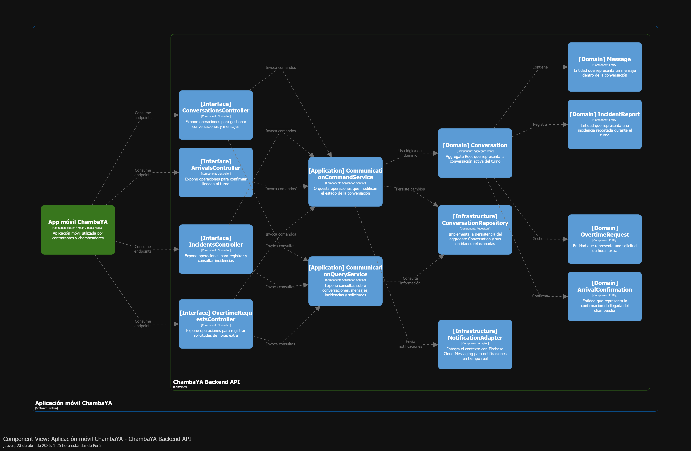

Se identifican los controladores en la capa de interfaz, los servicios de aplicación encargados de orquestar las operaciones, los elementos del dominio que contienen la lógica de negocio y los componentes de infraestructura responsables de la persistencia y la integración con servicios externos.

Este enfoque permite mantener una separación clara de responsabilidades, facilitando la escalabilidad y mantenibilidad del sistema.

##### 2.6.4.6. Bounded Context Software Architecture Code Level Diagrams
En esta sección se presentan los diagramas de nivel de código correspondientes al bounded context **Communication**. Estos diagramas permiten representar con mayor detalle la estructura interna del contexto, tanto desde la perspectiva del modelo de dominio como desde la persistencia de la información.

###### 2.6.4.6.1. Bounded Context Domain Layer Class Diagrams

A continuación, se presenta el diagrama de clases del Domain Layer del bounded context **Communication**. En este diagrama, **Conversation** se identifica como la clase principal, ya que concentra la interacción entre contratante y chambeador durante un turno activo.

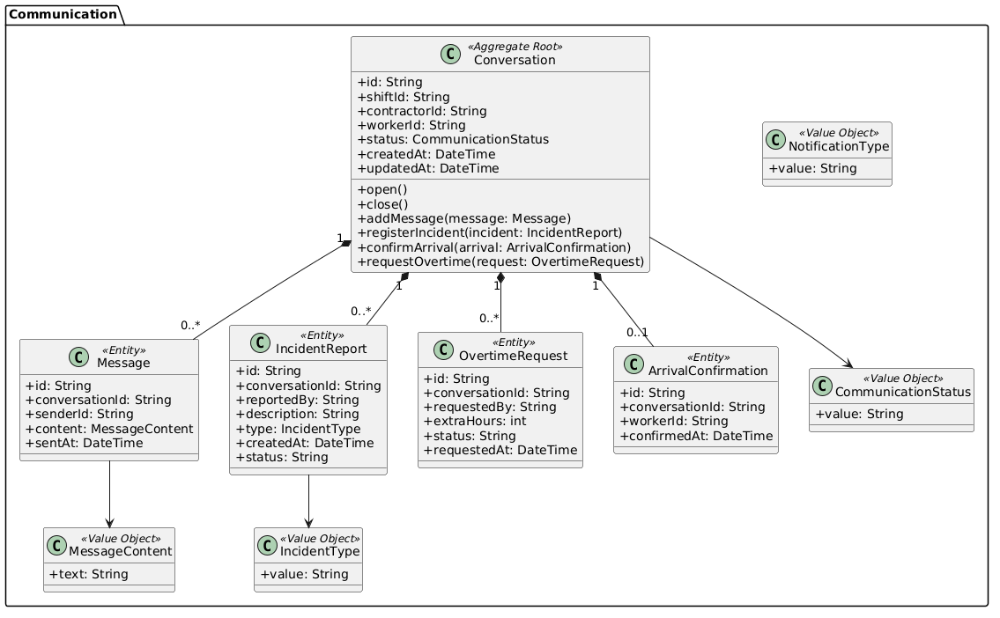

Además, se relaciona con entidades como **Message**, **IncidentReport**, **OvertimeRequest** y **ArrivalConfirmation**, así como con value objects que complementan la consistencia del modelo del dominio.

###### 2.6.4.6.2. Bounded Context Database Design Diagram

El siguiente diagrama muestra el diseño de persistencia del bounded context **Communication** en MongoDB. La colección **conversations** concentra la información principal de la conversación y los datos relacionados con mensajes, incidencias, solicitudes de horas extra y confirmaciones de llegada.

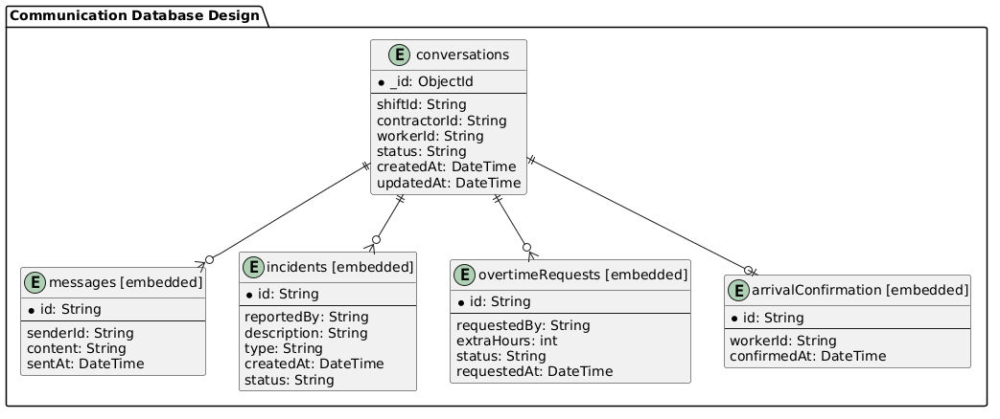

### 2.6.5. Bounded Context: Reputation Context
##### 2.6.5.1. Domain Layer
##### 2.6.5.2. Interface Layer
##### 2.6.5.3. Application Layer
##### 2.6.5.4. Infrastructure Layer
##### 2.6.5.5. Bounded Context Software Architecture Component Level Diagrams
##### 2.6.5.6. Bounded Context Software Architecture Code Level Diagrams
###### 2.6.5.6.1. Bounded Context Domain Layer Class Diagrams
###### 2.6.5.6.2. Bounded Context Database Design Diagram

### 2.6.6. Bounded Context: Payment Context
##### 2.6.6.1. Domain Layer

La capa Payment And Subscriptions constituye el núcleo del bounded context encargado de la administración de cuentas y suscripciones de usuarios y negocios, centralizando la lógica relacionada con la gestión de planes de pago y su ciclo de vida.

En esta capa se definen las reglas y comportamientos propios del dominio de pagos y suscripciones: creación y mantenimiento de cuentas (Account), afiliación de usuarios o negocios a planes de pago mediante suscripciones (Subscription), gestión de estados de vigencia y control de renovaciones o cancelaciones.

## Aggregates

| Nombre           | Descripción                                                                          | Atributos                                                                                                                                          | Métodos                                                                                            |
|------------------|--------------------------------------------------------------------------------------|----------------------------------------------------------------------------------------------------------------------------------------------------|----------------------------------------------------------------------------------------------------|
| **Account**      | Representa la cuenta de un usuario o negocio dentro del sistema.                     | `Id: string, Business: Business, AccountRole: EAccountRole, Status: EAccountStatus, OwnerUserId: string`                                           | `ActivateAccount(), GetCreationDate(), GetBusinessName(), GetBusinessEmail()`                      |
| **Subscription** | Representa la suscripción de una cuenta a un plan, controlando su estado y vigencia. | `Id: string, SubscribedAccountId: string, SubscribedAccount: Account, AssociatedPlanId: string, AssociatedPlan: Plan, Status: ESubscriptionStatus` | `ActivateSubscription(), ActivateWithPlan(Plan newPlan), CalculateExpirationDate(), UpgradePlan()` |

---

## Entities

| Nombre       | Descripción                                                         | Atributos                                                                                                                                           | Métodos                                                                                   |
|--------------|---------------------------------------------------------------------|-----------------------------------------------------------------------------------------------------------------------------------------------------|-------------------------------------------------------------------------------------------|
| **Plan**     | Define los planes de suscripción disponibles y sus características. | `Id: string, PlanType: EPlanType, Description: string, PaymentFrequency: EPaymentFrequency, PlanPrice: Money, MaxWarehouses: int, MaxProducts: int` | `CreateFreePlan(), CreatePremiumMonthlyPlan(), CreatePremiumAnnualPlan(), ValidatePlan()` |
| **Business** | Representa un negocio asociado a una cuenta.                        | `Id: string, BusinessName: BusinessName, BusinessEmail: BusinessEmail, Ruc: string`                                                                 | ``                                                                                        |

---

## Value Objects

| Nombre                  | Descripción                                                     | Atributos / Métodos                           |
|-------------------------|-----------------------------------------------------------------|-----------------------------------------------|
|          | |    |
| **EPaymentFrequency**   | Define la frecuencia de pago de un plan.                        | `Valores: Monthly, Annual`                    |
| **EPlanType**           | Define el tipo de plan de suscripción.                          | `Valores: Free, Premium`                      |
| **BusinessName**        | Valor que representa el nombre del negocio.                     | `Atributos: { Name: string }`                 |
| **BusinessEmail**       | Valor que representa el correo electrónico del negocio.         | `Atributos: { Email: string }`                |
| **Ruc**                 | Valor que representa el número de RUC del negocio.              | `Atributos: { Ruc: string }`                
| **ESubscriptionStatus** | Define los posibles estados de una suscripción.                 | `Valores: Active, Expired, Canceled, Pending` |
| **EAccountStatus**      | Define los posibles estados de una cuenta.                      | `Valores: Active, Inactive, Suspended`  

---

## Services

| Nombre                          | Descripción                                                        | Métodos (Commands / Queries)                                                                                    |
|---------------------------------|--------------------------------------------------------------------|-----------------------------------------------------------------------------------------------------------------|
| **ISubscriptionCommandService** | Gestiona la creación, activación y actualización de suscripciones. | `CreateSubscriptionCommand, ActivateSubscriptionCommand, UpgradeSubscriptionCommand, CancelSubscriptionCommand` |
| **IAccountCommandService**      | Gestiona operaciones sobre cuentas de usuario o negocio.           | `CreateAccountCommand, ActivateAccountCommand, SuspendAccountCommand`                                           |
| **IPlanCommandService**         | Gestiona la creación y actualización de planes de suscripción.     | `CreatePlanCommand, UpdatePlanCommand, DeletePlanCommand`                     |

---

## Repositories

| Nombre                     | Descripción                                              | Métodos                                                                                                                                                                              |
|----------------------------|----------------------------------------------------------|--------------------------------------------------------------------------------------------------------------------------------------------------------------------------------------|
| **AccountRepository**      | Persistencia y consulta de cuentas en la base de datos.  | `AddAsync(Account account), UpdateAsync(Account account), DeleteAsync(Guid id), GetByIdAsync(Guid id), GetByStatusAsync(EAccountStatus status), GetByRoleAsync(EAccountRole role)`   |
| **PlanRepository**         | Persistencia y consulta de planes de suscripción.        | `AddAsync(Plan plan), UpdateAsync(Plan plan), DeleteAsync(Guid id), GetByIdAsync(Guid id), GetAllAsync(), GetByTypeAsync(EPlanType type)`                                            |
| **SubscriptionRepository** | Persistencia y consulta de suscripciones.                | `AddAsync(Subscription subscription), UpdateAsync(Subscription subscription), DeleteAsync(Guid id), GetByIdAsync(Guid id), GetByAccountAsync(AccountId accountId), GetActiveAsync()` |
| 
##### 2.6.6.2. Interface Layer

La **Interface Layer** expone los servicios del bounded context hacia el exterior mediante **APIs REST**, permitiendo que clientes externos (web o móvil) interactúen con las cuentas, suscripciones, planes y negocios.  
Se definen los **Controllers**, **Resources** y **Assemblers/Transformers**, encargados de mapear entre las entidades de dominio y los formatos de entrada/salida utilizados por los consumidores.

---

## Controllers

| Nombre                      | Descripción                                              | Endpoints (ejemplos)                                                                                                                                                  |
|-----------------------------|----------------------------------------------------------|-----------------------------------------------------------------------------------------------------------------------------------------------------------------------|
| 
| **PlansController**         | Gestiona los planes de suscripción.                      | `POST /plans (CreatePlan)` `PUT /plans/{id} (UpdatePlan)` `GET /plans/{id}` `GET /plans`
---

## Resources

Los **Resources** definen la estructura de datos que los clientes externos envían o reciben, evitando exponer directamente las entidades del dominio.

- **CreateAccountResource**: `{ BusinessId: string, OwnerUserId: string, Role: string }`
- **AccountResource**: `{ Id: string, BusinessName: string, Email: string, Status: string, Role: string }`
- **CreateSubscriptionResource**: `{ AccountId: string, PlanId: string }`
- **SubscriptionResource**: `{ Id: string, AccountId: string, PlanId: string, Status: string, ExpirationDate: DateTime }`
- **CreatePlanResource**: `{ PlanType: string, Description: string, PaymentFrequency: string, Price: decimal, MaxWarehouses: int, MaxProducts: int }`
- **PlanResource**: `{ Id: string, PlanType: string, Description: string, PaymentFrequency: string, Price: decimal, MaxWarehouses: int, MaxProducts: int }`
- **CreateBusinessResource**: `{ BusinessName: string, Email: string, Ruc: string }`
- **BusinessResource**: `{ Id: string, BusinessName: string, Email: string, Ruc: string }`

## Assemblers / Transformers

Se implementan componentes que transforman los **Resources** ↔ **Entities/Aggregates**, asegurando que la capa de interfaces no contenga lógica de negocio.

- `SubscriptionFromResourceAssembler` → Convierte un `CreateSubscriptionResource` en `CreateSubscriptionCommand`.
- `SubscriptionResourceFromEntityAssembler` → Convierte un `Subscription` en `SubscriptionResource`.
- `BusinessFromResourceAssembler` → Convierte un `CreateBusinessResource` en `CreateBusinessCommand`.
- `BusinessResourceFromEntityAssembler` → Convierte un `Business` en `BusinessResource`.

##### 2.6.6.3. Application Layer

La **Application Layer** orquesta la ejecución de **comandos** y **consultas** para los agregados `Account`, `Subscription` y `Business`.  
Se encarga de delegar la lógica de negocio a la **Domain Layer** mediante los **CommandServices** y **QueryServices**, y de coordinar eventos si aplica.

---

## Command Services

Los **Command Services** procesan acciones que **modifican el estado del dominio**, como crear, actualizar o eliminar entidades.  
Reciben **Commands**, los validan y delegan la ejecución a los **Domain Services** y **Repositories** correspondientes.

| Nombre                         | Descripción                                 | Commands manejados                                                                                      |
|--------------------------------|---------------------------------------------|---------------------------------------------------------------------------------------------------------|
| **AccountCommandService**      | Gestiona operaciones sobre cuentas.         | `CreateAccountCommand, UpdateAccountCommand, ActivateAccountCommand, DeactivateAccountCommand`          |
| **SubscriptionCommandService** | Gestiona el ciclo de vida de suscripciones. | `CreateSubscriptionCommand, UpdateSubscriptionCommand, ActivateSubscriptionCommand, UpgradePlanCommand`                                        |
| **BusinessCommandService**     | Gestiona negocios asociados a cuentas.      | `CreateBusinessCommand, UpdateBusinessCommand`                                                          |

---

## Query Services

Los **Query Services** se encargan de **consultar datos del dominio** sin modificar su estado.  
Reciben **Queries**, consultan los **Repositories** y devuelven resultados al **Controller** o consumidor de la API.

| Nombre                       | Descripción                            | Queries manejadas                                                                                |
|------------------------------|----------------------------------------|--------------------------------------------------------------------------------------------------|
| **AccountQueryService**      | Consultas sobre cuentas.               | `GetAccountByIdQuery, GetAccountsByStatusQuery, GetAccountsByBusinessQuery, GetAllAccountsQuery` |
| **SubscriptionQueryService** | Consultas sobre suscripciones.         | `GetSubscriptionByIdQuery, GetSubscriptionsByAccountQuery, GetActiveSubscriptionsQuery`                                        |
| **BusinessQueryService**     | Consultas sobre negocios.              | `GetBusinessByIdQuery, GetAllBusinessesQuery`                                                    |

##### 2.6.6.4. Infrastructure Layer

La **Infrastructure Layer** proporciona las implementaciones técnicas necesarias para que la **Application Layer** y la **Domain Layer** funcionen correctamente.  
Incluye la **persistencia de datos** y , y cualquier dependencia tecnológica concreta.

---

## Repositories

Los **Repositories** implementan la persistencia de los agregados definidos en el dominio y actúan como puente entre las **Entities/Aggregates** y la base de datos o servicios externos.

| Nombre                     | Descripción                                        | Implementación típica                                                                                                                                                                                                                                                                                                                                                                              |
|----------------------------|----------------------------------------------------|----------------------------------------------------------------------------------------------------------------------------------------------------------------------------------------------------------------------------------------------------------------------------------------------------------------------------------------------------------------------------------------------------|
| **AccountRepository**      | Gestiona la persistencia de cuentas.               | - `AddAsync(Account account)` → Insertar nueva cuenta. - `UpdateAsync(Account account)` → Actualizar cuenta. - `DeleteAsync(string id)` → Eliminar cuenta. - `GetByIdAsync(string id)` → Obtener cuenta por Id. - `GetByStatusAsync(EAccountStatus status)` → Filtrar cuentas por estado. - `GetAllAsync()` → Obtener todas las cuentas.                                            |
| **SubscriptionRepository** | Gestiona la persistencia de suscripciones.         | - `AddAsync(Subscription subscription)` → Crear suscripción. - `UpdateAsync(Subscription subscription)` → Actualizar suscripción. - `DeleteAsync(string id)` → Eliminar suscripción. - `GetByIdAsync(string id)` → Obtener suscripción por Id. - `GetByAccountAsync(string accountId)` → Obtener suscripciones de una cuenta. - `GetActiveAsync()` → Obtener suscripciones activas.                                                                                |

## External Payment Integration

| Nombre                 | Descripción                                                     | Implementación típica                                                                                                                                                                                                                                                                                                                       |
|------------------------|-----------------------------------------------------------------|---------------------------------------------------------------------------------------------------------------------------------------------------------------------------------------------------------------------------------------------------------------------------------------------------------------------------------------------|
| **PAYPAL** | Gestiona la comunicación con la API de PayPal. | - `CreatePayment(PaymentRequest request)` → Crear un pago en PayPal. - `GetPaymentStatus(string paymentId)` → Consultar el estado de un pago. - `CancelPayment(string paymentId)` → Cancelar un pago. - `WebhookHandler(EventPayload payload)` → Procesar eventos de PayPal (pagos aprobados, rechazados, pendientes). |

##### 2.6.6.5. Bounded Context Software Architecture Component Level Diagrams

#### Diagrama de componentes: Suscripciones y cuentas ####

  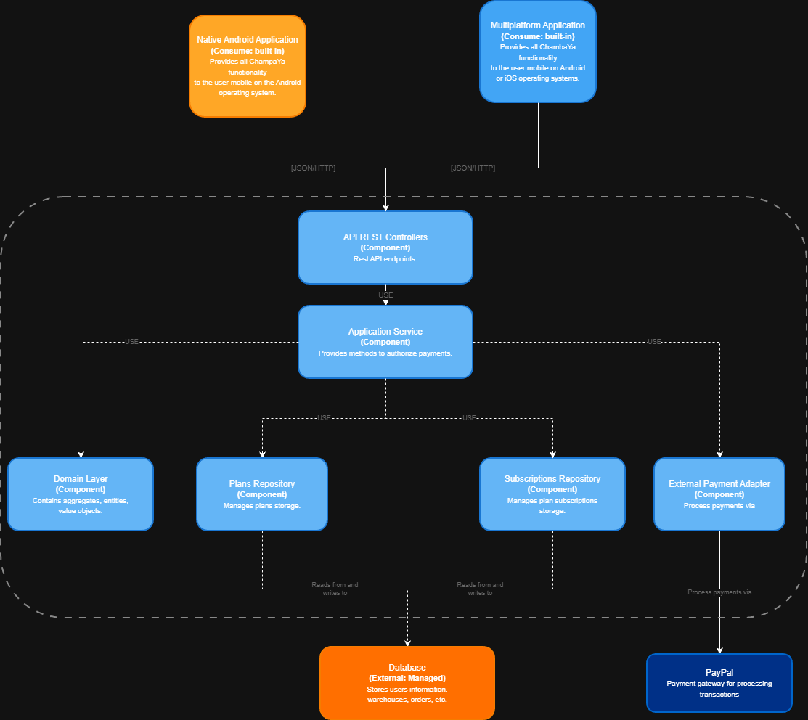

En la imagen se aprecia el diagrama de componentes para el contexto de cuentas y suscripciones. En este diagrama, se muestra que la información de las suscripciones y cuentas se almacenan en la base de datos gracias al uso de repositorios para cada una de dichas entidades. Además, se evidencia la relación con el sistema externo de MercadoPago para la compra de suscripciones por parte de los usuarios de la aplicación.

##### 2.6.6.6. Bounded Context Software Architecture Code Level Diagrams

En esta sección, se muestran y explican los diagramas de clases y de base de datos relacionados al contexto delimitado sobre la creación de cuentas y suscripciones.

##### 4.2.5.6.1. Bounded Context Domain Layer Class Diagrams #####

A continuación, se muestra el diagrama de clases del contexto presente 

#### Clase principal: 'Account' ####

  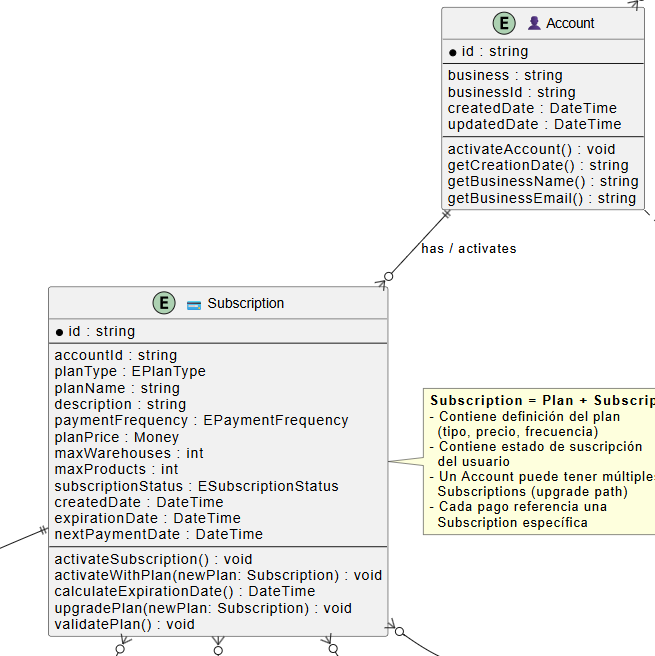

En este diagrama se visualiza tanto a la clase llamada 'Account' como la clase 'Subscription'. Ambas clases se encuentran relacionadas. Mientras que una hace referencia a una cuenta general que utiliza una empresa, la otra hace referencia al tipo de suscripción que pagó dicha cuenta.

#### Value Objects ####

  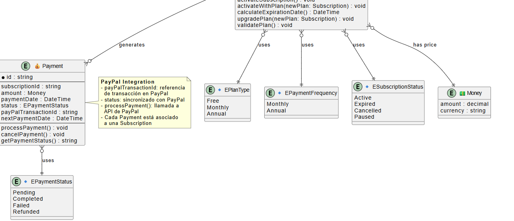

Finalmente, en este diagrama se muestran los 'value objecs' del contexto de suscripciones. Estas clases contienen información relacionada a valores enumerados para algunos atributos como, por ejemplo, 'ESubscriptionStatus' que forma parte de la clase 'Subscription' que sirve para indicar el estado actual de la suscripción de una cuenta.

###### 2.6.6.6.2. Bounded Context Database Design Diagram

A continuación, se muestra y explica el diagrama de documentos relacionado a la base de datos no relacional que se usará. Este diagrama de documentos refleja como la información del contexto presente persiste en una base de datos en MongoDB.

  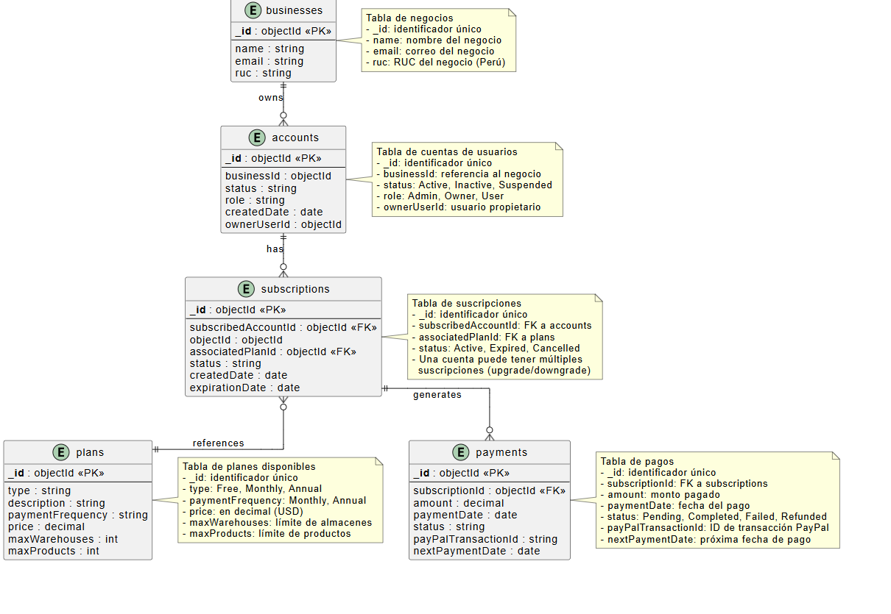

