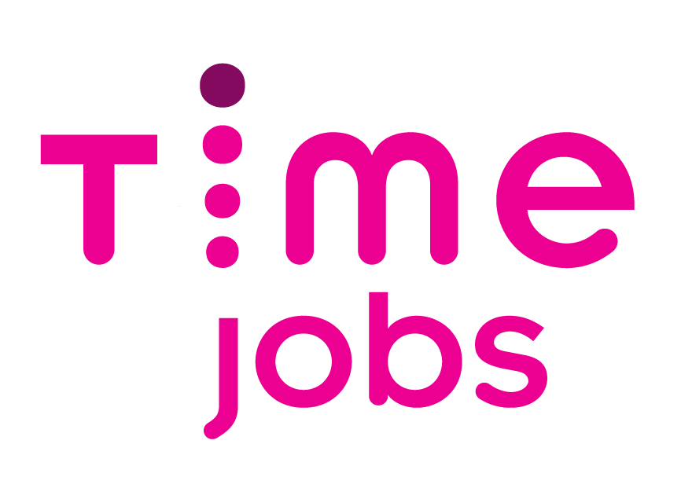
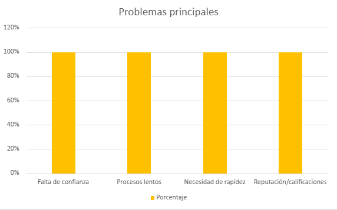
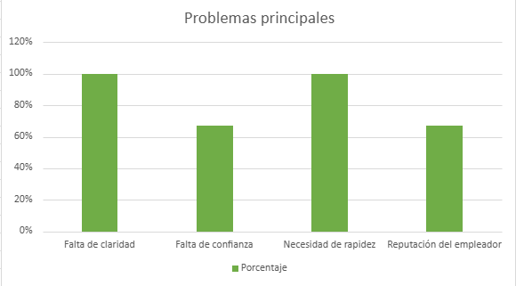
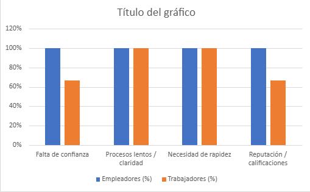
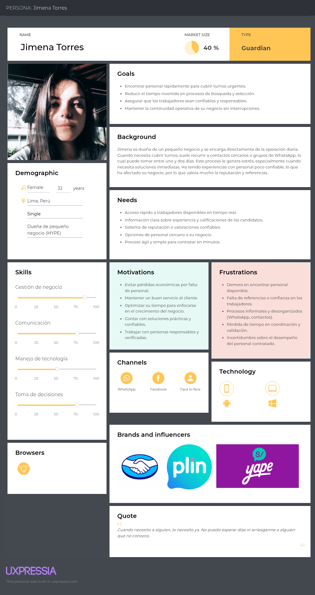
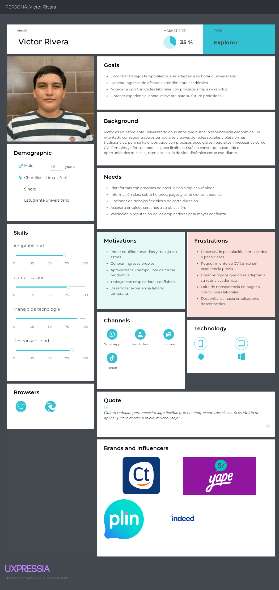
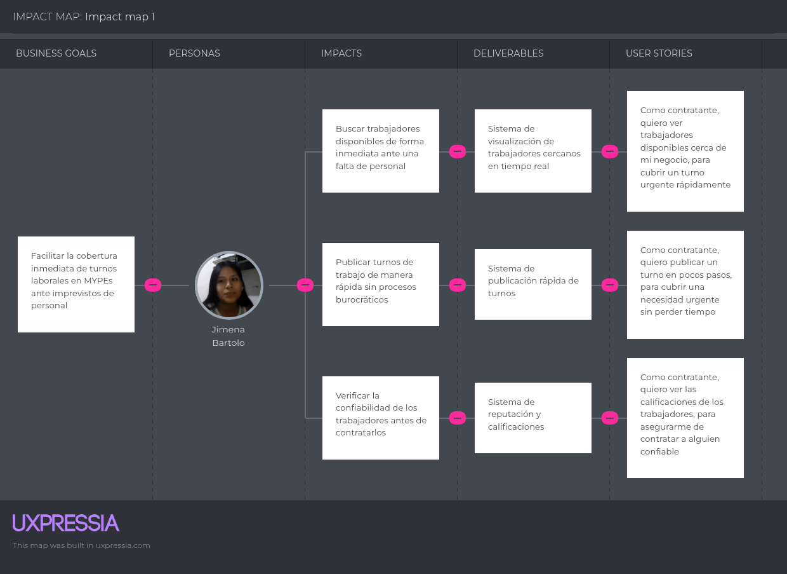
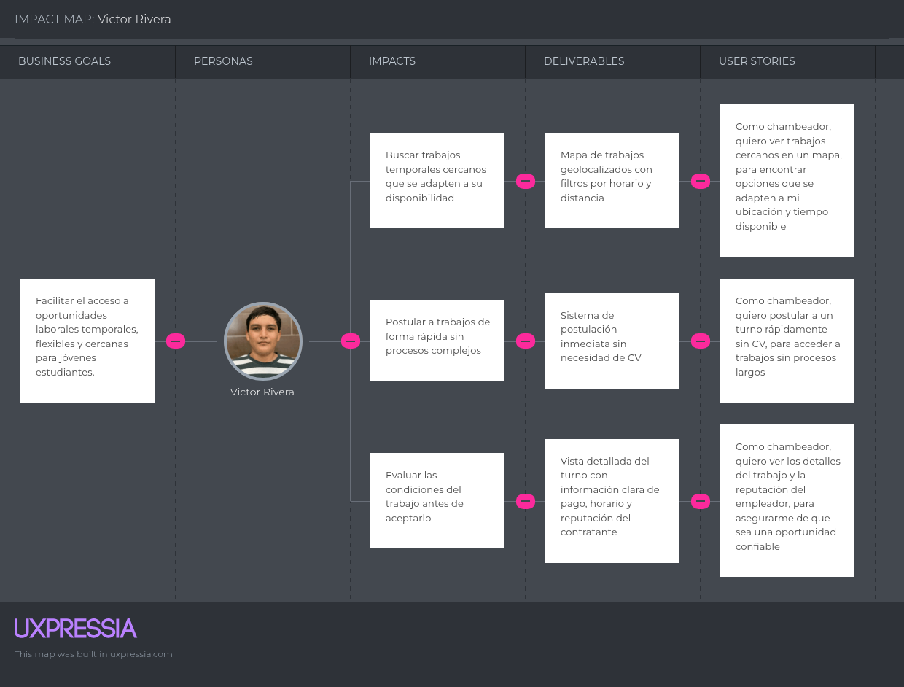

# Capítulo II: Requirements Development and Software Solution Design

## 2.1. Competidores
### 2.1.1. Análisis competitivo
<table border="1" cellpadding="8" cellspacing="0" style="border-collapse:collapse; width:100%; font-family:Arial, sans-serif;">
    <tr>
        <th colspan="7" style="background-color:#d9ead3;">Competitive Analysis Landscape</th>
    </tr>
    <tr>
        <td colspan="2" rowspan="2" style="background-color:#f4cccc;"><strong>¿Por qué llevar a cabo este análisis?</strong></td>
        <td colspan="5">¿Cómo se posiciona ChambaYA frente a sus competidores en cuanto a propuesta de valor, marketing, producto y estrategia?</td>
    </tr>
    <tr>
        <td colspan="5">
            Es un análisis comparativo que permite identificar fortalezas, debilidades, oportunidades y amenazas, así como entender mejor la posición del producto frente a otros actores relevantes del mercado.
        </td>
    </tr>
    <tr>
        <td colspan="3"></td>
        <td style="text-align:center;">
            <strong>ChambaYA</strong> 
            
        </td>
        <td style="text-align:center;">
            <strong>Computrabajo</strong> 
            
        </td>
        <td style="text-align:center;">
            <strong>Time Jobs</strong> 
            
        </td>
        <td style="text-align:center;">
            <strong>Indeed</strong> 
            
        </td>
    </tr>
    <tr>
        <td rowspan="2">Perfil</td>
        <td colspan="2">Overview</td>
        <td>Plataforma móvil de contratación inmediata para MYPEs que necesitan cubrir personal temporal de forma urgente mediante geolocalización y matching en tiempo real.</td>
        <td>Bolsa de empleo líder en Perú/LATAM enfocada en vacantes formales y procesos tradicionales de contratación.</td>
        <td>Plataforma de staffing flexible orientada a cubrir necesidades de personal temporal para empresas operativas.</td>
        <td>Motor global de búsqueda de empleo con publicaciones de empresas y postulaciones masivas.</td>
    </tr>
    <tr>
        <td colspan="2">Ventaja competitiva ¿Qué valor ofrece a los clientes?</td>
        <td>Matching hiperlocal inmediato, sin CV, orientado a microturnos y contratación urgente para negocios pequeños.</td>
        <td>Gran base de candidatos y reconocimiento de marca en LATAM.</td>
        <td>Rapidez en provisión de personal temporal para empresas.</td>
        <td>Amplia suite de funcionalidades para gestión clínica y administrativa, integración con sistemas de pago.</td>
    </tr>
    <tr>
        <td rowspan="2">Perfil de Marketing</td>
        <td colspan="2">Mercado objetivo</td>
        <td>MYPEs: restaurantes, bodegas, cafeterías, negocios locales y jóvenes estudiantes/trabajadores flexibles.</td>
        <td>Empresas de todos los tamaños y postulantes de empleo formal. </td>
        <td>Empresas con alta rotación operativa y necesidad temporal estructurada.</td>
        <td>Empresas medianas/grandes y profesionales generales</td>
    </tr>
    <tr>
        <td colspan="2">Estrategias de marketing</td>
        <td>Estrategia: Penetración local en zonas comerciales, alianzas con universidades e incubadoras, marketing hipersegmentado digital.</td>
        <td>Estrategia: SEO, publicidad digital masiva, posicionamiento de marca consolidado.</td>
        <td>Estrategia: Ventas B2B directas y alianzas comerciales empresariales.</td>
        <td>Estrategia: SEO global, pauta digital y posicionamiento internacional.</td>
    </tr>
    <tr>
        <td rowspan="3">Perfil de Producto</td>
        <td colspan="2">Productos & Servicios.</td>
        <td>Productos: App móvil de matching laboral temporal con geolocalización, reputación y chat interno.</td>
        <td>Productos: Portal web/app de bolsa laboral tradicional.</td>
        <td>Productos: Plataforma de staffing / reclutamiento temporal.</td>
        <td>Productos: Portal de empleo web/app.</td>
    </tr>
    <tr>
        <td colspan="2">Precios & Costos</td>
        <td>Precios: Microcomisión por contratación / modelo freemium accesible para MYPEs.</td>
        <td>Precios: Pago por publicación / paquetes de reclutamiento.</td>
        <td>Precios: Pricing empresarial por servicio staffing.</td>
        <td>Precios: Pago por publicación / patrocinio de vacantes.</td>
    </tr>
    <tr>
        <td colspan="2">Canales de distribución (Web y/o Móvil)</td>
        <td>Canales: App móvil (iOS/Android) y plataforma web.</td>
        <td>Canales: Web + móvil.</td>
        <td>Canales: Web + móvil.</td>
        <td>Canales: Web + móvil.</td>
    </tr>
    <tr>
        <td rowspan="5">Análisis SWOT</td>
    <tr>
        <td colspan="2">Fortalezas</td>
        <td>Fortalezas: Especialización en contratación inmediata, modelo hiperlocal, pensado para MYPEs.</td>
        <td>Fortalezas: Gran penetración de mercado y confianza de marca.</td>
        <td>Fortalezas: Buen enfoque en personal temporal.</td>
        <td>Fortalezas: Amplia base de usuarios global.</td>
    </tr>
    <tr>
        <td colspan="2">Debilidades</td>
        <td>Debilidades: Startup nueva, requiere validación de mercado y adquisición de masa crítica.</td>
        <td>Debilidades: No optimizado para urgencias ni microturnos; requiere CV.</td>
        <td>Debilidades: Poco orientado a microempresas pequeñas; enfoque más corporativo.</td>
        <td>Debilidades: No especializado en contratación inmediata/local.</td>
    </tr>
    <tr>
        <td colspan="2">Oportunidades</td>
        <td>Oportunidades: Crecimiento de gig economy y digitalización de MYPEs en Perú/LATAM.</td>
        <td>Oportunidades: Expandir verticales laborales.</td>
        <td>Oportunidades: Penetrar nuevos mercados LATAM.</td>
        <td>Oportunidades: Mantener liderazgo global.</td>
    </tr>
    <tr>
        <td colspan="2">Amenazas</td>
        <td>Amenazas: Entrada de marketplaces globales / dificultad de generar liquidez inicial.</td>
        <td>Amenazas: Nuevos modelos de gig-work más ágiles.</td>
        <td>Amenazas: Nuevas apps hiperlocales especializadas.</td>
        <td>Amenazas: Plataformas nicho más adaptadas al mercado local.</td>
    </tr>
</table>

### 2.1.2. Estrategias y tácticas frente a competidores

| **Análisis FODA cruzado** | **Oportunidades** | **Amenazas** |
|---|---|---|
| **Fortalezas (F)** 1. Especialización en contratación inmediata para MYPEs. 2. Matching geolocalizado en tiempo real. 3. Registro simplificado sin CV mediante sistema tag-based. | **Estrategia (FO) — Estrategias Ofensivas** 1. Posicionar a ChambaYA como la primera plataforma especializada en contratación urgente para MYPEs en Perú. 2. Implementar campañas de adquisición en zonas comerciales con alta concentración de negocios pequeños. 3. Generar alianzas con universidades e institutos para captar oferta laboral juvenil verificada. 4. Incentivar primeras contrataciones mediante promociones de lanzamiento y créditos gratuitos para MYPEs. | **Estrategia (FA) — Estrategias Defensivas** 1. Reforzar el posicionamiento de nicho especializado frente a plataformas generalistas como Computrabajo/Indeed. 2. Priorizar velocidad de matching como principal diferenciador competitivo. 3. Construir barreras de salida mediante reputación acumulativa de usuarios. 4. Mejorar constantemente UX/UI para reducir fricción frente a competidores más grandes.<br5. Comunicar fuertemente beneficios de inmediatez y cercanía geográfica. |
| **Debilidades (D)** 1. Bajo reconocimiento de marca al ser startup nueva. 2. Necesidad de masa crítica en ambos lados del marketplace. 3. Recursos limitados frente a competidores consolidados. 4. Dependencia inicial de adopción en mercados locales específicos.| **Estrategia (DO) — Reorientación** 1. Validar el modelo en una zona piloto antes de expansión masiva. 2. Ejecutar campañas hiperlocales para alcanzar densidad de usuarios por distrito/zona comercial. 3. Implementar programas de referidos para crecimiento orgánico de ambas partes del marketplace. 4. Generar contenido educativo para MYPEs sobre beneficios de contratación flexible digital. 5. Buscar incubadoras, fondos semilla y alianzas estratégicas para acelerar crecimiento. | **Estrategia (DA) — Supervivencia** 1. Priorizar construcción de confianza mediante validación de identidad y sistema reputacional robusto. 2. Mantener costos operativos lean para competir durante etapa temprana. 3. Enfocar recursos en verticales/rubros donde el pain point sea más fuerte. 4. Diseñar estrategia de retención temprana para evitar churn en ambos lados del marketplace. 5. Iterar rápidamente el producto con base en feedback continuo del mercado piloto. |

## 2.2. Entrevistas
### 2.2.1. Diseño de entrevistas
<h4 id="Segment" >Segmento objetivo: Contratantes (MYPEs)</h4> 
<h4 id="PreguntPersonal">Preguntas Personales:</h4> 

¿Cuál es su nombre?

¿Cuál es su edad?

¿Cuál es su cargo dentro del negocio?

¿Qué tipo de negocio administra?

¿Cuántos años lleva operando el negocio?

¿Cuántos trabajadores tiene actualmente?

<h4 id="PreguntEspe">Preguntas específicas:</h4> 

¿Con qué frecuencia enfrenta faltas de personal o necesidad de apoyo temporal en su negocio?

¿Cuando necesita cubrir un turno urgente, ¿cómo busca personal actualmente?

¿Cuánto tiempo suele tardar en encontrar a alguien disponible?

¿Qué problemas o frustraciones enfrenta con ese proceso?

¿Qué factores considera más importantes al momento de contratar personal temporal? (confianza, cercanía, experiencia, rapidez, costo, etc.)

¿Ha contratado anteriormente personas sin experiencia formal? ¿Cómo fue esa experiencia?

¿Qué nivel de confianza le generaría contratar mediante una aplicación móvil?

¿Qué funcionalidades consideraría indispensables en una plataforma de contratación inmediata?

¿Estaría dispuesto a pagar una comisión por una contratación rápida y confiable? ¿Bajo qué condiciones?

<h4 id="Segment" >Segmento objetivo: Jóvenes / Trabajadores Temporales </h4> 
<h4 id="PreguntPersonal">Preguntas Personales:</h4> 

¿Cuál es su nombre?

¿Cuál es su edad?

¿Actualmente estudia, trabaja o ambos?

¿Cuál es su ocupación?

¿Dónde reside actualmente?

¿Cuenta con experiencia laboral previa? ¿En qué rubros?

<h4 id="PreguntESP">Preguntas específicas :</h4> 

¿Ha buscado trabajos temporales o de medio tiempo anteriormente?

¿Qué dificultades ha encontrado al buscar este tipo de empleo?

¿Qué tan importante es para usted la flexibilidad horaria al momento de trabajar?

¿Qué tan dispuesto estaría a aceptar trabajos de corta duración por turnos o días?

¿Qué tipo de trabajos operativos estaría dispuesto a realizar? (atención, reparto, inventario, limpieza, etc.)

¿Qué factores considera más importantes al aceptar un trabajo temporal? (pago, cercanía, horario, seguridad, reputación del negocio, etc.)

¿Qué tan cómodo se sentiría usando una app para postular a trabajos rápidos sin CV?

### 2.2.2. Registro de entrevistas

#### Segmento 1: 

<table>
<colgroup>
</colgroup>
<thead>
  <tr>
    <th colspan="2">Entrevista #1 </th>
  </tr>
</thead>
<tbody>
  <tr>
    <td>Nombre</td>
    <td>Jimena</td>
  </tr>
  <tr>
    <td>Apellidos</td>
    <td>Bartolo </td>
  </tr>
  <tr>
    <td>Edad</td>
    <td>25 años</td>
  </tr>
  <tr>
    <td>Rol</td>
    <td>Administradora de Mypes</td>
  </tr>
  <tr>
    <td>Evidencia</td>
    <td>
</td>
  </tr>
  <tr>
    <td>Link</td>
    <td>
      <a href="https://upcedupe-my.sharepoint.com/:v:/g/personal/u202310949_upc_edu_pe/IQDBy6PhE1SASLRnUXdWusLzAcy9htEhP8k0nfKs5mYJeno?nav=eyJyZWZlcnJhbEluZm8iOnsicmVmZXJyYWxBcHAiOiJPbmVEcml2ZUZvckJ1c2luZXNzIiwicmVmZXJyYWxBcHBQbGF0Zm9ybSI6IldlYiIsInJlZmVycmFsTW9kZSI6InZpZXciLCJyZWZlcnJhbFZpZXciOiJNeUZpbGVzTGlua0NvcHkifX0&e=miCP8i" target="_blank">
    Videos entrevistas
  </a>
</td>
  </tr>
    <td>Timing donde inicia la entrevista </td>
    <td>00:09 min</td>
  </tr>
  <tr>
    <td>Duración de la entrevista </td>
    <td>03:26 min</td>
  <tr>
    <td>Resumen</td>
    <td> - Jimena, dueña de un pequeño negocio, mencionó que enfrenta dificultades cuando necesita cubrir turnos de manera urgente, ya que actualmente busca personal a través de conocidos o WhatsApp, lo que le toma entre uno y dos días. Señala que uno de los principales problemas es la falta de confianza y referencias de los trabajadores, además de la pérdida de tiempo en el proceso. Considera importante contar con una solución que le permita encontrar personal disponible de forma rápida, cercana y con buenas calificaciones, y estaría dispuesta a pagar por este servicio si realmente le garantiza eficiencia y confiabilidad.
</td>
  </tr>
</tbody>
</table>

<table>
<colgroup>
</colgroup>
<thead>
  <tr>
    <th colspan="2">Entrevista #2 </th>
  </tr>
</thead>
<tbody>
  <tr>
    <td>Nombre</td>
    <td>Fabricio</td>
  </tr>
  <tr>
    <td>Apellidos</td>
    <td>Sanchez</td>
  </tr>
  <tr>
    <td>Edad</td>
    <td>26</td>
  </tr>
  <tr>
    <td>Rol</td>
    <td>Administrador de Mype</td>
  </tr>
  <tr>
    <td>Evidencia</td>
    <td>
</td>
  </tr>
  <tr>
    <td>Link</td>
    <td>
      <a href="https://upcedupe-my.sharepoint.com/:v:/g/personal/u202310949_upc_edu_pe/IQDBy6PhE1SASLRnUXdWusLzAcy9htEhP8k0nfKs5mYJeno?nav=eyJyZWZlcnJhbEluZm8iOnsicmVmZXJyYWxBcHAiOiJPbmVEcml2ZUZvckJ1c2luZXNzIiwicmVmZXJyYWxBcHBQbGF0Zm9ybSI6IldlYiIsInJlZmVycmFsTW9kZSI6InZpZXciLCJyZWZlcnJhbFZpZXciOiJNeUZpbGVzTGlua0NvcHkifX0&e=miCP8i" target="_blank">
    Videos entrevistas
     </a>
    </td>
  </tr>
    <td>Timing donde inicia la entrevista </td>
    <td>03:32 min</td>
  </tr>
  <tr>
    <td>Duración de la entrevista </td>
    <td>05:37 min</td>
  <tr>
    <td>Resumen</td>
    <td> Fabricio confirmo que la rotación imprevista de personal es un problema crítico, especialmente los fines de semana. Sus métodos de reclutamiento actuales (carteles, redes sociales) son lentos, ineficientes y generan desconfianza, tardando hasta tres días en cubrir urgencias.

Para turnos de emergencia, Fabricio prioriza la inmediatez, cercanía y buena actitud por encima de la experiencia formal o el CV. La propuesta de la aplicación fue recibida con entusiasmo. Destacó que el mapa de geolocalización es indispensable para actuar rápido. Además, la "Insignia de Confianza" (verificación con correo universitario) fue el factor decisivo que disipó sus miedos de seguridad al contratar desconocidos, prefiriendo estudiantes validados.

Finalmente, validó el modelo de negocio al confirmar su total disposición a pagar una comisión por contacto efectivo, ya que el costo es mínimo comparado con las pérdidas por falta de personal.
</td>
  </tr>
</tbody>
</table>

<table>
<colgroup>
</colgroup>
<thead>
  <tr>
    <th colspan="2">Entrevista #3 </th>
  </tr>
</thead>
<tbody>
  <tr>
    <td>Nombre</td>
    <td></td>
  </tr>
  <tr>
    <td>Apellidos</td>
    <td> </td>
  </tr>
  <tr>
    <td>Edad</td>
    <td></td>
  </tr>
  <tr>
    <td>Rol</td>
    <td></td>
  </tr>
  <tr>
    <td>Evidencia</td>
    <td>
</td>
  </tr>
  <tr>
    <td>Link</td>
    <td>
      <a href="https://upcedupe-my.sharepoint.com/:v:/g/personal/u202310949_upc_edu_pe/IQDBy6PhE1SASLRnUXdWusLzAcy9htEhP8k0nfKs5mYJeno?nav=eyJyZWZlcnJhbEluZm8iOnsicmVmZXJyYWxBcHAiOiJPbmVEcml2ZUZvckJ1c2luZXNzIiwicmVmZXJyYWxBcHBQbGF0Zm9ybSI6IldlYiIsInJlZmVycmFsTW9kZSI6InZpZXciLCJyZWZlcnJhbFZpZXciOiJNeUZpbGVzTGlua0NvcHkifX0&e=miCP8i" target="_blank">
    Videos entrevistas
     </a>
    </td>
  </tr>
    <td>Timing donde inicia la entrevista </td>
    <td>08:54 min</td>
  </tr>
  <tr>
    <td>Duración de la entrevista </td>
    <td>05:18 min</td>
  <tr>
    <td>Resumen</td>
    <td> 
</td>
  </tr>
</tbody>
</table>

#### Segmento 2:

<table>
<colgroup>
</colgroup>
<thead>
  <tr>
    <th colspan="2">Entrevista #1 </th>
  </tr>
</thead>
<tbody>
  <tr>
    <td>Nombre</td>
    <td>Victor</td>
  </tr>
  <tr>
    <td>Apellidos</td>
    <td>Rivera </td>
  </tr>
  <tr>
    <td>Edad</td>
    <td>18 años</td>
  </tr>
  <tr>
    <td>Rol</td>
    <td>Estudiante universitario</td>
  </tr>
  <tr>
    <td>Evidencia</td>
    <td>
</td>
  </tr>
  <tr>
    <td>Link</td>
    <td>
      <a href="https://upcedupe-my.sharepoint.com/:v:/g/personal/u202310949_upc_edu_pe/IQDBy6PhE1SASLRnUXdWusLzAcy9htEhP8k0nfKs5mYJeno?nav=eyJyZWZlcnJhbEluZm8iOnsicmVmZXJyYWxBcHAiOiJPbmVEcml2ZUZvckJ1c2luZXNzIiwicmVmZXJyYWxBcHBQbGF0Zm9ybSI6IldlYiIsInJlZmVycmFsTW9kZSI6InZpZXciLCJyZWZlcnJhbFZpZXciOiJNeUZpbGVzTGlua0NvcHkifX0&e=miCP8i" target="_blank">
    Videos entrevistas
      </a>
    </td>
  </tr>
    <td>Timing donde inicia la entrevista </td>
    <td>14:15 min</td>
  </tr>
  <tr>
    <td>Duración de la entrevista </td>
    <td>03:29 min</td>
  <tr>
    <td>Resumen</td>
    <td> - Victor Rivera, un joven de 18 años y estudiante universitario, ha buscado trabajos temporales principalmente a través de redes sociales y plataformas de empleo tradicionales. Sin embargo, ha enfrentado dificultades como la falta de claridad en los procesos de aplicación, la necesidad de contar con un CV formal y la poca flexibilidad en los horarios ofrecidos. Valora mucho la flexibilidad horaria debido a sus estudios y estaría dispuesto a aceptar trabajos de corta duración si se le garantiza una buena remuneración y condiciones claras. Además, considera importante la cercanía del lugar de trabajo y la reputación del empleador al momento de aceptar una oferta laboral temporal.
</td>
  </tr>
</tbody>
</table>

<table>
<colgroup>
</colgroup>
<thead>
  <tr>
    <th colspan="2">Entrevista #2 </th>
  </tr>
</thead>
<tbody>
  <tr>
    <td>Nombre</td>
    <td>Andrea</td>
  </tr>
  <tr>
    <td>Apellidos</td>
    <td>Rodriguez</td>
  </tr>
  <tr>
    <td>Edad</td>
    <td>21 años</td>
  </tr>
  <tr>
    <td>Rol</td>
    <td>Estudiante de administración</td>
  </tr>
  <tr>
    <td>Evidencia</td>
    <td>
</td>
  </tr>
  <tr>
    <td>Link</td>
    <td>
      <a href="https://upcedupe-my.sharepoint.com/:v:/g/personal/u202310949_upc_edu_pe/IQDBy6PhE1SASLRnUXdWusLzAcy9htEhP8k0nfKs5mYJeno?nav=eyJyZWZlcnJhbEluZm8iOnsicmVmZXJyYWxBcHAiOiJPbmVEcml2ZUZvckJ1c2luZXNzIiwicmVmZXJyYWxBcHBQbGF0Zm9ybSI6IldlYiIsInJlZmVycmFsTW9kZSI6InZpZXciLCJyZWZlcnJhbFZpZXciOiJNeUZpbGVzTGlua0NvcHkifX0&e=miCP8i" target="_blank">
    Videos entrevistas
      </a>
    </td>
  </tr>
    <td>Timing donde inicia la entrevista </td>
    <td>17:38 min</td>
  </tr>
  <tr>
    <td>Duración de la entrevista </td>
    <td>04:54 min</td>
  <tr>
    <td>Resumen</td>
    <td> - Andrea Rodriguez, una estudiante de administración de 21 años, ha buscado trabajos para poder sustentar sus gastos principalmente a través de redes sociales y anuncios en locales. Sin embargo, ha enfrentado dificultades como la falta de claridad en los procesos de aplicación, los requisitos presentados por el negocio, la necesidad de contar con un CV formal y la experiencia laboral previa. Valora mucho la flexibilidad horaria y a la vez horarios fijos ya que debido a sus estudios le ayuda a organizar su tiempo, prefiere un trabajo estable con los horarios fijos, también una buena remuneración y condiciones claras. Además, considera importante la cercanía del lugar de trabajo y el buen ambiente laboral.
</td>
  </tr>
</tbody>
</table>

<table>
<colgroup>
</colgroup>
<thead>
  <tr>
    <th colspan="2">Entrevista #3 </th>
  </tr>
</thead>
<tbody>
  <tr>
    <td>Nombre</td>
    <td>Josué</td>
  </tr>
  <tr>
    <td>Apellidos</td>
    <td>Arunategui</td>
  </tr>
  <tr>
    <td>Edad</td>
    <td>22 años</td>
  </tr>
  <tr>
    <td>Rol</td>
    <td>Administrador de Base de Datos</td>
  </tr>
  <tr>
    <td>Evidencia</td>
    <td>
</td>
  </tr>
  <tr>
    <td>Link</td>
    <td>
      <a href="https://upcedupe-my.sharepoint.com/:v:/g/personal/u202310949_upc_edu_pe/IQDBy6PhE1SASLRnUXdWusLzAcy9htEhP8k0nfKs5mYJeno?nav=eyJyZWZlcnJhbEluZm8iOnsicmVmZXJyYWxBcHAiOiJPbmVEcml2ZUZvckJ1c2luZXNzIiwicmVmZXJyYWxBcHBQbGF0Zm9ybSI6IldlYiIsInJlZmVycmFsTW9kZSI6InZpZXciLCJyZWZlcnJhbFZpZXciOiJNeUZpbGVzTGlua0NvcHkifX0&e=miCP8i" target="_blank">
    Videos entrevistas
     </a>
    </td>
  </tr>
    <td>Timing donde inicia la entrevista </td>
    <td>22:30 min</td>
  </tr>
  <tr>
    <td>Duración de la entrevista </td>
    <td>04:24 min</td>
  <tr>
    <td>Resumen</td>
    <td> - El entrevistado, Josué Arunategui, de 22 años y residente en Chorrillos, trabaja como administrador de base de datos con experiencia en ciencia de datos y retail. Ha buscado trabajos temporales, pero encontró dificultades como falta de confianza en las ofertas, poca claridad en pagos y procesos largos. Valora la flexibilidad horaria y está dispuesto a realizar trabajos cortos si las condiciones son claras y bien remuneradas, prefiriendo actividades relacionadas a TI. Considera importantes la cercanía, seguridad, horario flexible y reputación del empleador. Además, se sentiría cómodo usando una app para postular, siempre que sea confiable y transparente.
</td>
  </tr>
</tbody>
</table>

### 2.2.3. Análisis de entrevistas

En esta sección se presenta el análisis detallado de la información recolectada. Para cada segmento, se explican primero los hallazgos estadísticos objetivos y subjetivos, seguidos de la evidencia gráfica correspondiente.

#### Segmento 1: Contratantes

El análisis evidencia que el 100% de los contratantes presenta dificultades relacionadas con la confianza, la lentitud en los procesos y la necesidad de rapidez para cubrir turnos urgentes. Asimismo, el 100% considera importante contar con calificaciones o referencias, lo que refleja una alta necesidad de una solución eficiente y confiable

 

#### Segmento 2: Trabajadores Temporales

Los datos muestran que el 100% de los trabajadores enfrenta problemas de claridad en los procesos y valora la rapidez, mientras que el 67% manifiesta preocupación por la confianza y la reputación del empleador. Esto evidencia la necesidad de un sistema más transparente y accesible para acceder a trabajos temporales.

 

#### Análisis Comparativo

Al comparar ambos segmentos, se observa que empleadores y trabajadores coinciden en un 100% en la necesidad de rapidez, mientras que la confianza y la reputación son factores relevantes para ambos grupos. Estos hallazgos evidencian una oportunidad clara para una solución digital que conecte oferta y demanda de forma eficiente y confiable.

 

---

## 2.3. Needfinding
### 2.3.1. User Personas
Para desarrollar la propuesta de solución, se creará un User Persona por cada segmento objetivo. Este tendrá información relacionada a una persona que pertenezca al segmento objetivo respectivo ya sea información personal, gustos, usos tecnológicos u objetivos. De esta forma, se podrá dar una idea más clara de a qué publico nos estamos acercando con la idea de solución. Además, se realiza una conclusión del análisis de cada User Persona.

**User Persona 1: Contratantes (MYPEs)**

 

**User Persona 2: Trabajadores Temporales**

---

### 2.3.2. User Task Matrix

El User Task Matrix de cada User Persona incluye las actividades que realizan que más destacan en una situación cotidiana. A cada actividad se le asigna un puntaje en cuanto a qué tan frecuente es realizada por el User Persona y otro puntaje en cuanto a qué tanta importancia posee dicha actividad. Gracias a esta herramienta se puede identificar las actividades que necesitan realizar los usuarios y cómo las realizan para hallar formas de mejora que serán parte del producto a diseñar.

Se consideran los dos usuarios previamente definidos que constituyen a los segmentos objetivos de dueños de licorerías y proveedores de productos de licorería, en cada tabla se colocarán las actividades que realizan los User Persona para cumplir sus objetivos. Además, para los niveles de frecuencia e importancia se usan cuatro niveles, siendo estos: Muy Alta, Alta, Media y Baja.

<table>
    <tr>
        <th rowspan="2">ACTIVIDAD </th>
        <th colspan="2">JIMENA TORRES</th>
        <th colspan="2">VICTOR RIVERA</th>
    </tr>
    <tr>
        <td> Frecuencia </td>
        <td> Importancia </td>
        <td> Frecuencia </td>
        <td> Importancia </td>
    </tr>
    <tr>
        <td>Buscar oportunidades laborales</td>
        <td>Media</td>
        <td>Alta</td>
        <td>Muy Alta</td>  
        <td>Muy Alta</td>
    </tr>
    <tr>
        <td>Publicar ofertas de trabajo</td>
        <td>Muy Alta</td>
        <td>Muy Alta</td>
        <td>Baja</td>  
        <td>Media</td>
    </tr>
    <tr>
        <td>Revisar información de trabajos / candidatos</td>
        <td>Muy Alta</td>
        <td>Muy Alta</td>
        <td>Alta</td>  
        <td>Muy Alta</td>
    </tr>
    <tr>
        <td>Evaluar reputación (empleador / trabajador)</td>
        <td>Muy Alta</td>
        <td>Muy Alta</td>
        <td>Alta</td>  
        <td>Muy Alta</td>
    </tr>
    <tr>
        <td>Postular / seleccionar candidato</td>
        <td>Alta</td>
        <td>Muy Alta</td>
        <td>Alta</td>  
        <td>Muy Alta</td>
    </tr>
    <tr>
        <td>Coordinar detalles del trabajo</td>
        <td>Alta</td>
        <td>Muy Alta</td>
        <td>Media</td>  
        <td>Alta</td>
    </tr>
    <tr>
        <td>Gestionar tiempos / disponibilidad</td>
        <td>Alta</td>
        <td>Alta</td>
        <td>Muy Alta</td>  
        <td>Muy Alta</td>
    </tr>
    <tr>
        <td>Ejecutar trabajo / supervisar cumplimiento</td>
        <td>Alta</td>
        <td>Muy Alta</td>
        <td>Media</td>  
        <td>Alta</td>
    </tr>
    <tr>
        <td>Realizar / recibir pagos</td>
        <td>Media</td>
        <td>Muy Alta</td>
        <td>Media</td>  
        <td>Muy Alta</td>
    </tr>
    <tr>
        <td>Calificar experiencia</td>
        <td>Media</td>
        <td>Alta</td>
        <td>Baja</td>  
        <td>Media</td>
    </tr>
    <tr>
        <td>Guardar contactos o favoritos</td>
        <td>Media</td>
        <td>Alta</td>
        <td>Baja</td>  
        <td>Media</td>
    </tr>
    
</table>

Como se observa en la matriz, ambos User Persona presentan actividades críticas con niveles de alta frecuencia e importancia, especialmente en las etapas de búsqueda, evaluación y selección.

En el caso de **Víctor Rivera**, destacan actividades como la búsqueda de empleo, la evaluación de ofertas y la gestión de su disponibilidad, ya que necesita compatibilizar el trabajo con sus estudios. La importancia de la claridad en la información y la rapidez del proceso es clave para su experiencia.

Por otro lado, **Jimena Torres** presenta mayor intensidad en actividades relacionadas con la publicación de ofertas, evaluación de candidatos y supervisión del trabajo. Su principal necesidad radica en la rapidez y confiabilidad, ya que busca cubrir turnos urgentes sin afectar la operación de su negocio.

Ambos coinciden en la importancia de la confianza (reputación) y la claridad en las condiciones, lo que evidencia la necesidad de implementar sistemas de validación y calificación dentro de la solución.

Finalmente, la mayor oportunidad del sistema se encuentra en optimizar el proceso de matching rápido y confiable, reduciendo el tiempo de contratación y mejorando la experiencia para ambos usuarios.

---

### 2.3.3. User Journey Mapping
### 2.3.4. Empathy Mapping
### 2.3.5. Ubiquitous Language
En el presente proyecto, orientado a optimizar la conexión entre micro y pequeñas empresas (MYPEs) y jóvenes que buscan oportunidades laborales temporales mediante una plataforma digital, se ha definido un lenguaje ubicuo que permite establecer una comprensión común entre todos los actores involucrados, incluyendo usuarios, desarrolladores y stakeholders.

La adopción de este lenguaje compartido resulta fundamental para describir de manera clara y consistente los conceptos clave del dominio, reduciendo posibles ambigüedades y facilitando la comunicación a lo largo de todo el proceso de desarrollo del sistema.

A continuación, se presentan los principales términos definidos:

| Término | Descripción |
|--------|------------|
| Chambeador | Usuario joven o estudiante que se registra en la plataforma para encontrar trabajos temporales o turnos cortos. |
| Contratante | Dueño, administrador o representante de una MYPE que publica turnos de trabajo en la plataforma. |
| Turno | Trabajo temporal o tarea específica que debe ser cubierta en un periodo corto de tiempo. |
| Mini-job | Trabajo de corta duración, generalmente por horas o por un día, enfocado en tareas operativas. |
| Match | Proceso mediante el cual la plataforma conecta un turno publicado con un chambeador disponible. |
| Tags de habilidades | Etiquetas que representan las habilidades del chambeador (ej. atención al cliente, inventario, reparto). |
| Insignia de confianza | Verificación del perfil del usuario mediante correo institucional u otro mecanismo de validación. |
| Geolocalización | Funcionalidad que permite ubicar a los usuarios en tiempo real para conectar ofertas y demandas cercanas. |
| Sistema de reputación | Mecanismo de calificación basado en estrellas que permite evaluar la experiencia entre usuarios. |
| Chat interno | Canal de comunicación dentro de la plataforma que permite coordinar detalles del turno sin compartir datos personales. |
| Publicación de turno | Acción realizada por el contratante para registrar un nuevo trabajo disponible en la plataforma. |
| Aceptación de turno | Acción mediante la cual un chambeador selecciona y confirma su participación en un turno. |

## 2.4. Requirements Specification
### 2.4.1. User Stories

En esta sección se presentan las historias de usuario que describen las principales funcionalidades del sistema desde la perspectiva de los usuarios finales. Estas historias han sido definidas considerando el análisis del problema, los segmentos objetivo y las necesidades identificadas en el desarrollo de la plataforma.

Con el fin de organizar de manera clara los requerimientos, las historias de usuario han sido agrupadas en épicas, lo que permite estructurar los distintos componentes funcionales del sistema. De esta forma, se abordan aspectos clave como la gestión de los chambeadores, la administración por parte de los contratantes y los mecanismos de interacción y confianza dentro de la plataforma. Cada historia representa situaciones reales que el sistema busca resolver, como la cobertura rápida de turnos, el acceso a oportunidades laborales cercanas y la generación de un entorno confiable para ambas partes.

### EP01: Gestión de Chambeadores

Descripción: Permite a los jóvenes registrarse, crear su perfil basado en habilidades y acceder a oportunidades laborales temporales sin necesidad de un CV.

| Story ID | Título | Descripción | Criterios de Aceptación |
|----------|--------|------------|-----------------------------------|
| US01 | Registro ágil de chambeador | Como chambeador, quiero registrarme rápidamente, para acceder a oportunidades laborales. | Escenario 1: Registro exitoso. Dado que ingresa datos correctos Cuando confirma Entonces se crea la cuenta.  Escenario 2: Error de registro. Dado datos incompletos Cuando intenta registrarse Entonces el sistema muestra error. |
| US02 | Perfil basado en habilidades | Como chambeador, quiero crear un perfil sin CV, para acceder a trabajos fácilmente. | Escenario 1: Perfil creado. Dado que selecciona habilidades Cuando guarda Entonces se registra.  Escenario 2: Perfil incompleto. Dado que no selecciona habilidades Cuando guarda Entonces solicita completar datos. |
| US03 | Ver turnos cercanos | Como chambeador, quiero ver turnos cercanos, para reducir desplazamiento. | Escenario 1: Turnos disponibles. Dado que existen turnos cercanos Cuando accede Entonces los visualiza.  Escenario 2: Sin turnos. Dado que no hay turnos cercanos Cuando accede Entonces muestra mensaje. |
| US04 | Aceptar turnos | Como chambeador, quiero aceptar turnos, para trabajar de inmediato. | Escenario 1: Aceptación exitosa. Dado turno disponible Cuando acepta Entonces se asigna.  Escenario 2: Turno ocupado. Dado turno ya tomado Cuando intenta aceptar Entonces muestra error. |
| US05 | Ver reputación del contratante | Como chambeador, quiero ver la reputación del contratante, para decidir. | Escenario 1: Reputación visible. Dado que tiene calificaciones Cuando revisa Entonces las visualiza.  Escenario 2: Sin calificaciones. Dado que no tiene historial Cuando revisa Entonces muestra mensaje. |

### EP02: Gestión de Contratantes (MYPEs)

Descripción: Permite a las micro y pequeñas empresas publicar turnos y gestionar la contratación de personal temporal de forma ágil.

| Story ID | Título | Descripción | Criterios de Aceptación |
|----------|--------|------------|-----------------------------------|
| US06 | Registro de contratante | Como contratante, quiero registrarme, para gestionar personal. | Escenario 1: Registro exitoso. Dado datos correctos Cuando confirma Entonces se crea la cuenta.  Escenario 2: Error en registro. Dado datos inválidos Cuando intenta Entonces muestra error. |
| US07 | Publicar turnos | Como contratante, quiero publicar turnos, para cubrir necesidades. | Escenario 1: Publicación exitosa. Dado datos completos Cuando publica Entonces es visible.  Escenario 2: Datos incompletos. Dado falta de datos Cuando publica Entonces muestra error. |
| US08 | Ver trabajadores cercanos | Como contratante, quiero ver trabajadores cercanos, para contratar rápido. | Escenario 1: Trabajadores disponibles. Dado que existen Cuando accede Entonces los ve.  Escenario 2: Sin trabajadores. Dado que no hay disponibles Cuando accede Entonces muestra mensaje. |
| US09 | Seleccionar trabajador | Como contratante, quiero elegir trabajadores por reputación. | Escenario 1: Selección exitosa. Dado trabajador disponible Cuando selecciona Entonces se asigna.  Escenario 2: No disponible. Dado trabajador ocupado Cuando selecciona Entonces muestra error. |
| US10 | Cubrir turno rápido | Como contratante, quiero cubrir turnos rápido, para evitar pérdidas. | Escenario 1: Cobertura exitosa. Dado turno publicado Cuando recibe postulante Entonces se cubre.  Escenario 2: Sin postulantes. Dado tiempo límite Cuando no hay postulantes Entonces notifica. |

### EP03: Comunicación y Confianza

Descripción: Permite la interacción entre usuarios mediante herramientas de comunicación y un sistema de reputación que fortalece la confianza dentro de la plataforma.

| Story ID | Título | Descripción | Criterios de Aceptación |
|----------|--------|------------|-----------------------------------|
| US11 | Chat interno | Como usuario, quiero comunicarme por chat, para coordinar. | Escenario 1: Chat activo. Dado turno aceptado Cuando acceden Entonces pueden escribir.  Escenario 2: Chat no disponible. Dado turno no aceptado Cuando accede Entonces no puede usar chat. |
| US12 | Calificación de usuarios | Como usuario, quiero calificar, para generar confianza. | Escenario 1: Calificación registrada. Dado turno finalizado Cuando califica Entonces se guarda.  Escenario 2: Calificación inválida. Dado intento fuera de tiempo Cuando califica Entonces se rechaza. |

### EP04: Búsqueda y Exploración de Trabajos

Descripción: Permite a los chambeadores explorar oportunidades laborales mediante herramientas como mapa, filtros y listas, facilitando la identificación de trabajos cercanos y adecuados.

| Story ID | Título | Descripción | Criterios de Aceptación |
|----------|--------|------------|-----------------------------------|
| US13 | Ver trabajos en mapa | Como chambeador, quiero ver trabajos en mapa. | Escenario 1: Mapa con resultados. Dado trabajos disponibles Cuando accede Entonces se muestran.  Escenario 2: Mapa vacío. Dado sin trabajos Cuando accede Entonces muestra mensaje. |
| US14 | Filtrar por distancia | Como chambeador, quiero filtrar por distancia. | Escenario 1: Filtro aplicado. Dado rango Cuando filtra Entonces muestra resultados.  Escenario 2: Sin resultados. Dado sin coincidencias Cuando filtra Entonces muestra mensaje. |
| US15 | Filtrar por tipo | Como chambeador, quiero filtrar por tipo de trabajo. | Escenario 1: Filtro exitoso. Dado tipo seleccionado Cuando aplica Entonces muestra resultados.  Escenario 2: Sin coincidencias. Dado tipo inexistente Cuando filtra Entonces muestra mensaje. |
| US16 | Lista de trabajos | Como chambeador, quiero ver lista de trabajos. | Escenario 1: Lista visible. Dado trabajos disponibles Cuando accede Entonces los ve.  Escenario 2: Lista vacía. Dado sin trabajos Cuando accede Entonces muestra mensaje. |
| US17 | Guardar favoritos | Como chambeador, quiero guardar trabajos. | Escenario 1: Guardado exitoso. Dado selección Cuando guarda Entonces se registra.  Escenario 2: Duplicado. Dado ya guardado Cuando intenta Entonces notifica. |
| US18 | Ver detalle de trabajo | Como chambeador, quiero ver detalles del turno. | Escenario 1: Detalle visible. Dado turno seleccionado Cuando accede Entonces muestra info.  Escenario 2: Error de carga. Dado fallo Cuando accede Entonces muestra error. |

### EP05: Gestión de Postulaciones y Turnos

Descripción: Permite gestionar el ciclo de vida del turno, desde la postulación hasta la finalización del trabajo.

| Story ID | Título | Descripción | Criterios de Aceptación |
|----------|--------|------------|-----------------------------------|
| US19 | Postular a turno | Como chambeador, quiero postular, para trabajar. | Escenario 1: Postulación exitosa. Dado turno disponible Cuando postula Entonces se registra.  Escenario 2: Ya postulado. Dado duplicado Cuando intenta Entonces rechaza. |
| US20 | Ver postulantes | Como contratante, quiero ver postulantes. | Escenario 1: Lista visible. Dado postulaciones Cuando accede Entonces visualiza.  Escenario 2: Sin postulantes. Dado ninguno Cuando accede Entonces muestra mensaje. |
| US21 | Aceptar postulante | Como contratante, quiero aceptar postulantes. | Escenario 1: Aceptación exitosa. Dado candidato Cuando acepta Entonces asigna.  Escenario 2: Error. Dado turno cerrado Cuando acepta Entonces falla. |
| US22 | Rechazar postulante | Como contratante, quiero rechazar postulantes. | Escenario 1: Rechazo exitoso. Dado postulante Cuando rechaza Entonces actualiza estado.  Escenario 2: Error. Dado cambio previo Cuando rechaza Entonces notifica. |
| US23 | Cerrar turno | Como contratante, quiero cerrar turno. | Escenario 1: Cierre exitoso. Dado turno activo Cuando cierra Entonces bloquea.  Escenario 2: Error. Dado ya cerrado Cuando intenta Entonces muestra mensaje. |
| US24 | Reabrir turno | Como contratante, quiero reabrir turno. | Escenario 1: Reapertura. Dado cancelado Cuando reactiva Entonces publica.  Escenario 2: Error. Dado activo Cuando intenta Entonces rechaza. |
| US25 | Notificación de postulaciones | Como contratante, quiero notificaciones. | Escenario 1: Notificación enviada. Dado nueva postulación Cuando ocurre Entonces notifica.  Escenario 2: Error. Dado fallo Cuando ocurre Entonces registra error. |
| US26 | Estado de postulación | Como chambeador, quiero ver estado. | Escenario 1: Estado actualizado. Dado decisión Cuando cambia Entonces se muestra.  Escenario 2: Error. Dado fallo Cuando consulta Entonces muestra error. |
| US27 | Recordatorio de turno | Como usuario, quiero recordatorios. | Escenario 1: Recordatorio enviado. Dado turno próximo Cuando se acerca Entonces notifica.  Escenario 2: Desactivado. Dado configuración Cuando aplica Entonces no envía. |
| US28 | Confirmar llegada | Como chambeador, quiero confirmar llegada. | Escenario 1: Confirmación exitosa. Dado inicio Cuando confirma Entonces registra.  Escenario 2: Fuera de tiempo. Dado retraso Cuando intenta Entonces alerta. |
| US29 | Reportar problema | Como usuario, quiero reportar incidencias. | Escenario 1: Reporte enviado. Dado problema Cuando reporta Entonces guarda.  Escenario 2: Error. Dado falta de datos Cuando envía Entonces rechaza. |
| US30 | Finalizar turno | Como usuario, quiero finalizar turno. | Escenario 1: Finalización exitosa. Dado terminado Cuando confirma Entonces cierra.  Escenario 2: Error. Dado no iniciado Cuando intenta Entonces rechaza. |

### 2.4.2. Impact Mapping

En esta sección se presentan los mapas de impacto para cada segmento objetivo del proyecto. Su propósito es relacionar el problema de negocio con el comportamiento esperado de los usuarios y las funcionalidades necesarias para la solución, permitiendo visualizar cómo se generan los resultados planteados.

## Segmento 1 – MYPEs

El mapa de impacto de las MYPEs permite identificar la necesidad de cubrir turnos de manera rápida y confiable. Se destacan comportamientos como la búsqueda inmediata de personal, la publicación ágil de turnos y la validación de la confianza en los trabajadores. A partir de ello, se proponen soluciones enfocadas en la rapidez, la cercanía y la seguridad en la contratación.

## Segmento 2 – Trabajadores Temporales

El mapa de impacto del segmento de jóvenes trabajadores evidencia la necesidad de acceder a empleos temporales de forma rápida y flexible. Se identifican comportamientos como la búsqueda de trabajos cercanos, la postulación sin procesos complejos y la evaluación de condiciones antes de aceptar un turno. Las soluciones se orientan a simplificar el acceso y brindar mayor claridad y confianza.

### 2.4.3. Product Backlog

## 2.5. Strategic-Level Domain-Driven Design
### 2.5.1. EventStorming
##### 2.5.1.1. Candidate Context Discovery
##### 2.5.1.2. Domain Message Flows Modeling
##### 2.5.1.3. Bounded Context Canvases
### 2.5.2. Context Mapping
### 2.5.3. Software Architecture
##### 2.5.3.1. Software Architecture Context Level Diagrams
##### 2.5.3.2. Software Architecture Container Level Diagrams
##### 2.5.3.3. Software Architecture Deployment Diagrams

## 2.6. Tactical-Level Domain-Driven Design
### 2.6.x. Bounded Context: `<Nombre del Contexto>`
##### 2.6.x.1. Domain Layer
##### 2.6.x.2. Interface Layer
##### 2.6.x.3. Application Layer
##### 2.6.x.4. Infrastructure Layer
##### 2.6.x.5. Bounded Context Software Architecture Component Level Diagrams
##### 2.6.x.6. Bounded Context Software Architecture Code Level Diagrams
###### 2.6.x.6.1. Bounded Context Domain Layer Class Diagrams
###### 2.6.x.6.2. Bounded Context Database Design Diagram
