## Capítulo IV: Product Implementation & Validation

### 4.1. Software Configuration Management

En esta sección, se detalla la configuración de la tecnología a usar en el ciclo de vida de desarrollo del proyecto del curso.

#### 4.1.1. Software Development Environment Configuration

En esta sección, se explica los entornos en donde se decidió llevar a cabo el ciclo de vida de desarrollo de los productos de software relacionados al proyecto del curso.

* **Project Management**

    - Para la gestión de reuniones del equipo, se utiliza la aplicación **Google Meet** para el desarrollo de reuniones que incluyen sprint planning, daily scrum y retrospective meeting. En dichas reuniones se tratan temas de planeamiento y gestión de avances para cada sprint planificado a lo largo del ciclo de vida del proyecto.
    - Para la documentación del proyecto, se usa el lenguaje **Markdown** (.md) para la creación de archivos de documentación donde se detallan los procesos correspondientes al ciclo de vida de la solución.
    - Para el control de versiones de todos los productos de software y la documentación general del proyecto, se usa **GitHub** para almacenar los repositorios, y **Git** para el trabajo colaborativo usando ramas y control de versiones.

* **Requirements Management**

    - Para la gestión de los requisitos del producto y su avance, incluyendo historias de usuario, criterios de aceptación, product backlog y sprint backlog, se utiliza **Trello**. Esta herramienta permite estructurar y visualizar las tareas del sprint actual y el progreso del equipo.

* **Product UX/UI Design**

    - Para el diseño de interfaces de usuario, incluyendo wireframes, mockups y prototipos de la aplicación móvil y la landing page, se utiliza **Figma**. Esta herramienta permite al equipo trabajar colaborativamente con elementos visuales, colores e imágenes para diseñar las diversas pantallas de la aplicación.

* **Software Development**

    - Para el desarrollo de la aplicación móvil nativa para Android, se utiliza el IDE **Android Studio** con el lenguaje **Kotlin** y la herramienta **Jetpack Compose** para el desarrollo declarativo de interfaces de usuario. Además, se utiliza **Gradle** como sistema de empaquetado.

    - Para el desarrollo del backend de la aplicación, se utiliza **Java** con el framework **Spring Boot** y la base de datos **MongoDB**, gestionada mediante el cliente **MongoDB Compass** para la verificación de colecciones y documentos.

    - Para el desarrollo del Landing Page, se utilizan los lenguajes **HTML**, **CSS** y **JavaScript** con el IDE **WebStorm** de JetBrains.

    - Para el control de versiones de todos los productos, se utiliza **GitFlow** como workflow de trabajo colaborativo con ramas diferenciadas para el desarrollo paralelo.

* **Software Testing**

    - Las pruebas de la aplicación móvil Android se realizarán mediante el **emulador de Android Studio** y dispositivos físicos, lo que permite validar el correcto funcionamiento de la interfaz, las interacciones táctiles y el rendimiento en distintas condiciones de hardware.

    - Las pruebas del backend se realizarán mediante **Postman**, herramienta que permite ejecutar solicitudes HTTP de manera visual, verificar respuestas del servidor, analizar códigos de estado y validar el correcto funcionamiento de los endpoints expuestos. Además, se utilizará **JUnit 5** (JUnit Jupiter) junto con la anotación `@SpringBootTest` para la ejecución de pruebas unitarias e integración del contexto de Spring Boot, asegurando que cada componente funcione correctamente dentro del ciclo de vida de la aplicación.

* **Software Deployment**

    - Para el despliegue del Landing Page se utiliza el servicio **GitHub Pages**, que permite publicar el sitio web de forma sencilla y accesible mediante un enlace directo, con soporte para despliegue continuo en cada versión lista.

    - Para el despliegue de la aplicación móvil se utilizará **Firebase App Distribution**, servicio de Google que permite distribuir la aplicación a testers e invitar a personas a probarla antes del lanzamiento oficial.

    - Para el despliegue del backend se utilizará **MongoDB Atlas** para la base de datos, publicando las colecciones en un cluster en la nube y conectándolo con la API mediante la cadena de conexión del cluster.

---

#### 4.1.2. Source Code Management

En esta sección, se describe el esquema de organización para el seguimiento efectivo de las modificaciones realizadas al código fuente de los productos de software de ChambaYA. Para ello, se usa **GitHub** como plataforma para el sistema de versiones de cada producto. Además, se usa **GitFlow** como workflow para el control de versiones y el uso de ramas diferenciadas para el trabajo paralelo del proyecto.

### Repositorios

A continuación, se presentan los enlaces públicos para acceder a los repositorios en GitHub donde se almacenan los archivos y avances del proyecto:

* **Informe del Proyecto:** https://github.com/app-movil-3821/TerraTeam-Project-Report
* **Mobile Android Native Application (Kotlin):** https://github.com/app-movil-3821/ChambaPe-kotlin
* **Backend API:** https://github.com/app-movil-3821/Backend-ChambaYa

### GitFlow

Para el desarrollo de este proyecto se utiliza **GitFlow**, herramienta que ayuda al equipo de desarrollo a gestionar efectivamente las versiones de cada producto de software. A continuación, se detallan los tipos de ramas utilizadas:

#### Ramas Principales

* **Main Branch**: Rama creada por defecto al inicializar el repositorio en GitHub. En ella se publican las versiones funcionales al finalizar cada sprint de desarrollo. No se realizan modificaciones directamente en esta rama; los cambios solo llegan desde ramas de tipo `hotfix` o `release`.

* **Develop Branch**: Rama principal para el desarrollo del proyecto. Contiene las funcionalidades integradas desde las ramas de tipo `feature`. Es equivalente a la etapa de pre-producción. Los cambios directos no se realizan en esta rama, sino que provienen de ramas `feature` o `bugfix`.

#### Ramas de Soporte

* **Feature Branch**: En esta rama se desarrollan todas las funcionalidades del producto. Se crea una rama por cada funcionalidad para permitir el desarrollo paralelo. Las ramas se nombran con el prefijo `feature/` seguido de la temática: por ejemplo, `feature/auth`, `feature/job-posting`, `feature/geolocation`.

* **Release Branch**: En esta rama se prepara una nueva versión de despliegue. Solo recibe cambios desde `develop` luego de haber sido revisados y verificados.

* **Hotfix Branch**: En esta rama se realizan correcciones urgentes de errores críticos detectados en producción (`main`). Su objetivo es mantener la estabilidad del proyecto.

* **Bugfix Branch**: En esta rama se corrigen errores antes del despliegue. Se crean desde `develop` y los cambios regresan a la misma rama al finalizar la corrección.

### Release Versioning Conventions

Para la nomenclatura de los lanzamientos se utiliza **Semantic Versioning** con la siguiente estructura:

* **Número principal:** Incrementa cuando se realiza un cambio mayor al proyecto. Cada sprint finalizado suma uno a este número. Por ejemplo: al finalizar el Sprint 1, la versión será `v1.0.0`; al finalizar el Sprint 2, `v2.0.0`.
* **Número secundario:** Incrementa cuando se agrega una funcionalidad menor o se corrige un error entre sprints. Por ejemplo: `v1.1.0`.
* **Número terciario:** Incrementa cuando se aplica un parche o corrección de bugs visuales o de comportamiento. Por ejemplo: `v1.1.1`.

### Commits Conventions

Para los mensajes de los commits del proyecto en Git, se utiliza **Conventional Commits**, que establece mensajes claros y fáciles de entender por todos los colaboradores. La estructura es la siguiente:

```
<type>(<scope>): <description>
```

Los tipos de commit utilizados son:

* `feat`: Implementación de una nueva funcionalidad.
* `fix`: Corrección de errores.
* `docs`: Cambios en la documentación.
* `style`: Cambios de formato o estilo sin afectar la lógica.
* `refactor`: Reestructuración del código sin cambios funcionales.
* `chore`: Actualizaciones de dependencias o tareas de mantenimiento.
* `test`: Adición o modificación de pruebas.

---

#### 4.1.3. Source Code Style Guide & Conventions

En esta sección, se definen las convenciones y referencias adoptadas para la nomenclatura de elementos de programación en los lenguajes utilizados en la solución ChambaYA. En general, la nomenclatura de archivos y secciones de código se realizará en inglés.

* **Convenciones para HTML:** Para la codificación del Landing Page en HTML, se utiliza como referencia el artículo "HTML Style Guide and Coding Conventions" de W3Schools (https://www.w3schools.com/html/html5_syntax.asp). Las convenciones adoptadas son:
    * Los nombres de elementos y atributos deben escribirse en **minúsculas**.
    * Las etiquetas deben siempre cerrarse correctamente.
    * Los valores de los atributos deben ir entre comillas.
    * Utilizar metadatos esenciales como `charset` y `name=viewport` para diseño responsivo.
    * Los nombres de archivos deben estar en minúsculas.

* **Nomenclatura en CSS:** Para los estilos del Landing Page, se utiliza como referencia el artículo "Google HTML/CSS Style Guide" (https://google.github.io/styleguide/htmlcssguide.html). Las convenciones adoptadas son:
    * Todos los estilos deben estar en un archivo CSS separado, por ejemplo `styles.css`.
    * Usar clases en lugar de IDs para aplicar estilos CSS.
    * Los nombres de clases deben ser descriptivos, en minúsculas y con guiones. Por ejemplo: `nav-bar`, `job-card`.

* **Nomenclatura en JavaScript:** Para la codificación en JavaScript del Landing Page, se utiliza como referencia el artículo "Google JavaScript Style Guide" (https://google.github.io/styleguide/jsguide.html). Las convenciones adoptadas son:
    * Evitar el uso de `var`; preferir `let` y `const` según el caso.
    * Usar la convención K&R para llaves: la llave de apertura va en la misma línea que la declaración.
    * Cada línea de código debe limitarse a 80 caracteres.

* **Nomenclatura para Kotlin:** Para el desarrollo de la aplicación móvil Android nativa, se usa Kotlin como lenguaje principal. La guía de referencia es la guía oficial de convenciones de Kotlin (https://kotlinlang.org/docs/coding-conventions.html). Las convenciones adoptadas son:
    * Los nombres de paquetes deben estar siempre en minúsculas y sin guiones bajos. Por ejemplo: `com.chambaya.app`.
    * Los nombres de clases deben usar UpperCamelCase. Por ejemplo: `JobPostingViewModel`.
    * Las funciones, propiedades y variables locales deben comenzar con letra minúscula y usar camelCase. Por ejemplo: `fetchNearbyJobs`.
    * Preferir `val` sobre `var` cuando la variable no cambiará después de inicializarse.

* **Nomenclatura en Java / Spring Boot:** Para el desarrollo del backend, se usa Java con Spring Boot siguiendo las convenciones estándar de Java (https://www.oracle.com/java/technologies/javase/codeconventions-introduction.html). Las convenciones adoptadas son:
    * Las clases deben usar UpperCamelCase. Por ejemplo: `JobPostingService`, `UserRepository`.
    * Los métodos y variables locales deben usar camelCase. Por ejemplo: `findNearbyJobs()`, `jobTitle`.
    * Las interfaces deben nombrarse con UpperCamelCase y pueden comenzar con `I`. Por ejemplo: `IJobRepository`.
    * Los paquetes deben estar en minúsculas. Por ejemplo: `com.chambaya.backend.jobs`.
    * Las constantes deben usar UPPER_SNAKE_CASE. Por ejemplo: `MAX_DISTANCE_KM`.

* **Nomenclatura para RESTful API:** Para los endpoints del backend de ChambaYA, se usa como referencia el artículo "REST API URI Naming Conventions and Best Practices" (https://restfulapi.net/resource-naming/). Las convenciones adoptadas son:
    * Las URIs deben usar sustantivos que representen recursos. Por ejemplo: `api/jobs`, `api/users`.
    * Las acciones se indican mediante verbos HTTP (GET, POST, PUT, DELETE), no en la URI.
    * Las URIs deben estar en minúsculas y usar guiones (`-`) para separar palabras.
    * No agregar barra `/` al final de la URI.
    * Usar parámetros de consulta para filtrar o paginar. Por ejemplo: `api/jobs?location=miraflores&limit=10`.

* **Convenciones para MongoDB:** Para la base de datos no relacional del proyecto, se utiliza como referencia la documentación oficial de MongoDB (https://www.mongodb.com/docs/manual/reference/limits/#naming-restrictions). Las convenciones adoptadas son:
    * Los nombres de colecciones no deben comenzar con el prefijo `system`.
    * Cada documento debe tener un campo `_id` único dentro de su colección.
    * Usar camelCase para los nombres de los campos. Por ejemplo: `jobTitle`, `postedAt`, `workerName`.
    * No almacenar documentos con campos duplicados.

#### 4.1.4. Software Deployment Configuration

En esta sección, se especifica la configuración realizada para el despliegue de los productos de software de ChambaYA. Se utilizó **GitHub Pages** para el Landing Page, **Railway** para el Backend API y **MongoDB Atlas** para la base de datos NoSQL.

---

### Despliegue de la Landing Page

- **Paso 1: Creación del repositorio**

  Como primer paso, se creó el repositorio en GitHub que aloja todo lo relacionado al Landing Page.

  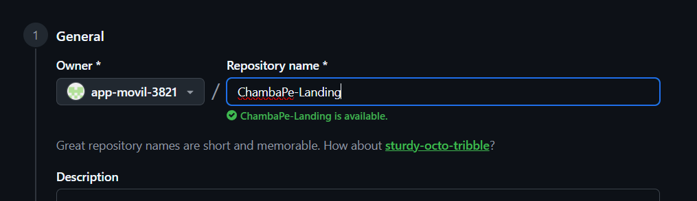

- **Paso 2: Creación del proyecto en WebStorm**

  Como segundo paso, se creó el proyecto en WebStorm, se importaron los features y se instalaron las dependencias necesarias.

  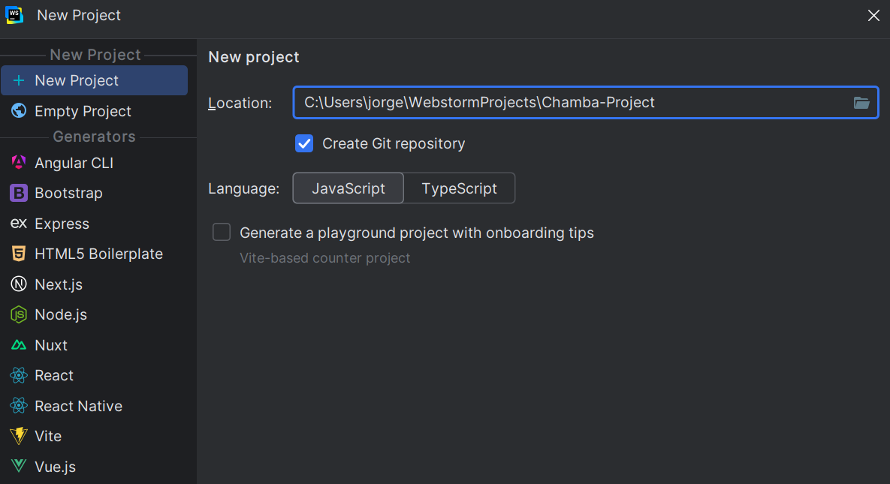

- **Paso 3: Carga de archivos necesarios**

  Como tercer paso, se importaron todos los archivos necesarios para el desarrollo del Landing Page, incluyendo imágenes, archivos HTML, CSS y JavaScript.

  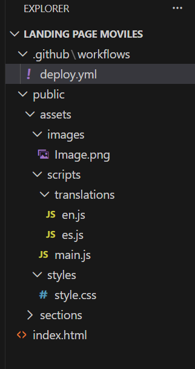

- **Paso 4: Preparar el lanzamiento**

  Como cuarto paso, se unificaron todas las características del proyecto en una sola rama para verificar el correcto funcionamiento. Luego, se envió todo a la rama principal del repositorio.

  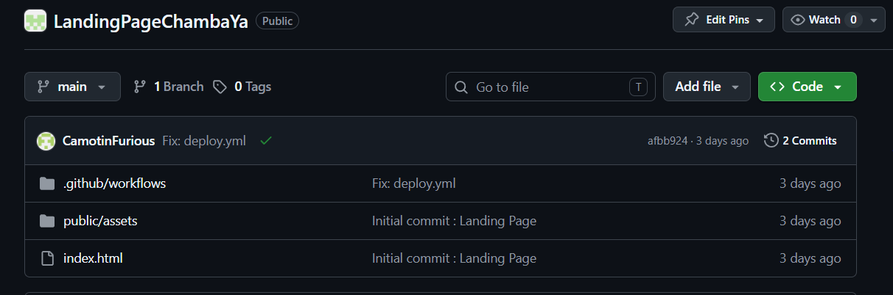

- **Paso 5: Desplegar la Landing Page**

  Como quinto paso, desde la sección de Configuración del repositorio en GitHub, se seleccionó la opción "GitHub Pages" y se eligió la rama principal como fuente de despliegue.

  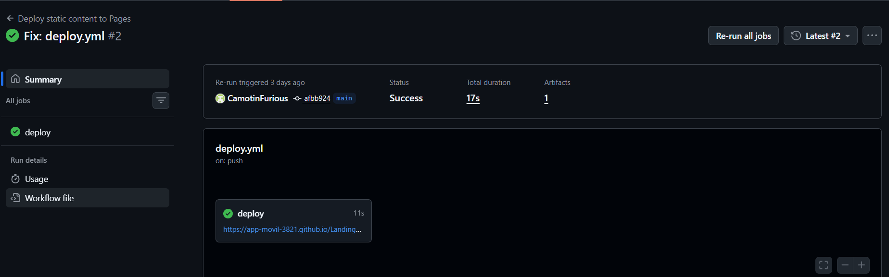

- **Paso 6: Acceder al Landing Page**

  Como paso final, GitHub Pages generó un enlace público para acceder al proyecto desplegado.

  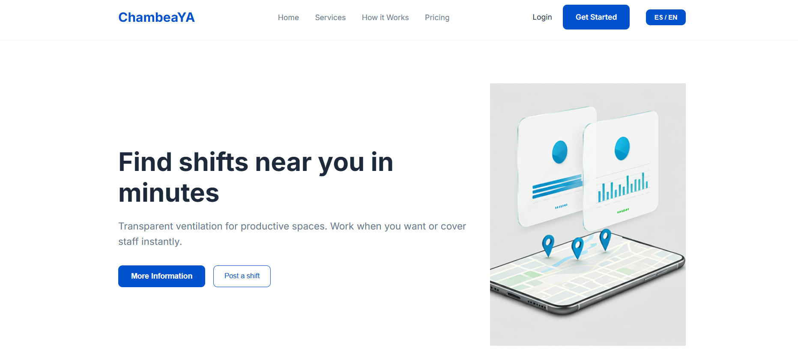

---

### Despliegue de la Base de Datos NoSQL (MongoDB Atlas)

- **Paso 1: Creación del proyecto en MongoDB Atlas**

  Como primer paso, se accedió a MongoDB Atlas y se creó un nuevo proyecto denominado **ChambaYa**, donde se alojarán los clusters y colecciones de la base de datos.

  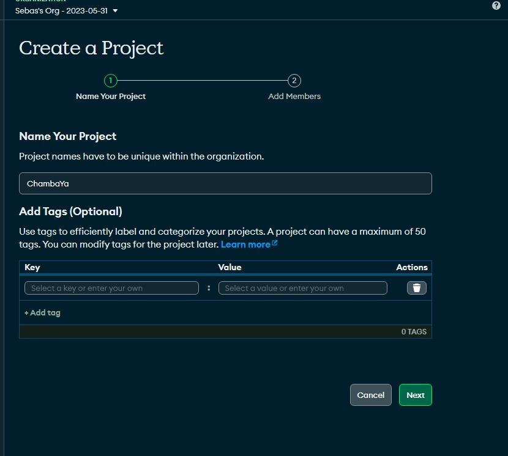

- **Paso 2: Despliegue del cluster**

  Como segundo paso, se configuró y desplegó el cluster de base de datos. Se seleccionó el plan **Free** con proveedor **AWS** en la región **N. Virginia (us-east-1)**, nombrando el cluster como `chambaya-Cluster`.

  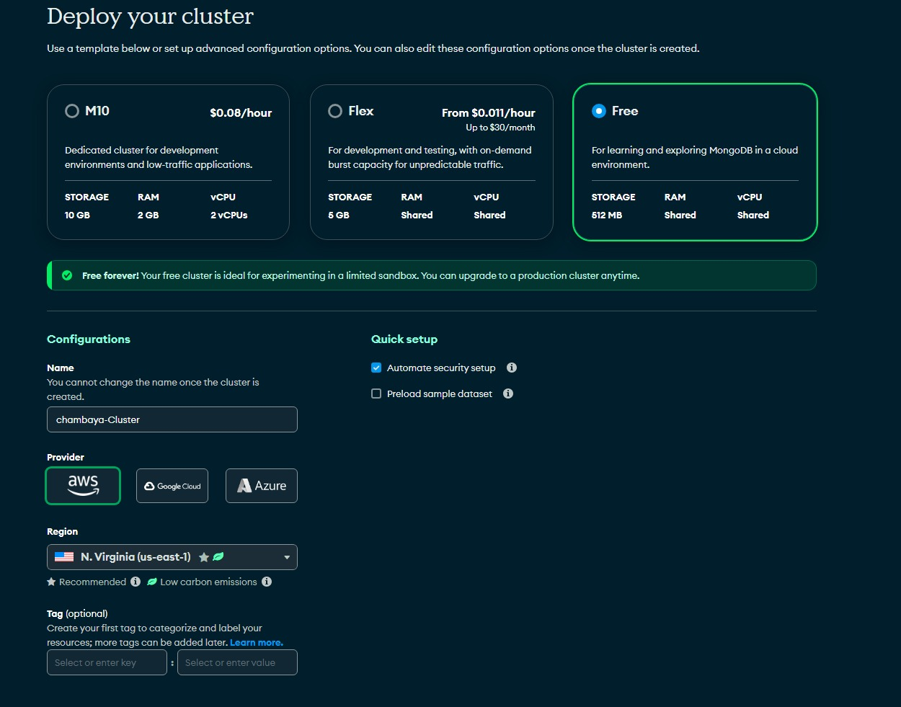

- **Paso 3: Creación del usuario de acceso**

  Como tercer paso, se creó un usuario de acceso con credenciales para la conexión segura entre el backend y la base de datos en la nube.

  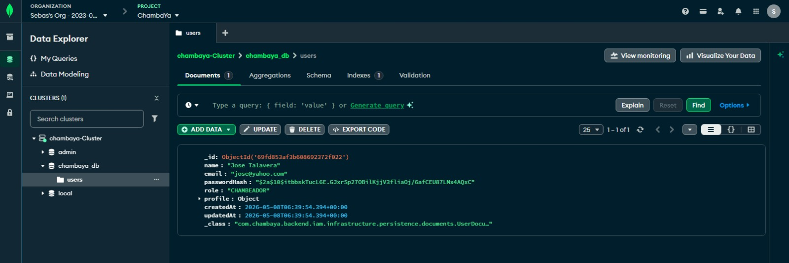

- **Paso 4: Configuración de las credenciales MongoDB**

  Como cuarto paso, se configuraron las credenciales de acceso al cluster, las cuales serán utilizadas como variables de entorno en el backend para la cadena de conexión `MONGODB_URI`.

  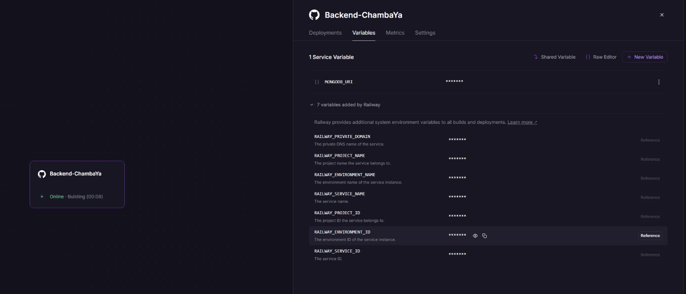

- **Paso 5: Verificación de datos en Atlas**

  Como paso final, se verificó en el Data Explorer de MongoDB Atlas que los documentos se almacenan correctamente en la colección `users` dentro de la base de datos `chambaya_db`, confirmando la conexión exitosa entre el backend y la base de datos.

  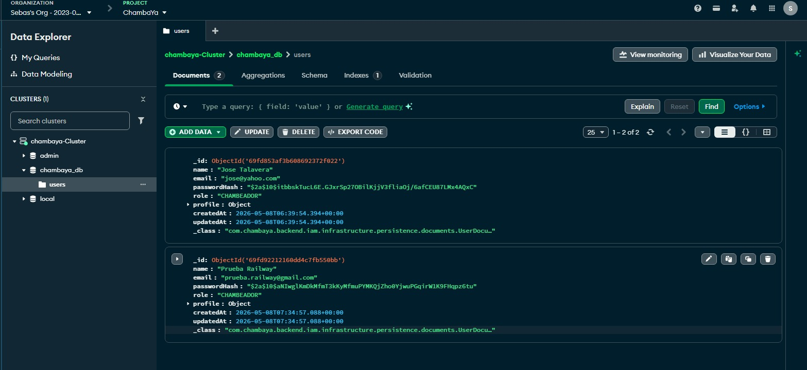

---

### Despliegue del Backend API (Railway)

- **Paso 1: Creación del proyecto en Spring Initializr**

  Como primer paso, se configuró el proyecto backend usando **Spring Initializr** con las siguientes especificaciones: lenguaje **Java 21**, Spring Boot **4.0.6**, empaquetado **JAR**, y las dependencias Spring Web, Spring Data MongoDB, Validation, Lombok, Spring Boot DevTools y Spring Security.

  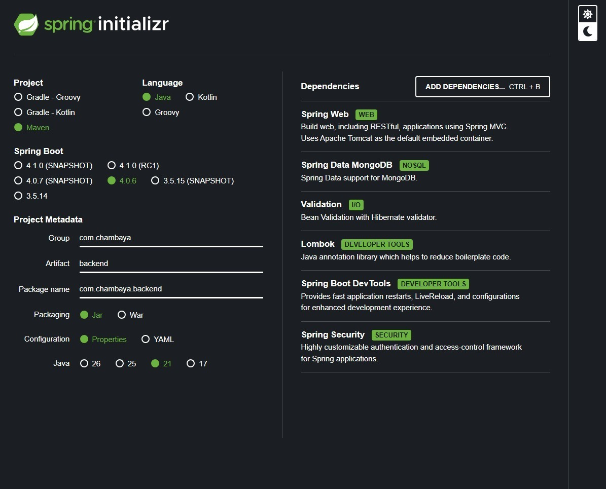

- **Paso 2: Creación del proyecto en Railway**

  Como segundo paso, se accedió a la plataforma **Railway** y se creó un nuevo proyecto donde se desplegará el backend de ChambaYA.

  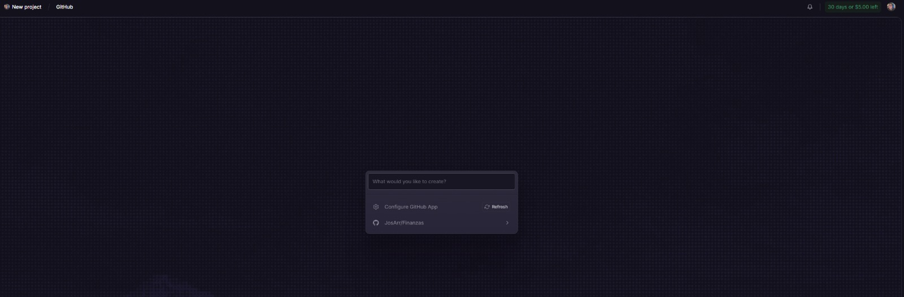

- **Paso 3: Instalación y autorización de Railway App en GitHub**

  Como tercer paso, se instaló y autorizó la **Railway App** en la organización de GitHub `app-movil-3821`, seleccionando únicamente el repositorio `Backend-ChambaYa` para el acceso controlado.

  

- **Paso 4: Selección del repositorio**

  Como cuarto paso, se seleccionó el repositorio `app-movil-3821/Backend-ChambaYa` desde Railway para iniciar el proceso de despliegue automático.

  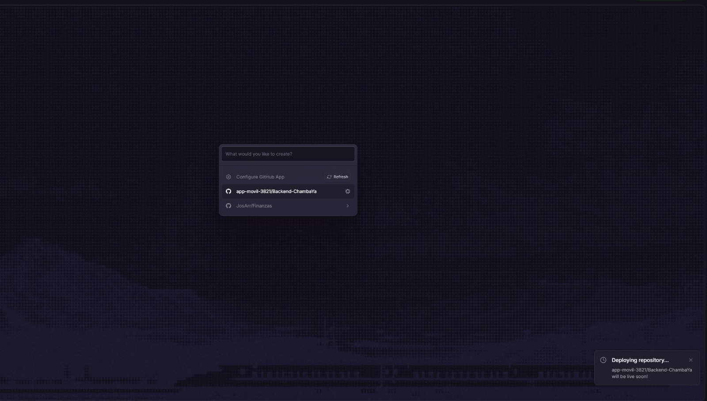

- **Paso 5: Configuración de variables de entorno**

  Como quinto paso, se configuró la variable de entorno `MONGODB_URI` en Railway con la cadena de conexión proporcionada por MongoDB Atlas, permitiendo que el backend se conecte correctamente a la base de datos en la nube.

  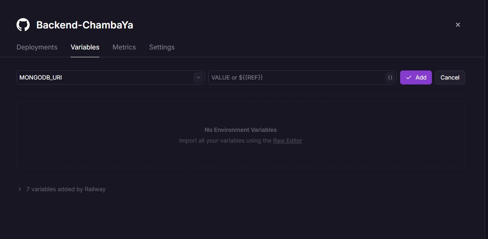

- **Paso 6: Generación del dominio público**

  Como sexto paso, desde la sección de configuración de Networking en Railway, se generó un dominio público para acceder al backend desplegado externamente.

  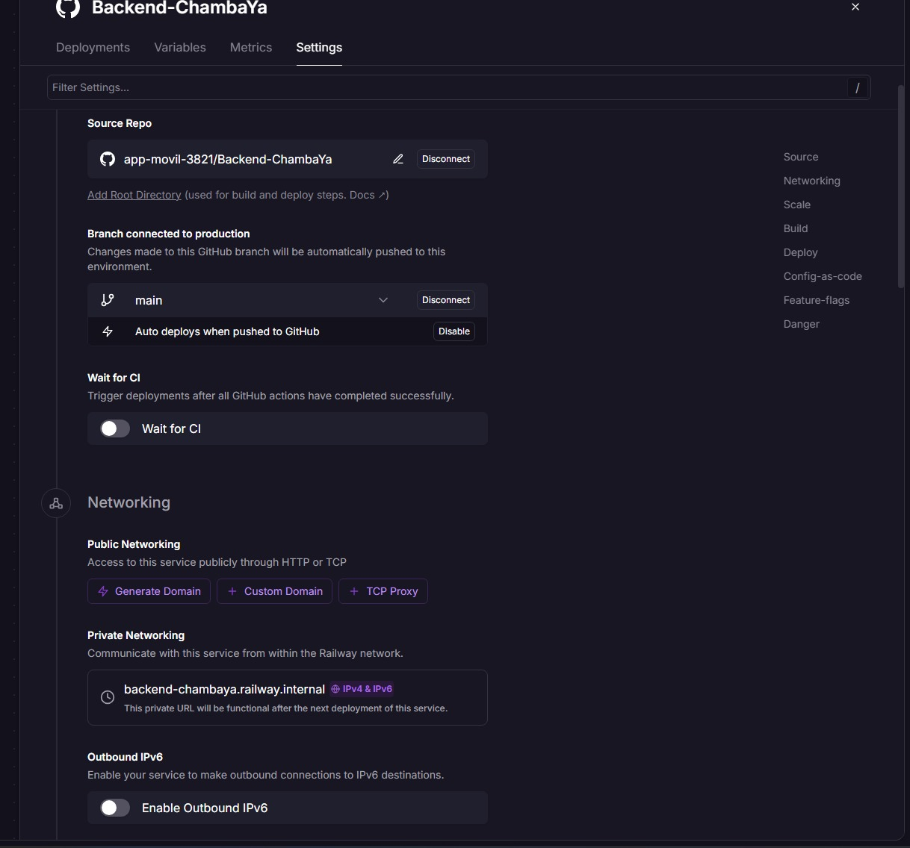

- **Paso 7: Verificación del despliegue**

  Como séptimo paso, se verificó que el backend se encuentra correctamente desplegado y en estado **Online** dentro de Railway, con conexión activa al repositorio en GitHub y despliegue automático configurado desde la rama `main`.

  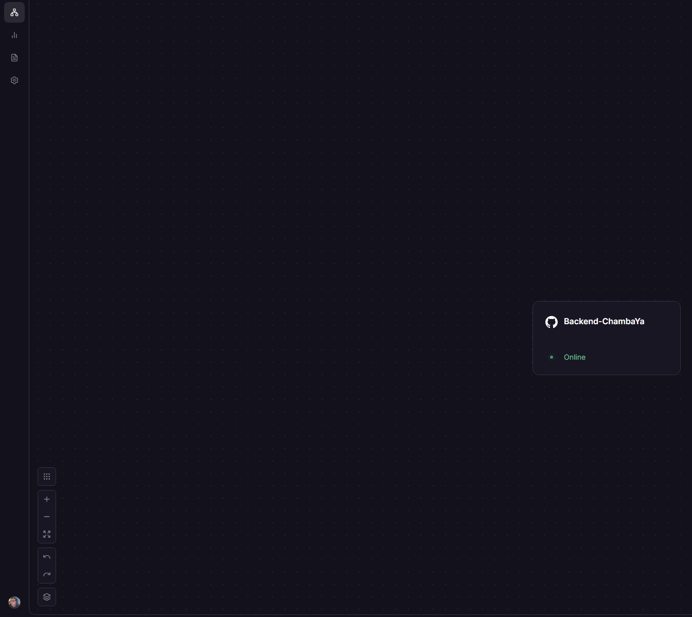

- **Paso 8: Verificación de los endpoints con Swagger**

  Como paso final, se verificó el correcto funcionamiento de los endpoints del backend accediendo a la documentación **Swagger UI** generada automáticamente. Se confirmó que el endpoint `GET /api/v1/users` retorna correctamente los datos de los usuarios registrados en la base de datos con código de respuesta **200 OK**.

  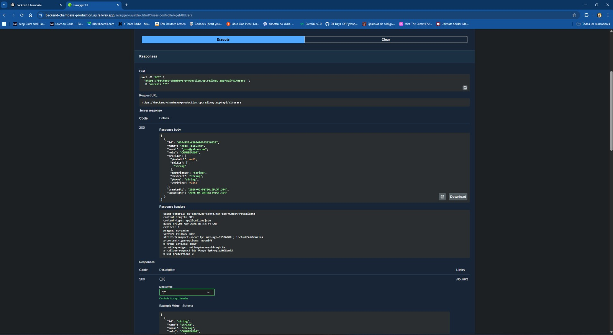

#### 4.2.1. Sprint `1`

En esta sección se explican los procesos para el desarrollo de la solución de software en el primer sprint. Se incluyen secciones de planeamiento, desarrollo, prueba y despliegue de la aplicación móvil Android nativa, el backend API y el Landing Page.


##### 4.2.1.1. Sprint Planning `1`

A continuación, se detalla la información sobre el planeamiento del primer sprint. El objetivo de este sprint se centra en el desarrollo y despliegue de la primera versión del Landing Page de ChambaYA, las primeras pantallas funcionales de la aplicación móvil nativa Android y los endpoints principales del backend API con un avance aproximado del 70%.


| Sprint #                   | Sprint 1                                                                                                                                                                                                                                                                                                                                                                                                                                                                                     |
|----------------------------|----------------------------------------------------------------------------------------------------------------------------------------------------------------------------------------------------------------------------------------------------------------------------------------------------------------------------------------------------------------------------------------------------------------------------------------------------------------------------------------------| 
| Sprint planning Background | --                                                                                                                                                                                                                                                                                                                                                                                                                                                                                           | 
| Date                       | 2026/05/11                                                                                                                                                                                                                                                                                                                                                                                                                                                                                   | 
| Time                       | 5:00 pm                                                                                                                                                                                                                                                                                                                                                                                                                                                                                      | 
| Location                   | Reunion en meet                                                                                                                                                                                                                                                                                                                                                                                                                                                                              | 
| Prepared By                | Taipe Sangama Jorge Francisco                                                                                                                                                                                                                                                                                                                                                                                                                                                                | 
| Attendes                   | Taipe Sangama Jorge Francisco / Cordova Valdivia Sebastian / 	Janampa Gutierrez Jhoan D.  / Bautista, Jose Diego /  Espinoza Chavez Moises                                                                                                                                                                                                                                                                                                                                                   | 
| Sprint Goal & User Stories |                                                                                                                                                                                                                                                                                                                                                                                                                                                                                              | 
| Sprint 1 Goal              | Nuestro enfoque está en desarrollar y desplegar el Landing Page de ChambaYA, implementar las pantallas principales de navegación de la aplicación móvil Android y avanzar en un 70% los endpoints del backend API. Creemos que esto entrega una base funcional y visible del producto a los stakeholders. Esto se confirmará cuando el Landing Page esté desplegado, la app muestre navegación entre pantallas clave y el backend responda correctamente a las solicitudes HTTP principales. | 
| Sprint 1 Velocity          | 40                                                                                                                                                                                                                                                                                                                                                                                                                                                                                           | 
| Sums of Story Points       | 40                                                                                                                                                                                                                                                                                                                                                                                                                                                                                           | 


**Aspect Liders and Colaborators**

En esta sección se incluye la matriz de liderazgo y colaboración para este sprint. La letra "L" indica que el miembro es líder del aspecto y se encarga de avanzar y revisar el trabajo de los colaboradores. La letra "C" indica que el miembro es colaborador y se encarga de desarrollar las funcionalidades asignadas.

| Team Member                    | GitHub Usernames | Landing Page | App Android | Backend API | Reporte |
|--------------------------------|------------------|--------------|-------------|------------|---------|
| Cordova Valdivia Sebastian     | Sevas04          |              | C           | C          | C       |
| Bautista Rivera Jose Diego     | Gogotes17        | L            | C           |            | C       |
| Janampa Gutierrez Jhoan D.     | orraiAKBDFSK     | C            | C           |            | C       |
| Taipe Sangama Jorge Francisco  | CamotinFurious   | L            | L           |            | L       |
| Espinoza Chavez Moises         | MoisesECh        |              |             |            | C       |


##### 4.2.1.2. Sprint Backlog `1`

El objetivo principal de este sprint es tener una versión funcional y desplegada del Landing Page, la navegación principal de la aplicación móvil Android con las pantallas core implementadas, y los endpoints principales del backend funcionando y documentados en Swagger.


Proyecto en Enlace al tablero de Trello: [Link de TRELLO](https://trello.com/invite/b/69e581bada404d81ccde530d/ATTI42a1d93366631bcc58f2fbcf4f6b8734D6B33942/product-backlog-chambaya)


A continuación, se presenta la tabla con las User Stories y tareas del Sprint 1:


| Sprint 1     | Sprint Backlog1 |                  |        |                                                                      |                    |              |        |
|--------------|-----------------|------------------|--------|----------------------------------------------------------------------|--------------------|--------------|--------|
| User Stories |                 | Work-Item / Task | Title  | Description                                                          | Estimation (Hours) | Assigned to  | Status |
| US01         |                 | T01              |  | Implementar pantalla de registro de chambeador                       | 4h                 | Jorge Taipe| Done |
| US01         |                 | T02              |  | Implementar endpoint POST /api/v1/users (registro)                   | 3h                 | Sebastián Córdova|  Done|
| US02         |                 | T03              |  | Implementar pantalla de perfil con selección de habilidades (Skills) | 4h                 | Jorge Taipe| Done |
| US03         |                 | T04              |  | Implementar pantalla Home Feed con lista de turnos cercanos          | 4h                 | Jorge Taipe| Done |
| US03         |                 | T05              |  | Implementar endpoint GET /api/v1/jobs (listado de turnos)            | 3h                 |Sebastián Córdova |  Done|
| US04         |                 | T06              |  | Implementar pantalla Job Details y botón de aceptar turno            | 4h                 |Sebastián Córdova |  Done|
| US04         |                 | T07              |  | Implementar pantalla Active Shift (turno en progreso)                | 3h                 | Sebastián Córdova|  Done|
| US05         |                 | T08              |  | Implementar pantalla Apply y confirmación de postulación             | 4h                 | Jhoan Janampa| Done |
| US05         |                 | T09              |  | Implementar endpoint POST /api/v1/enrollments                        | 3h                 | Sebastián Córdova|  Done|
| US11         |                 | T010             |  | Implementar pantalla Chat interno entre usuarios                     | 4h                 | Jhoan Janampa| Done |
| US12         |                 | T011             |  | Implementar pantalla Shift Summary con calificación del turno        | 4h                 | Jhoan Janampa| Done |
| US12         |                 | T012             |  | Implementar endpoint POST /api/v1/reviews                            | 3h                 | Sebastián Córdova| Done |
| US16         |                 | T013             |  | Implementar pantalla My Shifts (lista de turnos del usuario)         | 4h                 |Jose Diego Bautista | Done |
| US18         |                 | T014             |  | Implementar pantalla de detalle de trabajo con mapa y descripción    | 3h                 | Jose Diego Bautista|  Done|
| US29         |                 | T015             |  | Implementar endpoint GET /api/v1/users (listado de usuarios)         | 2h                 | Sebastián Córdova| Done |
| TP01         |                 | T016             |  | Desarrollar y desplegar Landing Page completo en GitHub Pages        | 6h                 |Jorge Taipe |Done  |
| TP01         |                 | T017             |  | Implementar pantalla de inicio (Start/Splash) y Login                | 3h                 |Jorge Taipe | Done |
| TP02         |                 | T018             |  | Documentar sección 4.3 Validation Interviews del reporte             | 4h                 | Moisés Espinoza| Done |


##### 4.2.1.3. Development Evidence for Sprint Review

En esta sección se describen los principales avances de implementación realizados en este primer sprint. Se tienen como principales avances la implementación del Backend API con Spring Boot y MongoDB, el desarrollo de las pantallas principales de la aplicación móvil Android nativa con Kotlin y Jetpack Compose, y la creación y despliegue del Landing Page.

Cada miembro del equipo avanzó en las diferentes áreas del proyecto: en el Backend se implementaron los endpoints principales usando Java y Spring Boot; en la aplicación Android se desarrollaron las pantallas principales y la navegación usando Kotlin y Jetpack Compose; y en el Landing Page se implementaron todas las secciones informativas.

| Repository            | Branch          | Commit Id | Commit Message                                                           | Committed On |
|-----------------------|-----------------|-----------|--------------------------------------------------------------------------|--------------|
| LandingPageChambaYa   |  main           | b1b0664   |  Initial commit : Landing Page                                           | 2026/05/03   |
| LandingPageChambaYa   | main            | afbb924   | Fix: deploy.yml                                                          | 2026/05/03   |
| LandingPageChambaYa   | main            | 308dd34   | Second Deploy                                                            | 2026/05/07   |
| ChambaYa-Kotlin       | feature/shift   | a66642e   | Merge remote-tracking branch 'origin/develop' into develop               | 2026/05/06   |
| ChambaYa-Kotlin       | feature/shift   | f67f6a4   | feat: implement core auth and home feed screens with detailed UI layouts | 2026/05/06   |
| ChambaYa-Kotlin       | feature/shift   | 749dd93   | feat: implement job details screen                                       | 2026/05/08   |
| ChambaYa-Kotlin       | feature/shift   | 097865c   | feat: implement job details screen                                       | 2026/05/08   |
| ChambaYa-Kotlin       | feature/shift   | 6592332   | feat: implement active shift screen                                      | 2026/05/08   |
| ChambaYa-Kotlin       | feature/shift   | 3ecae78   | feat: connect active shift flow                                          | 2026/05/08   |
| ChambaYa-Kotlin       | feature/shift   | d43abbb   | feat: implement core shift with detailed UI layouts                      | 2026/05/08   |
| ChambaYa-Kotlin       | feature/chat    | 3dd6c9d   | feat: implement chat screen UI components                                | 2026/05/09   |
| ChambaYa-Kotlin       | feature/profile | caa20d3   | feat: implement profile screen UI layout                                 | 2026/05/09   |
| Backend-ChambaYa      | develop         | 75b4d04   | chore: redirect root path to Swagger UI                                  | 2026/05/08   |
| Backend-ChambaYa      | develop         | aaf673e   | fix: use relative server URL for Swagger request                         | 2026/05/08   |
| Backend-ChambaYa      | develop         | 8d6470f   | chore: configure environment variables for deployment                    | 2026/05/08   |
| Backend-ChambaYa      | develop         | a78f4fd   | docs: add backend setup and API usage guide                              | 2026/05/08   |
| Backend-ChambaYa      | develop         | acd11e8   | feat: add nearby jobs endpoint                                           | 2026/05/08   |
| Backend-ChambaYa      | develop         | b811003   | feat: validate review creation rules                                     | 2026/05/08   |
| Backend-ChambaYa      | develop         | 4c228a5   | feat: validate enrollment creation rules                                 | 2026/05/08   |

##### 4.2.1.4. Testing Suite Evidence for Sprint Review

En esta sección se presenta el conjunto de pruebas implementadas durante el Sprint 1 para los Web Services del backend de ChambaYA. Para este primer sprint, se configuró la estructura base de pruebas utilizando **JUnit 5** (JUnit Jupiter) junto con la anotación `@SpringBootTest`, la cual permite verificar que el contexto de la aplicación Spring Boot se carga correctamente.

El archivo `BackendApplicationTests.java` fue generado como parte de la inicialización del proyecto en Spring Initializr y contiene el test de integración base `contextLoads()`, que verifica que todos los beans y configuraciones del contexto de la aplicación se inicializan sin errores. Este test fue ejecutado exitosamente, confirmando que la configuración del proyecto, la conexión con MongoDB Atlas y las dependencias declaradas en el `pom.xml` son correctas.

Para los siguientes sprints, se tiene planificado ampliar la suite de pruebas con Unit Tests para los servicios de cada Bounded Context (IAM, Jobs, Enrollments, Reviews) y Acceptance Tests bajo el enfoque BDD con archivos `.feature` en lenguaje Gherkin.

Repositorio de Testing: [Backend-ChambaYa](https://github.com/app-movil-3821/Backend-ChambaYa)

| Repository | Branch | Commit Id | Commit Message | Committed On |
|---|---|---|---|---|
| Backend-ChambaYa | develop | 75b4d04 | chore: initialize Spring Boot backend project | 2026/05/06 |

##### 4.2.1.5. Execution Evidence for Sprint Review

En esta sección se presenta la evidencia de ejecución de los productos implementados en este sprint. Los logros incluyen el desarrollo y despliegue del Landing Page, las pantallas principales de la aplicación Android y los endpoints del backend API desplegado en Railway.

A continuación, se muestran las capturas de pantalla y enlaces de acceso a cada producto implementado. Estas evidencias reflejan el progreso realizado en el sprint y sirven como comprobante del trabajo completado.
 
---

### Landing Page

Sitio web estático desplegado: https://app-movil-3821.github.io/LandingPageChambaYa/

La Landing Page de ChambaYA presenta todas las secciones informativas del producto, incluyendo la propuesta de valor, servicios, cómo funciona, planes de precios, información del equipo y formulario de contacto.

**Home:**

La sección principal presenta el hero de la landing page con el mensaje principal de ChambaYA y las llamadas a la acción para los dos segmentos objetivo: chambeadores y contratantes.

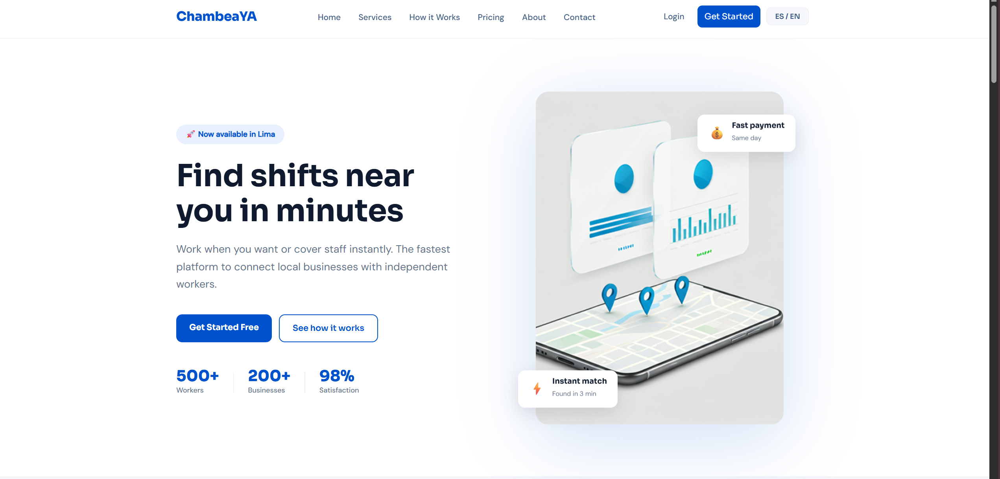
 
---

**Services:**

Esta sección describe los servicios principales que ofrece la plataforma, destacando la conexión inmediata entre MYPEs y jóvenes trabajadores mediante geolocalización.

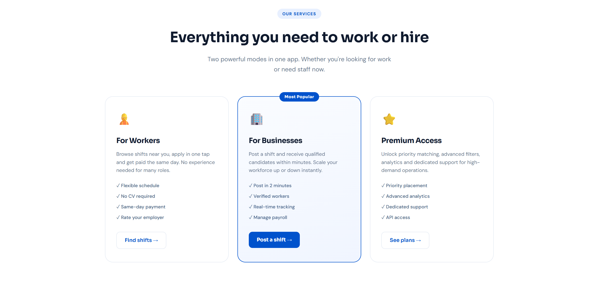
 
---

**How it Works:**

Esta sección explica de forma visual y paso a paso el proceso de uso de ChambaYA, tanto para chambeadores como para contratantes.

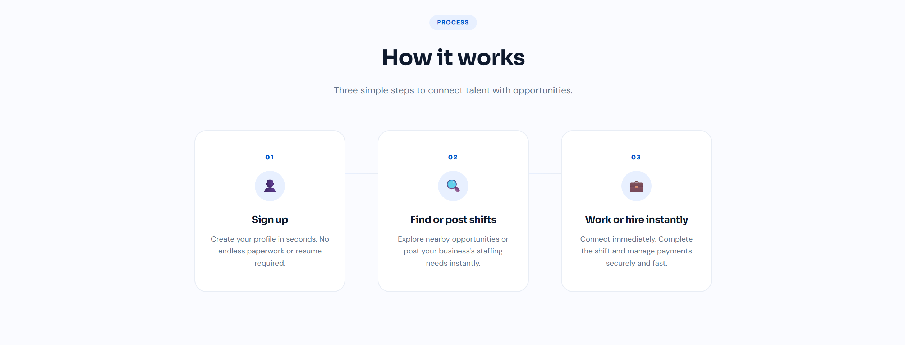
 
---

**Pricing:**

Esta sección presenta los planes de suscripción disponibles para los contratantes, con sus características y precios diferenciados.

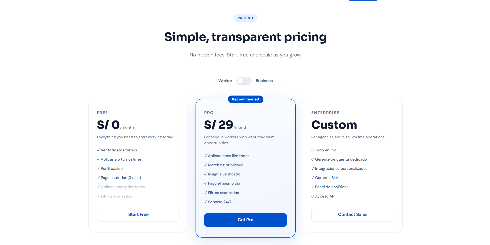
 
---

**About Us:**

Esta sección presenta al equipo detrás de ChambaYA, incluyendo la misión, visión y los integrantes del startup.

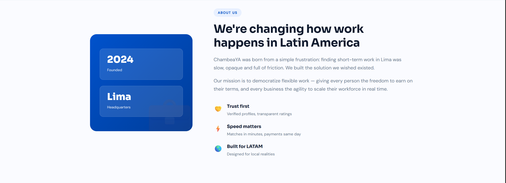
 
---

**Contact Us:**

Esta sección incluye un formulario de contacto para que los usuarios interesados puedan comunicarse con el equipo de ChambaYA.

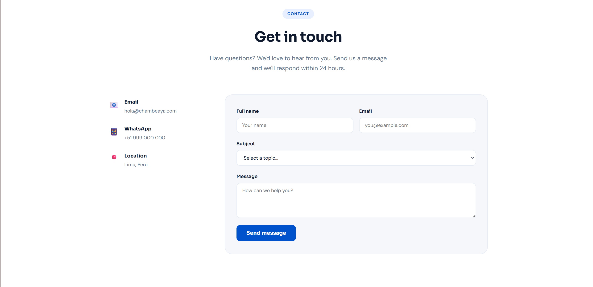
 
---

**Footer:**

El pie de página incluye los enlaces de navegación, redes sociales y la información legal del sitio web.

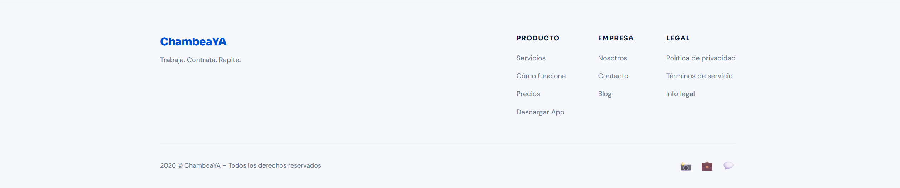
 
---

### Aplicación Android

La aplicación móvil nativa para Android fue desarrollada con Kotlin y Jetpack Compose. A continuación se presentan las pantallas implementadas durante este sprint, organizadas según el flujo de usuario.

**Start (Splash Screen):**

Pantalla inicial de la aplicación que muestra el logo de ChambaYA al abrir la app, antes de redirigir al usuario a la pantalla de login o registro.

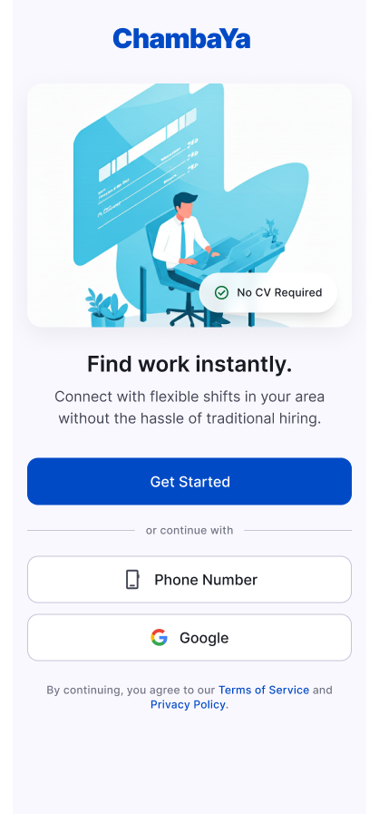
 
---

**Login:**

Pantalla de inicio de sesión donde el usuario ingresa su correo y contraseña para acceder a la plataforma. Incluye opción de registro para nuevos usuarios.

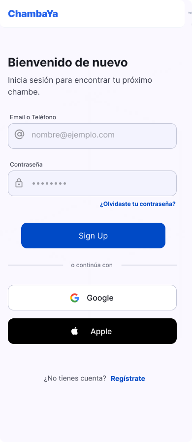
 
---

**Register:**

Pantalla de registro donde el nuevo usuario ingresa sus datos personales para crear una cuenta en ChambaYA, seleccionando si es chambeador o contratante.

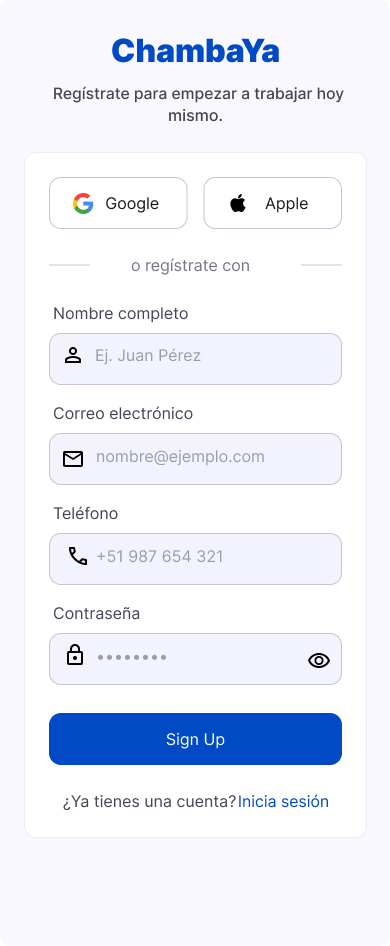
 
---

**Skills:**

Pantalla de configuración del perfil basado en habilidades. El chambeador selecciona mediante etiquetas (tags) las habilidades que puede ofrecer, eliminando la necesidad de un CV tradicional.

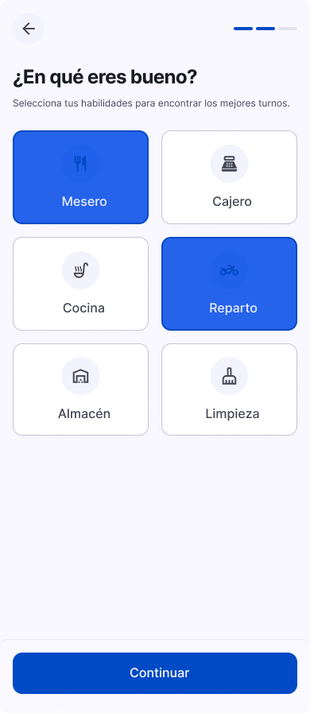
 
---

**Home Feed:**

Pantalla principal del chambeador que muestra el listado de turnos disponibles cercanos a su ubicación, con información de pago, horario y distancia.


 
---

**Job Details:**

Pantalla de detalle de un turno específico, mostrando la descripción completa del trabajo, ubicación en mapa, pago por hora y botón para aceptar el turno.


 
---

**Active Shift:**

Pantalla que muestra el turno activo en progreso, con el tiempo transcurrido, información del negocio contratante y opciones para confirmar llegada o pedir ayuda.


 
---

**Apply:**

Pantalla de confirmación de postulación a un turno, donde el chambeador revisa los detalles finales antes de confirmar su aplicación al trabajo.

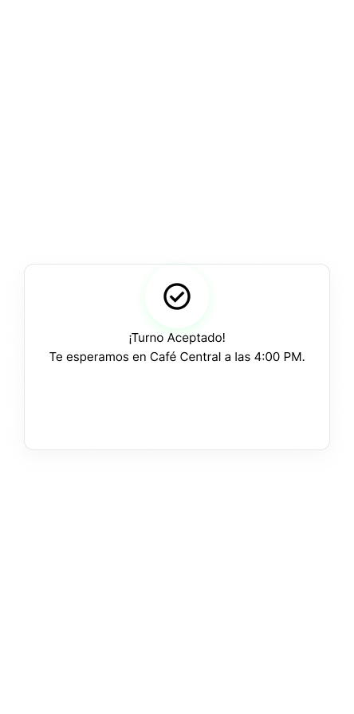
 
---

**Shift Summary:**

Pantalla de resumen al finalizar un turno, mostrando las ganancias del día y el formulario de calificación para el contratante mediante el sistema de reputación bidireccional.


 
---

**My Shifts:**

Pantalla con el historial de turnos del chambeador, mostrando los trabajos completados, pagos recibidos y el estado de cada turno.


 
---

**Chat:**

Pantalla del chat interno temporal entre el chambeador y el contratante, habilitado únicamente cuando el turno ha sido aceptado para coordinar los detalles del trabajo.

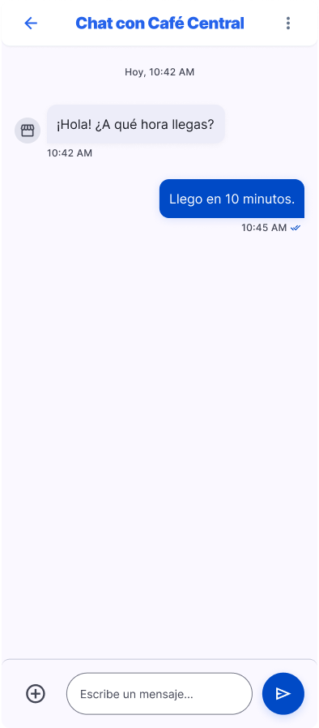
 
---

**Profile View:**

Pantalla de perfil del chambeador que muestra su reputación, habilidades registradas, historial de turnos completados y opciones de configuración de la cuenta.


 
---

### Backend API

Aplicación Backend desplegada: https://backend-chambaya-production.up.railway.app/swagger-ui/index.html#/

El backend de ChambaYA fue desarrollado con Java y Spring Boot, desplegado en Railway con MongoDB Atlas como base de datos. A continuación se presentan los controllers implementados y documentados mediante Swagger UI.

**User Controller:**

Controller que gestiona el registro, autenticación y consulta de usuarios de la plataforma, tanto chambeadores como contratantes.

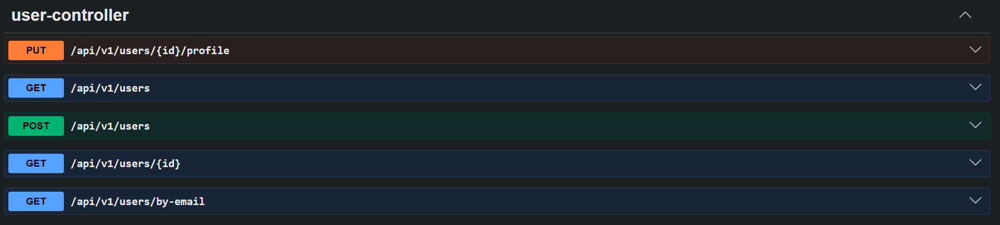
 
---

**Job Controller:**

Controller que gestiona la publicación, consulta y búsqueda de turnos disponibles, incluyendo el endpoint de trabajos cercanos por geolocalización.

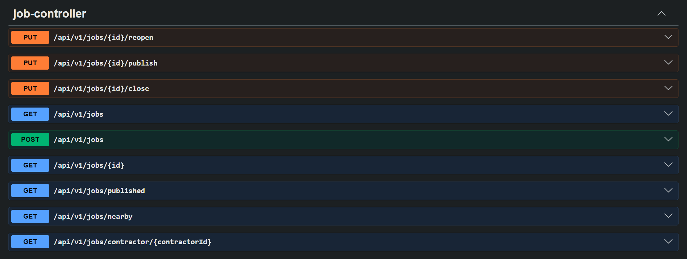
 
---

**Enrollment Controller:**

Controller que gestiona las postulaciones de los chambeadores a los turnos publicados, incluyendo la aceptación y rechazo de postulantes.

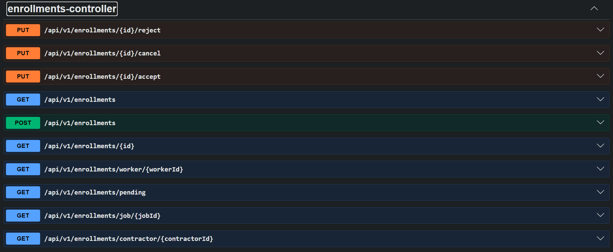
 
---

**Reviews Controller:**

Controller que gestiona el sistema de calificaciones y reseñas mutuas entre chambeadores y contratantes al finalizar cada turno.

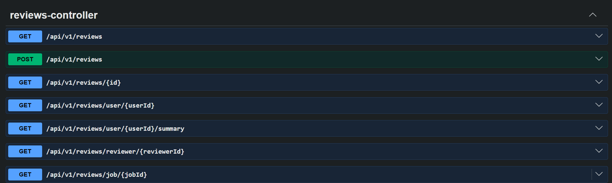
##### 4.2.1.6. Services Documentation Evidence for Sprint Review

En esta sección se presenta la documentación de los endpoints implementados en el backend de **ChambaYa** durante el Sprint Review. La evidencia permite identificar los servicios disponibles, el módulo al que pertenecen, el verbo HTTP utilizado, la sintaxis de consumo, los parámetros principales y el enlace de acceso a Swagger para su validación.

A continuación, se muestra la tabla de endpoints desarrollados para los módulos **IAM**, **Jobs**, **Enrollments** y **Reputation**.

| Módulo | Endpoint | Acción | Verbo HTTP | Sintaxis | Parámetros principales | Enlace a Swagger |
|---|---|---|---|---|---|---|
| IAM | `/api/v1/users` | Registrar un nuevo usuario en la plataforma | POST | `/api/v1/users` | Body: `name`, `email`, `password`, `role`, `skills`, `experience`, `district`, `phone` | https://backend-chambaya-production.up.railway.app/swagger-ui.html |
| IAM | `/api/v1/users` | Obtener la lista de usuarios registrados | GET | `/api/v1/users` | - | https://backend-chambaya-production.up.railway.app/swagger-ui.html |
| IAM | `/api/v1/users/{id}` | Obtener un usuario por su identificador | GET | `/api/v1/users/123` | `id` | https://backend-chambaya-production.up.railway.app/swagger-ui.html |
| IAM | `/api/v1/users/by-email` | Obtener un usuario por correo electrónico | GET | `/api/v1/users/by-email?email=user@email.com` | `email` | https://backend-chambaya-production.up.railway.app/swagger-ui.html |
| IAM | `/api/v1/users/{id}/profile` | Actualizar el perfil de un usuario | PUT | `/api/v1/users/123/profile` | `id`, Body: `photoUrl`, `skills`, `experience`, `district`, `phone`, `verified` | https://backend-chambaya-production.up.railway.app/swagger-ui.html |
| Jobs | `/api/v1/jobs` | Crear un nuevo trabajo o turno publicado por un contratante | POST | `/api/v1/jobs` | Body: `contractorId`, `title`, `description`, `category`, `requiredSkills`, `paymentAmount`, `latitude`, `longitude`, `address`, `district`, `scheduledStart`, `scheduledEnd` | https://backend-chambaya-production.up.railway.app/swagger-ui.html |
| Jobs | `/api/v1/jobs` | Obtener todos los trabajos registrados | GET | `/api/v1/jobs` | - | https://backend-chambaya-production.up.railway.app/swagger-ui.html |
| Jobs | `/api/v1/jobs/{id}` | Obtener un trabajo por su identificador | GET | `/api/v1/jobs/123` | `id` | https://backend-chambaya-production.up.railway.app/swagger-ui.html |
| Jobs | `/api/v1/jobs/contractor/{contractorId}` | Obtener los trabajos publicados por un contratante | GET | `/api/v1/jobs/contractor/123` | `contractorId` | https://backend-chambaya-production.up.railway.app/swagger-ui.html |
| Jobs | `/api/v1/jobs/published` | Obtener los trabajos publicados disponibles | GET | `/api/v1/jobs/published` | - | https://backend-chambaya-production.up.railway.app/swagger-ui.html |
| Jobs | `/api/v1/jobs/nearby` | Obtener trabajos cercanos según coordenadas y radio | GET | `/api/v1/jobs/nearby?latitude=-12.1211&longitude=-77.0305&radiusKm=10` | `latitude`, `longitude`, `radiusKm` | https://backend-chambaya-production.up.railway.app/swagger-ui.html |
| Jobs | `/api/v1/jobs/{id}/publish` | Cambiar el estado de un trabajo a publicado | PUT | `/api/v1/jobs/123/publish` | `id` | https://backend-chambaya-production.up.railway.app/swagger-ui.html |
| Jobs | `/api/v1/jobs/{id}/close` | Cerrar un trabajo publicado | PUT | `/api/v1/jobs/123/close` | `id` | https://backend-chambaya-production.up.railway.app/swagger-ui.html |
| Jobs | `/api/v1/jobs/{id}/reopen` | Reabrir un trabajo cerrado o cancelado | PUT | `/api/v1/jobs/123/reopen` | `id` | https://backend-chambaya-production.up.railway.app/swagger-ui.html |
| Enrollments | `/api/v1/enrollments` | Registrar la postulación de un chambeador a un trabajo | POST | `/api/v1/enrollments` | Body: `jobId`, `workerId`, `contractorId` | https://backend-chambaya-production.up.railway.app/swagger-ui.html |
| Enrollments | `/api/v1/enrollments` | Obtener todas las postulaciones registradas | GET | `/api/v1/enrollments` | - | https://backend-chambaya-production.up.railway.app/swagger-ui.html |
| Enrollments | `/api/v1/enrollments/{id}` | Obtener una postulación por su identificador | GET | `/api/v1/enrollments/123` | `id` | https://backend-chambaya-production.up.railway.app/swagger-ui.html |
| Enrollments | `/api/v1/enrollments/job/{jobId}` | Obtener las postulaciones asociadas a un trabajo | GET | `/api/v1/enrollments/job/123` | `jobId` | https://backend-chambaya-production.up.railway.app/swagger-ui.html |
| Enrollments | `/api/v1/enrollments/worker/{workerId}` | Obtener las postulaciones realizadas por un chambeador | GET | `/api/v1/enrollments/worker/123` | `workerId` | https://backend-chambaya-production.up.railway.app/swagger-ui.html |
| Enrollments | `/api/v1/enrollments/contractor/{contractorId}` | Obtener las postulaciones asociadas a los trabajos de un contratante | GET | `/api/v1/enrollments/contractor/123` | `contractorId` | https://backend-chambaya-production.up.railway.app/swagger-ui.html |
| Enrollments | `/api/v1/enrollments/pending` | Obtener las postulaciones pendientes | GET | `/api/v1/enrollments/pending` | - | https://backend-chambaya-production.up.railway.app/swagger-ui.html |
| Enrollments | `/api/v1/enrollments/{id}/accept` | Aceptar una postulación y actualizar el trabajo a estado `MATCHED` | PUT | `/api/v1/enrollments/123/accept` | `id` | https://backend-chambaya-production.up.railway.app/swagger-ui.html |
| Enrollments | `/api/v1/enrollments/{id}/reject` | Rechazar una postulación | PUT | `/api/v1/enrollments/123/reject` | `id` | https://backend-chambaya-production.up.railway.app/swagger-ui.html |
| Enrollments | `/api/v1/enrollments/{id}/cancel` | Cancelar una postulación realizada | PUT | `/api/v1/enrollments/123/cancel` | `id` | https://backend-chambaya-production.up.railway.app/swagger-ui.html |
| Reputation | `/api/v1/reviews` | Registrar una calificación o reseña entre usuarios | POST | `/api/v1/reviews` | Body: `jobId`, `reviewerId`, `reviewedUserId`, `rating`, `comment` | https://backend-chambaya-production.up.railway.app/swagger-ui.html |
| Reputation | `/api/v1/reviews` | Obtener todas las reseñas registradas | GET | `/api/v1/reviews` | - | https://backend-chambaya-production.up.railway.app/swagger-ui.html |
| Reputation | `/api/v1/reviews/{id}` | Obtener una reseña por su identificador | GET | `/api/v1/reviews/123` | `id` | https://backend-chambaya-production.up.railway.app/swagger-ui.html |
| Reputation | `/api/v1/reviews/job/{jobId}` | Obtener las reseñas asociadas a un trabajo | GET | `/api/v1/reviews/job/123` | `jobId` | https://backend-chambaya-production.up.railway.app/swagger-ui.html |
| Reputation | `/api/v1/reviews/reviewer/{reviewerId}` | Obtener las reseñas realizadas por un usuario | GET | `/api/v1/reviews/reviewer/123` | `reviewerId` | https://backend-chambaya-production.up.railway.app/swagger-ui.html |
| Reputation | `/api/v1/reviews/user/{userId}` | Obtener las reseñas recibidas por un usuario | GET | `/api/v1/reviews/user/123` | `userId` | https://backend-chambaya-production.up.railway.app/swagger-ui.html |
| Reputation | `/api/v1/reviews/user/{userId}/summary` | Obtener el promedio y total de reseñas de un usuario | GET | `/api/v1/reviews/user/123/summary` | `userId` | https://backend-chambaya-production.up.railway.app/swagger-ui.html |


## Ejemplos Detallados

### IAM

#### 1. Registrar un nuevo usuario

- **Endpoint:** `POST /api/v1/users`
- **Descripción:** Registra un nuevo usuario en la plataforma ChambaYa. El usuario puede tener el rol de `CHAMBEADOR` o `CONTRATANTE`, según el tipo de cuenta creada.

**Ruta**

```http
POST /api/v1/users
```

**Solicitud**

```json
{
  "name": "Diego Salazar",
  "email": "diego.salazar.worker@gmail.com",
  "password": "123456",
  "role": "CHAMBEADOR",
  "skills": ["atención al cliente", "limpieza", "rapidez"],
  "experience": "Apoyo en cafeterías y restaurantes",
  "district": "Miraflores",
  "phone": "911222333"
}
```

**Respuesta 201 Created**

```json
{
  "id": "69fb...",
  "name": "Diego Salazar",
  "email": "diego.salazar.worker@gmail.com",
  "role": "CHAMBEADOR",
  "profile": {
    "photoUrl": null,
    "skills": ["atención al cliente", "limpieza", "rapidez"],
    "experience": "Apoyo en cafeterías y restaurantes",
    "district": "Miraflores",
    "phone": "911222333",
    "verified": false
  },
  "createdAt": "2026-05-08T16:00:00",
  "updatedAt": "2026-05-08T16:00:00"
}
```

**Errores comunes**

- `400 Bad Request`: El correo ya se encuentra registrado.
- `400 Bad Request`: Faltan campos obligatorios o el formato del correo no es válido.

---

### Jobs

#### 2. Crear un nuevo trabajo o turno

- **Endpoint:** `POST /api/v1/jobs`
- **Descripción:** Permite que un usuario con rol `CONTRATANTE` publique un nuevo trabajo temporal o turno corto. El backend valida que el `contractorId` pertenezca a un usuario existente con rol `CONTRATANTE`.

**Ruta**

```http
POST /api/v1/jobs
```

**Solicitud**

```json
{
  "contractorId": "ID_DEL_CONTRATANTE",
  "title": "Apoyo para atención en cafetería",
  "description": "Se necesita apoyo para atención de clientes y limpieza básica.",
  "category": "Atención al cliente",
  "requiredSkills": ["atención al cliente", "limpieza", "rapidez"],
  "paymentAmount": 60,
  "latitude": -12.1211,
  "longitude": -77.0305,
  "address": "Av. Larco 450",
  "district": "Miraflores",
  "scheduledStart": "2026-05-08T16:00:00",
  "scheduledEnd": "2026-05-08T21:00:00"
}
```

**Respuesta 201 Created**

```json
{
  "id": "69fd...",
  "contractorId": "ID_DEL_CONTRATANTE",
  "title": "Apoyo para atención en cafetería",
  "description": "Se necesita apoyo para atención de clientes y limpieza básica.",
  "category": "Atención al cliente",
  "requiredSkills": ["atención al cliente", "limpieza", "rapidez"],
  "paymentAmount": 60,
  "location": {
    "latitude": -12.1211,
    "longitude": -77.0305,
    "address": "Av. Larco 450",
    "district": "Miraflores"
  },
  "scheduledStart": "2026-05-08T16:00:00",
  "scheduledEnd": "2026-05-08T21:00:00",
  "status": "PUBLISHED",
  "createdAt": "2026-05-08T16:10:00",
  "updatedAt": "2026-05-08T16:10:00"
}
```

**Errores comunes**

- `400 Bad Request`: El usuario indicado no existe.
- `400 Bad Request`: El usuario no tiene rol `CONTRATANTE`.
- `400 Bad Request`: Faltan campos obligatorios del trabajo.

---

#### 3. Consultar trabajos cercanos para el mapa

- **Endpoint:** `GET /api/v1/jobs/nearby`
- **Descripción:** Devuelve los trabajos disponibles cercanos a una ubicación determinada. Este servicio permite que la aplicación móvil muestre trabajos en un mapa usando coordenadas geográficas.

**Ruta**

```http
GET /api/v1/jobs/nearby?latitude=-12.1211&longitude=-77.0305&radiusKm=10
```

**Parámetros**

```txt
latitude: latitud actual del usuario
longitude: longitud actual del usuario
radiusKm: radio de búsqueda en kilómetros
```

**Respuesta 200 OK**

```json
[
  {
    "id": "69fd...",
    "contractorId": "ID_DEL_CONTRATANTE",
    "title": "Apoyo para atención en cafetería",
    "description": "Se necesita apoyo para atención de clientes y limpieza básica.",
    "category": "Atención al cliente",
    "requiredSkills": ["atención al cliente", "limpieza", "rapidez"],
    "paymentAmount": 60,
    "location": {
      "latitude": -12.1211,
      "longitude": -77.0305,
      "address": "Av. Larco 450",
      "district": "Miraflores"
    },
    "scheduledStart": "2026-05-08T16:00:00",
    "scheduledEnd": "2026-05-08T21:00:00",
    "status": "PUBLISHED",
    "createdAt": "2026-05-08T16:10:00",
    "updatedAt": "2026-05-08T16:10:00"
  }
]
```

**Errores comunes**

- `400 Bad Request`: El radio de búsqueda debe ser mayor a cero.
- `200 OK`: Retorna una lista vacía si no existen trabajos cercanos disponibles.

---

### Enrollments

#### 4. Registrar postulación a un trabajo

- **Endpoint:** `POST /api/v1/enrollments`
- **Descripción:** Permite que un chambeador postule a un trabajo publicado. El backend valida que el trabajo exista, que el usuario tenga rol `CHAMBEADOR`, que el contratante tenga rol `CONTRATANTE` y que el contratante sea dueño del trabajo.

**Ruta**

```http
POST /api/v1/enrollments
```

**Solicitud**

```json
{
  "jobId": "ID_DEL_JOB",
  "workerId": "ID_DEL_CHAMBEADOR",
  "contractorId": "ID_DEL_CONTRATANTE"
}
```

**Respuesta 201 Created**

```json
{
  "id": "69fe...",
  "jobId": "ID_DEL_JOB",
  "workerId": "ID_DEL_CHAMBEADOR",
  "contractorId": "ID_DEL_CONTRATANTE",
  "status": "PENDING",
  "appliedAt": "2026-05-08T16:20:00",
  "decidedAt": null,
  "updatedAt": "2026-05-08T16:20:00"
}
```

**Errores comunes**

- `400 Bad Request`: El trabajo no existe.
- `400 Bad Request`: El usuario no tiene rol `CHAMBEADOR`.
- `400 Bad Request`: El contratante no tiene rol `CONTRATANTE`.
- `400 Bad Request`: El contratante no es dueño del trabajo.
- `400 Bad Request`: El chambeador ya postuló a ese trabajo.

---

#### 5. Aceptar una postulación

- **Endpoint:** `PUT /api/v1/enrollments/{id}/accept`
- **Descripción:** Permite que el contratante acepte una postulación. Al aceptar una postulación, esta cambia a estado `ACCEPTED`, el trabajo relacionado cambia a `MATCHED` y las demás postulaciones pendientes del mismo trabajo pasan a `REJECTED`.

**Ruta**

```http
PUT /api/v1/enrollments/ID_DEL_ENROLLMENT/accept
```

**Respuesta 200 OK**

```json
{
  "id": "ID_DEL_ENROLLMENT",
  "jobId": "ID_DEL_JOB",
  "workerId": "ID_DEL_CHAMBEADOR",
  "contractorId": "ID_DEL_CONTRATANTE",
  "status": "ACCEPTED",
  "appliedAt": "2026-05-08T16:20:00",
  "decidedAt": "2026-05-08T16:30:00",
  "updatedAt": "2026-05-08T16:30:00"
}
```

**Errores comunes**

- `400 Bad Request`: La postulación no existe.
- `409 Conflict`: Solo las postulaciones pendientes pueden ser aceptadas.
- `400 Bad Request`: El trabajo relacionado no existe.

---

### Reputation

#### 6. Registrar una reseña

- **Endpoint:** `POST /api/v1/reviews`
- **Descripción:** Registra una calificación entre usuarios relacionada con un trabajo. El sistema valida que el trabajo exista, que los usuarios existan, que el usuario no se califique a sí mismo y que no exista una reseña duplicada para el mismo trabajo y usuarios.

**Ruta**

```http
POST /api/v1/reviews
```

**Solicitud**

```json
{
  "jobId": "ID_DEL_JOB",
  "reviewerId": "ID_DEL_CONTRATANTE",
  "reviewedUserId": "ID_DEL_CHAMBEADOR",
  "rating": 5,
  "comment": "Cumplió correctamente con el turno y tuvo buena actitud."
}
```

**Respuesta 201 Created**

```json
{
  "id": "69ff...",
  "jobId": "ID_DEL_JOB",
  "reviewerId": "ID_DEL_CONTRATANTE",
  "reviewedUserId": "ID_DEL_CHAMBEADOR",
  "rating": 5,
  "comment": "Cumplió correctamente con el turno y tuvo buena actitud.",
  "createdAt": "2026-05-08T16:40:00"
}
```

**Errores comunes**

- `400 Bad Request`: El trabajo no existe.
- `400 Bad Request`: El usuario que califica no existe.
- `400 Bad Request`: El usuario calificado no existe.
- `400 Bad Request`: El usuario no puede calificarse a sí mismo.
- `400 Bad Request`: La reseña ya existe para ese trabajo y usuarios.
- `400 Bad Request`: La calificación debe estar entre 1 y 5.

---

#### 7. Consultar resumen de reputación

- **Endpoint:** `GET /api/v1/reviews/user/{userId}/summary`
- **Descripción:** Devuelve el promedio de calificaciones y la cantidad total de reseñas recibidas por un usuario.

**Ruta**

```http
GET /api/v1/reviews/user/ID_DEL_USUARIO/summary
```

**Respuesta 200 OK**

```json
{
  "userId": "ID_DEL_USUARIO",
  "averageRating": 5.0,
  "totalReviews": 1
}
```

**Errores comunes**

- `200 OK`: Si el usuario no tiene reseñas, retorna promedio `0.0` y total `0`.

---

##### 4.2.1.7. Software Deployment Evidence for Sprint Review


### Despliegue de la Landing Page

- **Paso 1: Creación del repositorio**

  Como primer paso, se creó el repositorio en GitHub que aloja todo lo relacionado al Landing Page.

  

- **Paso 2: Creación del proyecto en WebStorm**

  Como segundo paso, se creó el proyecto en WebStorm, se importaron los features y se instalaron las dependencias necesarias.

  

- **Paso 3: Carga de archivos necesarios**

  Como tercer paso, se importaron todos los archivos necesarios para el desarrollo del Landing Page, incluyendo imágenes, archivos HTML, CSS y JavaScript.

  

- **Paso 4: Preparar el lanzamiento**

  Como cuarto paso, se unificaron todas las características del proyecto en una sola rama para verificar el correcto funcionamiento. Luego, se envió todo a la rama principal del repositorio.

  

- **Paso 5: Desplegar la Landing Page**

  Como quinto paso, desde la sección de Configuración del repositorio en GitHub, se seleccionó la opción "GitHub Pages" y se eligió la rama principal como fuente de despliegue.

  

- **Paso 6: Acceder al Landing Page**

  Como paso final, GitHub Pages generó un enlace público para acceder al proyecto desplegado.

  

---

### Despliegue de la Base de Datos NoSQL (MongoDB Atlas)

- **Paso 1: Creación del proyecto en MongoDB Atlas**

  Como primer paso, se accedió a MongoDB Atlas y se creó un nuevo proyecto denominado **ChambaYa**, donde se alojarán los clusters y colecciones de la base de datos.

  

- **Paso 2: Despliegue del cluster**

  Como segundo paso, se configuró y desplegó el cluster de base de datos. Se seleccionó el plan **Free** con proveedor **AWS** en la región **N. Virginia (us-east-1)**, nombrando el cluster como `chambaya-Cluster`.

  

- **Paso 3: Creación del usuario de acceso**

  Como tercer paso, se creó un usuario de acceso con credenciales para la conexión segura entre el backend y la base de datos en la nube.

  

- **Paso 4: Configuración de las credenciales MongoDB**

  Como cuarto paso, se configuraron las credenciales de acceso al cluster, las cuales serán utilizadas como variables de entorno en el backend para la cadena de conexión `MONGODB_URI`.

  

- **Paso 5: Verificación de datos en Atlas**

  Como paso final, se verificó en el Data Explorer de MongoDB Atlas que los documentos se almacenan correctamente en la colección `users` dentro de la base de datos `chambaya_db`, confirmando la conexión exitosa entre el backend y la base de datos.

  

---

### Despliegue del Backend API (Railway)

- **Paso 1: Creación del proyecto en Spring Initializr**

  Como primer paso, se configuró el proyecto backend usando **Spring Initializr** con las siguientes especificaciones: lenguaje **Java 21**, Spring Boot **4.0.6**, empaquetado **JAR**, y las dependencias Spring Web, Spring Data MongoDB, Validation, Lombok, Spring Boot DevTools y Spring Security.

  

- **Paso 2: Creación del proyecto en Railway**

  Como segundo paso, se accedió a la plataforma **Railway** y se creó un nuevo proyecto donde se desplegará el backend de ChambaYA.

  

- **Paso 3: Instalación y autorización de Railway App en GitHub**

  Como tercer paso, se instaló y autorizó la **Railway App** en la organización de GitHub `app-movil-3821`, seleccionando únicamente el repositorio `Backend-ChambaYa` para el acceso controlado.

  

- **Paso 4: Selección del repositorio**

  Como cuarto paso, se seleccionó el repositorio `app-movil-3821/Backend-ChambaYa` desde Railway para iniciar el proceso de despliegue automático.

  

- **Paso 5: Configuración de variables de entorno**

  Como quinto paso, se configuró la variable de entorno `MONGODB_URI` en Railway con la cadena de conexión proporcionada por MongoDB Atlas, permitiendo que el backend se conecte correctamente a la base de datos en la nube.

  

- **Paso 6: Generación del dominio público**

  Como sexto paso, desde la sección de configuración de Networking en Railway, se generó un dominio público para acceder al backend desplegado externamente.

  

- **Paso 7: Verificación del despliegue**

  Como séptimo paso, se verificó que el backend se encuentra correctamente desplegado y en estado **Online** dentro de Railway, con conexión activa al repositorio en GitHub y despliegue automático configurado desde la rama `main`.

  

- **Paso 8: Verificación de los endpoints con Swagger**

  Como paso final, se verificó el correcto funcionamiento de los endpoints del backend accediendo a la documentación **Swagger UI** generada automáticamente. Se confirmó que el endpoint `GET /api/v1/users` retorna correctamente los datos de los usuarios registrados en la base de datos con código de respuesta **200 OK**.

  


##### 4.2.1.8. Team Collaboration Insights during Sprint 1

En esta sección se detalla cómo se llevaron a cabo las actividades de implementación durante el primer sprint, así como la participación de cada miembro del equipo. Para este sprint, el equipo se organizó en torno a los tres principales productos: Landing Page, Aplicación Móvil Android Nativa y Backend API. Cada integrante asumió responsabilidades específicas en uno o más de estos componentes, trabajando mediante ramas individuales y siguiendo la estrategia GitFlow para la integración del código.

El proyecto se gestionó utilizando una organización en GitHub llamada **app-movil-3821**, donde se crearon repositorios separados para cada producto. Esto permitió una mejor gestión del código y facilitó la colaboración entre los miembros del equipo.

---


### Landing Page

- El integrante **Jorge Taipe** desarrolló e integró todas las secciones del Landing Page de ChambaYA, incluyendo Home, Services, How it Works, Pricing, About Us, Contact Us y Footer. Además, se encargó del despliegue del sitio web estático en GitHub Pages.

A continuación, se adjunta el gráfico con la cantidad de commits realizados por cada integrante durante este sprint para el desarrollo del Landing Page. Cada barra indica la cantidad de commits realizados, reflejando el progreso del equipo en el desarrollo de las diferentes secciones del sitio web.

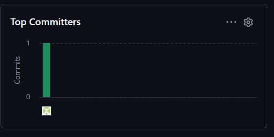

También, se adjunta el gráfico del avance realizado por cada rama de funcionalidades en el Landing Page. En este gráfico se puede observar el flujo de desarrollo del sitio web estático, donde cada rama representa una sección específica implementada durante el sprint.

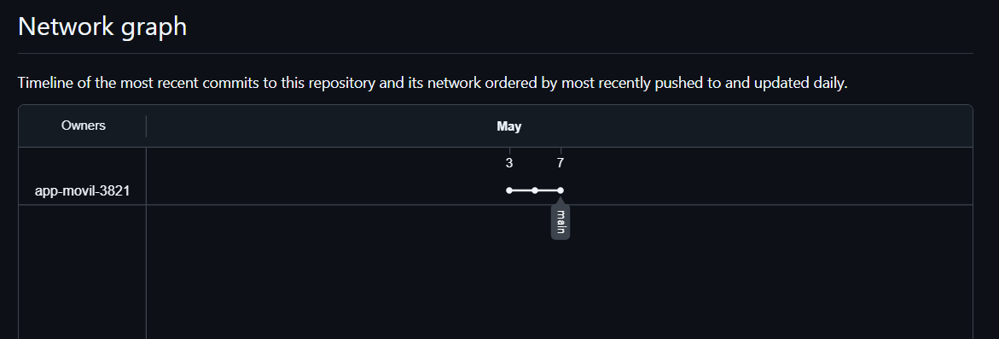

---

### Backend API

- El integrante **Sebastián Córdova** lideró el desarrollo del backend, implementando los endpoints principales de la aplicación usando Java con Spring Boot y MongoDB. Desarrolló los controllers de usuarios (IAM Context), trabajos (Job Context), postulaciones (Enrollment) y reseñas (Reviews). Además, se encargó del despliegue del backend en **Railway** y la configuración de la base de datos en **MongoDB Atlas**.

A continuación, se muestra el gráfico que detalla la cantidad de commits realizados por cada miembro durante este sprint para el backend. El gráfico refleja el aporte de cada integrante en el avance de la primera versión del Backend API.

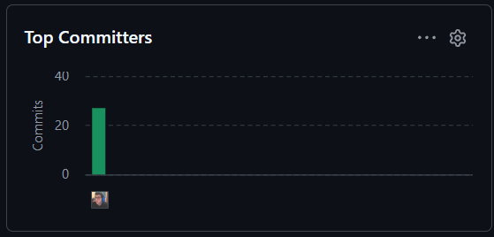

También, se adjunta el gráfico del avance por ramas en el repositorio del backend, donde cada rama representa una funcionalidad específica implementada durante el sprint, incluyendo los bounded contexts de IAM, Jobs, Enrollments y Reviews.

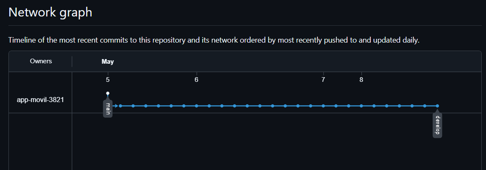


---

### Aplicación Móvil Android

- El integrante **Jorge Taipe** desarrolló las pantallas de Start (Splash), Login, Register, Skills y Home Feed, estableciendo la navegación principal de la aplicación.
- El integrante **Sebastián Córdova** desarrolló las pantallas de Job Details y Active Shift, relacionadas con la visualización y gestión de turnos activos.
- El integrante **Jhoan Janampa** desarrolló las pantallas de Apply, Shift Summary, My Shifts y Chat, cubriendo el flujo de postulación y comunicación entre usuarios.
- El integrante **Jose Diego Bautista** desarrolló las pantallas de detalle de trabajo con mapa y la vista de lista de turnos del usuario.
- El integrante **Moisés Espinoza** colaboró en la documentación del reporte, específicamente en la sección 4.3 de Validation Interviews.

A continuación, se muestra el gráfico que detalla la cantidad de commits realizados por cada miembro durante este sprint para la aplicación móvil Android. El gráfico refleja el aporte de cada integrante en el avance de la primera versión de la aplicación.

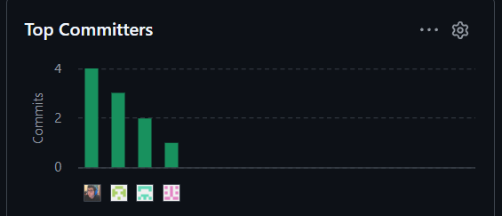

También, se adjunta el gráfico del avance por ramas en el repositorio de la aplicación Android, donde cada rama representa las pantallas y funcionalidades implementadas durante el sprint.

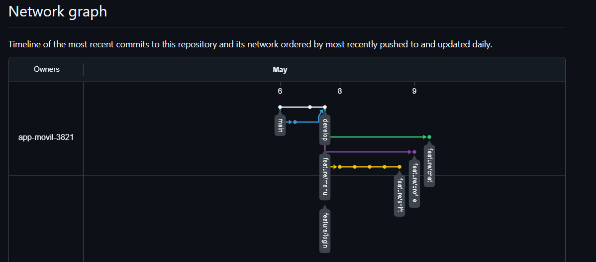

---

### Reflexión del equipo

Finalmente, el equipo realizó una reflexión sobre el primer sprint, destacando la buena coordinación y comunicación constante entre los miembros, lo que permitió el desarrollo simultáneo y eficiente de los tres componentes principales: el Backend API, la aplicación móvil nativa para Android y el Landing Page.

Se identificaron áreas de mejora en la planificación de la integración entre la aplicación móvil y el backend, así como la necesidad de realizar pruebas más exhaustivas de los endpoints antes de cada entrega. El equipo valoró positivamente el uso de herramientas como **GitHub** para el control de versiones, **Railway** para el despliegue del backend, **MongoDB Atlas** para la base de datos y **GitHub Pages** para el Landing Page, lo que facilitó la colaboración y el seguimiento del progreso del proyecto.

El equipo considera este avance como fundamental para la continuidad del proyecto, destacando la importancia de haber implementado exitosamente las pantallas principales de navegación de la app, los endpoints core del backend y el Landing Page completo. Se reconoce que aún quedan funcionalidades por implementar, pero se tiene confianza en que el proyecto ha sentado bases sólidas al cumplir con los objetivos establecidos para este sprint, demostrando capacidad efectiva de trabajo en equipo y gestión de diversas tecnologías.

#### 4.2.2. Sprint `2`

En esta sección se explican los procesos para el desarrollo de la solución de software en el segundo sprint. Además, se incluyen secciones de planeamiento, desarrollo, prueba y despliegue de la aplicación móvil Android nativa, el backend API y en Flutter.

##### 4.2.2.1. Sprint Planning `2

A continuación, se detalla la información sobre el planeamiento del segundo sprint. El objetivo de este sprint se enfoca en el despliegue de la aplicación móvil Android nativa, junto con las pantallas principales y funcionales de la aplicación, los endpoints backend API con un avance al 100%, y las primeras pantallas funcionales de la aplicacion móvil en Flutter.

| Sprint #                   | Sprint 2                                                                                                                                                                                                                                                                                                                                                                                                                                                                                     |
|----------------------------|----------------------------------------------------------------------------------------------------------------------------------------------------------------------------------------------------------------------------------------------------------------------------------------------------------------------------------------------------------------------------------------------------------------------------------------------------------------------------------------------| 
| Sprint planning Background | --                                                                                                                                                                                                                                                                                                                                                                                                                                                                                           | 
| Date                       | 2026/05/27                                                                                                                                                                                                                                                                                                                                                                                                                                                                                   | 
| Time                       | 3:00 pm                                                                                                                                                                                                                                                                                                                                                                                                                                                                                      | 
| Location                   | Reunion en meet                                                                                                                                                                                                                                                                                                                                                                                                                                                                              | 
| Prepared By                | Taipe Sangama Jorge Francisco                                                                                                                                                                                                                                                                                                                                                                                                                                                                | 
| Attendes                   | Taipe Sangama Jorge Francisco / Cordova Valdivia Sebastian / 	Janampa Gutierrez Jhoan D.  / Bautista, Jose Diego /  Espinoza Chavez Moises                                                                                                                                                                                                                                                                                                                                                   | 
| Sprint Goal & User Stories |                                                                                                                                                                                                                                                                                                                                                                                                                                                                                              | 
| Sprint 1 Goal              | Nuestro enfoque está en desarrollar y desplegar la aplicación móvil Android nativa, avanzar en un 100% los endpoints del backend API y tener las primeras pantallas funcionales de la aplicacion móvil en Flutter. Creemos que esto entrega una base funcional y visible del producto a los stakeholders. Esto se confirmará cuando la aplicación móvil Android nativa esté desplegada, y el backend responda correctamente a todas las solicitudes HTTP.| 
| Sprint 1 Velocity          | 40                                                                                                                                                                                                                                                                                                                                                                                                                                                                                           | 
| Sums of Story Points       | 40                                                                                                                                                                                                                                                                                                                                                                                                                                                                                           | 


**Aspect Liders and Colaborators**

En esta sección se incluye la matriz de liderazgo y colaboración para este sprint. La letra "L" indica que el miembro es líder del aspecto y se encarga de avanzar y revisar el trabajo de los colaboradores. La letra "C" indica que el miembro es colaborador y se encarga de desarrollar las funcionalidades asignadas.

| Team Member                    | GitHub Usernames  | App Android | Backend API | Reporte |
|--------------------------------|------------------ |-------------|-------------|---------|
| Cordova Valdivia Sebastian     | Sevas04           | C           | C           | C       |
| Bautista Rivera Jose Diego     | Gogotes17         | L           |             | C       |
| Janampa Gutierrez Jhoan D.     | orraiAKBDFSK      | C           |             | C       |
| Taipe Sangama Jorge Francisco  | CamotinFurious    | L           |             | L       |
| Espinoza Chavez Moises         | MoisesECh         | C           |             | C       |


##### 4.2.2.2. Sprint Backlog `2`

El objetivo principal de este sprint es tener una versión funcional y desplegada del Landing Page, la navegación principal de la aplicación móvil Android con las pantallas core implementadas, y los endpoints principales del backend funcionando y documentados en Swagger.


Proyecto en Enlace al tablero de Trello: [Link de TRELLO](https://trello.com/invite/b/69e581bada404d81ccde530d/ATTI42a1d93366631bcc58f2fbcf4f6b8734D6B33942/product-backlog-chambaya)


A continuación, se presenta la tabla con las User Stories y tareas del Sprint 1:


| Sprint 1     | Sprint Backlog1 |                  |        |                                                                      |                    |              |        |
|--------------|-----------------|------------------|--------|----------------------------------------------------------------------|--------------------|--------------|--------|
| User Stories |                 | Work-Item / Task | Title  | Description                                                          | Estimation (Hours) | Assigned to  | Status |
| US01         |                 | T01              |  |                      | 4h                 |  | Done |
|          |                 |               |  |                   |                  |  |  |
|          |                 |               |  |  |                  | |  |
|          |                 |               |  |           |                  | | |
|          |                 |               |  |            |                  ||  |
|          |                 |               |  |             |                  | |  |
|          |                 |               |  |                 |                  | |  |
|          |                 |               |  |              |                  |  |  |
|          |                 |               |  |                      |                  |  |  |
|          |                 |              |  |                   |                  |  |  |
|          |                 |              |  |        |                  |  |  |
|          |                 |              |  |                            |                  |  |  |
|          |                 |              |  |          |                  ||  |
|          |                 |              |  |     |                  ||  |
|          |                 |              |  |         |                  |  |  |
|          |                 |              |  |        |                  |  |  |
|          |                 |              |  |              |                  |  |  |
|          |                 |              |  |             |                  |  |  |


##### 4.2.2.3. Development Evidence for Sprint Review
##### 4.2.2.4. Testing Suite Evidence for Sprint Review
##### 4.2.2.5. Execution Evidence for Sprint Review
##### 4.2.2.6. Services Documentation Evidence for Sprint Review
##### 4.2.2.7. Software Deployment Evidence for Sprint Review
##### 4.2.2.8. Team Collaboration Insights during Sprint 2


### 4.3. Validation Interviews
#### 4.3.1. Diseño de Entrevistas

En esta sección se definen los elementos y procesos que serán evaluados por los usuarios de ambos segmentos objetivos (Jóvenes y Contratantes) durante las sesiones de validación. El objetivo es medir la claridad de la propuesta de valor y la usabilidad del prototipo.

Elementos a incluir en la validación

- Landing Page: Se presentará para validar si el mensaje de "solución de urgencias laborales" y el modelo "sin CV" se entiende correctamente en los primeros segundos.

- Aplicación Móvil (Prototipo ChambaYA): Se evaluará el prototipo de alta fidelidad, permitiendo al usuario interactuar con las interfaces diseñadas para ambos roles (Trabajador y Contratante).

Flujos a validar:

- User Flow 1: Registro e Inicio de Sesión <br>
Validación de la creación de cuenta, verificación telefónica y, especialmente, la personalización del perfil basada en habilidades (tags) en lugar de carga de archivos.

- User Flow 2: Publicación de Trabajos: <br>
Uso del mapa con geolocalización, búsqueda de vacantes y proceso de postulación rápida.

- User Flow 3: Comunicación (chat) <br>
Interacción en tiempo real entre ambos segmentos para coordinar detalles del turno una vez aceptada la aplicación.

- User Flow 4: Gestión de Perfil <br>
Visualización y edición de información personal, habilidades y experiencia acumulada dentro de la app.

- User Flow 5: Gestión de Turnos <br>
Control de turnos activos, historial de trabajos pasados y visualización de compromisos futuros.

- User Flow 6: Notificaciones y Soporte <br>
Recepción de alertas críticas (nuevas vacantes o aplicaciones) y acceso al centro de ayuda para resolución de problemas o contacto con soporte.


#### 4.3.2. Registro de Entrevistas

En esta sección se muestran los registros de las entrevistas de validación. Cada una de ellas contiene informacion correspondiente a los elementos incluidos, como información acerca del entrevistador, entrevistado, duración y resumen.

<table>
<colgroup>
</colgroup>
<thead>
  <tr>
    <th colspan="2">Entrevista #1<br></th>
  </tr>
</thead>
<tbody>
  <tr>
    <td>Nombre</td>
    <td>Jeremy</td>
  </tr>
  <tr>
    <td>Apellidos</td>
    <td>Parra </td>
  </tr>
  <tr>
    <td>Edad</td>
    <td>23</td>
  </tr>
 
  <tr>
    <td>Evidencia</td>
    <td><div align="center"></td>
  </tr>
  <tr>
    <td>Link</td>
    <td>
      <a href="https://upcedupe-my.sharepoint.com/:v:/g/personal/u202221383_upc_edu_pe/IQDPU7cZ_kcfSZ4cIvH0LPlfAYKnvJRUfUfIfkdLbLjTaKM?e=2xxAAI&nav=eyJyZWZlcnJhbEluZm8iOnsicmVmZXJyYWxBcHAiOiJTdHJlYW1XZWJBcHAiLCJyZWZlcnJhbFZpZXciOiJTaGFyZURpYWxvZy1MaW5rIiwicmVmZXJyYWxBcHBQbGF0Zm9ybSI6IldlYiIsInJlZmVycmFsTW9kZSI6InZpZXcifSwicGxheWJhY2tPcHRpb25zIjp7fX0%3D" target="_blank">
    Videos entrevistas
  </a>
</td>
  </tr>
    <td>Timing donde inicia la entrevista<br></td>
    <td>00:00 min</td>
  </tr>
  <tr>
    <td>Duración de la entrevista<br></td>
    <td>11:11 min</td>
  <tr>
    <td>Resumen</td>
    <td> La entrevista se realizó a Jeremy Parra (23 años), para validar y dar a conocer los flujos de nuestra propuesta, flujos como el registro, el de la aplicacion al trabajo, chat, gestión de turnos y notificaciones. El entrevistado mencionó que la información mostrada en el flujo de la aplicación a un trabajo es suficiente para elegir postular, destacó la funcionalidad de la ubicación, que era útil para dirigirnos al lugar y ubcarnos de manera rápida. También destacó el apartado de chat, ya que la comunicación era directa con el empleador. También mencionó, que es muy necesario que la aplicación te notifique acerca de turnos nuevos cercanos a tu ubicación. Asimismo, destacó el apartado de turnos, que era información importante que se debería mostrar para que se lleve un registro o control de los trabajos completados.
</td>
  </tr>
</tbody>
</table>


<table>
<colgroup>
</colgroup>
<thead>
  <tr>
    <th colspan="2">Entrevista #2<br></th>
  </tr>
</thead>
<tbody>
  <tr>
    <td>Nombre</td>
    <td>Eirthon</td>
  </tr>
  <tr>
    <td>Apellidos</td>
    <td>Reyes</td>
  </tr>
  <tr>
    <td>Edad</td>
    <td>25</td>
  </tr>
  <tr>
    <td>Evidencia</td>
    <td><div align="center"></td>
  </tr>
  <tr>
    <td>Link</td>
    <td>
      <a href="https://upcedupe-my.sharepoint.com/:v:/g/personal/u202221383_upc_edu_pe/IQDPU7cZ_kcfSZ4cIvH0LPlfAYKnvJRUfUfIfkdLbLjTaKM?e=VAqTcm&nav=eyJyZWZlcnJhbEluZm8iOnsicmVmZXJyYWxBcHAiOiJTdHJlYW1XZWJBcHAiLCJyZWZlcnJhbFZpZXciOiJTaGFyZURpYWxvZy1MaW5rIiwicmVmZXJyYWxBcHBQbGF0Zm9ybSI6IldlYiIsInJlZmVycmFsTW9kZSI6InZpZXcifSwicGxheWJhY2tPcHRpb25zIjp7InN0YXJ0VGltZUluU2Vjb25kcyI6NjcyLjUxfX0%3D" target="_blank">
    Videos entrevistas
     </a>
    </td>
  </tr>
    <td>Timing donde inicia la entrevista<br></td>
    <td>11:12 min</td>
  </tr>
  <tr>
    <td>Duración de la entrevista<br></td>
    <td>08:26 min</td>
  <tr>
    <td>Resumen</td>
    <td> Se realizó la entrevista de validacion a Eirthon Reyes (25 años), con el objetivo de presentar y validar los flujos de gestión de turnos, perfil de trabajador, chat y notificaciones. Mencionó que al ingresar al apartado de gestión de turnos se sintió un poco abrumado por la cantidad de elementos que aparecen. lo que le dificultaba una lectura rápida, por lo que sería útil ajustar el contenido para mejorar la visualización. Destacó que le generaba confianza el perfil del trabajador sin necesidad de cv, ya que ha tenido que estar registrado para poder postular y trabajar en la app, además de la visualización de sus habilidades.También notó que no existe una flecha de retroceso ni una opción clara para "ir hacia atrás" en el apartado de mis turnos, por lo que sería recomendable una flecha de retorno visible en la esquina, que permita regresar a la pantalla anterior de forma intuitiva. Asimismo, identificó que los íconos de Home, Chat y Perfil eran intuitivos, pero que el ícono de "Shifts" (Turnos) en la barra inferior no se entendía tan bien por sí solo, ya que intentaba abarcar demasiadas funciones, lo que genera incertidumbre sobre qué se encontrará al hacer clic, a lo que recomendó separar las funciones en iconos más específicos para evitar la ambigüedad.
</td>
  </tr>
</tbody>
</table>


<table>
<colgroup>
</colgroup>
<thead>
  <tr>
    <th colspan="2">Entrevista #3<br></th>
  </tr>
</thead>
<tbody>
  <tr>
    <td>Nombre</td>
    <td>Italo</td>
  </tr>
  <tr>
    <td>Apellidos</td>
    <td>Sobrado</td>
  </tr>
  <tr>
    <td>Edad</td>
    <td>21</td>
  </tr>
  <tr>
    <td>Evidencia</td>
    <td><div align="center"></td>
  </tr>
  <tr>
    <td>Link</td>
   <td>
      <a href="https://upcedupe-my.sharepoint.com/:v:/g/personal/u202221383_upc_edu_pe/IQDPU7cZ_kcfSZ4cIvH0LPlfAYKnvJRUfUfIfkdLbLjTaKM?e=7PJMnC&nav=eyJyZWZlcnJhbEluZm8iOnsicmVmZXJyYWxBcHAiOiJTdHJlYW1XZWJBcHAiLCJyZWZlcnJhbFZpZXciOiJTaGFyZURpYWxvZy1MaW5rIiwicmVmZXJyYWxBcHBQbGF0Zm9ybSI6IldlYiIsInJlZmVycmFsTW9kZSI6InZpZXcifSwicGxheWJhY2tPcHRpb25zIjp7InN0YXJ0VGltZUluU2Vjb25kcyI6MTE3OC43M319" target="_blank">
    Videos entrevistas
     </a>
    </td>
  </tr>
    <td>Timing donde inicia la entrevista<br></td>
    <td> 19:38 min</td>
  </tr>
  <tr>
    <td>Duración de la entrevista<br></td>
    <td> 9:02 min</td>
  <tr>
    <td>Resumen</td>
    <td> El entrevistado Italo Sobrado (21 años) destacó el registro rapido y accesible para los jóvenes que quieran encontrar trabajos disponibles que no requieran cv ni tanta experiencia. Mencionó además que la información mostrada en el apartado de aplicación de trabajo resulta suficiente y necesaria, pero que para que esté mas completa necesitaría de reseñas por parte de los trabajadores para conocer mejor el trabajo y conocer al empleador desde el punto de vista de ellos. Por último mencionó que una opción de filtrar los lugares para  los trabajos disponibles o implementar inteligencia artifical en la parte de la búsqueda por mapa le ayudaria a elegir mucho más rápido un trabajo, filtrando los trabajos disponibles cercanos.
</td>
  </tr>
</tbody>
</table>

#### 4.3.3. Evaluaciones según Heurísticas


**SITE o APP A EVALUAR:**
ChambaYa

El alcance de esta evaluación incluye la revisión de la usabilidad de las siguientes tareas:
Registro de usuario nuevo basado en etiquetas de habilidades.

Personalización del perfil (descripción y experiencia).

1. Búsqueda de ofertas de trabajo mediante mapa con geolocalización.
2. Postulación a un turno laboral de emergencia.
3. Publicación de una vacante urgente (flujo del contratante).
4. Uso del chat interno para coordinación.
5. Visualización y gestión de turnos activos/pasados.
6. Envío de reporte de problemas en la sección de ayuda.

No están incluidas en esta versión de la evaluación las siguientes tareas:
1. Pasarela de pagos y facturación electrónica.
2. Sistema de referidos o bonos por cumplimiento.
3. Configuración avanzada de privacidad y datos.


**ESCALA DE SEVERIDAD:**
Los errores serán puntuados tomando en cuenta la siguiente escala de severidad
| Nivel | Descripción |
|-----|-----------|
| 1 | Problema superficial: puede ser fácilmente superador por el usuario ó ocurre con muy poco frecuencia. No necesita ser arreglado a no ser que exista disponibilidad de tiempo. |
| 2 | Problema menor: puede ocurrir un poco más frecuentemente o es un poco más difícil de superar para el usuario. Se le debería asignar una prioridad baja resolverlo de cara al siguiente release |
| 3 | Problema mayor: ocurre frecuentemente o los usuarios no son capaces de resolverlos. Es importante que sean corregidos y se les debe asignar una prioridad alta. |
| 4 | Problema muy grave: un error de gran impacto que impide al usuario continuar con el uso de la herramienta. Es imperativo que sea corregido antes del lanzamiento. |


**TABLA RESUMEN:**
| # | Problema | Escala de severidad | Heurística/Principio violado(a) |
|--|-------|-------------------|-------------------------------|
| 1 | Sobrecarga de información y falta de jerarquía visual  | 2 | Usabilidad - Diseño estético y minimalista. |
| 2 | Ausencia de controles de navegación de retorno (Back button) | 3 | Usabilidad - Libertad y control del usuario |
| 3 | Iconografía ambigua y falta de estándares en la barra de navegación  | 2 | Usabilidad - Consistencia y estándares. |


**DESCRIPCIÓN DE PROBLEMAS:**

PROBLEMA 1: Sobrecarga de información y falta de jerarquía visual

Severidad: 2

Heurística violada: Usabilidad - Diseño estético y minimalista.

Problema: Al interactuar con la pantalla, el usuario manifestó sentirse abrumado por la cantidad de elementos que aparecen de golpe al entrar al apartado. Indicó que la información no está categorizada, lo que dificulta una lectura rápida y genera confusión visual.

Recomendación: Aplicar una mejor arquitectura de información separando el contenido en áreas o secciones claramente diferenciadas. Utilizar el principio de "progresividad" para no mostrar todo el contenido en una sola vista.

---


PROBLEMA 2: Ausencia de controles de navegación de retorno (Back button)

Severidad: 3

Heurística violada: Usabilidad - Libertad y control del usuario.

Problema: En el flujo evaluado, el usuario notó que no existe una flecha de retroceso ni una opción clara para "ir hacia atrás". Esto genera una sensación de encierro en la pantalla actual, obligando al usuario a reiniciar la app o usar botones externos del sistema que podrían romper el flujo.

Recomendación: Incluir una flecha de retorno visible en la esquina superior izquierda (TopAppBar) que permita al usuario regresar a la pantalla anterior de forma intuitiva.

---

PROBLEMA 3: Iconografía ambigua y falta de estándares en la barra de navegación

Severidad: 2

Heurística violada: Usabilidad - Consistencia y estándares.

Problema: El usuario identificó correctamente los iconos de Home, Chat y Perfil, pero reportó que el icono de "Shifts" (Turnos) en la barra inferior es demasiado complejo y no se entiende por sí solo. Mencionó que el icono intenta abarcar demasiadas funciones, lo que genera incertidumbre sobre qué se encontrará al hacer clic.

Recomendación: Rediseñar el icono de "Shifts" utilizando una metáfora visual más simple y estándar (como un calendario o reloj de turno). Alternativamente, separar las funciones en iconos más específicos para evitar la ambigüedad.
